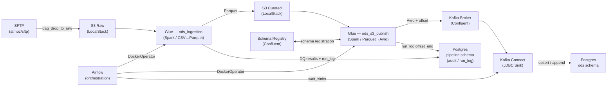

# Aviva ODS — Operational Data Store

> A local-first data platform that ingests insurance source files from SFTP, processes them through Spark/Glue, publishes Avro messages to Kafka, and sinks them into Postgres via Kafka Connect JDBC.

## Overview

The ODS platform implements a repeatable ingestion pipeline for insurance domain data. Files arrive on SFTP, are transferred to S3 (LocalStack), processed by a Spark/Glue job that validates, curates, and writes Parquet, then published as Avro messages to Kafka. A Kafka Connect JDBC sink writes the final records into Postgres. Airflow orchestrates every stage; run metadata is written to a `pipeline` schema audit trail throughout.

The full flow:

```
SFTP → S3 Raw → Glue (CSV→Parquet, DQ) → S3 Curated → Glue (Parquet→Avro→Kafka) → Kafka Connect JDBC → Postgres
```

## Architecture



### DAG task order

```
init_run → stage_ingest (DockerOperator) → stage_publish (DockerOperator) → wait_sinks → finalise
```

## Ingestion Patterns

| Pattern | `write_mode` | Use case | Key fields | Kafka topic | Postgres target |
|---|---|---|---|---|---|
| single-daily | `upsert` | One full-replacement file per business date (policies master) | `policy_id` | `ods.insurance.policies` | `ods.insurance_policies` |
| append | `append` | Immutable event log — rows only ever added | _(none)_ | `ods.insurance.events_append` | `ods.events_append` |
| upsert | `upsert` | Incremental delta — later files overwrite same key | `policy_id` | `ods.insurance.policies_upsert` | `ods.policies_upsert` |
| multi-slot-merge | `replace` | Partitioned slot files merged into a single daily snapshot | slot fields | _(dataset-specific)_ | _(dataset-specific)_ |

Dataset behaviour is declared in `datasets/<domain>/<dataset>.yaml`. Adding a new dataset requires only a YAML file and a Postgres migration — no code changes.

## Infrastructure

| Service | Image | Host port | Purpose |
|---|---|---|---|
| `localstack` | `localstack/localstack:3.4` | `4566` | S3-compatible object store (raw + curated buckets) |
| `broker` | `confluentinc/cp-kafka:7.6.0` | `9092` | Kafka broker |
| `zookeeper` | `confluentinc/cp-zookeeper:7.6.0` | _(internal)_ | Kafka coordination |
| `schema-registry` | `confluentinc/cp-schema-registry:7.6.0` | `8081` | Confluent Schema Registry (Avro) |
| `kafka-connect` | custom build | `8083` | Kafka Connect worker — JDBC sink to Postgres |
| `postgres` | `postgres:15` | `5440` | ODS data store + Airflow metadata + pipeline audit |
| `airflow-webserver` | `apache/airflow:2.9.1-python3.10` | `8080` | Airflow UI |
| `airflow-scheduler` | `apache/airflow:2.9.1-python3.10` | _(internal)_ | DAG scheduler |
| `glue` | `ods-glue:local` (local build) | _(none)_ | Spark/Glue image; spawned per-job by DockerOperator |
| `sftp` | `atmoz/sftp:latest` | `2222` | Source SFTP server |
| `grafana` | `grafana/grafana:10.4.2` | `3000` | Observability dashboards |

> **Note**: Run the stack from within the WSL2 filesystem (e.g. `~/aviva-ods`), not from a Windows NTFS path. Bind mounts on `/mnt/c/...` paths cause 5-10x slower I/O and break the Airflow DAG scanner.

## Key Tables and Topics

### Kafka topics

| Topic | Pattern | Description |
|---|---|---|
| `ods.insurance.policies` | upsert | Full policy master snapshot per business date |
| `ods.insurance.policies_upsert` | upsert | Incremental policy delta |
| `ods.insurance.events_append` | append | Insurance event log |
| `ods.pipeline.run_events` | append | Pipeline lifecycle events (run_started / run_succeeded / run_partial) |

### Postgres tables

| Schema | Table | Purpose |
|---|---|---|
| `ods` | `insurance_policies` | Landed policy master records |
| `ods` | `policies_upsert` | Landed upsert delta records |
| `ods` | `events_append` | Landed event log records |
| `pipeline` | `dataset_config` | Dataset YAML config synced to DB |
| `pipeline` | `file_catalogue` | File registry with state tracking |
| `pipeline` | `file_state` | Per-S3-path processing state |
| `pipeline` | `run_log` | Per-run header (status, Kafka offset bounds) |
| `pipeline` | `run_stage_log` | Per-stage audit rows (ingest / publish / sink_pg / sink_s3) |
| `pipeline` | `recon_log` | T0 publish-count reconciliation results |

## Quick Start

### Prerequisites

- Docker Desktop with WSL2 backend enabled
- WSL2 filesystem clone of this repository (see note above)
- `.env` file at the repo root with `AIRFLOW_FERNET_KEY` set

### 1. Build images and start the stack

```bash
# Build the Glue Spark image first
docker compose build glue

# Start all services
docker compose up -d

# Tail logs until all services report healthy (typically ~2 minutes)
docker compose ps
```

### 2. Verify services are healthy

```bash
# Schema Registry
curl -s http://localhost:8081/subjects

# Kafka Connect
curl -s http://localhost:8083/connectors

# Airflow
open http://localhost:8080   # admin / admin
```

### 3. Register Avro schemas

Schemas are registered automatically by the Glue publish job on first run. To register manually:

```bash
# Example: register policies schema
curl -X POST http://localhost:8081/subjects/ods.insurance.policies-value/versions \
  -H "Content-Type: application/vnd.schemaregistry.v1+json" \
  -d @schemas/insurance_policies.json
```

### 4. Trigger an ingestion run

Drop a file to SFTP (port `2222`, user `ods`) or trigger `dag_drop_to_raw` manually via the Airflow UI, then `dag_ingest` will be triggered automatically with the file metadata passed via `dag_run.conf`.

```bash
# Manual trigger via Airflow CLI (inside the scheduler container)
docker compose exec airflow-scheduler airflow dags trigger dag_ingest \
  --conf '{"file_id":"<uuid>","domain":"insurance","dataset":"policies","business_date":"20260430"}'
```

### 5. Monitor

- Airflow UI: http://localhost:8080
- Grafana dashboards: http://localhost:3000 (admin / admin)
- Kafka Connect status: http://localhost:8083/connectors/jdbc-sink-policies/status

## Running Tests

### Integration tests

Tests require the full stack to be running (`docker compose up -d`).

```bash
# Install test dependencies
pip install pytest psycopg2-binary boto3 confluent-kafka fastavro requests

# Run the full integration suite
pytest tests/integration/ -v

# Run a specific test file
pytest tests/integration/test_policies_e2e.py -v

# Run with output captured (useful for CI)
pytest tests/integration/ -v --tb=short 2>&1 | tee test_results.txt
```

Test results from the last run are saved to `test_results.txt` in the repo root.

### What the integration tests cover

- End-to-end file ingestion from S3 raw through to Postgres (`test_policies_e2e.py`)
- DQ rule enforcement (hard failures block the run; soft failures are logged)
- Kafka offset tracking and sink wait logic
- Run log audit trail correctness (all stages recorded with correct status)
