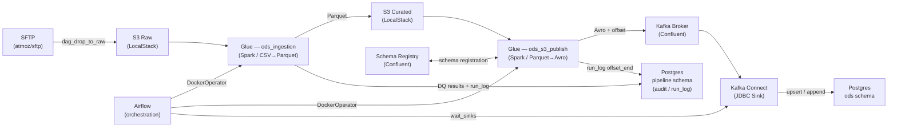
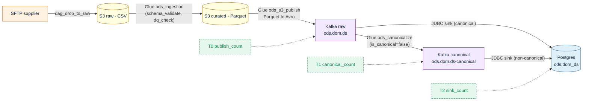
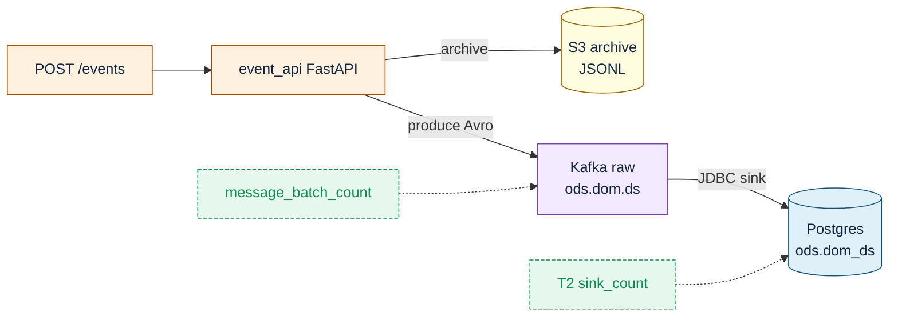
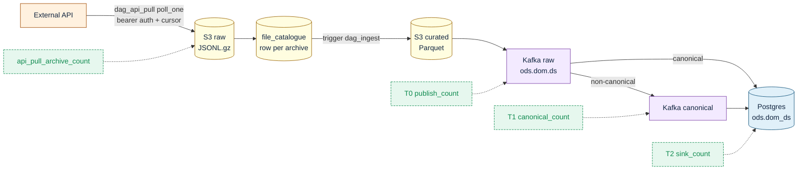
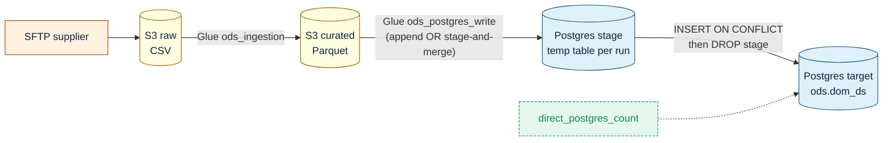

# Aviva ODS — Operational Data Store

> A local-first data platform that ingests insurance source files from SFTP, processes them through Spark/Glue, publishes Avro messages to Kafka, and sinks them into Postgres via Kafka Connect JDBC.

## Overview

The ODS platform implements a repeatable ingestion pipeline for insurance domain data. Files arrive on SFTP, are transferred to S3 (LocalStack), processed by a Spark/Glue job that validates, curates, and writes Parquet, then published as Avro messages to Kafka. A Kafka Connect JDBC sink writes the final records into Postgres. Airflow orchestrates every stage; run metadata is written to a `pipeline` schema audit trail throughout.

The full flow:

```
SFTP → S3 Raw → Glue (CSV→Parquet, DQ) → S3 Curated → Glue (Parquet→Avro→Kafka) → Kafka Connect JDBC → Postgres
```

## Architecture



### DAG task order

```
init_run → stage_ingest (DockerOperator) → stage_publish (DockerOperator) → wait_sinks → finalise
```

## Ingestion Patterns

ODS supports five delivery shapes. Pick the right one per dataset via
`source_type` (where the bytes come from) and `delivery` (how they
reach Postgres). Each diagram below shows actors, stores, and recon
gates; deeper design and operator runbooks live in `docs/`.

### Patterns at a glance

| # | Source | Delivery | Latency | Recon gates | Build status | Design |
|---|---|---|---|---|---|---|
| 1 | `s3_batch` (file) | `file_pipeline` (default) | minutes | T0 publish · T1 canonical · T2 sink | live | this README |
| 2 | message API | (inline event_api) | seconds | message_batch_count | live | `docs/architecture-decision-pack.md` |
| 3 | `api_pull` | `file_pipeline` (default) | minutes | api_pull_archive_count · T0 · T1 · T2 | live | `docs/api-pull-ingestion-design.md` |
| 4 | `api_pull` | `direct_kafka` | seconds | api_pull_publish_count · T2 (sink-lag) | live | `docs/api-pull-direct-kafka-design.md` |
| 5 | `s3_batch` (file) | `direct_postgres` | minutes | direct_postgres_count | live | `docs/file-direct-postgres-design.md` |

Reconciliation legend:

- **T0 publish** — curated rows == raw Kafka offsets produced.
- **T1 canonical** — raw Kafka == canonical Kafka (only when `is_canonical=false`).
- **T2 sink** — canonical Kafka (or raw, when canonical) == Postgres rows tagged with `_ods_run_id`.
- **api_pull_archive_count** — fetched from source == archived to S3.
- **api_pull_publish_count** — fetched from source == produced to Kafka offsets.
- **message_batch_count** — accepted events == archived == published.
- **direct_postgres_count** — curated Parquet rows == Postgres rows tagged with this run.

`write_mode` (independent axis: `upsert` / `append` / `replace`) is
declared per dataset in YAML; merge logic at the sink end honours it.

| `write_mode` | Use case | Example dataset |
|---|---|---|
| `upsert` | Incremental delta — later runs overwrite same key | `insurance.policies` |
| `append` | Immutable event log — rows only ever added | `insurance.events_append` |
| `replace` | Partitioned slot files merged into a single daily snapshot | _(dataset-specific)_ |

---

### 1. File pipeline (`source_type=s3_batch`, `delivery=file_pipeline`)

The original. Files land on SFTP, get curated by Glue, published as
Avro to Kafka, and sunk to Postgres by a Kafka Connect JDBC sink.
Optional canonicalize step kicks in when `is_canonical=false` (e.g.
risk feeds with non-canonical column names).



Actors: `dag_drop_to_raw` discovers files; `dag_ingest` orchestrates
Glue ingestion + publish + canonicalize + sink wait. Control-plane
writes: `run_log`, `run_stage_log`, `file_catalogue`, `lineage_edge`
(raw_to_curated, curated_to_kafka).

---

### 2. Event push (FastAPI receiver)

Source systems POST to `services/event_api` and the handler archives
the payload to S3 and produces to Kafka in the same request. No Glue,
no Parquet step. Best for low-volume, high-frequency event streams.



Actors: `event_api` service. Control-plane writes: `run_log
(pipeline_type='message_api')`, `run_stage_log` (message_receive →
message_validate → kafka_publish → message_archive →
recon_message), `reconciliation_log (check_type='message_batch_count')`.

---

### 3. API pull → file pipeline (`source_type=api_pull`, `delivery=file_pipeline`)

Default for `api_pull` datasets. Airflow polls the source on a
schedule, archives the response as gzipped JSONL on S3, registers
the archive as a `file_catalogue` row, and triggers `dag_ingest` —
which is the same downstream as flow #1. Reuses every file-pattern
guarantee (replay, lineage, recon).



Watermark: `pipeline.api_pull_watermark` carries `committed` and
`pending` cursors; `dag_api_pull.finalise_watermark` promotes pending
to committed only after the linked `dag_ingest` parent run finishes
`succeeded`. Linkage is by deterministic `parent_run_id =
uuid5("api_pull:" + api_pull_run_id)` + a `triggered_by_api_pull`
edge in `run_log.parents` — exact PK match, no replay/race
ambiguity.

---

### 4. API pull → direct Kafka (`source_type=api_pull`, `delivery=direct_kafka`)

Low-latency variant. The poller publishes per-record Avro straight
to Kafka. A Connect S3 sink writes the archive in parallel; the JDBC
sink consumes the same topic. No Glue subprocess, no curated
Parquet, no `dag_ingest`.

```mermaid
flowchart LR
  classDef store  fill:#fffde0,stroke:#9a6300,color:#10243f
  classDef kafka  fill:#f3eaff,stroke:#7b3fa6,color:#10243f
  classDef pg     fill:#e0f0f9,stroke:#0e527a,color:#10243f
  classDef src    fill:#fff1df,stroke:#a04a00,color:#10243f
  classDef recon  fill:#e6f7ee,stroke:#0f8a4f,color:#0f8a4f,stroke-dasharray: 4 2

  EXT[External API]:::src
  RUN[ods_pipeline.ingest.api_pull_kafka.run_once\nidempotent + transactional Avro producer]:::src
  KRAW[Kafka raw\nods.dom.ds]:::kafka
  S3[(S3 archive\nParquet via Connect S3 sink)]:::store
  PG[(Postgres\nods.dom_ds)]:::pg

  EXT --> RUN
  RUN -- "produce per-record" --> KRAW
  KRAW -- "Connect S3 sink\n(time-partitioned)" --> S3
  KRAW -- "JDBC sink" --> PG

  RP[api_pull_publish_count]:::recon -.-> KRAW
  R2[T2 sink_count\n(consumer-group offset)]:::recon -.-> PG
```

Watermark commit signal flips: instead of waiting on a `dag_ingest`
parent to succeed, `finalise_watermark` waits on the JDBC sink's
consumer-group committed offsets to catch up to the produce
end-offsets. Same two-phase pending/committed cursor contract.

---

### 5. File → direct Postgres (`source_type=s3_batch`, `delivery=direct_postgres`)

For reference / lookup tables and pre-aggregated batch outputs that
do not need a Kafka leg. Reuses Glue ingestion + curated Parquet,
then writes Postgres rows directly via Spark JDBC. Kafka, Connect
sinks, and canonicalize-via-Kafka are skipped entirely.



`write_mode=upsert` uses a per-run stage table that's merged into
the target via a single transactional `INSERT ... ON CONFLICT (key_fields) DO UPDATE`,
then dropped. `write_mode=append` writes directly to the target.
Inline canonicalize handles `is_canonical=false` by re-attaching ODS
metadata after `apply_transform`. New DAG `dag_ingest_direct_postgres`
orchestrates; `dag_drop_to_raw` routes by `dataset_config.delivery`.

---

Adding a new dataset is a YAML file plus a Postgres migration — no
code changes for the supported delivery shapes. See
`docs/api-pull-onboarding.md` for the api_pull onboarding walkthrough,
and `docs/file-direct-postgres-design.md` for the equivalent
direct-postgres flow.

## Infrastructure

| Service | Image | Host port | Purpose |
|---|---|---|---|
| `localstack` | `localstack/localstack:3.4` | `4566` | S3-compatible object store (raw + curated buckets) |
| `broker` | `confluentinc/cp-kafka:7.6.0` | `9092` | Kafka broker |
| `zookeeper` | `confluentinc/cp-zookeeper:7.6.0` | _(internal)_ | Kafka coordination |
| `schema-registry` | `confluentinc/cp-schema-registry:7.6.0` | `8081` | Confluent Schema Registry (Avro) |
| `kafka-connect` | custom build | `8083` | Kafka Connect worker — JDBC sink to Postgres |
| `postgres` | `postgres:15` | `5440` | ODS data store + Airflow metadata + pipeline audit |
| `airflow-webserver` | `apache/airflow:2.9.1-python3.10` | `8080` | Airflow UI |
| `airflow-scheduler` | `apache/airflow:2.9.1-python3.10` | _(internal)_ | DAG scheduler |
| `glue` | `ods-glue:local` (local build) | _(none)_ | Spark/Glue image; spawned per-job by DockerOperator |
| `sftp` | `atmoz/sftp:latest` | `2222` | Source SFTP server |
| `grafana` | `grafana/grafana:10.4.2` | `3000` | Observability dashboards |

> **Note**: Run the stack from within the WSL2 filesystem (e.g. `~/aviva-ods`), not from a Windows NTFS path. Bind mounts on `/mnt/c/...` paths cause 5-10x slower I/O and break the Airflow DAG scanner.

## Key Tables and Topics

### Kafka topics

| Topic | Pattern | Description |
|---|---|---|
| `ods.insurance.policies` | upsert | Full policy master snapshot per business date |
| `ods.insurance.policies_upsert` | upsert | Incremental policy delta |
| `ods.insurance.events_append` | append | Insurance event log |
| `ods.pipeline.run_events` | append | Pipeline lifecycle events (run_started / run_succeeded / run_partial) |

### Postgres tables

| Schema | Table | Purpose |
|---|---|---|
| `ods` | `insurance_policies` | Landed policy master records |
| `ods` | `policies_upsert` | Landed upsert delta records |
| `ods` | `events_append` | Landed event log records |
| `pipeline` | `dataset_config` | Dataset YAML config synced to DB |
| `pipeline` | `file_catalogue` | File registry with state tracking |
| `pipeline` | `file_state` | Per-S3-path processing state |
| `pipeline` | `run_log` | Per-run header (status, Kafka offset bounds) |
| `pipeline` | `run_stage_log` | Per-stage audit rows (ingest / publish / sink_pg / sink_s3) |
| `pipeline` | `recon_log` | T0 publish-count reconciliation results |

## Quick Start

### Prerequisites

- Docker Desktop with WSL2 backend enabled
- WSL2 filesystem clone of this repository (see note above)
- `.env` file at the repo root with `AIRFLOW_FERNET_KEY` set

### 1. Build images and start the stack

```bash
# Build the Glue Spark image first
docker compose build glue

# Start all services
docker compose up -d

# Tail logs until all services report healthy (typically ~2 minutes)
docker compose ps
```

### 2. Verify services are healthy

```bash
# Schema Registry
curl -s http://localhost:8081/subjects

# Kafka Connect
curl -s http://localhost:8083/connectors

# Airflow
open http://localhost:8080   # admin / admin
```

### 3. Register Avro schemas

Schemas are registered automatically by the Glue publish job on first run. To register manually:

```bash
# Example: register policies schema
curl -X POST http://localhost:8081/subjects/ods.insurance.policies-value/versions \
  -H "Content-Type: application/vnd.schemaregistry.v1+json" \
  -d @schemas/insurance_policies.json
```

### 4. Trigger an ingestion run

Drop a file to SFTP (port `2222`, user `ods`) or trigger `dag_drop_to_raw` manually via the Airflow UI, then `dag_ingest` will be triggered automatically with the file metadata passed via `dag_run.conf`.

```bash
# Manual trigger via Airflow CLI (inside the scheduler container)
docker compose exec airflow-scheduler airflow dags trigger dag_ingest \
  --conf '{"file_id":"<uuid>","domain":"insurance","dataset":"policies","business_date":"20260430"}'
```

### 5. Monitor

- Airflow UI: http://localhost:8080
- Grafana dashboards: http://localhost:3000 (admin / admin)
- Kafka Connect status: http://localhost:8083/connectors/jdbc-sink-policies/status

## Running Tests

### Integration tests

Tests require the full stack to be running (`docker compose up -d`).

```bash
# Install test dependencies
pip install pytest psycopg2-binary boto3 confluent-kafka fastavro requests

# Run the full integration suite
pytest tests/integration/ -v

# Run a specific test file
pytest tests/integration/test_policies_e2e.py -v

# Run with output captured (useful for CI)
pytest tests/integration/ -v --tb=short 2>&1 | tee test_results.txt
```

Test results from the last run are saved to `test_results.txt` in the repo root.

### What the integration tests cover

- End-to-end file ingestion from S3 raw through to Postgres (`test_policies_e2e.py`)
- DQ rule enforcement (hard failures block the run; soft failures are logged)
- Kafka offset tracking and sink wait logic
- Run log audit trail correctness (all stages recorded with correct status)
