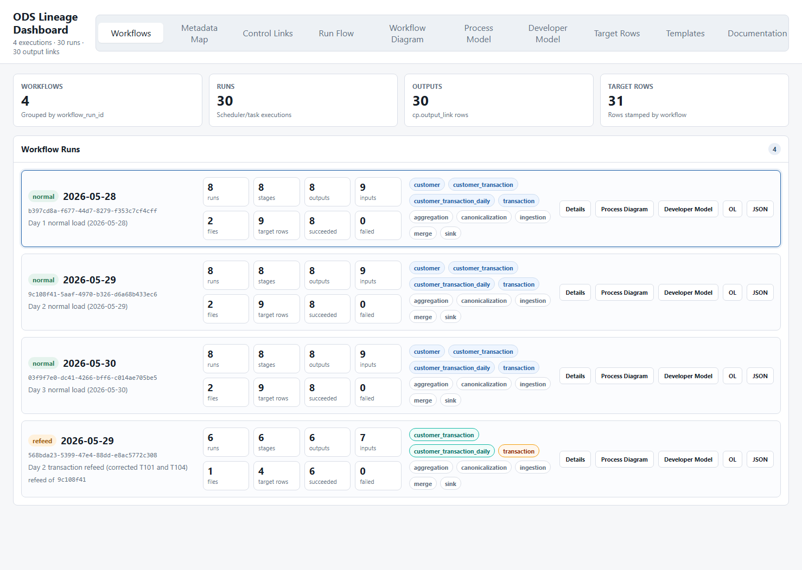
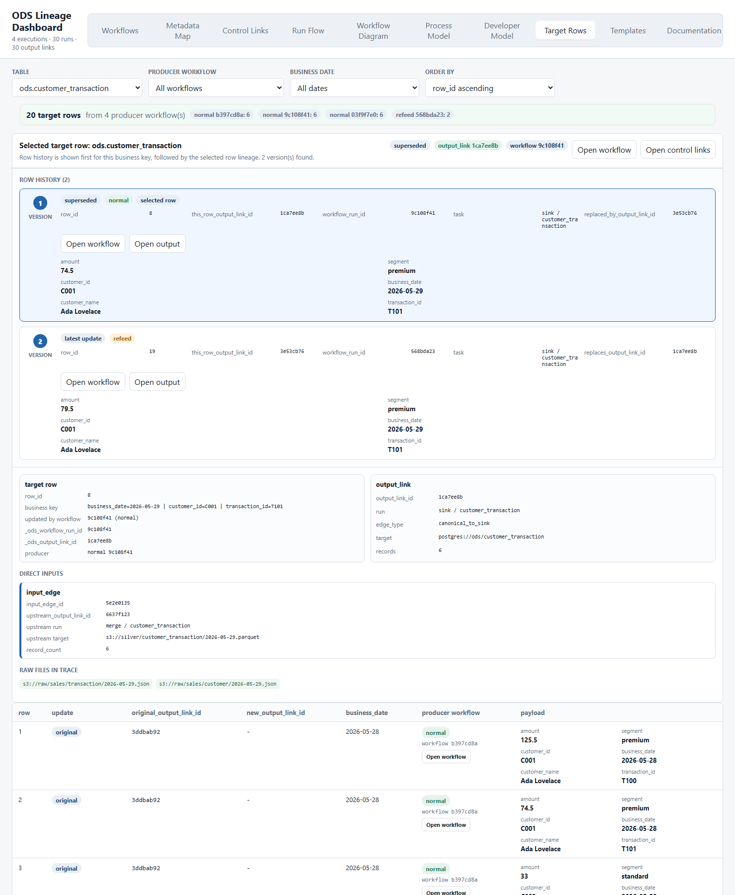
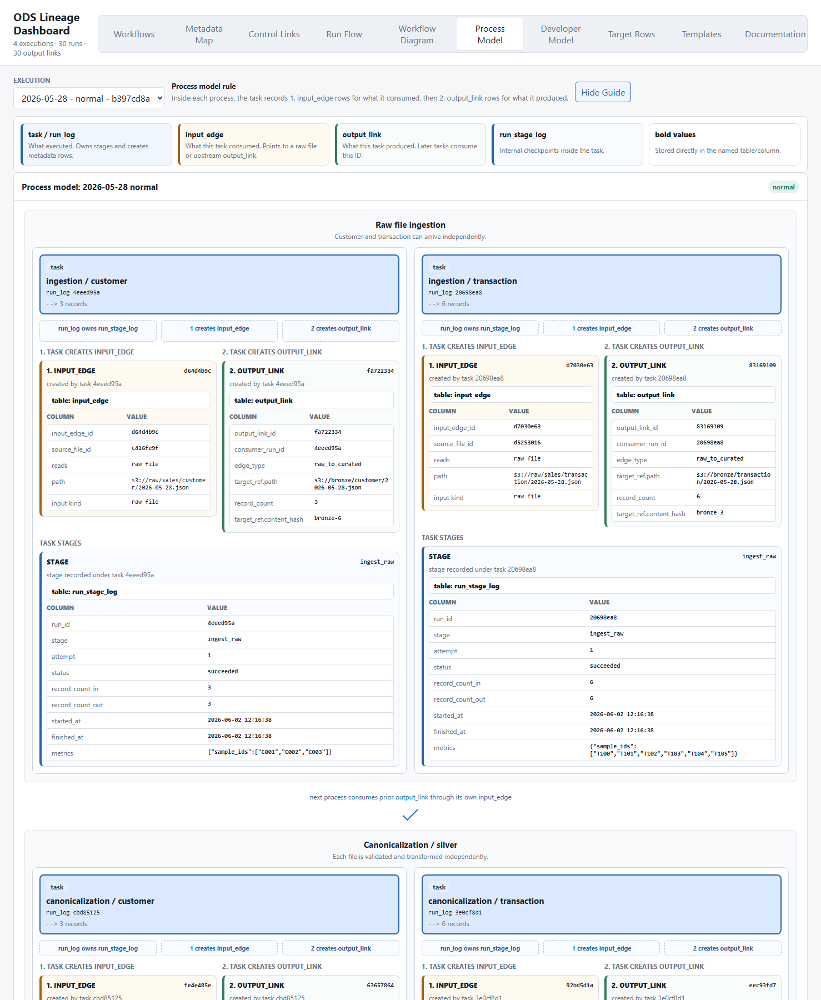
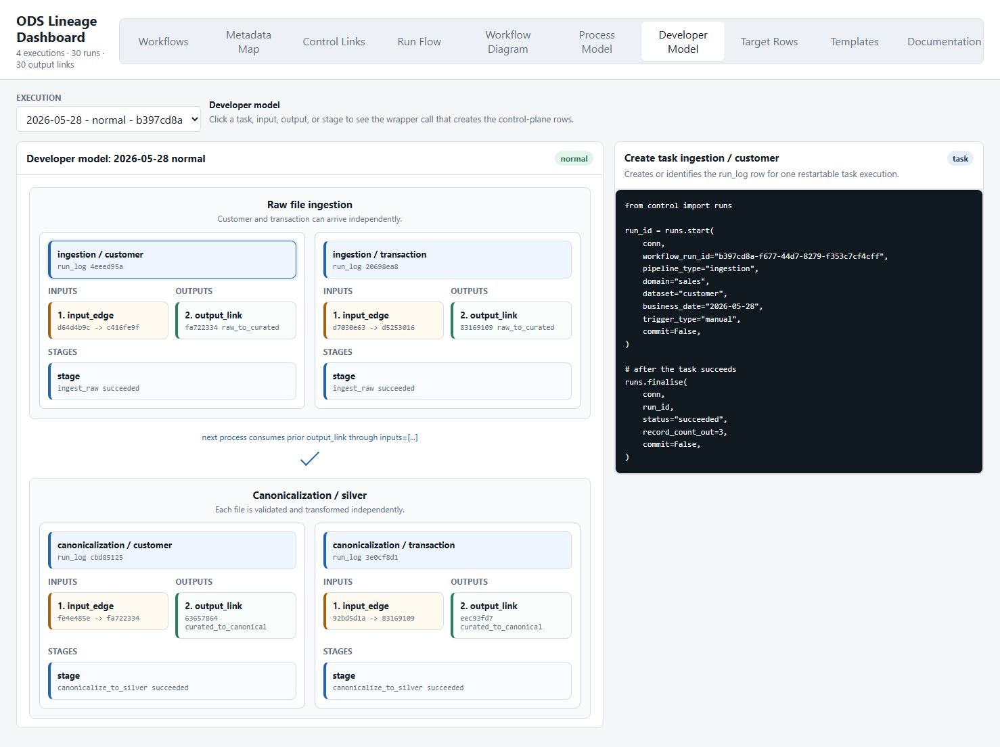

# ODS Control Plane

Spark-free control-plane prototype for ODS-style data lineage, restartability,
refeed handling, and row-level traceability.

The repository models the metadata layer that a real Airflow/Glue/Spark estate
would call into. The demo data plane is synthetic, but the control writes are
real Postgres tables, functions, and Python wrappers.

## What It Tracks

- `cp.run_log`: one logical task/run, grouped by `workflow_run_id`.
- `cp.run_stage_log`: restartable checkpoints inside a task.
- `cp.output_link`: what a run produced.
- `cp.input_edge`: what that produced output consumed.
- `cp.file_catalogue`: immutable raw file identity.
- `cp.reconciliation_log`: count and graph checks.
- target rows in `ods.*`: rows stamped with `_ods_output_link_id` and
  `_ods_workflow_run_id` so any row can be traced back to metadata.

The main design idea is simple:

`workflow_run_id` groups one execution for investigation. `output_link` and
`input_edge` provide the lineage graph across files, tasks, days, and refeeds.

## Dashboard

The dashboard is a static React app backed by
`dashboard/data/demo-workflow.json`.

Start it:

```powershell
python -m http.server 8099 --directory dashboard
```

Open:

```text
http://localhost:8099/index.html
```

### Workflow Overview

The workflow tab groups runs by `workflow_run_id`, shows counts for runs,
stages, outputs, inputs, files, and target rows, and exposes buttons for
process diagrams, developer diagrams, JSON, and OpenLineage-style export.



### Target Row History

Target rows can be inspected by table/date/workflow. Clicking a row shows its
full business-key history.

The current demo uses changed-only upsert behavior:

- a refeed processes the corrected file
- only rows whose payload changes are written back to the target table
- unchanged rows keep their original `_ods_output_link_id`
- changed rows show the old output as superseded and the new output as latest



### Process Model

The process model shows tasks, stage logs, input edges, and output links
together. Customer and transaction branches are shown in parallel where they are
not sequential.



### Developer Model

The developer model is intended as a teaching view. Clicking task, stage, input,
or output cards shows the API call or payload shape a developer would use to
create that metadata.



## Demo Workflow

The demo workflow lives in
`harness/customer_transaction_workflow.py`.

It creates:

- three normal business dates: `2026-05-28`, `2026-05-29`, `2026-05-30`
- two raw files per normal day: customer and transaction
- independent canonicalization into silver outputs
- a merge into `customer_transaction`
- an aggregate into `customer_transaction_daily`
- a Day 2 transaction refeed with corrected `T101` and `T104`

The refeed intentionally reuses the original Day 2 customer silver output and
uses a corrected Day 2 transaction file. This validates that lineage can
distinguish unchanged upstream inputs from corrected inputs.

Regenerate the committed demo database state and dashboard snapshot:

```powershell
python -m harness.customer_transaction_workflow --out dashboard/data/demo-workflow.json
```

That command resets generated demo/control rows by default, then writes a clean
snapshot. To intentionally append instead:

```powershell
python -m harness.customer_transaction_workflow --out dashboard/data/demo-workflow.json --no-reset
```

Expected clean demo counts:

| Area | Count |
|---|---:|
| workflow executions | 4 |
| `cp.run_log` | 30 |
| `cp.run_stage_log` | 30 |
| `cp.lineage_link` / `cp.output_link` | 30 |
| `cp.lineage_edge` / `cp.input_edge` | 34 |
| `cp.file_catalogue` | 7 |
| `ods.customer_transaction` | 20 |
| `ods.customer_transaction_daily` | 11 |

## Setup

The default connection is:

```text
host=localhost
port=5440
dbname=ods_cp
user=ods
password=ods
```

Override with:

```powershell
$env:ODS_CP_HOST="localhost"
$env:ODS_CP_PORT="5440"
$env:ODS_CP_DB="ods_cp"
$env:ODS_CP_USER="ods"
$env:ODS_CP_PASSWORD="ods"
```

Apply migrations in order from `db/migrations` to a Postgres 15+ database.

## Tests

Run the full test suite:

```powershell
python -m pytest -q
```

Current result:

```text
230 passed, 2 skipped
```

Useful focused suites:

```powershell
python -m pytest tests\test_customer_transaction_workflow.py -q
python -m pytest tests\test_output_link_rename.py tests\test_target_visibility.py -q
```

## Naming

The preferred product names are:

| Product name | Meaning | Physical compatibility |
|---|---|---|
| `output_link` | the output produced by a run | formerly `lineage_link` |
| `output_link_id` | id of the produced output | formerly `lineage_link_id` |
| `input_edge` | one input consumed by an output | formerly `lineage_edge` |
| `input_edge_id` | id of the relationship row | formerly `lineage_edge_id` |
| `upstream_output_link_id` | previous output used as input | formerly `upstream_lineage_link_id` |

The dashboard uses the product names so developers can reason about metadata as:

1. task starts
2. stages record progress
3. inputs are recorded as `input_edge`
4. produced data is recorded as `output_link`
5. target rows are stamped with the output id

## OpenLineage

The dashboard can generate OpenLineage-style events for a workflow. The current
control plane is still the source of truth; OpenLineage export is a derived view
for systems that prefer the OL event shape.

## Important Boundary

This repository is not Spark, S3, Kafka, or a production scheduler. It is the
metadata/control-plane layer that those systems would call. The harness proves
the metadata behavior without needing the real data plane.
