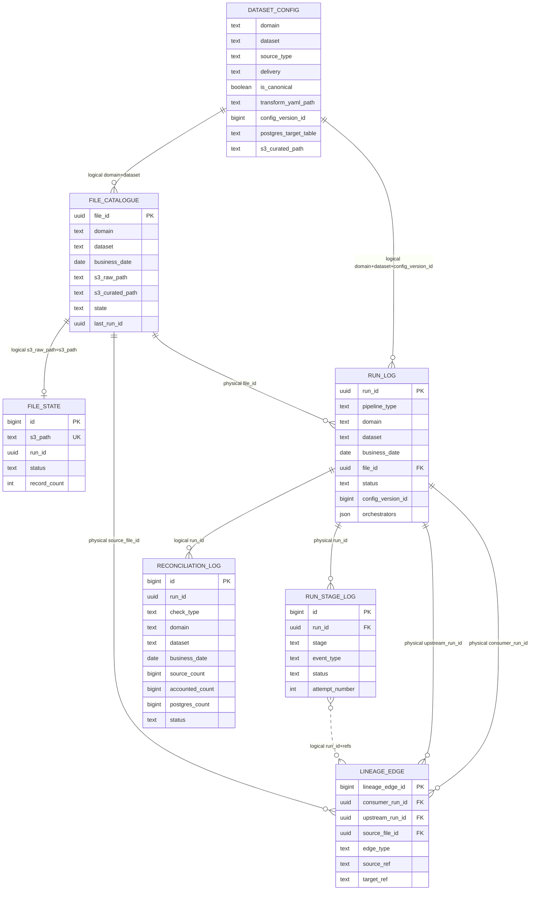
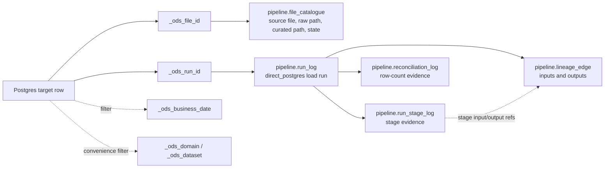

# Control Table Writes - Direct Postgres

**Route:** `source_type='s3_batch'`, `delivery='direct_postgres'`  
**Purpose:** show developers how the direct-Postgres file route inserts and updates `pipeline.*` control tables.  
**Related diagram:** [file-direct-postgres-route.drawio](file-direct-postgres-route.drawio)

This document is only about control-table writes. It is not a YAML onboarding guide and it is not a support runbook.

## Naming Convention

There are two similar names in the codebase, but they mean different things:

| Name | What it is | Example |
|---|---|---|
| `pipeline` | The Postgres control schema that stores route evidence. | `pipeline.file_catalogue` |
| `ods_pipeline` | The Python package that writes to the control schema. | `ods_pipeline.runs.start(...)` |

So `pipeline.file_catalogue` means "the `file_catalogue` table inside the `pipeline` database schema." It is not a Python function.

`ods_pipeline` is the Python helper package. Its modules write to the `pipeline.*` tables:

```text
Python helper                 writes to
-------------                 ---------
ods_pipeline.runs             pipeline.run_log
ods_pipeline.stages           pipeline.run_stage_log
ods_pipeline.files            pipeline.file_catalogue / pipeline.file_processing_attempt
ods_pipeline.lineage          pipeline.lineage_edge
ods_pipeline.reconciliation   pipeline.reconciliation_log
```

In this document:

| Term | Meaning |
|---|---|
| Control schema | Postgres tables named `pipeline.*`. |
| Python helpers | Functions in the `ods_pipeline.*` package. |

## Control Table Data Model

This is the control-table model for the direct-Postgres file route. Some links are physical foreign keys, and some are logical joins used by the route.



Key points:

| Relationship | Meaning |
|---|---|
| `dataset_config` to `file_catalogue` | Logical join on `(domain, dataset)`. A file is registered against the active dataset config. |
| `file_catalogue` to `run_log` | Physical FK through `run_log.file_id`. One file can have parent, ingestion, and direct-Postgres runs. |
| `run_log` to `run_stage_log` | Physical FK through `run_stage_log.run_id`. Each run has append-only stage evidence. |
| `run_log` to `lineage_edge` | Physical FK through `consumer_run_id` and optional `upstream_run_id`. |
| `run_stage_log` to `lineage_edge` | Logical association only. Join `run_stage_log.run_id = lineage_edge.consumer_run_id` and compare stage `input_ref/output_ref` with lineage `source_ref/target_ref`. There is no physical FK from `lineage_edge` to a stage row today. |
| `file_catalogue` to `lineage_edge` | Physical FK through `source_file_id`, so lineage can be found by file. |
| `run_log` to `reconciliation_log` | Logical join on `run_id`. Direct-Postgres writes `direct_postgres_count` here. |
| `file_catalogue` to `file_state` | Logical join from `file_catalogue.s3_raw_path` to `file_state.s3_path`. `file_state` is for idempotency. |

Important: a lineage edge is stage evidence in the operating model, but the current table stores it at run level. If exact per-stage lineage becomes required, add a nullable `stage_log_id` FK to `pipeline.lineage_edge`, or store `(stage, attempt_number)` on the lineage edge in a future migration.

## Direct Postgres Path

The direct-Postgres route is a file route that skips Kafka after curated data has been produced. The table below is the developer contract; it does not require developers to use the same internal orchestrator or task names.

| Route step | What happens | Control tables written | Use | Details |
|---|---|---|---|---|
| 1. Configure dataset | A dataset is declared as `source_type='s3_batch'` and `delivery='direct_postgres'`. | `pipeline.dataset_config` | Config-sync process or SQL contract. | [Example 1](#example-1---dataset-config-row) |
| 2. Source file lands | A file such as `country_codes_20260521.csv` arrives in the landing area. | None yet. | N/A | The file must match `filename_pattern` from `pipeline.dataset_config`. |
| 3. Register received file | The file is copied to raw S3 and registered as a received file. | `pipeline.file_catalogue` | `ods_pipeline.files.upsert(...)` or SQL contract. | [Example 2](#example-2---file-is-registered) |
| 4. Start route run | The route creates an overall route run. | `pipeline.run_log` | `ods_pipeline.runs.start(...)` | [Example 3](#example-3---run-rows) |
| 5. Ingestion starts | Raw S3 is read; schema and DQ checks begin. | `pipeline.file_catalogue`, `pipeline.run_stage_log` | `ods_pipeline.files.update_catalogue(...)`, `ods_pipeline.stages.start(...)`, `ods_pipeline.stages.finish(...)` | [Example 4](#example-4---ingestion-starts-processing-the-file) |
| 6. Ingestion completes | Curated Parquet is written to S3 and the ingestion run is closed. | `pipeline.file_catalogue`, `pipeline.file_processing_attempt`, `pipeline.lineage_edge`, `pipeline.reconciliation_log`, `pipeline.run_log` | `ods_pipeline.files.*`, `ods_pipeline.lineage.write_edge(...)`, `ods_pipeline.reconciliation.write_check(...)`, `ods_pipeline.runs.update(...)` | [Example 5](#example-5---ingestion-succeeds) |
| 7. Direct-Postgres run starts | Curated-to-target processing starts after ingestion succeeds. | `pipeline.run_log`, `pipeline.run_stage_log` | `ods_pipeline.runs.start(...)`, `ods_pipeline.stages.start(...)` | [Example 3](#example-3---run-rows), [Example 7](#example-7---direct-postgres-load-succeeds) |
| 8. Non-canonical transform prepares target shape, if needed | If `is_canonical=false`, source-shaped curated rows are transformed into target-shaped rows before the Postgres load. | No separate control-table row; evidence stays under the `direct_postgres` run. | `transform_yaml_path` mapping used before loading Postgres. | [Example 6](#example-6---non-canonical-transform) |
| 9. Postgres load starts | Target-shaped rows are loaded or merged into the Postgres target. | `pipeline.run_stage_log` | `ods_pipeline.stages.start(...)` | [Example 7](#example-7---direct-postgres-load-succeeds) |
| 10. Postgres load completes | The Postgres target has been written, counted, and tagged with linkage metadata. | `pipeline.run_stage_log`, `pipeline.reconciliation_log`, `pipeline.lineage_edge`, `pipeline.file_catalogue`, `pipeline.run_log` | `ods_pipeline.stages.finish(...)`, `ods_pipeline.reconciliation.write_check(...)`, `ods_pipeline.lineage.write_edge(...)`, `ods_pipeline.files.update_catalogue(...)`, `ods_pipeline.runs.update(...)` | Example 7 and Target-row linkage section below. |
| 11. Route finalises | The route run is marked succeeded or failed. | `pipeline.run_log`; `pipeline.file_catalogue` on failure. | `ods_pipeline.runs.update(...)`, `ods_pipeline.files.update_catalogue(...)` | [Example 8](#example-8---route-finalises) |

Data storage path:

```text
landing file
  -> S3 raw (raw/bronze)
  -> S3 curated (silver)
  -> optional target-shape transform before load
  -> Postgres target table (gold/current projection)
```

Control-table path:

```text
dataset_config
  -> file_catalogue
  -> run_log / run_stage_log
  -> file_state / lineage_edge / reconciliation_log
  -> file_catalogue state=loaded
```

The control-table path is the same for canonical and non-canonical datasets. The difference is where the row shape is transformed before Postgres.

### Target-Row Linkage Metadata

Rows written to the Postgres target table must carry ODS linkage columns. These columns are how a developer or operator gets from a business row back to the control-table evidence for the file and run that produced it.

Example target-row metadata:

```text
_ods_file_id       <file-id>
_ods_run_id        <postgres-run-id>
_ods_business_date 2026-05-21
_ods_domain        insurance
_ods_dataset       file_direct_pg_risk_demo
```

What each field gives us:

| Target column | Links to | Why it matters |
|---|---|---|
| `_ods_file_id` | `pipeline.file_catalogue.file_id` | Finds the received file, raw S3 path, curated S3 path, file state, and all runs for that file. |
| `_ods_run_id` | `pipeline.run_log.run_id` for the `direct_postgres` run | Finds the exact Postgres load run that wrote or updated the target row. |
| `_ods_business_date` | Business-date filters in control and target queries | Lets support compare target rows to the file date without parsing filenames again. |
| `_ods_domain` | Convenience copy of the dataset domain. | Useful for filtering target rows without joining first; not required for control-table linkage. |
| `_ods_dataset` | Convenience copy of the dataset name. | Useful for filtering target rows without joining first; not required for control-table linkage. |

Important distinction:

```text
_ods_file_id  = the original received source file registered in pipeline.file_catalogue
_ods_run_id   = the direct-Postgres load run that wrote the target row
```

So for this route:

| Target column | Must contain | Must not contain |
|---|---|---|
| `_ods_file_id` | The same `file_id` created when the landed/raw file was registered. | A new id for the curated dataset or the Postgres load. |
| `_ods_run_id` | The `postgres_run_id`, meaning the `pipeline.run_log` row where `pipeline_type='direct_postgres'`. | The route run id or the ingestion run id. |

Example:

```text
pipeline.file_catalogue.file_id
  = 11111111-1111-1111-1111-111111111111
  = original file country_codes_20260521.csv copied to S3 raw

pipeline.run_log.run_id
  = 33333333-3333-3333-3333-333333333333
  = direct_postgres run that loaded the target table

target row:
  _ods_file_id = 11111111-1111-1111-1111-111111111111
  _ods_run_id  = 33333333-3333-3333-3333-333333333333
```

That means a target row can be traced in two useful directions.

To find the file lifecycle for a target row:

```sql
SELECT fc.file_id,
       fc.state,
       fc.s3_raw_path,
       fc.s3_curated_path,
       fc.last_run_id
FROM ods.insurance_file_direct_pg_risk_demo t
JOIN pipeline.file_catalogue fc
  ON fc.file_id = t._ods_file_id::uuid
WHERE t.risk_id = 'RISK-001';
```

To find the load run and reconciliation for a target row:

```sql
SELECT rl.run_id,
       rl.pipeline_type,
       rl.status,
       rl.started_at,
       rl.ended_at,
       recon.check_type,
       recon.source_count,
       recon.postgres_count,
       recon.status AS recon_status
FROM ods.insurance_file_direct_pg_risk_demo t
JOIN pipeline.run_log rl
  ON rl.run_id = t._ods_run_id::uuid
LEFT JOIN pipeline.reconciliation_log recon
  ON recon.run_id = rl.run_id
WHERE t.risk_id = 'RISK-001';
```

This linkage is also why non-canonical transforms must preserve route metadata columns. Business columns may be renamed or cast into the target shape, but the ODS linkage columns must still allow the target row to join back to the control tables.

### Canonical Dataset

Use this when the curated columns already match the Postgres target shape.

```text
raw file columns
  -> ingestion step validates and writes curated Parquet
  -> curated Parquet already has target-shape columns
  -> Postgres load writes those rows to Postgres
```

Control-table impact:

| Step | Control-table evidence |
|---|---|
| File accepted | `file_catalogue.state='received'` |
| Ingestion starts | `run_log.pipeline_type='ingestion'`, `file_catalogue.state='ingesting'` |
| Curated write succeeds | `file_catalogue.state='curated'`, `lineage_edge.edge_type='raw_to_curated'` |
| Direct-Postgres run starts | `run_log.pipeline_type='direct_postgres'`, stage rows begin for curated-to-target work |
| Postgres load succeeds | `reconciliation_log.check_type='direct_postgres_count'`, `lineage_edge.edge_type='curated_to_postgres'`, `file_catalogue.state='loaded'` |

### Non-Canonical Dataset

Use this when the incoming file has source-specific names or types and Postgres expects a canonical/target shape.

```text
raw file columns
  -> ingestion step validates and writes source-shape curated Parquet
  -> direct-Postgres run reads curated Parquet
  -> transform_yaml_path prepares target-shaped rows
  -> Postgres load writes target-shaped rows
```

Control-table impact:

| Step | Control-table evidence |
|---|---|
| File accepted | Same as canonical. |
| Ingestion succeeds | Same as canonical. The curated data may still be source-shaped. |
| Direct-Postgres run starts | Same as canonical. The `direct_postgres` run owns target preparation and load. |
| Transform runs before load | No separate control table row today; it is part of `direct_postgres` processing. |
| Postgres load succeeds | Same as canonical: `direct_postgres_count`, `curated_to_postgres`, `loaded`. |

The non-canonical transform must not create or overwrite route metadata columns. Those metadata details are documented separately. This document only shows the control-table writes and the source-to-target data shape.

## Developer Population Responsibilities

There are two kinds of "populate":

| Kind | Meaning |
|---|---|
| Configuration population | Developer supplies YAML; config sync populates `pipeline.dataset_config`. |
| Runtime evidence population | Route code calls Python helpers; those helpers populate `pipeline.file_catalogue`, `run_log`, `run_stage_log`, `lineage_edge`, and `reconciliation_log`. |

Developers should normally populate only configuration. If you are changing route code, use the public `ods_pipeline.*` helpers where they exist. If a step has no helper, use the documented SQL contract for that table write.

| Route step | Developer provides | Runtime writes |
|---|---|---|
| Configure dataset | YAML with `source_type='s3_batch'`, `delivery='direct_postgres'`, `postgres_target_table`, `s3_curated_path`, `write_mode`, `key_fields`, tolerances, and `is_canonical` / `transform_yaml_path` when a transform is needed. | `pipeline.dataset_config` via the config-sync process or SQL contract. |
| Accept dropped file | A filename pattern that matches the intended file. | `pipeline.file_catalogue` row with `state='received'`. |
| Start direct-Postgres route | Nothing manually; the registered file starts the route. | Create `pipeline.run_log` rows as each unit of work starts. |
| Read raw file | Schema/DQ config sufficient for ingestion. | `run_stage_log` rows for `raw_read`, `schema_validate`, `dq_check`. |
| Write curated data | `s3_curated_path` in dataset config. | `file_catalogue.state='curated'`, `lineage_edge.raw_to_curated`, `reconciliation_log.t0_ingestion_count`, `file_state.status='completed'`, terminal ingestion `run_log.status`. |
| Start direct-Postgres run | Nothing manually; it starts after ingestion succeeds. | `run_log.pipeline_type='direct_postgres'` and stage-start rows for curated-to-target work. |
| Transform non-canonical rows | `is_canonical=false` and `transform_yaml_path`. | No separate table today; transform prepares target-shaped rows before the Postgres load. Failures mark the run/stage failed. |
| Load Postgres | Existing target table, valid `write_mode`, matching `key_fields` for upsert. | Stage-start and stage-finish rows for the load, `reconciliation_log.direct_postgres_count`, `lineage_edge.curated_to_postgres`, `file_catalogue.state='loaded'`, terminal direct-Postgres `run_log.status`. |
| Finish route | Nothing manually. | Terminal route `run_log.status='succeeded'` when both child runs succeed. |

## Write Contract Style

The examples use two styles:

| Style | When to use it |
|---|---|
| `ods_pipeline` helper | Use when the helper exists. This is preferred because it handles commits, timestamps, idempotency, and allowed fields. |
| SQL contract | Use when no public helper exists, or when explaining what a non-Python implementation must write. |

Internal file paths and private functions are not part of the developer contract. A developer should be able to implement against either the `ods_pipeline` helper examples or the documented SQL contracts.

Helper examples assume:

```python
from uuid import uuid4

import ods_pipeline

# conn is an open Postgres connection.
# file_id is returned by file registration.
route_run_id = uuid4()
ingestion_run_id = uuid4()
postgres_run_id = uuid4()
```

Example values used throughout:

```text
domain             insurance
dataset            country_codes
business_date      2026-05-21
source_filename    country_codes_20260521.csv
sftp_path          /upload/country_codes_20260521.csv
s3_raw_path        s3://ods-raw/insurance/country_codes/date=20260521/country_codes_20260521.csv
s3_curated_path    s3://ods-curated/insurance/country_codes/date=20260521/
postgres_table     ods.insurance_country_code
file_id            <file-id>
route_run_id       <route-run-id>
ingestion_run_id   <ingestion-run-id>
postgres_run_id    <postgres-run-id>
config_version_id  <config-version>
```

For one file, generate each run UUID once and reuse it for every write that belongs to that run. For example, every `pipeline.run_stage_log` row for raw-to-curated processing uses the same `ingestion_run_id`.

Each example shows:

1. the table name,
2. the required data,
3. the preferred helper or SQL contract, and
4. the row shape expected afterwards.

## Example 1 - Dataset Config Row

`pipeline.dataset_config` is dataset-level control configuration. It is not per run and not per file.

```text
pipeline.dataset_config
```

Developers maintain YAML because it is easier to review in Git. The YAML is synced into Postgres so route code, dashboards, and SQL checks can read one consistent, versioned configuration row at runtime.

Why load it into Postgres?

| Reason | Explanation |
|---|---|
| Runtime lookup | Route code needs to find the active config by `domain` and `dataset`. |
| Versioning | `config_version_id` changes when the composed YAML changes, so runs can record which config version they used. |
| Consistency | Route code, dashboards, and SQL checks all read the same config source. |
| Routing | The file-drop route uses `source_type`, `delivery`, and `filename_pattern` to decide which route receives a file. |
| Observability | Control queries can join run evidence back to the config that produced it. |

Cardinality:

```text
one dataset_config row/version
  -> many files in file_catalogue
  -> many runs in run_log
```

Required data:

| Field | Example | Notes |
|---|---|---|
| `domain` | `insurance` | Dataset domain. |
| `dataset` | `country_codes` | Dataset name. |
| `source_type` | `s3_batch` | Required for file drops. |
| `delivery` | `direct_postgres` | Routes the file to direct Postgres. |
| `filename_pattern` | `^country_codes_(?P<bd>\d{8})\.csv$` | Used to match dropped files and extract business date. |
| `is_canonical` | `true` | Use `false` when the curated row shape must be transformed before Postgres. |
| `transform_yaml_path` | `NULL` | Required when `is_canonical=false`; otherwise `NULL`. |
| `postgres_target_table` | `ods.insurance_country_code` | Target table for the Postgres load. |
| `s3_curated_path` | `s3://ods-curated/insurance/country_codes/` | Curated output root. |
| `write_mode` | `upsert` | `upsert` or `append`. |
| `key_fields` | `["country_code"]` | Required for `upsert`. |
| `recon_tolerance_records` | `0` | Row-count tolerance. |
| `recon_tolerance_pct` | `0` | Percentage tolerance. |

Preferred population style:

```text
Use the project's config-sync process to compose reviewed YAML and write
pipeline.dataset_config.
```

SQL contract:

```sql
INSERT INTO pipeline.dataset_config (
    domain, dataset, source_type, delivery, filename_pattern,
    is_canonical, transform_yaml_path,
    target_topic, canonical_topic,
    postgres_target_table, s3_curated_path,
    write_mode, key_fields,
    recon_tolerance_records, recon_tolerance_pct,
    config_version_id, config_pinned_at, active
)
VALUES (
    'insurance', 'country_codes', 's3_batch', 'direct_postgres',
    '^country_codes_(?P<bd>\d{8})\.csv$',
    TRUE, NULL,
    NULL, NULL,
    'ods.insurance_country_code',
    's3://ods-curated/insurance/country_codes/',
    'upsert', '["country_code"]'::jsonb,
    0, 0,
    1, NOW(), TRUE
)
ON CONFLICT (domain, dataset) DO UPDATE SET
    source_type = EXCLUDED.source_type,
    delivery = EXCLUDED.delivery,
    filename_pattern = EXCLUDED.filename_pattern,
    is_canonical = EXCLUDED.is_canonical,
    transform_yaml_path = EXCLUDED.transform_yaml_path,
    target_topic = EXCLUDED.target_topic,
    canonical_topic = EXCLUDED.canonical_topic,
    postgres_target_table = EXCLUDED.postgres_target_table,
    s3_curated_path = EXCLUDED.s3_curated_path,
    write_mode = EXCLUDED.write_mode,
    key_fields = EXCLUDED.key_fields,
    recon_tolerance_records = EXCLUDED.recon_tolerance_records,
    recon_tolerance_pct = EXCLUDED.recon_tolerance_pct,
    config_version_id = pipeline.dataset_config.config_version_id + 1,
    config_pinned_at = NOW(),
    active = TRUE;
```

This is done when configuration changes, not once for every file.

Expected direct-Postgres shape:

```sql
SELECT domain, dataset, source_type, delivery, filename_pattern,
       is_canonical, transform_yaml_path,
       target_topic, canonical_topic, postgres_target_table,
       s3_curated_path, write_mode, key_fields,
       recon_tolerance_records, recon_tolerance_pct
FROM pipeline.dataset_config
WHERE domain = 'insurance'
  AND dataset = 'country_codes';
```

Example result:

```text
domain                  insurance
dataset                 country_codes
source_type             s3_batch
delivery                direct_postgres
filename_pattern        ^country_codes_(?P<bd>\d{8})\.csv$
is_canonical            true
transform_yaml_path     NULL
target_topic            NULL
canonical_topic         NULL
postgres_target_table   ods.insurance_country_code
s3_curated_path         s3://ods-curated/insurance/country_codes/
write_mode              upsert
key_fields              ["country_code"]
recon_tolerance_records 0
recon_tolerance_pct     0
```

Important: `target_topic` and `canonical_topic` must be `NULL` for this route. They belong to Kafka routes.

`pipeline.dataset_config.s3_curated_path` is the dataset root. Later examples use the per-file curated partition:

```text
s3://ods-curated/insurance/country_codes/date=20260521/
```

## Example 2 - File Is Registered

When the file-drop route accepts a landed file, it creates a row in:

```text
pipeline.file_catalogue
```

Required data:

| Field | Example | Notes |
|---|---|---|
| `file_id` | generated UUID | Create once for this physical raw file. |
| `domain` | `insurance` | From `pipeline.dataset_config`. |
| `dataset` | `country_codes` | From `pipeline.dataset_config`. |
| `business_date` | `2026-05-21` | Usually extracted from `filename_pattern`. |
| `sftp_path` | `/upload/country_codes_20260521.csv` | Original landing path. |
| `s3_raw_path` | `s3://ods-raw/insurance/country_codes/date=20260521/country_codes_20260521.csv` | Raw immutable copy. |
| `file_size_bytes` | `1024` | Size of raw file. |
| `file_md5` | `<md5>` | Content fingerprint. |
| `state` | `received` | Initial route state. |

Preferred helper, if the developer is using `ods_pipeline`:

```python
import ods_pipeline

file_id = ods_pipeline.files.upsert(
    conn,
    domain="insurance",
    dataset="country_codes",
    business_date="2026-05-21",
    file_md5="<md5>",
    s3_raw_path="s3://ods-raw/insurance/country_codes/date=20260521/country_codes_20260521.csv",
    sftp_path="/upload/country_codes_20260521.csv",
    file_size_bytes=1024,
    state="received",
)
```

SQL contract, if not using the helper:

```sql
INSERT INTO pipeline.file_catalogue (
    file_id, domain, dataset, business_date,
    sftp_path, s3_raw_path, file_size_bytes, file_md5,
    state, state_updated_at, first_seen_at
)
VALUES (
    '<file-id>', 'insurance', 'country_codes', DATE '2026-05-21',
    '/upload/country_codes_20260521.csv',
    's3://ods-raw/insurance/country_codes/date=20260521/country_codes_20260521.csv',
    1024, '<md5>',
    'received', NOW(), NOW()
)
ON CONFLICT (domain, dataset, s3_raw_path)
WHERE s3_raw_path IS NOT NULL
DO UPDATE SET
    state = EXCLUDED.state,
    business_date = EXCLUDED.business_date,
    file_md5 = EXCLUDED.file_md5,
    file_size_bytes = EXCLUDED.file_size_bytes,
    state_updated_at = NOW()
RETURNING file_id;
```

Expected table row:

```text
table             pipeline.file_catalogue
file_id           <file-id>
domain            insurance
dataset           country_codes
business_date     2026-05-21
sftp_path         /upload/country_codes_20260521.csv
s3_raw_path       s3://ods-raw/insurance/country_codes/date=20260521/country_codes_20260521.csv
file_size_bytes   1024
file_md5          <md5>
state             received
last_run_id        NULL
```

The identity is `(domain, dataset, s3_raw_path)`. `file_md5` is a content fingerprint, not the identity.

## Example 3 - Run Rows

The direct-Postgres route normally records three kinds of `pipeline.run_log` row.

These `pipeline_type` values are the route labels used in this implementation and in the tests. If another implementation uses different names, the important point is that the same labels are used consistently by dashboards, reconciliation, and lineage queries.

| Run row | Example `pipeline_type` | Purpose | Create when | Finish when |
|---|---|---|---|---|
| Route run | `s3_batch` | Overall file-route orchestration. | The direct-Postgres route starts for a registered file. | All child work has succeeded or failed. |
| Ingestion run | `ingestion` | Raw S3 to curated S3. | Raw file processing starts. | Curated write and ingestion reconciliation are complete. |
| Direct-Postgres run | `direct_postgres` | Curated S3 to target-shaped rows to Postgres. | Curated-to-target processing starts. | Postgres load and direct-Postgres reconciliation are complete. |

```text
start route run
  start ingestion run
  finish ingestion run
  start direct-Postgres run
    optional transform before load
    load Postgres
  finish direct-Postgres run
finish route run
```

That is the easiest mental model: each run starts when that unit of work begins and ends when that unit of work is done.

Required data:

| Field | Route run | Ingestion run | Direct-Postgres run |
|---|---|---|---|
| `run_id` | A generated UUID for this route run. | A generated UUID for this ingestion run. | A generated UUID for this direct-Postgres run. |
| `pipeline_type` | `orchestration` | `ingestion` | `direct_postgres` |
| `domain` | `insurance` | `insurance` | `insurance` |
| `dataset` | `country_codes` | `country_codes` | `country_codes` |
| `business_date` | `2026-05-21` | `2026-05-21` | `2026-05-21` |
| `file_id` | `<file-id>` | `<file-id>` | `<file-id>` |
| `config_version_id` | `<config-version>` | `<config-version>` | `<config-version>` |
| `orchestrators` | `NULL` | Reference to the route run. | Reference to the route run. |

Example variable names used below:

```text
route_run_id       UUID for the overall file-route run
ingestion_run_id   UUID for raw-to-curated processing
postgres_run_id    UUID for curated-to-Postgres processing
```

Preferred helper sequence:

```python
# 1. Start the overall route run when the direct-Postgres route begins.
ods_pipeline.runs.start(
    conn,
    run_id=route_run_id,
    pipeline_type="orchestration",
    domain="insurance",
    dataset="country_codes",
    business_date="2026-05-21",
    file_id=file_id,
    config_version_id=config_version_id,
)

# 2. Start ingestion when raw-to-curated work begins.
ods_pipeline.runs.start(
    conn,
    run_id=ingestion_run_id,
    pipeline_type="ingestion",
    domain="insurance",
    dataset="country_codes",
    business_date="2026-05-21",
    file_id=file_id,
    config_version_id=config_version_id,
    orchestrators=[{"run_id": route_run_id, "edge_type": "orchestrates"}],
)
```

When ingestion finishes, close the ingestion run:

```python
ods_pipeline.runs.update(
    conn,
    ingestion_run_id,
    status="succeeded",
    record_count_source=100,
    record_count_dq_pass=100,
    record_count_dq_fail=0,
)
```

Then start the direct-Postgres run when curated-to-Postgres work begins:

```python
ods_pipeline.runs.start(
    conn,
    run_id=postgres_run_id,
    pipeline_type="direct_postgres",
    domain="insurance",
    dataset="country_codes",
    business_date="2026-05-21",
    file_id=file_id,
    config_version_id=config_version_id,
    orchestrators=[{"run_id": route_run_id, "edge_type": "orchestrates"}],
)
```

When the Postgres load finishes, close the direct-Postgres run:

```python
ods_pipeline.runs.update(
    conn,
    postgres_run_id,
    status="succeeded",
    record_count_source=100,
    record_count_target=100,
)
```

Finally close the overall route run:

```python
ods_pipeline.runs.update(
    conn,
    route_run_id,
    status="succeeded",
)
```

Each row starts as:

```text
status = running
started_at = NOW()
```

The `direct_postgres` row has no Kafka topic or offsets.

## Example 4 - Ingestion Starts Processing the File

The ingestion step marks the file as in progress using:

```python
import ods_pipeline

ods_pipeline.files.update_catalogue(
    conn,
    file_id=file_id,
    state="ingesting",
    last_run_id=ingestion_run_id,
)
```

Expected effect:

```text
table        pipeline.file_catalogue
file_id      <file-id>
state        ingesting
last_run_id  <ingestion-run-id>
```

Then it opens stage rows in:

```text
pipeline.run_stage_log
```

Example helper calls using the same `ingestion_run_id` for the start and finish rows:

```python
raw_read_attempt = ods_pipeline.stages.start(
    conn,
    run_id=ingestion_run_id,
    stage="raw_read",
    input_ref="s3://ods-raw/insurance/country_codes/date=20260521/country_codes_20260521.csv",
)

ods_pipeline.stages.finish(
    conn,
    run_id=ingestion_run_id,
    stage="raw_read",
    status="succeeded",
    event_type="stage_completed",
    attempt_number=raw_read_attempt,
    record_count_out=100,
)
```

Expected stage row pattern:

```text
stage             event_type        status
raw_read          stage_started     running
raw_read          stage_completed   succeeded
schema_validate   stage_started     running
schema_validate   stage_completed   succeeded
dq_check          stage_started     running
dq_check          stage_completed   succeeded
curated_write     stage_started     running
curated_write     stage_completed   succeeded
```

Stage rows are durable checkpoints. Helpers commit independently so operators can see live progress and restarts can resume with evidence already written.

## Example 5 - Ingestion Succeeds

When curated Parquet is written, ingestion updates:

```text
pipeline.file_catalogue
pipeline.file_processing_attempt
pipeline.lineage_edge
pipeline.reconciliation_log
pipeline.run_log
```

Catalogue state becomes `curated` using:

```python
import ods_pipeline

ods_pipeline.files.update_catalogue(
    conn,
    file_id=file_id,
    state="curated",
    s3_curated_path="s3://ods-curated/insurance/country_codes/date=20260521/",
)
```

Expected effect:

```text
table            pipeline.file_catalogue
file_id          <file-id>
state            curated
s3_curated_path  s3://ods-curated/insurance/country_codes/date=20260521/
```

Idempotency state becomes `completed` using:

```python
import ods_pipeline

ods_pipeline.files.set_state(
    conn,
    s3_path="s3://ods-raw/insurance/country_codes/date=20260521/country_codes_20260521.csv",
    run_id=ingestion_run_id,
    status="completed",
    record_count=100,
)

ods_pipeline.files.update_catalogue(
    conn,
    file_id=file_id,
    source_row_count=100,
    last_run_id=ingestion_run_id,
)
```

Expected effect:

```text
table         pipeline.file_processing_attempt
s3_path       s3://ods-raw/insurance/country_codes/date=20260521/country_codes_20260521.csv
run_id        <ingestion-run-id>
status        completed
record_count  100
```

Lineage records the raw-to-curated edge:

```python
ods_pipeline.lineage.write_edge(
    conn,
    consumer_run_id=ingestion_run_id,
    upstream_run_id=route_run_id,
    source_file_id=file_id,
    edge_type="raw_to_curated",
    source_ref="s3://ods-raw/insurance/country_codes/date=20260521/country_codes_20260521.csv",
    target_ref="s3://ods-curated/insurance/country_codes/date=20260521/",
    record_count=100,
)
```

Reconciliation records source rows vs accounted rows:

```python
ods_pipeline.reconciliation.write_check(
    conn,
    check_type="t0_ingestion_count",
    run_id=ingestion_run_id,
    domain="insurance",
    dataset="country_codes",
    business_date="2026-05-21",
    source_count=100,
    accounted_count=100,
    status="ok",
)
```

The `accounted_count` column name is generic legacy storage here. For `t0_ingestion_count`, it means accounted rows, not Kafka messages.

Finally the ingestion run is marked terminal:

```python
ods_pipeline.runs.update(
    conn,
    ingestion_run_id,
    status="succeeded",
    record_count_source=100,
    record_count_dq_pass=100,
    record_count_dq_fail=0,
)
```

## Example 6 - Non-Canonical Transform

Use this example when a file is valid but the source column names or types do not match the Postgres target table.

Dataset configuration must say the dataset is non-canonical and must point at the transform mapping:

```yaml
domain: insurance
dataset: file_direct_pg_risk_demo
source_type: s3_batch
delivery: direct_postgres
is_canonical: false
transform_yaml_path: /home/glue_user/workspace/jobs/patterns/insurance/file_direct_pg_risk_demo.yaml
postgres_target_table: ods.insurance_file_direct_pg_risk_demo
write_mode: append
key_fields: [risk_id, as_of_date]
```

The landed file and curated Parquet may still be source-shaped:

```text
RskID      PolNo      ExposureAmt  AsOfDt
RISK-001   POL-123    120.50       20260521
```

The transform mapping describes how to create the target shape:

```yaml
transform:
  fields:
    - {source: RskID, target: risk_id, type: string, required: true}
    - {source: PolNo, target: policy_id, type: string, required: true}
    - {source: ExposureAmt, target: exposure_amount, type: double}
    - {source: AsOfDt, target: as_of_date, type: date, format: yyyyMMdd, required: true}
  required: [risk_id, policy_id, as_of_date]
```

The row written to Postgres is target-shaped:

```text
risk_id    policy_id  exposure_amount  as_of_date
RISK-001   POL-123    120.50           2026-05-21
```

Control-table impact:

| Item | What to write |
|---|---|
| Dataset config | `pipeline.dataset_config.is_canonical=false` and `pipeline.dataset_config.transform_yaml_path=<mapping path>`. |
| Transform execution | No separate control-table row. It is part of the `direct_postgres` run. |
| Stage evidence | Use `pipeline.run_stage_log` rows under the same `postgres_run_id`, normally around curated read and Postgres load stages. |
| Reconciliation | Compare transformed rows written to Postgres using `reconciliation_log.check_type='direct_postgres_count'`. |
| Lineage | Record `lineage_edge.edge_type='curated_to_postgres'` after the transformed rows are written. |

There is no separate `canonicalize` run for this direct-Postgres route. Kafka routes may have a separate canonicalize step; this route applies the mapping inside the `direct_postgres` run before the Postgres load.

## Example 7 - Direct Postgres Load Succeeds

The direct-Postgres run starts after ingestion has succeeded. It uses the same `postgres_run_id` for all curated-to-target stage, reconciliation, lineage, catalogue, and run updates.

The run reads the curated path, applies the non-canonical transform first if needed, and then loads the target table. Then it updates:

```text
pipeline.run_stage_log
pipeline.reconciliation_log
pipeline.lineage_edge
pipeline.file_catalogue
pipeline.run_log
```

It opens and closes these stages:

```text
curated_read
sink_pg_wait
```

Example helper calls:

```python
curated_read_attempt = ods_pipeline.stages.start(
    conn,
    run_id=postgres_run_id,
    stage="curated_read",
    input_ref="s3://ods-curated/insurance/country_codes/date=20260521/",
)

ods_pipeline.stages.finish(
    conn,
    run_id=postgres_run_id,
    stage="curated_read",
    status="succeeded",
    event_type="stage_completed",
    attempt_number=curated_read_attempt,
    record_count_out=100,
)

sink_pg_attempt = ods_pipeline.stages.start(
    conn,
    run_id=postgres_run_id,
    stage="sink_pg_wait",
    input_ref="s3://ods-curated/insurance/country_codes/date=20260521/",
    output_ref="jdbc:postgresql://.../ods.insurance_country_code",
)

ods_pipeline.stages.finish(
    conn,
    run_id=postgres_run_id,
    stage="sink_pg_wait",
    status="succeeded",
    event_type="stage_completed",
    attempt_number=sink_pg_attempt,
    record_count_in=100,
    record_count_out=100,
)
```

The reconciliation row compares curated rows with Postgres rows tagged by the write run id:

```python
ods_pipeline.reconciliation.write_check(
    conn,
    check_type="direct_postgres_count",
    run_id=postgres_run_id,
    domain="insurance",
    dataset="country_codes",
    business_date=None,
    source_count=100,
    postgres_count=100,
    status="ok",
    detail='{"curated_count": 100, "postgres_count": 100, "write_mode": "upsert"}',
)
```

Current behavior: `direct_postgres_count` uses `business_date=None`. Use `run_id` or `file_id` when joining this evidence.

Lineage records the curated-to-Postgres edge:

```python
ods_pipeline.lineage.write_edge(
    conn,
    consumer_run_id=postgres_run_id,
    source_file_id=file_id,
    edge_type="curated_to_postgres",
    source_ref="s3://ods-curated/insurance/country_codes/date=20260521/",
    target_ref="jdbc:postgresql://.../ods.insurance_country_code",
    record_count=100,
)
```

The file is marked loaded after the Postgres load and reconciliation succeed.

Preferred helper:

```python
import ods_pipeline

ods_pipeline.files.update_catalogue(
    conn,
    file_id=file_id,
    state="loaded",
    last_run_id=postgres_run_id,
)
```

Expected effect:

```text
table        pipeline.file_catalogue
file_id      <file-id>
state        loaded
last_run_id  <postgres-run-id>
```

The direct-Postgres run is marked succeeded:

```python
ods_pipeline.runs.update(
    conn,
    postgres_run_id,
    status="succeeded",
    record_count_source=100,
    record_count_target=100,
)
```

`record_count_target` means "rows written to the delivery target" on this route. It does not mean Kafka publish.

## Example 8 - Route Finalises

When both child runs are `succeeded`, the route run is marked `succeeded`:

```python
ods_pipeline.runs.update(
    conn,
    route_run_id,
    status="succeeded",
)
```

If either child run fails, the route run becomes `failed` and the file becomes `failed`:

```python
ods_pipeline.runs.update(
    conn,
    route_run_id,
    status="failed",
    error_summary="direct_postgres child ended failed",
)
```

Preferred helper:

```python
import ods_pipeline

ods_pipeline.files.update_catalogue(
    conn,
    file_id=file_id,
    state="failed",
    last_run_id=route_run_id,
)
```

Expected failed-file effect:

```text
table        pipeline.file_catalogue
file_id      <file-id>
state        failed
last_run_id  <route-run-id>
```

## Table Usage Summary

| Table | Inserted by | Updated by | Purpose |
|---|---|---|---|
| `pipeline.dataset_config` | Config-sync process or SQL contract | Same path | Active route configuration. |
| `pipeline.file_catalogue` | File-drop route | Ingestion step, Postgres load step, route finalise | File lifecycle state. |
| `pipeline.file_processing_attempt` | Ingestion step | Ingestion step | Idempotency by raw S3 path. |
| `pipeline.run_log` | Route code | Route code | Run lifecycle and counts. |
| `pipeline.run_stage_log` | Stage helpers | Stage helpers | Stage-level progress and failures. |
| `pipeline.lineage_edge` | Ingestion step and Postgres load step | Append-only | Data movement evidence. |
| `pipeline.reconciliation_log` | Ingestion step and Postgres load step | Append-only | Count checks. |

## Expected Successful Shape

For one successful file:

```sql
SELECT pipeline_type, status, record_count_source,
       record_count_dq_pass, record_count_dq_fail,
       record_count_target
FROM pipeline.run_log
WHERE file_id = '<file-id>'
ORDER BY started_at;
```

Expected:

```text
pipeline_type     status      source  dq_pass  dq_fail  published
s3_batch          succeeded   NULL    NULL     NULL     NULL
ingestion         succeeded   100     100      0        NULL
direct_postgres   succeeded   100     NULL     NULL     100
```

And:

```sql
SELECT state, s3_raw_path, s3_curated_path, last_run_id
FROM pipeline.file_catalogue
WHERE file_id = '<file-id>';
```

Expected:

```text
state=loaded
```

And:

```sql
SELECT check_type, source_count, accounted_count, postgres_count, status
FROM pipeline.reconciliation_log
WHERE run_id IN (
    SELECT run_id FROM pipeline.run_log WHERE file_id = '<file-id>'
)
ORDER BY created_at;
```

Expected:

```text
check_type              source_count  accounted_count  postgres_count  status
t0_ingestion_count      100           100          NULL            ok
direct_postgres_count   100           NULL         100             ok
```

## Rules to Remember

| Rule | Meaning |
|---|---|
| Use helpers in code. | They handle commits, idempotency, timestamps, and allowed fields. |
| `file_catalogue.state` is the route state. | For direct Postgres the successful end state is `loaded`. |
| `file_state.status` is the idempotency state. | `completed` here only means the raw S3 path has already been curated. |
| Runtime helpers commit independently. | This is intentional for stateless progress, observability, and restart safety. |
| `direct_postgres` has no Kafka fields. | No `target_topic`, no offsets, no `publish_stage`. |
| Reconciliation still runs. | The checks are `t0_ingestion_count` and `direct_postgres_count`. |

## Appendix - Multi-Source Lineage

This document mostly describes the single-file direct-Postgres route:

```text
one source file
  -> raw
  -> curated
  -> optional target-shape transform
  -> Postgres target
```

For that shape, target-row linkage is simple:

```text
_ods_file_id = the original received source file
_ods_run_id  = the direct-Postgres load run that wrote the target row
```

### Appendix - Target Row Metadata Links

A loaded target row normally carries this metadata:

```text
_ods_file_id       <file-id>
_ods_run_id        <postgres-run-id>
_ods_business_date 2026-05-21
_ods_domain        insurance
_ods_dataset       file_direct_pg_risk_demo
```

The hard linkage fields are `_ods_file_id` and `_ods_run_id`:

| Target column | Control-table link | Meaning |
|---|---|---|
| `_ods_file_id` | `pipeline.file_catalogue.file_id` | The original received source file that was registered before raw ingestion. |
| `_ods_run_id` | `pipeline.run_log.run_id` | The run that wrote the target row. For this route, that is the `direct_postgres` load run. |
| `_ods_business_date` | Used as a filter alongside control-table queries. | The business date carried from the file/run context. |
| `_ods_domain` | Convenience copy only. | Makes target-table filtering easier; the domain can also be found through `file_catalogue` or `run_log`. |
| `_ods_dataset` | Convenience copy only. | Makes target-table filtering easier; the dataset can also be found through `file_catalogue` or `run_log`. |

So `_ods_domain` and `_ods_dataset` are useful, but they are not the required linkage. The required joins are:

```text
target._ods_file_id -> pipeline.file_catalogue.file_id
target._ods_run_id  -> pipeline.run_log.run_id
run_log.run_id      -> pipeline.lineage_edge.consumer_run_id
```

Diagram:



The practical reading is:

```text
_ods_file_id answers: which received file is this row tied back to?
_ods_run_id  answers: which load run wrote this row?
lineage_edge answers: what did that load run read and write?
```

Multi-source gold processing is different. For example:

```text
file1 -> silver table A with colA
file2 -> silver table B with colB
silver A + silver B -> gold table C
gold table C -> Postgres target
```

In that case, a target row may depend on more than one source file. A single `_ods_file_id` cannot represent the full lineage. It can only be a convenience pointer if there is a clear primary or driving file.

The rule is:

```text
_ods_run_id tells you the run that wrote the target row.
pipeline.lineage_edge tells you all inputs consumed by that run.
_ods_file_id is enough only for single-source rows.
```

So multiple input lineage edges are allowed and expected:

```text
pipeline.lineage_edge
  consumer_run_id   = <gold_or_direct_postgres_run_id>
  upstream_run_id  = <silver_run_for_file1>
  source_file_id = <file1>
  edge_type      = silver_to_gold
  source_ref     = s3://.../silver/table_a/date=...
  target_ref     = postgres://.../gold_table_c

pipeline.lineage_edge
  consumer_run_id   = <gold_or_direct_postgres_run_id>
  upstream_run_id  = <silver_run_for_file2>
  source_file_id = <file2>
  edge_type      = silver_to_gold
  source_ref     = s3://.../silver/table_b/date=...
  target_ref     = postgres://.../gold_table_c
```

Walking backwards from the target row then uses `_ods_run_id`:

```sql
SELECT le.*
FROM ods.gold_table_c t
JOIN pipeline.lineage_edge le
  ON le.consumer_run_id = t._ods_run_id::uuid
WHERE t.business_key = '<key>';
```

If a multi-source target row stores only the last `_ods_file_id` and no lineage edges are written for the other inputs, lineage is incomplete. The target row can still identify the load run through `_ods_run_id`, but the full set of upstream source files is lost.

For multi-source gold datasets, the invariant should be:

```text
Every input consumed by the gold/load run must be represented as a lineage edge.
```
