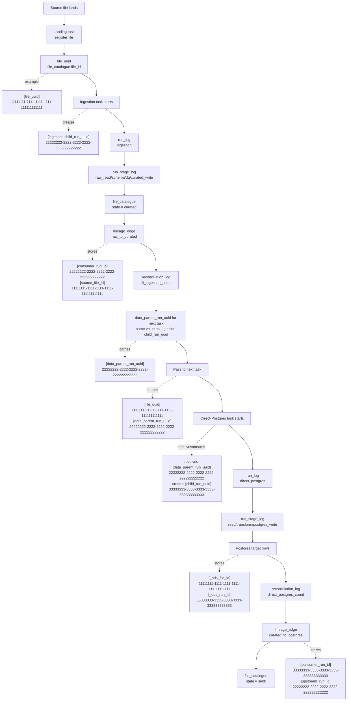
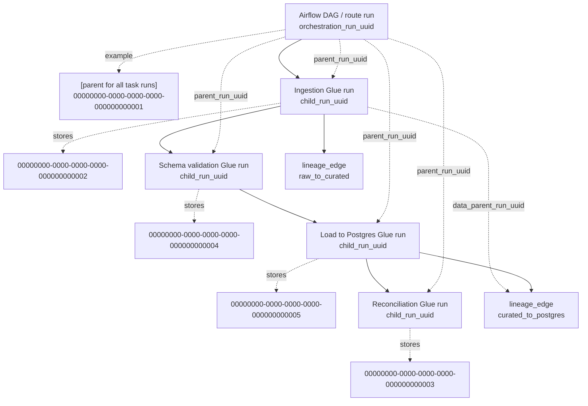

# Direct Postgres Control Tables - Quick Start

**Use this when:** adding or reviewing a direct-Postgres file route.

**Full reference:** [control-table-writes-direct-postgres.md](control-table-writes-direct-postgres.md)

This is the short version. It shows what needs to be configured, what runtime evidence is written, and which helper functions to use.

## Mental Model

```text
SFTP/drop
  -> S3 raw
  -> S3 curated
  -> optional target-shape transform
  -> Postgres target table
```

Control tables record the evidence for that route:

```text
pipeline.dataset_config
  -> pipeline.file_catalogue
  -> pipeline.run_log
  -> pipeline.run_stage_log
  -> pipeline.file_processing_attempt
  -> pipeline.lineage_edge
  -> pipeline.reconciliation_log
```

## What Developers Usually Populate

Most developers only maintain dataset configuration.

Runtime tables are normally written by route code through `ods_pipeline.*` helpers.

| You are doing | You normally update |
|---|---|
| Adding a dataset | YAML/config that syncs into `pipeline.dataset_config`. |
| Implementing route code | Use `ods_pipeline.*` helpers to write runtime evidence. |
| Investigating a run | Query `pipeline.*` control tables and target `_ods_*` metadata. |

## Required Dataset Configuration

For direct Postgres, the dataset config must include:

| Field | Example | Notes |
|---|---|---|
| `source_type` | `s3_batch` | File route source type. |
| `delivery` | `direct_postgres` | Routes around Kafka and into Postgres. |
| `filename_pattern` | `^country_codes_(?P<bd>\d{8})\.csv$` | Used to match files and extract business date. |
| `postgres_target_table` | `ods.insurance_country_code` | Target table. |
| `s3_curated_path` | `s3://ods-curated/insurance/country_codes/` | Curated output root. |
| `write_mode` | `upsert` | Usually `upsert` or `append`. |
| `key_fields` | `["country_code"]` | Required for `upsert`. |
| `is_canonical` | `true` | Set `false` if a transform is needed before load. |
| `transform_yaml_path` | `NULL` | Required when `is_canonical=false`. |
| `recon_tolerance_records` | `0` | Row-count tolerance. |
| `recon_tolerance_pct` | `0` | Percentage tolerance. |

Kafka fields should be empty for this route:

```text
target_topic    = NULL
canonical_topic = NULL
```

## Runtime Write Order

Use this order when implementing or reviewing route code. The key rule is that
each Airflow/Glue task owns only its current unit of work. Do not allocate all
run UUIDs at DAG start, and do not call `runs.start(...)` for future work.

```text
1. register received file
2. start the ingestion run only when the ingestion task begins
3. write ingestion stage evidence as stages complete
4. mark file curated
5. write raw-to-curated lineage
6. write ingestion reconciliation
7. close ingestion run
8. pass file_uuid, parent_run_uuid if present, and data_parent_run_uuid to the next task
9. start the direct_postgres run only when the load task begins
10. apply transform if is_canonical=false
11. load Postgres
12. write direct_postgres reconciliation
13. write curated-to-Postgres lineage
14. mark file sunk
15. close direct_postgres run
```

If Airflow has a separate route/orchestration run, create that run inside the
task that owns orchestration and pass its ID as `upstream_run_id`. Do not require
one route run for every implementation. Some DAGs may have more or fewer runs
depending on retries, dynamic tasks, splits, or multi-source joins.

## Stateless Helper Cheat Sheet

Import helpers in each task that writes control-table evidence:

```python
from uuid import uuid4

import ods_pipeline
```

Create a run ID for the current task only. On a retry of the same known attempt,
reuse the existing run ID from Airflow XCom, task params, or a checkpoint row.
For a new attempt, create a new one:

```python
def current_attempt_run_id(existing_run_id: str | None = None) -> str:
    return existing_run_id or str(uuid4())
```

Naming used in the examples below:

| Friendly name | Actual field/helper argument | Meaning |
|---|---|---|
| `file_uuid` | `file_id` | The source file identity in `pipeline.file_catalogue`. |
| `orchestration_run_uuid` | top-level `run_id` | The Airflow/DAG route run UUID when one orchestrator owns the whole route. |
| `child_run_uuid` | `run_id` and `consumer_run_id` | The UUID for the current task/run. It becomes the child in lineage when it consumes an upstream input. |
| `parent_run_uuid` | `orchestrators[].run_id` | The orchestration parent for the current task/run when Airflow owns the route. |
| `data_parent_run_uuid` | `lineage_edge.upstream_run_id` | The immediate upstream run whose data output is consumed by the child run. This can be different from the orchestration parent. |

Stage evidence in `pipeline.run_stage_log` is tied back by
`run_id = child_run_uuid`, plus `stage` and `attempt_number`.

### 1. Register the received file

This normally happens in the landing task after the file is copied to raw S3.
It creates or updates the file identity, but it does not start downstream runs.

```python
file_uuid = ods_pipeline.files.upsert(
    conn,
    domain="insurance",
    dataset="country_codes",
    business_date="2026-05-21",
    sftp_path="/upload/country_codes_20260521.csv",
    s3_raw_path="s3://ods-raw/insurance/country_codes/date=20260521/country_codes_20260521.csv",
    state="received",
)
```

Pass `file_uuid` to downstream tasks through Airflow XCom, task params, or your
normal orchestration payload.

### 2. Start the ingestion run

Do this inside the ingestion task, when ingestion actually starts. The ingestion
task owns its current `child_run_uuid`.

```python
child_run_uuid = current_attempt_run_id(existing_run_id=None)

ods_pipeline.runs.start(
    conn,
    run_id=child_run_uuid,
    pipeline_type="ingestion",
    domain="insurance",
    dataset="country_codes",
    business_date="2026-05-21",
    file_id=file_uuid,
)
```

### 3. Write ingestion stage evidence

Start and finish each stage around the actual work. These writes are durable
checkpoints and should not wait until the end of the whole route.

```python
attempt = ods_pipeline.stages.start(
    conn,
    run_id=child_run_uuid,
    stage="raw_read",
    input_ref="s3://ods-raw/insurance/country_codes/date=20260521/country_codes_20260521.csv",
)

ods_pipeline.stages.finish(
    conn,
    run_id=child_run_uuid,
    stage="raw_read",
    status="succeeded",
    event_type="stage_completed",
    attempt_number=attempt,
    record_count_out=100,
)
```

### 4. Mark the file curated

Do this only after curated data exists.

```python
ods_pipeline.files.update_catalogue(
    conn,
    file_id=file_uuid,
    state="curated",
    s3_curated_path="s3://ods-curated/insurance/country_codes/date=20260521/",
    last_run_id=child_run_uuid,
)
```

### 5. Write raw-to-curated lineage

This records what the ingestion run produced.

```python
ods_pipeline.lineage.write_edge(
    conn,
    consumer_run_id=child_run_uuid,
    source_file_id=file_uuid,
    edge_type="raw_to_curated",
    source_ref="s3://ods-raw/insurance/country_codes/date=20260521/country_codes_20260521.csv",
    target_ref="s3://ods-curated/insurance/country_codes/date=20260521/",
    record_count=100,
)
```

### 6. Write ingestion reconciliation

Use a non-Kafka check for the direct-Postgres path unless this route really
published to Kafka.

```python
ods_pipeline.reconciliation.write_check(
    conn,
    check_type="t0_ingestion_count",
    run_id=child_run_uuid,
    domain="insurance",
    dataset="country_codes",
    business_date="2026-05-21",
    source_count=100,
    kafka_count=None,
    status="ok",
)
```

### 7. Close the ingestion run

Close only the run owned by this task. Pass `file_uuid`,
`ingestion_child_run_uuid = child_run_uuid`, and the curated path to the next
task.

```python
ods_pipeline.runs.update(
    conn,
    child_run_uuid,
    status="succeeded",
    record_count_source=100,
    record_count_dq_pass=100,
    record_count_dq_fail=0,
)
```

### 8. Start the direct-Postgres run

Do this inside the load task, after the ingestion task has succeeded. The load
task owns its own `child_run_uuid`.

In a simple two-task route, the ingestion run can be both the parent and the
data parent. In an Airflow-managed route, use the Airflow route UUID as
`parent_run_uuid`, and keep the ingestion or transform run as
`data_parent_run_uuid`.

```python
orchestration_run_uuid = None  # Set this to the Airflow route UUID when present.
parent_run_uuid = orchestration_run_uuid or ingestion_child_run_uuid
data_parent_run_uuid = ingestion_child_run_uuid
child_run_uuid = current_attempt_run_id(existing_run_id=None)

ods_pipeline.runs.start(
    conn,
    run_id=child_run_uuid,
    pipeline_type="direct_postgres",
    domain="insurance",
    dataset="country_codes",
    business_date="2026-05-21",
    file_id=file_uuid,
    orchestrators=[{"run_id": parent_run_uuid, "edge_type": "produced_curated"}],
)
```

### 9. Write direct-Postgres stage evidence

Record the read, optional transform, and load stages as they actually happen.

```python
attempt = ods_pipeline.stages.start(
    conn,
    run_id=child_run_uuid,
    stage="postgres_write",
    input_ref="s3://ods-curated/insurance/country_codes/date=20260521/",
    output_ref="ods.insurance_country_code",
)

# Transform and load the target table here.

ods_pipeline.stages.finish(
    conn,
    run_id=child_run_uuid,
    stage="postgres_write",
    status="succeeded",
    event_type="stage_completed",
    attempt_number=attempt,
    record_count_in=100,
    record_count_out=100,
)
```

### 10. Mark the file sunk

Do this only after the target table has been written.

```python
ods_pipeline.files.update_catalogue(
    conn,
    file_id=file_uuid,
    state="sunk",
    last_run_id=child_run_uuid,
)
```

### 11. Write curated-to-Postgres lineage

The child run is the run that wrote the target. The data parent run is the run
that produced the curated data.

```python
ods_pipeline.lineage.write_edge(
    conn,
    consumer_run_id=child_run_uuid,
    upstream_run_id=data_parent_run_uuid,
    source_file_id=file_uuid,
    edge_type="curated_to_postgres",
    source_ref="s3://ods-curated/insurance/country_codes/date=20260521/",
    target_ref="jdbc:postgresql://.../ods.insurance_country_code",
    record_count=100,
)
```

### 12. Write direct-Postgres reconciliation

Compare the rows accepted for load to the rows visible in the target for this
direct-Postgres `child_run_uuid`.

```python
ods_pipeline.reconciliation.write_check(
    conn,
    check_type="direct_postgres_count",
    run_id=child_run_uuid,
    domain="insurance",
    dataset="country_codes",
    business_date=None,
    source_count=100,
    postgres_count=100,
    status="ok",
)
```

### 13. Close the direct-Postgres run

```python
ods_pipeline.runs.update(
    conn,
    child_run_uuid,
    status="succeeded",
    record_count_source=100,
    record_count_published=100,
)
```

### Restart rule

On restart, first inspect the durable checkpoints already written:

```sql
SELECT pipeline_type, status, started_at, ended_at
FROM pipeline.run_log
WHERE file_id = '<file-uuid>'
ORDER BY started_at;

SELECT stage, event_type, status, input_ref, output_ref, attempt_number
FROM pipeline.run_stage_log
WHERE run_id = '<child-run-uuid>'
ORDER BY started_at;
```

Then either reuse the same run ID for the same failed attempt, or create a new
run ID for a new attempt. Do not create future run IDs merely because the DAG
might later run more tasks.

## Non-Canonical Transform

If the source columns do not match the target table:

```yaml
is_canonical: false
transform_yaml_path: /home/glue_user/workspace/jobs/patterns/insurance/file_direct_pg_risk_demo.yaml
```

Example mapping:

```yaml
transform:
  fields:
    - {source: RskID, target: risk_id, type: string, required: true}
    - {source: PolNo, target: policy_id, type: string, required: true}
    - {source: ExposureAmt, target: exposure_amount, type: double}
    - {source: AsOfDt, target: as_of_date, type: date, format: yyyyMMdd, required: true}
  required: [risk_id, policy_id, as_of_date]
```

The transform prepares target-shaped rows before the Postgres load. It does not create a separate `canonicalize` run on this route.

## Target-Row Linkage

Rows written to the target table must carry linkage metadata:

```text
_ods_file_id       <file-uuid>
_ods_run_id        <direct-postgres-child-run-uuid>
_ods_business_date 2026-05-21
_ods_domain        insurance
_ods_dataset       country_codes
```

The important rules:

```text
_ods_file_id = original received source file in pipeline.file_catalogue
_ods_run_id  = child run UUID of the direct_postgres run that loaded the target row
```

`_ods_domain` and `_ods_dataset` are useful convenience fields. They are not the required linkage keys.

Required joins:

```text
target._ods_file_id -> pipeline.file_catalogue.file_id
target._ods_run_id  -> pipeline.run_log.run_id
run_log.run_id      -> pipeline.lineage_edge.consumer_run_id
```

## Multi-Source Rule

For a single-source direct-Postgres row, `_ods_file_id` is enough to identify the source file.

For multi-source gold rows, `_ods_file_id` is not enough. Use `_ods_run_id` plus multiple `pipeline.lineage_edge` rows.

```text
Every input consumed by the gold/load run must be represented as a lineage edge.
```

## Quick Checks

File reached final state:

```sql
SELECT state, s3_raw_path, s3_curated_path, last_run_id
FROM pipeline.file_catalogue
WHERE file_id = '<file-uuid>';
```

Runs finished:

```sql
SELECT pipeline_type, status
FROM pipeline.run_log
WHERE file_id = '<file-uuid>'
ORDER BY started_at;
```

Reconciliation passed:

```sql
SELECT check_type, source_count, kafka_count, postgres_count, status
FROM pipeline.reconciliation_log
WHERE run_id IN (
    SELECT run_id FROM pipeline.run_log WHERE file_id = '<file-uuid>'
)
ORDER BY created_at;
```

Target row links back to control tables:

```sql
SELECT fc.file_id,
       fc.state,
       rl.run_id,
       rl.pipeline_type,
       rl.status
FROM ods.insurance_country_code t
JOIN pipeline.file_catalogue fc
  ON fc.file_id = t._ods_file_id::uuid
JOIN pipeline.run_log rl
  ON rl.run_id = t._ods_run_id::uuid
WHERE t.country_code = 'GB';
```

## Remember

| Rule | Meaning |
|---|---|
| Use `ods_pipeline.*` helpers in route code. | They handle commits, timestamps, and the expected table shape. |
| `file_catalogue.state='sunk'` means the file reached the Postgres target. | It is the successful end state for this route. |
| `record_count_published` means rows written to Postgres. | It does not mean Kafka publish on this route. |
| `_ods_file_id` points to the source file. | It is not a new id for the load. |
| `_ods_run_id` points to the direct-Postgres child run UUID. | It is not the ingestion child run UUID or an orchestration UUID. |

## Appendix: Stateless Data Flow

This view uses the friendly names from the quickstart.

For a small route, `parent_run_uuid` may simply mean the immediate upstream data
run. For an Airflow-managed route, there is usually a top-level orchestration
run as well:

```text
file_uuid              = pipeline.file_catalogue.file_id
orchestration_run_uuid = whole Airflow DAG/route run
child_run_uuid         = current Glue/task run
parent_run_uuid        = orchestration_run_uuid for tasks owned by the DAG
data_parent_run_uuid   = immediate upstream data-producing run, used for lineage
```

The bracketed UUIDs in the first diagram are examples. They show a simple
handoff: the ingestion child run becomes the direct-Postgres data parent. If
there is no Airflow orchestration run, this value can also be used as the
task's `parent_run_uuid`.

Simple route data-parent rule:

```text
ingestion child_run_uuid          = 22222222-2222-2222-2222-222222222222
direct_postgres data_parent_run_uuid = 22222222-2222-2222-2222-222222222222
direct_postgres child_run_uuid    = 33333333-3333-3333-3333-333333333333
```



| Step | Owner | UUIDs used | Control-table evidence |
|---|---|---|---|
| Land/register file | Landing task | Creates or finds `file_uuid`. | `file_catalogue` with `state='received'`. |
| Raw to curated | Ingestion task | Creates current `child_run_uuid`; receives `file_uuid`; may receive optional `parent_run_uuid` from orchestration. | `run_log`, `run_stage_log`, `file_catalogue`, `lineage_edge`, `reconciliation_log`. |
| Handoff | Airflow/Glue orchestration | Passes `file_uuid` and `data_parent_run_uuid = ingestion child_run_uuid`. | No new control-table row is required just to hand off. |
| Curated to Postgres | Direct-Postgres task | Creates current `child_run_uuid`; receives `file_uuid`, `parent_run_uuid` if Airflow owns the route, and `data_parent_run_uuid` for lineage. | `run_log`, `run_stage_log`, target `_ods_*` columns, `reconciliation_log`, `lineage_edge`, `file_catalogue`. |

The parent/child naming is only a readability layer. In SQL and Python helpers,
use the real names: `run_id`, `upstream_run_id`, `consumer_run_id`, and `file_id`.

### Airflow-managed parent run

If Airflow owns the whole route, create one parent run UUID for the DAG/route
and start it when the orchestration begins. Each Glue/task run then gets its
own child run UUID and records the Airflow parent run UUID in `run_log.orchestrators`.

The data lineage parent is still the immediate upstream data-producing run. For
example, the Postgres load can be orchestrated by UUID `0000...`, but its data
parent can be the ingestion or transform run that produced the curated input.

```text
orchestration_run_uuid = 00000000-0000-0000-0000-000000000001
ingestion_child_uuid   = 00000000-0000-0000-0000-000000000002
recon_child_uuid       = 00000000-0000-0000-0000-000000000003
schema_child_uuid      = 00000000-0000-0000-0000-000000000004
postgres_child_uuid    = 00000000-0000-0000-0000-000000000005
```



| Run | Example UUID | Parent relationship | Data-lineage relationship |
|---|---|---|---|
| Airflow route/orchestration | `00000000-0000-0000-0000-000000000001` | No parent unless triggered by a higher process. | Usually no data lineage edge by itself. |
| Ingestion Glue | `00000000-0000-0000-0000-000000000002` | Parent is orchestration run `00000000-0000-0000-0000-000000000001`. | Consumes the source file and writes `raw_to_curated`. |
| Schema validation Glue | `00000000-0000-0000-0000-000000000004` | Parent is orchestration run `00000000-0000-0000-0000-000000000001`. | May consume raw or curated output depending on where validation runs. |
| Load to Postgres Glue | `00000000-0000-0000-0000-000000000005` | Parent is orchestration run `00000000-0000-0000-0000-000000000001`. | Data parent is the run that produced the curated/target-shaped input. |
| Reconciliation Glue | `00000000-0000-0000-0000-000000000003` | Parent is orchestration run `00000000-0000-0000-0000-000000000001`. | Usually writes reconciliation evidence rather than a new data lineage edge. |
