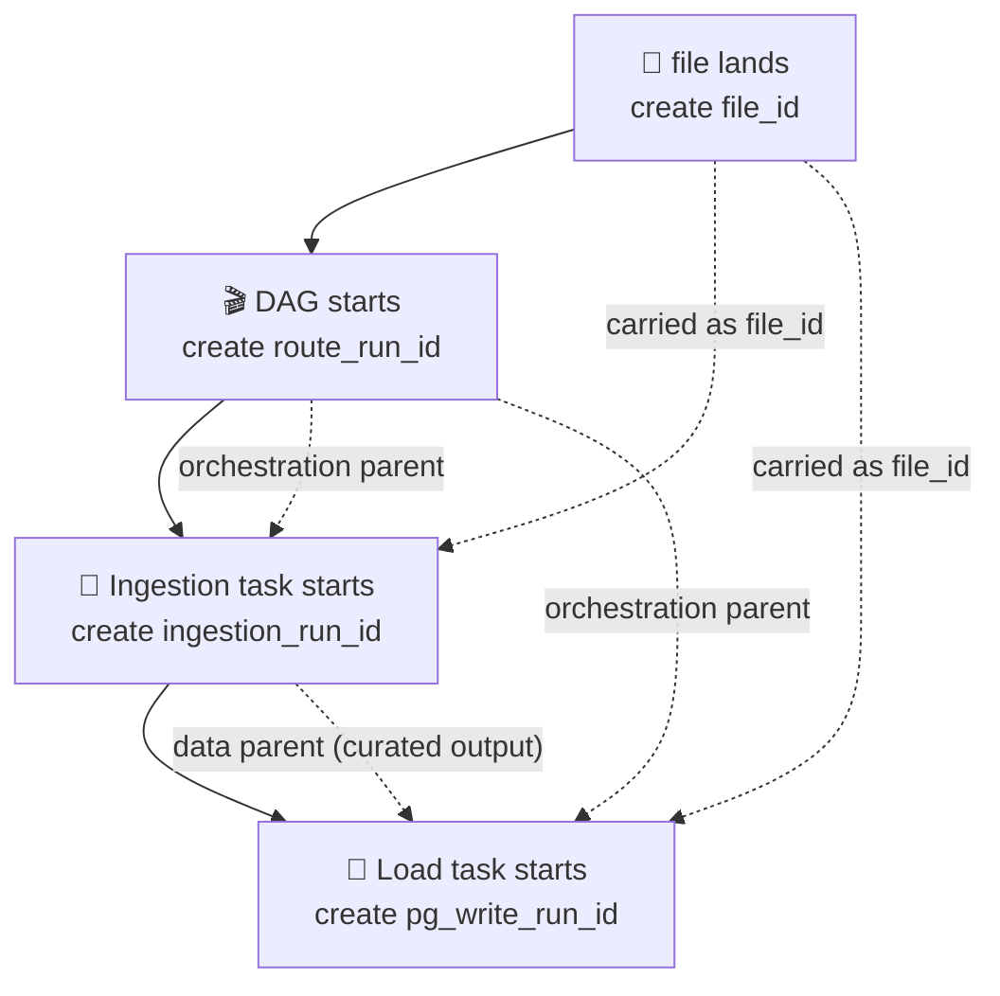
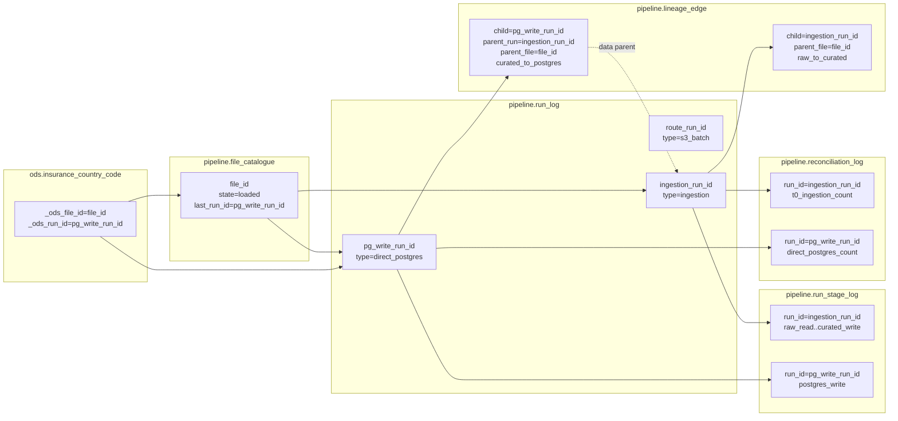
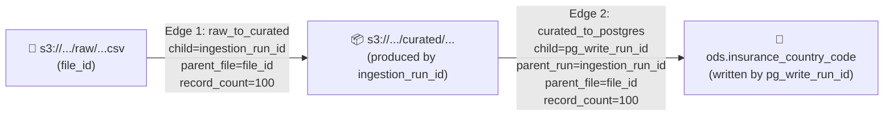

# Direct Postgres Control Tables — Developer Guide

**Audience:** developers implementing or reviewing a direct-Postgres file route.
**Goal:** know exactly which UUID goes into which control table, and what each table looks like at every step.

---

## 1. The Only Three UUIDs You Need

Forget "parent" and "child" until you understand these three:

| UUID | Where it lives | Created by | Lifetime |
|---|---|---|---|
| `file_id` | `pipeline.file_catalogue.file_id` | Landing task, once per source file | Never changes for that file |
| `ingestion_run_id` | `pipeline.run_log.run_id` (row where `pipeline_type='ingestion'`) | Ingestion task, on start | One per ingestion attempt |
| `pg_write_run_id` | `pipeline.run_log.run_id` (row where `pipeline_type='direct_postgres'`) | Load task, on start | One per load attempt |

Optional fourth, only when Airflow owns the route:

| UUID | Where it lives | Created by |
|---|---|---|
| `route_run_id` | `pipeline.run_log.run_id` (row where `pipeline_type='orchestration'`) | DAG start task, once per DAG run |

**Rule:** each task generates its own `run_id` *when its work starts*. Never pre-allocate downstream UUIDs.

---

## 2. "Parent" Means Three Different Things

`parent` is overloaded. Pin down which one before writing any row:

| Parent flavour | Column | Question it answers | Typical value |
|---|---|---|---|
| Orchestration parent | `run_log.orchestrators[].run_id` | Who scheduled me? | `route_run_id` (or nothing) |
| Data parent | `lineage_edge.upstream_run_id` | Whose data did I read? | Previous task's `run_id` |
| File parent | `lineage_edge.source_file_id` | Which file did I consume? | `file_id` |

The same UUID can be both orchestration parent and data parent in a small route. They are still distinct concepts — record them in their own columns.

---

## 3. Visual: UUID Flow Across One File



UUIDs in worked examples below (full names used in all tables — no shorthand):

```text
file_id            = 11111111-1111-1111-1111-111111111111
route_run_id       = AAAAAAAA-AAAA-AAAA-AAAA-AAAAAAAAAAAA
ingestion_run_id   = BBBBBBBB-BBBB-BBBB-BBBB-BBBBBBBBBBBB
pg_write_run_id    = CCCCCCCC-CCCC-CCCC-CCCC-CCCCCCCCCCCC
```

---

## 4. UUID → Control Table Cheat Sheet

Print this. Pin it.

| Control table | Column | Value to write |
|---|---|---|
| `file_catalogue` | `file_id` | `file_id` |
| `file_catalogue` | `last_run_id` | `ingestion_run_id` (after ingestion), then `pg_write_run_id` (after load) |
| `run_log` (ingestion row) | `run_id` | `ingestion_run_id` |
| `run_log` (ingestion row) | `file_id` | `file_id` |
| `run_log` (ingestion row) | `orchestrators` | `[{"run_id": route_run_id, "edge_type": "orchestrates"}]` |
| `run_log` (load row) | `run_id` | `pg_write_run_id` |
| `run_log` (load row) | `file_id` | `file_id` |
| `run_log` (load row) | `orchestrators` | `[{"run_id": route_run_id, "edge_type": "orchestrates"}]` |
| `run_stage_log` | `run_id` | `ingestion_run_id` for ingestion stages, `pg_write_run_id` for load stages |
| `lineage_edge` (raw→curated) | `consumer_run_id` | `ingestion_run_id` |
| `lineage_edge` (raw→curated) | `source_file_id` | `file_id` |
| `lineage_edge` (raw→curated) | `upstream_run_id` | NULL (file is the source) |
| `lineage_edge` (curated→pg) | `consumer_run_id` | `pg_write_run_id` |
| `lineage_edge` (curated→pg) | `upstream_run_id` | `ingestion_run_id` (data parent) |
| `lineage_edge` (curated→pg) | `source_file_id` | `file_id` |
| `reconciliation_log` (ingestion) | `run_id` | `ingestion_run_id` |
| `reconciliation_log` (load) | `run_id` | `pg_write_run_id` |
| target `ods.*` row `_ods_file_id` | — | `file_id` |
| target `ods.*` row `_ods_run_id` | — | `pg_write_run_id` (load run, **not** ingestion) |

---

## 5. Step-by-Step With Populated Tables

Working example throughout:

```text
domain           insurance
dataset          country_codes
business_date    2026-05-21
s3 raw path      s3://ods-raw/insurance/country_codes/date=20260521/country_codes_20260521.csv
s3 curated path  s3://ods-curated/insurance/country_codes/date=20260521/
target table     ods.insurance_country_code
row count        100
```

### Step 1 — Landing task registers the file

**What this does:** records that a new source file exists. Creates the permanent `file_id` that every later table will join on. **Does not start any processing yet.**

**Where did the file come from?** Two columns answer this:

| Column | Purpose | Example |
|---|---|---|
| `sftp_path` | Original landing location (SFTP drop, vendor mailbox, etc.) | `/upload/country_codes_20260521.csv` |
| `s3_raw_path` | Where landing task copied it to in S3 raw | `s3://ods-raw/insurance/country_codes/date=20260521/country_codes_20260521.csv` |

Together they form an audit trail: vendor → SFTP → raw S3 → `file_catalogue` row. If you need to know "who sent us this file?", query `sftp_path`. If you need the canonical immutable copy, query `s3_raw_path`.

`state="received"` means "file accepted, no processing started."

```python
file_id = ods_pipeline.files.upsert(
    conn,
    domain="insurance",
    dataset="country_codes",
    business_date="2026-05-21",
    sftp_path="/upload/country_codes_20260521.csv",
    s3_raw_path="s3://ods-raw/.../country_codes_20260521.csv",
    state="received",
)
# returns file_id (the permanent UUID for this file)
```

`pipeline.file_catalogue` after step 1:

| file_id | domain | dataset | business_date | state | sftp_path | s3_raw_path | s3_curated_path | last_run_id |
|---|---|---|---|---|---|---|---|---|
| `file_id` | insurance | country_codes | 2026-05-21 | received | /upload/country_codes_20260521.csv | s3://ods-raw/.../country_codes_20260521.csv | NULL | NULL |

### Step 2 — DAG creates orchestration run (only if Airflow owns the route)

**What this does:** stamps a single `run_id` for the **whole DAG run** so every task below can record "I was scheduled by this DAG run." Purely a bookkeeping anchor — no data work happens here. Skip this step entirely if no orchestrator owns the end-to-end route.

**Why bother?** Without it, you cannot answer "show me all stage activity for the 8am DAG run on 2026-05-21." With it, every child task carries `route_run_id` in its `orchestrators[]` and you can pivot reports by orchestration run.

`pipeline_type="orchestration"` is the convention for "this row represents the orchestration of an S3 file batch route." Not a data pipeline — a wrapper run.

```python
route_run_id = uuid4()
ods_pipeline.runs.start(
    conn, run_id=route_run_id, pipeline_type="orchestration",
    domain="insurance", dataset="country_codes",
    business_date="2026-05-21", file_id=file_id,
)
```

`pipeline.run_log` after step 2:

| run_id | pipeline_type | file_id | status | orchestrators |
|---|---|---|---|---|
| `route_run_id` | orchestration | `file_id` | running | [] |

### Step 3 — Ingestion task starts

**What this does:** the ingestion Glue/task allocates its own `ingestion_run_id` *at the moment it starts*. Inserts a `run_log` row in `running` status. This is the run that will own all raw→curated stage rows, the raw-to-curated lineage edge, and the ingestion reconciliation row.

**Why allocate now, not earlier?** Restart-safety. If the DAG sat in the queue for 6 hours and was killed before ingestion started, no orphan `run_log` row exists for ingestion. Only runs that actually started have rows.

**About `orchestrators`:** records the orchestration link back to the DAG run. `edge_type="orchestrates"` means "DAG scheduled me," not "DAG produced my input data." (Data lineage lives in `lineage_edge`, not here.)

```python
ingestion_run_id = uuid4()
ods_pipeline.runs.start(
    conn, run_id=ingestion_run_id, pipeline_type="ingestion",
    domain="insurance", dataset="country_codes",
    business_date="2026-05-21", file_id=file_id,
    orchestrators=[{"run_id": route_run_id, "edge_type": "orchestrates"}],
)
```

`pipeline.run_log` after step 3:

| run_id | pipeline_type | file_id | status | orchestrators |
|---|---|---|---|---|
| `route_run_id` | orchestration | `file_id` | running | [] |
| `ingestion_run_id` | ingestion | `file_id` | running | [{run_id: `route_run_id`, edge_type: orchestrates}] |

### Step 4 — Ingestion writes stage evidence

**What this does:** for each meaningful step of ingestion (read raw, validate schema, run DQ, write curated), write a `stage_started` row before the work and a `stage_completed`/`stage_failed` row after. These are append-only durable checkpoints — restart logic reads them to know how far the previous attempt got.

**Why two rows per stage?** If the process crashes between start and finish, you can see the stage *began* but never completed. One row would lose that information.

**`attempt_number`:** starts at 1 on first try; increments on retry. Lets you keep historical attempts visible instead of overwriting them.

```python
attempt = ods_pipeline.stages.start(
    conn, run_id=ingestion_run_id, stage="raw_read",
    input_ref="s3://.../raw/...csv",
)
# ... do the read ...
ods_pipeline.stages.finish(
    conn, run_id=ingestion_run_id, stage="raw_read",
    status="succeeded", event_type="stage_completed",
    attempt_number=attempt, record_count_out=100,
)
```

`pipeline.run_stage_log` after step 4 (repeat per stage: `raw_read`, `schema_validate`, `dq_check`, `curated_write`):

| run_id | stage | event_type | status | attempt | record_count_out |
|---|---|---|---|---|---|
| `ingestion_run_id` | raw_read | stage_started | running | 1 | NULL |
| `ingestion_run_id` | raw_read | stage_completed | succeeded | 1 | 100 |
| `ingestion_run_id` | curated_write | stage_started | running | 1 | NULL |
| `ingestion_run_id` | curated_write | stage_completed | succeeded | 1 | 100 |

### Step 5 — Ingestion marks file curated + writes lineage + recon + closes

**What this does:** four wrap-up writes once curated Parquet exists on S3:

1. **`file_catalogue.state = "curated"`** — tells the next task "data is ready in S3 curated; safe to consume."
2. **`lineage_edge` (raw_to_curated)** — permanent record of what input was read and what output was produced by this ingestion run. `source_file_id = file_id`, `upstream_run_id = NULL` because the **file itself** is the data source — no upstream run produced it.
3. **`reconciliation_log` (t0_ingestion_count)** — row count check: input rows vs accounted-for rows. Catches silent data loss in ingestion.
4. **`run_log.status = "succeeded"`** — terminal write that flips the ingestion run from `running` to `succeeded`. Only after this should the load task be allowed to start.

```python
ods_pipeline.files.update_catalogue(
    conn, file_id=file_id, state="curated",
    s3_curated_path="s3://.../curated/.../",
    last_run_id=ingestion_run_id,
)

ods_pipeline.lineage.write_edge(
    conn,
    consumer_run_id=ingestion_run_id,   # I
    source_file_id=file_id,           # F  (file is the data source)
    edge_type="raw_to_curated",
    source_ref="s3://.../raw/...csv",
    target_ref="s3://.../curated/.../",
    record_count=100,
)

ods_pipeline.reconciliation.write_check(
    conn, check_type="t0_ingestion_count",
    run_id=ingestion_run_id,          # I
    domain="insurance", dataset="country_codes",
    business_date="2026-05-21",
    source_count=100, accounted_count=None, status="ok",
)

ods_pipeline.runs.update(
    conn, ingestion_run_id, status="succeeded",
    record_count_source=100, record_count_dq_pass=100,
    record_count_dq_fail=0,
)
```

`pipeline.file_catalogue` after step 5:

| file_id | state | s3_curated_path | last_run_id |
|---|---|---|---|
| `file_id` | curated | s3://.../curated/.../ | `ingestion_run_id` |

`pipeline.lineage_edge` after step 5:

| consumer_run_id | upstream_run_id | source_file_id | edge_type | source_ref | target_ref | record_count |
|---|---|---|---|---|---|---|
| `ingestion_run_id` | NULL | `file_id` | raw_to_curated | s3://.../raw/...csv | s3://.../curated/.../ | 100 |

`pipeline.reconciliation_log` after step 5:

| run_id | check_type | source_count | postgres_count | status |
|---|---|---|---|---|
| `ingestion_run_id` | t0_ingestion_count | 100 | NULL | ok |

`pipeline.run_log` row for ingestion after step 5:

| run_id | pipeline_type | status | record_count_source | record_count_dq_pass |
|---|---|---|---|---|
| `ingestion_run_id` | ingestion | succeeded | 100 | 100 |

### Step 6 — Load task starts (receives `file_id` + `ingestion_run_id` via XCom)

**What this does:** the load task allocates its **own** `pg_write_run_id` at the moment it starts. Inserts a `run_log` row for the direct-Postgres load. Records the orchestration parent in `orchestrators`, but does **not** yet write the data-parent link — that lives in the lineage edge in step 7.

**Why not reuse `ingestion_run_id`?** Different scope of work, different failure boundary. If the load crashes, ingestion's success/failure record must remain untouched. Each task owns its own run row.

**Inputs the load task must receive from upstream** (typically via Airflow XCom):

| Field | Source | Why needed |
|---|---|---|
| `file_id` | Landing task XCom | To stamp `_ods_file_id` on target rows + join control tables |
| `ingestion_run_id` | Ingestion task XCom | To set as **data parent** in step 7 lineage edge |
| `route_run_id` | DAG context | To set as orchestration parent in `run_log.orchestrators` |

```python
pg_write_run_id = uuid4()
ods_pipeline.runs.start(
    conn, run_id=pg_write_run_id, pipeline_type="direct_postgres",
    domain="insurance", dataset="country_codes",
    business_date="2026-05-21", file_id=file_id,
    orchestrators=[{"run_id": route_run_id, "edge_type": "orchestrates"}],
)
```

`pipeline.run_log` after step 6:

| run_id | pipeline_type | file_id | status | orchestrators |
|---|---|---|---|---|
| `route_run_id` | orchestration | `file_id` | running | [] |
| `ingestion_run_id` | ingestion | `file_id` | succeeded | [{`route_run_id`, orchestrates}] |
| `pg_write_run_id` | direct_postgres | `file_id` | running | [{`route_run_id`, orchestrates}] |

### Step 7 — Load writes stages + loads Postgres + writes lineage/recon/closes

**What this does:** mirrors step 5 but for the load side. Five wrap-up writes:

1. **`run_stage_log`** for `postgres_write` (start + finish) — same checkpoint pattern as ingestion stages.
2. **`lineage_edge` (curated_to_postgres)** — here `upstream_run_id = ingestion_run_id` because ingestion **produced the data** the load consumed. `source_file_id = file_id` for traceability back to the original source file.
3. **`reconciliation_log` (direct_postgres_count)** — row count: rows accepted for load vs rows actually visible in target table for this `pg_write_run_id`.
4. **`file_catalogue.state = "loaded"`** — terminal state for this route. Means "data reached the target table successfully."
5. **`run_log.status = "succeeded"`** — closes the load run.

**Key UUID rule for the lineage edge:** the orchestration parent (`route_run_id`) goes in `run_log.orchestrators`. The **data parent** (`ingestion_run_id`) goes in `lineage_edge.upstream_run_id`. Different columns because they answer different questions.

```python
# stage evidence
attempt = ods_pipeline.stages.start(
    conn, run_id=pg_write_run_id, stage="postgres_write",
    input_ref="s3://.../curated/.../",
    output_ref="ods.insurance_country_code",
)
# ... transform if needed, then load ...
ods_pipeline.stages.finish(
    conn, run_id=pg_write_run_id, stage="postgres_write",
    status="succeeded", event_type="stage_completed",
    attempt_number=attempt, record_count_in=100, record_count_out=100,
)

# data parent is ingestion run (it produced the curated input)
ods_pipeline.lineage.write_edge(
    conn,
    consumer_run_id=pg_write_run_id,    # P
    upstream_run_id=ingestion_run_id,  # I  (data parent)
    source_file_id=file_id,           # F
    edge_type="curated_to_postgres",
    source_ref="s3://.../curated/.../",
    target_ref="jdbc:postgresql://.../ods.insurance_country_code",
    record_count=100,
)

ods_pipeline.reconciliation.write_check(
    conn, check_type="direct_postgres_count",
    run_id=pg_write_run_id,           # P
    domain="insurance", dataset="country_codes",
    business_date=None,
    source_count=100, postgres_count=100, status="ok",
)

ods_pipeline.files.update_catalogue(
    conn, file_id=file_id, state="loaded", last_run_id=pg_write_run_id,
)

ods_pipeline.runs.update(
    conn, pg_write_run_id, status="succeeded",
    record_count_source=100, record_count_target=100,
)
```

`pipeline.lineage_edge` after step 7:

| consumer_run_id | upstream_run_id | source_file_id | edge_type | record_count |
|---|---|---|---|---|
| `ingestion_run_id` | NULL | `file_id` | raw_to_curated | 100 |
| `pg_write_run_id` | `ingestion_run_id` | `file_id` | curated_to_postgres | 100 |

`pipeline.file_catalogue` after step 7:

| file_id | state | last_run_id |
|---|---|---|
| `file_id` | loaded | `pg_write_run_id` |

Target table rows in `ods.insurance_country_code`:

| country_code | country_name | _ods_file_id | _ods_run_id | _ods_business_date |
|---|---|---|---|---|
| GB | United Kingdom | `file_id` | `pg_write_run_id` | 2026-05-21 |
| US | United States | `file_id` | `pg_write_run_id` | 2026-05-21 |

Note `_ods_run_id = pg_write_run_id` (the load run), **never** `ingestion_run_id`. Reason: `_ods_run_id` answers "which run physically wrote this row to the target table?" — that is always the load run.

---

## 6. Full Picture: All Control Tables After A Successful File



---

## 7. Restart / Retry Rule

Same attempt that crashed mid-flight → reuse same `run_id` (read from XCom or `run_log`).

Fresh attempt → new `run_id`. Old failed `run_log` row stays as evidence.

Never pre-allocate a `run_id` for work that has not started.

---

## 8. Multi-Source Rule (Gold Datasets)

For gold rows built from multiple sources:

- `_ods_run_id = P` (the load run that wrote the target row) — always correct.
- `_ods_file_id` is **not** enough. Write **one `lineage_edge` row per input file**, all with the same `consumer_run_id = P`.
- To walk back to all source files:

```sql
SELECT le.*
FROM ods.gold_table t
JOIN pipeline.lineage_edge le
  ON le.consumer_run_id = t._ods_run_id::uuid
WHERE t.business_key = 'xyz';
```

---

## 9. Quick Sanity Queries

File reached final state:

```sql
SELECT state, last_run_id FROM pipeline.file_catalogue WHERE file_id = '<file_id>';
-- expect: state=loaded, last_run_id=<pg_write_run_id>
```

All runs for this file succeeded:

```sql
SELECT pipeline_type, status FROM pipeline.run_log
WHERE file_id = '<file_id>' ORDER BY started_at;
-- expect: s3_batch+succeeded, ingestion+succeeded, direct_postgres+succeeded
```

Lineage chain complete:

```sql
SELECT edge_type, consumer_run_id, upstream_run_id, source_file_id
FROM pipeline.lineage_edge
WHERE source_file_id = '<file_id>' OR consumer_run_id IN (
  SELECT run_id FROM pipeline.run_log WHERE file_id = '<file_id>'
)
ORDER BY edge_type;
-- expect:
--   raw_to_curated      (child=<ingestion_run_id>, parent_run=NULL,                parent_file=<file_id>)
--   curated_to_postgres (child=<pg_write_run_id>,  parent_run=<ingestion_run_id>,  parent_file=<file_id>)
```

Target row links back:

```sql
SELECT t.country_code, fc.state, rl.pipeline_type, rl.status
FROM ods.insurance_country_code t
JOIN pipeline.file_catalogue fc ON fc.file_id = t._ods_file_id::uuid
JOIN pipeline.run_log rl ON rl.run_id = t._ods_run_id::uuid
WHERE t.country_code = 'GB';
-- expect: GB, loaded, direct_postgres, succeeded
```

---

## 10. Rules of Thumb (Pin These)

| Rule | Why |
|---|---|
| One `run_id` per task per attempt. | Restart-safe, no future allocations. |
| `file_id` is sticky. Carries through every table. | Single source-of-truth for the file. |
| Orchestration parent → `run_log.orchestrators`. Data parent → `lineage_edge.upstream_run_id`. | They are different questions. |
| Lineage `raw_to_curated`: `source_file_id` set, `upstream_run_id` NULL. | File is the data source. |
| Lineage `curated_to_postgres`: both set. | Data came from upstream run that produced curated. |
| `_ods_run_id` on target = load run (`P`), never ingestion (`I`). | Tells you which run wrote that specific row. |
| Write lineage **after** the data is produced, not before. | Otherwise lineage lies on failure. |

---

# Appendix

## A1. How `lineage_edge` Works — Walkthrough

### A1.1 What is a lineage edge?

A single row in `pipeline.lineage_edge` records **one** data movement: "run X read input Y and produced output Z." It is the only table that answers "where did this data come from?" across the whole platform.

One edge = one arrow on a data-flow diagram.

### A1.2 Table shape

```text
pipeline.lineage_edge
  lineage_edge_id    bigint  PK         auto-generated
  consumer_run_id       uuid    NOT NULL   the run that DID the work (consumer/writer)
  upstream_run_id      uuid    NULL       the run whose output was consumed (upstream producer)
  source_file_id     uuid    NULL       the source file consumed
  edge_type          text    NOT NULL   what kind of movement (raw_to_curated, curated_to_postgres, ...)
  source_ref         text    NULL       where data was read FROM (S3 URI, topic, table)
  target_ref         text    NULL       where data was written TO
  record_count       bigint  NULL       rows moved by this edge
  created_at         timestamp
```

Rule from helper code (`ods_pipeline.lineage.write_edge`):

> Either `upstream_run_id` **or** `source_file_id` (or both) must be supplied.

Without at least one parent, the edge cannot be traced backwards.

### A1.3 How to read an edge — mental model

Always read an edge as one sentence:

```
consumer_run_id  did  edge_type  ,  reading from  source_ref  (upstream_run_id / source_file_id)  ,  writing to  target_ref  ,  moving record_count rows.
```

### A1.4 Worked example — single file, two edges

Using the UUIDs from Section 3:

```text
file_id            = 11111111-1111-1111-1111-111111111111
ingestion_run_id   = BBBBBBBB-BBBB-BBBB-BBBB-BBBBBBBBBBBB
pg_write_run_id    = CCCCCCCC-CCCC-CCCC-CCCC-CCCCCCCCCCCC
```

**Edge 1 — written by ingestion task at the end of step 5:**

```python
ods_pipeline.lineage.write_edge(
    conn,
    consumer_run_id=ingestion_run_id,
    source_file_id=file_id,           # data source = the source file itself
    upstream_run_id=None,               # no upstream RUN produced the raw file
    edge_type="raw_to_curated",
    source_ref="s3://ods-raw/insurance/country_codes/date=20260521/country_codes_20260521.csv",
    target_ref="s3://ods-curated/insurance/country_codes/date=20260521/",
    record_count=100,
)
```

Row stored:

| lineage_edge_id | consumer_run_id | upstream_run_id | source_file_id | edge_type | source_ref | target_ref | record_count |
|---|---|---|---|---|---|---|---|
| 1 | `ingestion_run_id` | NULL | `file_id` | raw_to_curated | s3://.../raw/...csv | s3://.../curated/.../ | 100 |

Read as: *"The ingestion run consumed source file `file_id` and produced curated Parquet, moving 100 rows."*

**Edge 2 — written by load task at the end of step 7:**

```python
ods_pipeline.lineage.write_edge(
    conn,
    consumer_run_id=pg_write_run_id,
    upstream_run_id=ingestion_run_id,   # data source = ingestion run's output
    source_file_id=file_id,           # keep the file link for direct file→target queries
    edge_type="curated_to_postgres",
    source_ref="s3://ods-curated/insurance/country_codes/date=20260521/",
    target_ref="jdbc:postgresql://.../ods.insurance_country_code",
    record_count=100,
)
```

Row stored:

| lineage_edge_id | consumer_run_id | upstream_run_id | source_file_id | edge_type | source_ref | target_ref | record_count |
|---|---|---|---|---|---|---|---|
| 2 | `pg_write_run_id` | `ingestion_run_id` | `file_id` | curated_to_postgres | s3://.../curated/.../ | jdbc://.../ods.insurance_country_code | 100 |

Read as: *"The load run consumed the ingestion run's curated output (originally from file `file_id`) and wrote 100 rows into the target Postgres table."*

### A1.5 Why two edges instead of one

You could in theory write one giant edge "raw file → Postgres table." Don't. Two edges give you:

| Benefit | How |
|---|---|
| Per-run accountability | Each run owns the edge for *its* work; failure of one run does not corrupt the other's lineage. |
| Stage-level row counts | You see ingestion moved 100 and load moved 100. If counts diverge, you know which stage lost rows. |
| Restart safety | Re-running the load does not rewrite the ingestion edge. |
| Multi-source support | Section 8: multiple inputs to one load run = multiple edges with the same `consumer_run_id`. |

### A1.6 Walking the lineage chain — backwards from the target row

Given a row in `ods.insurance_country_code`:

```sql
-- 1. Start at the target row, get its load run.
SELECT _ods_file_id, _ods_run_id
FROM ods.insurance_country_code
WHERE country_code = 'GB';
-- _ods_file_id = file_id, _ods_run_id = pg_write_run_id

-- 2. Find every input that load run consumed.
SELECT edge_type, upstream_run_id, source_file_id, source_ref, record_count
FROM pipeline.lineage_edge
WHERE consumer_run_id = '<pg_write_run_id>';
-- returns: curated_to_postgres, parent_run=ingestion_run_id, parent_file=file_id, s3://.../curated/...

-- 3. For each upstream upstream_run_id, find what IT consumed.
SELECT edge_type, upstream_run_id, source_file_id, source_ref
FROM pipeline.lineage_edge
WHERE consumer_run_id = '<ingestion_run_id>';
-- returns: raw_to_curated, parent_run=NULL, parent_file=file_id, s3://.../raw/...csv

-- 4. Stop when upstream_run_id is NULL (you have reached a source file).
```

Result: full chain `s3://raw/...csv → ingestion_run_id → s3://curated/... → pg_write_run_id → ods.insurance_country_code`.

### A1.7 Visual: edges as arrows



Every arrow = one `lineage_edge` row. Every box = either a `file_catalogue` row, a stage output, or a target row.

### A1.8 Common mistakes (and what they look like)

| Mistake | What goes wrong | Symptom |
|---|---|---|
| Set `upstream_run_id = route_run_id` on `raw_to_curated`. | Data parent ≠ orchestration parent. Lineage now claims DAG run "produced" the raw file. | Lineage walker thinks raw file came from a DAG run, can't reach the source. |
| Write the edge **before** the data exists. | If the work fails after the edge is written, lineage lies. | Edge present, but `target_ref` location is empty or missing. |
| Omit `source_file_id` on `raw_to_curated`. | Can't join back to `file_catalogue` for file-level queries. | `WHERE source_file_id = '<file>'` returns nothing. |
| Reuse ingestion's `run_id` as the load's `consumer_run_id`. | Two different units of work conflated; target row `_ods_run_id` points to ingestion, not load. | Can't tell which run wrote which target rows. |
| Multi-source gold writes only one edge. | Only one parent file recorded; the rest are silently lost. | `lineage_edge` query for `consumer_run_id = <gold_run>` returns fewer orchestrators than inputs actually consumed. |

### A1.9 Rules for `edge_type`

Use the constants from `ods_pipeline.lineage`:

| `edge_type` | Producer | source_ref | target_ref |
|---|---|---|---|
| `raw_to_curated` | ingestion run | S3 raw URI | S3 curated URI |
| `curated_to_kafka` | publish run | S3 curated URI | Kafka topic |
| `curated_to_postgres` | direct-Postgres load run | S3 curated URI | JDBC URI for target table |

Add new constants in `ods_pipeline/lineage.py` before introducing a new edge type — keeps callers consistent and grep-able.

## A2. `edge_type` Catalog — From The Live Codebase

Two places use `edge_type`. **Do not confuse them:**

| Location | Purpose | Records data movement? |
|---|---|---|
| `pipeline.lineage_edge.edge_type` | Real data lineage — one row per data movement. | **Yes.** Producer/consumer relationship between runs/files. |
| `pipeline.run_log.orchestrators[].edge_type` | Relationship metadata — why this run exists. | **No.** Orchestration, trigger, or replay link only. |

### A2.1 Lineage edge types (`pipeline.lineage_edge`)

Every value below comes from grepping the current codebase (`glue/jobs/`, `airflow/dags/`, `ods_pipeline/`):

| `edge_type` | Written by | source_ref | target_ref | Used when |
|---|---|---|---|---|
| `raw_to_curated` | `glue/jobs/ingestion/finalising.py`, `airflow/dags/dag_ingest.py`, `airflow/dags/dag_ingest_direct_postgres.py` | S3 raw file URI | S3 curated prefix | Ingestion finished writing canonical curated Parquet. |
| `raw_to_canonical` | `glue/jobs/ods_canonicalize.py` | S3 raw URI | S3 canonical URI | Non-canonical source needed a transform step before downstream use. |
| `curated_to_kafka` | `glue/jobs/ods_s3_publish.py`, `airflow/dags/dag_ingest.py` | S3 curated URI | Kafka topic name | Publish job sent curated rows to Kafka. |
| `curated_to_postgres` | `glue/jobs/ods_postgres_write.py`, `airflow/dags/dag_ingest_direct_postgres.py` | S3 curated URI | JDBC URI for target table | Direct-Postgres load wrote target rows. |
| `api_to_kafka` | `airflow/dags/dag_api_pull.py` | API endpoint + cursor window | Kafka topic | API-pull poller pushed records straight to Kafka. |
| `api_to_archive` | `airflow/dags/dag_api_pull.py` | API endpoint + cursor window | S3 archive URI (JSONL snapshot) | API-pull poller snapshotted the raw response for replay/audit. |
| `silver_to_gold` | Multi-source gold jobs (see `control-table-writes-direct-postgres.md` §Multi-Source) | S3 silver URI | S3 gold URI / Postgres target | Gold builder consumed multiple silver inputs; one edge per input. |
| `replay` | `airflow/dags/dag_ingest.py`, recovery runbooks | Same as original failed run | Same as original failed run | New run is a replay of a previously failed run. `upstream_run_id = <original failed run>`. |
| `message_correlation` | Control-plane sequence (event-driven path) | `_ods_source_event_id` | downstream artifact | Links a downstream artifact back to the originating Kafka event. |

### A2.2 Run-log parent edge types (`pipeline.run_log.orchestrators[]`)

These are **not** lineage edges. They live in the JSONB `orchestrators` column of `run_log` and describe **why** a run was started.

| `edge_type` | Meaning | Example use |
|---|---|---|
| `orchestrates` | DAG/route run scheduled this child run. | Every Glue task started by Airflow records `[{run_id: route_run_id, edge_type: "orchestrates"}]`. |
| `triggered_by` | Generic "earlier run caused this run to exist." | `dag_ingest` started because an upstream run completed. |
| `triggered_by_api_pull` | Specific trigger from an API-pull poll. | `dag_ingest` was kicked off by `dag_api_pull` after archive arrived. |
| `replay` | This run is rerunning the same work as a parent. | Manual or automated replay of a failed run. |
| `produced_curated` | Upstream run produced the curated input this run consumes. | Used by `direct_postgres` run to point at the ingestion run that fed it. |
| `raw_to_canonical` | Upstream canonicalize run produced this run's input. | Used downstream of `ods_canonicalize`. |

### A2.3 Side-by-side: same word, different meaning

`raw_to_canonical` appears in **both** tables but means different things:

| Where | Meaning |
|---|---|
| `lineage_edge.edge_type='raw_to_canonical'` | Canonicalize job moved data from raw S3 to canonical S3. **Actual data movement.** |
| `run_log.orchestrators[].edge_type='raw_to_canonical'` | This run was triggered by / depends on a canonicalize run. **Just a relationship marker.** |

Rule of thumb: if you're inserting into `lineage_edge`, you are recording **data flow**. If you're putting a value into `run_log.orchestrators`, you are recording **why this run started**.

### A2.4 When to invent a new `edge_type`

Before adding a new value:

1. Can existing constants describe it? Reuse beats invention.
2. If new, add it to `ods_pipeline/lineage.py` as a named constant (e.g. `EDGE_RAW_TO_CURATED = "raw_to_curated"`).
3. Update this catalog with the producer file, ref shapes, and trigger condition.
4. Search all dashboards/queries that group by `edge_type` — make sure the new value will show up correctly.
