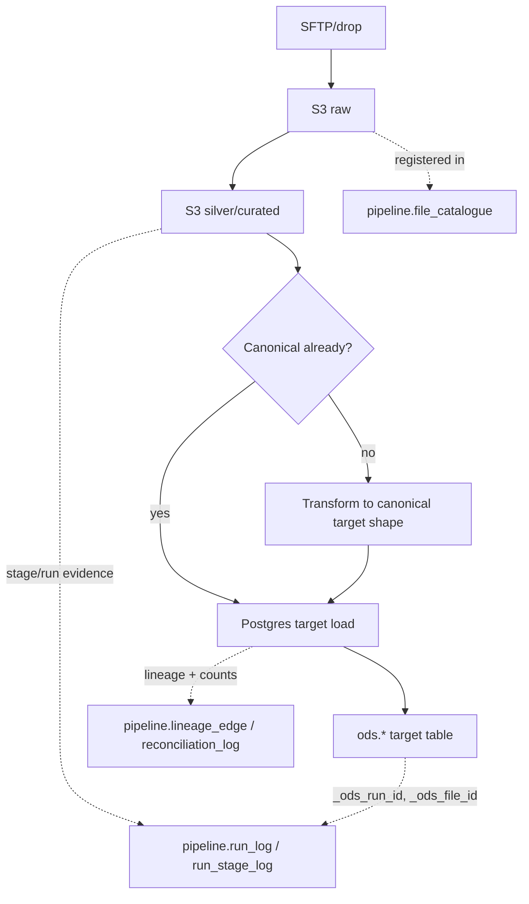
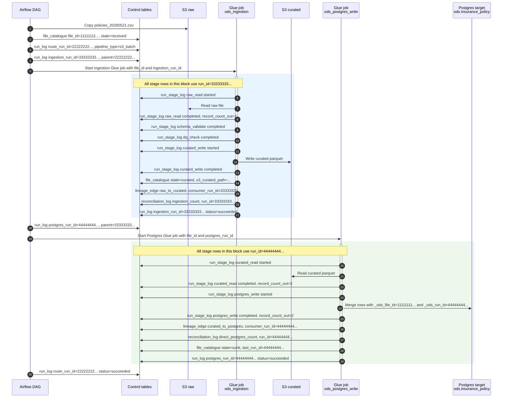

# Raw To Postgres: What Each Table Holds

This note shows what data is held as one landed file moves from raw storage,
through curated data, and into a Postgres target table.

Use this example file throughout:

```text
domain        insurance
dataset       country_codes
business_date 2026-05-21
source file   country_codes_20260521.csv
raw path      s3://ods-raw/insurance/country_codes/date=20260521/country_codes_20260521.csv
curated path  s3://ods-curated/insurance/country_codes/date=20260521/
target table  ods.insurance_country_code
```

## Route Shape



`S3 raw` and `S3 silver/curated` are storage assets, not Postgres tables. The
`pipeline.*` tables are the control ledger around those assets. The `ods.*`
table is the serving table that users or downstream systems query.

## Summary

| Table or asset | Grain | What it holds |
|---|---|---|
| S3 raw | One immutable source file copy | The original file exactly as received, plus full history by path/date. |
| S3 silver/curated | One validated dataset output for a file/run | Validated rows, ODS metadata columns, and possibly source-shape or canonical-shape columns. |
| `pipeline.dataset_config` | One row per logical dataset/version | Route configuration: source type, delivery, file pattern, schema/DQ rules, target table, write mode, key fields, transform path. |
| `pipeline.file_catalogue` | One row per landed raw file | File identity and lifecycle: file id, raw path, source path, MD5, business date, curated path, state, counts, last run. |
| `pipeline.file_processing_attempt` | One row per processed S3 object path | Idempotency state for a path: processing/completed/failed, run id, count, error. |
| `pipeline.run_log` | One row per run | Run lifecycle: route run, ingestion run, direct-Postgres run, status, counts, config version, parent metadata, runtime context. |
| `pipeline.run_stage_log` | One row per stage attempt | Step-level evidence: raw read, schema validate, DQ check, curated write, transform, Postgres write, counts, paths, errors. |
| `pipeline.lineage_edge` | One row per data movement edge | Links from file/run to child run: raw to curated, curated to Postgres, source and target refs, record count. |
| `pipeline.reconciliation_log` | One row per count/check result | Count comparison result for ingestion or Postgres load: source count, target count, discrepancy, status, details. |
| `ods.*` target table | One row per business record, depending on write mode | Latest/current projection for upsert/replace, or append history for append, tagged with `_ods_*` linkage columns. |

## `pipeline.dataset_config`

This is the configuration row that tells the platform how the dataset should
move.

It holds things like:

| Field | Example | Meaning |
|---|---|---|
| `domain` | `insurance` | Business domain. |
| `dataset` | `country_codes` | Logical dataset name. |
| `source_type` | `s3_batch` | File-based source. |
| `delivery` | `direct_postgres` | Route to Postgres without Kafka publish. |
| `filename_pattern` | `^country_codes_(?P<bd>\d{8})\.csv$` | How the landed file is matched. |
| `schema_def` / `schema_id` / `schema_version` | dataset schema | Expected input shape. |
| `dq_rules` | JSON rules | Validation rules used before curated write. |
| `s3_curated_path` | `s3://ods-curated/insurance/country_codes/` | Silver/curated output root. |
| `postgres_target_table` | `ods.insurance_country_code` | Final Postgres target. |
| `write_mode` | `upsert` | How target rows are written. |
| `key_fields` | `["country_code"]` | Merge key for upsert/replace. |
| `is_canonical` | `true` or `false` | Whether curated rows already match target shape. |
| `transform_yaml_path` | `s3://.../transform.yaml` | Required when a non-canonical transform is needed. |
| `config_version_id` | `42` | Config version pinned to the run. |

This table is normally populated from YAML/config sync before files are run.

## `pipeline.file_catalogue`

This is the file identity table. It gets a row when the source file is accepted
and copied to raw S3.

Example row:

| Field | Example |
|---|---|
| `file_id` | `11111111-1111-1111-1111-111111111111` |
| `domain` | `insurance` |
| `dataset` | `country_codes` |
| `business_date` | `2026-05-21` |
| `sftp_path` | `/upload/country_codes_20260521.csv` |
| `s3_raw_path` | `s3://ods-raw/insurance/country_codes/date=20260521/country_codes_20260521.csv` |
| `file_md5` | MD5 of the source file bytes |
| `file_size_bytes` | file size from the landed file |
| `source_row_count` | count read from the file, if known |
| `s3_curated_path` | filled after curated write succeeds |
| `state` | `received`, `ingesting`, `curated`, `sunk`, or `failed` |
| `last_run_id` | most recent run that touched this file |

Important: `file_id` represents the original received file. It is the value
that should appear in target rows as `_ods_file_id`.

## `pipeline.run_log`

This is the run header table. It says that a unit of work exists and whether it
is running, succeeded, failed, or partial.

For direct Postgres, there are usually separate rows for:

| Run | Example `pipeline_type` | Purpose |
|---|---|---|
| Route run | `s3_batch` | Parent/orchestration run for the file route. |
| Ingestion run | `ingestion` | Raw S3 to curated S3. |
| Postgres run | `direct_postgres` | Curated S3 to Postgres target table. |

Example ingestion run row:

| Field | Example |
|---|---|
| `run_id` | `22222222-2222-2222-2222-222222222222` |
| `pipeline_type` | `ingestion` |
| `domain` / `dataset` | `insurance` / `country_codes` |
| `business_date` | `2026-05-21` |
| `file_id` | `11111111-1111-1111-1111-111111111111` |
| `status` | `running`, then `succeeded` |
| `record_count_source` | `100` |
| `record_count_dq_pass` | `100` |
| `record_count_dq_fail` | `0` |
| `config_version_id` | config version used by this run |
| `orchestrators` | route/run parent metadata |
| `runtime_context` | Glue/Airflow/Spark/CloudWatch correlation IDs |

Example `runtime_context`:

```json
{
  "platform": "glue",
  "glue_job_name": "ods_postgres_write",
  "glue_job_run_id": "jr_123456789",
  "spark_app_id": "application_1716290000000_0001",
  "airflow_dag_id": "dag_ingest_direct_postgres",
  "airflow_run_id": "manual__2026-05-23T09:15:00+00:00"
}
```

`runtime_context` helps find platform logs. It does not replace `run_id`.

## `pipeline.run_stage_log`

This is the step-level evidence table. A run can have many stage rows.

Example ingestion stages:

| Stage | Input | Output | Counts |
|---|---|---|---|
| `raw_read` | S3 raw file | in-memory dataframe | `record_count_out=100` |
| `schema_validate` | raw dataframe | valid dataframe | pass/fail count or metrics |
| `dq_check` | valid dataframe | accepted/rejected rows | DQ pass/fail count |
| `curated_write` | accepted rows | S3 curated path | `record_count_out=100` |

Example direct-Postgres stages:

| Stage | Input | Output | Counts |
|---|---|---|---|
| `curated_read` | S3 curated path | dataframe | `record_count_out=100` |
| `canonical_transform` | source-shape rows | target-shape rows | used only when `is_canonical=false` |
| `postgres_write` | target-shape rows | `ods.insurance_country_code` | `record_count_out=100` |
| `finalise` | run state | terminal status | optional final checkpoint |

Each row can hold:

```text
run_id, stage, status, event_type, attempt_number,
input_ref, output_ref,
record_count_in, record_count_out,
metrics, error,
airflow_dag_id, airflow_run_id, spark_app_id
```

## `pipeline.file_processing_attempt`

This table is a simpler idempotency marker for a processed S3 path.

Example row:

| Field | Example |
|---|---|
| `s3_path` | `s3://ods-curated/insurance/country_codes/date=20260521/` |
| `run_id` | ingestion run id |
| `status` | `processing`, `completed`, or `failed` |
| `record_count` | `100` |
| `error_reason` | failure reason, if any |

Use this to answer: "Has this S3 object/path already been processed?"

## `pipeline.lineage_edge`

This is the graph table. It records how data moved between assets and runs.

For one direct-Postgres file route, expect at least two useful edges:

| Edge | `consumer_run_id` | `source_file_id` | `source_ref` | `target_ref` |
|---|---|---|---|---|
| `raw_to_curated` | ingestion run id | original `file_id` | S3 raw file | S3 curated path |
| `curated_to_postgres` | direct-Postgres run id | original `file_id` | S3 curated path | Postgres target table |

If a transform combines multiple files, write multiple edges into the same
child run: one edge per contributing input file/run. That keeps the graph able
to walk back to every raw input.

## `pipeline.reconciliation_log`

This is the count/check result table. It does not hold the reconciliation logic
itself; it holds the result of a check that the route performed.

Example checks:

| Check | Run | Typical counts |
|---|---|---|
| `ingestion_count` | ingestion run id | source file rows vs curated rows |
| `direct_postgres_count` | direct-Postgres run id | curated/loaded rows vs Postgres rows |

Example row:

| Field | Example |
|---|---|
| `check_type` | `direct_postgres_count` |
| `run_id` | direct-Postgres run id |
| `domain` / `dataset` | `insurance` / `country_codes` |
| `business_date` | `2026-05-21` |
| `source_count` | `100` |
| `postgres_count` | `100` |
| `discrepancy_count` | `0` |
| `discrepancy_pct` | `0.0000` |
| `status` | `ok` or `failed` |
| `detail` | human-readable explanation |

## `ods.*` Postgres Target Table

This is where the business data lands.

For an upsert/current table, it should contain the latest merged projection:

| Column type | Example |
|---|---|
| Business key | `country_code` |
| Business attributes | `country_name` |
| Linkage metadata | `_ods_file_id`, `_ods_run_id`, `_ods_business_date` |
| Convenience metadata | `_ods_domain`, `_ods_dataset` |
| Load metadata | `_ods_ingested_at`, `_ods_inserted_at` |

Example row:

| Field | Example |
|---|---|
| `country_code` | `GB` |
| `country_name` | `United Kingdom` |
| `_ods_file_id` | `11111111-1111-1111-1111-111111111111` |
| `_ods_run_id` | direct-Postgres run id |
| `_ods_business_date` | `2026-05-21` |
| `_ods_domain` | `insurance` |
| `_ods_dataset` | `country_codes` |

For a non-canonical file, the target table holds the canonical target shape,
not necessarily the original source column names. The transform happens between
curated read and Postgres write.

For an append table, every load can add new rows. For an upsert table, the
business key is merged so Postgres holds the latest row, while S3 raw and S3
curated keep the full file/run history.

## End State For One Successful File

After a successful direct-Postgres route:

| Place | Expected state |
|---|---|
| S3 raw | Original file exists permanently. |
| S3 curated | Validated output exists for the run/date. |
| `pipeline.file_catalogue` | One row for the file, `state='sunk'`, with raw and curated paths. |
| `pipeline.run_log` | Route, ingestion, and direct-Postgres runs are terminal. |
| `pipeline.run_stage_log` | Stage rows show what started, completed, warned, skipped, or failed. |
| `pipeline.lineage_edge` | Edges link raw to curated and curated to Postgres. |
| `pipeline.reconciliation_log` | Count checks show whether the movement balanced. |
| `ods.*` target table | Business rows are present and tagged with `_ods_file_id` and `_ods_run_id`. |

## Appendix: Table Columns And Example Data

The example below assumes one Airflow DAG owns the route when a policy file
arrives. That DAG triggers two Glue jobs in sequence:

| Component | What it does |
|---|---|
| Airflow DAG | Detects/receives the file event, registers the file, creates the route run, and triggers the Glue jobs. |
| Glue job 1: `ods_ingestion` | Reads the raw CSV, validates schema and DQ rules, and writes curated Parquet. |
| Glue job 2: `ods_postgres_write` | Reads curated Parquet, applies a transform if needed, and writes/merges rows into Postgres. |
| Control tables | Hold the durable evidence for file identity, run ids, stages, lineage, reconciliation, and target-row linkage. |

Example ids used in the rows below:

```text
file_id          11111111-1111-1111-1111-111111111111
route_run_id     22222222-2222-2222-2222-222222222222
ingestion_run_id 33333333-3333-3333-3333-333333333333
postgres_run_id  44444444-4444-4444-4444-444444444444
```

### Appendix Sequence Map



Read this top to bottom. The same `file_id` follows the file from landing to
the target rows. The `postgres_run_id` is the run that wrote the Postgres rows,
so it becomes the target `_ods_run_id`.

### Appendix Swim Lane Map

```mermaid
flowchart LR
    subgraph L1["Airflow DAG lane"]
        direction TB
        A1["Detect policies_20260521.csv"]
        A2["Copy file to S3 raw"]
        A3["Create route_run_id<br/>22222222..."]
        A4["Create ingestion_run_id<br/>33333333..."]
        A5["Start ods_ingestion Glue job"]
        A6["Create postgres_run_id<br/>44444444..."]
        A7["Start ods_postgres_write Glue job"]
        A8["Mark route run succeeded"]
    end

    subgraph L2["Control table lane"]
        direction TB
        C1["file_catalogue<br/>file_id=11111111...<br/>state=received"]
        C2["run_log<br/>s3_batch route run"]
        C3["run_log<br/>ingestion run"]
        C4["run_stage_log<br/>raw_read / schema_validate / dq_check / curated_write"]
        C5["lineage_edge<br/>raw_to_curated"]
        C6["reconciliation_log<br/>ingestion_count"]
        C7["run_log<br/>direct_postgres run"]
        C8["run_stage_log<br/>curated_read / postgres_write"]
        C9["lineage_edge<br/>curated_to_postgres"]
        C10["reconciliation_log<br/>direct_postgres_count"]
        C11["file_catalogue<br/>state=sunk<br/>last_run_id=44444444..."]
    end

    subgraph L3["S3 lane"]
        direction TB
        S1["S3 raw<br/>policies_20260521.csv"]
        S2["S3 curated<br/>insurance/policies/date=20260521/"]
    end

    subgraph L4["Glue ingestion job lane"]
        direction TB
        G1["raw_read"]
        G2["schema_validate"]
        G3["dq_check"]
        G4["curated_write"]
    end

    subgraph L5["Glue Postgres job lane"]
        direction TB
        P1["curated_read"]
        P2["postgres_write"]
    end

    subgraph L6["Postgres target lane"]
        direction TB
        T1["ods.insurance_policy<br/>_ods_file_id=11111111...<br/>_ods_run_id=44444444..."]
    end

    A1 --> A2 --> S1
    A2 --> C1 --> A3 --> C2 --> A4 --> C3 --> A5
    A5 --> G1 --> G2 --> G3 --> G4 --> S2
    G1 --> C4
    G2 --> C4
    G3 --> C4
    G4 --> C4
    G4 --> C5 --> C6
    C6 --> A6 --> C7 --> A7
    A7 --> P1 --> P2 --> T1
    P1 --> C8
    P2 --> C8
    P2 --> C9 --> C10 --> C11 --> A8

    classDef airflow fill:#f4ecff,stroke:#7c3aed,color:#1f1633;
    classDef control fill:#fff7d6,stroke:#b7791f,color:#2f2600;
    classDef s3 fill:#e6f6ff,stroke:#0284c7,color:#052f4f;
    classDef glueIngest fill:#eaf2ff,stroke:#2563eb,color:#081f4d;
    classDef gluePostgres fill:#eaf8ea,stroke:#16a34a,color:#052e16;
    classDef target fill:#ffecec,stroke:#dc2626,color:#3f0a0a;

    class A1,A2,A3,A4,A5,A6,A7,A8 airflow;
    class C1,C2,C3,C4,C5,C6,C7,C8,C9,C10,C11 control;
    class S1,S2 s3;
    class G1,G2,G3,G4 glueIngest;
    class P1,P2 gluePostgres;
    class T1 target;
```



| ID | Appears in | Purpose |
|---|---|---|
| `file_id` | `pipeline.file_catalogue.file_id`, `pipeline.run_log.file_id`, `pipeline.lineage_edge.source_file_id`, target `_ods_file_id` | Identifies the original landed file. |
| `route_run_id` | `pipeline.run_log.run_id`, child run `orchestrators` | Identifies the parent route/orchestration run. |
| `ingestion_run_id` | `pipeline.run_log.run_id`, `pipeline.run_stage_log.run_id`, `pipeline.lineage_edge.consumer_run_id` for `raw_to_curated` | Identifies the raw-to-curated run. |
| `postgres_run_id` | `pipeline.run_log.run_id`, `pipeline.run_stage_log.run_id`, `pipeline.reconciliation_log.run_id`, target `_ods_run_id` | Identifies the curated-to-Postgres load that wrote the target rows. |

### `pipeline.dataset_config`

| id | domain | dataset | filename_pattern | target_topic | schema_id | schema_version | key_fields | dq_rules | data_classification | active | version | created_at | updated_at | source_type | schema_def | postgres_target_table | s3_curated_path | config_version_id | config_yaml_hash | config_pinned_at | recon_tolerance_records | recon_tolerance_pct | slot_name | merge_dataset | staging_table | write_mode | is_canonical | canonical_topic | canonical_schema_id | transform_yaml_path | raw_format | source_config | delivery |
|---|---|---|---|---|---|---|---|---|---|---|---|---|---|---|---|---|---|---|---|---|---|---|---|---|---|---|---|---|---|---|---|---|---|
| 101 | insurance | policies | policies_(?P<bd>\d{8})\.csv | NULL | ods.insurance.policies-value | 1 | ["policy_id"] | {"hard_blocks":[{"field":"policy_id","rule":"not_null"},{"field":"policy_id","rule":"unique"}],"soft_warns":[{"fields":["premium"],"rule":"completeness_pct","threshold":0.95}]} | Confidential | true | 1 | 2026-05-23 09:00:00 | 2026-05-23 09:00:00 | s3_batch | {"columns":["policy_id","status","premium","effective_date"]} | ods.insurance_policy | s3://ods-curated-local/insurance/policies/ | 42 | 0000000000000000000000000000000000000000000000000000000000000000 | 2026-05-23 09:00:00 | 0 | 0.0000 | NULL | NULL | NULL | upsert | true | NULL | NULL | NULL | csv | {"delimiter":",","header":true} | direct_postgres |

### `pipeline.file_catalogue`

| file_id | domain | dataset | business_date | sftp_path | s3_raw_path | s3_staging_parquet_path | s3_curated_path | file_size_bytes | source_row_count | file_md5 | state | state_updated_at | first_seen_at | last_run_id |
|---|---|---|---|---|---|---|---|---|---|---|---|---|---|---|
| 11111111-1111-1111-1111-111111111111 | insurance | policies | 2026-05-21 | /upload/policies_20260521.csv | s3://ods-raw-local/insurance/policies/date=20260521/policies_20260521.csv | NULL | s3://ods-curated-local/insurance/policies/date=20260521/ | 4096 | 2 | 9f86d081884c7d659a2feaa0c55ad015 | sunk | 2026-05-23 09:07:00 | 2026-05-23 09:01:00 | 44444444-4444-4444-4444-444444444444 |

### `pipeline.file_processing_attempt`

| id | s3_path | run_id | status | record_count | error_reason | created_at | updated_at |
|---|---|---|---|---|---|---|---|
| 5001 | s3://ods-curated-local/insurance/policies/date=20260521/ | 33333333-3333-3333-3333-333333333333 | completed | 2 | NULL | 2026-05-23 09:04:00 | 2026-05-23 09:04:30 |

### `pipeline.run_log`

| run_id | pipeline_type | domain | dataset | business_date | file_id | status | started_at | ended_at | record_count_source | record_count_dq_pass | record_count_dq_fail | record_count_published | kafka_topic | kafka_offset_start | kafka_offset_end | config_version_id | schema_version_id | orchestrators | error_summary | created_at | runtime_context |
|---|---|---|---|---|---|---|---|---|---|---|---|---|---|---|---|---|---|---|---|---|---|
| 22222222-2222-2222-2222-222222222222 | s3_batch | insurance | policies | 2026-05-21 | 11111111-1111-1111-1111-111111111111 | succeeded | 2026-05-23 09:01:00 | 2026-05-23 09:08:00 | 2 | 2 | 0 | 2 | NULL | NULL | NULL | 42 | 1 | NULL | NULL | 2026-05-23 09:01:00 | {"airflow_dag_id":"dag_drop_to_raw","airflow_run_id":"manual__2026-05-23T09:01:00+00:00"} |
| 33333333-3333-3333-3333-333333333333 | ingestion | insurance | policies | 2026-05-21 | 11111111-1111-1111-1111-111111111111 | succeeded | 2026-05-23 09:02:00 | 2026-05-23 09:05:00 | 2 | 2 | 0 | 2 | NULL | NULL | NULL | 42 | 1 | [{"run_id":"22222222-2222-2222-2222-222222222222","edge_type":"orchestrates"}] | NULL | 2026-05-23 09:02:00 | {"platform":"glue","glue_job_name":"ods_ingestion","glue_job_run_id":"jr_ingest_001","spark_app_id":"application_001"} |
| 44444444-4444-4444-4444-444444444444 | direct_postgres | insurance | policies | 2026-05-21 | 11111111-1111-1111-1111-111111111111 | succeeded | 2026-05-23 09:05:00 | 2026-05-23 09:07:00 | 2 | NULL | NULL | 2 | NULL | NULL | NULL | 42 | 1 | [{"run_id":"22222222-2222-2222-2222-222222222222","edge_type":"orchestrates"},{"run_id":"33333333-3333-3333-3333-333333333333","edge_type":"uses_curated_output"}] | NULL | 2026-05-23 09:05:00 | {"platform":"glue","glue_job_name":"ods_postgres_write","glue_job_run_id":"jr_pg_001","spark_app_id":"application_002"} |

### `pipeline.run_stage_log`

| id | run_id | stage | status | started_at | ended_at | input_ref | output_ref | record_count_in | record_count_out | metrics | error | event_type | attempt_number | airflow_dag_id | airflow_run_id | spark_app_id |
|---|---|---|---|---|---|---|---|---|---|---|---|---|---|---|---|---|
| 9001 | 33333333-3333-3333-3333-333333333333 | raw_read | succeeded | 2026-05-23 09:02:00 | 2026-05-23 09:02:10 | s3://ods-raw-local/insurance/policies/date=20260521/policies_20260521.csv | NULL | NULL | 2 | {"format":"csv"} | NULL | stage_completed | 1 | dag_ingest_direct_postgres | manual__2026-05-23T09:02:00+00:00 | application_001 |
| 9002 | 33333333-3333-3333-3333-333333333333 | schema_validate | succeeded | 2026-05-23 09:02:10 | 2026-05-23 09:02:20 | s3://ods-raw-local/insurance/policies/date=20260521/policies_20260521.csv | NULL | 2 | 2 | {"schema_version":1} | NULL | stage_completed | 1 | dag_ingest_direct_postgres | manual__2026-05-23T09:02:00+00:00 | application_001 |
| 9003 | 33333333-3333-3333-3333-333333333333 | dq_check | succeeded | 2026-05-23 09:02:20 | 2026-05-23 09:02:30 | NULL | NULL | 2 | 2 | {"hard_failures":0,"soft_warnings":0} | NULL | stage_completed | 1 | dag_ingest_direct_postgres | manual__2026-05-23T09:02:00+00:00 | application_001 |
| 9004 | 33333333-3333-3333-3333-333333333333 | curated_write | succeeded | 2026-05-23 09:02:30 | 2026-05-23 09:04:30 | NULL | s3://ods-curated-local/insurance/policies/date=20260521/ | 2 | 2 | {"format":"parquet"} | NULL | stage_completed | 1 | dag_ingest_direct_postgres | manual__2026-05-23T09:02:00+00:00 | application_001 |
| 9005 | 44444444-4444-4444-4444-444444444444 | curated_read | succeeded | 2026-05-23 09:05:00 | 2026-05-23 09:05:15 | s3://ods-curated-local/insurance/policies/date=20260521/ | NULL | NULL | 2 | {"format":"parquet"} | NULL | stage_completed | 1 | dag_ingest_direct_postgres | manual__2026-05-23T09:05:00+00:00 | application_002 |
| 9006 | 44444444-4444-4444-4444-444444444444 | postgres_write | succeeded | 2026-05-23 09:05:15 | 2026-05-23 09:06:30 | s3://ods-curated-local/insurance/policies/date=20260521/ | ods.insurance_policy | 2 | 2 | {"write_mode":"upsert"} | NULL | stage_completed | 1 | dag_ingest_direct_postgres | manual__2026-05-23T09:05:00+00:00 | application_002 |

### `pipeline.lineage_edge`

| lineage_edge_id | consumer_run_id | upstream_run_id | source_file_id | edge_type | source_ref | target_ref | record_count | created_at |
|---|---|---|---|---|---|---|---|---|
| 7001 | 33333333-3333-3333-3333-333333333333 | 22222222-2222-2222-2222-222222222222 | 11111111-1111-1111-1111-111111111111 | raw_to_curated | s3://ods-raw-local/insurance/policies/date=20260521/policies_20260521.csv | s3://ods-curated-local/insurance/policies/date=20260521/ | 2 | 2026-05-23 09:04:30 |
| 7002 | 44444444-4444-4444-4444-444444444444 | 33333333-3333-3333-3333-333333333333 | 11111111-1111-1111-1111-111111111111 | curated_to_postgres | s3://ods-curated-local/insurance/policies/date=20260521/ | ods.insurance_policy | 2 | 2026-05-23 09:06:30 |

### `pipeline.reconciliation_log`

| id | check_type | run_id | domain | dataset | business_date | window_start | window_end | source_count | kafka_count | postgres_count | discrepancy_count | discrepancy_pct | status | detail | created_at |
|---|---|---|---|---|---|---|---|---|---|---|---|---|---|---|---|
| 8001 | ingestion_count | 33333333-3333-3333-3333-333333333333 | insurance | policies | 2026-05-21 | NULL | NULL | 2 | NULL | NULL | 0 | 0.0000 | ok | raw=2, curated=2 | 2026-05-23 09:04:30 |
| 8002 | direct_postgres_count | 44444444-4444-4444-4444-444444444444 | insurance | policies | 2026-05-21 | NULL | NULL | 2 | NULL | 2 | 0 | 0.0000 | ok | curated=2, postgres=2 | 2026-05-23 09:06:30 |

### `ods.insurance_policy`

| policy_id | status | premium | premium_amount | start_date | end_date | effective_date | agent_code | postcode | _ods_run_id | _ods_business_date | _ods_ingested_at | _ods_file_id | _ods_domain | _ods_dataset | _ods_source_application |
|---|---|---|---|---|---|---|---|---|---|---|---|---|---|---|---|
| POL-1001 | active | 120.50 | 120.50 | 2026-01-01 | 2026-12-31 | 2026-01-01 | AG001 | SW1A1AA | 44444444-4444-4444-4444-444444444444 | 2026-05-21 | 2026-05-23 09:06:30 | 11111111-1111-1111-1111-111111111111 | insurance | policies | policy-admin |
| POL-1002 | cancelled | 89.99 | 89.99 | 2026-02-01 | 2026-08-31 | 2026-02-01 | AG002 | M11AE | 44444444-4444-4444-4444-444444444444 | 2026-05-21 | 2026-05-23 09:06:30 | 11111111-1111-1111-1111-111111111111 | insurance | policies | policy-admin |

### `ods.insurance_policy_history`

| policy_id | status | premium | effective_date | _ods_business_date | _ods_run_id | _ods_ingested_at | _ods_file_id | _ods_domain | _ods_dataset | _ods_source_application |
|---|---|---|---|---|---|---|---|---|---|---|
| POL-1001 | active | 120.50 | 2026-01-01 | 2026-05-21 | 44444444-4444-4444-4444-444444444444 | 2026-05-23 09:06:30 | 11111111-1111-1111-1111-111111111111 | insurance | policies | policy-admin |
| POL-1002 | cancelled | 89.99 | 2026-02-01 | 2026-05-21 | 44444444-4444-4444-4444-444444444444 | 2026-05-23 09:06:30 | 11111111-1111-1111-1111-111111111111 | insurance | policies | policy-admin |
