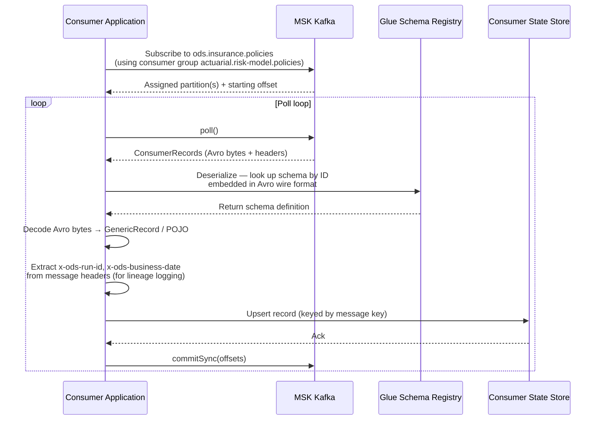
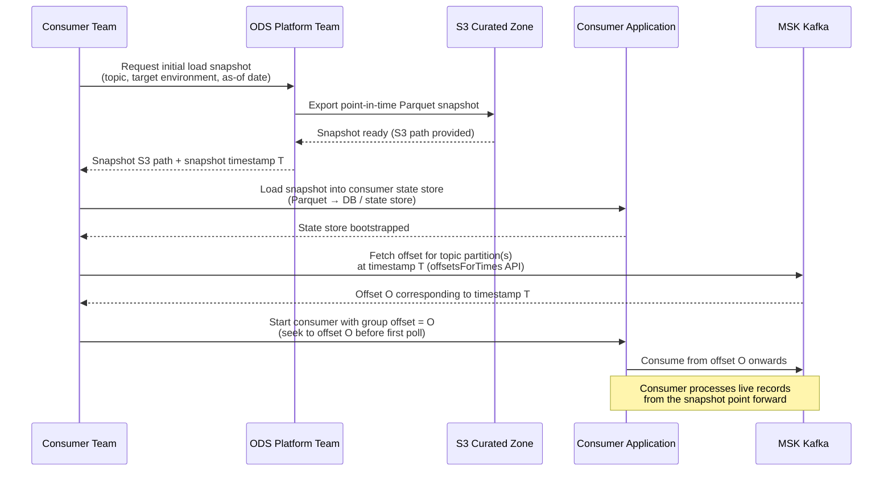

# ODS Platform — Consumer Onboarding Guide
**Date:** 2026-04-15  
**Status:** Draft  
**Audience:** Engineering teams connecting to ODS Kafka topics as downstream consumers

---

## Contents

1. [What the ODS Platform Provides](#1-what-the-ods-platform-provides)
2. [Getting Access](#2-getting-access)
3. [Consumer Group Naming Convention](#3-consumer-group-naming-convention)
4. [Connecting to MSK](#4-connecting-to-msk)
5. [Schema Registry Integration](#5-schema-registry-integration)
6. [Offset Management](#6-offset-management)
7. [Initial Data Load](#7-initial-data-load)
8. [Handling Duplicates](#8-handling-duplicates)
9. [Consumer Responsibilities](#9-consumer-responsibilities)
10. [SLA and Support](#10-sla-and-support)
11. [Checklist for Going Live](#11-checklist-for-going-live)

---

## 1. What the ODS Platform Provides

### 1.1 Platform overview

The Operational Data Store (ODS) platform ingests business data from multiple source systems and publishes it to AWS MSK (Kafka) topics. Downstream teams consume from those topics to build models, feed downstream systems, generate reports, or power operational tooling.

The platform owns everything up to and including the message being available in Kafka. What you do with the message after that is your responsibility.

### 1.2 Topics available

Topics follow the naming pattern:

```
ods.{domain}.{dataset}
```

Examples:

| Topic | Description |
|---|---|
| `ods.insurance.policies` | Policy records from the core insurance system |
| `ods.insurance.claims` | Claims records |
| `ods.finance.premiums` | Premium payment records |

Contact the ODS platform team for a full catalogue of live topics and the datasets they contain.

### 1.3 What the platform guarantees

| Guarantee | Detail |
|---|---|
| Atomic file publishing | All records from a source file are published together or not at all. You will never see a partial file in Kafka. |
| Per-entity ordering | Messages for the same entity (same message key) always land on the same partition. Read one partition sequentially and you see that entity's events in order. |
| Exactly-once publishing | The pipeline uses Kafka transactions + `acks=all`. A record written to Kafka is written exactly once by the producer. |
| Schema registration | Every message value is Avro-encoded. The schema is registered in AWS Glue Schema Registry before any message is published. |
| Lineage metadata | Every message carries headers identifying the run, source path, business date, schema version, and pipeline type. |

### 1.4 What the platform does NOT guarantee

- **Sub-second latency.** The S3-batch pattern is batch-driven. Expect file-to-Kafka latency of up to ~10 minutes p95. This is not a real-time streaming platform.
- **Infinite retention.** Topic retention has not yet been formally decided (TBD). Do not design a consumer that relies on the topic holding many weeks of history for bootstrapping — use the initial load process instead (section 7).
- **Consumer-side correctness.** Schema compatibility, offset management, idempotent processing, and consumer lag monitoring are all the consumer's responsibility.
- **Duplicate suppression at the consumer.** Exactly-once publishing means we will not publish the same record twice under normal operation. However, if a source file is manually resubmitted, duplicate messages with the same key may appear. Consumers must handle this (section 8).

---

## 2. Getting Access

### 2.1 Step-by-step access request

**Step 1 — Identify what you need**

Before raising a request, gather the following:

| Item | Example |
|---|---|
| Topic(s) you want to consume | `ods.insurance.policies` |
| Target environment(s) | dev, staging, prod |
| Your team name | `actuarial` |
| Your application name | `risk-model` |
| AWS account ID(s) you will connect from | `123456789012` |
| Expected consumer group name | `actuarial.risk-model.policies` |
| Justification / use case | "Feed policy data into the reserving model" |

**Step 2 — Raise an access request**

Contact the ODS platform team via the agreed intake channel (Jira project `ODS-ACCESS`, or the `#ods-platform` Slack channel). Provide the information from step 1.

**Step 3 — IAM permissions granted**

The platform team will create or update an IAM policy granting your principal:

```json
{
  "Effect": "Allow",
  "Action": [
    "kafka-cluster:Connect",
    "kafka-cluster:DescribeGroup",
    "kafka-cluster:AlterGroup",
    "kafka-cluster:ReadData",
    "kafka-cluster:DescribeTopic"
  ],
  "Resource": [
    "arn:aws:kafka:{region}:{account}:cluster/ods-msk-{env}/*",
    "arn:aws:kafka:{region}:{account}:topic/ods-msk-{env}/*/ods.{domain}.{dataset}",
    "arn:aws:kafka:{region}:{account}:group/ods-msk-{env}/*/{team}.{application}.{dataset}"
  ]
}
```

> Note: the group ARN is scoped to your specific consumer group name — you will not be able to use an incorrectly named group.

**Step 4 — Glue Schema Registry read access**

The platform team will also grant read access to the schema registry:

```json
{
  "Effect": "Allow",
  "Action": [
    "glue:GetRegistry",
    "glue:GetSchema",
    "glue:GetSchemaVersion",
    "glue:QuerySchemaVersionMetadata"
  ],
  "Resource": "arn:aws:glue:{region}:{account}:registry/ods-schema-registry-{env}"
}
```

**Step 5 — Environment promotion path**

Access is granted per environment, in this order:

```
dev  →  staging  →  prod
```

Start with `dev`. Request `staging` once your consumer is tested end-to-end. Request `prod` only after staging validation is complete and the checklist in section 11 is signed off.

### 2.2 Network access

MSK is deployed inside a VPC. Your application must either:

- Run inside the same VPC (or a peered VPC with appropriate security group rules), **or**
- Connect via AWS PrivateLink or a VPN/Direct Connect path.

The platform team will provide the correct VPC/subnet details at access grant time.

---

## 3. Consumer Group Naming Convention

### 3.1 Required pattern

All consumer groups **must** follow this pattern:

```
{team}.{application}.{dataset}
```

| Segment | Description | Example |
|---|---|---|
| `team` | The owning team's short name | `actuarial`, `finance`, `data-science` |
| `application` | The specific application or service consuming | `risk-model`, `reporting-api`, `ml-pipeline` |
| `dataset` | The dataset being consumed (matches the topic's `{dataset}` segment) | `policies`, `claims`, `premiums` |

**Good examples:**

```
actuarial.risk-model.policies
finance.reporting-api.premiums
data-science.churn-model.policies
platform.audit-consumer.policies
```

**Bad examples — do not use:**

```
my-consumer                     # no team, no dataset — unidentifiable
test                            # meaningless in production
policies-consumer               # no team identifier
ActuarialPolicies               # wrong format, case inconsistency
actuarial.policies              # missing application segment
```

### 3.2 Why this matters

- The platform team uses consumer group names to monitor consumer lag in CloudWatch MSK consumer lag metrics. Without a recognisable name, we cannot tell who is lagging.
- It prevents naming collisions between teams.
- The IAM policy for your consumer group is scoped to the name you register. If your application uses a different name, IAM will deny the connection.
- It allows the platform team to reach out proactively if your consumer falls significantly behind.

### 3.3 What happens if the convention is not followed

- Your connection will be denied by IAM (the group ARN will not match the policy).
- If you somehow connect with an unrecognised name, the platform team will contact you to rename it. Consumer groups can be renamed by stopping the consumer, deleting the group offset, and restarting with the correct name — but this resets your committed offset.

---

## 4. Connecting to MSK

### 4.1 Bootstrap server addresses

Bootstrap server addresses follow this format (actual values provided at access grant):

```
b-1.ods-msk-{env}.{id}.c{n}.kafka.{region}.amazonaws.com:9098
b-2.ods-msk-{env}.{id}.c{n}.kafka.{region}.amazonaws.com:9098
b-3.ods-msk-{env}.{id}.c{n}.kafka.{region}.amazonaws.com:9098
```

Port `9098` is the IAM-authenticated MSK port. Use this port regardless of whether IAM or SASL/SCRAM is in use (TBD — see section 4.2).

### 4.2 Authentication method

> **TBD** — the ODS platform supports IAM authentication and SASL/SCRAM. The final choice for each environment is not yet formally decided. This guide covers IAM authentication as the primary path. The platform team will confirm the method at access grant time.

**IAM authentication** uses the `aws-msk-iam-auth` library. Your application's IAM role must have the Kafka permissions granted in section 2.1. No username/password is required.

### 4.3 Recommended client configuration

The following settings apply regardless of language. Adjust based on your processing throughput requirements.

| Configuration key | Recommended value | Rationale |
|---|---|---|
| `enable.auto.commit` | `false` | See section 6 — manual commit is mandatory |
| `auto.offset.reset` | `earliest` (new consumer groups) | Ensures you receive all available data on first start |
| `max.poll.records` | `500` | Balance throughput and processing latency |
| `session.timeout.ms` | `30000` | Gives the consumer 30s to recover before a rebalance is triggered |
| `heartbeat.interval.ms` | `10000` | Must be less than `session.timeout.ms / 3` |
| `max.poll.interval.ms` | `300000` | Set to exceed your slowest expected processing batch time |
| `fetch.min.bytes` | `1024` | Reduces fetch requests under low-volume conditions |
| `security.protocol` | `SASL_SSL` (IAM) | Required for MSK IAM auth |
| `sasl.mechanism` | `AWS_MSK_IAM` | Required for MSK IAM auth |

### 4.4 Java consumer configuration example

```java
// build.gradle dependency:
// implementation 'software.amazon.msk:aws-msk-iam-auth:2.1.1'
// implementation 'org.apache.kafka:kafka-clients:3.6.1'

import org.apache.kafka.clients.consumer.ConsumerConfig;
import org.apache.kafka.clients.consumer.KafkaConsumer;
import java.util.Properties;

Properties props = new Properties();

// Bootstrap servers — replace with values provided by the platform team
props.put(ConsumerConfig.BOOTSTRAP_SERVERS_CONFIG,
    "b-1.ods-msk-prod.xxxx.c3.kafka.eu-west-1.amazonaws.com:9098," +
    "b-2.ods-msk-prod.xxxx.c3.kafka.eu-west-1.amazonaws.com:9098," +
    "b-3.ods-msk-prod.xxxx.c3.kafka.eu-west-1.amazonaws.com:9098");

// Consumer group — must follow naming convention
props.put(ConsumerConfig.GROUP_ID_CONFIG, "actuarial.risk-model.policies");

// Offset management — always false; commit manually after processing
props.put(ConsumerConfig.ENABLE_AUTO_COMMIT_CONFIG, "false");
props.put(ConsumerConfig.AUTO_OFFSET_RESET_CONFIG, "earliest");

// Throughput tuning
props.put(ConsumerConfig.MAX_POLL_RECORDS_CONFIG, "500");
props.put(ConsumerConfig.SESSION_TIMEOUT_MS_CONFIG, "30000");
props.put(ConsumerConfig.HEARTBEAT_INTERVAL_MS_CONFIG, "10000");
props.put(ConsumerConfig.MAX_POLL_INTERVAL_MS_CONFIG, "300000");

// IAM authentication
props.put("security.protocol", "SASL_SSL");
props.put("sasl.mechanism", "AWS_MSK_IAM");
props.put("sasl.jaas.config",
    "software.amazon.msk.auth.iam.IAMLoginModule required;");
props.put("sasl.client.callback.handler.class",
    "software.amazon.msk.auth.iam.IAMClientCallbackHandler");

// Deserializer — see section 5 for Avro / Glue Schema Registry
props.put(ConsumerConfig.KEY_DESERIALIZER_CLASS_CONFIG,
    "org.apache.kafka.common.serialization.StringDeserializer");
props.put(ConsumerConfig.VALUE_DESERIALIZER_CLASS_CONFIG,
    "com.amazonaws.services.schemaregistry.deserializers.avro.AWSKafkaAvroDeserializer");

// Glue Schema Registry
props.put("region", "eu-west-1");
props.put("registry.name", "ods-schema-registry-prod");
props.put("avro.record.type", "GENERIC_RECORD");

KafkaConsumer<String, Object> consumer = new KafkaConsumer<>(props);
consumer.subscribe(List.of("ods.insurance.policies"));
```

### 4.5 Python consumer configuration example

```python
# pip install confluent-kafka aws-glue-schema-registry boto3

from confluent_kafka import Consumer
from aws_schema_registry import SchemaRegistryClient
from aws_schema_registry.avro import KafkaAvroDeserializer
import boto3

# IAM credentials are sourced from the execution environment
# (IAM role attached to ECS task, Lambda, EC2 instance profile, etc.)

conf = {
    # Bootstrap servers — replace with values provided by the platform team
    "bootstrap.servers": (
        "b-1.ods-msk-prod.xxxx.c3.kafka.eu-west-1.amazonaws.com:9098,"
        "b-2.ods-msk-prod.xxxx.c3.kafka.eu-west-1.amazonaws.com:9098,"
        "b-3.ods-msk-prod.xxxx.c3.kafka.eu-west-1.amazonaws.com:9098"
    ),
    # Consumer group — must follow naming convention
    "group.id": "actuarial.risk-model.policies",
    # Offset management
    "enable.auto.commit": False,
    "auto.offset.reset": "earliest",
    # Throughput tuning
    "max.poll.interval.ms": 300000,
    "session.timeout.ms": 30000,
    "heartbeat.interval.ms": 10000,
    # IAM authentication
    "security.protocol": "SASL_SSL",
    "sasl.mechanism": "AWS_MSK_IAM",
    "sasl.jaas.config": "software.amazon.msk.auth.iam.IAMLoginModule required;",
    "sasl.client.callback.handler.class": (
        "software.amazon.msk.auth.iam.IAMClientCallbackHandler"
    ),
}

# Glue Schema Registry deserializer
glue_client = boto3.client("glue", region_name="eu-west-1")
schema_registry_client = SchemaRegistryClient(
    glue_client,
    registry_name="ods-schema-registry-prod",
)
deserializer = KafkaAvroDeserializer(schema_registry_client)

consumer = Consumer(conf)
consumer.subscribe(["ods.insurance.policies"])
```

---

## 5. Schema Registry Integration

### 5.1 Overview

All ODS message values are Avro-encoded. The schema for each topic is registered in:

```
AWS Glue Schema Registry: ods-schema-registry-{env}
```

Schema names follow the pattern: `ods.{domain}.{dataset}` — matching the topic name.

Every message carries the schema version in the header `x-ods-schema-version`. You can use this for logging and debugging, but the Glue deserializer resolves the schema automatically — you do not need to read this header yourself for normal deserialization.

### 5.2 Consumer connection and deserialization flow



### 5.3 Schema evolution — how to handle it safely

The ODS platform follows these schema evolution rules:

| Change type | Platform action | Consumer impact |
|---|---|---|
| New optional field added | Deployed without notice | Your deserializer must not fail on unknown fields |
| Type widened (e.g. int → long) | Deployed without notice | Your deserializer must handle the wider type |
| Field removed (breaking) | Consumer sign-off required before deploy | Platform team contacts you in advance |
| Field renamed / type narrowed (breaking) | Consumer sign-off required before deploy | Platform team contacts you in advance |

**Critical:** your consumer must be built to tolerate unknown fields. Use the `READER_SCHEMA` approach — deserialize into a fixed reader schema that only includes the fields you care about. Unknown fields are silently ignored.

#### Java — reader schema (GENERIC_RECORD approach)

```java
// When deserializing, the AWS Glue deserializer uses the writer schema
// embedded in the message by default. For forward compatibility, configure
// READER_SCHEMA mode so unknown new fields are dropped silently.

props.put("avro.record.type", "GENERIC_RECORD");
// The deserializer will use the latest writer schema from the registry.
// When you access fields from a GenericRecord, only request fields
// you know about — do not iterate all fields if you want forward compat.

ConsumerRecord<String, GenericRecord> record = ...;
GenericRecord value = record.value();

// Safe access — returns null if field does not exist in this schema version
String policyRef = value.get("policy_ref") != null
    ? value.get("policy_ref").toString()
    : null;

// Log the schema version from headers for audit
Header versionHeader = record.headers().lastHeader("x-ods-schema-version");
String schemaVersion = versionHeader != null
    ? new String(versionHeader.value(), StandardCharsets.UTF_8)
    : "unknown";
```

#### Python — reader schema

```python
# The aws-glue-schema-registry library decodes using the writer schema
# by default. Access only fields you expect — do not assume a fixed schema.

for msg in consumer.consume(num_messages=500, timeout=1.0):
    if msg.error():
        handle_error(msg.error())
        continue

    record = deserializer.deserialize(msg.topic(), msg.value())

    # Access fields defensively
    policy_ref = record.get("policy_ref")
    effective_date = record.get("effective_date")

    # Log lineage from headers
    headers = dict(msg.headers() or [])
    schema_version = headers.get("x-ods-schema-version", b"unknown").decode()
    business_date = headers.get("x-ods-business-date", b"unknown").decode()
    run_id = headers.get("x-ods-run-id", b"unknown").decode()
```

### 5.4 Message headers reference

| Header | Type | Description |
|---|---|---|
| `x-ods-run-id` | UUID string | Unique identifier for the pipeline run that published this record |
| `x-ods-source-path` | String | S3 path of the source file (e.g. `s3://ods-curated-prod/insurance/policies/2026/04/14/...`) |
| `x-ods-business-date` | ISO 8601 date string | Business date of the data (not the processing date) |
| `x-ods-schema-version` | String | Schema version identifier as registered in Glue Schema Registry |
| `x-ods-pipeline-type` | String | One of: `s3-batch`, `cdc`, `api`, `event` |

---

## 6. Offset Management

### 6.1 Always disable auto-commit

```
enable.auto.commit = false
```

This is not a recommendation — it is required for correct consumer behaviour.

**Why auto-commit is dangerous:**

With `enable.auto.commit=true`, Kafka commits offsets on a timer (default every 5 seconds). This means:

1. Your consumer polls records and starts processing them.
2. The auto-commit timer fires and commits offsets — Kafka now believes those records were processed successfully.
3. Your application crashes before finishing processing.
4. On restart, your consumer resumes from the committed offset — **those records are skipped permanently**.

This results in silent data loss.

### 6.2 Correct pattern: process then commit

Always commit offsets **after** you have successfully persisted or processed the record.

#### Java — correct offset commit pattern

```java
while (true) {
    ConsumerRecords<String, GenericRecord> records = consumer.poll(Duration.ofSeconds(1));

    for (ConsumerRecord<String, GenericRecord> record : records) {
        try {
            processRecord(record);          // write to your state store / DB
        } catch (Exception e) {
            // Do not commit — let this record be reprocessed on restart
            log.error("Failed to process record at offset {}", record.offset(), e);
            // Depending on your error strategy: dead-letter or retry
            throw e;
        }
    }

    // Only commit after all records in the batch are successfully processed
    consumer.commitSync();
}
```

#### Python — correct offset commit pattern

```python
while True:
    messages = consumer.consume(num_messages=500, timeout=1.0)

    for msg in messages:
        if msg.error():
            raise KafkaException(msg.error())

        record = deserializer.deserialize(msg.topic(), msg.value())

        try:
            process_record(record)          # write to your state store / DB
        except Exception as e:
            # Do not commit — let this record be reprocessed on restart
            logger.error("Failed to process record: %s", e)
            raise

    # Only commit after all records in the batch are successfully processed
    consumer.commit(asynchronous=False)
```

### 6.3 Consumer restart behaviour

When your consumer restarts, it will resume from the last committed offset. Records between the last committed offset and the crash point will be reprocessed. **Your processing logic must be idempotent** — see section 8.

### 6.4 Initial offset policy

| Scenario | `auto.offset.reset` setting | Behaviour |
|---|---|---|
| New consumer group — you want all available data | `earliest` | Starts from the earliest available offset in the retention window |
| Real-time-only consumer — historical data not needed | `latest` | Starts from the current end of the topic; only receives new messages |
| Historical data beyond retention window | Neither — use initial load | See section 7 |

> For most consumers, use `earliest`. If the topic has been live for a while and retention is limited, combine `earliest` with the initial load process (section 7) to ensure you have complete history before switching to live Kafka consumption.

---

## 7. Initial Data Load

### 7.1 The problem

Topic retention has not yet been formally decided (TBD). Depending on how long a topic has been live, the Kafka retention window may not contain the full history of the dataset. A new consumer that subscribes from `earliest` may miss records published before the retention window.

**Do not assume the topic holds complete history. If you need historical data, request an initial load.**

### 7.2 Initial load + Kafka bootstrap process



### 7.3 Step-by-step

**Step 1 — Request a snapshot from the platform team**

Contact the ODS platform team (Jira `ODS-ACCESS` or `#ods-platform`) with:
- Topic name(s)
- Environment
- Desired snapshot as-of date (e.g. "as at close of business 2026-04-14")

The platform team will export a point-in-time Parquet snapshot from S3 Curated and provide you with the S3 path and the exact snapshot timestamp `T`.

**Step 2 — Load the snapshot into your state store**

Load the Parquet files from the provided S3 path into your database or state store. This is your baseline. Record the snapshot timestamp `T` — you will need it in step 3.

**Step 3 — Find the Kafka offset at timestamp T**

Use the `offsetsForTimes` Kafka API to find the offset corresponding to timestamp `T` for each assigned partition.

```java
// Java
Map<TopicPartition, Long> timestampsToSearch = new HashMap<>();
for (TopicPartition tp : consumer.assignment()) {
    timestampsToSearch.put(tp, snapshotTimestampMillis);
}
Map<TopicPartition, OffsetAndTimestamp> offsets =
    consumer.offsetsForTimes(timestampsToSearch);

for (Map.Entry<TopicPartition, OffsetAndTimestamp> entry : offsets.entrySet()) {
    consumer.seek(entry.getKey(), entry.getValue().offset());
}
```

```python
# Python
from confluent_kafka import TopicPartition

partitions = consumer.assignment()
topic_partitions_with_ts = [
    TopicPartition(tp.topic, tp.partition, snapshot_timestamp_ms)
    for tp in partitions
]
offsets = consumer.offsets_for_times(topic_partitions_with_ts)

for tp in offsets:
    consumer.seek(tp)
```

**Step 4 — Start consuming from offset O**

With the consumer seeked to offset `O`, start your normal poll loop. Records arriving from offset `O` onwards represent changes that occurred after the snapshot. Apply them to your already-bootstrapped state store.

Because the snapshot state and the Kafka records from offset `O` are consistent (snapshot is as-at `T`, records start from `T`), you will not miss any data or create any gaps.

**Step 5 — Commit offset O before your first poll**

Before you call `poll()` for the first time, commit the offset `O` so that if your consumer restarts before processing any live records, it resumes from `O` rather than from `earliest`.

---

## 8. Handling Duplicates

### 8.1 When duplicates can occur

The ODS platform uses exactly-once publishing. Under normal operation, a record is published to Kafka exactly once. However:

- If a source file is **manually resubmitted** by the platform team or a source system, the same records will be published again with the same deterministic message keys.
- If your consumer **restarts** after a crash, records between the last committed offset and the crash point will be reprocessed (see section 6.3).

In both cases, your consumer may see the same message key more than once. **Design for it.**

### 8.2 The message key is your idempotency key

ODS message keys are deterministic SHA256 hashes of the entity's key fields. The same real-world entity always produces the same message key. This means:

- If you see the same key twice, both messages refer to the same entity.
- The second message is either a duplicate (same content) or an update (newer content from a resubmission).
- In either case, **last-write-wins** is the correct strategy: upsert on the key, overwrite the existing record.

### 8.3 Recommended idempotent processing patterns

#### Database upsert (most common)

```java
// Java — JDBC upsert
String sql = """
    INSERT INTO policies (policy_key, policy_ref, effective_date, premium, updated_at,
                          ods_run_id, ods_business_date)
    VALUES (?, ?, ?, ?, NOW(), ?, ?)
    ON CONFLICT (policy_key)
    DO UPDATE SET
        policy_ref     = EXCLUDED.policy_ref,
        effective_date = EXCLUDED.effective_date,
        premium        = EXCLUDED.premium,
        updated_at     = EXCLUDED.updated_at,
        ods_run_id     = EXCLUDED.ods_run_id,
        ods_business_date = EXCLUDED.ods_business_date
    """;

try (PreparedStatement stmt = conn.prepareStatement(sql)) {
    stmt.setString(1, record.key());
    stmt.setString(2, value.get("policy_ref").toString());
    stmt.setDate(3, Date.valueOf(value.get("effective_date").toString()));
    stmt.setBigDecimal(4, new BigDecimal(value.get("premium").toString()));
    stmt.setString(5, runId);
    stmt.setString(6, businessDate);
    stmt.executeUpdate();
}
```

```python
# Python — SQLAlchemy upsert (PostgreSQL)
from sqlalchemy.dialects.postgresql import insert

stmt = insert(policies_table).values(
    policy_key=msg.key().decode(),
    policy_ref=record["policy_ref"],
    effective_date=record["effective_date"],
    ods_run_id=headers.get("x-ods-run-id", b"").decode(),
    ods_business_date=headers.get("x-ods-business-date", b"").decode(),
)
stmt = stmt.on_conflict_do_update(
    index_elements=["policy_key"],
    set_={
        "policy_ref": stmt.excluded.policy_ref,
        "effective_date": stmt.excluded.effective_date,
        "ods_run_id": stmt.excluded.ods_run_id,
        "ods_business_date": stmt.excluded.ods_business_date,
    },
)
session.execute(stmt)
```

#### Kafka Streams state store

If you are using Kafka Streams, use a `KeyValueStore` backed by RocksDB. The store uses the message key as the map key — writing the same key twice overwrites the previous value naturally.

```java
// Kafka Streams processor
context.forward(new Record<>(record.key(), newValue, record.timestamp()));
stateStore.put(record.key(), newValue);  // overwrites if key exists
```

### 8.4 Do not use message offset as an idempotency key

Offsets can change if a topic is re-created or if a record is re-published. The **message key** is the stable idempotency handle — always key your state on it, not on the offset.

---

## 9. Consumer Responsibilities

### 9.1 What the platform team owns

| Responsibility | Detail |
|---|---|
| Publishing data to Kafka | All records from source files are published atomically, exactly once |
| Schema governance | Registering and versioning schemas in Glue Schema Registry |
| Breaking change sign-off | Contacting consumers before deploying breaking schema changes |
| Topic management | Partition count, replication factor, topic configuration |
| Retention decisions | Deciding and communicating topic retention policy (TBD) |
| DLQ management | Records that cannot be published are routed to S3 DLQ and investigated |
| Platform SLA | Maintaining < 10 min p95 file-to-Kafka latency and > 99.5% success rate |
| Audit trail | Publishing lineage events to `ods.pipeline.audit` |
| CloudWatch alarms | Platform-side pipeline alarms (pipeline failures, DLQ spikes) |

### 9.2 What the consumer team owns

| Responsibility | Detail |
|---|---|
| Consumer group naming | Must follow the `{team}.{application}.{dataset}` convention |
| Consumer application | All code, deployment, scaling, and reliability of your consumer |
| Offset management | Manual commit, idempotent processing, handling restarts correctly |
| Schema evolution compatibility | Building consumers that tolerate new optional fields |
| Consumer lag monitoring | Setting up your own CloudWatch alarms on consumer lag |
| Keeping up with the topic | If your consumer falls significantly behind, it may miss data when retention expires |
| State store | Your database, cache, or state store — its reliability and consistency |
| Initial load bootstrapping | Requesting and loading the initial snapshot if needed |
| Access request accuracy | Providing correct account IDs, consumer group names, and justification |
| Notifying the platform team | Of any schema issues, unexpected data, or access problems |

### 9.3 Shared responsibility

| Area | Shared responsibility |
|---|---|
| Schema changes | Platform notifies; consumer signs off on breaking changes |
| Access management | Platform grants; consumer keeps their IAM credentials secure |
| Issue investigation | Both parties involved — platform owns the publish side, consumer owns their side |

---

## 10. SLA and Support

### 10.1 Platform SLA (proposed — not yet formally agreed)

| Metric | Target |
|---|---|
| File-to-Kafka latency | p95 < 10 minutes (S3-batch pattern) |
| Pipeline success rate | > 99.5% over a rolling 30-day window |

These SLAs apply to the platform publishing side only. Consumer processing latency is outside the scope of the platform SLA.

### 10.2 How to report an issue

| Issue type | Action |
|---|---|
| Missing data — expected records not appearing in topic | Raise a Jira ticket in `ODS-SUPPORT` with: topic, consumer group, expected business date, run ID if known |
| Unexpected schema change or deserialization failure | Raise `ODS-SUPPORT` immediately — include the `x-ods-schema-version` header value and the Avro error |
| Consumer lag alert firing | Check CloudWatch MSK consumer lag metrics first. If lag is growing despite healthy processing, raise `ODS-SUPPORT` |
| Access denied / authentication failure | Raise `ODS-ACCESS` — include your AWS account ID, consumer group name, and the exact error |
| General questions | `#ods-platform` Slack channel |

### 10.3 Escalation path

```
#ods-platform (Slack)  →  ODS-SUPPORT Jira  →  ODS Platform Tech Lead  →  Aviva Data Engineering Lead
```

For P1 incidents (data loss, complete pipeline outage), contact the ODS Platform Tech Lead directly and raise a P1 Jira.

### 10.4 Monitoring your own consumer lag

Consumer lag is the number of records between your last committed offset and the latest offset in the topic. High lag means your consumer is falling behind.

**CloudWatch metric path:**

```
AWS/Kafka
  Namespace:  AWS/Kafka
  Metric:     EstimatedTimeLag or OffsetLag
  Dimensions: ClusterName, ConsumerGroup, Topic
```

**Recommended alarm:**

Set a CloudWatch alarm on `OffsetLag` for your consumer group. A reasonable starting threshold is lag > 10,000 records sustained for 5 minutes. Tune based on your expected throughput and acceptable latency.

```json
{
  "AlarmName": "ods-consumer-lag-actuarial-risk-model-policies",
  "MetricName": "OffsetLag",
  "Namespace": "AWS/Kafka",
  "Dimensions": [
    { "Name": "ClusterName",     "Value": "ods-msk-prod" },
    { "Name": "ConsumerGroup",   "Value": "actuarial.risk-model.policies" },
    { "Name": "Topic",           "Value": "ods.insurance.policies" }
  ],
  "Period": 300,
  "EvaluationPeriods": 3,
  "Threshold": 10000,
  "ComparisonOperator": "GreaterThanThreshold",
  "TreatMissingData": "notBreaching"
}
```

---

## 11. Checklist for Going Live

Complete this checklist before connecting your consumer to the **production** MSK cluster. Sign off each item with a date and the name of the engineer who verified it.

| # | Item | Notes | Sign-off |
|---|---|---|---|
| 1 | **Access granted in prod** | IAM policy applied, VPC/network path confirmed | |
| 2 | **Consumer group name follows convention** | Format: `{team}.{application}.{dataset}` | |
| 3 | **Consumer group name registered with platform team** | Platform team has acknowledged the name and set up lag monitoring | |
| 4 | **Bootstrap server addresses confirmed** | Correct prod addresses received from platform team | |
| 5 | **Authentication working in staging** | Successful connection to MSK staging cluster demonstrated | |
| 6 | **Glue Schema Registry access confirmed** | Deserializer successfully decodes a message from staging | |
| 7 | **Schema evolution handled** | Consumer tested with a schema that has an additional unknown field — no failure | |
| 8 | **`enable.auto.commit=false` configured** | Verified in consumer configuration | |
| 9 | **Idempotent processing implemented** | Upsert / last-write-wins logic in place and tested with duplicate records | |
| 10 | **Consumer restart tested** | Consumer stopped, restarted, confirmed it resumes from last committed offset without skipping records | |
| 11 | **Initial load completed (if required)** | Parquet snapshot loaded into state store; consumer seeked to correct offset | |
| 12 | **Consumer lag CloudWatch alarm configured** | Alarm on `OffsetLag` for your consumer group and topic | |
| 13 | **Runbook / on-call procedure documented** | Your team has a runbook covering: lag alarm, deserialization failure, consumer restart | |
| 14 | **End-to-end test in staging passed** | Full flow tested: data published in staging → consumed and processed correctly | |
| 15 | **Platform team notified of go-live date** | Platform team aware you are going live in prod — allows proactive monitoring | |

---

## Appendix A — Message Key

ODS message keys are deterministic SHA256 hashes of one or more key fields defined per dataset in the YAML configuration. The key fields for each topic are documented in the ODS topic catalogue (request from the platform team).

Key properties:
- The same real-world entity always produces the same key.
- Keys never change after a topic goes live — the key fields are immutable.
- Partition routing is determined by the key — a given entity always lands on the same partition in the same topic.

Key format: lowercase hex-encoded SHA256, e.g. `a3f2c1d8e4b7...` (64 characters).

---

## Appendix B — Quick Reference

| Item | Value / Pattern |
|---|---|
| Topic naming | `ods.{domain}.{dataset}` |
| Consumer group naming | `{team}.{application}.{dataset}` |
| Schema registry | `ods-schema-registry-{env}` |
| MSK port (IAM) | `9098` |
| Environments | `dev` → `staging` → `prod` |
| Auto-commit | Always `false` |
| Initial offset (new group) | `earliest` |
| Idempotency key | Message key (SHA256 of entity key fields) |
| Support channel | `#ods-platform` / Jira `ODS-SUPPORT` |
| Access requests | Jira `ODS-ACCESS` |
