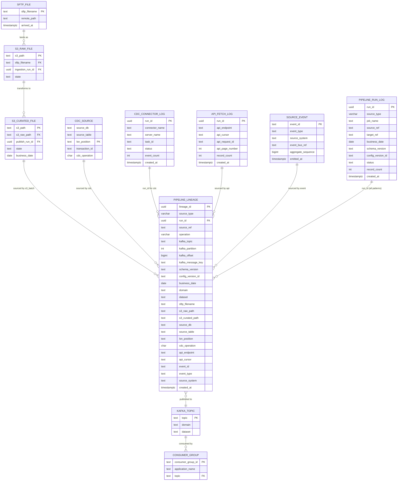
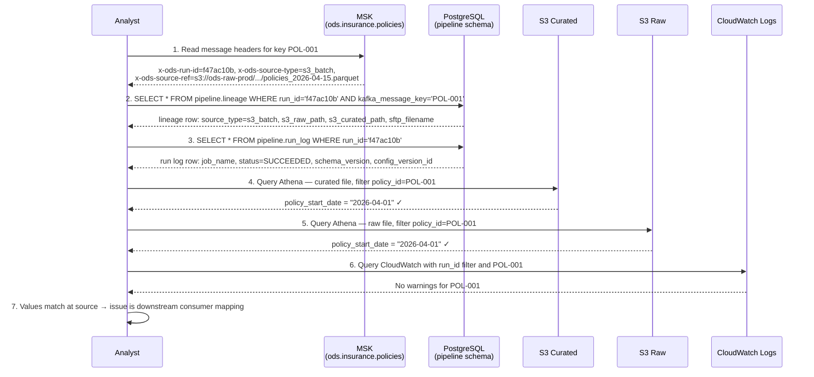
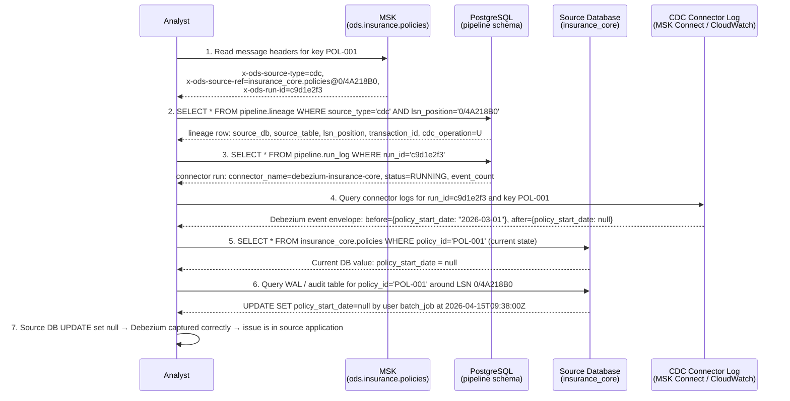
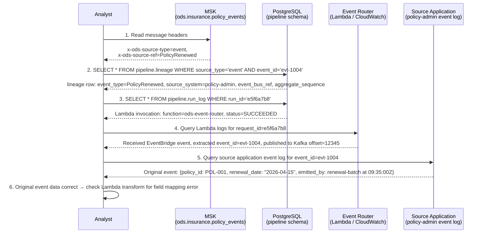

# ODS Platform — Data Lineage Design
**Date:** 2026-04-15  
**Status:** Draft  
**Scope:** All four ingestion patterns — S3 (batch files), CDC, API, Event

---

## 1. What Data Lineage Means for This Platform

Lineage is the ability to answer, with evidence, three classes of question:

### 1.1 Technical Lineage

*Which system touched this data, in which order?*

For the S3 batch pattern: S3 Raw path → Glue ingestion job → S3 Curated path → Glue publish job → Kafka topic → downstream consumer.

For CDC: Source database table → Debezium connector → MSK topic → downstream consumer.

For API: API endpoint → MWAA polling DAG → optional Glue transform → MSK topic → downstream consumer.

For Event: Source application → EventBridge/SNS/SQS → Lambda or MSK Connect → MSK topic → downstream consumer.

Technical lineage does not care about individual records — it operates at the dataset or partition level.

### 1.2 Data Lineage (Record-Level)

*Which record in Kafka came from which row in which source, processed by which job version with which config?*

This is finer-grained than technical lineage. It requires that every Kafka message carry enough metadata to trace it back through the pipeline to its origin. A downstream analyst or support engineer must be able to take a single Kafka message key — for example `POL-001` on topic `ods.insurance.policies` — and reconstruct: the exact source (file path, LSN position, API cursor, or event ID), the processing run that transformed it, the schema version used to encode it, and the config that controlled field mappings at that moment.

The mechanism differs by ingestion pattern but the principle is the same: every Kafka message carries a `x-ods-run-id` header and a `x-ods-source-ref` header sufficient to identify its origin unambiguously.

### 1.3 Impact Lineage

*If schema X changes, which downstream consumers are affected?*

Impact lineage works forward from a proposed change and enumerates all things that will break or need re-testing. It uses the schema registry subject graph, the Glue Data Catalog lineage graph, and the Kafka consumer group registry.

---

### 1.4 Why Lineage Matters

**Debugging** — a consumer receives a record with an unexpected `null` in `policy_start_date`. Without lineage, the investigation starts with "was the field null in the source, or was it dropped by the ETL job, or was it a schema evolution issue?" With lineage, the `run_id` in the Kafka message header leads directly to the exact job log entry, the exact source reference, and the exact schema version — the question is answered in seconds, not hours.

**Compliance** — regulatory frameworks (GDPR, Solvency II, Lloyd's data requirements) require that the provenance of data can be demonstrated: which authorised source system produced it, at what point in time, under which processing rules, and which version of the data model it conforms to. The lineage record is the evidence trail.

**Impact analysis** — before changing the `policies` Avro schema, the platform team must be able to list every consumer that reads `ods.insurance.policies` and every Glue job that reads from the `ods_insurance` Data Catalog. Without lineage tooling, this requires manual mapping. With it, the answer is a single query.

**Audit and reproducibility** — for any historical Kafka message, it must be possible to re-run the exact same processing step with the exact same config against the exact same source data and produce the same output. This requires pinning `config_version_id` and `schema_version` at trigger time — which this platform does for all patterns where config-driven processing applies.

---

## 2. Lineage Model

### 2.1 Polymorphic Lineage Record Structure

The lineage model uses a **polymorphic design**: a single `pipeline.lineage` table with a `source_type` discriminator column and both universal columns (present for all patterns) and pattern-specific nullable columns. This is more queryable than a JSONB blob approach and keeps the schema explicit.

#### 2.1.1 Universal Columns (all patterns)

| Field | Type | Description |
|---|---|---|
| `lineage_id` | UUID | Primary key for this lineage record |
| `source_type` | VARCHAR | Discriminator: `s3_batch` \| `cdc` \| `api` \| `event` |
| `run_id` | UUID | Central correlation key — Glue job UUID, Debezium server+task ID, MWAA task instance ID, or Lambda request ID depending on pattern |
| `source_ref` | TEXT | Human-readable origin reference — S3 path, DB table + LSN, API URL + cursor, or EventType#event_id. See Section 2.2. |
| `operation` | VARCHAR | `insert` \| `update` \| `delete` \| `upsert` — meaningful for CDC; batch = `upsert`; event = `insert` |
| `kafka_topic` | TEXT | Destination MSK topic |
| `kafka_partition` | INTEGER | Partition the message was written to |
| `kafka_offset` | BIGINT | Offset within the partition |
| `kafka_message_key` | TEXT | Business key (e.g. `POL-001`) |
| `schema_version` | TEXT | Glue Schema Registry version ARN pinned at trigger time |
| `config_version_id` | TEXT | Pinned config version — S3 object version ID for YAML configs; connector config hash for CDC/Event |
| `business_date` | DATE | Business date associated with the record |
| `domain` | TEXT | e.g. `insurance` |
| `dataset` | TEXT | e.g. `policies` |
| `created_at` | TIMESTAMPTZ | When this lineage record was written |

#### 2.1.2 S3 Batch-Specific Columns (NULL for other patterns)

| Field | Type | Description |
|---|---|---|
| `sftp_filename` | TEXT | Original filename received from SFTP |
| `s3_raw_path` | TEXT | `s3://ods-raw-{env}/...` |
| `s3_curated_path` | TEXT | `s3://ods-curated-{env}/...` |

#### 2.1.3 CDC-Specific Columns (NULL for other patterns)

| Field | Type | Description |
|---|---|---|
| `source_db` | TEXT | Source database name (e.g. `insurance_core`) |
| `source_table` | TEXT | Source table name (e.g. `policies`) |
| `lsn_position` | TEXT | Log Sequence Number at the point of capture (e.g. `0/4A218B0`) |
| `transaction_id` | TEXT | Source database transaction ID if available |
| `cdc_operation` | CHAR(1) | `I` (insert) \| `U` (update) \| `D` (delete/tombstone) |

#### 2.1.4 API-Specific Columns (NULL for other patterns)

| Field | Type | Description |
|---|---|---|
| `api_endpoint` | TEXT | Full API endpoint URL (e.g. `https://api.internal/v1/policies`) |
| `api_cursor` | TEXT | Pagination cursor or token at the point of fetch |
| `api_request_id` | TEXT | Request ID returned by the API (for deduplication and tracing) |
| `api_page_number` | INTEGER | Page number within the fetch run (for ordered pagination) |

#### 2.1.5 Event-Specific Columns (NULL for other patterns)

| Field | Type | Description |
|---|---|---|
| `event_id` | TEXT | Stable event ID emitted by the source application |
| `event_type` | TEXT | Event type name (e.g. `PolicyRenewed`) |
| `source_system` | TEXT | Originating application name (e.g. `policy-admin`) |
| `event_bus_ref` | TEXT | EventBridge event ARN or SNS message ID |
| `aggregate_sequence` | BIGINT | Optional sequence number per aggregate from the source application |

---

### 2.2 `run_id` and `source_ref` as the Two Correlation Axes

`run_id` is the **pipeline correlation key** — it ties together all the log entries, audit records, and Kafka messages produced in a single processing run. Given a `run_id`, you can retrieve the full processing context.

`source_ref` is the **origin reference** — a human-readable, pattern-specific string that identifies where the data came from:

| Pattern | `source_ref` format | Example |
|---|---|---|
| S3 batch | S3 raw path | `s3://ods-raw-prod/insurance/policies/2026-04-15/policies_2026-04-15.parquet` |
| CDC | `database.table@partition/lsn` | `insurance_core.policies@0/4A218B0` |
| API | `url?cursor=value` | `https://api.internal/v1/policies?cursor=eyJpZCI6MTAwMH0` |
| Event | `EventType#event_id` | `PolicyRenewed#evt-1004` |

Both are propagated as Kafka message headers (`x-ods-run-id` and `x-ods-source-ref`) and stored in `pipeline.lineage`.

---

### 2.3 Entity-Relationship Diagram

The diagram below shows the polymorphic lineage model covering all four ingestion patterns. `PIPELINE_LINEAGE` is the single lineage table; the four source-entity clusters represent origin stores that are pattern-specific.



---

## 3. Lineage Metadata Embedded in Kafka Message Headers

### 3.1 Proposed Headers (all patterns)

Every Kafka message produced by the platform must include the following headers. Values are UTF-8 strings. All keys are prefixed `x-ods-` to namespace them.

```json
{
  "x-ods-run-id":          "f47ac10b-58cc-4372-a567-0e02b2c3d479",
  "x-ods-source-type":     "s3_batch | cdc | api | event",
  "x-ods-source-ref":      "<pattern-specific origin reference — see examples below>",
  "x-ods-business-date":   "2026-04-15",
  "x-ods-schema-version":  "arn:aws:glue:eu-west-1:123456789012:schema/ods-schema-registry-prod/policies/1-0-0/abc123def456",
  "x-ods-pipeline-type":   "publish | cdc | api | event"
}
```

`x-ods-source-ref` replaces the old `x-ods-source-path` (which was S3-only). `x-ods-source-type` is new and enables consumers to branch their lineage lookup logic without parsing the `source-ref` string.

`config_version_id` is recorded in the `pipeline.lineage` table rather than carried as a header — this keeps the header set lean for consumers that do not need it.

### 3.2 Header Examples by Pattern

**S3 batch:**
```json
{
  "x-ods-run-id":         "f47ac10b-58cc-4372-a567-0e02b2c3d479",
  "x-ods-source-type":    "s3_batch",
  "x-ods-source-ref":     "s3://ods-raw-prod/insurance/policies/2026-04-15/policies_2026-04-15.parquet",
  "x-ods-business-date":  "2026-04-15",
  "x-ods-schema-version": "arn:aws:glue:eu-west-1:123456789012:schema/ods-schema-registry-prod/policies/1-0-0/abc123",
  "x-ods-pipeline-type":  "publish"
}
```

**CDC:**
```json
{
  "x-ods-run-id":         "c9d1e2f3-1234-5678-90ab-cdef01234567",
  "x-ods-source-type":    "cdc",
  "x-ods-source-ref":     "insurance_core.policies@0/4A218B0",
  "x-ods-business-date":  "2026-04-15",
  "x-ods-schema-version": "arn:aws:glue:eu-west-1:123456789012:schema/ods-schema-registry-prod/policies/1-0-0/abc123",
  "x-ods-pipeline-type":  "cdc"
}
```

**API:**
```json
{
  "x-ods-run-id":         "a1b2c3d4-abcd-ef01-2345-6789abcdef01",
  "x-ods-source-type":    "api",
  "x-ods-source-ref":     "https://api.internal/v1/policies?cursor=eyJpZCI6MTAwMH0",
  "x-ods-business-date":  "2026-04-15",
  "x-ods-schema-version": "arn:aws:glue:eu-west-1:123456789012:schema/ods-schema-registry-prod/policies/1-0-0/abc123",
  "x-ods-pipeline-type":  "api"
}
```

**Event:**
```json
{
  "x-ods-run-id":         "e5f6a7b8-9012-3456-789a-bcdef0123456",
  "x-ods-source-type":    "event",
  "x-ods-source-ref":     "PolicyRenewed#evt-1004",
  "x-ods-business-date":  "2026-04-15",
  "x-ods-schema-version": "arn:aws:glue:eu-west-1:123456789012:schema/ods-schema-registry-prod/policies/1-0-0/abc123",
  "x-ods-pipeline-type":  "event"
}
```

### 3.3 Why Headers, Not Payload

**Schema compatibility** — the Kafka message payload is governed by the Avro schema registered in the Glue Schema Registry. Adding lineage fields to the payload would require a schema change for every dataset, every time the lineage metadata model evolves. Headers are outside the schema envelope and require no schema change.

**Consumer transparency** — consumers that do not need lineage metadata can ignore headers entirely without any code change.

**Binary payload integrity** — some downstream consumers may re-serialise the payload as-is to another store. If lineage fields were embedded, they would be included in that re-serialisation, potentially polluting the downstream schema.

**Separation of concerns** — the payload is a business record; the headers are infrastructure metadata. Mixing them conflates two different lifecycles and two different governance domains.

### 3.4 Implementation Notes by Pattern

**S3 batch (Glue publish job, Python):**
```python
producer.produce(
    topic=target_topic,
    key=record_key,
    value=avro_bytes,
    headers=[
        ("x-ods-run-id",         run_id),
        ("x-ods-source-type",    "s3_batch"),
        ("x-ods-source-ref",     s3_raw_path),
        ("x-ods-business-date",  business_date),
        ("x-ods-schema-version", schema_version),
        ("x-ods-pipeline-type",  "publish"),
    ]
)
```

**CDC (Debezium SMT — Single Message Transform):**
Debezium applies a custom SMT that adds headers to every change event message. The SMT reads the `source.db`, `source.table`, and `source.lsn` fields from the Debezium envelope and constructs `x-ods-source-ref` as `"{db}.{table}@{partition}/{lsn}"`. The `x-ods-run-id` is set to the connector task's UUID, generated at connector startup.

**API (Glue or Lambda transform):**
The MWAA DAG generates a `run_id` UUID at DAG run start. This is passed as an environment variable or job argument to the transform step, which attaches it to every Kafka message produced from that fetch run.

**Event (Lambda router):**
The Lambda function receives the EventBridge or SNS event and extracts `event_id` and `event_type` from the event payload. It constructs `x-ods-source-ref` as `"{event_type}#{event_id}"` and sets `x-ods-run-id` to the Lambda request ID (available as `context.aws_request_id`).

---

## 4. Tracing an S3 Batch Record End-to-End

### 4.1 Problem Statement

A downstream consumer reports that the Kafka message with key `POL-001` on topic `ods.insurance.policies`, consumed at approximately `2026-04-15T09:42:00Z`, has an unexpected value in `policy_start_date`. You need to determine whether the value was wrong in the source file, was corrupted by the ETL job, or was caused by a schema version mismatch.

### 4.2 Sequence Diagram



### 4.3 Step-by-Step SQL and Log Lookups

**Step 1 — Read the Kafka message headers.**

Using `kafka-console-consumer` or Confluent tooling, read the raw headers for the suspect message. Check `x-ods-source-type` first — confirms this is an S3 batch record. Note `x-ods-run-id` and `x-ods-source-ref`.

**Step 2 — Look up the lineage record.**

```sql
SELECT
    lineage_id,
    source_type,
    run_id,
    source_ref,
    operation,
    sftp_filename,
    s3_raw_path,
    s3_curated_path,
    kafka_topic,
    kafka_partition,
    kafka_offset,
    schema_version,
    config_version_id,
    business_date,
    created_at
FROM pipeline.lineage
WHERE run_id           = 'f47ac10b-58cc-4372-a567-0e02b2c3d479'
  AND kafka_message_key = 'POL-001'
  AND source_type       = 's3_batch';
```

This single row gives you the complete lineage chain: SFTP file → S3 Raw → S3 Curated → Kafka offset.

**Step 3 — Look up the processing run.**

```sql
SELECT
    run_id,
    job_name,
    source_ref,
    target_ref,
    business_date,
    schema_version,
    config_version_id,
    status,
    record_count,
    created_at
FROM pipeline.run_log
WHERE run_id = 'f47ac10b-58cc-4372-a567-0e02b2c3d479';
```

**Step 4 — Inspect the record in the curated file.**

```sql
SELECT
    policy_id,
    policy_start_date,
    "$path" AS source_file
FROM ods_insurance.policies
WHERE "$path" = 's3://ods-curated-prod/insurance/policies/2026-04-15/policies_2026-04-15.parquet'
  AND policy_id = 'POL-001';
```

**Step 5 — Inspect the record in the raw file.**

```sql
SELECT
    policy_id,
    policy_start_date,
    "$path" AS source_file
FROM ods_insurance.policies_raw
WHERE "$path" = 's3://ods-raw-prod/insurance/policies/2026-04-15/policies_2026-04-15.parquet'
  AND policy_id = 'POL-001';
```

If `policy_start_date` is the same in both raw and curated, the ETL job did not alter the value. If they differ, inspect the `config_version_id` to retrieve the field mapping config (see Section 7).

**Step 6 — Query CloudWatch Logs.**

```
fields @timestamp, @message
| filter run_id = "f47ac10b-58cc-4372-a567-0e02b2c3d479"
| filter @message like /POL-001/
| sort @timestamp asc
| limit 50
```

---

## 4b. Tracing a CDC Record

### 4b.1 Problem Statement

A downstream consumer reports that the Kafka message with key `POL-001` on topic `ods.insurance.policies` has an unexpected `null` in `policy_start_date`. The Kafka header shows `x-ods-source-type: cdc`. This record did not come from an S3 file — it came directly from a database change event. The trace path is different.

### 4b.2 Sequence Diagram



### 4b.3 Step-by-Step Lookups

**Step 1 — Read the Kafka message headers.**

Confirm `x-ods-source-type: cdc`. Extract `x-ods-source-ref` (format: `database.table@partition/lsn`) and `x-ods-run-id`.

**Step 2 — Look up the CDC lineage record.**

```sql
SELECT
    lineage_id,
    run_id,
    source_type,
    source_ref,
    cdc_operation,
    source_db,
    source_table,
    lsn_position,
    transaction_id,
    kafka_topic,
    kafka_partition,
    kafka_offset,
    kafka_message_key,
    schema_version,
    business_date,
    created_at
FROM pipeline.lineage
WHERE source_type  = 'cdc'
  AND lsn_position = '0/4A218B0'
  AND kafka_message_key = 'POL-001';
```

`cdc_operation` tells you whether this was an INSERT, UPDATE, or DELETE. For a tombstone (hard delete in Kafka compaction), `cdc_operation = 'D'` and the Kafka message value will be null.

**Step 3 — Look up the CDC connector run.**

```sql
SELECT
    run_id,
    job_name,
    source_ref,
    status,
    record_count,
    created_at
FROM pipeline.run_log
WHERE run_id      = 'c9d1e2f3-1234-5678-90ab-cdef01234567'
  AND source_type = 'cdc';
```

**Step 4 — Inspect the Debezium event envelope in the connector log.**

Each Debezium change event carries a `before` and `after` image. Query CloudWatch Logs for the MSK Connect task:

```
fields @timestamp, @message
| filter connector = "debezium-insurance-core"
| filter @message like /POL-001/
| filter @message like /4A218B0/
| sort @timestamp asc
| limit 20
```

The `before` image shows the value before the change; the `after` image shows the value that was written to Kafka. If `after.policy_start_date` is null, Debezium faithfully captured a null — the source database change set the field to null.

**Step 5 — Verify in the source database.**

Check the current state:
```sql
SELECT policy_id, policy_start_date, updated_at, updated_by
FROM insurance_core.policies
WHERE policy_id = 'POL-001';
```

If the database has a WAL-based audit table or a CDC history table, query it for the specific LSN or transaction:
```sql
SELECT *
FROM insurance_core.policies_audit
WHERE policy_id   = 'POL-001'
  AND lsn        >= '0/4A218B0'
ORDER BY lsn ASC
LIMIT 5;
```

This confirms whether the null was set by a legitimate source application update or by an erroneous batch job.

---

## 4c. Tracing an Event Record

### 4c.1 Problem Statement

A downstream consumer receives a `PolicyRenewed` event on topic `ods.insurance.policy_events` with an unexpected value. The Kafka header shows `x-ods-source-type: event`. The trace path leads back to the originating application's event log.

### 4c.2 Sequence Diagram



### 4c.3 Step-by-Step Lookups

**Step 1 — Read the Kafka message headers.**

Confirm `x-ods-source-type: event`. Extract `x-ods-source-ref` (format: `EventType#event_id`) and `x-ods-run-id`.

**Step 2 — Look up the event lineage record.**

```sql
SELECT
    lineage_id,
    run_id,
    source_type,
    event_id,
    event_type,
    source_system,
    event_bus_ref,
    aggregate_sequence,
    kafka_topic,
    kafka_partition,
    kafka_offset,
    kafka_message_key,
    schema_version,
    business_date,
    created_at
FROM pipeline.lineage
WHERE source_type = 'event'
  AND event_id    = 'evt-1004';
```

**Step 3 — Look up the Lambda router run.**

```sql
SELECT
    run_id,
    job_name,
    source_ref,
    target_ref,
    status,
    record_count,
    created_at
FROM pipeline.run_log
WHERE run_id      = 'e5f6a7b8-9012-3456-789a-bcdef0123456'
  AND source_type = 'event';
```

**Step 4 — Query Lambda CloudWatch logs.**

```
fields @timestamp, @message
| filter requestId = "e5f6a7b8-9012-3456-789a-bcdef0123456"
| sort @timestamp asc
| limit 50
```

This surfaces the full Lambda invocation log: the raw EventBridge event received, any transform steps, and the Kafka produce call.

**Step 5 — Query the source application's event log.**

Each source application that emits events must publish a stable `event_id`. Query the source application's outbox table or event log:

```sql
-- Example: policy-admin application event outbox
SELECT
    event_id,
    event_type,
    aggregate_id,
    payload,
    emitted_at,
    emitted_by
FROM policy_admin.event_outbox
WHERE event_id = 'evt-1004';
```

If `event_id` is not present in the source application's log, the event may have been fabricated or the source application does not implement idempotent event IDs — this is a source application defect that must be raised with the owning team.

---

## 5. AWS Glue Native Lineage

> **Scope note:** This section applies to the S3 batch ingestion pattern only. CDC, Event, and (in most cases) API patterns do not use Glue jobs and therefore do not produce Glue Data Catalog lineage entries.

### 5.1 What Glue Data Catalog Lineage Tracks

AWS Glue Data Catalog includes a lineage feature (enabled via the Glue console or API) that automatically records, for each Glue job run:

- **Job name** — the Glue ETL job identifier
- **Input datasets** — the Glue Data Catalog table(s) or S3 paths read by the job
- **Output datasets** — the Glue Data Catalog table(s) or S3 paths written by the job
- **Run timestamp and duration**
- **Connection to the job run ID** in the Glue job run history

This creates a directed acyclic graph (DAG) in the Data Catalog: `s3://ods-raw-prod/.../policies_2026-04-15.parquet` → `ods-ingestion-policies (Glue job)` → `ods_insurance.policies (curated table)` → `ods-s3-publish-policies (Glue job)` → MSK topic (represented as a custom node).

### 5.2 How to Enable It

Glue Data Catalog lineage is configured per Glue job. In the Glue job definition, set:

```json
{
  "GlueVersion": "4.0",
  "DefaultArguments": {
    "--enable-glue-datacatalog": "true",
    "--datalake-formats": "hudi"
  }
}
```

Lineage tracking is also enabled via the Glue Studio visual editor under "Job details → Security configuration → Data lineage". Once enabled, the Data Catalog lineage API exposes the lineage graph programmatically.

### 5.3 Limitations of Glue Native Lineage

| Limitation | Impact |
|---|---|
| Dataset-level only — no row-level lineage | Cannot trace a single Kafka message back to a source row |
| No config version tracking | Does not record which YAML config was active during a run |
| No schema version recording | Does not record which Glue Schema Registry version was used |
| MSK topics are not first-class Data Catalog objects | Kafka topic lineage requires custom integration or manual annotation |
| Lineage is stored in the Data Catalog, not in a queryable relational store | Joining lineage data with `run_log` requires custom ETL |
| Lineage graph is eventually consistent — may lag up to a few minutes | Not suitable for real-time incident response |
| Applies to S3 batch only | CDC, API, and Event patterns have no Glue job lineage graph |

### 5.4 How It Complements `pipeline.run_log`

Glue native lineage provides the **graph view** — a visual representation of how datasets connect across jobs, useful for impact analysis and data discovery. The platform's `pipeline.run_log` provides the **audit trail** — every job execution with all identifiers, record counts, status transitions, and the pinned config and schema versions that Glue native lineage does not capture.

The two are complementary: use Glue lineage for discovery ("what jobs touch the `ods_insurance.policies` table?") and `run_log` for forensics ("for run `f47ac10b`, what was the exact config version and how many records were processed?").

---

## 6. Impact Analysis

### 6.1 Problem Statement

The insurance data team proposes adding a new field `policy_renewal_date` to the `policies` Avro schema. The existing `policy_start_date` field type is also proposed to change from `string` to `date (logical type)`. Before approving this change, you need to identify all downstream consumers that will be affected.

### 6.2 Step-by-Step Process

**Step 1 — Identify the schema subject in the Glue Schema Registry.**

Each dataset has a schema subject in the `ods-schema-registry-{env}` registry. For the policies dataset:

```
Registry:  ods-schema-registry-prod
Subject:   ods.insurance.policies
```

Using the AWS CLI:

```bash
aws glue get-schema \
  --schema-id '{"RegistryName": "ods-schema-registry-prod", "SchemaName": "ods.insurance.policies"}' \
  --region eu-west-1
```

This returns the current schema version ARN, compatibility mode (`BACKWARD`, `FORWARD`, or `FULL`), and the schema definition. Changing `policy_start_date` from `string` to `date` is a **breaking change** under `BACKWARD` compatibility — all existing consumers must be updated before the new schema version can be used.

**Step 2 — List all jobs that have published using this schema.**

The polymorphic `pipeline.lineage` table covers all patterns, so this query catches S3 batch, CDC, API, and Event runs alike:

```sql
SELECT DISTINCT
    source_type,
    run_id,
    schema_version,
    MAX(created_at) AS last_seen
FROM pipeline.lineage
WHERE kafka_topic = 'ods.insurance.policies'
GROUP BY source_type, run_id, schema_version
ORDER BY last_seen DESC;
```

**Step 3 — List all MSK consumer groups subscribed to the topic.**

```bash
kafka-consumer-groups.sh \
  --bootstrap-server <msk-bootstrap>:9098 \
  --command-config /etc/kafka/client.properties \
  --describe \
  --group <consumer-group-id>
```

Collect all consumer groups that show `ods.insurance.policies` in the TOPIC column. These are the affected consumers.

**Step 4 — Identify downstream Glue jobs via Data Catalog lineage (S3 batch only).**

In the Glue Data Catalog lineage graph, traverse forward from the `ods_insurance.policies` table node to find all Glue jobs that use it as an input.

**Step 5 — Check for Athena saved queries and views.**

```sql
SELECT query_name, query_string
FROM information_schema.saved_queries
WHERE query_string ILIKE '%ods_insurance%policies%policy_start_date%';
```

**Step 6 — Compile the impact register.**

| Artefact Type | Name | Impact | Action Required |
|---|---|---|---|
| Kafka consumer | `claims-processing-service` | `policy_start_date` type change | Update deserialiser |
| Kafka consumer | `reporting-aggregator` | `policy_start_date` type change | Update mapping |
| Glue job | `ods-claims-enrichment` | Reads `ods_insurance.policies` | Test with new schema |
| Athena view | `v_active_policies` | Filters on `policy_start_date` as string | Rewrite predicate |

Only after all items in the register have confirmed they can handle the new schema, or have been updated, should the schema change be deployed.

---

## 7. Config Version Lineage

> **Scope note:** Config version pinning via S3 object versioning applies to the S3 batch and API patterns, which use versioned YAML configs stored in S3. For the CDC pattern, the connector config JSON is versioned separately (described in Section 10). For the Event pattern, Lambda function versions serve as the config version anchor.

### 7.1 How Config Versions Are Pinned

Every S3 batch and API pipeline run is triggered by an Airflow DAG. At trigger time, the DAG resolves the S3 URI of the YAML config file for the dataset (e.g. `s3://ods-config-prod/insurance/policies/config.yaml`) and reads the current S3 object version ID using the S3 HeadObject API. This version ID — a string like `ABC123XYZe79f84ce` — is passed to the Glue job as a job parameter and recorded in `pipeline.run_log.config_version_id`.

Because S3 versioning is enabled on the config bucket, every edit to `config.yaml` produces a new version ID. The old version is never deleted. This means:

- For any historical `run_id`, the exact bytes of the config that were used are permanently retrievable.
- Replaying a historical job can use `--config-version-id <pinned-id>` to guarantee identical config.
- Config changes are auditable: you can diff two `config_version_id` values by retrieving both and comparing.

### 7.2 Retrieving a Pinned Config Version

Given a `config_version_id` from `run_log`, retrieve the exact config bytes:

```bash
aws s3api get-object \
  --bucket ods-config-prod \
  --key insurance/policies/config.yaml \
  --version-id ABC123XYZe79f84ce \
  /tmp/policies_config_at_run.yaml
```

Or in Python within a Glue job or investigation script:

```python
import boto3

s3 = boto3.client("s3")
response = s3.get_object(
    Bucket="ods-config-prod",
    Key="insurance/policies/config.yaml",
    VersionId="ABC123XYZe79f84ce"
)
config_bytes = response["Body"].read()
config = yaml.safe_load(config_bytes)
```

### 7.3 Diffing Config Versions

To understand what changed between two runs:

```bash
aws s3api get-object \
  --bucket ods-config-prod \
  --key insurance/policies/config.yaml \
  --version-id ABC123XYZe79f84ce \
  /tmp/config_v1.yaml

aws s3api get-object \
  --bucket ods-config-prod \
  --key insurance/policies/config.yaml \
  --version-id XYZ789ABCf12a99b \
  /tmp/config_v2.yaml

diff /tmp/config_v1.yaml /tmp/config_v2.yaml
```

This diff is the exact set of config changes between the two pipeline runs — for example, if a field mapping was added or a business date pattern was changed.

---

## 8. Polymorphic `pipeline.lineage` Table

### 8.1 Purpose

The `pipeline.lineage` table materialises the full lineage record for every Kafka message produced by the platform, across all four ingestion patterns, in a single queryable, denormalised form. It is INSERT-only.

For S3 batch, it is written by the publish Glue job immediately after each successful Kafka `flush()`. For CDC, it is written by the Debezium connector's lineage sink connector (or a Lambda triggered by the Debezium Kafka topic). For API, it is written by the transform Glue job or Lambda after producing to Kafka. For Event, it is written by the Lambda router.

In all cases: **a row is written only after the Kafka produce has been confirmed by the broker**. Failed or partial runs do not produce lineage rows.

### 8.2 DDL

```sql
CREATE TABLE pipeline.lineage (
    lineage_id          UUID            DEFAULT gen_random_uuid() PRIMARY KEY,

    -- Discriminator
    source_type         VARCHAR(16)     NOT NULL
                        CHECK (source_type IN ('s3_batch', 'cdc', 'api', 'event')),

    -- Universal correlation key
    run_id              UUID            NOT NULL,

    -- Pattern-agnostic source reference
    source_ref          TEXT            NOT NULL,   -- S3 path | db.table@lsn | url?cursor | EventType#id
    operation           VARCHAR(8)      NOT NULL DEFAULT 'upsert'
                        CHECK (operation IN ('insert', 'update', 'delete', 'upsert')),

    -- Kafka destination (all patterns)
    kafka_topic         TEXT            NOT NULL,
    kafka_partition     INTEGER         NOT NULL,
    kafka_offset        BIGINT          NOT NULL,
    kafka_message_key   TEXT            NOT NULL,

    -- Versioning (all patterns)
    schema_version      TEXT            NOT NULL,
    config_version_id   TEXT,                       -- null for event pattern (use lambda_version instead)

    -- Business metadata (all patterns)
    business_date       DATE            NOT NULL,
    domain              TEXT            NOT NULL,
    dataset             TEXT            NOT NULL,

    -- ── S3 batch columns ──────────────────────────────────────────────────
    sftp_filename       TEXT,                       -- null for cdc / api / event
    s3_raw_path         TEXT,                       -- null for cdc / api / event
    s3_curated_path     TEXT,                       -- null for cdc / api / event

    -- ── CDC columns ───────────────────────────────────────────────────────
    source_db           TEXT,                       -- null for s3_batch / api / event
    source_table        TEXT,                       -- null for s3_batch / api / event
    lsn_position        TEXT,                       -- null for s3_batch / api / event
    transaction_id      TEXT,                       -- null for s3_batch / api / event
    cdc_operation       CHAR(1)                     -- I/U/D; null for other patterns
                        CHECK (cdc_operation IN ('I', 'U', 'D') OR cdc_operation IS NULL),

    -- ── API columns ───────────────────────────────────────────────────────
    api_endpoint        TEXT,                       -- null for s3_batch / cdc / event
    api_cursor          TEXT,                       -- null for s3_batch / cdc / event
    api_request_id      TEXT,                       -- null for s3_batch / cdc / event
    api_page_number     INTEGER,                    -- null for s3_batch / cdc / event

    -- ── Event columns ─────────────────────────────────────────────────────
    event_id            TEXT,                       -- null for s3_batch / cdc / api
    event_type          TEXT,                       -- null for s3_batch / cdc / api
    source_system       TEXT,                       -- null for s3_batch / cdc / api
    event_bus_ref       TEXT,                       -- null for s3_batch / cdc / api
    aggregate_sequence  BIGINT,                     -- null for s3_batch / cdc / api

    -- Audit
    created_at          TIMESTAMPTZ     NOT NULL DEFAULT now()
);

-- Indexes for all-pattern queries
CREATE INDEX idx_lineage_run_id            ON pipeline.lineage (run_id);
CREATE INDEX idx_lineage_source_type       ON pipeline.lineage (source_type);
CREATE INDEX idx_lineage_kafka_topic_key   ON pipeline.lineage (kafka_topic, kafka_message_key);
CREATE INDEX idx_lineage_business_date     ON pipeline.lineage (business_date);
CREATE INDEX idx_lineage_schema_version    ON pipeline.lineage (schema_version);
CREATE INDEX idx_lineage_config_version    ON pipeline.lineage (config_version_id);

-- Pattern-specific indexes
CREATE INDEX idx_lineage_sftp_filename     ON pipeline.lineage (sftp_filename)
    WHERE source_type = 's3_batch';
CREATE INDEX idx_lineage_s3_raw_path       ON pipeline.lineage (s3_raw_path)
    WHERE source_type = 's3_batch';
CREATE INDEX idx_lineage_lsn_position      ON pipeline.lineage (source_db, source_table, lsn_position)
    WHERE source_type = 'cdc';
CREATE INDEX idx_lineage_event_id          ON pipeline.lineage (event_id)
    WHERE source_type = 'event';
CREATE INDEX idx_lineage_api_cursor        ON pipeline.lineage (api_endpoint, api_cursor)
    WHERE source_type = 'api';
```

### 8.3 Example Rows

#### S3 Batch row

| Column | Value |
|---|---|
| `lineage_id` | `a1b2c3d4-0001-0001-0001-000000000001` |
| `source_type` | `s3_batch` |
| `run_id` | `f47ac10b-58cc-4372-a567-0e02b2c3d479` |
| `source_ref` | `s3://ods-raw-prod/insurance/policies/2026-04-15/policies_2026-04-15.parquet` |
| `operation` | `upsert` |
| `kafka_topic` | `ods.insurance.policies` |
| `kafka_partition` | `2` |
| `kafka_offset` | `400512` |
| `kafka_message_key` | `POL-001` |
| `schema_version` | `arn:aws:glue:eu-west-1:123456789012:schema/.../abc123` |
| `config_version_id` | `ABC123XYZe79f84ce` |
| `business_date` | `2026-04-15` |
| `domain` | `insurance` |
| `dataset` | `policies` |
| `sftp_filename` | `policies_20260415.parquet` |
| `s3_raw_path` | `s3://ods-raw-prod/insurance/policies/2026-04-15/policies_2026-04-15.parquet` |
| `s3_curated_path` | `s3://ods-curated-prod/insurance/policies/2026-04-15/policies_2026-04-15.parquet` |
| all CDC/API/Event columns | `NULL` |

#### CDC row

| Column | Value |
|---|---|
| `lineage_id` | `b2c3d4e5-0002-0002-0002-000000000002` |
| `source_type` | `cdc` |
| `run_id` | `c9d1e2f3-1234-5678-90ab-cdef01234567` |
| `source_ref` | `insurance_core.policies@0/4A218B0` |
| `operation` | `update` |
| `kafka_topic` | `ods.insurance.policies` |
| `kafka_partition` | `1` |
| `kafka_offset` | `52301` |
| `kafka_message_key` | `POL-001` |
| `schema_version` | `arn:aws:glue:eu-west-1:123456789012:schema/.../abc123` |
| `config_version_id` | `debezium-connector-config-v3-sha256abc` |
| `business_date` | `2026-04-15` |
| `domain` | `insurance` |
| `dataset` | `policies` |
| `source_db` | `insurance_core` |
| `source_table` | `policies` |
| `lsn_position` | `0/4A218B0` |
| `transaction_id` | `7f3a1b9c` |
| `cdc_operation` | `U` |
| all S3/API/Event columns | `NULL` |

#### API row

| Column | Value |
|---|---|
| `lineage_id` | `c3d4e5f6-0003-0003-0003-000000000003` |
| `source_type` | `api` |
| `run_id` | `a1b2c3d4-abcd-ef01-2345-6789abcdef01` |
| `source_ref` | `https://api.internal/v1/policies?cursor=eyJpZCI6MTAwMH0` |
| `operation` | `upsert` |
| `kafka_topic` | `ods.insurance.policies` |
| `kafka_partition` | `0` |
| `kafka_offset` | `88100` |
| `kafka_message_key` | `POL-500` |
| `schema_version` | `arn:aws:glue:eu-west-1:123456789012:schema/.../abc123` |
| `config_version_id` | `XYZ789ABCf12a99b` |
| `business_date` | `2026-04-15` |
| `domain` | `insurance` |
| `dataset` | `policies` |
| `api_endpoint` | `https://api.internal/v1/policies` |
| `api_cursor` | `eyJpZCI6MTAwMH0` |
| `api_request_id` | `req-d4e5f6a7b8c9` |
| `api_page_number` | `3` |
| all S3/CDC/Event columns | `NULL` |

#### Event row

| Column | Value |
|---|---|
| `lineage_id` | `d4e5f6a7-0004-0004-0004-000000000004` |
| `source_type` | `event` |
| `run_id` | `e5f6a7b8-9012-3456-789a-bcdef0123456` |
| `source_ref` | `PolicyRenewed#evt-1004` |
| `operation` | `insert` |
| `kafka_topic` | `ods.insurance.policy_events` |
| `kafka_partition` | `0` |
| `kafka_offset` | `12345` |
| `kafka_message_key` | `POL-001` |
| `schema_version` | `arn:aws:glue:eu-west-1:123456789012:schema/.../def456` |
| `config_version_id` | `ods-event-router:lambda:15` |
| `business_date` | `2026-04-15` |
| `domain` | `insurance` |
| `dataset` | `policy_events` |
| `event_id` | `evt-1004` |
| `event_type` | `PolicyRenewed` |
| `source_system` | `policy-admin` |
| `event_bus_ref` | `arn:aws:events:eu-west-1:123456789012:event-bus/ods-prod/events/evt-1004` |
| `aggregate_sequence` | `42` |
| all S3/CDC/API columns | `NULL` |

### 8.4 Useful Queries

**Full lineage for a specific Kafka message key (any pattern):**

```sql
SELECT
    l.source_type,
    l.source_ref,
    l.operation,
    l.kafka_topic,
    l.kafka_partition,
    l.kafka_offset,
    l.kafka_message_key,
    l.business_date,
    l.schema_version,
    l.config_version_id,
    l.created_at,
    -- S3 batch fields
    l.sftp_filename,
    l.s3_raw_path,
    -- CDC fields
    l.lsn_position,
    l.cdc_operation,
    -- Event fields
    l.event_id,
    l.event_type
FROM pipeline.lineage l
WHERE l.kafka_topic        = 'ods.insurance.policies'
  AND l.kafka_message_key  = 'POL-001'
ORDER BY l.created_at DESC
LIMIT 10;
```

**All messages from a specific S3 source file:**

```sql
SELECT
    kafka_topic, kafka_partition, kafka_offset, kafka_message_key, business_date
FROM pipeline.lineage
WHERE source_type     = 's3_batch'
  AND sftp_filename   = 'policies_20260415.parquet'
ORDER BY kafka_partition, kafka_offset;
```

**All CDC changes for a source table in a time window:**

```sql
SELECT
    lsn_position,
    transaction_id,
    cdc_operation,
    kafka_message_key,
    kafka_offset,
    created_at
FROM pipeline.lineage
WHERE source_type    = 'cdc'
  AND source_db      = 'insurance_core'
  AND source_table   = 'policies'
  AND created_at     BETWEEN '2026-04-15T09:00:00Z' AND '2026-04-15T10:00:00Z'
ORDER BY lsn_position;
```

**All events from a source system for a business date:**

```sql
SELECT
    event_id,
    event_type,
    kafka_message_key,
    aggregate_sequence,
    kafka_offset,
    created_at
FROM pipeline.lineage
WHERE source_type    = 'event'
  AND source_system  = 'policy-admin'
  AND business_date  = '2026-04-15'
ORDER BY aggregate_sequence NULLS LAST, created_at;
```

**All messages produced on a given business date, by pattern and topic:**

```sql
SELECT
    source_type,
    kafka_topic,
    COUNT(*)          AS message_count,
    MIN(created_at)   AS first_produced,
    MAX(created_at)   AS last_produced
FROM pipeline.lineage
WHERE business_date = '2026-04-15'
GROUP BY source_type, kafka_topic
ORDER BY source_type, kafka_topic;
```

**Find all lineage rows using a config version that has since been superseded:**

```sql
SELECT DISTINCT
    source_type,
    run_id,
    kafka_topic,
    config_version_id,
    business_date
FROM pipeline.lineage
WHERE config_version_id != (
    SELECT config_version_id
    FROM pipeline.run_log
    WHERE kafka_topic = 'ods.insurance.policies'
      AND status      = 'SUCCEEDED'
    ORDER BY created_at DESC
    LIMIT 1
)
AND kafka_topic = 'ods.insurance.policies'
ORDER BY business_date DESC;
```

**All runs for a topic in the last 7 days:**

```sql
SELECT
    source_type,
    run_id,
    business_date,
    COUNT(*) AS messages
FROM pipeline.lineage
WHERE kafka_topic   = 'ods.insurance.policies'
  AND created_at   >= now() - interval '7 days'
GROUP BY source_type, run_id, business_date
ORDER BY business_date DESC;
```

### 8.5 Write Path

The write path differs by pattern:

| Pattern | Writer | Trigger |
|---|---|---|
| S3 batch | Glue publish job | After Kafka `flush()` confirms all messages committed |
| CDC | Lineage sink Lambda or dedicated MSK Connect sink connector | Triggered by each change event committed to MSK |
| API | Glue transform job or Lambda | After Kafka `flush()` in the transform step |
| Event | Lambda event router | After Kafka `produce()` callback confirms delivery |

All writers use a bulk INSERT for efficiency. `run_id` and pattern-specific metadata are resolved at job/function initialisation and applied to all rows in the batch — they are not computed per-row. NULL columns for non-applicable patterns are never populated; the `CHECK` constraint on `source_type` enforces the discriminator.

---

## 9. OpenLineage Consideration

### 9.1 What OpenLineage Is

OpenLineage is an open standard (hosted by the Linux Foundation under the LF AI & Data umbrella) that defines a common data model for lineage metadata. It specifies a JSON event schema that any pipeline tool can emit and any lineage backend can ingest. The core abstraction is a **Run** (a job execution) that has **input facets** (datasets read) and **output facets** (datasets written), plus a set of standard and custom facets for schema, column-level lineage, data quality, and more.

Compatible backends include **Marquez** (the reference implementation), **Apache Atlas**, and **DataHub** (LinkedIn's open-source data catalogue). AWS Glue does not natively emit OpenLineage events, but there is a community-maintained integration that instruments Glue PySpark jobs to emit events to a Marquez API endpoint.

### 9.2 Relationship to This Platform

The platform's `pipeline.lineage` table covers all four patterns with row-level granularity. OpenLineage operates at the run/dataset level — it would complement the platform's lineage store for discovery and cross-system graph views but cannot replace row-level lineage. The Airflow `openlineage-airflow` provider (native to Airflow 2.7+) would automatically emit run-level events for MWAA DAGs.

For CDC and Event patterns, OpenLineage coverage would require custom facets since those patterns have no Glue job and no standard integration.

### 9.3 Pros and Cons

**Pros:**
- Open standard — not locked into AWS proprietary APIs
- Airflow has a native OpenLineage integration for MWAA DAG lineage
- Marquez and DataHub have web UIs for lineage graph browsing
- Column-level lineage facets allow field-by-field tracing
- Future-proofs the platform if it expands beyond AWS

**Cons:**
- Requires deploying and operating a lineage backend (Marquez or DataHub)
- Not native to AWS — no managed AWS service for OpenLineage
- The Glue → OpenLineage integration is community-maintained
- CDC and Event patterns have no standard OpenLineage integration
- For a platform entirely within AWS, the `pipeline.lineage` table and Glue Data Catalog lineage may be sufficient

### 9.4 Recommendation

**Do not adopt OpenLineage in the current phase.** The platform's `pipeline.run_log`, `pipeline.lineage`, and Glue Data Catalog native lineage provide sufficient lineage coverage for the four ingestion patterns, without additional infrastructure to deploy or maintain.

Revisit if either condition arises:
1. The platform expands to tools outside AWS (e.g. a Databricks or dbt layer is introduced) where cross-platform lineage stitching becomes valuable.
2. A data governance platform (DataHub, Alation, Collibra) is adopted organisation-wide and connecting ODS lineage to it becomes a requirement.

---

## 10. Lineage Coverage Across All Four Ingestion Patterns

The table below summarises the lineage design for all four patterns. All patterns are fully specified.

| | **S3 Batch (Parquet)** | **CDC** | **API** | **Event** |
|---|---|---|---|---|
| **Orchestration** | MWAA DAG → Glue ingestion → Glue publish | MSK Connect (Debezium) | MWAA DAG → optional Glue transform | EventBridge rule → Lambda router |
| **`run_id` generation** | Glue job UUID, generated at job start, passed as `--run-id` job argument | Debezium server name + connector task UUID, generated at connector start | MWAA DAG run ID (task instance UUID) | Lambda request ID (`context.aws_request_id`) |
| **`source_ref` format** | `s3://ods-raw-{env}/domain/dataset/date/file.parquet` | `database.table@partition/lsn` (e.g. `insurance_core.policies@0/4A218B0`) | `https://api.host/v1/resource?cursor=<token>` | `EventType#event_id` (e.g. `PolicyRenewed#evt-1004`) |
| **`x-ods-source-type` header** | `s3_batch` | `cdc` | `api` | `event` |
| **`x-ods-source-ref` header** | S3 raw path | `database.table@partition/lsn` | API URL + cursor | `EventType#event_id` |
| **Intermediate storage** | S3 Raw + S3 Curated (durable) | None — streaming end-to-end | Optional S3 staging for raw API responses | None — events flow directly |
| **Operations** | `upsert` (full file replace by business key) | `insert`, `update`, `delete` (tombstone for hard delete) | `upsert` (API response reflects current state) | `insert` (events are immutable facts) |
| **`pipeline.lineage` write path** | Glue publish job after Kafka `flush()` | Lineage sink Lambda after CDC event committed to MSK | Glue/Lambda after Kafka `flush()` | Lambda router after Kafka produce callback |
| **Pattern-specific lineage columns** | `sftp_filename`, `s3_raw_path`, `s3_curated_path` | `source_db`, `source_table`, `lsn_position`, `transaction_id`, `cdc_operation` | `api_endpoint`, `api_cursor`, `api_request_id`, `api_page_number` | `event_id`, `event_type`, `source_system`, `event_bus_ref`, `aggregate_sequence` |
| **Config versioning** | S3 object version ID of YAML config file, pinned at MWAA trigger time | Connector config JSON hash, pinned at connector deployment time | S3 object version ID of YAML config file, pinned at MWAA trigger time | Lambda function version (`:15` etc.), pinned at Lambda invocation time |
| **Schema version tracking** | Glue Schema Registry version ARN pinned at trigger | Glue Schema Registry version ARN for CDC envelope schema, pinned at connector start | Glue Schema Registry version ARN pinned at trigger | Glue Schema Registry version ARN pinned at Lambda invocation |
| **Glue Data Catalog lineage** | Yes — ingestion and publish Glue jobs register datasets automatically | No — no Glue job in the CDC path | Partially — if Glue is used for API transform; not for the API fetch Lambda | No — Lambda-based routing does not integrate with Glue Data Catalog |
| **Row-level traceability** | Via `pipeline.lineage.sftp_filename` / `s3_raw_path` + Kafka headers | Via `pipeline.lineage.lsn_position` + Debezium before/after envelope | Via `pipeline.lineage.api_cursor` + `api_request_id` | Via `pipeline.lineage.event_id` + source application event outbox |
| **Replay/reprocessing** | Re-run Glue job with pinned `config_version_id` and `s3_raw_path` | Re-read CDC topic from the offset corresponding to the target LSN range | Re-trigger MWAA DAG with pinned `config_version_id` and cursor range | Re-process from EventBridge archive replay or SNS/SQS replay (if DLQ retained) |
| **Tombstone / delete handling** | Not applicable — batch files do not carry deletes | `cdc_operation = 'D'`, Kafka message value is null (Kafka tombstone) | Not applicable unless the API exposes a soft-delete field | Not applicable — events are immutable; a `PolicyCancelled` event is a new insert |

---

## Appendix A — Summary of Lineage Stores

| Store | Type | Granularity | Patterns | Primary Use |
|---|---|---|---|---|
| `pipeline.run_log` | PostgreSQL table | Per processing run | All 4 | Audit trail, incident forensics, replay |
| `pipeline.file_state` | PostgreSQL table | Per S3 file | S3 batch | Idempotency guard + file-level lineage |
| `pipeline.ingestion_file_state` | PostgreSQL table | Per SFTP file | S3 batch | SFTP transfer tracking + source file lineage |
| `pipeline.lineage` | PostgreSQL table | Per Kafka message | All 4 | Full lineage graph, queryable by any dimension |
| Kafka message headers | Kafka metadata | Per Kafka message | All 4 | Consumer-side lineage without DB lookup |
| `ods.pipeline.audit` Kafka topic | Kafka topic | Per pipeline run | All 4 | Cross-system audit, consumer-readable |
| AWS Glue Data Catalog lineage | AWS-managed graph | Per Glue job run (dataset level) | S3 batch, API (partial) | Impact analysis, data discovery |
| Glue Schema Registry | AWS-managed | Per schema version | All 4 | Schema evolution, compatibility checking |
| S3 Object Versioning (config bucket) | S3 native | Per config file edit | S3 batch, API | Config reproducibility, config diff |
| CloudWatch Logs (Glue jobs / Lambda) | Log stream | Per log line (with `run_id`) | All 4 | Per-record debugging within a run |
| Debezium connector logs (MSK Connect) | Log stream | Per change event | CDC | CDC event envelope inspection, LSN verification |

---

## Appendix B — Key SQL Quick-Reference

```sql
-- 1. Full lineage for a message key on a topic (any pattern)
SELECT * FROM pipeline.lineage
WHERE kafka_topic        = 'ods.insurance.policies'
  AND kafka_message_key  = 'POL-001'
ORDER BY created_at DESC LIMIT 5;

-- 2. All messages from a specific S3 source file
SELECT kafka_topic, kafka_message_key, kafka_partition, kafka_offset
FROM pipeline.lineage
WHERE source_type   = 's3_batch'
  AND sftp_filename = 'policies_20260415.parquet';

-- 3. All CDC changes at or after a given LSN
SELECT lsn_position, cdc_operation, kafka_message_key, kafka_offset, created_at
FROM pipeline.lineage
WHERE source_type  = 'cdc'
  AND source_db    = 'insurance_core'
  AND source_table = 'policies'
  AND lsn_position >= '0/4A218B0'
ORDER BY lsn_position;

-- 4. Look up a specific event by event_id
SELECT * FROM pipeline.lineage
WHERE source_type = 'event'
  AND event_id    = 'evt-1004';

-- 5. All API fetch runs for an endpoint in the last 24 hours
SELECT DISTINCT run_id, api_cursor, api_page_number, business_date, created_at
FROM pipeline.lineage
WHERE source_type  = 'api'
  AND api_endpoint = 'https://api.internal/v1/policies'
  AND created_at  >= now() - interval '24 hours'
ORDER BY created_at;

-- 6. All runs for a topic in the last 7 days, by pattern
SELECT source_type, run_id, business_date, COUNT(*) AS messages
FROM pipeline.lineage
WHERE kafka_topic = 'ods.insurance.policies'
  AND created_at >= now() - interval '7 days'
GROUP BY source_type, run_id, business_date
ORDER BY business_date DESC;

-- 7. Audit trail for a specific run_id
SELECT run_id, job_name, source_type, source_ref, target_ref,
       business_date, schema_version, config_version_id, status, record_count, created_at
FROM pipeline.run_log
WHERE run_id = 'f47ac10b-58cc-4372-a567-0e02b2c3d479';

-- 8. All files processed with a given config version (S3 batch or API)
SELECT DISTINCT source_ref, sftp_filename, business_date, run_id
FROM pipeline.lineage
WHERE config_version_id = 'ABC123XYZe79f84ce'
ORDER BY business_date DESC;
```
