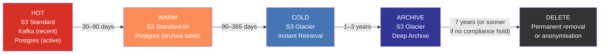

# ODS Platform — Data Retention Policy

**Date:** 2026-04-15
**Status:** Draft — requires legal/compliance sign-off before enforcement
**Author:** Platform Engineering
**Review cadence:** Annual minimum, or on regulatory change / cost alert

---

## Table of Contents

1. [Retention Principles](#1-retention-principles)
2. [Regulatory Context](#2-regulatory-context)
3. [Retention Decisions per Layer](#3-retention-decisions-per-layer)
4. [Kafka Retention Deep-Dive](#4-kafka-retention-deep-dive)
5. [S3 Lifecycle Policy Design](#5-s3-lifecycle-policy-design)
6. [PostgreSQL Retention Strategy](#6-postgresql-retention-strategy)
7. [DLQ Retention Policy](#7-dlq-retention-policy)
8. [Config Version Retention](#8-config-version-retention)
9. [Dev and Staging Environments](#9-dev-and-staging-environments)
10. [Retention Policy Ownership](#10-retention-policy-ownership)

---

## 1. Retention Principles

Data retention for the ODS platform is governed by three competing forces. These forces do not resolve to a single answer for the whole platform — they must be weighed independently for each storage layer.

### 1.1 Operational Need

Engineers need recent data to debug pipeline failures, investigate data quality issues, and support consumers. The further back an incident could plausibly have originated, the longer operational retention must be. Guidance:

- **Active debugging window:** 7–30 days. Most incidents are discovered within a week; engineers need the raw data, DLQ records, Glue logs, and Kafka offsets to be present for this period.
- **Post-incident analysis:** 90 days. Some data quality issues are only detected by consumers weeks after ingestion. A 90-day lookback gives teams meaningful replay capability.
- **Annual reconciliation:** 13 months. Regulatory reconciliation checks sometimes compare current figures against the same period in the prior year.

Operational need does not justify permanent retention. Once the operational window has passed, data that serves no compliance purpose should be deleted.

### 1.2 Compliance

Compliance sets both **minimum** and **maximum** retention periods.

- **Minimum retention** — regulatory rules may require data to be retained for a specified number of years (e.g., 7 years for insurance policy and claims records). Deleting data before the minimum period is a regulatory breach.
- **Maximum retention** — GDPR data minimisation requires that personal data not be kept longer than necessary for the stated purpose. Retaining data beyond its useful life is also a regulatory breach.

Compliance requirements differ by data classification. Not all data flowing through the ODS contains PII or regulated financial data. Each dataset should be classified before retention periods are finalised. **This document makes recommendations; legal/compliance sign-off is required before implementation.**

### 1.3 Cost

All ODS storage layers carry ongoing cost:

- **S3** — charged per GB/month. Cost is mitigated by transitioning data to cheaper tiers (Standard-IA, Glacier) before deletion. Permanent raw-zone storage of every ingested CSV is intentional but should be tiered to Glacier after the operational window.
- **Amazon MSK (Kafka)** — broker storage is provisioned. Topics with no retention policy grow until brokers run out of disk, causing producer backpressure and potential data loss. Kafka storage is expensive relative to S3; long retention in Kafka is rarely justified.
- **PostgreSQL RDS** — table rows consume IOPS as well as storage. INSERT-only tables that grow unboundedly degrade query performance and increase backup time. PostgreSQL retention is primarily an operational concern.
- **CloudWatch Logs** — charged per GB ingested and per GB stored. The AWS default of 90 days is reasonable but should be explicitly set so that it does not revert to "never expire" if a log group is recreated.

### 1.4 Retention Decisions Are Per-Layer

The same logical record passes through multiple storage layers (S3 Raw → Glue → S3 Curated → Kafka → Consumer). Each layer has a different cost profile, a different operational role, and potentially a different compliance classification. Retention must be decided layer by layer, not for the platform as a whole.

---

## 2. Regulatory Context

### 2.1 GDPR

The UK GDPR (retained post-Brexit in the UK GDPR / Data Protection Act 2018) applies to any personal data processed by Aviva. The two principles most relevant to this platform are:

**Data minimisation (Article 5(1)(c) and 5(1)(e)):** Personal data must be "adequate, relevant and limited to what is necessary" and "kept in a form which permits identification of data subjects for no longer than is necessary for the purposes for which the personal data are processed."

In practice this means: once a processing purpose has been fulfilled, personal data must be deleted or anonymised. The ODS is an operational data store — it is not an archival system for PII. Raw files containing PII should be subject to automated deletion or anonymisation after the compliance minimum period, not retained permanently.

**Right to erasure (Article 17):** Data subjects may request deletion of their personal data. This is straightforward for PostgreSQL rows and S3 objects. For Kafka it is architecturally challenging because:

1. Kafka segments are immutable — you cannot delete individual records from a segment.
2. Log compaction retains only the latest value per key; a tombstone (null-value message) causes the key to be deleted in the next compaction cycle, but the original record remains in older segments until they are garbage-collected.

**Recommended approach — Crypto-shredding:** Encrypt PII-bearing fields using a per-subject encryption key stored in AWS KMS or a dedicated key store. When a right-to-erasure request is received, delete the customer's key. The Kafka record is now permanently unreadable even though the ciphertext bytes remain. This satisfies GDPR Article 17 without requiring direct Kafka segment manipulation. The crypto-shredding approach should be reviewed and confirmed by the Data Protection Officer before relying on it. **This is a known gap requiring legal/compliance sign-off.**

### 2.2 Financial Services and Insurance Retention

UK insurance regulation (PRA Rulebook, FCA SYSC) and the Insurance Distribution Directive require firms to retain records relating to policy transactions and claims for a minimum of **3 years** from the date of the transaction for most conduct records, and up to **6–7 years** for some categories (e.g., pension-related, long-term insurance). Industry best practice, backed by statute of limitations considerations, is **7 years** for policy and claims data.

**This is a known regulatory requirement. The specific datasets within the ODS that contain policy or claims data must be identified and labelled. Retention periods for those datasets must be confirmed with the Compliance team before production deployment.**

### 2.3 Audit Trail Requirements

Regulatory audit logs (FCA, PRA, GDPR Article 30 Records of Processing Activities) must be retained for a minimum of **3 years** in most cases, and the ICO recommends **6 years** as a precautionary standard for data breach-related records. The ODS `ods.pipeline.audit` topic and its S3 sink (`ods-audit-sink-{env}`) are the primary audit trail for the platform. These must not be subject to aggressive retention reduction.

### 2.4 What Requires Legal/Compliance Sign-Off

The following decisions in this document are recommendations pending sign-off:

| Item | Current status |
|---|---|
| Crypto-shredding as GDPR Article 17 compliance mechanism for Kafka | Pending DPO review |
| 7-year retention for policy/claims datasets | Pending Compliance identification of which datasets qualify |
| Exact minimum retention for audit topic | Pending Legal review (3 vs 6 years) |
| PII classification of individual datasets | Pending Data Classification exercise |
| Right to erasure procedure for S3 Raw Zone | Pending Legal and Engineering design |

---

## 3. Retention Decisions per Layer

### 3.1 Data Lifecycle Overview

The following diagram illustrates the temperature model applied to data as it ages. Each storage layer maps to a temperature zone; lifecycle rules move data through these zones automatically.



### 3.2 Per-Layer Retention Table

| Layer | Technology | Recommended retention (prod) | Recommended retention (dev/staging) | Rationale | Compliance driver | Implementation |
|---|---|---|---|---|---|---|
| S3 Raw Zone (`ods-raw-{env}`) | S3 | Permanent (tiered) — Standard 90 days, Standard-IA 1 year, Glacier Instant 3 years, Glacier Deep Archive 7 years, then evaluate for deletion | 7 days Standard, then delete | Every source CSV ever received; the authoritative record for regulatory replay. PII datasets require right-to-erasure procedure | Insurance 7-year minimum; GDPR data minimisation | S3 lifecycle rule — see section 5.3 |
| S3 Curated Zone (`ods-curated-{env}`) | S3 | Standard 90 days, Standard-IA 1 year, Glacier Instant 3 years, Glacier Deep Archive 7 years, then delete | 7 days Standard, then delete | Derived from Raw; replay is possible from Raw if curated is deleted. 7-year archive retained for direct regulatory query access | Insurance 7-year minimum | S3 lifecycle rule — see section 5.4 |
| S3 Config (`ods-config-{env}`) | S3 (versioned) | Current version: permanent. Non-current versions: retain 90 days or 10 versions, whichever is longer | Current: permanent. Non-current: 7 days / 3 versions | Config history needed for incident investigation; unlimited version accumulation has no benefit | Audit traceability | S3 noncurrent version lifecycle rule — see section 8 |
| S3 DLQ (`ods-dlq-{env}`) | S3 | 90 days active, then Glacier 1 year, then delete | 7 days, then delete | DLQ records should be investigated promptly; long retention masks chronic failures | Operational | S3 lifecycle rule; CloudWatch alarm on age — see section 7 |
| S3 Audit Sink (`ods-audit-sink-{env}`) | S3 | Standard 90 days, Standard-IA 1 year, Glacier Instant 3 years, Glacier Deep Archive 6 years, then delete | 30 days, then delete | Regulatory audit trail; ICO recommends 6-year minimum for breach records | FCA/PRA audit; GDPR Article 30 | S3 lifecycle rule |
| S3 DQ Results (`ods-dq-results-{env}`) | S3 | Standard 30 days, Standard-IA 90 days, Glacier Instant 1 year, delete after 3 years | 7 days, then delete | DQ results support incident investigation and trend analysis; 3-year window sufficient | Operational; supports audit if DQ failures are cited in breach reports | S3 lifecycle rule |
| S3 Quarantine (`ods-quarantine-{env}`) | S3 | 30 days Standard, then delete (after manual review gate) | 7 days, then delete | Quarantined files should be reviewed and either promoted or discarded; long retention implies unreviewed failures | Operational | S3 lifecycle rule; CloudWatch alarm on age |
| Kafka `ods.{domain}.{dataset}` | MSK | `retention.ms`: 7 days (168h). Compacted with delete fallback. `retention.bytes`: -1 (size-unlimited, time governs) | 1 day (24h) | Downstream consumers replay within hours; 7 days covers weekend outages and T+3 reconciliation window. Compaction preserves latest state | Operational | `retention.ms=604800000`, `cleanup.policy=compact,delete` — see section 4 |
| Kafka `ods.pipeline.audit` | MSK | `retention.ms`: 90 days. Delete policy. No compaction | 7 days | Audit events are time-ordered; compaction is inappropriate. 90 days operational then offloaded to S3 audit sink | FCA/PRA audit | `retention.ms=7776000000`, `cleanup.policy=delete` |
| Kafka `ods.pipeline.reconciliation` | MSK | `retention.ms`: 30 days. Delete policy | 7 days | Reconciliation checks are time-bound; T+3 window requires 3-day minimum. 30 days covers reprocessing scenarios | Operational | `retention.ms=2592000000`, `cleanup.policy=delete` |
| PostgreSQL `pipeline.glue_job_log` | RDS PostgreSQL | 90 days in hot table (partitioned), then archive to S3, delete from PostgreSQL after 13 months | 7 days, then delete | INSERT-only table; grows to millions of rows without partitioning. Archived rows remain queryable from S3 via Athena | Operational | Monthly partitions, partition drop at 90 days, S3 archive at 13 months — see section 6 |
| PostgreSQL `pipeline.file_state` | RDS PostgreSQL | Retain while file exists in Raw Zone. Archive to S3 after 1 year, delete from PostgreSQL | 7 days, then delete | One row per S3 file; should not outlive its referenced file in the Raw Zone | Operational | Annual Glue archive job |
| PostgreSQL `pipeline.ingestion_file_state` | RDS PostgreSQL | Retain 90 days hot, archive to S3 after 1 year, delete from PostgreSQL | 7 days, then delete | One row per SFTP file; operational lookback of 90 days is sufficient for debugging | Operational | Annual Glue archive job |
| PostgreSQL `pipeline.reconciliation_log` | RDS PostgreSQL | 90 days hot, archive to S3 after 1 year, delete from PostgreSQL | 7 days, then delete | Reconciliation results are time-bounded; 90-day hot window supports T+90 dispute investigation | Operational; potential regulatory evidence | Monthly partitions, archive at 1 year |
| CloudWatch Logs `/ods/{env}/airflow` | CloudWatch | 90 days | 14 days | AWS default; explicitly set to prevent "never expire" regression. Airflow logs are operational only | Operational | `aws logs put-retention-policy` — see section 5.5 |
| CloudWatch Logs `/ods/{env}/glue` | CloudWatch | 90 days | 14 days | Glue job logs are operational; 90-day window covers all realistic incident investigation timelines | Operational | `aws logs put-retention-policy` |

---

## 4. Kafka Retention Deep-Dive

### 4.1 Time-Based vs Size-Based Retention

Kafka retention operates on two independent axes:

**Time-based retention (`retention.ms`):** A log segment is eligible for deletion once all messages in the segment are older than `retention.ms`. Kafka does not delete individual messages — it deletes whole segments. The actual age at deletion may be slightly older than `retention.ms` depending on segment roll frequency (`segment.ms` or `segment.bytes`).

**Size-based retention (`retention.bytes`):** When the total log size for a partition exceeds `retention.bytes`, Kafka deletes the oldest segments until the log is within the limit. Setting `retention.bytes=-1` disables size-based retention.

For most ODS topics, time-based retention is the primary control. Size-based retention should be set as a safety backstop only (e.g., `retention.bytes=53687091200` — 50 GB per partition) to protect broker disk in the event of a topic with unexpectedly high throughput.

### 4.2 Compacted vs Delete Topics

Kafka supports two cleanup policies:

| Policy | Behaviour | Appropriate for |
|---|---|---|
| `delete` | Segments older than `retention.ms` are deleted wholesale | Event streams where history is not needed indefinitely, e.g. audit events, reconciliation events |
| `compact` | Only the most recent message per key is retained; older duplicates are removed. A tombstone (null-value message) causes a key to be fully deleted after `min.compaction.lag.ms` | State topics where only current value matters, e.g. entity state, configuration state |
| `compact,delete` | Compaction runs to deduplicate; after `retention.ms`, even the compacted record is deleted | Business entity data where current state is needed for consumer catch-up, but old state beyond the retention window can be discarded |

### 4.3 Business Data Topics (`ods.{domain}.{dataset}`)

Business data topics carry the current state of entities (policies, customers, claims). The recommended configuration is `cleanup.policy=compact,delete` with `retention.ms=604800000` (7 days).

**Why compaction?** Consumers that restart after a brief outage need to catch up to current state without replaying years of history. Compaction ensures that for each entity key, the latest value is always available regardless of how long ago it was written.

**Why delete in addition to compact?** Even with compaction, tombstones and infrequently-updated keys accumulate over time. The `delete` policy, combined with `retention.ms`, ensures that records beyond the retention window are eventually removed — this supports GDPR right to erasure via crypto-shredding (the tombstone approach alone is insufficient because the encrypted ciphertext remains in older segments until `retention.ms` expires and the segment is deleted).

**Tombstone and `min.compaction.lag.ms` requirement:**

When a right-to-erasure tombstone is produced for a key, it must not be compacted away before all consumers have had the opportunity to process it. The `min.compaction.lag.ms` setting prevents the compactor from removing a tombstone sooner than this interval.

The minimum safe value is:

```
min.compaction.lag.ms ≥ max_consumer_lag_ms + reconciliation_T3_window_ms + safety_buffer_ms
```

In the ODS context:
- `reconciliation_T3_window_ms` = 3 days = 259,200,000 ms
- Assumed `max_consumer_lag_ms` = 1 day = 86,400,000 ms
- Safety buffer = 1 day = 86,400,000 ms
- **Recommended `min.compaction.lag.ms` = 432,000,000 (5 days)**

**Full recommended config for `ods.{domain}.{dataset}`:**

```properties
# Kafka topic configuration — ods.{domain}.{dataset}
cleanup.policy=compact,delete
retention.ms=604800000              # 7 days
retention.bytes=-1                  # no size limit (time governs)
min.compaction.lag.ms=432000000     # 5 days — see tombstone requirement above
delete.retention.ms=86400000        # tombstone visible to consumers for 1 day after compaction eligibility
segment.ms=86400000                 # roll segments daily to allow timely deletion
```

### 4.4 Audit Topic (`ods.pipeline.audit`)

Audit events are an ordered log of pipeline activities. Compaction is inappropriate because:

1. Multiple events may share the same key (e.g., file identifier) but represent distinct points in time that must all be preserved.
2. Deduplication of audit events would destroy the audit trail.

```properties
# Kafka topic configuration — ods.pipeline.audit
cleanup.policy=delete
retention.ms=7776000000             # 90 days
retention.bytes=-1
segment.ms=86400000
```

Audit events older than 90 days are preserved in the S3 audit sink (`ods-audit-sink-{env}`), which carries its own 6-year retention policy.

### 4.5 Reconciliation Topic (`ods.pipeline.reconciliation`)

```properties
# Kafka topic configuration — ods.pipeline.reconciliation
cleanup.policy=delete
retention.ms=2592000000             # 30 days
retention.bytes=-1
segment.ms=86400000
```

---

## 5. S3 Lifecycle Policy Design

### 5.1 Storage Tier Reference

| Tier | AWS storage class | Cost profile | Appropriate for |
|---|---|---|---|
| Hot | S3 Standard | Highest per-GB; lowest retrieval cost | Data accessed frequently (< 30 days old) |
| Warm | S3 Standard-IA | ~50% lower storage cost; per-retrieval fee | Data accessed occasionally (30–365 days) |
| Cold | S3 Glacier Instant Retrieval | ~70% lower storage cost vs Standard; millisecond retrieval | Data rarely accessed but may need quick access (1–3 years) |
| Archive | S3 Glacier Deep Archive | Lowest storage cost; 12-hour retrieval | Compliance archive (3–7 years) |
| Delete | — | Zero ongoing cost | Data beyond retention period |

Minimum storage durations apply: Standard-IA requires 30 days minimum, Glacier Instant Retrieval 90 days, Glacier Deep Archive 180 days. Lifecycle rules must not transition data before these minimums or AWS will charge for the full minimum period.

### 5.2 General Lifecycle Design Principles

- All lifecycle rules are applied at the bucket level with prefix filters to allow per-dataset overrides.
- Incomplete multipart uploads should be aborted after 7 days on all buckets.
- Noncurrent version expiration rules are applied to all versioned buckets.
- Lifecycle rules are environment-specific: dev/staging use shorter timelines (see section 9).

### 5.3 `ods-raw-{env}` Lifecycle Rule (Example JSON)

The Raw Zone is the permanent archive of every SFTP CSV file ingested. In production it is retained indefinitely (tiered to Glacier Deep Archive), with deletion only after legal hold review. In dev/staging it is deleted after 7 days.

```json
{
  "Rules": [
    {
      "ID": "raw-zone-prod-tiering",
      "Status": "Enabled",
      "Filter": { "Prefix": "" },
      "Transitions": [
        {
          "Days": 90,
          "StorageClass": "STANDARD_IA"
        },
        {
          "Days": 365,
          "StorageClass": "GLACIER_IR"
        },
        {
          "Days": 1095,
          "StorageClass": "DEEP_ARCHIVE"
        }
      ],
      "NoncurrentVersionTransitions": [
        {
          "NoncurrentDays": 30,
          "StorageClass": "STANDARD_IA"
        },
        {
          "NoncurrentDays": 90,
          "StorageClass": "GLACIER_IR"
        }
      ],
      "NoncurrentVersionExpiration": {
        "NoncurrentDays": 365
      },
      "AbortIncompleteMultipartUpload": {
        "DaysAfterInitiation": 7
      }
    },
    {
      "ID": "raw-zone-prod-compliance-delete",
      "Status": "Disabled",
      "Filter": { "Prefix": "" },
      "Expiration": {
        "Days": 2556
      }
    }
  ]
}
```

Notes:
- The `raw-zone-prod-compliance-delete` rule is **disabled by default**. It should only be enabled after legal/compliance confirmation that the 7-year retention period has been met for a given dataset prefix and that no GDPR hold or legal hold applies.
- PII datasets should use per-prefix rules aligned to the minimum retention period confirmed by the Compliance team.

### 5.4 `ods-curated-{env}` Lifecycle Rule (Example JSON)

```json
{
  "Rules": [
    {
      "ID": "curated-zone-prod-tiering",
      "Status": "Enabled",
      "Filter": { "Prefix": "" },
      "Transitions": [
        {
          "Days": 90,
          "StorageClass": "STANDARD_IA"
        },
        {
          "Days": 365,
          "StorageClass": "GLACIER_IR"
        },
        {
          "Days": 1095,
          "StorageClass": "DEEP_ARCHIVE"
        }
      ],
      "Expiration": {
        "Days": 2556
      },
      "NoncurrentVersionTransitions": [
        {
          "NoncurrentDays": 30,
          "StorageClass": "STANDARD_IA"
        }
      ],
      "NoncurrentVersionExpiration": {
        "NoncurrentDays": 90
      },
      "AbortIncompleteMultipartUpload": {
        "DaysAfterInitiation": 7
      }
    }
  ]
}
```

Notes:
- Curated data is derived from Raw. If a compliance hold applies to the underlying raw data, the same hold should apply to curated data for that dataset.
- Date-partitioned Parquet layout (`s3://ods-curated-{env}/{domain}/{dataset}/year={}/month={}/day={}`) allows prefix-scoped lifecycle rules per dataset without affecting others.

### 5.5 CloudWatch Log Group Retention

CloudWatch log groups must have an explicit retention policy. Without one, if a log group is deleted and recreated (e.g., during a Terraform redeploy) it may revert to "never expire."

```bash
# Set explicitly during infrastructure provisioning (Terraform resource or CLI)
aws logs put-retention-policy \
  --log-group-name "/ods/prod/airflow" \
  --retention-in-days 90

aws logs put-retention-policy \
  --log-group-name "/ods/prod/glue" \
  --retention-in-days 90
```

In Terraform, use the `retention_in_days` argument on `aws_cloudwatch_log_group` resources. Do not rely on the AWS Console default.

---

## 6. PostgreSQL Retention Strategy

### 6.1 Problem Statement

`pipeline.glue_job_log` is an INSERT-only table. A busy pipeline (e.g., 100 Glue job runs per day across all datasets) generates 36,500 rows per year, growing to millions of rows within a few years. Without a retention strategy:

- `SELECT` queries for monitoring dashboards perform full table scans.
- Vacuum and autovacuum time increases.
- RDS backup and restore times grow.
- Point-in-time recovery windows become expensive.

### 6.2 Recommended Strategy: Table Partitioning + S3 Archive

The recommended approach combines two techniques:

1. **Monthly range partitioning by `created_at`** — active queries only scan relevant partitions; old partitions can be dropped as a single DDL operation (near-instant, no row-by-row delete).
2. **S3 archive before drop** — before dropping a partition, a scheduled Glue job exports the rows to S3 in Parquet format. The archived data is queryable via Athena.

### 6.3 DDL: Partitioned `glue_job_log`

```sql
-- Create the partitioned parent table
-- Run once; migrate existing data into partitions afterwards
CREATE TABLE pipeline.glue_job_log (
    id              BIGSERIAL,
    job_name        TEXT         NOT NULL,
    job_run_id      TEXT         NOT NULL,
    domain          TEXT         NOT NULL,
    dataset         TEXT         NOT NULL,
    status          TEXT         NOT NULL,  -- SUCCEEDED | FAILED | RUNNING
    error_message   TEXT,
    input_files     JSONB,
    output_rows     BIGINT,
    duration_ms     BIGINT,
    config_version  TEXT,                   -- S3 config object version ID (referential integrity — see section 8)
    created_at      TIMESTAMPTZ  NOT NULL DEFAULT now(),
    updated_at      TIMESTAMPTZ  NOT NULL DEFAULT now()
) PARTITION BY RANGE (created_at);

-- Index on the partition key (automatically inherited by child partitions)
CREATE INDEX ON pipeline.glue_job_log (created_at);
CREATE INDEX ON pipeline.glue_job_log (domain, dataset, created_at);
CREATE INDEX ON pipeline.glue_job_log (job_run_id);

-- Create partitions for current and near-future months
-- (automate partition creation with pg_partman or a monthly scheduled job)
CREATE TABLE pipeline.glue_job_log_2026_04
    PARTITION OF pipeline.glue_job_log
    FOR VALUES FROM ('2026-04-01') TO ('2026-05-01');

CREATE TABLE pipeline.glue_job_log_2026_05
    PARTITION OF pipeline.glue_job_log
    FOR VALUES FROM ('2026-05-01') TO ('2026-06-01');

-- Example: drop a partition that has been archived
-- DROP TABLE pipeline.glue_job_log_2025_01;
```

**Partition management** should use [pg_partman](https://github.com/pgpartman/pg_partman) or a Lambda/Glue cron job that:
1. Creates the next month's partition 14 days before month end.
2. Archives and drops partitions older than 90 days (prod) or 7 days (dev).

### 6.4 Archive Job Design

A scheduled AWS Glue job (`ods-postgres-archive-job`) runs monthly and:

1. Selects all rows from the oldest hot partition (e.g., `glue_job_log_2025_12`).
2. Writes them to `s3://ods-curated-{env}/postgres-archive/glue_job_log/year=2025/month=12/` in Parquet format, partitioned by `domain`.
3. Registers the S3 path in the Glue Data Catalog (table: `glue_job_log_archive`) so Athena queries work immediately.
4. Verifies row count: S3 row count must equal PostgreSQL partition row count before proceeding.
5. Drops the PostgreSQL partition.
6. Writes an audit record to `pipeline.glue_job_log` itself (using the current month's partition) recording the archive operation.

```sql
-- Archive verification query (run by Glue job before dropping partition)
SELECT COUNT(*) AS partition_row_count
FROM pipeline.glue_job_log
WHERE created_at >= '2025-12-01' AND created_at < '2026-01-01';
-- Must match Parquet row count written to S3
```

The same archive pattern applies to `pipeline.file_state`, `pipeline.ingestion_file_state`, and `pipeline.reconciliation_log`, with adjusted retention windows per the table in section 3.2.

---

## 7. DLQ Retention Policy

### 7.1 DLQ Purpose and Risk

The DLQ (`ods-dlq-{env}`) stores records that failed processing — schema validation failures, transformation errors, rejected rows from Glue jobs. A DLQ that grows without bound is a symptom of uninvestigated failures. Long-lived DLQ records represent data that was **never delivered** to the curated zone or downstream consumers. This is potential silent data loss.

### 7.2 Policy

**(a) Active retention window:** 90 days in `ods-dlq-{env}` (S3 Standard). After 90 days, transition to S3 Standard-IA for a further 275 days (total 1 year), then delete. DLQ records should not be retained beyond 1 year — if they have not been investigated and either resolved or deliberately discarded after a year, they never will be.

**(b) Stale DLQ alarm:** A CloudWatch alarm must fire if any DLQ record is older than 7 days and has not been tagged as "investigated." The 7-day threshold aligns with the operational debugging window (section 1.1). A DLQ record older than 7 days without investigation is a signal that the failure has not been actioned.

Alarm implementation:

```python
# Lambda or Glue job: runs daily, scans ods-dlq-{env}
# Objects with LastModified older than 7 days that lack the tag
# "InvestigationStatus" = "reviewed" trigger a CloudWatch metric

import boto3
from datetime import datetime, timezone, timedelta

s3 = boto3.client('s3')
cloudwatch = boto3.client('cloudwatch')

def check_stale_dlq(bucket: str, threshold_days: int = 7):
    stale_count = 0
    paginator = s3.get_paginator('list_objects_v2')
    cutoff = datetime.now(timezone.utc) - timedelta(days=threshold_days)

    for page in paginator.paginate(Bucket=bucket):
        for obj in page.get('Contents', []):
            if obj['LastModified'] < cutoff:
                tags_resp = s3.get_object_tagging(Bucket=bucket, Key=obj['Key'])
                tags = {t['Key']: t['Value'] for t in tags_resp['Tags']}
                if tags.get('InvestigationStatus') != 'reviewed':
                    stale_count += 1

    cloudwatch.put_metric_data(
        Namespace='ODS/DLQ',
        MetricData=[{
            'MetricName': 'StaleDLQRecordCount',
            'Value': stale_count,
            'Unit': 'Count',
            'Dimensions': [{'Name': 'Bucket', 'Value': bucket}]
        }]
    )
```

The CloudWatch alarm threshold is `StaleDLQRecordCount > 0` with a HIGH severity alert routed to the platform on-call channel.

**(c) After investigation:** Once a DLQ record has been triaged:
- If reprocessable: requeue to the source Kafka topic and delete from DLQ.
- If permanently rejected (e.g., schema incompatibility that cannot be resolved retroactively): tag the object with `InvestigationStatus=reviewed` and `DispositionReason=<reason>`. The object will be deleted at day 90 by the lifecycle rule.
- If the record contains data that must be retained for compliance: move to `ods-audit-sink-{env}` under a dedicated prefix before deleting from DLQ.

### 7.3 DLQ Lifecycle Rule

```json
{
  "Rules": [
    {
      "ID": "dlq-active-retention",
      "Status": "Enabled",
      "Filter": { "Prefix": "" },
      "Transitions": [
        {
          "Days": 90,
          "StorageClass": "STANDARD_IA"
        }
      ],
      "Expiration": {
        "Days": 365
      },
      "AbortIncompleteMultipartUpload": {
        "DaysAfterInitiation": 7
      }
    }
  ]
}
```

---

## 8. Config Version Retention

### 8.1 Problem

`ods-config-{env}` has S3 versioning enabled. Every time a YAML pipeline config is updated, a new version is created and the previous version becomes a noncurrent version. Without a noncurrent version lifecycle rule, these accumulate without bound.

Config versions are not arbitrarily deletable. The `pipeline.glue_job_log` table stores a `config_version` column (the S3 object version ID used during the job run). Deleting a config version that is still referenced by a live log entry breaks audit traceability — it becomes impossible to know what configuration was active during a historical job run.

### 8.2 Policy

**Current version:** Never deleted by lifecycle policy. Config files are small; the current version is always retained.

**Noncurrent versions (prod):** Retain for the longer of:
- 90 days from the date the version became noncurrent, **or**
- Until the newest `glue_job_log` entry referencing that version ID is itself archived to S3 (i.e., no live PostgreSQL row references the version).

In practice, since `glue_job_log` hot rows are retained for 90 days in PostgreSQL before archiving, a 90-day noncurrent version retention aligns correctly. After 90 days, a noncurrent config version should not be referenced by any live PostgreSQL row.

**Noncurrent versions (dev/staging):** 7 days.

**Maximum version count:** Retain the last 10 noncurrent versions regardless of age, as a safety net for rollback. This is the higher bound: the lifecycle rule deletes versions older than 90 days **and** versions beyond the 10 most recent noncurrent versions.

### 8.3 S3 Lifecycle Rule for Config Versioning

```json
{
  "Rules": [
    {
      "ID": "config-noncurrent-version-expiration",
      "Status": "Enabled",
      "Filter": { "Prefix": "" },
      "NoncurrentVersionExpiration": {
        "NoncurrentDays": 90,
        "NewerNoncurrentVersions": 10
      },
      "AbortIncompleteMultipartUpload": {
        "DaysAfterInitiation": 7
      }
    }
  ]
}
```

### 8.4 Referential Integrity Enforcement

The `ods-postgres-archive-job` (section 6.4) must check config version references before the archive step:

```sql
-- Before dropping partition pipeline.glue_job_log_YYYY_MM,
-- record all config_version IDs referenced so they are not deleted from S3
SELECT DISTINCT config_version
FROM pipeline.glue_job_log
WHERE created_at >= 'YYYY-MM-01' AND created_at < 'YYYY-MM+1-01'
  AND config_version IS NOT NULL;
```

These version IDs are written to a manifest file in `ods-audit-sink-{env}/config-version-manifests/`. If a version ID in the manifest is still a noncurrent version in `ods-config-{env}`, the S3 lifecycle rule will still delete it after 90 days — this is acceptable because the manifest in the audit sink preserves the version ID (and optionally the config content) for audit purposes.

---

## 9. Dev and Staging Environments

Dev and staging data has no compliance obligation. It exists to support development, testing, and integration validation. All retention periods in these environments are significantly shorter to control cost and to ensure that stale test data does not accumulate.

### 9.1 Retention Summary

| Layer | Dev retention | Staging retention | Rationale |
|---|---|---|---|
| S3 Raw Zone | 7 days, then delete | 14 days, then delete | No compliance requirement; dev data should not persist |
| S3 Curated Zone | 7 days, then delete | 14 days, then delete | As above |
| S3 Config | Current version: permanent. Noncurrent: 7 days / 3 versions | Current version: permanent. Noncurrent: 14 days / 5 versions | Config must remain for active pipelines |
| S3 DLQ | 7 days, then delete | 14 days, then delete | DLQ in dev/staging is debugging aid only |
| S3 Audit Sink | 14 days, then delete | 30 days, then delete | No regulatory requirement in non-prod |
| S3 DQ Results | 7 days, then delete | 14 days, then delete | Short operational lookback only |
| S3 Quarantine | 7 days, then delete | 14 days, then delete | Test quarantine files should not linger |
| Kafka (business) | `retention.ms=86400000` (1 day) | `retention.ms=259200000` (3 days) | Consumer tests replay within hours |
| Kafka (audit) | `retention.ms=86400000` (1 day) | `retention.ms=604800000` (7 days) | Sufficient for integration test validation |
| Kafka (reconciliation) | `retention.ms=86400000` (1 day) | `retention.ms=259200000` (3 days) | Covers T+3 in staging; not needed in dev |
| PostgreSQL (all tables) | 7 days (no archiving) | 30 days (no archiving) | Just truncate/delete; no S3 archive needed |
| CloudWatch Logs | 14 days | 30 days | Operational lookback sufficient |

### 9.2 Environment Tagging

All S3 buckets, MSK clusters, and RDS instances must be tagged with `Environment: dev | staging | prod`. Lifecycle rules are applied per bucket, which is environment-specific by naming convention (`ods-raw-dev`, `ods-raw-staging`, `ods-raw-prod`). Terraform modules should parameterise retention values by environment variable.

### 9.3 Dev Data Hygiene

In addition to automated lifecycle rules, a weekly Lambda job should:
- Delete all objects in dev S3 buckets older than 7 days that were not deleted by the lifecycle rule (e.g., objects with object lock or incomplete lifecycle rule coverage).
- Alert if any dev Kafka topic lag exceeds 24 hours (indicating a stale consumer in dev).

---

## 10. Retention Policy Ownership

### 10.1 Implementation and Review Responsibilities

| Layer | Implementation owner | Review owner | Review trigger | Review frequency |
|---|---|---|---|---|
| S3 Raw Zone | Platform Engineering | Compliance + Platform Engineering | Annual; regulatory change; cost alert > 20% MoM growth | Annual minimum |
| S3 Curated Zone | Platform Engineering | Platform Engineering | Annual; cost alert | Annual minimum |
| S3 Config | Platform Engineering | Platform Engineering | Annual | Annual minimum |
| S3 DLQ | Platform Engineering | Platform Engineering + Data Engineering | Stale DLQ alarm; annual | Annual minimum |
| S3 Audit Sink | Platform Engineering | Compliance + Legal | Regulatory change; annual | Annual minimum |
| S3 DQ Results | Platform Engineering | Data Engineering | Annual | Annual minimum |
| S3 Quarantine | Platform Engineering | Data Engineering | Stale quarantine alarm; annual | Annual minimum |
| Kafka (all topics) | Platform Engineering | Platform Engineering | MSK disk alert; annual | Annual minimum |
| PostgreSQL (all tables) | Platform Engineering | Platform Engineering + DBA | RDS storage alert; annual | Annual minimum |
| CloudWatch Logs | Platform Engineering | Platform Engineering | Annual | Annual minimum |

### 10.2 Annual Review Process

At each annual review, the following questions must be answered for every layer:

1. Have the regulatory requirements changed since the last review?
2. Has the data classification of any dataset changed (e.g., a dataset that previously contained no PII now does)?
3. Has actual storage growth exceeded the projected cost model? If so, should retention periods be shortened?
4. Are any lifecycle rules failing silently (e.g., S3 lifecycle rule transition errors in CloudWatch)?
5. Are there any datasets under a legal hold that must override the standard lifecycle rules?

Review outcomes must be documented and approved by the Platform Engineering Lead and, for any compliance-relevant changes, by the Compliance team.

### 10.3 Cost Monitoring

The following CloudWatch/Cost Explorer alarms should be in place to trigger unscheduled reviews:

| Alarm | Threshold | Action |
|---|---|---|
| S3 bucket size growth | > 20% month-on-month for any single bucket | Page Platform Engineering; review lifecycle rules |
| MSK broker disk utilisation | > 70% on any broker | Page Platform Engineering; review topic retention |
| RDS storage growth | > 15% month-on-month | Page Platform Engineering; review archive jobs |
| Stale DLQ records | Any record > 7 days without investigation tag | Alert data engineering on-call |
| Stale quarantine records | Any object > 30 days in quarantine | Alert data engineering on-call |
| Lifecycle rule errors | Any S3 lifecycle rule error in CloudWatch | Alert Platform Engineering |

### 10.4 Legal Hold Procedure

In the event of litigation, regulatory investigation, or a data subject access request requiring preservation:

1. Legal places a hold via the AWS S3 Object Lock API (governance mode or compliance mode depending on severity).
2. The affected bucket prefixes and hold expiry date are recorded in the Legal Hold Register (maintained outside this document).
3. Platform Engineering is notified so that lifecycle rules covering the affected prefixes are suspended for the duration of the hold.
4. On hold expiry, Legal notifies Platform Engineering to re-enable lifecycle rules.

Object Lock in compliance mode cannot be overridden by any AWS principal including root — use this only when absolutely required by a court or regulator.

---

## Appendix A: Open Items and Decision Log

| # | Item | Decision required from | Target date | Status |
|---|---|---|---|---|
| 1 | Confirm crypto-shredding satisfies GDPR Art 17 for Kafka | Data Protection Officer | TBD | Open |
| 2 | Identify datasets containing policy/claims data subject to 7-year minimum | Compliance | TBD | Open |
| 3 | Confirm 3-year vs 6-year minimum for audit trail retention | Legal | TBD | Open |
| 4 | Complete data classification exercise for all ODS datasets | Data Governance | TBD | Open |
| 5 | Design right-to-erasure procedure for S3 Raw Zone | Legal + Platform Engineering | TBD | Open |
| 6 | Confirm legal hold procedure with Legal team | Legal | TBD | Open |

---

## Appendix B: Implementation Checklist

The following tasks must be completed to implement this policy:

- [ ] Apply S3 lifecycle rules to all `ods-*-prod` buckets
- [ ] Apply S3 lifecycle rules to all `ods-*-staging` buckets
- [ ] Apply S3 lifecycle rules to all `ods-*-dev` buckets
- [ ] Update Kafka topic configs (`retention.ms`, `cleanup.policy`, `min.compaction.lag.ms`) for all business data topics
- [ ] Update Kafka topic configs for audit and reconciliation topics
- [ ] Migrate `pipeline.glue_job_log` to partitioned table (pg_partman setup)
- [ ] Migrate `pipeline.reconciliation_log` to partitioned table
- [ ] Create `ods-postgres-archive-job` Glue job
- [ ] Deploy stale DLQ Lambda checker and CloudWatch alarm
- [ ] Deploy stale quarantine CloudWatch alarm
- [ ] Set CloudWatch log group retention policies for all `/ods/*/airflow` and `/ods/*/glue` groups
- [ ] Apply config version noncurrent expiration lifecycle rule to `ods-config-{env}`
- [ ] Obtain legal/compliance sign-off on items in Appendix A
- [ ] Schedule annual review in team calendar (first review: 2027-04-15)
