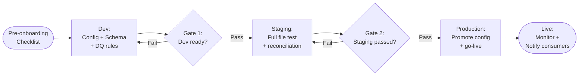
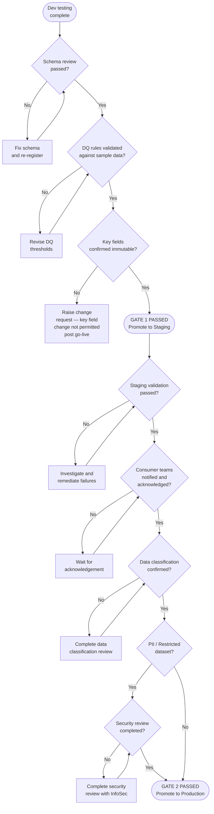

# Dataset Onboarding Runbook — ODS Platform

**Date:** 2026-04-15
**Status:** Active
**Audience:** Data Engineers, Data Owners, Schema Reviewers, Platform Team
**Applies to:** All ingestion patterns (S3 batch, CDC, API, Event)

---

## Table of Contents

1. [Overview](#1-overview)
2. [Pre-onboarding Checklist](#2-pre-onboarding-checklist)
3. [Step-by-step Onboarding — S3 Batch Pattern](#3-step-by-step-onboarding--s3-batch-pattern)
4. [Step-by-step Onboarding — CDC Pattern](#4-step-by-step-onboarding--cdc-pattern)
5. [Step-by-step Onboarding — API Pattern](#5-step-by-step-onboarding--api-pattern)
6. [Step-by-step Onboarding — Event Pattern](#6-step-by-step-onboarding--event-pattern)
7. [Approval Gates](#7-approval-gates)
8. [YAML Config Templates](#8-yaml-config-templates)
9. [DQ Rules Template](#9-dq-rules-template)
10. [Testing the Onboarded Dataset](#10-testing-the-onboarded-dataset)
11. [Post-onboarding Checklist](#11-post-onboarding-checklist)
12. [Offboarding a Dataset](#12-offboarding-a-dataset)

---

## 1. Overview

### How the platform works

The ODS platform is **config-driven**. Onboarding a new dataset that follows an existing ingestion pattern requires:

- A new **YAML config file** describing the dataset and pipeline parameters
- A new **schema registration** in Glue Schema Registry
- A new **DQ rules file** (`.dqdl`) defining data quality checks
- A **Kafka topic** for the dataset
- A **Glue crawler** to keep the Data Catalog up to date
- A **`file_catalogue` entry** in PostgreSQL (S3 batch / SFTP datasets only)

**No new Glue job code is required** when the dataset follows an existing pattern. The shared job code reads all parameters from the YAML config at runtime.

### When new code is needed

New code must be written when:

- The dataset uses a **source pattern not yet implemented** (currently, only S3 batch is fully designed; CDC, API, and Event patterns are in design)
- The dataset requires **custom transformation logic** not expressible through config (e.g. a multi-table join, a bespoke masking algorithm, or a non-standard file format parser)
- A new **schema evolution strategy** is needed that is not supported by the existing compatibility modes

New code work must be scoped, designed, and reviewed by the Platform Team before onboarding begins.

### Who is involved

| Role | Responsibilities |
|---|---|
| **Data Engineer** | Writes the YAML config, DQ rules, registers the schema, creates infrastructure components, executes the test plan |
| **Data Owner** | Provides source system details, confirms key fields, approves DQ rule thresholds, signs off at each gate |
| **Schema Reviewer** | Reviews and approves the schema registration, field types, compatibility mode, and nullable/required annotations |
| **Platform Team** | Approves any new code, owns shared infrastructure, reviews security for PII datasets, approves production promotion |

### Onboarding process at a glance



---

## 2. Pre-onboarding Checklist

Gather all of the following information before raising an onboarding request. Incomplete requests will be returned to the data owner.

### 2.1 Dataset identity

- [ ] Dataset name (snake_case, e.g. `policies`, `motor_claims`)
- [ ] Domain name (snake_case, e.g. `insurance`, `motor`, `finance`)
- [ ] Owning team and data owner contact

### 2.2 Source details

- [ ] Source type: **SFTP** / **CDC** / **API** / **Event**
- [ ] For SFTP: SFTP host, port, credentials location (Secrets Manager ARN), remote directory path, filename pattern
- [ ] For CDC: source database engine (PostgreSQL / Oracle / MySQL), host/port, schema, table(s), existing replication slot or DMS task ARN
- [ ] For API: endpoint URL, authentication method, request/response format, pagination strategy, call frequency
- [ ] For Event: source system, event type, event bus ARN or broker details

### 2.3 File / message characteristics

- [ ] File format (CSV / Parquet / JSON / Avro / other)
- [ ] Character encoding (UTF-8 / UTF-16 / ISO-8859-1)
- [ ] Has header row? (CSV only)
- [ ] Delimiter (CSV only — comma, pipe, tab)
- [ ] Delivery frequency (e.g. every 5 minutes, daily at 03:00 UTC)
- [ ] Expected daily volume (record count and approximate file size)
- [ ] Filename date pattern (e.g. `policies_{yyyyMMdd}.csv`) or timestamp embedded in filename

### 2.4 Schema

- [ ] Full column list with data types (string, int, double, date, timestamp, boolean)
- [ ] Nullable / required annotation for every field
- [ ] Business date field identified (the field that represents the business effective date of each record)
- [ ] Fields that contain PII or sensitive values flagged

### 2.5 Key fields

- [ ] Primary key field(s) listed — **these cannot be changed after go-live**
- [ ] Confirmed by data owner in writing that key fields are stable and will not change

### 2.6 DQ rules

- [ ] Hard block rules defined (failures stop the file from progressing; file goes to DLQ)
- [ ] Soft warn rules defined (failures emit a CloudWatch metric; file continues)
- [ ] Record count tolerance for T3 reconciliation (`t2_tolerance_records`)
- [ ] Aggregate field(s) for T3 sum check (e.g. `premium_amount`)
- [ ] Late arrival window agreed (default 24 hours)

### 2.7 Data classification

- [ ] Data classification level confirmed (Public / Internal / Confidential / Restricted)
- [ ] PII fields listed if classification is Confidential or Restricted
- [ ] Data retention period confirmed
- [ ] Security review required? (mandatory for Restricted datasets)

### 2.8 Consumers

- [ ] Consumer team names and contacts listed
- [ ] Consumer teams notified of planned onboarding timeline
- [ ] Kafka consumer group naming agreed (e.g. `cg.{team}.{dataset}`)

### 2.9 Reconciliation

- [ ] Source record count available for each delivery? (required for T2)
- [ ] Source aggregate sum available for T3? (optional but strongly recommended)
- [ ] Watermark hours agreed (default 4 hours)
- [ ] T3 check schedule agreed (cron expression, default `0 6 * * *`)

---

## 3. Step-by-step Onboarding — S3 Batch Pattern

This is the most detailed section because S3 batch (SFTP → S3 Raw → Glue ETL → S3 Curated → Glue Publish → MSK) is the first fully designed pattern.

The pipeline flow is:

```
SFTP source
    └─► S3 Raw  (ods-raw-{env}/{domain}/{dataset}/date={date}/)
          └─► EventBridge rule (shared: ods-raw-file-rule-{env})
                └─► Glue ETL job (ods-ingestion-{dataset})
                      ├─► DQ hard block → DLQ (ods-dlq-{env})
                      └─► S3 Curated (ods-curated-{env}/{domain}/{dataset}/date={date}/)
                            └─► EventBridge rule (shared: ods-curated-file-rule-{env})
                                  └─► Glue Publish job (ods-s3-publish-{dataset})
                                        └─► MSK topic (ods.{domain}.{dataset})
```

---

### Step 1 — Register schema in Glue Schema Registry

**Who:** Data Engineer + Schema Reviewer
**Environment:** Dev first, then repeated for staging and prod

1. Translate the agreed column list into **Avro schema JSON** format. Example for `policies`:

   ```json
   {
     "type": "record",
     "name": "Policy",
     "namespace": "ods.insurance.policies",
     "fields": [
       { "name": "policy_id",       "type": "string" },
       { "name": "customer_id",     "type": "string" },
       { "name": "premium_amount",  "type": "double" },
       { "name": "effective_date",  "type": { "type": "int", "logicalType": "date" } },
       { "name": "status",          "type": ["null", "string"], "default": null }
     ]
   }
   ```

2. Register the schema in the shared Glue Schema Registry:
   - Registry name: `ods-schema-registry-{env}`
   - Subject name: `ods-{domain}-{dataset}` (e.g. `ods-insurance-policies`)
   - Compatibility mode: `BACKWARD` (default — new optional fields may be added; existing fields may not be removed or renamed)
   - For datasets with strict downstream contracts, consider `FULL`

3. Confirm the schema ARN is returned without error and record it in the YAML config field `schema_id`.

4. **Schema Reviewer sign-off required** before proceeding. Reviewer checks:
   - [ ] All agreed fields present with correct types
   - [ ] PII fields annotated in schema metadata if applicable
   - [ ] Compatibility mode appropriate for the dataset
   - [ ] Key fields are non-nullable

**Success:** Schema appears in Glue Schema Registry console under `ods-schema-registry-dev` with status `AVAILABLE`.

---

### Step 2 — Create the Kafka topic

**Who:** Data Engineer (Platform Team approves in prod)
**Environment:** Dev first

```bash
# Create the topic with appropriate partition count and retention
# Default: 6 partitions, 7-day retention for most datasets
# Increase partitions for high-volume datasets (>100k records/delivery)

kafka-topics.sh \
  --bootstrap-server <msk-bootstrap-dev>:9092 \
  --create \
  --topic ods.insurance.policies \
  --partitions 6 \
  --replication-factor 3 \
  --config retention.ms=604800000 \
  --config cleanup.policy=delete
```

Naming convention: `ods.{domain}.{dataset}` — this is the authoritative topic name and must match the YAML config exactly.

For the audit side-channel (already exists — shared): `ods.pipeline.audit`

**Success:** Topic is visible in MSK console or via `kafka-topics.sh --list` and shows correct partition/replication configuration.

---

### Step 3 — Create the YAML config file

**Who:** Data Engineer
**Environment:** Dev

Create the file at the path: `ods-config-dev/{domain}/{dataset}.yaml`

Use the full annotated template in [Section 8.1](#81-s3-batch-pattern--full-template). Complete every field. Leave no field blank — use explicit values rather than relying on defaults in the job code.

Key points:
- `key_fields` must match exactly what was agreed in the pre-onboarding checklist and must not change after go-live
- `dq_rules_ref` must point to the DQ rules file created in Step 4
- `schema_id` must match the registry subject registered in Step 1
- `sftp_filename_pattern` must be a valid glob expression that will not accidentally match files from other datasets

---

### Step 4 — Create the DQ rules file

**Who:** Data Engineer (Data Owner reviews)
**Environment:** Dev

Create the file at: `ods-config-dev/dq-rules/{dataset}.dqdl`

Use the full annotated template in [Section 9](#9-dq-rules-template). At a minimum the file must include:

- A `RowCount` check (hard block on zero rows)
- A `Completeness` check on every key field (hard block)
- An `IsUnique` check on every key field or composite key (hard block)
- A `RowCount` upper bound soft warn (e.g. warn if record count exceeds 5× the historical maximum — catches runaway duplicates before they hard-block)

The data owner must review and approve the DQ threshold values before Step 7.

---

### Step 5 — Add the `file_catalogue` entry

**Who:** Data Engineer
**Environment:** Dev PostgreSQL (`ods_dev` database)

The `file_catalogue` table is the SFTP ingestion gateway's allowlist. Files whose source path and filename pattern are not in this table will be rejected at the SFTP polling stage.

```sql
INSERT INTO pipeline.file_catalogue (
    name_pattern,
    sftp_path,
    domain,
    dataset,
    config_ref,
    active
)
VALUES (
    'policies_*.csv',                              -- sftp_filename_pattern from YAML
    '/outbound/insurance/policies/',               -- sftp_path from YAML
    'insurance',                                   -- domain
    'policies',                                    -- dataset name
    's3://ods-config-dev/insurance/policies.yaml', -- S3 URI of the YAML config
    TRUE
);
```

Verify the insert:

```sql
SELECT * FROM pipeline.file_catalogue
WHERE domain = 'insurance' AND dataset = 'policies';
```

**Success:** Row is returned with `active = TRUE`.

---

### Step 6 — Create the Glue crawler

**Who:** Data Engineer
**Environment:** Dev

Create a Glue crawler via AWS CLI or Terraform:

```bash
aws glue create-crawler \
  --name ods-policies-crawler \
  --role arn:aws:iam::<account>:role/ods-glue-role \
  --database-name ods_insurance \
  --targets '{"S3Targets": [{"Path": "s3://ods-curated-dev/insurance/policies/"}]}' \
  --schedule "cron(0 */4 * * ? *)" \
  --configuration '{"Version":1.0,"CrawlerOutput":{"Partitions":{"AddOrUpdateBehavior":"InheritFromTable"}}}' \
  --region eu-west-1
```

Naming convention: `ods-{dataset}-crawler`

The database `ods_insurance` (shared for the domain) must already exist. If it does not, create it:

```bash
aws glue create-database \
  --database-input '{"Name": "ods_insurance"}' \
  --region eu-west-1
```

**Success:** Crawler appears in Glue console with state `READY`.

---

### Step 7 — Upload config and DQ rules to dev

**Who:** Data Engineer
**Environment:** Dev

```bash
aws s3 cp insurance/policies.yaml \
  s3://ods-config-dev/insurance/policies.yaml

aws s3 cp dq-rules/policies.dqdl \
  s3://ods-config-dev/dq-rules/policies.dqdl
```

S3 versioning is enabled on `ods-config-{env}` buckets. Every upload creates a new version — no history is lost. Record the version ID of both uploads in the onboarding ticket.

**Success:** Files are visible at their S3 paths. Confirm via:

```bash
aws s3 ls s3://ods-config-dev/insurance/
aws s3 ls s3://ods-config-dev/dq-rules/
```

---

### Step 8 — Test in dev

**Who:** Data Engineer
**Environment:** Dev

Follow the full test checklist in [Section 10](#10-testing-the-onboarded-dataset) with dev-tier expectations.

Quick smoke test sequence:

1. Drop a well-formed test CSV file (minimum 10 rows, all key fields populated) on the SFTP server at the configured `sftp_path`.
2. Wait for the SFTP poller to pick up the file (up to `poll_interval_minutes`).
3. Verify the file appears in `s3://ods-raw-dev/{domain}/{dataset}/date={today}/`.
4. Verify the EventBridge rule `ods-raw-file-rule-dev` fired (check CloudWatch Events).
5. Verify the Glue ETL job `ods-ingestion-{dataset}` started and completed successfully (check Glue job run history).
6. Verify curated data appears in `s3://ods-curated-dev/{domain}/{dataset}/date={today}/`.
7. Verify the Glue publish job `ods-s3-publish-{dataset}` ran and produced messages in `ods.{domain}.{dataset}`.
8. Consume from the Kafka topic and verify record count matches the source file.
9. Check the audit topic `ods.pipeline.audit` for a successful run record.

**Success criteria for dev gate:**
- End-to-end pipeline completes without error for the happy-path file
- DQ hard block test sends file to DLQ correctly (see Section 10)
- Kafka record count matches source file record count exactly

---

### Step 9 — Promote config to staging

**Who:** Data Engineer
**Environment:** Staging

After Gate 1 approval (see [Section 7](#7-approval-gates)):

```bash
aws s3 cp \
  s3://ods-config-dev/insurance/policies.yaml \
  s3://ods-config-staging/insurance/policies.yaml

aws s3 cp \
  s3://ods-config-dev/dq-rules/policies.dqdl \
  s3://ods-config-staging/dq-rules/policies.dqdl
```

Also repeat Steps 1, 2, and 5 for the staging environment:
- Register schema in `ods-schema-registry-staging`
- Create Kafka topic on MSK staging cluster
- Insert `file_catalogue` row in `ods_staging` PostgreSQL database
- Create Glue crawler pointing at `s3://ods-curated-staging/...`

---

### Step 10 — Staging validation

**Who:** Data Engineer + Data Owner
**Environment:** Staging

Staging validation uses a **full representative file** — not a synthetic test file. The data owner must supply a file with a known exact record count and, if T3 is configured, a known aggregate sum for the nominated field.

Validation steps:

1. Drop the agreed representative file on SFTP staging path.
2. Run the full pipeline end-to-end.
3. Verify record count in Kafka topic matches source file record count exactly.
4. Verify T2 reconciliation job reports a match.
5. If T3 is configured, run the T3 check manually and verify the aggregate sum matches.
6. Verify DQ rules fire correctly:
   - A file with a missing key field is sent to `ods-dlq-staging`
   - The corresponding CloudWatch alarm transitions to ALARM state
7. Verify the Glue crawler has created the correct table in `ods_insurance` with the right partition scheme.
8. Verify schema is correctly registered and the Kafka messages deserialise cleanly against the registered schema.

Data owner signs off on the staging validation report before Gate 2.

---

### Step 11 — Promote to production

**Who:** Data Engineer + Platform Team
**Environment:** Production

After Gate 2 approval (see [Section 7](#7-approval-gates)):

```bash
aws s3 cp \
  s3://ods-config-staging/insurance/policies.yaml \
  s3://ods-config-prod/insurance/policies.yaml

aws s3 cp \
  s3://ods-config-staging/dq-rules/policies.dqdl \
  s3://ods-config-prod/dq-rules/policies.dqdl
```

Repeat Steps 1, 2, and 5 for production:
- Register schema in `ods-schema-registry-prod`
- Create Kafka topic on MSK prod cluster
- Insert `file_catalogue` row in `ods_prod` PostgreSQL database
- Create Glue crawler pointing at `s3://ods-curated-prod/...`

Platform Team performs a final config review against the staging version to confirm no unintended changes have been introduced during copy.

---

### Step 12 — Notify consumer teams

**Who:** Data Engineer
**Environment:** Production

Send a structured notification to all consumer teams listed in the pre-onboarding checklist. The notification must include:

- Kafka topic name: `ods.{domain}.{dataset}`
- Schema Registry subject: `ods-{domain}-{dataset}` in `ods-schema-registry-prod`
- Bootstrap servers (MSK prod cluster endpoint)
- Recommended consumer group naming: `cg.{team}.{dataset}`
- Link to the consumer onboarding guide (covers how to fetch schema, configure Avro deserialiser, and set consumer lag alarm)
- Data classification and any access restrictions
- Expected delivery schedule and typical record volume
- Contact for data quality issues (data owner)

Consumer teams must acknowledge receipt before the dataset is considered fully live.

---

## 4. Step-by-step Onboarding — CDC Pattern

The CDC pattern captures row-level changes from a relational source database and streams them to Kafka in near-real-time using Debezium on MSK Connect. The pipeline is:

```
Source DB (PostgreSQL / MySQL)
    └─► Debezium connector on MSK Connect (ods-cdc-{dataset}-{env})
          └─► MSK topic (ods.{domain}.{dataset})
```

---

### Step 1 — Verify source database replication prerequisites

**Who:** Data Engineer + DBA
**Environment:** Dev first

**For PostgreSQL:**

```sql
-- Check that logical replication is enabled
SHOW wal_level;
-- Required value: logical
-- If not set, the DBA must update postgresql.conf and restart the DB:
-- wal_level = logical

-- Create a dedicated replication user with minimal privileges
CREATE USER ods_replication WITH REPLICATION LOGIN PASSWORD '<password>';
GRANT SELECT ON insurance.policies TO ods_replication;

-- Create the replication slot (Debezium pgoutput plugin)
SELECT pg_create_logical_replication_slot('ods_insurance_policies_slot', 'pgoutput');

-- Create the publication (tables to capture)
CREATE PUBLICATION ods_insurance_policies_pub FOR TABLE insurance.policies;
```

**For MySQL:**

```sql
-- Check that binary logging is enabled and using ROW format
SHOW VARIABLES LIKE 'log_bin';           -- must be ON
SHOW VARIABLES LIKE 'binlog_format';     -- must be ROW
-- If not set, the DBA must update my.cnf and restart:
-- log_bin = ON
-- binlog_format = ROW

-- Create a dedicated replication user
CREATE USER 'ods_replication'@'%' IDENTIFIED BY '<password>';
GRANT SELECT, REPLICATION SLAVE, REPLICATION CLIENT ON *.* TO 'ods_replication'@'%';
FLUSH PRIVILEGES;
```

Confirm with the DBA that the **replication slot will not grow unboundedly** if the connector is paused. Agree a WAL retention policy (e.g. max slot size limit via `max_slot_wal_keep_size`). Document the agreed policy in the onboarding ticket.

Store the replication user credentials in AWS Secrets Manager at path `ods/cdc/{dataset}/db-credentials`.

**Success:** `wal_level = logical` (PostgreSQL) or `log_bin = ON` + `binlog_format = ROW` (MySQL). Replication slot and publication exist. Credentials stored in Secrets Manager.

---

### Step 2 — Create the Kafka topic

**Who:** Data Engineer (Platform Team approves in prod)
**Environment:** Dev first

CDC topics must use `cleanup.policy=compact,delete` — compaction retains the latest state for each key (enabling consumers to rebuild state from the topic), while `delete` allows old tombstone records to eventually expire.

```bash
kafka-topics.sh \
  --bootstrap-server <msk-bootstrap-dev>:9092 \
  --create \
  --topic ods.insurance.policies \
  --partitions 6 \
  --replication-factor 3 \
  --config cleanup.policy=compact,delete \
  --config retention.ms=604800000 \
  --config min.compaction.lag.ms=3600000
```

Naming convention: `ods.{domain}.{dataset}` — must match the `topic.prefix` in the Debezium connector config exactly.

**Success:** Topic visible in MSK console with `cleanup.policy=compact,delete`.

---

### Step 3 — Register schema in Glue Schema Registry

**Who:** Data Engineer + Schema Reviewer
**Environment:** Dev first

For CDC via Debezium, the Kafka message wraps the business payload in a **Debezium envelope** containing before/after state and change metadata. However, using the `ExtractNewRecordState` SMT (Single Message Transform — see Step 4), the after-state is unwrapped and published as a flat Avro record. Register the business payload schema (not the raw envelope):

```json
{
  "type": "record",
  "name": "Policy",
  "namespace": "ods.insurance.policies",
  "fields": [
    { "name": "policy_id",      "type": "string" },
    { "name": "customer_id",    "type": "string" },
    { "name": "premium_amount", "type": "double" },
    { "name": "effective_date", "type": { "type": "int", "logicalType": "date" } },
    { "name": "status",         "type": ["null", "string"], "default": null },
    { "name": "_op",            "type": "string" },
    { "name": "_ts_ms",         "type": "long" },
    { "name": "_source_lsn",    "type": ["null", "string"], "default": null }
  ]
}
```

The `_op`, `_ts_ms`, and `_source_lsn` fields are added by the `ExtractNewRecordState` SMT via `transforms.unwrap.add.fields=op,ts_ms,source.lsn`. They give consumers the change type (`c`=create, `u`=update, `d`=delete, `r`=read/snapshot) and the source LSN for ordering.

Register in Glue Schema Registry:
- Registry name: `ods-schema-registry-{env}`
- Subject name: `ods-{domain}-{dataset}` (e.g. `ods-insurance-policies`)
- Compatibility mode: `FORWARD` (CDC sources have higher schema churn; new fields added to the source table must not break existing consumers)

**Schema Reviewer sign-off required** before proceeding.

---

### Step 4 — Create the Debezium connector config JSON

**Who:** Data Engineer
**Environment:** Dev first

Create the connector config file and upload it to S3 at `s3://ods-config-{env}/connectors/{dataset}-connector.json`.

Full example for a PostgreSQL source:

```json
{
  "connector.class": "io.debezium.connector.postgresql.PostgresConnector",
  "database.hostname": "${secrets:ods/postgres-source/hostname}",
  "database.port": "5432",
  "database.user": "${secrets:ods/postgres-source/username}",
  "database.password": "${secrets:ods/postgres-source/password}",
  "database.dbname": "insurance",
  "database.server.name": "ods-insurance-prod",
  "table.include.list": "insurance.policies",
  "plugin.name": "pgoutput",
  "slot.name": "ods_insurance_policies_slot",
  "publication.name": "ods_insurance_policies_pub",
  "key.converter": "io.confluent.connect.avro.AvroConverter",
  "value.converter": "io.confluent.connect.avro.AvroConverter",
  "key.converter.schema.registry.url": "<glue-schema-registry-endpoint>",
  "value.converter.schema.registry.url": "<glue-schema-registry-endpoint>",
  "transforms": "unwrap",
  "transforms.unwrap.type": "io.debezium.transforms.ExtractNewRecordState",
  "transforms.unwrap.add.fields": "op,ts_ms,source.lsn",
  "topic.prefix": "ods.insurance"
}
```

Key points:
- `database.server.name` is used as a logical identifier for the connector instance — it must be unique across all connectors on this MSK Connect cluster
- `slot.name` and `publication.name` must match what was created in Step 1
- `transforms.unwrap.add.fields` surfaces the change type and LSN so consumers can distinguish inserts, updates, and deletes
- `topic.prefix` plus the table name produces the topic name: `ods.insurance.insurance.policies` — to get `ods.insurance.policies`, use `topic.creation.default.replication.factor` and `topic.naming.convention` settings, or configure route transformation. Confirm the exact topic naming with the Platform Team for your Debezium version
- Secret references (`${secrets:...}`) are resolved by MSK Connect using the AWS Secrets Manager connector worker configuration

Upload the config:

```bash
aws s3 cp insurance-policies-connector.json \
  s3://ods-config-dev/connectors/insurance-policies-connector.json
```

---

### Step 5 — Deploy the connector to MSK Connect

**Who:** Data Engineer (Platform Team approves in prod)
**Environment:** Dev first

```bash
aws kafkaconnect create-connector \
  --connector-name "ods-cdc-policies-dev" \
  --kafkacluster '{
    "apacheKafkaCluster": {
      "bootstrapServers": "<msk-bootstrap-dev>:9092",
      "vpc": {
        "subnets": ["subnet-xxxxxxxx", "subnet-yyyyyyyy"],
        "securityGroups": ["sg-xxxxxxxx"]
      }
    }
  }' \
  --capacity '{
    "autoScaling": {
      "mcuCount": 1,
      "minWorkerCount": 1,
      "maxWorkerCount": 2,
      "scaleInPolicy": {"cpuUtilizationPercentage": 20},
      "scaleOutPolicy": {"cpuUtilizationPercentage": 80}
    }
  }' \
  --connector-configuration "$(aws s3 cp \
    s3://ods-config-dev/connectors/insurance-policies-connector.json -)" \
  --kafka-connect-version "2.7.1" \
  --plugins '[{
    "customPlugin": {
      "customPluginArn": "<debezium-plugin-arn>",
      "revision": 1
    }
  }]' \
  --service-execution-role-arn "arn:aws:iam::<account>:role/ods-msk-connect-role" \
  --region eu-west-1
```

Naming convention: `ods-cdc-{dataset}-{env}` (e.g. `ods-cdc-policies-dev`).

**Success:** Connector appears in MSK Connect console with status `RUNNING`. Check CloudWatch Logs for the connector log group (`/aws/kafkaconnect/ods-cdc-policies-dev`) for any startup errors.

---

### Step 6 — Insert `cdc_source_catalogue` entry

**Who:** Data Engineer
**Environment:** Dev PostgreSQL (`ods_dev` database)

```sql
INSERT INTO pipeline.cdc_source_catalogue (
    source_db,
    source_table,
    domain,
    dataset,
    connector_name,
    config_ref,
    snapshot_status,
    active
)
VALUES (
    'insurance',                                                   -- source database name
    'insurance.policies',                                          -- fully qualified table
    'insurance',                                                   -- ODS domain
    'policies',                                                    -- ODS dataset name
    'ods-cdc-policies-dev',                                        -- MSK Connect connector name
    's3://ods-config-dev/connectors/insurance-policies-connector.json',
    'not_started',
    TRUE
);
```

Verify:

```sql
SELECT * FROM pipeline.cdc_source_catalogue
WHERE domain = 'insurance' AND dataset = 'policies';
```

**Success:** Row returned with `active = TRUE` and `snapshot_status = 'not_started'`.

---

### Step 7 — Monitor the initial snapshot

**Who:** Data Engineer
**Environment:** Dev

When the connector first starts it performs a full table snapshot before switching to the CDC stream. Monitor progress:

```bash
# Check connector status
aws kafkaconnect describe-connector \
  --connector-arn <connector-arn> \
  --region eu-west-1 \
  --query 'connectorState'

# Check connector logs for snapshot progress
aws logs tail /aws/kafkaconnect/ods-cdc-policies-dev \
  --follow \
  --filter-pattern "snapshot"
```

Expected log messages during snapshot:
- `"Snapshot step 1 - Locking captured tables"` — connector has started
- `"Snapshot step 4 - Reading structure of captured tables"` — DDL captured
- `"Snapshot step 7 - Snapshotting data"` — row reads in progress
- `"Finished exporting N records for table 'insurance.policies'"` — snapshot rows emitted
- `"Snapshot completed"` — transition to CDC stream begins

After snapshot completes, the connector writes its LSN checkpoint to the replication slot. Update `cdc_source_catalogue`:

```sql
UPDATE pipeline.cdc_source_catalogue
SET snapshot_status = 'completed',
    lsn_checkpoint  = '<lsn-value>',   -- from connector logs: "streaming started from LSN..."
    updated_at      = NOW()
WHERE domain = 'insurance' AND dataset = 'policies';
```

For large tables (>10M rows), snapshot can take 30–120 minutes. Do not stop or restart the connector mid-snapshot — it will restart from the beginning.

---

### Step 8 — Verify snapshot completeness

**Who:** Data Engineer
**Environment:** Dev

Compare the source table row count with the Kafka topic record count. This is the CDC equivalent of the S3 batch T3 reconciliation.

```sql
-- Source row count (run on source database)
SELECT COUNT(*) FROM insurance.policies;
```

```bash
# Topic end offset (sum across all partitions)
kafka-run-class.sh kafka.tools.GetOffsetShell \
  --broker-list <msk-bootstrap-dev>:9092 \
  --topic ods.insurance.policies \
  --time -1 \
  | awk -F: '{sum += $3} END {print sum}'
```

**Expected:** Kafka topic record count == source table row count. A discrepancy of ±0 is the target; any difference must be investigated before proceeding.

Update `cdc_source_catalogue` with the verified snapshot count:

```sql
UPDATE pipeline.cdc_source_catalogue
SET snapshot_status = 'completed',
    updated_at      = NOW()
WHERE domain = 'insurance' AND dataset = 'policies';
```

---

### Step 9 — Verify the change stream

**Who:** Data Engineer
**Environment:** Dev

Make a test change in the source database and confirm it arrives in Kafka within the expected lag (target: <5 seconds under normal load).

```sql
-- On the source database: insert a test row
INSERT INTO insurance.policies (policy_id, customer_id, premium_amount, effective_date, status)
VALUES ('TEST-001', 'CUST-001', 100.00, CURRENT_DATE, 'ACTIVE');

-- Update the test row
UPDATE insurance.policies SET status = 'LAPSED' WHERE policy_id = 'TEST-001';
```

```bash
# Consume from the topic and verify the INSERT and UPDATE messages arrive
kafka-console-consumer.sh \
  --bootstrap-server <msk-bootstrap-dev>:9092 \
  --topic ods.insurance.policies \
  --from-beginning \
  --max-messages 2
```

Verify:
- [ ] INSERT produces a message with `_op = 'c'` (create)
- [ ] UPDATE produces a message with `_op = 'u'` (update) and correct `_source_lsn`
- [ ] `_ts_ms` is within 5 seconds of the transaction commit time

---

### Step 10 — Test delete tombstone

**Who:** Data Engineer
**Environment:** Dev

A delete in the source database must produce a tombstone (null-value message) in Kafka so that log-compacted consumers can remove the key from their local state.

```sql
-- On the source database: delete the test row
DELETE FROM insurance.policies WHERE policy_id = 'TEST-001';
```

```bash
# Consume and inspect — a tombstone will have a non-null key and a null value
kafka-console-consumer.sh \
  --bootstrap-server <msk-bootstrap-dev>:9092 \
  --topic ods.insurance.policies \
  --from-beginning \
  --property print.key=true \
  --property print.value=true
```

Verify:
- [ ] A message with key `TEST-001` and **null value** appears in the topic (this is the tombstone)
- [ ] The message before the tombstone has `_op = 'd'` (delete event from `ExtractNewRecordState`)

Clean up the test row from the source database after the test.

---

### Step 11 — Promote to staging, then production

**Who:** Data Engineer + Platform Team
**Environment:** Staging, then Production

After Gate 1 approval (see [Section 7](#7-approval-gates)):

```bash
# Copy connector config to staging
aws s3 cp \
  s3://ods-config-dev/connectors/insurance-policies-connector.json \
  s3://ods-config-staging/connectors/insurance-policies-connector.json

# Copy YAML dataset config to staging
aws s3 cp \
  s3://ods-config-dev/insurance/policies.yaml \
  s3://ods-config-staging/insurance/policies.yaml
```

Repeat Steps 1–6 for the staging environment (connector name: `ods-cdc-policies-staging`, replication slot: a separate slot on the source database pointing at the staging MSK cluster, `cdc_source_catalogue` entry in `ods_staging`).

After Gate 2 approval, repeat for production.

---

### Step 12 — Notify consumer teams

As per [Step 12 in the S3 batch onboarding](#step-12--notify-consumer-teams). Include the additional CDC-specific detail:
- Messages use `_op` field (`c`/`u`/`d`/`r`) to indicate change type
- Tombstone records (null value, non-null key) will appear for deletes — consumers must handle null values without crashing
- Topic uses `cleanup.policy=compact,delete`; consumers rebuilding from the start of the topic will see the latest state per key

---

## 5. Step-by-step Onboarding — API Pattern

The API pattern polls an external or internal REST API on a scheduled interval, fetches new records using a cursor or timestamp, and publishes them to Kafka. The pipeline is:

```
External/internal REST API
    └─► MWAA DAG (ods-api-ingest-{dataset}) — scheduled polling
          └─► Optional: AWS Glue transform
                └─► MSK topic (ods.{domain}.{dataset})
```

---

### Step 1 — Gather API specification

**Who:** Data Engineer + API owner
**Environment:** Pre-work (before any infrastructure is created)

Collect all of the following from the API owner before proceeding:

- [ ] **Endpoint URL** — base URL and path (e.g. `https://api.internal.company.com/v2/claims`)
- [ ] **Authentication method** — bearer token / API key / OAuth2 client credentials
- [ ] **Credentials location** — confirm credentials will be stored in AWS Secrets Manager, not in the YAML config
- [ ] **Pagination pattern** — cursor-based / offset-based / page-based
- [ ] **Incremental fetch parameter** — the query parameter used for incremental polling (e.g. `since`, `updated_after`, `cursor`)
- [ ] **Response structure** — the JSONPath to the records array in the response (e.g. `$.data`) and to the next cursor (e.g. `$.next_cursor`)
- [ ] **Rate limit** — maximum requests per minute; the DAG must respect this
- [ ] **Page size** — maximum records per request
- [ ] **Polling frequency** — how often the DAG should run (e.g. every 15 minutes, every hour)
- [ ] **API stability** — confirm whether the API has a versioning policy and whether the owner will provide advance notice of breaking changes

Store API credentials in AWS Secrets Manager at path `ods/api/{dataset}/bearer-token` (or equivalent for the auth method).

---

### Step 2 — Create the Kafka topic

**Who:** Data Engineer (Platform Team approves in prod)
**Environment:** Dev first

```bash
kafka-topics.sh \
  --bootstrap-server <msk-bootstrap-dev>:9092 \
  --create \
  --topic ods.insurance.claims \
  --partitions 6 \
  --replication-factor 3 \
  --config retention.ms=604800000 \
  --config cleanup.policy=delete
```

API topics use `cleanup.policy=delete` (not compact) unless the dataset is a slowly-changing reference set. Confirm with the Platform Team.

---

### Step 3 — Register schema in Glue Schema Registry

**Who:** Data Engineer + Schema Reviewer
**Environment:** Dev first

Map the API response fields to an Avro schema. Call the API in dev and inspect a real response to confirm all field names and types before finalising the schema.

```json
{
  "type": "record",
  "name": "Claim",
  "namespace": "ods.insurance.claims",
  "fields": [
    { "name": "claim_id",       "type": "string" },
    { "name": "policy_id",      "type": "string" },
    { "name": "claim_amount",   "type": "double" },
    { "name": "claim_date",     "type": { "type": "int", "logicalType": "date" } },
    { "name": "status",         "type": ["null", "string"], "default": null }
  ]
}
```

Register in Glue Schema Registry:
- Registry name: `ods-schema-registry-{env}`
- Subject name: `ods-insurance-claims`
- Compatibility mode: `BACKWARD`

**Schema Reviewer sign-off required** before proceeding.

---

### Step 4 — Create the YAML dataset config

**Who:** Data Engineer
**Environment:** Dev

Create the file at `ods-config-dev/{domain}/{dataset}.yaml`. Use the full API pattern template from [Section 8.2](#82-api-pattern--full-template).

Key points specific to the API pattern:
- `auth_secret_ref` must be a Secrets Manager path — never put credentials in the YAML file
- `pagination_type` controls which pagination strategy the shared DAG uses: `cursor` advances using the value returned in `cursor_response_path`; `offset` increments a numeric offset by `page_size`; `page` increments a page number
- `response_records_path` is a JSONPath expression evaluated on the raw API response to extract the records array
- `poll_interval_minutes` must be set to match the MWAA DAG schedule — both must agree
- `rate_limit_per_minute` is enforced by the DAG using a token-bucket throttle between requests; set it to 80% of the API owner's stated limit to leave headroom

Upload to S3:

```bash
aws s3 cp insurance/claims.yaml \
  s3://ods-config-dev/insurance/claims.yaml
```

---

### Step 5 — Create the MWAA DAG

**Who:** Data Engineer
**Environment:** Dev

The API ingest DAG is generated from the shared parameterised DAG template. The DAG name follows the convention `ods-api-ingest-{dataset}`.

Create the DAG definition file referencing the dataset config:

```python
# dags/ods_api_ingest_claims.py
from ods.dags.api_ingest_template import build_api_ingest_dag

dag = build_api_ingest_dag(
    dataset="claims",
    domain="insurance",
    config_s3_path="s3://ods-config-{env}/insurance/claims.yaml",
    schedule_interval="*/15 * * * *",   # every 15 minutes — must match poll_interval_minutes
)
```

Deploy the DAG file to the MWAA S3 DAGs bucket:

```bash
aws s3 cp dags/ods_api_ingest_claims.py \
  s3://ods-mwaa-dags-dev/dags/ods_api_ingest_claims.py
```

Wait for MWAA to pick up the new DAG (typically 1–3 minutes). Verify it appears in the Airflow UI with status `Paused` before enabling.

---

### Step 6 — Insert `api_source_catalogue` entry

**Who:** Data Engineer
**Environment:** Dev PostgreSQL (`ods_dev` database)

```sql
INSERT INTO pipeline.api_source_catalogue (
    api_endpoint,
    domain,
    dataset,
    dag_name,
    config_ref,
    active
)
VALUES (
    'https://api.internal.company.com/v2/claims',
    'insurance',
    'claims',
    'ods-api-ingest-claims',
    's3://ods-config-dev/insurance/claims.yaml',
    TRUE
);
```

Verify:

```sql
SELECT * FROM pipeline.api_source_catalogue
WHERE domain = 'insurance' AND dataset = 'claims';
```

---

### Step 7 — Test in dev: manual DAG run and cursor verification

**Who:** Data Engineer
**Environment:** Dev

1. Unpause the DAG in the Airflow UI.
2. Trigger a manual run from the Airflow UI (do not wait for the schedule).
3. Monitor the DAG run in the Airflow task log — look for:
   - HTTP 200 responses from the API
   - Record count per page logged
   - Cursor/offset advancing between paginated requests
   - Final record count written to Kafka
4. Verify records arrive in `ods.insurance.claims`:

```bash
kafka-console-consumer.sh \
  --bootstrap-server <msk-bootstrap-dev>:9092 \
  --topic ods.insurance.claims \
  --from-beginning \
  --max-messages 100
```

5. Verify the `last_cursor` field in `api_source_catalogue` has been updated:

```sql
SELECT last_cursor, updated_at
FROM pipeline.api_source_catalogue
WHERE dataset = 'claims';
```

**Expected:** `last_cursor` is not null and reflects the most recent cursor/timestamp returned by the API.

---

### Step 8 — Test idempotency

**Who:** Data Engineer
**Environment:** Dev

Trigger the DAG a second time for the same polling window (without any new data in the source):

1. Reset the `last_cursor` in `api_source_catalogue` to the value it held before the first run (simulating a replay).
2. Trigger the DAG manually.
3. Verify the DAG fetches the same records again.
4. Verify **no duplicate messages** appear in Kafka — the DAG must use the message key (from `key_fields`) to produce to Kafka, and consumer-side deduplication or at-least-once semantics must be documented.

If duplicates do appear, raise this with the Platform Team before proceeding — the deduplication strategy must be agreed before go-live.

---

### Step 9 — Test rate limit handling

**Who:** Data Engineer
**Environment:** Dev

Temporarily lower the `rate_limit_per_minute` in the YAML config to a value lower than the API can sustain, then trigger a DAG run that will hit the limit.

Alternatively, if the dev API instance returns HTTP 429 responses, trigger enough requests to provoke one.

Verify:
- [ ] The DAG handles a `429 Too Many Requests` response by backing off and retrying (exponential backoff with jitter)
- [ ] The DAG does **not** mark the run as Failed on a 429 — it retries automatically
- [ ] If the maximum retry count is exceeded, the DAG marks the task as Failed and an alert fires to the on-call channel
- [ ] No records are lost or duplicated due to the retry

---

### Step 10 — Promote to staging, then production

**Who:** Data Engineer + Platform Team
**Environment:** Staging, then Production

After Gate 1 approval (see [Section 7](#7-approval-gates)):

```bash
aws s3 cp \
  s3://ods-config-dev/insurance/claims.yaml \
  s3://ods-config-staging/insurance/claims.yaml

aws s3 cp \
  s3://ods-mwaa-dags-dev/dags/ods_api_ingest_claims.py \
  s3://ods-mwaa-dags-staging/dags/ods_api_ingest_claims.py
```

Repeat Steps 2, 3, and 6 for staging and production environments (topic, schema, `api_source_catalogue` entry in the respective PostgreSQL database).

---

### Step 11 — Notify consumer teams

As per [Step 12 in the S3 batch onboarding](#step-12--notify-consumer-teams). Include API-specific context:
- Data is delivered on a polling schedule (`poll_interval_minutes`) — consumers should expect a maximum latency equal to the poll interval plus processing time
- Records are keyed on `key_fields` — consumers may see updated versions of the same record if the source API returns updated records in subsequent polls

---

## 6. Step-by-step Onboarding — Event Pattern

The Event pattern routes application events from EventBridge or SNS/SQS through a Lambda router function and into Kafka in near-real-time. The pipeline is:

```
Source application
    └─► EventBridge bus / SNS topic
          └─► Lambda router (ods-event-router-{dataset}-{env})
                └─► MSK topic (ods.{domain}.{dataset})
```

---

### Step 1 — Align with the source application team

**Who:** Data Engineer + Source application team
**Environment:** Pre-work

Before any infrastructure is created, hold a scoping session with the source application team to confirm:

- [ ] **Event types to consume** — list of EventBridge detail-type values or SNS message types (e.g. `PolicyCreated`, `PolicyRenewed`, `PolicyCancelled`)
- [ ] **Event schema** — full payload field list with types; request a sample event JSON from each event type
- [ ] **`event_id` field** — confirm the field name in the payload that contains a globally unique, immutable event identifier; the source team must guarantee uniqueness
- [ ] **`sequence` number** — confirm whether the payload includes a per-aggregate monotonically increasing sequence number (used for gap detection); if absent, document the mitigation (e.g. rely on `ts_ms` ordering)
- [ ] **Aggregate ID field** — the field that identifies the business entity (e.g. `policyId`); this drives sequence tracking
- [ ] **EventBridge bus ARN or SNS topic ARN** — where the source application publishes events
- [ ] **Heartbeat events** — confirm whether the source application emits a periodic heartbeat event type; if not, agree a heartbeat cadence and have the source team implement it

Document all of the above in the onboarding ticket.

---

### Step 2 — Create the Kafka topic

**Who:** Data Engineer (Platform Team approves in prod)
**Environment:** Dev first

```bash
kafka-topics.sh \
  --bootstrap-server <msk-bootstrap-dev>:9092 \
  --create \
  --topic ods.insurance.policy_events \
  --partitions 12 \
  --replication-factor 3 \
  --config retention.ms=604800000 \
  --config cleanup.policy=delete
```

Event topics typically use higher partition counts (12–24) because events arrive in real-time bursts. Agree the partition count with the Platform Team based on expected peak events-per-second.

---

### Step 3 — Register Avro schema in Glue Schema Registry

**Who:** Data Engineer + Schema Reviewer
**Environment:** Dev first

Translate the event payload schema to Avro. Use the sample event JSON from Step 1 as the reference. Add ODS lineage headers as first-class fields in the schema:

```json
{
  "type": "record",
  "name": "PolicyEvent",
  "namespace": "ods.insurance.policy_events",
  "fields": [
    { "name": "eventId",       "type": "string" },
    { "name": "policyId",      "type": "string" },
    { "name": "eventType",     "type": "string" },
    { "name": "sequence",      "type": ["null", "long"], "default": null },
    { "name": "eventTimestamp","type": { "type": "long", "logicalType": "timestamp-millis" } },
    { "name": "payload",       "type": {
        "type": "record",
        "name": "PolicyEventPayload",
        "fields": [
          { "name": "customerId",   "type": "string" },
          { "name": "premiumAmount","type": ["null", "double"], "default": null },
          { "name": "status",       "type": ["null", "string"], "default": null }
        ]
      }
    },
    { "name": "_ods_ingest_ts", "type": "long" },
    { "name": "_ods_router",    "type": "string" }
  ]
}
```

The `_ods_ingest_ts` and `_ods_router` fields are added by the Lambda router for lineage tracking.

Register in Glue Schema Registry:
- Registry name: `ods-schema-registry-{env}`
- Subject name: `ods-insurance-policy-events`
- Compatibility mode: `FORWARD` (event schemas evolve as the source application adds new event types or fields)

**Schema Reviewer sign-off required** before proceeding.

---

### Step 4 — Create the EventBridge rule (or SNS subscription)

**Who:** Data Engineer + Source application team
**Environment:** Dev first

**EventBridge rule:**

```bash
aws events put-rule \
  --name "ods-policy-events-router-dev" \
  --event-bus-name "policy-service-bus" \
  --event-pattern '{
    "source": ["policy-service"],
    "detail-type": ["PolicyCreated", "PolicyRenewed", "PolicyCancelled"]
  }' \
  --state ENABLED \
  --region eu-west-1

# Set the Lambda router as the target
aws events put-targets \
  --rule "ods-policy-events-router-dev" \
  --event-bus-name "policy-service-bus" \
  --targets '[{
    "Id": "ods-event-router-policy-events-dev",
    "Arn": "arn:aws:lambda:eu-west-1:<account>:function:ods-event-router-policy-events-dev"
  }]' \
  --region eu-west-1
```

**SNS subscription (alternative):**

```bash
aws sns subscribe \
  --topic-arn "arn:aws:sns:eu-west-1:<account>:policy-service-events" \
  --protocol lambda \
  --notification-endpoint "arn:aws:lambda:eu-west-1:<account>:function:ods-event-router-policy-events-dev" \
  --region eu-west-1
```

Grant EventBridge (or SNS) permission to invoke the Lambda:

```bash
aws lambda add-permission \
  --function-name "ods-event-router-policy-events-dev" \
  --statement-id "allow-events-invoke" \
  --action "lambda:InvokeFunction" \
  --principal "events.amazonaws.com" \
  --source-arn "arn:aws:events:eu-west-1:<account>:rule/policy-service-bus/ods-policy-events-router-dev" \
  --region eu-west-1
```

---

### Step 5 — Deploy the event router Lambda

**Who:** Data Engineer + Platform Team
**Environment:** Dev first

The event router Lambda (`ods-event-router-{dataset}-{env}`) is deployed from the shared Lambda template. It performs three operations for each incoming event:

1. **Schema validation** — deserialise the event against the registered Avro schema; events that fail validation are written to the DLQ and a CloudWatch metric is emitted
2. **Key derivation** — generate the Kafka message key from the fields listed in `key_fields` in the YAML config
3. **Kafka publish** — produce the validated event to `ods.{domain}.{dataset}` with lineage headers (`_ods_ingest_ts`, `_ods_router`)

Deploy using the shared CDK/Terraform module:

```bash
# Example using the shared Terraform module
terraform apply \
  -var="dataset=policy_events" \
  -var="domain=insurance" \
  -var="env=dev" \
  -var="config_s3_path=s3://ods-config-dev/insurance/policy_events.yaml" \
  -target=module.ods_event_router
```

Lambda naming convention: `ods-event-router-{dataset}-{env}` (e.g. `ods-event-router-policy-events-dev`).

**Success:** Lambda function appears in the AWS console. Invoke it with a test payload and verify it produces a message to the Kafka topic.

---

### Step 6 — Insert `event_source_catalogue` entry

**Who:** Data Engineer
**Environment:** Dev PostgreSQL (`ods_dev` database)

```sql
INSERT INTO pipeline.event_source_catalogue (
    source_system,
    event_type,
    domain,
    dataset,
    router_name,
    event_bus_arn,
    config_ref,
    active
)
VALUES (
    'policy-service',
    'PolicyCreated,PolicyRenewed,PolicyCancelled',
    'insurance',
    'policy_events',
    'ods-event-router-policy-events-dev',
    'arn:aws:events:eu-west-1:123456789012:event-bus/policy-service-bus',
    's3://ods-config-dev/insurance/policy_events.yaml',
    TRUE
);
```

---

### Step 7 — Create the YAML dataset config

**Who:** Data Engineer
**Environment:** Dev

Create the file at `ods-config-dev/{domain}/{dataset}.yaml`. Use the full Event pattern template from [Section 8.3](#83-event-pattern--full-template).

Upload to S3:

```bash
aws s3 cp insurance/policy_events.yaml \
  s3://ods-config-dev/insurance/policy_events.yaml
```

---

### Step 8 — Test in dev: end-to-end event flow

**Who:** Data Engineer + Source application team
**Environment:** Dev

Ask the source application team to trigger a test event of each configured type in the dev environment.

Verify:
- [ ] EventBridge rule fires (check CloudWatch Events metrics for the rule)
- [ ] Lambda router is invoked (check Lambda invocation metrics and logs)
- [ ] Message appears in `ods.insurance.policy_events` within 5 seconds

```bash
kafka-console-consumer.sh \
  --bootstrap-server <msk-bootstrap-dev>:9092 \
  --topic ods.insurance.policy_events \
  --from-beginning \
  --max-messages 10 \
  --property print.key=true
```

Verify:
- [ ] Message key matches the `key_fields` value from the event payload
- [ ] `_ods_ingest_ts` is populated and within 5 seconds of the event timestamp
- [ ] `_ods_router` is set to the Lambda function name

---

### Step 9 — Test sequence number gap detection

**Who:** Data Engineer
**Environment:** Dev

If the event schema includes a `sequence` field, test that a gap in sequence numbers triggers a CloudWatch alarm.

Ask the source application team to send events with sequence numbers 1, 2, 3, then 5 (skipping 4) for a given aggregate ID.

Verify:
- [ ] Events 1, 2, 3, and 5 arrive in Kafka
- [ ] The Lambda router (or a separate gap-detection process) detects the gap between 3 and 5
- [ ] A CloudWatch metric `ods/events/sequence_gap` is emitted for the dataset
- [ ] The CloudWatch alarm `ods-event-sequence-gap-{dataset}-{env}` transitions to `ALARM`

If the event schema does not include sequence numbers, confirm this is documented in the onboarding ticket with the agreed mitigation, and skip this step.

---

### Step 10 — Test duplicate event handling

**Who:** Data Engineer
**Environment:** Dev

Ask the source application team to send the same event (same `event_id`) twice.

Verify:
- [ ] Both events arrive at the Lambda router
- [ ] The Lambda router (or Kafka consumer deduplication) prevents a duplicate from being visible to consumers
- [ ] If the Lambda uses idempotent Kafka produce (transactional producer), confirm no duplicate in the topic
- [ ] If deduplication is consumer-side, confirm this is documented and all consumer teams are aware

---

### Step 11 — Promote to staging, then production

**Who:** Data Engineer + Platform Team
**Environment:** Staging, then Production

After Gate 1 approval (see [Section 7](#7-approval-gates)):

```bash
aws s3 cp \
  s3://ods-config-dev/insurance/policy_events.yaml \
  s3://ods-config-staging/insurance/policy_events.yaml
```

Repeat Steps 2, 3, 4, 5, and 6 for staging (Lambda: `ods-event-router-policy-events-staging`, EventBridge rule pointing at staging MSK cluster, `event_source_catalogue` entry in `ods_staging`).

After Gate 2 approval, repeat for production.

---

### Step 12 — Confirm heartbeat events and notify consumer teams

**Who:** Data Engineer + Source application team

Before go-live in production, confirm with the source application team that heartbeat events are operational. Heartbeats prove the event path is alive even during quiet periods when no business events occur. Without them, a silent failure (e.g. EventBridge rule disabled, Lambda throttled) could go undetected for hours.

Verify:
- [ ] Heartbeat event type (e.g. `Heartbeat`) is being published at the configured `heartbeat_interval_minutes`
- [ ] Heartbeat events arrive in `ods.insurance.policy_events`
- [ ] CloudWatch alarm `ods-event-heartbeat-missing-{dataset}-{env}` is configured and tests correctly — it should transition to `ALARM` if no heartbeat arrives within 2× the heartbeat interval

Then notify consumer teams as per [Step 12 in the S3 batch onboarding](#step-12--notify-consumer-teams). Include Event-specific context:
- Messages are produced in real-time as events occur; consumers should expect sub-second latency under normal conditions
- Tombstone records are not used in the Event pattern — deletes are represented as domain events (e.g. `PolicyCancelled`)
- `event_id` uniqueness is guaranteed by the source system; consumers should still implement idempotent processing as a defensive measure
- Sequence gap alarms indicate potential data loss — consumer teams must subscribe to these alarms

---

## 7. Approval Gates

### Gate overview



### Gate 1 — Dev to Staging

All of the following must be satisfied and signed off in the onboarding ticket before config is promoted to staging:

**All patterns:**
- [ ] Schema review completed and signed off by Schema Reviewer
- [ ] Schema registered in `ods-schema-registry-dev` with correct compatibility mode
- [ ] Key fields confirmed immutable by data owner (written confirmation in ticket)
- [ ] Dev end-to-end happy-path test passed (record count matches source)
- [ ] Data Engineer has reviewed YAML config for correctness (no placeholder values remain)

**S3 batch only:**
- [ ] DQ rules validated against a sample data file from the source system
  - At minimum: RowCount rule fires correctly on an empty file
  - Completeness rule fires correctly on a file with null key fields
  - IsUnique rule fires correctly on a file with duplicate key values
- [ ] DLQ write confirmed for hard-block DQ failures in dev

**CDC only:**
- [ ] Source DB replication prerequisites confirmed with DBA (`wal_level=logical` for PostgreSQL; `binlog_format=ROW` for MySQL)
- [ ] WAL retention policy agreed with DBA — replication slot will not grow unboundedly if connector is paused; policy documented in ticket
- [ ] Initial snapshot row count verified against source table row count (zero discrepancy)
- [ ] Change stream verified: INSERT, UPDATE, DELETE each produce the correct `_op` value in Kafka
- [ ] Delete tombstone tested: delete in source DB produces a null-value tombstone in Kafka

**API only:**
- [ ] Rate limit confirmed with API owner and `rate_limit_per_minute` in YAML config set to ≤80% of stated limit
- [ ] Pagination continuity tested — no gaps between pages in a multi-page response (cursor/offset advances correctly)
- [ ] Idempotency tested — re-running the DAG for the same window does not produce unchecked duplicates
- [ ] API credentials stored in AWS Secrets Manager; YAML config contains only the Secrets Manager path, not the credential value

**Event only:**
- [ ] Source application team has confirmed `event_id` uniqueness guarantee in writing
- [ ] Sequence numbers are present (or their absence is documented with mitigation)
- [ ] Heartbeat events confirmed operational in dev — heartbeat arrives at the configured interval
- [ ] Sequence gap detection alarm tested (if sequence field is present)
- [ ] Duplicate `event_id` handling tested

### Gate 2 — Staging to Production

All of the following must be satisfied and signed off before config is promoted to production:

**All patterns:**
- [ ] All consumer teams listed in the pre-onboarding checklist have acknowledged the notification
- [ ] Data classification confirmed and documented in the onboarding ticket
- [ ] Data retention period confirmed and documented
- [ ] Security review completed and signed off by InfoSec (mandatory for Confidential and Restricted datasets)
- [ ] Platform Team has reviewed and approved the production config
- [ ] CloudWatch alarms verified in staging (pattern-specific alarms listed below; consumer lag alarm)
- [ ] Data owner has signed off on the staging validation report

**S3 batch only:**
- [ ] Staging full-file validation passed (record count and T2 reconciliation match)
- [ ] T3 check passed if aggregate fields are configured

**CDC only:**
- [ ] Staging snapshot completed and row count verified against staging source table count
- [ ] CDC stream verified in staging — confirmed changes flow end-to-end within 5-second SLA
- [ ] Delete tombstone test passed in staging
- [ ] Replication slot monitoring alarm active in staging (`ods-cdc-slot-lag-{dataset}-staging`)

**API only:**
- [ ] Rate limit handling (HTTP 429 backoff and retry) verified in staging
- [ ] Staging DAG run completed at least one full polling cycle without error
- [ ] `last_cursor` advances correctly across multiple staging DAG runs

**Event only:**
- [ ] Source application team has confirmed heartbeat events are operational in staging
- [ ] Sequence gap alarm confirmed operational in staging
- [ ] Heartbeat missing alarm confirmed operational in staging (`ods-event-heartbeat-missing-{dataset}-staging`)

---

## 8. YAML Config Templates

### 8.1 S3 Batch Pattern — Full Template

Save as: `ods-config-{env}/{domain}/{dataset}.yaml`

```yaml
dataset:
  # The domain groups related datasets in the Data Catalog and S3 path hierarchy.
  # Must be snake_case. Examples: insurance, motor, finance, claims.
  # Changing this after go-live requires a full dataset migration.
  domain: insurance

  # The dataset name within the domain. Must be snake_case and unique within the domain.
  # Used in S3 paths, Kafka topic names, Glue job names, and crawler names.
  # Changing this after go-live requires a full dataset migration.
  name: policies

  # Absolute path on the SFTP server where files are deposited by the source system.
  # Must end with a trailing slash.
  sftp_path: /outbound/insurance/policies/

  # Glob pattern used to match files within sftp_path.
  # Must be specific enough to avoid matching files from other datasets.
  # The SFTP poller also validates this pattern against the file_catalogue entry.
  sftp_filename_pattern: "policies_*.csv"

  # How frequently the SFTP poller checks for new files (in minutes).
  # Minimum: 1. Recommended: 5 for near-real-time, 60 for daily batch.
  poll_interval_minutes: 5

  # Source file format. Supported values: csv, parquet, json, avro.
  # Changing format after go-live requires a config update and re-test.
  source_format: csv

  # Character encoding of the source file. Default: utf-8.
  # Supported values: utf-8, utf-16, iso-8859-1.
  source_encoding: utf-8

  # Whether the CSV file contains a header row. Ignored for non-CSV formats.
  has_header: true

  # S3 path prefix for raw (unprocessed) files. The pipeline appends date=YYYY-MM-DD/.
  # The {env} placeholder is substituted at runtime using the deployment environment.
  raw_path: s3://ods-raw-{env}/insurance/policies/

  # S3 path prefix for curated (validated and transformed) files.
  # The {env} placeholder is substituted at runtime.
  curated_path: s3://ods-curated-{env}/insurance/policies/

  # Schema Registry subject identifier. Must match the subject registered in Step 1.
  # Format: {registry-name}/{subject-name}
  schema_id: ods-schema-registry-{env}/insurance-policies

  # Fields that uniquely identify a record. Cannot be changed after go-live.
  # Must be non-nullable in the schema. Used for deduplication and IsUnique DQ checks.
  key_fields:
    - policy_id

  # S3 URI of the DQ rules file (.dqdl) for this dataset.
  # The file must exist at this path before the pipeline is activated.
  dq_rules_ref: s3://ods-config-{env}/dq-rules/policies.dqdl

  catalog:
    # Glue Data Catalog database for this domain. Shared across all datasets in the domain.
    # Must already exist or be created before the Glue crawler runs.
    database: ods_insurance

    # Glue Data Catalog table name. Must be unique within the database.
    table: policies

    # Glue crawler name. Must follow the naming convention: ods-{dataset}-crawler.
    crawler: ods-policies-crawler

  # Regex or pattern used to extract the business date from the filename.
  # Used by the SFTP poller to derive the S3 partition date=YYYY-MM-DD.
  # If the filename does not contain a date, the arrival date is used instead.
  filename_date_pattern: "policies_{yyyyMMdd}.csv"

  reconciliation:
    # Number of hours after the business date that the pipeline considers a file
    # on time. Files arriving after this window trigger a late arrival warning alarm.
    watermark_hours: 4

    # Maximum hours after the business date that a file is still accepted.
    # Files arriving after this window are quarantined for manual review.
    late_arrival_window_hours: 24

    # Maximum number of records that may be missing from the curated dataset
    # relative to the raw file before the T2 reconciliation check fails.
    # Set to 0 to require a perfect match.
    t2_tolerance_records: 100

    # Cron expression (UTC) for when the T3 aggregate reconciliation check runs.
    # Default: 06:00 UTC daily. Use standard cron syntax (minute hour dom month dow).
    t3_check_schedule: "0 6 * * *"

    # Optional: field name for T3 aggregate sum check.
    # If specified, the T3 job sums this field in the curated dataset and compares
    # it to the sum provided in the source control file (if available).
    # Omit this field if no T3 aggregate check is required.
    # t3_aggregate_field: premium_amount

    # Optional: maximum percentage variance permitted in the T3 sum before failing.
    # Default: 0.0 (exact match required). Use 0.01 for 1% tolerance.
    # t3_aggregate_tolerance_pct: 0.0
```

### 8.2 CDC Pattern — Full Template

Save as: `ods-config-{env}/{domain}/{dataset}.yaml`

Connector config JSON is stored separately at: `ods-config-{env}/connectors/{domain}-{dataset}-connector.json`

```yaml
dataset:
  # Domain and dataset name follow the same conventions as S3 batch.
  domain: insurance
  name: policies
  source_type: cdc

  cdc:
    # Database engine for the CDC source.
    # Supported values: postgresql, mysql.
    engine: postgresql

    # AWS Secrets Manager path containing the replication user credentials.
    # The secret must contain keys: hostname, port, username, password, dbname.
    credentials_secret_ref: "ods/cdc/policies/db-credentials"

    # Fully qualified source table(s). For multiple tables, list each separately.
    # Format: {schema}.{table}
    source_tables:
      - insurance.policies

    # MSK Connect connector name. Must follow naming convention: ods-cdc-{dataset}-{env}.
    # The {env} placeholder is substituted at deployment time.
    connector_name: "ods-cdc-policies-{env}"

    # S3 path to the Debezium connector config JSON.
    # The {env} placeholder is substituted at deployment time.
    connector_config_ref: "s3://ods-config-{env}/connectors/insurance-policies-connector.json"

    # PostgreSQL replication slot name. Must be unique across all connectors on this source DB.
    # Convention: ods_{domain}_{dataset}_slot
    slot_name: "ods_insurance_policies_slot"

    # PostgreSQL publication name. Convention: ods_{domain}_{dataset}_pub
    publication_name: "ods_insurance_policies_pub"

    # Debezium plugin name. Use pgoutput for PostgreSQL 10+.
    # Supported values: pgoutput, decoderbufs
    plugin_name: "pgoutput"

    # Maximum time (seconds) to allow the initial snapshot to run.
    # The pipeline will emit a CloudWatch alarm if the snapshot exceeds this value.
    snapshot_timeout_seconds: 7200

  # Schema Registry subject — same convention as S3 batch.
  schema_id: "ods-schema-registry-{env}/insurance-policies"

  # Kafka topic — same naming convention as S3 batch.
  target_topic: "ods.insurance.policies"

  # Fields that uniquely identify a record. Cannot be changed after go-live.
  key_fields:
    - policy_id

  # S3 URI of the DQ rules file. CDC datasets still benefit from DQ checks
  # applied to the change stream (e.g. completeness of key fields, valid _op values).
  dq_rules_ref: "s3://ods-config-{env}/dq-rules/policies.dqdl"

  reconciliation:
    # For CDC, T2 reconciliation compares the Kafka topic record count
    # against the source table row count after initial snapshot.
    # Post-snapshot, reconciliation is event-driven (every change is captured).
    t2_tolerance_records: 0            # zero tolerance post-snapshot
    t3_check_schedule: "0 2 * * *"    # daily at 02:00 UTC — compare source table count with topic count
```

### 8.3 API Pattern — Full Template

Save as: `ods-config-{env}/{domain}/{dataset}.yaml`

```yaml
dataset:
  domain: insurance
  name: claims
  source_type: api

  api:
    # Full URL of the API endpoint (without query parameters).
    endpoint_url: "https://api.internal.company.com/v2/claims"

    # Authentication method. Supported values:
    #   bearer_token              — Authorization: Bearer <token>
    #   api_key                   — API key passed as a header or query param
    #   oauth2_client_credentials — OAuth2 machine-to-machine flow
    auth_method: bearer_token

    # AWS Secrets Manager path containing the API credential.
    # For bearer_token: secret must contain key "token"
    # For api_key: secret must contain keys "header_name" and "key_value"
    # For oauth2_client_credentials: secret must contain "client_id", "client_secret", "token_url"
    # NEVER put credential values in this file — only the Secrets Manager path.
    auth_secret_ref: "ods/api/claims/bearer-token"

    # Pagination strategy used by the API. Supported values:
    #   cursor — API returns a next-cursor value; pass it on the next request
    #   offset — increment a numeric offset by page_size on each request
    #   page   — increment a page number by 1 on each request
    pagination_type: cursor

    # Query parameter name used to pass the cursor/since value for incremental fetch.
    # For cursor pagination: the cursor value from cursor_response_path is passed here.
    # For offset pagination: this is the offset parameter name.
    cursor_param: since

    # Maximum number of records to request per API call.
    page_size: 1000

    # Maximum number of API calls per minute. The DAG enforces this limit
    # using a token-bucket throttle. Set to ≤80% of the API owner's stated limit.
    rate_limit_per_minute: 600

    # Timeout in seconds for each individual API call.
    timeout_seconds: 30

    # How often the MWAA DAG runs (in minutes). Must match the DAG schedule_interval.
    poll_interval_minutes: 15

    # JSONPath expression to the records array within the API response body.
    response_records_path: "$.data"

    # JSONPath expression to the next cursor value in the API response body.
    # Used when pagination_type is cursor. Set to null for offset/page pagination.
    cursor_response_path: "$.next_cursor"

    # JSONPath expression to the total record count in the response (optional).
    # Used for T2 reconciliation: compare total_count against records written to Kafka.
    # Omit if the API does not return a total count.
    # total_count_response_path: "$.total"

  # Kafka topic — same naming convention as other patterns.
  target_topic: "ods.insurance.claims"

  # Schema Registry subject.
  schema_id: "ods-schema-registry-{env}/insurance-claims"

  # Fields that uniquely identify a record. Used as Kafka message key.
  key_fields:
    - claim_id

  # DQ rules file. For API datasets, focus on key field completeness and
  # value range checks — schema validation is handled by the Avro serialiser.
  dq_rules_ref: "s3://ods-config-{env}/dq-rules/claims.dqdl"

  # Not applicable for API pattern — leave null.
  filename_date_pattern: null

  reconciliation:
    # Hours after poll time within which records are expected.
    # Used to detect stale cursors or silent API failures.
    watermark_hours: 1

    # Maximum number of records that may be missing from Kafka relative
    # to the total_count returned by the API (if available).
    # Set to 0 for an exact match requirement.
    t2_tolerance_records: 50

    # Cron schedule for T3 aggregate check (if applicable).
    # t3_check_schedule: "0 6 * * *"
```

### 8.4 Event Pattern — Full Template

Save as: `ods-config-{env}/{domain}/{dataset}.yaml`

```yaml
dataset:
  domain: insurance
  name: policy_events
  source_type: event

  event:
    # Identifier of the source application system. Used in lineage tracking
    # and in the event_source_catalogue entry.
    source_system: "policy-service"

    # ARN of the EventBridge event bus where the source application publishes events.
    # Set to null if using SNS/SQS instead (provide sns_topic_arn or sqs_queue_arn below).
    event_bus_arn: "arn:aws:events:eu-west-1:123456789012:event-bus/policy-service-bus"

    # SNS topic ARN (alternative to EventBridge).
    # sns_topic_arn: null

    # List of EventBridge detail-type values (or SNS message types) to consume.
    # Events not matching this list are ignored by the Lambda router.
    event_type_filter:
      - "PolicyCreated"
      - "PolicyRenewed"
      - "PolicyCancelled"

    # Field in the event payload containing the globally unique, immutable event ID.
    # The source application team must guarantee uniqueness of this field.
    event_id_field: "eventId"

    # Field containing the per-aggregate monotonically increasing sequence number.
    # Used for gap detection. Set to null if the source does not provide sequence numbers.
    sequence_field: "sequence"

    # Field identifying the business aggregate (e.g. the policy ID).
    # Used alongside sequence_field for per-aggregate gap detection.
    aggregate_id_field: "policyId"

    # Event type used as a heartbeat. The Lambda router monitors for this event
    # type and raises an alarm if it does not arrive within heartbeat_interval_minutes * 2.
    # Set to null if the source does not provide heartbeat events.
    heartbeat_event_type: "Heartbeat"

    # Expected interval between heartbeat events (minutes).
    heartbeat_interval_minutes: 5

    # Lambda function name for the event router.
    # Convention: ods-event-router-{dataset}-{env}
    router_lambda_name: "ods-event-router-policy-events-{env}"

  # Kafka topic.
  target_topic: "ods.insurance.policy_events"

  # Schema Registry subject.
  schema_id: "ods-schema-registry-{env}/insurance-policy-events"

  # Fields that uniquely identify a record. Used as Kafka message key.
  # For event datasets, the aggregate ID is typically the key.
  key_fields:
    - policy_id

  # DQ rules file.
  dq_rules_ref: "s3://ods-config-{env}/dq-rules/policy_events.dqdl"

  reconciliation:
    # Zero tolerance for event patterns — no missing events are acceptable.
    t2_tolerance_records: 0

    # Hourly T3 check for event patterns (more frequent than daily batch).
    t3_check_schedule: "0 * * * *"

---

## 9. DQ Rules Template

Save as: `ods-config-{env}/dq-rules/{dataset}.dqdl`

The `.dqdl` (Data Quality Definition Language) file is processed by the Glue ETL job after raw file ingestion. Rules are evaluated in order. Hard block rules (marked with `FAIL`) stop the pipeline and route the file to the DLQ. Soft warn rules (marked with `WARN`) emit a CloudWatch metric and allow the pipeline to continue.

```dqdl
####################################################################
# DQ Rules — {domain}.{dataset}
# Created: {YYYY-MM-DD}
# Owner: {data-owner-name}
#
# Rule severity conventions:
#   FAIL  = hard block: file goes to DLQ, pipeline stops for this file
#   WARN  = soft warn:  CloudWatch metric emitted, pipeline continues
#
# Rule format:
#   <RuleType> <Parameters> [with threshold <VALUE>] <FAIL|WARN>
####################################################################

# ── Row count ──────────────────────────────────────────────────────

# Hard block: reject completely empty files.
# A file with zero rows indicates a source system error or corrupt delivery.
RowCount > 0 FAIL

# Soft warn: flag files with an unusually high record count.
# Adjust the upper bound based on historical maximum daily volume.
# This catches runaway duplicates or accidental full-history resends before
# they propagate to consumers.
RowCount <= 500000 WARN

# ── Key field completeness ─────────────────────────────────────────

# Hard block: key fields must never be null.
# List every field declared in key_fields in the YAML config.
# The threshold 1.0 means 100% of rows must have a non-null value.
Completeness "policy_id" >= 1.0 FAIL

# Add one Completeness rule per key field:
# Completeness "customer_id" >= 1.0 FAIL

# ── Key field uniqueness ───────────────────────────────────────────

# Hard block: key fields must be unique within the file delivery.
# For composite keys, list all fields. The rule checks uniqueness across
# the combination of all named fields.
IsUnique "policy_id" FAIL

# For a composite key:
# IsUnique "policy_id, effective_date" FAIL

# ── Required non-key fields ────────────────────────────────────────

# Hard block: business-critical non-key fields that must never be null.
# Add one rule per required field identified in the pre-onboarding checklist.
Completeness "effective_date" >= 1.0 FAIL
Completeness "premium_amount" >= 1.0 FAIL

# ── Optional field completeness ────────────────────────────────────

# Soft warn: fields that are usually populated but are occasionally null.
# Adjust the threshold (0.95 = 95% of rows must have a value) based on
# historical data from the source system.
# Completeness "status" >= 0.95 WARN

# ── Data type / format checks ──────────────────────────────────────

# Soft warn: check that date fields match the expected format.
# Replace "effective_date" and the format string with the actual field and format.
# ColumnValues "effective_date" matches "^\d{4}-\d{2}-\d{2}$" >= 0.99 WARN

# ── Value range checks ─────────────────────────────────────────────

# Soft warn: check that numeric fields are within a plausible range.
# Negative premiums would indicate a data error in the source system.
# ColumnValues "premium_amount" >= 0.0 >= 0.99 WARN

# ── Referential / categorical checks ──────────────────────────────

# Soft warn: check that a categorical field contains only expected values.
# ColumnValues "status" in ["ACTIVE", "LAPSED", "CANCELLED"] >= 0.99 WARN
```

---

## 10. Testing the Onboarded Dataset

Run all five test scenarios in dev before Gate 1. Repeat scenarios 1 and 3 in staging as part of Gate 2 validation.

### 10.1 Happy path — valid file end-to-end (S3 batch)

**Objective:** Verify the full pipeline runs without error and the record count in Kafka matches the source file.

- [ ] Prepare a test CSV file with exactly **N** rows (choose a number you can count exactly, e.g. 1000)
- [ ] All key fields populated, all required fields present, no duplicates
- [ ] Drop file on SFTP at the configured `sftp_path`
- [ ] Wait for pipeline to complete end-to-end
- [ ] Consume all messages from `ods.{domain}.{dataset}` from offset 0 and count them
- [ ] **Expected:** Consumed record count == **N**
- [ ] Verify a success record is written to `ods.pipeline.audit` with the correct run ID and record count
- [ ] Verify the Glue Data Catalog table shows the new partition `date={today}`

### 10.2 Schema evolution — add an optional field

**Objective:** Verify that adding an optional field to the schema does not break existing consumers and is auto-registered under `BACKWARD` compatibility.

- [ ] Add one new optional (nullable) field to the Avro schema JSON
- [ ] Attempt to register the new version in Glue Schema Registry
- [ ] **Expected:** New version is accepted (compatibility check passes)
- [ ] Drop a new test file that includes the new field
- [ ] Consume messages and verify:
  - New messages contain the new field
  - An existing consumer using the old schema version can still deserialise messages (optional field defaults to null)
- [ ] Attempt to register a schema that removes an existing field — **Expected:** Schema Registry rejects it with a compatibility error

### 10.3 DQ hard block — missing key field (S3 batch)

**Objective:** Verify that a file containing rows with null key fields is blocked and routed to the DLQ.

- [ ] Prepare a test CSV file where at least one row has an empty / null `policy_id`
- [ ] Drop the file on SFTP
- [ ] Wait for the pipeline to run
- [ ] **Expected:** Glue ETL job marks the run as FAILED and writes the raw file to `ods-dlq-{env}/{domain}/{dataset}/`
- [ ] Verify the DLQ file is present and contains the original raw file (or a quarantined copy)
- [ ] Verify a `DQ_HARD_BLOCK` record is written to `ods.pipeline.audit` with the dataset name and rule that failed
- [ ] Verify the CloudWatch alarm `ods-dq-failure-{env}` transitions to `ALARM` state
- [ ] Verify **no** messages are written to `ods.{domain}.{dataset}`

### 10.4 Duplicate submission — idempotency guard (S3 batch)

**Objective:** Verify that submitting the same file twice does not result in duplicate records in Kafka.

- [ ] Drop the same test file (identical filename and content) on SFTP a second time
- [ ] Wait for the pipeline to attempt to process it
- [ ] **Expected:** The SFTP poller detects that this filename has already been processed (checked against the processed-files log) and skips it without error
- [ ] Verify no additional messages appear in `ods.{domain}.{dataset}`
- [ ] Verify a `DUPLICATE_FILE_SKIPPED` record is written to `ods.pipeline.audit`
- [ ] If the idempotency guard is based on file hash rather than filename, also test: same filename with different content — **Expected:** the file **is** processed (the filename alone does not block it)

### 10.5 Count mismatch simulation (S3 batch)

**Objective:** Verify that the T2 reconciliation job detects and alerts on a discrepancy between the raw file record count and the curated record count.

- [ ] Drop a valid test file with **N** rows
- [ ] After the raw file lands in S3 but before the Glue ETL job completes, manually insert a control record into the pipeline metadata store declaring the expected count as **N + 50** (simulating a source that reports a higher count than was delivered)
- [ ] Allow the pipeline to complete
- [ ] **Expected:** T2 reconciliation job detects the discrepancy and writes a `RECONCILIATION_FAILED` record to `ods.pipeline.audit`
- [ ] Verify the CloudWatch alarm `ods-reconciliation-failure-{env}` transitions to `ALARM` state
- [ ] Note: if direct manipulation of the control record is not possible in the test environment, this test may be performed by truncating the test file after upload (partial delivery simulation) — verify the approach with the Platform Team

### 10.6 CDC — snapshot completeness and change stream verification

**Objective:** Verify that the initial snapshot is complete and that subsequent changes are captured correctly.

- [ ] After snapshot completes, compare source table row count with Kafka topic end offset — expected: exact match
- [ ] Insert a test row in the source database; verify it arrives in Kafka within 5 seconds with `_op = 'c'`
- [ ] Update the test row; verify the update arrives with `_op = 'u'` and correct field values
- [ ] Delete the test row; verify a tombstone (null value, non-null key) arrives in Kafka
- [ ] Confirm `_source_lsn` values are monotonically increasing across the three change events
- [ ] Confirm `cdc_source_catalogue.lsn_checkpoint` and `snapshot_status` are correctly updated

### 10.7 CDC — connector failure and recovery

**Objective:** Verify the connector recovers gracefully from a pause without losing events.

- [ ] Pause the MSK Connect connector via the AWS console
- [ ] Make several changes in the source database while the connector is paused
- [ ] Resume the connector
- [ ] Verify all changes made while paused arrive in Kafka in the correct order
- [ ] Verify no events are duplicated on resume
- [ ] Confirm the CloudWatch alarm `ods-cdc-connector-stopped-{dataset}-{env}` fired while the connector was paused and cleared on resume

### 10.8 API — polling cycle, cursor advance, and rate limit handling

**Objective:** Verify the DAG fetches records incrementally and handles API constraints correctly.

- [ ] Trigger the DAG manually and verify records arrive in Kafka; confirm `last_cursor` in `api_source_catalogue` advances
- [ ] Trigger the DAG a second time for the same window (replay); verify no undetected duplicates in Kafka
- [ ] Simulate an HTTP 429 response (or temporarily lower `rate_limit_per_minute` below the DAG's call rate); verify the DAG backs off and retries without marking the run as Failed
- [ ] Trigger a multi-page fetch (set `page_size` lower than the total record count); verify all pages are fetched and all records arrive in Kafka with no gaps
- [ ] Verify the DAG marks the run as Failed and sends an alert if the API returns a non-retryable error (e.g. HTTP 401, HTTP 500 with no retry header)

### 10.9 Event — end-to-end flow, gap detection, and duplicate handling

**Objective:** Verify events flow end-to-end and the router handles edge cases correctly.

- [ ] Trigger one test event of each configured event type from the source system; verify each arrives in Kafka within 5 seconds
- [ ] Verify the Kafka message key matches the value of `key_fields` from the event payload
- [ ] Verify `_ods_ingest_ts` is populated and within 5 seconds of the event's own timestamp
- [ ] Send events with sequence numbers 1, 2, 3, 5 (skip 4); verify the sequence gap alarm fires
- [ ] Send the same event (same `event_id`) twice; verify no duplicate appears in Kafka (or that consumer deduplication is documented and tested)
- [ ] Stop the heartbeat events for 2× `heartbeat_interval_minutes`; verify the heartbeat missing alarm fires
- [ ] Resume heartbeat events; verify the alarm clears

---

## 11. Post-onboarding Checklist

Verify all of the following within 48 hours of go-live:

### Reconciliation

- [ ] T2 reconciliation job is running for this dataset (check CloudWatch Logs for `ods-t2-reconcile-{env}`)
- [ ] T2 job has produced a successful `RECONCILIATION_PASSED` record in `ods.pipeline.audit` for the first production delivery
- [ ] T3 check is scheduled and has run at least once (if T3 is configured)

### Monitoring and alerting

**All patterns:**
- [ ] Consumer lag alarm is set for each consumer team's consumer group
- [ ] Alerts are routed to the correct SNS topic / PagerDuty integration

**S3 batch:**
- [ ] CloudWatch alarm for DQ failures is active and correctly scoped to this dataset
- [ ] CloudWatch alarm for pipeline latency is active (file not processed within SLA window)
- [ ] CloudWatch alarm for SFTP poll failures is active

**CDC:**
- [ ] CloudWatch alarm `ods-cdc-connector-stopped-{dataset}-{env}` is active — fires if the MSK Connect connector enters a non-RUNNING state
- [ ] CloudWatch alarm `ods-cdc-slot-lag-{dataset}-{env}` is active — fires if the PostgreSQL replication slot lag exceeds the agreed WAL retention threshold

**API:**
- [ ] CloudWatch alarm for DAG failures is active (fires if an MWAA DAG run ends in Failed state)
- [ ] CloudWatch alarm for stale cursor is active (fires if `last_cursor` has not advanced within 2× `poll_interval_minutes`)

**Event:**
- [ ] CloudWatch alarm `ods-event-heartbeat-missing-{dataset}-{env}` is active — fires if no heartbeat arrives within 2× `heartbeat_interval_minutes`
- [ ] CloudWatch alarm `ods-event-sequence-gap-{dataset}-{env}` is active (if sequence numbers are used)

### Consumer readiness

- [ ] All consumer teams listed in the pre-onboarding checklist have successfully connected to `ods.{domain}.{dataset}` on the prod MSK cluster
- [ ] Consumer lag is near zero for each consumer group (no backlog at go-live)
- [ ] Each consumer team has set up its own consumer lag CloudWatch alarm

### Data Catalog and lineage

- [ ] Glue crawler has run at least once in production and created the table `{dataset}` in database `ods_{domain}`
- [ ] Table schema in Glue Data Catalog matches the registered Avro schema
- [ ] Partitioning scheme (`date=YYYY-MM-DD`) is reflected correctly in the catalog
- [ ] Data lineage is traceable from the source system to the Kafka topic in the Data Catalog or data lineage tool (S3 batch: SFTP path → S3 Raw → S3 Curated → Kafka; CDC: source DB table → MSK Connect connector → Kafka; API: endpoint URL → MWAA DAG → Kafka; Event: source system / EventBridge rule → Lambda router → Kafka)

### Documentation

- [ ] Dataset is documented in the internal data catalog / data dictionary (link: ___)
- [ ] Data owner, schema, key fields, DQ rules, consumer teams, and retention policy are all recorded
- [ ] The YAML config S3 path and schema Registry subject are recorded in the data dictionary entry
- [ ] Onboarding ticket is closed with all gate approvals recorded

---

## 12. Offboarding a Dataset

Offboarding removes a dataset from the ODS platform. It follows a staged process to avoid breaking consumers unexpectedly.

### Step 1 — Raise a deprecation notice

1. Notify all consumer teams (from the data dictionary or the original onboarding ticket) at least **30 days** before the planned sunset date.
2. The notice must include:
   - Dataset name and Kafka topic
   - Planned last delivery date
   - Planned topic deletion date (sunset date + retention period)
   - Reason for offboarding
   - Replacement dataset / topic if applicable
3. Record consumer team acknowledgements.

### Step 2 — Deactivate the source catalogue entry

On the sunset date, deactivate the relevant pipeline catalogue entry for the pattern being offboarded. This stops the pipeline from accepting or processing new data from the source.

**S3 batch** — deactivate `file_catalogue`:

```sql
UPDATE pipeline.file_catalogue
SET active = FALSE
WHERE domain = 'insurance'
AND dataset = 'policies';
```

Any files that arrive on SFTP after this point will be rejected by the poller and logged as `INACTIVE_DATASET` in `ods.pipeline.audit`.

**CDC** — stop and delete the MSK Connect connector, then deactivate `cdc_source_catalogue`:

```bash
aws kafkaconnect delete-connector \
  --connector-arn <connector-arn> \
  --region eu-west-1
```

```sql
UPDATE pipeline.cdc_source_catalogue
SET active = FALSE
WHERE domain = 'insurance'
AND dataset = 'policies';
```

Also drop the PostgreSQL replication slot to prevent WAL accumulation:

```sql
-- Run on the source database
SELECT pg_drop_replication_slot('ods_insurance_policies_slot');
```

**API** — pause and deactivate the MWAA DAG, then deactivate `api_source_catalogue`:

```bash
# Pause the DAG in Airflow (prevents new runs)
airflow dags pause ods-api-ingest-claims
```

```sql
UPDATE pipeline.api_source_catalogue
SET active = FALSE
WHERE domain = 'insurance'
AND dataset = 'claims';
```

**Event** — delete the EventBridge rule (or SNS subscription), then deactivate `event_source_catalogue`:

```bash
aws events remove-targets \
  --rule "ods-policy-events-router-prod" \
  --event-bus-name "policy-service-bus" \
  --ids "ods-event-router-policy-events-prod" \
  --region eu-west-1

aws events delete-rule \
  --name "ods-policy-events-router-prod" \
  --event-bus-name "policy-service-bus" \
  --region eu-west-1
```

```sql
UPDATE pipeline.event_source_catalogue
SET active = FALSE
WHERE domain = 'insurance'
AND dataset = 'policy_events';
```

### Step 3 — Tombstone records in Kafka

After the last delivery has been processed and all consumers have confirmed they have finished consuming:

1. Send a tombstone record (null value) for each key that was ever published to the topic. This is required for log-compacted topics and is good practice for deletion topics to signal downstream consumers that these records are being retired.
2. Alternatively, if the topic uses time-based retention (not compaction), this step may be skipped — records will expire naturally.

### Step 4 — Archive S3 data

1. Transition S3 objects in `ods-raw-{env}/{domain}/{dataset}/` and `ods-curated-{env}/{domain}/{dataset}/` to the Glacier storage class (or delete, depending on the data retention policy confirmed during onboarding).
2. Record the archival date in the offboarding ticket.
3. Do not delete S3 data until the confirmed retention period has elapsed.

### Step 5 — Delete the Kafka topic

After the sunset date and after all consumers have confirmed they no longer need the data:

```bash
kafka-topics.sh \
  --bootstrap-server <msk-bootstrap-prod>:9092 \
  --delete \
  --topic ods.insurance.policies
```

### Step 6 — Deactivate infrastructure components

**All patterns:**
- [ ] Archive the YAML config by moving it to `ods-config-{env}/archived/{domain}/{dataset}.yaml` (do not delete — the config is part of the audit history)
- [ ] Archive the DQ rules file similarly
- [ ] Remove or disable CloudWatch alarms that are scoped to this dataset
- [ ] Update the Glue Data Catalog: drop the table `{dataset}` from `ods_{domain}` (after the retention period has elapsed)

**S3 batch:**
- [ ] Delete or disable the Glue crawler (`ods-{dataset}-crawler`)
- [ ] Delete or disable the Glue ETL job (`ods-ingestion-{dataset}`) if it is dataset-specific and no longer needed

**CDC:**
- [ ] Confirm the MSK Connect connector has been deleted (Step 2) and does not appear in the MSK Connect console
- [ ] Confirm the PostgreSQL replication slot has been dropped (Step 2) — verify with `SELECT * FROM pg_replication_slots` on the source DB
- [ ] Archive the connector config JSON from `ods-config-{env}/connectors/` to the archived path

**API:**
- [ ] Delete the MWAA DAG file from the MWAA S3 DAGs bucket
- [ ] Revoke or deactivate the API credentials in AWS Secrets Manager (coordinate with the API owner)

**Event:**
- [ ] Delete the Lambda event router function (`ods-event-router-{dataset}-{env}`) after confirming no events will be lost
- [ ] Remove the Lambda permission that allowed EventBridge or SNS to invoke the function

### Step 7 — Retain audit and job logs

- Do **not** delete records from `pipeline.file_catalogue`, `pipeline.cdc_source_catalogue`, `pipeline.api_source_catalogue`, or `pipeline.event_source_catalogue` — mark them inactive only (all rows are part of the audit trail)
- Retain `glue_job_log` records for this dataset per the platform data retention policy (typically 7 years for regulated datasets, 1 year for others)
- Retain `ods.pipeline.audit` Kafka topic messages per the audit topic's own retention configuration (independent of the dataset topic)

### Step 8 — Update the data dictionary

- Mark the dataset as `RETIRED` in the internal data catalog
- Record the offboarding date and reason
- Add a pointer to the replacement dataset if one exists

---

*End of runbook — Dataset Onboarding v1.0 — ODS Platform — 2026-04-15*
