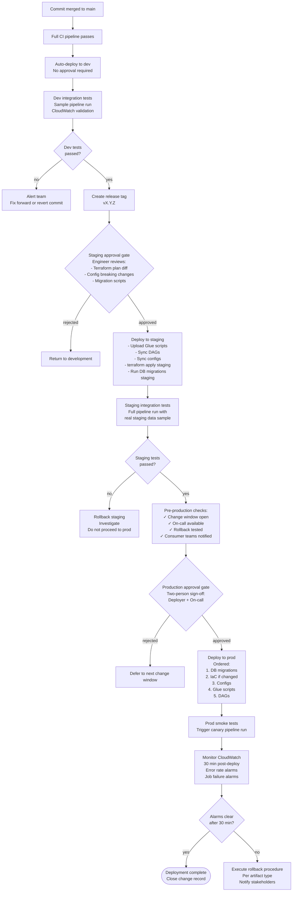

# ODS Platform — Deployment and CI/CD Design

**Date:** 2026-04-15
**Status:** Draft
**Scope:** All deployable artifacts in the ODS ingestion platform — Glue job code, Airflow DAG code, YAML dataset configs, DQ rules, infrastructure (IaC), and database migrations.

---

## Table of Contents

1. [Repository Structure](#1-repository-structure)
2. [Artifact Types and Their Deployment Properties](#2-artifact-types-and-their-deployment-properties)
3. [CI Pipeline Design](#3-ci-pipeline-design)
4. [Environment Promotion](#4-environment-promotion)
5. [Deploying Glue Job Code](#5-deploying-glue-job-code)
6. [Deploying DAG Code](#6-deploying-dag-code)
7. [Deploying YAML Configs](#7-deploying-yaml-configs)
8. [Infrastructure as Code](#8-infrastructure-as-code)
9. [Database Migrations](#9-database-migrations)
10. [Rollback Procedures](#10-rollback-procedures)
11. [Feature Flags for Config Changes](#11-feature-flags-for-config-changes)
12. [Production Deployment Checklist](#12-production-deployment-checklist)

---

## 1. Repository Structure

### 1.1 Monorepo vs Polyrepo

The ODS platform uses a **monorepo**. The primary reasons are:

- **Atomic cross-cutting changes.** A new dataset onboarding touches Glue code, a DAG, a YAML config, a DQ rules file, and optionally a Terraform module — all in a single pull request. A polyrepo forces five coordinated PRs, making review difficult and rollback fragile.
- **Shared CI tooling.** Linting configs, test helpers, schema validation scripts, and the config validation library are maintained once and inherited by all dataset code.
- **Unified change history.** Reviewers can see that a Glue script change and its corresponding config change were intentional. Blame is traceable to a single commit SHA.
- **Consistent promotion path.** A single merge to `main` triggers the full CI/CD pipeline. There is no need to coordinate releases across repositories.
- **Simpler dependency management.** Shared Python utility code (e.g. the common `ods_utils` library used by Glue jobs) lives in the same repository and is imported directly. No private package registry is required.

The only scenario where a polyrepo would be preferred is if different dataset domains have independent security boundaries with separate AWS accounts. In that case, each domain would have its own repository and pipeline, but would still consume shared modules from a central library package. For the current single-account ODS deployment, a monorepo is the correct choice.

### 1.2 Directory Layout

```
ods-platform/
├── .github/
│   └── workflows/
│       ├── ci.yml                          # PR and merge-to-main CI
│       ├── deploy-dev.yml                  # Auto-deploy to dev on merge to main
│       ├── deploy-staging.yml              # Manual approval deploy to staging
│       └── deploy-prod.yml                 # Manual approval deploy to prod
│
├── glue/
│   ├── jobs/
│   │   ├── ingestion/
│   │   │   ├── ods_ingestion_claims/
│   │   │   │   └── job.py                  # ods-ingestion-claims Glue script
│   │   │   ├── ods_ingestion_policies/
│   │   │   │   └── job.py
│   │   │   └── _template/
│   │   │       └── job.py                  # Template for new ingestion datasets
│   │   └── publish/
│   │       ├── ods_s3_publish_claims/
│   │       │   └── job.py                  # ods-s3-publish-claims Glue script
│   │       └── ods_s3_publish_policies/
│   │           └── job.py
│   ├── lib/
│   │   └── ods_utils/                      # Shared Python library imported by Glue jobs
│   │       ├── __init__.py
│   │       ├── config_loader.py
│   │       ├── schema_validator.py
│   │       └── kafka_writer.py
│   └── tests/
│       ├── unit/
│       │   ├── test_ingestion_claims.py
│       │   └── test_s3_publish_claims.py
│       └── component/
│           └── test_ingestion_pipeline.py
│
├── dags/
│   ├── ingestion/
│   │   ├── ods_ingest_claims.py            # DAG: trigger ods-ingestion-claims
│   │   └── ods_ingest_policies.py
│   ├── publish/
│   │   └── ods_publish_claims.py
│   ├── lib/
│   │   └── dag_utils.py                    # Shared DAG utilities
│   └── tests/
│       └── test_dag_imports.py             # Validates all DAGs import without error
│
├── config/
│   ├── dev/
│   │   ├── claims/
│   │   │   └── claims.yaml
│   │   └── policies/
│   │       └── policies.yaml
│   ├── staging/
│   │   ├── claims/
│   │   │   └── claims.yaml
│   │   └── policies/
│   │       └── policies.yaml
│   └── prod/
│       ├── claims/
│       │   └── claims.yaml
│       └── policies/
│           └── policies.yaml
│
├── dq-rules/
│   ├── dev/
│   │   ├── claims.dqdl
│   │   └── policies.dqdl
│   ├── staging/
│   │   ├── claims.dqdl
│   │   └── policies.dqdl
│   └── prod/
│       ├── claims.dqdl
│       └── policies.dqdl
│
├── infra/
│   ├── modules/
│   │   ├── msk-topic/                      # Reusable Terraform module: one MSK topic
│   │   │   ├── main.tf
│   │   │   ├── variables.tf
│   │   │   └── outputs.tf
│   │   ├── glue-job/                       # Reusable Terraform module: one Glue job
│   │   │   ├── main.tf
│   │   │   ├── variables.tf
│   │   │   └── outputs.tf
│   │   ├── s3-bucket/
│   │   │   ├── main.tf
│   │   │   ├── variables.tf
│   │   │   └── outputs.tf
│   │   └── eventbridge-rule/
│   │       ├── main.tf
│   │       ├── variables.tf
│   │       └── outputs.tf
│   ├── environments/
│   │   ├── dev/
│   │   │   ├── main.tf                     # Instantiates platform modules for dev
│   │   │   ├── variables.tf
│   │   │   └── terraform.tfvars
│   │   ├── staging/
│   │   │   ├── main.tf
│   │   │   ├── variables.tf
│   │   │   └── terraform.tfvars
│   │   └── prod/
│   │       ├── main.tf
│   │       ├── variables.tf
│   │       └── terraform.tfvars
│   └── datasets/
│       ├── claims.tf                       # Per-dataset MSK topic, Glue crawler, etc.
│       └── policies.tf
│
├── migrations/
│   ├── V001__create_pipeline_audit_table.sql
│   ├── V001__create_pipeline_audit_table.undo.sql
│   ├── V002__add_schema_version_column.sql
│   └── V002__add_schema_version_column.undo.sql
│
├── scripts/
│   ├── onboard_dataset.sh                  # Dataset onboarding helper script
│   ├── deploy_glue_script.sh               # Upload Glue script to S3 + update job definition
│   ├── deploy_dags.sh                      # Sync DAGs to MWAA S3 bucket
│   ├── deploy_configs.sh                   # Sync configs to ods-config-{env}
│   └── validate_dag.sh                     # Local DAG import validation
│
├── ci/
│   ├── validate_config.py                  # YAML config validation script
│   ├── check_breaking_config_changes.py    # Detects key_fields / schema_id changes
│   └── check_schema_compatibility.py       # Schema Registry compatibility check
│
├── pyproject.toml                          # Python tooling config (ruff, pytest)
├── requirements-dev.txt                    # Dev dependencies (ruff, pytest, moto, etc.)
└── README.md
```

### 1.3 Key Design Decisions in the Layout

- **Config per environment in the repository.** `config/dev/`, `config/staging/`, `config/prod/` exist in the repo and are the authoritative source. The CD pipeline syncs the correct environment directory to `ods-config-{env}`. This gives full diff visibility on config changes across environments and ensures all environments are under source control.
- **DQ rules per environment.** Rule tightening in `prod/` is a separate, deliberate change from `dev/`. This prevents accidental production strictness changes.
- **Glue `lib/` shared code.** Common utilities are imported by all Glue jobs. Changes to shared code trigger CI for all jobs that import it.
- **`ci/` validation scripts.** Validation logic lives in the repository alongside the artifacts it validates, not embedded in the CI YAML. This allows the validation scripts to be run locally by developers before pushing.

---

## 2. Artifact Types and Their Deployment Properties

| Artifact Type | Storage Location | Change Frequency | Blast Radius on Failure | Promotion Path | Rollback Mechanism |
|---|---|---|---|---|---|
| **Glue job code** (PySpark `.py`) | `s3://ods-scripts-{env}/{job-name}/{version}/job.py` | Moderate | High — halts all data for that dataset | dev → staging → prod via CD pipeline with manual approval at staging and prod | Update Glue job definition to point to previous S3 script version; takes effect on next job run |
| **Airflow DAG code** (`.py`) | `s3://ods-dags-{env}/` | Moderate | High — broken DAG import prevents that DAG from loading; MWAA isolates per-DAG failures but a parse error in shared `dag_utils.py` blocks all DAGs | dev → staging → prod via CD pipeline; MWAA polls bucket, picks up within ~30 seconds | Overwrite DAG file in bucket with previous version; MWAA picks up within ~30 seconds |
| **YAML dataset config** | `s3://ods-config-{env}/{domain}/{dataset}.yaml` | Low–Moderate | Low for compatible changes; High if `key_fields` or `schema_id` change | dev → staging → prod via CD pipeline; version ID pinned at pipeline trigger | S3 versioning: restore previous version; in-flight jobs already pinned to their version ID |
| **DQ rules** (`.dqdl`) | `s3://ods-config-{env}/dq-rules/{dataset}.dqdl` | Moderate | Moderate — tightened rule fails previously-passing files; loosened rule may pass bad data | dev → staging → prod via CD pipeline with manual review for rule tightening | Overwrite `.dqdl` file in S3 with previous version |
| **Infrastructure** (Terraform) | Terraform state in S3 + DynamoDB lock | Low | Very High — misconfigured MSK, S3 policy, or IAM role can affect the entire platform | `terraform plan` on PR; `terraform apply` only after human review and approval | `terraform apply` with previous state revision; some resources (e.g. MSK topic deletion) require manual intervention |
| **Database migrations** (`.sql`) | `migrations/` in repo; applied by Flyway | Low | High — schema changes can break running application code if not backward-compatible | Applied as pre-deployment step in CD pipeline; dev before staging before prod | Flyway undo scripts (`V00N__....undo.sql`) run in reverse; tested in dev before prod |

---

## 3. CI Pipeline Design

### 3.1 Trigger Points

| Trigger | What Runs |
|---|---|
| Pull request opened / updated | Lint, unit tests, config validation, schema compatibility check, Terraform plan |
| Merge to `main` | Full CI + integration tests against dev environment + auto-deploy to dev |
| Release tag `v*` | Full CI + deployment to staging (pending approval) + deployment to prod (pending approval) |

### 3.2 Change Detection

The CI pipeline uses path-based change detection to avoid running every check on every PR. GitHub Actions `paths` filters (or equivalent) scope each job to the relevant artifact directories:

- Changes under `glue/` → Glue lint + unit tests
- Changes under `dags/` → DAG lint + DAG import validation
- Changes under `config/` → YAML config validation + breaking-change check
- Changes under `dq-rules/` → DQ rules lint
- Changes under `infra/` → Terraform validate + plan
- Changes under `migrations/` → Migration file format validation
- Changes to `glue/lib/` → trigger Glue tests for all jobs (not just changed files)

### 3.3 Full CI Pipeline Diagram

```mermaid
flowchart TD
    PR[Pull Request Opened / Updated] --> detect[Detect changed paths]

    detect --> glue_changed{Glue code\nchanged?}
    detect --> dag_changed{DAG code\nchanged?}
    detect --> config_changed{Config / DQ\nchanged?}
    detect --> infra_changed{Infra\nchanged?}
    detect --> migration_changed{Migrations\nchanged?}

    %% ── Glue path ──────────────────────────────────────────
    glue_changed -->|yes| glue_lint[Lint: ruff check glue/]
    glue_lint --> glue_unit[Unit tests: pytest glue/tests/unit]
    glue_unit --> glue_component[Component tests: pytest glue/tests/component]
    glue_component --> glue_ok([Glue checks passed])

    %% ── DAG path ───────────────────────────────────────────
    dag_changed -->|yes| dag_lint[Lint: ruff check dags/]
    dag_lint --> dag_import[DAG import validation:\npython -c import dag_file\nfor each .py in dags/]
    dag_import --> dag_unit[Unit tests: pytest dags/tests/]
    dag_unit --> dag_ok([DAG checks passed])

    %% ── Config / DQ path ───────────────────────────────────
    config_changed -->|yes| config_schema[YAML schema validation:\nci/validate_config.py\nrequired fields, valid values]
    config_schema --> config_breaking[Breaking change check:\nci/check_breaking_config_changes.py\nkey_fields, schema_id changed?]
    config_breaking --> schema_compat[Schema compatibility:\nci/check_schema_compatibility.py\nschema_id exists in registry?]
    schema_compat --> dq_lint[DQ rules lint:\nvalidate .dqdl syntax]
    dq_lint --> config_ok([Config/DQ checks passed])

    config_breaking -->|breaking change detected| config_block[FAIL: requires schema\ngovernance review\nand explicit approval]

    %% ── IaC path ───────────────────────────────────────────
    infra_changed -->|yes| tf_fmt[terraform fmt -check]
    tf_fmt --> tf_validate[terraform validate]
    tf_validate --> tf_plan[terraform plan\nagainst dev state\nplan output posted to PR]
    tf_plan --> infra_ok([IaC checks passed])

    %% ── Migration path ─────────────────────────────────────
    migration_changed -->|yes| migrate_format[Validate file naming:\nV{version}__description.sql\nundo script present?]
    migrate_format --> migrate_syntax[SQL syntax check]
    migrate_syntax --> migrate_ok([Migration checks passed])

    %% ── Merge to main ──────────────────────────────────────
    glue_ok --> all_checks_pass
    dag_ok --> all_checks_pass
    config_ok --> all_checks_pass
    infra_ok --> all_checks_pass
    migrate_ok --> all_checks_pass

    all_checks_pass([All checks passed]) --> merge{Merged to main?}

    merge -->|yes| integration[Integration tests\nagainst dev environment]
    integration --> deploy_dev[Auto-deploy to dev:\n- Upload Glue scripts\n- Sync DAGs\n- Sync configs\n- terraform apply dev\n- Run DB migrations dev]
    deploy_dev --> dev_smoke[Dev smoke tests:\n- Trigger sample pipeline run\n- Verify CloudWatch metrics]

    dev_smoke --> release_tag{Release tag\nv* created?}

    release_tag -->|yes| staging_gate[Manual approval gate:\nStaging deployment]
    staging_gate --> deploy_staging[Deploy to staging]
    deploy_staging --> staging_integration[Staging integration tests]

    staging_integration --> prod_gate[Manual approval gate:\nProd deployment\nChange window check\nOn-call available?]
    prod_gate --> deploy_prod[Deploy to prod]
    deploy_prod --> prod_monitor[Monitor CloudWatch\n30 min post-deploy]
```

### 3.4 DAG Import Validation Step (Detail)

The DAG import validation step deserves emphasis because the blast radius of a broken DAG file is high. The CI job runs the following for every `.py` file in `dags/`:

```bash
# ci/validate_dag_imports.sh
set -e
for dag_file in $(find dags/ -name "*.py" ! -path "*/tests/*" ! -path "*/lib/*"); do
    echo "Validating: $dag_file"
    python -c "
import importlib.util, sys
spec = importlib.util.spec_from_file_location('dag', '$dag_file')
mod = importlib.util.module_from_spec(spec)
spec.loader.exec_module(mod)
print('  OK')
"
done
```

This catches `SyntaxError`, missing imports, and any top-level exception that would prevent MWAA from loading the DAG. It runs in the same Python environment that MWAA uses (matched by pinning the Python version in the CI image to match the MWAA environment version).

### 3.5 Config Validation Script (Detail)

`ci/validate_config.py` checks each YAML file against a JSON Schema that enforces:

- Required fields: `dataset_name`, `domain`, `source_bucket`, `key_fields`, `schema_id`, `partition_keys`, `dq_rules_path`
- `schema_id` format: `{registry-name}/{schema-name}/{version}`
- `key_fields` is a non-empty list of strings
- `partition_keys` is a list of strings (may be empty)
- `environment` field matches the directory it lives in (`config/prod/` must have `environment: prod`)

`ci/check_breaking_config_changes.py` compares the changed YAML file against the previously committed version and fails the CI job if any of the following fields changed:

- `key_fields` — changing deduplication logic is a breaking change for downstream consumers
- `schema_id` — changing the schema version must go through schema governance review
- `source_bucket` — changing the data source is a pipeline-wide change

---

## 4. Environment Promotion

### 4.1 Promotion Policy

| Environment | Trigger | Approval | Pre-conditions |
|---|---|---|---|
| **dev** | Automatic on merge to `main` | None | All CI checks pass |
| **staging** | Manual trigger on release tag | Single engineer approval in GitHub Environments | Integration tests passing in dev; no open P1 incidents |
| **prod** | Manual trigger after staging passes | Two-person approval in GitHub Environments (deployer + on-call) | Integration tests passing in staging; change window open; on-call available; rollback procedure documented |

### 4.2 Promotion Flow Diagram



### 4.3 Deployment Order Within an Environment

When multiple artifact types are deployed in the same release, the order matters:

1. **Database migrations** — must be applied first; schema must be ready before application code starts using new columns
2. **Infrastructure changes** (Terraform) — new MSK topics, S3 buckets, IAM roles must exist before jobs reference them
3. **YAML configs and DQ rules** — updated config must be present before Glue jobs are triggered
4. **Glue job scripts** — uploaded to S3 and Glue job definitions updated; in-flight jobs are unaffected
5. **DAG code** — deployed last; MWAA picks up within ~30 seconds; if a DAG triggers a Glue job the Glue job is already updated

---

## 5. Deploying Glue Job Code

### 5.1 How Glue Loads Scripts

AWS Glue loads the script referenced in the job definition at the moment a job run starts. Once a run is in progress, the script is fixed for the duration of that run. This means:

- Updating the S3 object (overwriting the script) does not affect runs already in progress.
- Updating the Glue job definition to point to a new S3 key or version does not affect runs already in progress.
- The new script is used only when the next run starts after the job definition update.

This provides **zero-downtime deployment by default**.

### 5.2 Deployment Steps

```bash
# scripts/deploy_glue_script.sh
# Usage: ./deploy_glue_script.sh <job-name> <env>
# Example: ./deploy_glue_script.sh ods-ingestion-claims dev

JOB_NAME=$1
ENV=$2
SCRIPT_DIR="glue/jobs/ingestion/${JOB_NAME//-/_}"
BUCKET="ods-scripts-${ENV}"
TIMESTAMP=$(date +%Y%m%dT%H%M%S)
S3_KEY="${JOB_NAME}/${TIMESTAMP}/job.py"

echo "Uploading script to s3://${BUCKET}/${S3_KEY}"
aws s3 cp "${SCRIPT_DIR}/job.py" "s3://${BUCKET}/${S3_KEY}"

# Capture the S3 version ID for audit log
VERSION_ID=$(aws s3api head-object \
  --bucket "${BUCKET}" \
  --key "${S3_KEY}" \
  --query 'VersionId' \
  --output text)

echo "Script uploaded. S3 version ID: ${VERSION_ID}"

echo "Updating Glue job definition: ${JOB_NAME}"
aws glue update-job \
  --job-name "${JOB_NAME}" \
  --job-update "Command={Name=glueetl,ScriptLocation=s3://${BUCKET}/${S3_KEY},PythonVersion=3}"

echo "Glue job updated. New runs will use s3://${BUCKET}/${S3_KEY}"
echo "DEPLOY_ARTIFACT_VERSION=${VERSION_ID}" >> "$GITHUB_ENV"  # Exported for rollback reference
```

### 5.3 Handling In-Flight Jobs

- Before deploying a script update, check for running job executions:
  ```bash
  aws glue get-job-runs --job-name "${JOB_NAME}" \
    --query 'JobRuns[?JobRunState==`RUNNING`].[Id,StartedOn]' \
    --output table
  ```
- In-flight runs complete using the script they started with.
- If a dataset's schedule is high-frequency (e.g. every 5 minutes), the window between deploying the new script and the next run using it is at most one full schedule interval.
- The old script S3 object must be retained until all running jobs using it complete. The `ods-scripts-{env}` bucket has S3 versioning enabled, and a lifecycle rule retains previous versions for 30 days. Do not manually delete previous script versions.

### 5.4 Shared Library Changes

Changes to `glue/lib/ods_utils/` affect all Glue jobs. The deployment pipeline deploys all Glue job scripts when any shared library file changes, not just the job whose directory changed. The CI job detects shared library changes using:

```bash
git diff --name-only HEAD~1 HEAD | grep -q "^glue/lib/" && DEPLOY_ALL_GLUE=true
```

---

## 6. Deploying DAG Code

### 6.1 MWAA DAG Loading Behaviour

MWAA polls the DAG S3 bucket on a schedule (typically every 30 seconds for the DAG processor). Any `.py` file written to the bucket is discovered and loaded automatically. There is no manual MWAA restart step required.

Failure mode: if a `.py` file has a syntax error or a top-level import exception, that DAG file fails to parse. MWAA marks the DAG as `Import Error` and surfaces the error in the MWAA web UI. **Other DAGs in the bucket continue to load normally** — MWAA isolates parse failures per file. The exception is `dags/lib/dag_utils.py` (or any shared utility imported by multiple DAGs): a broken shared import can cause all DAGs that import it to fail simultaneously.

### 6.2 Pre-Deployment Validation

CI runs the DAG import validation script (see Section 3.4) against all DAG files. Additionally, a static import graph is checked to identify which DAGs would be affected if a shared utility file is changed.

### 6.3 Deployment Steps

```bash
# scripts/deploy_dags.sh
# Usage: ./deploy_dags.sh <env>

ENV=$1
BUCKET="ods-dags-${ENV}"

echo "Syncing DAGs to s3://${BUCKET}/"
aws s3 sync dags/ "s3://${BUCKET}/" \
  --exclude "*/tests/*" \
  --exclude "__pycache__/*" \
  --exclude "*.pyc" \
  --delete

echo "DAG sync complete. MWAA will pick up changes within ~30 seconds."
echo "Monitor for import errors:"
echo "  aws mwaa list-environments (find the environment name)"
echo "  Check MWAA web UI -> DAGs -> filter by Import Error"
```

### 6.4 Post-Deployment Verification

After syncing DAGs, the CI pipeline waits 60 seconds and then polls the MWAA API for import errors:

```bash
# Wait for MWAA to pick up changes
sleep 60

# Check for import errors in changed DAGs
MWAA_ENV="ods-mwaa-${ENV}"
IMPORT_ERRORS=$(aws mwaa get-environment \
  --name "${MWAA_ENV}" \
  --query 'Environment.LastDagProcessorActivity' \
  --output json)

echo "MWAA last DAG processor activity: ${IMPORT_ERRORS}"
# A more complete check would query the MWAA REST API for DAG import errors
```

### 6.5 Shared DAG Utility Changes

Changes to `dags/lib/dag_utils.py` are treated as high-risk. The CI job enforces that any change to shared DAG utilities must:

1. Pass import validation for all DAGs in the repository (not just changed files)
2. Have an explicit review comment from a second engineer on the PR
3. Be deployed to staging with a 5-minute observation window before proceeding

---

## 7. Deploying YAML Configs

### 7.1 Version Pinning Behaviour

The ODS pipeline architecture pins the S3 version ID of the config file at the moment a pipeline run is triggered. This means:

- A config deployed at 14:00 does not affect a pipeline run triggered at 13:55 — that run reads the version that existed at trigger time.
- A config deployed at 14:00 is used by pipeline runs triggered at 14:01 onwards.
- In-flight jobs always complete using the config version they started with, regardless of subsequent deployments.

This design makes config deployments safe to perform at any time. There is no need for maintenance windows to deploy a YAML config change, unless the change modifies `key_fields` or `schema_id`.

### 7.2 Deployment Steps

```bash
# scripts/deploy_configs.sh
# Usage: ./deploy_configs.sh <env>

ENV=$1
BUCKET="ods-config-${ENV}"

echo "Syncing configs to s3://${BUCKET}/"
aws s3 sync "config/${ENV}/" "s3://${BUCKET}/" \
  --exclude "*.swp"

echo "Syncing DQ rules to s3://${BUCKET}/dq-rules/"
aws s3 sync "dq-rules/${ENV}/" "s3://${BUCKET}/dq-rules/"

echo "Config sync complete."

# Log version IDs for audit trail
for config_file in config/${ENV}/**/*.yaml; do
  dataset=$(basename "$config_file" .yaml)
  domain=$(basename $(dirname "$config_file"))
  VERSION_ID=$(aws s3api head-object \
    --bucket "${BUCKET}" \
    --key "${domain}/${dataset}.yaml" \
    --query 'VersionId' \
    --output text)
  echo "Config version: ${domain}/${dataset}.yaml = ${VERSION_ID}"
done
```

### 7.3 Breaking Change Governance

The following config field changes are classified as breaking and require a schema governance review before the PR can be merged:

| Field Changed | Risk | Required Action |
|---|---|---|
| `schema_id` | New schema version may be incompatible with downstream consumers | Schema Registry compatibility check; consumer team notification; approval from data governance |
| `key_fields` | Changed deduplication logic produces different output records | Impact analysis; downstream consumer notification; staged rollout via feature flag config (Section 11) |
| `source_bucket` | Pipeline now reads from a different S3 location | Source data validation; confirm new source has same format |
| `partition_keys` | Changes how data is laid out in the output S3 prefix | Downstream query pattern impact; potential backfill required |

The `ci/check_breaking_config_changes.py` script compares the PR's config changes against the base branch and fails CI if any of these fields are modified without an explicit override label (`breaking-change-approved`) on the PR.

### 7.4 Schema ID Compatibility Check

Before merging a PR that changes `schema_id`:

1. `ci/check_schema_compatibility.py` verifies the new `schema_id` exists in the Glue Schema Registry.
2. It checks the compatibility mode configured for that schema (BACKWARD, FORWARD, FULL, or NONE).
3. If compatibility mode is BACKWARD, it verifies the new schema version can read data written with the previous version.
4. The script fails CI if the new schema is not compatible under the registry's configured mode.

Note: Glue Schema Registry schema versions cannot be deleted once created. A schema version published to the registry is permanent. CI must prevent accidental schema publication by running the compatibility check before any deployment that changes `schema_id`.

---

## 8. Infrastructure as Code

### 8.1 Tool Selection: Terraform vs AWS CDK

Both Terraform and AWS CDK are viable. The trade-offs for this platform are:

**Terraform**
- HCL is readable by engineers who are not Python developers.
- Mature state management, plan/apply workflow is well-understood.
- Large ecosystem of AWS provider modules.
- Drift detection is explicit (`terraform plan` shows drift).
- No runtime dependency on a CDK toolkit version.
- Recommended for this platform.

**AWS CDK**
- Infrastructure defined in Python, matching the language of Glue and DAG code.
- Easier to write reusable constructs that encapsulate multi-resource patterns.
- CDK diffs are less readable than Terraform plans for non-CDK engineers.
- CDK toolkit version must be kept in sync across developer machines and CI.

**Recommendation: Terraform.** The ODS platform team is composed primarily of data engineers, not application developers. Terraform's explicit plan/apply model and readable HCL lowers the barrier to reviewing infrastructure changes in code review. The per-dataset resource pattern (MSK topic, Glue crawler, EventBridge rule) is well-suited to Terraform modules instantiated per dataset.

### 8.2 What Is Managed in IaC vs Managed via Onboarding Script

| Resource | Managed By | Rationale |
|---|---|---|
| MSK cluster | IaC (Terraform) | Platform-level resource; created once; changes are rare and high-risk |
| S3 buckets (`ods-scripts-*`, `ods-dags-*`, `ods-config-*`) | IaC (Terraform) | Platform-level; bucket policies and versioning config must be auditable |
| MWAA environment | IaC (Terraform) | Rare changes; environment config (instance size, plugin version) must be version-controlled |
| IAM roles and policies | IaC (Terraform) | Security-sensitive; must be reviewed in PRs |
| CloudWatch alarms (platform-level) | IaC (Terraform) | Alarm definitions should be consistent across environments |
| EventBridge rules (per dataset) | IaC (Terraform) — per-dataset module | Dataset onboarding creates the EventBridge rule via Terraform; reviewed in PR |
| MSK topic (per dataset) | IaC (Terraform) — per-dataset module | Topic configuration (partitions, retention) must be version-controlled; see below |
| Glue crawler (per dataset) | IaC (Terraform) — per-dataset module | Crawler schedule and target S3 path are config; IaC is the right home |
| Glue job definition (per dataset) | IaC (Terraform) — per-dataset module | Job definition properties (workers, timeout, IAM role) are IaC; script path is updated by CD |
| CloudWatch alarms (per dataset) | IaC (Terraform) — per-dataset module | Dataset-level alarms generated from the module |
| RDS instance | IaC (Terraform) | Platform-level; parameter groups, storage, backup retention must be auditable |
| RDS parameter groups | IaC (Terraform) | Changes to parameter groups can affect database behaviour |

### 8.3 Per-Dataset Resources: IaC Module

Per-dataset resources (MSK topic, Glue crawler, Glue job definitions, EventBridge rule) are managed through a Terraform module. Adding a new dataset means instantiating the module in `infra/datasets/{dataset}.tf`:

```hcl
# infra/datasets/claims.tf

module "claims_msk_topic" {
  source      = "../modules/msk-topic"
  topic_name  = "ods-ingestion-claims-${var.env}"
  partitions  = 6
  replication = 3
  retention_ms = 604800000  # 7 days
  msk_cluster_arn = var.msk_cluster_arn
}

module "claims_ingestion_glue_job" {
  source       = "../modules/glue-job"
  job_name     = "ods-ingestion-claims-${var.env}"
  script_bucket = "ods-scripts-${var.env}"
  # Script key is managed by the CD pipeline, not Terraform
  # Terraform manages job properties (workers, IAM, timeout); CD manages script path
  role_arn     = aws_iam_role.glue_job_role.arn
  worker_type  = "G.1X"
  num_workers  = 2
  timeout      = 60
  env          = var.env
}

module "claims_eventbridge_rule" {
  source         = "../modules/eventbridge-rule"
  rule_name      = "ods-s3-trigger-claims-${var.env}"
  source_bucket  = "raw-data-${var.env}"
  prefix         = "claims/"
  target_dag     = "ods_ingest_claims"
  mwaa_env_name  = "ods-mwaa-${var.env}"
}

module "claims_glue_crawler" {
  source       = "../modules/glue-crawler"
  crawler_name = "ods-crawler-claims-${var.env}"
  s3_target    = "s3://ods-published-${var.env}/claims/"
  database     = "ods_published_${var.env}"
  role_arn     = aws_iam_role.glue_crawler_role.arn
  schedule     = "cron(0 6 * * ? *)"
}
```

The Glue job definition in Terraform manages job properties (IAM role, worker count, timeout, Glue version). The script S3 path (`--script-location`) is updated separately by the CD pipeline's deploy step (Section 5.2). Terraform does not own the script path to avoid conflicts between IaC applies and CD script deployments.

### 8.4 MSK Topic: IaC or Onboarding Script?

**Decision: IaC (Terraform module), not an onboarding script.**

Rationale:
- Topic configuration (partition count, retention, replication factor) must be version-controlled and auditable.
- Partition count cannot be decreased after creation — this constraint must be reviewed in a PR, not hidden in a script run by one engineer.
- Topic existence must be confirmed before Glue jobs or DAGs referencing it are deployed — Terraform dependency ordering enforces this.
- An onboarding script creates a resource that Terraform does not know about, leading to drift. If an engineer later runs `terraform apply`, Terraform may attempt to create or modify the topic unexpectedly.

The onboarding experience uses `scripts/onboard_dataset.sh` to scaffold the Terraform file and config templates, but the actual resource creation happens via the normal CI/CD pipeline after a PR review.

---

## 9. Database Migrations

### 9.1 Tool Selection: Flyway

**Recommended tool: Flyway** (open-source, available as a CLI and Maven/Gradle plugin).

Reasons:
- Versioned migrations are identified by a version number prefix (`V001`, `V002`, etc.), making the execution order unambiguous.
- Flyway maintains a `flyway_schema_history` table in the target database, providing an audit trail of what ran and when.
- Undo migrations (rollback scripts) are supported in the Flyway Teams edition and can be approximated in the open-source edition by writing separate `V00N_undo.sql` scripts.
- The CLI can be invoked from bash in the CD pipeline without a JVM process in the running application.

### 9.2 Migration File Naming Convention

```
migrations/
├── V001__create_pipeline_audit_table.sql
├── V001__create_pipeline_audit_table.undo.sql
├── V002__add_schema_version_column.sql
├── V002__add_schema_version_column.undo.sql
└── V003__add_dq_result_summary_table.sql
    V003__add_dq_result_summary_table.undo.sql
```

**Convention:**
- `V{version}__{description}.sql` — double underscore separating version from description
- Version is zero-padded to three digits: `V001`, `V002`, ... `V099`, `V100`
- Description uses underscores, not hyphens; is lowercase; describes what the migration does
- Every forward migration file must have a corresponding `.undo.sql` file in the same PR — CI fails if a forward migration is added without its undo script

### 9.3 Sample Migration

**Forward: `V003__add_dq_result_summary_table.sql`**
```sql
-- V003__add_dq_result_summary_table.sql
-- Add table to store per-file DQ result summaries
-- Backward-compatible: new table, no changes to existing tables

CREATE TABLE IF NOT EXISTS ods_pipeline_audit.dq_result_summary (
    id              SERIAL PRIMARY KEY,
    pipeline_run_id VARCHAR(64)  NOT NULL,
    dataset_name    VARCHAR(128) NOT NULL,
    source_key      TEXT         NOT NULL,
    evaluated_at    TIMESTAMPTZ  NOT NULL DEFAULT NOW(),
    rules_passed    INTEGER      NOT NULL DEFAULT 0,
    rules_failed    INTEGER      NOT NULL DEFAULT 0,
    outcome         VARCHAR(16)  NOT NULL CHECK (outcome IN ('PASS', 'FAIL', 'WARN')),
    details_json    JSONB
);

CREATE INDEX idx_dq_result_summary_dataset
    ON ods_pipeline_audit.dq_result_summary (dataset_name, evaluated_at DESC);

CREATE INDEX idx_dq_result_summary_run
    ON ods_pipeline_audit.dq_result_summary (pipeline_run_id);

COMMENT ON TABLE ods_pipeline_audit.dq_result_summary
    IS 'Per-file DQ evaluation summary. Written by the DQ Glue job step.';
```

**Undo: `V003__add_dq_result_summary_table.undo.sql`**
```sql
-- V003__add_dq_result_summary_table.undo.sql
-- Undo: drop the dq_result_summary table added in V003

DROP TABLE IF EXISTS ods_pipeline_audit.dq_result_summary;
```

### 9.4 Backward Compatibility Rules

All migrations must comply with the following rules during the deployment window (old application code + new schema must work simultaneously):

| Operation | Allowed? | Safe Alternative |
|---|---|---|
| Add new table | Yes | — |
| Add new nullable column with DEFAULT | Yes | — |
| Add new NOT NULL column with DEFAULT | Yes | — |
| Drop column | **No** | Rename to `_deprecated_col`; remove in a later migration after all code references removed |
| Rename column | **No** | Add new column, backfill, migrate code, then deprecate old column |
| Change column type (widening, e.g. INT→BIGINT) | Conditional | Test that old code still works with new type |
| Change column type (narrowing) | **No** | Never; would break existing writes |
| Drop table | **No** | Rename to `_deprecated_table`; archive data; remove in a later migration |
| Add NOT NULL constraint to existing column | **No** (if column may be empty) | Add DEFAULT first in one migration; add constraint in a later migration after backfill |
| Add index | Yes (use `CONCURRENTLY`) | `CREATE INDEX CONCURRENTLY` — does not lock the table |

### 9.5 Migration in the CD Pipeline

Migrations are run as the first step in the deployment pipeline for each environment (before IaC changes, before code deployments):

```bash
# Run Flyway migrations for target environment
flyway \
  -url="jdbc:postgresql://${DB_HOST}:5432/${DB_NAME}" \
  -user="${DB_USER}" \
  -password="${DB_PASSWORD}" \
  -locations="filesystem:migrations/" \
  -schemas="ods_pipeline_audit" \
  migrate

echo "Flyway migration complete. Checking schema history:"
flyway info
```

The pipeline fails and halts if any migration fails. No further deployment steps (IaC, code, config) run until the migration is confirmed successful.

---

## 10. Rollback Procedures

### 10.1 Glue Job Code Rollback

**Mechanism:** Update the Glue job definition to point to the previous script S3 key.

**Steps:**
1. Identify the previous script version from the CI/CD deploy log (the `DEPLOY_ARTIFACT_VERSION` environment variable exported by `deploy_glue_script.sh`).
2. Update the job definition:
   ```bash
   PREVIOUS_S3_KEY="ods-ingestion-claims/20260414T120000/job.py"
   aws glue update-job \
     --job-name "ods-ingestion-claims-prod" \
     --job-update "Command={Name=glueetl,ScriptLocation=s3://ods-scripts-prod/${PREVIOUS_S3_KEY},PythonVersion=3}"
   ```
3. Verify the next scheduled run uses the previous script.
4. Check CloudWatch logs for the next job run to confirm the rollback is effective.

**Time to effect:** Immediate for the next job run. In-flight runs are unaffected.

**Retention:** Previous script versions are retained for 30 days by the S3 lifecycle policy on `ods-scripts-{env}`. Rollback is always available within that window.

### 10.2 DAG Code Rollback

**Mechanism:** Overwrite the DAG file in the MWAA S3 bucket with the previous version. MWAA picks up the change within ~30 seconds.

**Steps:**
1. Identify the previous DAG version. Because the MWAA DAG bucket has S3 versioning enabled, use `aws s3api list-object-versions` to find the previous version ID.
2. Restore the previous version:
   ```bash
   DAG_FILE="ods_ingest_claims.py"
   BUCKET="ods-dags-prod"

   # List versions to find the previous one
   aws s3api list-object-versions \
     --bucket "${BUCKET}" \
     --prefix "ingestion/${DAG_FILE}" \
     --query 'Versions[*].[VersionId,LastModified,IsLatest]' \
     --output table

   # Copy previous version back as the current version
   aws s3api copy-object \
     --bucket "${BUCKET}" \
     --copy-source "${BUCKET}/ingestion/${DAG_FILE}?versionId=${PREVIOUS_VERSION_ID}" \
     --key "ingestion/${DAG_FILE}"
   ```
3. Wait ~30–60 seconds for MWAA to reload the DAG.
4. Verify the DAG appears without import errors in the MWAA web UI.

**Time to effect:** ~30–60 seconds.

### 10.3 YAML Config Rollback

**Mechanism:** S3 versioning is enabled on `ods-config-{env}`. Restore the previous version of the config file. In-flight jobs are unaffected (they pinned their version ID at trigger time).

**Steps:**
1. Find the previous config version:
   ```bash
   aws s3api list-object-versions \
     --bucket "ods-config-prod" \
     --prefix "claims/claims.yaml" \
     --query 'Versions[*].[VersionId,LastModified,IsLatest]' \
     --output table
   ```
2. Restore:
   ```bash
   aws s3api copy-object \
     --bucket "ods-config-prod" \
     --copy-source "ods-config-prod/claims/claims.yaml?versionId=${PREVIOUS_VERSION_ID}" \
     --key "claims/claims.yaml"
   ```
3. Future pipeline triggers will use the restored config version.

**Time to effect:** Immediate. New pipeline triggers read the restored version.

### 10.4 DQ Rules Rollback

Same mechanism as YAML config rollback (Section 10.3). `ods-config-{env}` has S3 versioning enabled, covering both config YAML files and `.dqdl` files stored under `dq-rules/`.

### 10.5 Infrastructure (Terraform) Rollback

**Mechanism:** `terraform apply` using a previous version of the Terraform code from git.

**Steps:**
1. Identify the git commit SHA of the last known-good infrastructure state.
2. Check out that commit or revert the offending commit on a branch:
   ```bash
   git revert <commit-sha> --no-commit
   git commit -m "revert: rollback infra change <commit-sha>"
   ```
3. Run through the normal CI pipeline — `terraform plan` shows the revert delta.
4. Obtain approval and apply.

**Complications:**
- Some resources cannot be easily reverted via Terraform (e.g. MSK topic deletion — you cannot re-create an MSK topic with the same name if there is an offset lag). Manual steps may be required.
- If a `terraform apply` partially succeeded before failing, the state may be inconsistent. Check `terraform state list` and the AWS console to reconcile.
- IAM role changes: if permissions were narrowed in error, widening them again is safe and takes effect immediately.

**Time to effect:** Minutes (Terraform apply time) to hours (for resources requiring replacement).

### 10.6 Database Migration Rollback

**Mechanism:** Run the undo script for the offending migration version.

**Steps:**
1. Identify the migration version to undo.
2. Run the undo script manually (or via a Flyway undo command if using Flyway Teams):
   ```bash
   # Manual undo (open-source Flyway)
   psql "${DB_URL}" -f migrations/V003__add_dq_result_summary_table.undo.sql

   # Or with Flyway Teams undo command:
   flyway -url="${DB_URL}" -user="${DB_USER}" -password="${DB_PASSWORD}" \
     -target=002 undo
   ```
3. Verify the undo script ran without errors.
4. Confirm the application code running against the rolled-back schema works correctly.

**Prerequisite:** Every forward migration must have a tested undo script. CI fails if a PR adds a forward migration without a corresponding undo file. Undo scripts must be tested in dev before staging, and in staging before being trusted for production use.

---

## 11. Feature Flags for Config Changes

### 11.1 Motivation

For high-risk config changes — new `schema_id`, changed `key_fields`, or new DQ rules that are stricter than current production rules — a direct deployment to the active config path is risky. If the new config causes pipeline failures, all incoming data for that dataset is affected until a rollback is performed.

The recommended pattern uses a **shadow config key** to test the new configuration on real pipeline runs before promoting it to the active path.

### 11.2 Shadow Config Deployment Pattern

For a dataset `claims` with an active config at `s3://ods-config-prod/claims/claims.yaml`:

**Step 1: Deploy a shadow config**

Write the new config to a separate key:
```
s3://ods-config-prod/claims/claims-v2-candidate.yaml
```

This file is not yet used by any pipeline run.

**Step 2: Run shadow pipelines**

Create a separate DAG (or a DAG parameter) that reads from the candidate config key instead of the standard path. Trigger this shadow DAG with a representative sample of recent input data in staging.

**Step 3: Validate shadow results**

Compare the output of the shadow pipeline run (using `claims-v2-candidate.yaml`) against the output of the current pipeline run (using `claims.yaml`). Check:
- Row counts are within expected variance
- Key field values are consistent with the new deduplication logic
- DQ pass rates meet the new rule thresholds
- Schema of output records matches the new `schema_id`

**Step 4: Promote on success**

If the shadow run passes validation, promote the candidate config by overwriting the active key:
```bash
aws s3 cp \
  "s3://ods-config-prod/claims/claims-v2-candidate.yaml" \
  "s3://ods-config-prod/claims/claims.yaml"
```

The next pipeline trigger uses the promoted config. The previous version is retained by S3 versioning.

**Step 5: Clean up**

Delete the candidate key after a confirmation period:
```bash
aws s3 rm "s3://ods-config-prod/claims/claims-v2-candidate.yaml"
```

### 11.3 DQ Rule Staging Pattern

For tightened DQ rules, use a two-phase approach:

1. **Warn phase:** Deploy the new DQ rules in `WARN` mode (where supported by AWS Glue Data Quality). Pipeline runs succeed but emit warnings for records that would fail under the new rules. Monitor warning rates over several days.
2. **Enforce phase:** Once the warning rate is understood and accepted, switch the DQ action from `WARN` to `FAIL`. Deploy the updated `.dqdl` file with the enforcement flag.

This prevents a sudden pipeline failure when the rule is first tightened.

---

## 12. Production Deployment Checklist

Use this checklist for every production deployment. Check off each item before starting the deployment and during the post-deployment observation window.

### Pre-Deployment

- [ ] All CI checks have passed on the release tag
- [ ] Integration tests have passed in the staging environment (not just dev)
- [ ] Terraform plan has been reviewed by a second engineer if IaC is included in this release
- [ ] Breaking config changes (if any) have been through schema governance review and approved
- [ ] Consumer teams have been notified if this release includes a `schema_id` change or `key_fields` change
- [ ] Database migration undo scripts have been tested in staging
- [ ] The rollback procedure for each artifact type in this release has been documented in the change record
- [ ] On-call engineer is available and aware of the deployment
- [ ] The deployment falls within the approved change window (default: Tuesday–Thursday, 10:00–16:00 local time, excluding month-end periods)
- [ ] No active P1 or P2 incidents on the ODS platform
- [ ] The previous artifact versions (Glue script S3 key, DAG S3 version ID, config S3 version ID) are recorded in the change record for rollback reference

### During Deployment

- [ ] DB migrations applied successfully (check Flyway `flyway info` output)
- [ ] IaC `terraform apply` completed without errors (if applicable)
- [ ] Glue script(s) uploaded to `ods-scripts-prod` and job definition(s) updated
- [ ] DAG file(s) synced to `ods-dags-prod`; no import errors visible in MWAA UI after 60 seconds
- [ ] Config file(s) and DQ rules synced to `ods-config-prod`
- [ ] Canary pipeline run triggered manually and completed successfully

### Post-Deployment (30-Minute Observation Window)

- [ ] CloudWatch dashboard for affected dataset(s) shows normal job success rates
- [ ] No new `JobFailed` or `JobTimeout` CloudWatch alarms firing
- [ ] No spike in DQ failure rate for affected datasets
- [ ] MWAA shows no new DAG import errors
- [ ] RDS query performance metrics normal (if DB migration included)
- [ ] Kafka consumer lag for affected MSK topics is within normal range
- [ ] If any alarm fires during the observation window: execute rollback procedure immediately; do not wait for the window to expire

### Post-Deployment Sign-Off

- [ ] Deploying engineer signs off in the change record
- [ ] On-call engineer signs off in the change record
- [ ] Change record closed
- [ ] Next business day: confirm overnight pipeline runs completed successfully
