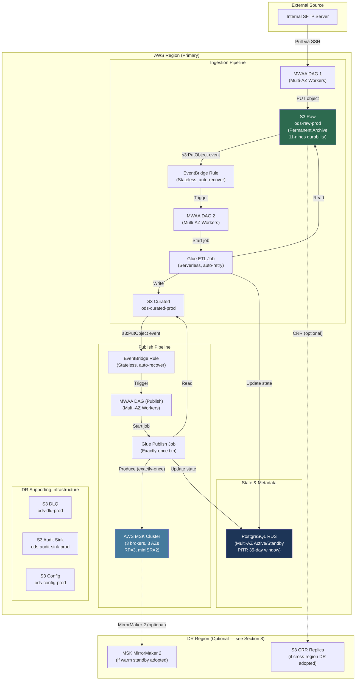
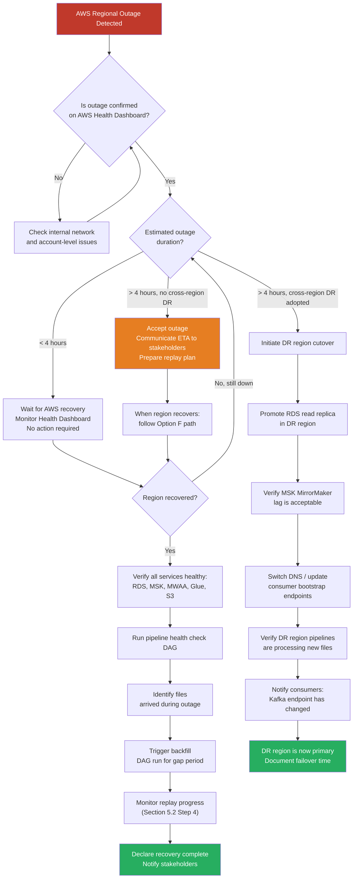

# ODS Platform — Disaster Recovery and Business Continuity Plan

**Date:** 2026-04-15
**Version:** 1.0 — DRAFT FOR REVIEW
**Owner:** ODS Platform Engineering
**Status:** Requires business sign-off on RTO/RPO targets and cross-region decision (see Section 10)

---

## Table of Contents

1. [Purpose and Scope](#1-purpose-and-scope)
2. [RTO and RPO Targets](#2-rto-and-rpo-targets)
3. [Failure Scenario Catalogue](#3-failure-scenario-catalogue)
4. [Component Resilience Configuration](#4-component-resilience-configuration)
5. [Data Recovery from S3 Raw](#5-data-recovery-from-s3-raw)
6. [PostgreSQL Backup and Recovery](#6-postgresql-backup-and-recovery)
7. [MSK Topic Recovery](#7-msk-topic-recovery)
8. [Cross-Region DR Consideration](#8-cross-region-dr-consideration)
9. [DR Runbooks](#9-dr-runbooks)
10. [DR Testing](#10-dr-testing)
11. [Open Decisions](#11-open-decisions)

---

## 1. Purpose and Scope

### 1.1 Document Purpose

This document defines the Disaster Recovery (DR) and Business Continuity (BC) strategy for the ODS (Operational Data Store) platform. It provides:

- Proposed RTO and RPO targets for each class of failure, with engineering cost implications
- A complete catalogue of failure scenarios, their blast radii, detection methods, and recovery procedures
- Step-by-step runbooks for the most likely recovery operations
- A quarterly DR testing programme
- A table of open decisions that require business sign-off before this plan can be considered final

### 1.2 Platform Architecture Overview

The ODS platform runs in a single AWS region and ingests data via four patterns into AWS MSK (Kafka). The two currently implemented pipelines are:

**Pipeline 1 — Ingestion:**
```
SFTP → MWAA (DAG 1) → S3 Raw → EventBridge → MWAA (DAG 2) → Glue ETL → S3 Curated
```

**Pipeline 2 — Publish:**
```
S3 Curated → EventBridge → MWAA DAG → Glue Publish Job → MSK Kafka topic
```

**Technology Stack:**

| Layer | Service |
|---|---|
| Orchestration | AWS MWAA (managed Apache Airflow) |
| ETL | AWS Glue (serverless Spark) |
| Streaming | AWS MSK (managed Apache Kafka) |
| Metadata / State | PostgreSQL on RDS |
| Object Storage | AWS S3 |
| Eventing | AWS EventBridge |
| Schema Registry | AWS Glue Schema Registry |
| Data Catalog | AWS Glue Data Catalog |

**Environments:** `dev` | `staging` | `prod`

### 1.3 Key Resilience Properties Already in the Design

The following properties are already embedded in the platform design and are referenced throughout this document. They significantly reduce the blast radius of most failure scenarios:

1. **S3 Raw is a permanent archive.** Objects in `ods-raw-{env}` are never deleted. Every byte of source data is available for full replay at any time.
2. **Idempotent processing (3-layer guard).** A PostgreSQL file-state guard, Kafka exactly-once transactions, and deterministic SHA-256 message keys mean that replaying any file produces the same result without duplicates.
3. **PostgreSQL re-try on restart.** Files with `status=processing` are automatically retried when a DAG restarts. Only `status=completed` files are skipped — so a mid-flight crash requires no manual state reset for ordinary restarts.
4. **Kafka transactions abort on Glue crash.** No partial message batches are committed to a topic.
5. **Config version pinned at trigger time.** In-flight Glue jobs are unaffected by configuration changes made during their execution.

### 1.4 Resilience Architecture Diagram



---

## 2. RTO and RPO Targets

> **Note:** The targets in this section are engineering proposals based on the platform's design characteristics. They have not yet been agreed with the business. All targets in this section are marked as **[REQUIRES SIGN-OFF]**.

### 2.1 What RTO and RPO Mean for This Platform

**Recovery Time Objective (RTO):** The maximum acceptable wall-clock time from the moment a failure is declared to the moment the pipeline is processing new files again. This is the answer to "how long can we be down?"

**Recovery Point Objective (RPO):** The maximum acceptable data loss measured in time — specifically, how far back in time could we lose visibility into pipeline state (PostgreSQL) or Kafka messages. For this platform, RPO has two distinct dimensions:
- **Message RPO:** Can messages be re-derived from S3 Raw? (Answer: yes, always — see Section 5). Message loss is therefore recoverable with effort, even if RPO is formally breached.
- **State RPO:** If PostgreSQL is lost back to a restore point, files processed in the gap must be identified and their state reset before replay.

### 2.2 Proposed RTO/RPO Table

**[REQUIRES SIGN-OFF]**

| Failure Class | Proposed RTO | Proposed RPO | Notes |
|---|---|---|---|
| Single component failure (Glue job, EventBridge rule) | 15 min | 0 (no data loss) | Automated retry; operator may need to unpause DAG |
| MWAA worker saturation | 30 min | 0 | Scale-up or wait for queue drain |
| MWAA environment failure | 2 hr | 0 | Re-provision environment; DAGs resume from state |
| RDS Multi-AZ failover | 60–120 sec (automatic) | ~5 min | AWS-managed failover; brief connection interruption |
| RDS instance loss (restore from backup) | 4 hr | 5 min (PITR) | PITR recovery; then verify Kafka consistency |
| MSK broker failure | 5–15 min (automatic) | 0 | AWS-managed; consumer lag drains during recovery |
| MSK cluster failure / topic deletion | 4 hr | 0 (replay from S3) | Full replay from S3 Raw possible; consumers lag |
| SFTP connectivity loss | Duration of outage | 0 | Files queue on SFTP; DAG polls until recovered |
| Regional outage (all services) | 24–72 hr (no cross-region DR) | Up to 5 min (RDS PITR) | See Section 8 for cross-region options |
| Regional outage (warm standby adopted) | 4–8 hr | 5 min | DR region provisioned; requires cutover procedure |

### 2.3 Engineering Investment Implied by Each Target

The proposed targets above assume the following infrastructure investments:

| Target | Required Configuration | Section |
|---|---|---|
| RDS RTO < 5 min | Multi-AZ deployment (automatic failover) | 4.1 |
| RDS RPO 5 min | Automated backups + PITR (35-day window) | 6 |
| MSK broker RTO < 15 min | RF=3, minISR=2, 3-AZ broker placement | 4.2 |
| MSK topic recovery | S3 Raw permanent archive + replay pipeline | 5 |
| MWAA RTO 2 hr | Multi-AZ workers; IaC-provisioned environment | 4.4 |
| Regional RTO 24–72 hr | Accept regional outage; no cross-region infra | 8.2 |
| Regional RTO 4–8 hr | Warm standby in DR region | 8.3 |

---

## 3. Failure Scenario Catalogue

### 3.1 Catalogue Format

Each scenario documents:
- **What fails:** The specific failure mode
- **Blast radius:** What downstream impact is caused
- **Detection:** How the failure is observed
- **Recovery procedure:** Step-by-step remediation

### 3.2 MWAA (Apache Airflow)

#### Scenario 3.2.1 — Worker Saturation

| Field | Detail |
|---|---|
| What fails | All MWAA workers are occupied; new task instances queue indefinitely |
| Blast radius | DAGs waiting to trigger Glue jobs are delayed; new file arrivals accumulate on S3 but are not processed; no data loss |
| Detection | CloudWatch alarm: `MWAAEnvironment/QueuedTasks > threshold` for > 5 min; PagerDuty alert |
| Recovery | 1. Increase MWAA max worker count in environment configuration (takes ~5–10 min). 2. If queue does not drain, inspect running tasks for stuck/zombie workers and mark them failed. 3. MWAA will retry marked-failed tasks per DAG `retries` setting. 4. EventBridge events that fired while workers were saturated will have already triggered DAG runs — check Airflow UI for queued runs to confirm they will execute once workers are available. |

#### Scenario 3.2.2 — MWAA Environment Failure

| Field | Detail |
|---|---|
| What fails | The entire MWAA managed environment becomes unavailable (AWS service event or environment corruption) |
| Blast radius | All DAG execution halts; Glue jobs already running continue unaffected; in-flight Glue jobs will complete but will not update PostgreSQL file state until the next DAG run; no data loss because S3 Raw is permanent |
| Detection | CloudWatch alarm: `MWAAEnvironment/EnvironmentHealth != 1`; Airflow UI unreachable; AWS Health Dashboard event |
| Recovery | 1. Check AWS Health Dashboard for regional MWAA service event. If service event: wait for AWS resolution. 2. If environment-specific: delete and re-create the MWAA environment from IaC (Terraform/CDK). 3. DAG definitions are stored in `ods-config-{env}` S3 bucket — re-point new environment to this DAG folder. 4. On environment recovery, Airflow will reload DAGs. Files with `status=processing` in PostgreSQL will be retried automatically. 5. Check for files that arrived during the outage window via S3 console and verify EventBridge-triggered DAG runs are queued. |

#### Scenario 3.2.3 — DAG Import Error

| Field | Detail |
|---|---|
| What fails | A DAG file has a Python syntax error or bad import — Airflow fails to parse it |
| Blast radius | Only that specific DAG is unavailable; other DAGs continue; files for that pipeline accumulate on S3 |
| Detection | Airflow UI shows `Import Error` on DAG list page; CloudWatch log group `airflow-{env}-Scheduler` contains `DagFileProcessorAgent` error |
| Recovery | 1. Identify the broken DAG from the import error log. 2. Fix the Python syntax/import in the DAG file. 3. Upload corrected file to `ods-config-{env}/dags/`. 4. MWAA scheduler reloads DAGs within 30–60 seconds. 5. Once DAG is healthy, manually trigger a backfill run for files that arrived during the outage, or verify EventBridge-queued runs will cover them. |

### 3.3 AWS Glue

#### Scenario 3.3.1 — Glue Job Failure

| Field | Detail |
|---|---|
| What fails | A Glue ETL or Publish job raises an unhandled exception and terminates |
| Blast radius | The file being processed remains at `status=processing` in PostgreSQL; no partial data is committed to S3 Curated or Kafka (transactions abort on crash); DLQ entry written to `ods-dlq-{env}` |
| Detection | Glue job status transitions to `FAILED`; DAG task fails; PagerDuty alert from DAG failure; CloudWatch alarm on `Glue/JobRunsFailed` |
| Recovery | 1. Inspect Glue job logs in CloudWatch (`/aws-glue/jobs/output`). 2. Identify root cause (data quality issue, schema mismatch, transient AWS error). 3. If transient: DAG retry will automatically re-trigger the Glue job; the PostgreSQL guard will allow re-processing because `status=processing`. 4. If persistent data quality issue: move the offending file to `ods-dlq-{env}` manually, reset its state to `status=rejected` in PostgreSQL, and alert the data owner. 5. If schema mismatch: update schema in Glue Schema Registry and re-trigger. |

#### Scenario 3.3.2 — DPU Quota Exhaustion

| Field | Detail |
|---|---|
| What fails | AWS account-level Glue DPU quota is reached; new job runs are rejected |
| Blast radius | All new Glue job runs fail immediately; existing running jobs continue; pipeline stalls |
| Detection | Glue job fails with `ResourceNumberLimitExceededException`; CloudWatch alarm on failed job count |
| Recovery | 1. Open AWS Service Quotas console and request a DPU limit increase (typically approved within 1–24 hr). 2. In the interim, throttle DAG concurrency to limit simultaneous Glue job launches. 3. Once quota is restored, DAG retries will reprocess queued files. |

#### Scenario 3.3.3 — Glue Service Outage

| Field | Detail |
|---|---|
| What fails | AWS Glue service is unavailable in the region |
| Blast radius | All ETL and Publish jobs cannot be started; pipeline stalls; S3 and PostgreSQL state intact |
| Detection | AWS Health Dashboard Glue service event; jobs fail with service-level errors |
| Recovery | 1. Monitor AWS Health Dashboard for resolution timeline. 2. No operator action required during outage — files accumulate on S3 Raw. 3. On Glue recovery, DAG retries automatically resume. 4. If outage exceeds several hours, trigger a manual backfill DAG run to process accumulated files. |

### 3.4 PostgreSQL RDS

#### Scenario 3.4.1 — Connection Exhaustion

| Field | Detail |
|---|---|
| What fails | All RDS connections are consumed; new connections from Glue/MWAA are refused |
| Blast radius | Glue jobs that attempt to update file state will fail (retry safe); MWAA DAGs may fail health checks; pipeline stalls but no data is lost |
| Detection | CloudWatch alarm: `RDS/DatabaseConnections` approaching `max_connections`; application errors in Glue logs |
| Recovery | 1. Identify connection sources using `SELECT * FROM pg_stat_activity ORDER BY backend_start`. 2. Terminate idle/stuck connections: `SELECT pg_terminate_backend(pid) FROM pg_stat_activity WHERE state = 'idle' AND state_change < NOW() - INTERVAL '10 minutes'`. 3. Implement or verify RDS Proxy is in front of all Glue and MWAA connections (strongly recommended — reduces connection count by pooling). 4. Increase `max_connections` parameter if consistently at limit (requires instance reboot unless using parameter group with dynamic parameter). |

#### Scenario 3.4.2 — RDS Instance Failure

| Field | Detail |
|---|---|
| What fails | The primary RDS instance becomes unavailable |
| Blast radius | Pipeline processing stalls; Glue jobs that attempt state writes will fail and retry; no data loss if Multi-AZ is configured (automatic failover to standby within 60–120 sec) |
| Detection | CloudWatch alarm: `RDS/DatabaseConnections` drops to 0; application connection errors; RDS event notification via SNS |
| Recovery (Multi-AZ configured) | AWS automatically promotes the standby — no operator action required. DNS endpoint updates automatically. Monitor RDS Events in console for failover completion. Confirm pipeline resumes within 2 min. |
| Recovery (no Multi-AZ) | 1. Restore from most recent automated snapshot (RPO = time since last backup). 2. Update connection string in MWAA connections and Glue job parameters if endpoint changes. 3. Run consistency check against S3 state (see Section 6.4). |

#### Scenario 3.4.3 — AZ Failure

| Field | Detail |
|---|---|
| What fails | An entire AWS Availability Zone is lost |
| Blast radius | If Multi-AZ configured: RDS fails over to standby in a different AZ — same as Scenario 3.4.2. MSK loses one broker but cluster remains available (RF=3, minISR=2). MWAA multi-AZ workers continue on surviving AZs. |
| Detection | AWS Health Dashboard AZ event; cascading alarms across services |
| Recovery | Follow individual component recovery procedures. RDS Multi-AZ handles automatically. MSK auto-replaces broker. MWAA workers on surviving AZs continue. |

#### Scenario 3.4.4 — Storage Full

| Field | Detail |
|---|---|
| What fails | RDS storage reaches 100%; writes fail |
| Blast radius | All INSERT/UPDATE operations fail; Glue state writes fail; pipeline stalls |
| Detection | CloudWatch alarm: `RDS/FreeStorageSpace < 10%`; RDS automated storage autoscaling should prevent this if enabled |
| Recovery | 1. Verify RDS Storage Autoscaling is enabled (set max storage to a safe ceiling). 2. If autoscaling did not trigger: manually increase storage allocation in RDS console (online operation — no downtime). 3. Review `pipeline.glue_job_log` growth (INSERT-only table) — implement a retention/archive policy for log entries older than 90 days. |

### 3.5 AWS MSK

#### Scenario 3.5.1 — Broker Failure

| Field | Detail |
|---|---|
| What fails | One or more MSK brokers become unavailable |
| Blast radius | With RF=3 and minISR=2: producers and consumers continue on surviving brokers; throughput may degrade; no message loss |
| Detection | CloudWatch alarm: `MSK/KafkaBrokerCount` decreases; `MSK/UnderReplicatedPartitions > 0`; AWS Health event |
| Recovery | AWS automatically replaces the failed broker — no operator action required. Monitor `UnderReplicatedPartitions` metric — it should return to 0 within minutes as replication catches up. If persistent: check CloudWatch and open AWS support case. |

#### Scenario 3.5.2 — MSK Cluster Failure

| Field | Detail |
|---|---|
| What fails | The entire MSK cluster is unavailable or deleted |
| Blast radius | All Kafka producers (Glue Publish) fail; consumers cannot read; no data loss because S3 Raw and S3 Curated data is intact |
| Detection | CloudWatch alarm: cluster-level metrics absent; Glue Publish jobs fail with `BrokerNotAvailableException` |
| Recovery | See Section 7 (MSK Topic Recovery) for full procedure. Short summary: recreate cluster, recreate topics, replay from S3 Curated via Glue Publish pipeline. |

#### Scenario 3.5.3 — Topic Partition Unavailability

| Field | Detail |
|---|---|
| What fails | Specific topic partitions are under-replicated or offline |
| Blast radius | Producers writing to affected partitions will fail or block; consumers may lag |
| Detection | `MSK/OfflinePartitionsCount > 0` alarm; `UnderReplicatedPartitions > 0` alarm |
| Recovery | 1. If transient (broker recovering): wait — MSK auto-heals. 2. If persistent: use Kafka `kafka-reassign-partitions.sh` to reassign affected partitions to healthy brokers. 3. If topic is irreparably lost: see Section 7. |

### 3.6 AWS S3

#### Scenario 3.6.1 — Object Unavailability

| Field | Detail |
|---|---|
| What fails | Individual S3 objects return errors (extremely rare — S3 is 11-nines durable and cross-AZ by default) |
| Blast radius | The specific Glue job processing that object fails; all other processing continues |
| Detection | Glue job failure with `NoSuchKey` or HTTP 5xx from S3; CloudWatch S3 request metrics |
| Recovery | 1. Verify object exists in S3 console. If genuinely absent (e.g., accidental deletion): restore from S3 Versioning (if enabled) or from SFTP source. 2. Re-trigger the Glue job. 3. Consider enabling S3 Versioning on `ods-raw-{env}` as an additional safeguard. |

#### Scenario 3.6.2 — Bucket Policy Misconfiguration

| Field | Detail |
|---|---|
| What fails | A bucket policy change removes access for Glue execution role or MWAA |
| Blast radius | All jobs accessing the affected bucket fail; pipeline stalls |
| Detection | Glue job failure with `AccessDenied`; CloudWatch S3 access denied metrics |
| Recovery | 1. Identify the change via AWS CloudTrail (`PutBucketPolicy` event). 2. Revert the bucket policy to the previous version (retrieve from CloudTrail event or IaC source). 3. Re-trigger affected DAG runs. |

### 3.7 AWS EventBridge

#### Scenario 3.7.1 — Rule Misconfiguration

| Field | Detail |
|---|---|
| What fails | An EventBridge rule is disabled, has a broken event pattern, or has lost its target |
| Blast radius | The trigger from S3 to MWAA is broken; files land in S3 Raw but no DAG run is triggered; processing stalls silently; no data loss |
| Detection | MWAA: no new DAG runs being triggered despite file arrivals; CloudWatch: `EventBridge/MatchedEvents` drops to 0 for the rule; S3 file count growing without corresponding Glue job activity |
| Recovery | 1. Inspect the EventBridge rule in console — verify it is enabled, pattern matches S3 event schema, and target is the correct MWAA environment. 2. Restore rule from IaC source (Terraform/CDK apply). 3. For files that arrived during the gap: manually trigger backfill DAG runs, or use the S3 replay procedure in Section 5. |

#### Scenario 3.7.2 — EventBridge Service Disruption

| Field | Detail |
|---|---|
| What fails | AWS EventBridge service is unavailable |
| Blast radius | File arrival events are not delivered to MWAA; processing stalls; files accumulate on S3; no data loss |
| Detection | AWS Health Dashboard EventBridge event |
| Recovery | AWS-managed service recovery. Post-recovery: EventBridge replays missed events via its at-least-once delivery guarantee for rules with retry policies configured. Verify all accumulated files are picked up; if not, trigger manual backfill via S3 replay (Section 5). |

### 3.8 Internal SFTP Server

#### Scenario 3.8.1 — SFTP Connectivity Loss

| Field | Detail |
|---|---|
| What fails | MWAA DAG 1 cannot connect to the SFTP server (network issue, firewall change, VPN failure) |
| Blast radius | No new files are ingested; files accumulate on the SFTP server; S3, RDS, MSK data intact |
| Detection | DAG 1 fails with `SSH connection refused` or timeout; PagerDuty alert |
| Recovery | 1. Diagnose network path (VPC routing, security group, NACLs, VPN tunnel status). 2. Fix connectivity. 3. Once restored, DAG will resume polling and pick up all queued files from SFTP. 4. Note: if SFTP server retains files until acknowledged, no data is lost. Confirm retention policy with SFTP server owner. |

#### Scenario 3.8.2 — SFTP Server Down

| Field | Detail |
|---|---|
| What fails | The SFTP server itself is unavailable (maintenance, crash, hardware failure) |
| Blast radius | Same as 3.8.1 — ingestion halts; data accumulates at source |
| Detection | DAG 1 consecutive failures; alert to SFTP server owner |
| Recovery | 1. Escalate to SFTP server owner (this is outside ODS platform team's control). 2. If SFTP server recovery is > acceptable threshold: consider whether source data can be provided via alternative channel (e.g., direct S3 drop to `ods-raw-{env}`). 3. On SFTP recovery, DAG resumes automatically. |

### 3.9 AWS Region — Complete Regional Outage

| Field | Detail |
|---|---|
| What fails | All AWS services in the primary region become unavailable simultaneously |
| Blast radius | Entire ODS platform offline; all pipelines halted; consumers cannot read from MSK |
| Detection | AWS Health Dashboard regional event; all service alarms fire simultaneously |
| Recovery | See Section 8 for cross-region DR options and Section 9.3 for the full replay runbook |

---

## 3.10 Failure Scenario Summary Table

| # | Component | Scenario | Blast Radius | Automated Recovery? | Expected RTO |
|---|---|---|---|---|---|
| 3.2.1 | MWAA | Worker saturation | Pipeline delay, no data loss | No — scale-up needed | 30 min |
| 3.2.2 | MWAA | Environment failure | Full pipeline halt | No — re-provision | 2 hr |
| 3.2.3 | MWAA | DAG import error | Single DAG halted | No — code fix needed | 15 min |
| 3.3.1 | Glue | Job failure | Single file stalled | Yes — DAG retry | 15 min |
| 3.3.2 | Glue | DPU quota | All new jobs blocked | No — quota request | 1–24 hr |
| 3.3.3 | Glue | Service outage | Full pipeline halt | Yes — on AWS recovery | Duration of outage |
| 3.4.1 | RDS | Connection exhaustion | State writes fail | No — connection management | 30 min |
| 3.4.2 | RDS | Instance failure | Pipeline stalls | Yes (Multi-AZ) — 60–120 sec | 2 min |
| 3.4.3 | RDS | AZ failure | Per-component impact | Yes (Multi-AZ) | 2–15 min |
| 3.4.4 | RDS | Storage full | All writes fail | Yes (autoscaling) | 5 min |
| 3.5.1 | MSK | Broker failure | Throughput degraded | Yes — AWS-managed | 5–15 min |
| 3.5.2 | MSK | Cluster failure | All Kafka I/O fails | No — rebuild + replay | 4 hr |
| 3.5.3 | MSK | Partition unavailability | Partial Kafka I/O fails | Yes (partial) — auto-heal | 15 min |
| 3.6.1 | S3 | Object unavailability | Single job fails | No — manual investigation | 30 min |
| 3.6.2 | S3 | Policy misconfiguration | All bucket access fails | No — policy fix | 15 min |
| 3.7.1 | EventBridge | Rule misconfiguration | Silent trigger failure | No — rule fix | 15 min |
| 3.7.2 | EventBridge | Service disruption | Pipeline trigger fails | Yes — AWS at-least-once | Duration of outage |
| 3.8.1 | SFTP | Connectivity loss | Ingestion halted | No — network fix | Variable |
| 3.8.2 | SFTP | Server down | Ingestion halted | No — external dependency | Variable |
| 3.9 | Region | Complete regional outage | Platform offline | No — cross-region required | 24–72 hr (no DR) / 4–8 hr (warm standby) |

---

## 4. Component Resilience Configuration

This section specifies the infrastructure configuration required for each component to meet the RTO/RPO targets in Section 2.

### 4.1 PostgreSQL RDS

| Configuration | Recommended Value | Rationale |
|---|---|---|
| Deployment | Multi-AZ (active/standby) | Automatic failover in 60–120 sec on primary failure or AZ loss |
| Automated backups | Enabled, 35-day retention | Maximum PITR window; covers month-end and quarterly audit periods |
| Backup window | 02:00–03:00 UTC daily | Low-traffic window |
| Maintenance window | Sunday 03:00–04:00 UTC | Post-backup window; minimises overlap with business hours |
| Storage autoscaling | Enabled, max 500 GB | Prevents storage-full outage (Scenario 3.4.4) |
| RDS Proxy | Required in prod | Pools connections from MWAA and Glue; prevents connection exhaustion |
| Enhanced Monitoring | 60-second granularity | Faster detection of performance anomalies |
| Performance Insights | Enabled, 7-day free tier | SQL-level root cause for connection and performance issues |
| Deletion protection | Enabled | Prevents accidental cluster deletion |
| Encryption at rest | aws:rds KMS key | Compliance requirement |
| Parameter: `log_connections` | `on` | Audit trail for connection events |
| Parameter: `log_disconnections` | `on` | Pairs with above |

### 4.2 AWS MSK

| Configuration | Recommended Value | Rationale |
|---|---|---|
| Broker count | 3 (one per AZ) | Survives single-AZ loss |
| Replication factor | 3 for all topics | Messages survive loss of any single broker |
| `min.insync.replicas` | 2 | Producer requires acknowledgement from 2 replicas before commit; prevents silent data loss |
| Producer `acks` | `all` | Enforces minISR check at producer level |
| Broker instance | `kafka.m5.xlarge` or larger (prod) | Headroom for burst; right-size based on throughput metrics |
| Storage (per broker) | ≥ 500 GB with autoscaling | Prevent storage-full broker failure |
| Encryption in transit | TLS required | Compliance |
| Encryption at rest | aws:msk KMS key | Compliance |
| Enhanced monitoring | `PER_TOPIC_PER_BROKER` | Required for `UnderReplicatedPartitions` alerting per topic |
| CloudWatch alarms | `UnderReplicatedPartitions > 0`, `OfflinePartitionsCount > 0`, `KafkaBrokerCount < 3` | Immediate alert on replication or broker failure |
| MSK Connect / MirrorMaker 2 | Optional — cross-region only | Required if warm standby cross-region DR is adopted (Section 8.3) |

### 4.3 AWS S3

S3 is already 11-nines durable (99.999999999%) and replicates data across a minimum of 3 AZs within a region. No additional within-region configuration is required for durability.

| Configuration | Recommended Value | Rationale |
|---|---|---|
| `ods-raw-{env}` object lifecycle | Permanent (no expiry rule) | Platform design principle: never delete raw archive |
| S3 Versioning on `ods-raw-{env}` | Enabled | Allows recovery from accidental overwrite; minimal cost for write-once files |
| S3 Object Lock on `ods-raw-{env}` | GOVERNANCE mode, 7-year retention | Immutable archive; satisfies regulatory retention; prevents accidental deletion even by privileged users |
| MFA Delete | Enabled for `ods-raw-{env}` | Additional protection against bulk deletion |
| Bucket logging | Enabled → `ods-audit-sink-{env}` | Access audit trail |
| Cross-Region Replication (CRR) | Optional — see Section 8 | Required if warm standby or active-active cross-region DR is adopted |
| Access policy | Least-privilege: only Glue execution role and MWAA execution role have write access | Reduce blast radius of policy misconfig |

### 4.4 MWAA (Apache Airflow)

| Configuration | Recommended Value | Rationale |
|---|---|---|
| Worker class | `mw1.xlarge` (prod) | Adequate memory/CPU for concurrent DAG task execution |
| Min workers | 2 | Always at least 2 workers available; cross-AZ if environment spans AZs |
| Max workers | 10 (tune based on load) | Absorbs burst without manual intervention |
| Airflow `retries` (DAG default) | 3 | Three automatic retries on task failure before alerting |
| Airflow `retry_delay` | `timedelta(minutes=5)` | Brief pause between retries; allows transient issues to self-resolve |
| DAG location | `ods-config-{env}/dags/` S3 prefix | DAGs survive MWAA environment failure; re-provisioned environment picks them up immediately |
| Plugins / requirements | `ods-config-{env}/plugins/` S3 prefix | Same principle as DAGs |
| Environment variables | AWS Secrets Manager | Credentials and connection strings not stored in DAG code |
| Airflow connections | AWS Secrets Manager backend | `aws_default`, `postgres_default`, etc. survive environment re-provision |
| Scheduler count | 2 (prod) | Active/standby scheduler HA |
| CloudWatch logging | All log types enabled | Required for debugging without SSHing into workers |

### 4.5 AWS EventBridge

EventBridge is a fully managed, stateless service. It stores no pipeline data. AWS guarantees high availability within a region across AZs; no customer-side HA configuration is required.

| Configuration | Recommended Value | Rationale |
|---|---|---|
| Rule retry policy | Max attempts: 3, max age: 24 hr | Ensures events are not silently dropped during target (MWAA) outages |
| Dead-letter queue | SQS DLQ per EventBridge rule | Captures undeliverable events for manual replay |
| Rule IaC | All rules in Terraform/CDK | Enables rapid rule recovery after misconfiguration |
| CloudWatch metric: `MatchedEvents` | Alarm if drops to 0 for > 15 min during business hours | Detect silent rule failure |
| CloudWatch metric: `FailedInvocations` | Alarm if > 0 | Detect target invocation failures |

---

## 5. Data Recovery from S3 Raw

### 5.1 Why S3 Raw is the Primary DR Capability

The most important disaster recovery capability on the ODS platform is the ability to replay the entire history of source data from `ods-raw-{env}`. Because this bucket is a permanent archive and ingestion is idempotent, the following statement is always true:

> **The entire state of `ods-curated-{env}` and all Kafka topics can be reconstructed from `ods-raw-{env}` alone.**

This makes the platform resilient against:
- MSK topic deletion or corruption
- S3 Curated data corruption
- PostgreSQL state loss (with a state reset prior to replay)
- Glue job logic bugs discovered after the fact (fix the job, replay all files)

### 5.2 Replay Procedure — Step by Step

#### Step 1: Identify Files to Replay

Determine the scope of the replay. This will be one of:

**Option A — Full domain/dataset replay** (e.g., after MSK topic deletion):
```sql
-- Identify all completed files for a specific domain/dataset
SELECT
    file_id,
    s3_key,
    domain,
    dataset,
    status,
    processed_at
FROM pipeline.file_state
WHERE domain = '<domain>'
  AND dataset = '<dataset>'
  AND status = 'completed'
ORDER BY processed_at;
```

**Option B — Replay files processed after a specific time** (e.g., after PostgreSQL restore to PITR point):
```sql
-- Files processed after the PITR restore point that need re-evaluation
SELECT
    file_id,
    s3_key,
    domain,
    dataset,
    status,
    processed_at
FROM pipeline.file_state
WHERE processed_at >= '<pitr_restore_timestamp>'
ORDER BY processed_at;
```

**Option C — Replay all files in S3 Raw not in PostgreSQL** (e.g., after complete PostgreSQL loss):
```sql
-- After full RDS restore, files should be queryable.
-- For S3-authoritative list, use AWS CLI:
-- aws s3 ls s3://ods-raw-prod/ --recursive > /tmp/s3_raw_manifest.txt
-- Then compare against pipeline.file_state.s3_key
```

#### Step 2: Reset PostgreSQL File State for Replay

> **WARNING:** This is a destructive operation on the state database. Take a manual RDS snapshot before executing any of these statements.

**Full reset for a domain/dataset (use for MSK topic rebuild or logic bug fix):**
```sql
BEGIN;

-- 1. Record the reset action in the audit log
INSERT INTO pipeline.reconciliation_log (
    run_id,
    domain,
    dataset,
    action,
    reason,
    file_count,
    initiated_by,
    initiated_at
)
SELECT
    gen_random_uuid()::text,
    domain,
    dataset,
    'REPLAY_RESET',
    '<reason for replay — e.g., MSK topic rebuild after deletion>',
    COUNT(*),
    current_user,
    NOW()
FROM pipeline.file_state
WHERE domain = '<domain>'
  AND dataset = '<dataset>'
  AND status = 'completed'
GROUP BY domain, dataset;

-- 2. Reset file state to 'pending' so the file-state guard allows reprocessing
UPDATE pipeline.file_state
SET
    status = 'pending',
    reset_at = NOW(),
    reset_reason = 'DR_REPLAY: <reason>',
    processed_at = NULL
WHERE domain = '<domain>'
  AND dataset = '<dataset>'
  AND status = 'completed';

-- 3. Also reset ingestion_file_state if applicable
UPDATE pipeline.ingestion_file_state
SET
    status = 'pending',
    reset_at = NOW(),
    reset_reason = 'DR_REPLAY: <reason>'
WHERE file_id IN (
    SELECT file_id FROM pipeline.file_state
    WHERE domain = '<domain>'
      AND dataset = '<dataset>'
)
AND status = 'completed';

COMMIT;
```

**Targeted reset for specific files (use for partial replay):**
```sql
BEGIN;

INSERT INTO pipeline.reconciliation_log (
    run_id, domain, dataset, action, reason, file_count, initiated_by, initiated_at
)
VALUES (
    gen_random_uuid()::text,
    '<domain>',
    '<dataset>',
    'PARTIAL_REPLAY_RESET',
    '<reason>',
    <count>,
    current_user,
    NOW()
);

UPDATE pipeline.file_state
SET
    status = 'pending',
    reset_at = NOW(),
    reset_reason = 'DR_REPLAY: <reason>',
    processed_at = NULL
WHERE s3_key IN (
    '<s3://ods-raw-prod/path/to/file1.csv>',
    '<s3://ods-raw-prod/path/to/file2.csv>'
)
AND status = 'completed';

COMMIT;
```

**Full reset after complete PostgreSQL loss** (all files must be re-inserted and state set to pending):
```sql
-- After RDS restore, if files are missing from file_state entirely,
-- use the file catalogue as the authoritative source.
-- The Glue jobs are idempotent — re-running them for any file is safe.

-- If file_catalogue is intact:
INSERT INTO pipeline.file_state (file_id, s3_key, domain, dataset, status, discovered_at)
SELECT
    fc.file_id,
    fc.s3_key,
    fc.domain,
    fc.dataset,
    'pending',
    fc.discovered_at
FROM pipeline.file_catalogue fc
LEFT JOIN pipeline.file_state fs ON fc.file_id = fs.file_id
WHERE fs.file_id IS NULL;
```

#### Step 3: Trigger Glue Jobs to Reprocess

Once file state is reset to `pending`, trigger the pipeline:

**Option A — Let EventBridge/MWAA pick up files organically:**
Files at `status=pending` will be picked up on the next DAG scheduled run. For large backlogs this may be slow.

**Option B — Manual DAG backfill trigger (recommended for DR):**
```bash
# Using Airflow CLI via MWAA endpoint
# Trigger backfill for a date range
airflow dags backfill \
    --start-date <YYYY-MM-DD> \
    --end-date <YYYY-MM-DD> \
    ods_ingestion_dag

# Or trigger a single run targeting a specific domain/dataset
airflow dags trigger ods_ingestion_dag \
    --conf '{"domain": "<domain>", "dataset": "<dataset>", "replay_mode": true}'
```

**Option C — Direct Glue job invocation for bulk replay:**
```bash
# For very large backlogs, invoke Glue directly to parallelise
aws glue start-job-run \
    --job-name ods-etl-<domain>-<dataset> \
    --arguments '{
        "--replay_mode": "true",
        "--s3_input_prefix": "s3://ods-raw-prod/<domain>/<dataset>/",
        "--start_date": "<YYYY-MM-DD>",
        "--end_date": "<YYYY-MM-DD>"
    }'
```

#### Step 4: Monitor Replay Progress

```sql
-- Monitor replay progress
SELECT
    domain,
    dataset,
    status,
    COUNT(*) AS file_count,
    MIN(processed_at) AS earliest,
    MAX(processed_at) AS latest
FROM pipeline.file_state
GROUP BY domain, dataset, status
ORDER BY domain, dataset, status;

-- Check for files stuck in 'processing' (potential Glue job failures)
SELECT
    file_id,
    s3_key,
    domain,
    dataset,
    status,
    reset_at
FROM pipeline.file_state
WHERE status = 'processing'
  AND reset_at < NOW() - INTERVAL '2 hours';
```

#### Step 5: Verify Kafka Topic Completeness

After replay, verify Kafka topic message counts are consistent with the number of completed files:

```sql
-- Count expected published records
SELECT
    domain,
    dataset,
    COUNT(*) AS expected_kafka_messages
FROM pipeline.file_state
WHERE status = 'completed'
GROUP BY domain, dataset;
```

Compare this count against Kafka topic end offsets using a Kafka consumer or monitoring tool. The deterministic message key (SHA-256) ensures that if the same logical record is published twice, the consumer only sees the latest version — consumers are safe to receive replay messages.

---

## 6. PostgreSQL Backup and Recovery

### 6.1 Backup Schedule and Retention

| Setting | Value |
|---|---|
| Automated backup window | 02:00–03:00 UTC |
| Backup retention period | 35 days |
| Backup type | Automated snapshots + continuous WAL archiving (enables PITR) |
| Manual snapshot before DR operations | Required — see Section 5.2 Step 2 |
| Snapshot export to S3 | Enabled for compliance archival (quarterly) |
| Cross-region snapshot copy | Optional — required if cross-region DR adopted |

### 6.2 Point-in-Time Recovery (PITR) Procedure

PITR allows restoring the database to any second within the 35-day retention window.

**Step 1: Identify the target restore time.**

Choose a restore time 5 minutes before the incident to ensure the database is in a consistent pre-incident state. Record this as `<target_restore_time>` in UTC.

**Step 2: Initiate PITR from AWS Console.**

1. Navigate to RDS → Databases → `ods-postgres-prod`
2. Select **Actions → Restore to point in time**
3. Set **Restore time** to `<target_restore_time>`
4. Set **DB instance identifier** to `ods-postgres-prod-pitr-<date>`
5. Use the same instance class, Multi-AZ setting, and VPC configuration as the primary
6. Click **Restore DB Instance**

**Step 3: Estimated recovery time.**

| Phase | Estimated Duration |
|---|---|
| RDS instance provisioning | 10–15 min |
| WAL replay to target time | 5–30 min (depends on distance from latest snapshot) |
| DNS propagation after endpoint switch | 1–2 min |
| **Total** | **~20–50 min** |

**Step 4: Verify the restored instance.**

```sql
-- Confirm the restore point is correct
SELECT NOW() AS current_time;

-- Check the most recent processed file — should be <= restore time
SELECT MAX(processed_at) AS last_processed
FROM pipeline.file_state
WHERE status = 'completed';

-- Verify no files are in a corrupt intermediate state
SELECT status, COUNT(*) FROM pipeline.file_state GROUP BY status;

-- Check reconciliation log for the most recent audit entry
SELECT * FROM pipeline.reconciliation_log ORDER BY initiated_at DESC LIMIT 10;
```

**Step 5: Switch application connections to the restored instance.**

1. Update the MWAA Airflow connection `postgres_default` endpoint to point to `ods-postgres-prod-pitr-<date>`.
2. Update the Glue job connection parameter.
3. Verify Glue and MWAA can connect and read/write successfully.
4. Rename the restored instance to `ods-postgres-prod` (or update the DNS CNAME if using Route 53).

**Step 6: Identify and reset files processed after the restore point** (see Section 5.2 Step 2, Option B).

### 6.3 How Long Does Recovery Take?

| Recovery type | Estimated time |
|---|---|
| Multi-AZ automatic failover | 60–120 seconds |
| PITR restore (full procedure) | 20–50 minutes |
| Restore from automated snapshot (no PITR) | 30–60 minutes |

### 6.4 Verifying Consistency Between PostgreSQL and Kafka

After any RDS recovery, verify that Kafka state and PostgreSQL state are consistent:

```sql
-- Files marked 'completed' in PostgreSQL should have messages in Kafka.
-- Files marked 'processing' may have partial Kafka state — reset these.

-- Reset all files in 'processing' state (they will be retried safely)
UPDATE pipeline.file_state
SET status = 'pending', reset_at = NOW(), reset_reason = 'POST_RDS_RECOVERY_RESET'
WHERE status = 'processing';

-- Identify files completed after the PITR restore point
-- These may have been published to Kafka but are now 'pending' again in PostgreSQL
-- Replay is safe: deterministic keys mean consumers overwrite, not duplicate.
SELECT file_id, s3_key, domain, dataset, status
FROM pipeline.file_state
WHERE status = 'pending'
  AND discovered_at < '<pitr_restore_time>'
ORDER BY domain, dataset;
```

For a definitive consistency check, compare the Kafka topic end offsets against the `pipeline.glue_job_log` records for publish jobs:

```sql
-- Count publish job runs per topic to cross-reference with Kafka offset
SELECT
    domain,
    dataset,
    job_type,
    COUNT(*) AS publish_runs,
    SUM(records_published) AS total_records_published,
    MAX(completed_at) AS last_publish
FROM pipeline.glue_job_log
WHERE job_type = 'publish'
GROUP BY domain, dataset, job_type
ORDER BY domain, dataset;
```

---

## 7. MSK Topic Recovery

### 7.1 Scenario: Topic Deleted or Corrupted

If an MSK topic is deleted, its data is permanently lost from Kafka. However, because the ODS platform maintains a permanent archive in `ods-raw-{env}` and `ods-curated-{env}`, the topic can be fully reconstructed.

### 7.2 Recreating the Topic

**Step 1: Recreate the topic with the correct configuration.**

```bash
# Connect to an MSK broker using AWS CLI to get bootstrap brokers
BOOTSTRAP=$(aws kafka get-bootstrap-brokers \
    --cluster-arn <cluster-arn> \
    --query 'BootstrapBrokerStringTls' \
    --output text)

# Recreate the topic with correct replication factor and partitions
kafka-topics.sh \
    --bootstrap-server $BOOTSTRAP \
    --command-config /etc/kafka/client.properties \
    --create \
    --topic ods.<domain>.<dataset> \
    --partitions <match-original-partition-count> \
    --replication-factor 3 \
    --config min.insync.replicas=2 \
    --config retention.ms=-1
```

> **Critical:** Use the same partition count as the original topic. If partition count changes, consumer group offset mapping will be incorrect. Retrieve the original partition count from IaC source (Terraform/CDK) or from Glue Schema Registry topic metadata.

**Step 2: Register the schema (if deleted).**

```bash
# Re-register the Avro/JSON schema in Glue Schema Registry
aws glue create-schema \
    --registry-id RegistryName=ods-schema-registry \
    --schema-name ods.<domain>.<dataset> \
    --data-format AVRO \
    --compatibility BACKWARD \
    --schema-definition file://<path-to-schema.avsc>
```

### 7.3 Replaying from S3 Curated via the Publish Pipeline

After recreating the topic, replay all historical data using the Glue Publish pipeline.

**Step 1: Reset PostgreSQL publish state for the affected topic.**

```sql
BEGIN;

INSERT INTO pipeline.reconciliation_log (
    run_id, domain, dataset, action, reason, file_count, initiated_by, initiated_at
)
SELECT
    gen_random_uuid()::text,
    '<domain>',
    '<dataset>',
    'KAFKA_TOPIC_REBUILD',
    'MSK topic ods.<domain>.<dataset> deleted/corrupted — full replay from S3 Curated',
    COUNT(*),
    current_user,
    NOW()
FROM pipeline.file_state
WHERE domain = '<domain>'
  AND dataset = '<dataset>'
  AND status = 'completed';

-- Reset publish state to allow re-publication
-- Note: the ETL (S3 Raw → S3 Curated) steps do NOT need to be reset —
-- only the publish step (S3 Curated → Kafka) needs to re-run.
UPDATE pipeline.file_state
SET
    publish_status = 'pending',
    publish_reset_at = NOW(),
    publish_reset_reason = 'KAFKA_TOPIC_REBUILD'
WHERE domain = '<domain>'
  AND dataset = '<dataset>'
  AND status = 'completed';

COMMIT;
```

**Step 2: Trigger Glue Publish jobs.**

```bash
# Trigger the publish pipeline for the affected domain/dataset
airflow dags trigger ods_publish_dag \
    --conf '{
        "domain": "<domain>",
        "dataset": "<dataset>",
        "replay_mode": true,
        "start_date": "2024-01-01",
        "end_date": "<today>"
    }'
```

**Step 3: Monitor Kafka topic offset growth.**

```bash
# Monitor consumer group lag and topic end offsets
kafka-consumer-groups.sh \
    --bootstrap-server $BOOTSTRAP \
    --command-config /etc/kafka/client.properties \
    --describe \
    --group <consumer-group-id>

# Check topic end offset
kafka-run-class.sh kafka.tools.GetOffsetShell \
    --bootstrap-server $BOOTSTRAP \
    --topic ods.<domain>.<dataset> \
    --time -1
```

### 7.4 Consumer Impact During Recovery

| Phase | Consumer Impact |
|---|---|
| Topic deleted | Consumers receive `UNKNOWN_TOPIC_OR_PARTITION` error; most clients will retry indefinitely or raise fatal exception depending on configuration |
| Topic recreated (empty) | Consumers reconnect; offsets are reset to earliest (0) — consumers will re-read all messages as replay populates the topic |
| Replay in progress | Consumers receive historical messages in order; applications must tolerate receiving previously-seen messages (idempotent consumers required) |
| Replay complete | Consumers are fully caught up; normal processing resumes |

**Action required for consumers:**
1. Notify all consumer teams of the topic rebuild before starting replay.
2. Consumer applications must be idempotent (able to process the same message twice without side effects). The deterministic message key (SHA-256 of key fields) allows consumers to use an upsert pattern to handle replays safely.
3. If consumer group offsets were stored for the old topic instance, they must be reset: `kafka-consumer-groups.sh --reset-offsets --to-earliest --topic ods.<domain>.<dataset> --group <group> --execute`

### 7.5 Consumer Group Offsets

When a topic is deleted, the consumer group offsets for that topic are also deleted (or become invalid). On replay:
- Consumers that use `auto.offset.reset=earliest` will re-read from offset 0 — correct for replay.
- Consumers that use `auto.offset.reset=latest` will start from the end of replay — they will miss all historical messages. These consumers must be explicitly reset to `earliest`.

Audit which consumer groups use which offset reset policy before executing a topic rebuild.

---

## 8. Cross-Region DR Consideration

### 8.1 Current State

The ODS platform runs in a single AWS region. There is no cross-region DR infrastructure. A complete regional outage would make the platform unavailable for the duration of the outage (typically hours to days for a major AWS regional event, historically rare).

### 8.2 Option A — No Cross-Region DR

**Description:** Accept that a regional outage will take the platform offline for the duration of the AWS outage. No cross-region infrastructure is provisioned.

**Cost:** Near zero additional cost.

**Recovery behaviour:**
- RTO: Dependent on AWS regional recovery (hours to days).
- RPO: RDS PITR data is region-local. If the region is permanently lost (catastrophic and historically unprecedented), the last cross-region snapshot copy (if configured) would be the recovery point.
- Data integrity: S3 data is not available during outage but is not lost — S3 Standard replicates across ≥ 3 AZs within the region.

**Risks:**
- Business processes depending on ODS Kafka topics cannot be served during outage.
- If the regional outage is prolonged (> 24 hr), downstream consumers may miss SLAs.

**Recommended for:** Non-critical data pipelines, internal reporting where multi-day outage is acceptable.

### 8.3 Option B — Warm Standby

**Description:** A second AWS region (DR region) is provisioned with a reduced-scale replica of the platform, kept warm but not serving production traffic.

**Components required:**
| Component | DR Region Configuration |
|---|---|
| S3 Raw | Cross-Region Replication (CRR) from `ods-raw-prod` → `ods-raw-prod-dr` |
| S3 Curated | CRR from `ods-curated-prod` → `ods-curated-prod-dr` |
| MSK | MirrorMaker 2 replicating all topics to DR MSK cluster (async, typically < 1 min lag) |
| RDS | Cross-region read replica (can be promoted in DR) |
| MWAA | Environment pre-provisioned in DR region (reduced capacity) |
| Glue | Serverless — available in DR region without pre-provisioning |
| Route 53 / DNS | Health checks to switch Kafka bootstrap endpoint |

**Estimated cost uplift:** 40–60% of primary region infra cost (MSK cluster + RDS read replica dominate).

**RTO with warm standby:** 4–8 hours (time to promote RDS, verify MSK replication is current, switch DNS, verify pipelines).

**RPO with warm standby:** ~5 minutes (RDS async replication lag + MSK MirrorMaker lag).

**Recommended for:** Pipelines feeding real-time downstream systems where multi-hour outage causes significant business or regulatory impact.

### 8.4 Option C — Active-Active

**Description:** Both regions serve production traffic simultaneously. All data is ingested and published in both regions. Consumers can read from either region.

**Complexity:** Very high. Requires:
- Dual SFTP ingestion paths (or SFTP fan-out)
- Conflict resolution in PostgreSQL state (two regions writing to separate DBs; no cross-region shared state)
- Kafka message deduplication across regions (consumers receive from both)
- Significantly higher operational complexity

**Estimated cost uplift:** ~100% (full second region).

**Recommended for:** Mission-critical, zero-tolerance-downtime platforms. Not recommended for the ODS platform at this stage given the complexity overhead relative to business need.

### 8.5 Recommendation

> **Recommendation: Option A (no cross-region DR) in the near term, with a pathway to Option B.**

**Rationale:**
1. The platform's S3 Raw permanent archive means that even after a regional outage, **no data is permanently lost** — replay is possible once the region recovers.
2. Complete AWS regional outages lasting more than a few hours are extremely rare (< 1 major multi-hour outage per year at regional scale, historically).
3. The 3-layer idempotency design means that Option B (warm standby) can be adopted later with low migration risk — the replay infrastructure already exists.
4. Option B should be adopted when the business can quantify the cost of a multi-hour regional outage and compare it to the 40–60% infrastructure cost uplift.

**Near-term action (regardless of DR decision):** Enable S3 CRR from `ods-raw-prod` to a DR region bucket. This is low cost (S3 storage only, no compute) and provides the most important DR asset — the raw archive — in a second region. This alone significantly reduces recovery time if a warm standby is activated later.

### 8.6 Regional Outage Recovery Decision Tree



---

## 9. DR Runbooks

### 9.1 Runbook: RDS Multi-AZ Failover

**Trigger:** Primary RDS instance failure or AZ failure. AWS automatically promotes the standby.

**Operator actions required:** Minimal. The Multi-AZ failover is fully automated by AWS RDS.

**Step-by-step:**

| Step | Action | Expected Outcome |
|---|---|---|
| 1 | Receive PagerDuty alert: `RDS/DatabaseConnections` drops to 0 | Alert confirms primary instance failure |
| 2 | Navigate to AWS Console → RDS → `ods-postgres-prod` → Events | Confirm `Multi-AZ failover started` event |
| 3 | Wait 60–120 seconds | RDS promotes standby, updates DNS endpoint (CNAME unchanged) |
| 4 | Confirm `Multi-AZ failover completed` event in RDS console | Standby is now primary |
| 5 | Verify MWAA connection to RDS: in Airflow UI, trigger the `db_health_check` DAG | DAG completes successfully |
| 6 | Verify pipeline is processing: check Airflow DAG run history for new runs in the last 5 min | DAG runs present and green |
| 7 | Check CloudWatch: `RDS/DatabaseConnections > 0` | Confirms application reconnection |
| 8 | Update the PITR baseline note: record the failover time as a reference for future state checks | Documentation |
| 9 | Open a post-incident review ticket | Track root cause of original failure |

**Common pitfall:** Connection pools in Glue workers or MWAA may hold stale connections to the failed primary. These will receive connection errors for ~30–60 seconds until the connection pool detects the failure and reconnects to the new primary. This is expected and self-resolving. If connections do not recover within 5 minutes, restart the MWAA environment.

---

### 9.2 Runbook: MSK Broker Replacement

**Trigger:** One MSK broker becomes unhealthy. AWS MSK automatically replaces failed brokers.

**Operator actions required:** Monitoring and verification only.

**Step-by-step:**

| Step | Action | Expected Outcome |
|---|---|---|
| 1 | Receive alert: `MSK/UnderReplicatedPartitions > 0` | At least one partition has fewer than 3 in-sync replicas |
| 2 | Open AWS Console → MSK → `ods-msk-prod` → Monitoring | Confirm one broker is in `DEGRADED` or unreachable state |
| 3 | Check `MSK/KafkaBrokerCount` metric | Confirm broker count is < 3 |
| 4 | Do not manually intervene — AWS MSK automatically replaces the broker | AWS provisions replacement broker in the same AZ |
| 5 | Monitor `UnderReplicatedPartitions` metric every 5 minutes | Should return to 0 as replica sync completes |
| 6 | Monitor `KafkaBrokerCount` — should return to 3 | Replacement broker is healthy |
| 7 | Verify consumer group lag is recovering: `MSK/SumOffsetLag` decreasing | Consumers catching up |
| 8 | Monitor Glue Publish jobs for any `BrokerNotAvailableException` errors | With RF=3, producers should be unaffected; if errors occur, check producer retry config |
| 9 | Confirm `UnderReplicatedPartitions = 0` sustained for 15 minutes | Broker replacement complete |
| 10 | If broker count does not recover within 30 min: open AWS Support case (P2) | Escalation path |

**Note:** With `min.insync.replicas=2` and RF=3, the pipeline can sustain one broker loss without any producer or consumer impact, as long as at least 2 replicas remain in sync.

---

### 9.3 Runbook: Full Pipeline Replay from S3 Raw after Data Corruption

**Trigger:** Data in S3 Curated or MSK Kafka topics is found to be corrupt, incomplete, or incorrectly transformed. A decision has been made to replay all affected files from source.

**Pre-requisites:**
- Root cause of corruption identified and fixed (e.g., bug in Glue ETL job code deployed and tested)
- Business sign-off obtained for the replay (consumers will receive revised messages)
- Consumer teams notified: topic replay is imminent; their applications must be idempotent

**Estimated total duration:** 2–8 hours depending on data volume.

**Step-by-step:**

| Step | Action | Command / Detail |
|---|---|---|
| 1 | **Take a manual RDS snapshot** before any state changes | AWS Console → RDS → `ods-postgres-prod` → Take Snapshot → `pre-replay-<date>` |
| 2 | **Identify scope** of replay: which domain, dataset, and date range is affected | Query `pipeline.file_state` (see Section 5.2 Step 1) |
| 3 | **Pause DAG schedules** for the affected domain/dataset to prevent new files being processed during reset | Airflow UI → DAG → Pause |
| 4 | **Reset PostgreSQL file state** to `pending` for affected files | Execute SQL from Section 5.2 Step 2 — full domain/dataset reset |
| 5 | **Verify state reset** | `SELECT status, COUNT(*) FROM pipeline.file_state WHERE domain='<d>' AND dataset='<ds>' GROUP BY status;` — expect all `pending` |
| 6 | **If MSK topic rebuild required:** Recreate topic and reset `publish_status` | Follow Section 7.2 and 7.3 |
| 7 | **Unpause DAG** for the affected domain/dataset | Airflow UI → DAG → Unpause |
| 8 | **Trigger manual backfill** | `airflow dags backfill --start-date <start> --end-date <end> ods_ingestion_dag` |
| 9 | **Monitor replay progress** | SQL from Section 5.2 Step 4 — watch `status` counts change from `pending` → `processing` → `completed` |
| 10 | **Verify S3 Curated output** is correct (spot-check transformed records against source) | AWS Console → S3 → `ods-curated-prod/<domain>/<dataset>/` |
| 11 | **Verify Kafka messages** — spot-check topic for correct message content and key distribution | Use a Kafka console consumer on a test consumer group |
| 12 | **Confirm completion** | All files at `status=completed`; no files at `status=processing` for > 30 min |
| 13 | **Notify consumer teams** that replay is complete and they should verify their state | Communication to downstream team leads |
| 14 | **Post-incident review** | Document root cause, blast radius, and timeline. Update ETL job tests to prevent recurrence. |

---

## 10. DR Testing

### 10.1 Principles

- DR tests are conducted in the `staging` environment where possible to avoid production impact.
- Production DR tests (e.g., forced RDS failover) are conducted during a pre-announced maintenance window with business sign-off.
- Each test has a defined **pass criterion** — "it felt fine" is not acceptable.
- Test results are recorded in the DR test log (maintained in the project wiki).
- Failed tests result in immediate follow-up tasks and a re-test within 30 days.

### 10.2 Quarterly DR Test Plan

#### Q1 Test — RDS Multi-AZ Failover (Production)

| Field | Detail |
|---|---|
| Environment | Production (pre-announced maintenance window, Sunday 03:00 UTC) |
| What is tested | Multi-AZ automatic failover when primary RDS instance is manually rebooted with failover |
| How | AWS Console → RDS → `ods-postgres-prod` → Reboot with failover |
| Pass criterion | Failover completes in < 120 seconds; pipeline DAG runs resume without manual intervention within 3 minutes; no data loss (verify `MAX(processed_at)` before and after) |
| Responsible | Platform Engineering Lead |
| Duration | 30 minutes (including verification) |

#### Q2 Test — S3 Raw Replay (Staging)

| Field | Detail |
|---|---|
| Environment | Staging |
| What is tested | Full domain/dataset replay from S3 Raw: state reset, Glue job replay, Kafka topic repopulation |
| How | Reset `pipeline.file_state` for one dataset in staging; trigger replay; verify Kafka topic |
| Pass criterion | All files replayed to `status=completed` within expected duration; Kafka topic message count matches expected; no duplicate messages (consumer checks) |
| Responsible | Platform Engineering (data eng) |
| Duration | 2–4 hours |

#### Q3 Test — MSK Topic Rebuild (Staging)

| Field | Detail |
|---|---|
| Environment | Staging |
| What is tested | Topic deletion and rebuild: recreate topic, replay from S3 Curated, consumer group reset |
| How | Delete staging MSK topic; recreate with correct config; reset PostgreSQL publish state; trigger Glue Publish; verify consumer receipt |
| Pass criterion | Topic recreated; all historical messages replayed; consumer receives all messages in correct order; consumer group offset correctly reflects replayed messages |
| Responsible | Platform Engineering + a representative consumer team |
| Duration | 3–5 hours |

#### Q4 Test — MWAA Environment Rebuild (Staging)

| Field | Detail |
|---|---|
| Environment | Staging |
| What is tested | Destroying and re-provisioning the MWAA environment; DAGs recover from S3 config bucket |
| How | Destroy staging MWAA environment via IaC; re-provision from scratch; verify DAGs load and pipeline resumes |
| Pass criterion | MWAA environment re-provisioned within 2 hours via IaC; all DAGs load without import errors; pipeline processes a test file end-to-end within 15 minutes of environment ready |
| Responsible | Platform Engineering (DevOps) |
| Duration | 3 hours |

### 10.3 Ongoing Monitoring (Between Quarterly Tests)

The following automated checks should run continuously and alert on failure:

| Check | Frequency | Alarm threshold | Owner |
|---|---|---|---|
| RDS Multi-AZ standby sync | CloudWatch (continuous) | Replication lag > 30 sec | Platform Engineering |
| MSK `UnderReplicatedPartitions` | CloudWatch (continuous) | > 0 for > 5 min | Platform Engineering |
| S3 Raw object count trending | Daily Lambda check | Unexpected decrease (deletion detected) | Platform Engineering |
| EventBridge rule `MatchedEvents` | CloudWatch (continuous) | = 0 for > 15 min (business hours) | Platform Engineering |
| RDS storage free | CloudWatch (continuous) | < 20% | Platform Engineering |
| MWAA `EnvironmentHealth` | CloudWatch (continuous) | != 1 | Platform Engineering |
| DAG success rate | Airflow metrics / CloudWatch | Failed DAG runs > 10% in 1 hr | On-call engineer |

---

## 11. Open Decisions

The following decisions are required from business and technology leadership before this DR plan can be considered final and binding. Until these decisions are made, the platform should be operated in accordance with the conservative proposals in this document.

**[ALL ITEMS IN THIS TABLE REQUIRE BUSINESS SIGN-OFF]**

| # | Decision | Options | Proposed Default | Decision Needed By | Decision Owner |
|---|---|---|---|---|---|
| OD-1 | Production RTO for single-component failures | 15 min / 30 min / 1 hr | 15 min | TBD | CTO / Platform Owner |
| OD-2 | Production RTO for full MWAA environment failure | 1 hr / 2 hr / 4 hr | 2 hr | TBD | CTO / Platform Owner |
| OD-3 | Production RPO for PostgreSQL RDS | 5 min (PITR) / 1 hr (last snapshot) | 5 min (PITR requires Multi-AZ + 35-day backup) | TBD | CTO / Data Governance |
| OD-4 | Cross-region DR strategy | Option A: No DR / Option B: Warm standby / Option C: Active-active | Option A (near term) + S3 CRR for raw data | TBD | CTO / Finance |
| OD-5 | DR test schedule and maintenance windows | Quarterly as proposed / Semi-annual / Annual | Quarterly | TBD | Platform Owner / Business |
| OD-6 | Cross-region DR budget | $0 (Option A) / ~40–60% uplift (Option B) / ~100% uplift (Option C) | $0 (Option A) pending business case | TBD | Finance / CTO |
| OD-7 | RDS Multi-AZ — enable in production | Yes (required for RTO < 5 min) / No (accept longer RTO) | Yes — required | TBD | Platform Owner / Finance |
| OD-8 | MSK replication factor and minISR | RF=3, minISR=2 as proposed / Lower | RF=3, minISR=2 | TBD | Platform Owner |
| OD-9 | DR test responsibility and on-call rota | Platform Engineering / Shared with data engineering / Outsourced | Platform Engineering | TBD | Engineering Manager |
| OD-10 | Consumer team obligations during topic replay | Consumers must be idempotent (required) / Best-effort | Required — must be contractual SLA between teams | TBD | Platform Owner + Consumer Team Leads |
| OD-11 | S3 Object Lock on `ods-raw-prod` | Enable GOVERNANCE mode / Enable COMPLIANCE mode / No lock | GOVERNANCE mode (allows override by privileged admin) | TBD | Legal / Data Governance |
| OD-12 | RDS PITR retention window | 7 days / 14 days / 35 days (proposed) | 35 days | TBD | Data Governance / Finance |

---

## Appendix A — Monitoring Alarm Reference

| Alarm | Metric | Threshold | Severity | Action |
|---|---|---|---|---|
| RDS-001 | `RDS/DatabaseConnections` | = 0 for > 2 min | P1 | Follow Runbook 9.1 |
| RDS-002 | `RDS/FreeStorageSpace` | < 20% | P2 | Review storage autoscaling |
| RDS-003 | `RDS/CPUUtilization` | > 80% for > 10 min | P2 | Investigate slow queries |
| MSK-001 | `MSK/UnderReplicatedPartitions` | > 0 for > 5 min | P1 | Follow Runbook 9.2 |
| MSK-002 | `MSK/OfflinePartitionsCount` | > 0 | P1 | Immediate investigation |
| MSK-003 | `MSK/KafkaBrokerCount` | < 3 | P1 | Follow Runbook 9.2 |
| MWAA-001 | `MWAA/EnvironmentHealth` | != 1 | P1 | Follow Scenario 3.2.2 |
| MWAA-002 | `MWAA/QueuedTasks` | > 20 for > 10 min | P2 | Scale workers |
| EVB-001 | `EventBridge/MatchedEvents` | = 0 for > 15 min (business hours) | P2 | Follow Scenario 3.7.1 |
| EVB-002 | `EventBridge/FailedInvocations` | > 0 | P2 | Inspect DLQ |
| GLUE-001 | `Glue/JobRunsFailed` | > 3 in 30 min | P2 | Inspect job logs |

---

## Appendix B — Key S3 Bucket Reference

| Bucket | Retention | Purpose | Delete protection |
|---|---|---|---|
| `ods-raw-{env}` | Permanent | Permanent source archive — the DR foundation | Object Lock GOVERNANCE (proposed) |
| `ods-curated-{env}` | 7 years (proposed) | Transformed data ready for Kafka publish | Versioning enabled |
| `ods-config-{env}` | Version controlled | DAG files, Glue scripts, config | Versioning enabled |
| `ods-dlq-{env}` | 90 days | Failed/rejected files for investigation | Standard |
| `ods-audit-sink-{env}` | 7 years | S3 access logs, audit trail | Versioning enabled |

---

## Appendix C — Contact Escalation Path

| Role | Responsibility | When to contact |
|---|---|---|
| Platform Engineering On-Call | First responder for all P1/P2 alerts | Immediately on alert |
| Platform Engineering Lead | P1 incidents lasting > 30 min; cross-region DR invocation | 30 min into P1 |
| Data Governance Lead | RDS restore decisions; replay scope approval | Any data loss event |
| Consumer Team Leads | Notification before topic replay; validation after | Before any Kafka replay |
| AWS Enterprise Support | P1 issues attributed to AWS service failures | Immediately if AWS Health event confirmed |
| CTO | Cross-region DR cutover decision | Regional outage > 2 hr |

---

*End of document. Version 1.0 — 2026-04-15. Requires business sign-off on items in Section 11 before final ratification.*
