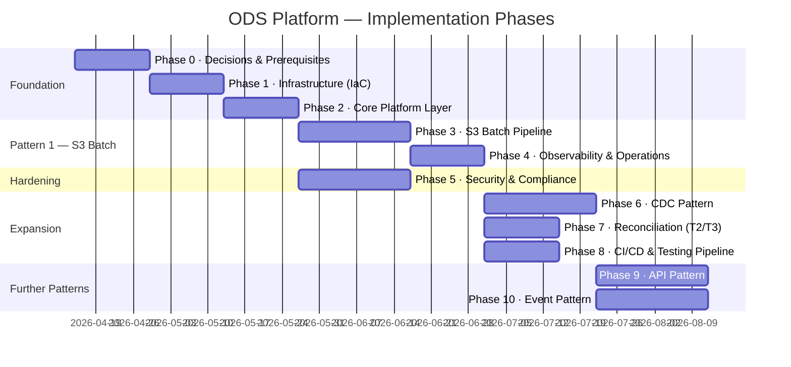

# ODS Platform — Implementation Plan
**Date:** 2026-04-15  
**Status:** Draft for review  
**Horizon:** Full platform — all four ingestion patterns — from zero to production

---

## How to Read This Plan

The platform is built in eight phases. Each phase has a clear **goal**, a list of **deliverables**, its **hard dependencies** (what must exist before it starts), its **blocking decisions** (open items that must be resolved, not just started), the **team(s)** responsible, and a **testing gate** — the evidence required before the phase is considered done and the next can begin.

Phases within the same block can run in parallel where dependencies allow. Phases in separate blocks are strictly sequential.

---

## Blocking Decisions — Resolve Before Any Build Starts

These are not implementation tasks. They are decisions that must be made by named owners. Each one gates one or more phases. Until they are resolved, implementation of the affected phase cannot begin.

| # | Decision | Gates | Owner | Priority |
|---|---|---|---|---|
| D1 | SFTP → MWAA network connectivity model (VPN / Transit Gateway / PrivateLink) | Phase 3 | Infrastructure + Security | **Critical** |
| D2 | MSK authentication mode (IAM auth vs SASL/SCRAM) | Phase 2 | Security + Platform | **Critical** |
| D3 | GDPR erasure strategy per dataset (crypto-shredding vs pseudonymisation) | Phase 5 | DPO + Platform | **Critical** |
| D4 | Data classification exercise — classify every dataset as Public / Internal / Confidential / Restricted-PII | Phase 5 | Data Governance | **Critical** |
| D5 | RTO/RPO targets for production | Phase 2 | CTO + Business | High |
| D6 | CDC connector choice (Debezium on MSK Connect vs AWS DMS) | Phase 6 | Platform | High |
| D7 | Cross-region DR strategy (Option A: none / B: warm standby / C: active-active) | Phase 7 | CTO + Finance | Medium |
| D8 | `glue_job_log` retention period and archival approach | Phase 3 | Data Governance + Platform | Medium |
| D9 | MSK topic partition count and retention policy per topic | Phase 2 | Platform | Medium |
| D10 | DPIA — are any datasets Art 9 special-category data? | Phase 5 | DPO | **Critical if applicable** |

**D1, D2, D3, D4 must be resolved before production go-live. D1 must be resolved before Phase 3 can start at all.**

---

## Phase Overview



*Note: durations are illustrative — they assume a small team (2–3 engineers) and do not account for approval cycles or infrastructure provisioning queues.*

---

## Phase 0 · Decisions and Prerequisites

**Goal:** All decisions and account-level prerequisites are in place. Nothing can be built until this phase is complete.

### Deliverables

**Decisions (not code):**
- [ ] D1 resolved: SFTP connectivity model chosen, procurement/configuration started
- [ ] D2 resolved: MSK auth mode confirmed
- [ ] D5 resolved: RTO/RPO targets agreed and documented
- [ ] D9 resolved: MSK partition count and retention policy per topic type confirmed

**AWS account setup:**
- [ ] AWS accounts exist for dev, staging, and prod (or a single account with separated environments via naming)
- [ ] Route53 / DNS for internal service discovery confirmed
- [ ] AWS Organizations or account structure agreed
- [ ] Cost allocation tags strategy agreed (`ods:env`, `ods:component`, `ods:domain`)

**Repository and tooling:**
- [ ] Git repository created (GitHub / GitLab / CodeCommit)
- [ ] Monorepo structure agreed (per `2026-04-15-deployment-cicd.md` Section 1)
- [ ] Terraform backend (S3 + DynamoDB state locking) created in a shared AWS account
- [ ] `pre-commit` hooks configured (Python linting, YAML validation, Terraform fmt)
- [ ] Secrets Manager access confirmed for dev environment

**Team:**
- [ ] On-call rotation plan drafted
- [ ] PagerDuty / alerting tool chosen

### Testing Gate
Phase 0 is complete when D1, D2, D5, D9 are documented decisions (not just "in discussion"), the Git repo exists with the agreed directory structure, and at least one engineer can `terraform init` successfully against the remote backend.

---

## Phase 1 · Infrastructure as Code Foundation

**Goal:** All AWS resources required by the core platform exist in Terraform and have been applied to dev.

### Dependencies
- Phase 0 complete
- D2 (MSK auth) resolved — MSK cluster config depends on this

### Deliverables

**Terraform modules (one module per resource type):**

```
infra/
  modules/
    msk/               # MSK cluster — 3 brokers, RF=3, minISR=2, auth per D2
    rds/               # PostgreSQL RDS — Multi-AZ, parameter group, subnet group
    mwaa/              # MWAA environment — worker count, S3 DAG bucket
    s3-buckets/        # All ODS S3 buckets with encryption and versioning
    glue-registry/     # Glue Schema Registry
    eventbridge/       # EventBridge rules (curated and raw file events)
    iam/               # All IAM roles — Glue, MWAA, EventBridge, Kafka Connect
    vpc/               # VPC, subnets, security groups, NACLs
    secrets/           # Secrets Manager secret stubs (values populated separately)
```

**Per-environment variables files:**
- `infra/environments/dev.tfvars`
- `infra/environments/staging.tfvars`
- `infra/environments/prod.tfvars` (created but not applied until Phase 4 sign-off)

**IAM roles created (least-privilege per `2026-04-15-security-data-privacy.md` Section 5):**
- `ods-mwaa-execution-role-{env}`
- `ods-glue-ingestion-role-{env}`
- `ods-glue-publish-role-{env}`
- `ods-eventbridge-target-role-{env}`
- `ods-kafka-connect-role-{env}`

**S3 buckets created:**
- `ods-raw-{env}` — versioning on, Object Lock GOVERNANCE, lifecycle rules stub
- `ods-curated-{env}` — versioning on, lifecycle rules stub
- `ods-config-{env}` — versioning on (critical — config version pinning depends on this)
- `ods-dlq-{env}` — lifecycle 90-day active
- `ods-dags-{env}` — MWAA DAG bucket
- `ods-scripts-{env}` — Glue job scripts
- `ods-audit-sink-{env}`
- `ods-dq-results-{env}`
- `ods-quarantine-{env}`

**Network:**
- VPC with private subnets for RDS, MSK, MWAA, Glue
- Security groups: intra-platform rules only (no 0.0.0.0/0 ingress)
- SFTP connectivity: D1 resolution applied (VPN endpoint / Transit Gateway attachment / PrivateLink)

**PostgreSQL schema applied to dev RDS:**

```sql
-- All tables from the design docs
CREATE SCHEMA pipeline;
-- pipeline.glue_job_log (partitioned by created_at monthly)
-- pipeline.file_state
-- pipeline.ingestion_file_state
-- pipeline.file_catalogue
-- pipeline.reconciliation_log
-- pipeline.lineage
-- pipeline.cdc_source_catalogue
-- pipeline.api_source_catalogue
-- pipeline.event_source_catalogue
```

Managed via Flyway migration files in `db/migrations/`.

### Testing Gate
- `terraform plan` produces zero drift against dev environment
- All S3 buckets exist with correct encryption and versioning enabled
- RDS is reachable from a Glue JDBC test connection (`ods-postgres-{env}`)
- MSK broker endpoints are reachable from inside the VPC
- MWAA environment is healthy and can trigger a test DAG
- All IAM roles can be assumed by their respective services without error

---

## Phase 2 · Core Platform Layer

**Goal:** The shared platform components that all four ingestion patterns depend on are operational and validated.

### Dependencies
- Phase 1 complete

### Deliverables

**Glue Schema Registry:**
- Registry `ods-schema-registry-dev` created
- Compatibility mode policy documented and applied per topic type (`BACKWARD` for S3/API, `FULL` for CDC/Events — per `2026-04-15-schema-governance.md` Section 5)
- First schema registered: `ods-insurance-policies` (used by Phase 3 first dataset)

**Kafka Connect S3 Sink Connector:**
- MSK Connect plugin deployed
- Connector `ods-audit-sink-connector-dev` running
- `ods.pipeline.audit` → `ods-audit-sink-dev` verified (publish a test message, confirm it lands in S3)

**CloudWatch baseline:**
- Log groups created: `/ods/dev/airflow`, `/ods/dev/glue`
- CloudWatch namespace `ods/dev` confirmed
- Log retention set to 90 days

**Secrets populated:**
- SFTP credentials stored in Secrets Manager (not plaintext MWAA connection)
- RDS connection string in Secrets Manager
- Glue JDBC connection `ods-postgres-dev` tested successfully

**YAML config bucket seeded:**
- `ods-config-dev/insurance/policies.yaml` uploaded (first dataset)
- DQ rules file `ods-config-dev/dq-rules/policies.dqdl` uploaded
- S3 versioning confirmed: uploading a new config produces a new version ID

**`pipeline.file_catalogue` seeded:**
```sql
INSERT INTO pipeline.file_catalogue (name_pattern, sftp_path, domain, dataset, config_ref, active)
VALUES ('policies_*.csv', '/outbound/insurance/policies/', 'insurance', 'policies',
        's3://ods-config-dev/insurance/policies.yaml', TRUE);
```

**MSK topic created:**
- `ods.insurance.policies` — partition count per D9, retention per `2026-04-15-data-retention.md`, `cleanup.policy=compact,delete`
- `ods.pipeline.audit` — time-based delete retention, 30 days

### Testing Gate
- Can publish a test Avro message to `ods.insurance.policies` using the schema from the registry and read it back
- S3 Sink Connector drains `ods.pipeline.audit` to `ods-audit-sink-dev` within 5 minutes of message publish
- Glue JDBC connection to RDS is healthy in the Glue console
- YAML config version ID is readable via `s3api head-object`

---

## Phase 3 · S3 Batch Pipeline — Pattern 1

**Goal:** The first dataset (`insurance/policies`) flows end-to-end from SFTP to Kafka in dev. This is the platform template — all subsequent datasets on Pattern 1 follow the same path.

### Dependencies
- Phase 2 complete
- D1 resolved and SFTP connectivity operational (hard dependency — without this, DAG 1 cannot run)

### Deliverables

**Glue job code:**

`glue/jobs/ods_ingestion.py` — parameterised by `dataset` argument:
- Reads CSV from S3 Raw
- Extracts `business_date` from filename using pattern from YAML config
- Runs schema validation against Glue Schema Registry
- Runs DQDL rules (hard block + soft warn)
- Converts to Parquet, writes to S3 Curated partitioned by `date={date}/dataset={dataset}/`
- Verifies written record count == source row count
- Writes status transitions to `pipeline.glue_job_log` via JDBC at every step
- Emits CloudWatch metrics at every step
- Routes failures to `ods-dlq-dev`

`glue/jobs/ods_s3_publish.py` — parameterised by `dataset` argument:
- Reads Parquet from S3 Curated
- Validates schema against registry (pinned version from config)
- Runs DQDL rules
- Generates deterministic SHA256 message keys from `key_fields` in config
- Publishes to MSK with Kafka transactions and `acks=all`
- Verifies Kafka offset delta == source row count
- Writes status transitions to `pipeline.glue_job_log`
- Attaches lineage headers (`x-ods-run-id`, `x-ods-source-ref`, `x-ods-source-type`, `x-ods-business-date`, `x-ods-schema-version`, `x-ods-pipeline-type`)
- Writes to `pipeline.lineage` after confirmed publish

**Airflow DAGs:**

`dags/ods_dag1_sftp_transfer.py`:
- Triggered by SFTP sensor on new files
- Checks `pipeline.file_catalogue` (approved?)
- Checks `pipeline.ingestion_file_state` (already processed?)
- `SFTPToS3Operator` → S3 Raw
- MD5 checksum verification
- Updates `pipeline.ingestion_file_state` → `transferred`

`dags/ods_dag2_etl_trigger.py`:
- Triggered by EventBridge (S3 Raw Object Created)
- Receives file path from EventBridge payload
- Loads YAML config, pins S3 version ID
- Triggers Glue ingestion job
- Waits for completion, updates file state

`dags/ods_publish_dag.py`:
- Triggered by EventBridge (S3 Curated Object Created)
- Idempotency check (`pipeline.file_state`) — exit if `completed`
- Loads YAML config, pins version ID
- Sets `processing` state
- Triggers Glue publish job
- Waits for completion
- Registers dataset in Glue Data Catalog
- Triggers crawler (async, no wait)
- Sets `completed` state
- Publishes audit event to `ods.pipeline.audit`

**CloudWatch alarms (dev):**
All alarms from `2026-04-14-ingestion-design.md` and `2026-04-14-s3-kafka-design.md` created in Terraform.

**Glue crawler:**
`ods-policies-crawler` created and configured.

### Testing — required before phase is complete

Run the full test checklist from `2026-04-15-dataset-onboarding.md` Section 10 for the `policies` dataset:

- [ ] Happy path: place `policies_20260415.csv` on SFTP → verify Kafka message count == source row count
- [ ] Idempotency: place same file twice → second run exits at idempotency check, Kafka count unchanged
- [ ] File not approved: place `unknown_file.csv` → quarantine, alarm fires
- [ ] Checksum mismatch: corrupt file in transit → quarantine, state = failed
- [ ] Schema incompatible: remove required column from CSV → DLQ, alarm fires
- [ ] DQ hard block: CSV with `policy_id` = null → failing rows to DLQ, passing rows continue
- [ ] DQ soft warn: CSV with borderline `premium` value → CloudWatch metric emitted, row continues
- [ ] Count mismatch: simulate partial Kafka publish → DLQ, alarm fires
- [ ] Business date extraction: filename `policies_20261201.csv` → `business_date = 2026-12-01` in job log

### Testing Gate
All nine test scenarios pass. The `pipeline.glue_job_log` shows the correct status transitions for each scenario. CloudWatch alarms fire on the expected failures. At least one end-to-end run is traced using `run_id` from Kafka header through `pipeline.lineage` → `glue_job_log` → S3 Raw file.

---

## Phase 4 · Observability and Operations Layer

**Goal:** The platform is observable in production-equivalent conditions. On-call engineers can diagnose any failure without reading source code.

### Dependencies
- Phase 3 complete (at least one dataset running end-to-end)

### Can run in parallel with Phase 5.

### Deliverables

**CloudWatch dashboards (per `2026-04-15-observability.md` Section 5):**
- Platform Health dashboard — pipeline success rate, active DAG runs, DLQ depth, consumer lag, last successful run per dataset
- Pipeline Drill-Down dashboard — per-dataset latency, DQ failure rate, record counts by business date
- Infrastructure dashboard — MWAA workers, Glue DPU, RDS connections, MSK throughput

**SLOs configured and measured:**
- `pipeline.e2e.latency_ms` metric emitted from Publish DAG (EventBridge trigger timestamp to Kafka flush timestamp)
- `pipeline.file2curated.latency_ms` metric emitted from DAG 2
- CloudWatch Metric Math SLO alarm: p95 e2e latency > 10 minutes sustained over 30 min = P2 alert

**Consumer lag alarms:**
- CloudWatch alarm on MSK `SumOffsetLag` per consumer group per topic
- Warning threshold: lag > 1,000 records for > 5 minutes
- Critical threshold: lag not shrinking for > 15 minutes

**DLQ depth alarm:**
- `dlq.record.count` metric emitted by Glue jobs on every DLQ write
- Alarm: any DLQ write = P2; DLQ records older than 7 days unresolved = P1

**On-call runbooks written** (not just referenced):
- Runbook: MWAA worker saturation
- Runbook: RDS unavailable / failover
- Runbook: MSK broker unavailable
- Runbook: Glue DPU quota exhausted
- Runbook: DLQ growth response procedure

**Structured log format** implemented in Glue jobs and DAGs (per `2026-04-15-observability.md` Section 6):
- Every log line is JSON with `run_id`, `job_name`, `pipeline_type`, `domain`, `dataset`, `event`, `duration_ms`
- CloudWatch Logs Insights queries from `2026-04-15-observability.md` Section 8 validated against real log data

**Alerting integration:**
- CloudWatch alarms → SNS → PagerDuty (P1) / Slack (P2/P3)
- Alert suppression rules for planned maintenance windows

### Testing Gate
- Deliberately trigger each alarm type (schema failure, DQ failure, count mismatch, job failure) and confirm: alarm fires within 2 minutes, PagerDuty/Slack message received with correct severity, runbook link is in the notification
- Dashboard is reviewed by one engineer who was not involved in building it — they must be able to answer "is the pipeline healthy right now?" within 30 seconds

---

## Phase 5 · Security and Compliance Hardening

**Goal:** The platform is secure enough for production data including PII. All go-live security blockers are resolved.

### Dependencies
- Phase 2 complete (infrastructure exists to harden)
- D3 resolved (GDPR erasure strategy)
- D4 complete (data classification exercise done)
- D10 assessed (DPIA completed if any Art 9 data)

### Can run in parallel with Phase 4.

### Deliverables

**IAM least-privilege audit:**
- All IAM roles reviewed against the `2026-04-15-security-data-privacy.md` Section 5 tables
- Overly broad S3 permissions (`s3:*`) replaced with resource-specific allows
- No wildcard principals on any S3 bucket policy
- Automated IAM Access Analyzer finding review — zero unresolved findings

**Secrets rotation:**
- All plaintext MWAA connections replaced with Secrets Manager references
- Rotation schedule configured for SFTP credentials (90 days) and RDS credentials (30 days)
- SFTP credential rotation tested: rotate secret → DAG continues to work on next run

**KMS key management:**
- One KMS key per S3 bucket type (raw, curated, config, dlq, audit-sink)
- Key rotation enabled (annual)
- Key aliases documented and tagged with owner

**Data classification applied:**
- Every dataset in `pipeline.file_catalogue` has a `data_classification` field in its YAML config
- Tier 4 (PII) datasets have `gdpr_erasure_strategy` and `pii_fields` set in YAML
- `data_classification` referenced in DQ rules and audit events

**GDPR erasure implementation (for Tier 4 datasets):**
- Crypto-shredding: `ods/gdpr/entity-keys/{entity_id}` in Secrets Manager
- Per-entity KMS data key generated at first publish; PII fields encrypted with it
- Key deletion procedure documented and tested in dev
- Right-to-erasure request procedure written

**VPC security review:**
- All security group rules reviewed — no `0.0.0.0/0` ingress on any rule except HTTPS from trusted CIDRs
- MSK, RDS, MWAA all in private subnets with no public IPs
- VPC Flow Logs enabled and sent to CloudWatch

**Penetration test / security assessment** (if required by policy):
- Scope agreed with security team
- Findings documented and remediation plan agreed

### Testing Gate
- AWS Security Hub findings: zero CRITICAL, zero HIGH in the ODS account scope
- IAM Access Analyzer: zero active findings
- Secrets rotation: tested end-to-end without pipeline interruption
- Data classification: 100% of active datasets in `file_catalogue` have a confirmed `data_classification` in their YAML config

**Security sign-off required from:** Information Security team and DPO before promotion to production.

---

## Phase 6 · CDC Pattern — Pattern 2

**Goal:** One CDC-sourced dataset is running end-to-end from source database to Kafka in dev.

### Dependencies
- Phase 4 complete (platform is observable before adding a new pattern)
- Phase 5 substantially complete (security hardening before adding DB credentials)
- D6 resolved (Debezium vs AWS DMS)

### Deliverables

**Source database preparation:**
- PostgreSQL source DB has `wal_level=logical`
- Replication slot and publication created for the first CDC dataset
- DBA has confirmed WAL retention policy (slot will not grow unboundedly if connector pauses)

**MSK Connect deployment:**
- MSK Connect cluster (or use existing MSK Connect capacity)
- Debezium PostgreSQL connector plugin uploaded to MSK Connect
- First CDC connector deployed: `ods-cdc-{dataset}-dev`
- Connector config in `ods-config-dev/{domain}/{dataset}-cdc-connector.json`

**CDC-specific Kafka topic:**
- `ods.insurance.{cdc_dataset}` created with `cleanup.policy=compact,delete`
- Tombstone retention sufficient for T3 reconciliation window (min 7 days)

**`pipeline.cdc_source_catalogue` populated** for first CDC dataset.

**Initial snapshot:**
- Snapshot triggered and monitored to completion
- Source row count verified against Kafka topic record count (T3 check)

**CDC observability:**
- All CDC metrics from `2026-04-15-observability.md` Section 2.5 emitting
- `ods-cdc-connector-down-dev` alarm tested

**Schema governance applied:**
- CDC Avro schema (with Debezium envelope fields) registered in Glue Schema Registry
- Compatibility mode set to `FULL`
- Schema owner assigned

**Lineage:**
- `pipeline.lineage` writes by CDC path validated: `source_type=cdc`, `lsn_position` populated
- CDC trace walkthrough (`2026-04-15-data-lineage.md` Section 4b) executed against real data

### Testing Gate
Run CDC test scenarios from `2026-04-15-testing-strategy.md`:
- [ ] INSERT in source DB → message in Kafka within 30 seconds
- [ ] UPDATE in source DB → updated message in Kafka
- [ ] DELETE in source DB → tombstone in Kafka
- [ ] Connector restart → resumes from LSN checkpoint, no missed events, no duplicates
- [ ] Compatible schema change (add nullable column) → auto-evolves, pipeline continues
- [ ] Breaking schema change → alarm fires, DLQ receives event

---

## Phase 7 · Reconciliation Layer (T2/T3)

**Goal:** Automated daily reconciliation is running for all active datasets, with alarms on discrepancies.

### Dependencies
- Phase 3 complete (at least Pattern 1 running with real data)
- Can start alongside Phase 6

### Deliverables

**T1 (consumer lag) — already delivered in Phase 4.**

**T2 reconciliation job (`glue/jobs/ods_reconciliation_t2.py`):**
- Scheduled via MWAA cron DAG: hourly
- Queries `pipeline.glue_job_log` for completed runs in the last window
- Computes Kafka topic record count via Admin API (partition offset range)
- Writes result to `pipeline.reconciliation_log`
- Emits CloudWatch metric `reconciliation.t2.discrepancy`
- Fires alarm if discrepancy exceeds per-dataset tolerance

**T3 reconciliation job (`glue/jobs/ods_reconciliation_t3.py`):**
- Scheduled daily at watermark time (per dataset YAML config `t3_check_schedule`)
- Runs: count check + aggregate value sum (per `t3_aggregate_fields` in config)
- Duplicate message key check (query `pipeline.lineage` for duplicates within business date)
- Writes to `pipeline.reconciliation_log`
- Publishes result to `ods.pipeline.reconciliation` topic
- Fires alarm if any check fails

**`ods.pipeline.reconciliation` Kafka topic:**
- Created with time-based retention (30 days)
- S3 Sink Connector draining to `ods-audit-sink-dev` (same pattern as audit topic)

**Retroactive reconciliation:**
- Procedure documented for re-running T3 for a historical date after late-arriving data
- MWAA DAG supports manual trigger with `business_date` parameter

### Testing Gate
- T2 and T3 jobs complete without error for at least 7 consecutive days of real pipeline data
- Deliberately introduce a 10-record discrepancy (by submitting a modified test file) and confirm T3 alarm fires within the expected window
- Reconciliation result queryable via Athena against `ods-audit-sink-dev`

---

## Phase 8 · CI/CD Pipeline

**Goal:** All code and config changes are deployed via an automated pipeline with approval gates. No manual deployments to staging or production.

### Dependencies
- Phase 3 complete (enough code exists to justify a CI pipeline)
- Can run in parallel with Phase 6 and 7

### Deliverables

**GitHub Actions workflows (per `2026-04-15-deployment-cicd.md`):**

`.github/workflows/pr.yml`:
- Python linting (ruff)
- Unit tests (pytest, no AWS)
- Component tests (Docker Compose — Glue local, PostgreSQL)
- DAG import validation
- YAML config validation (required fields, schema_id exists)
- Terraform plan (no apply)
- Schema compatibility check (if config touches `schema_id`)

`.github/workflows/main.yml` (merge to main):
- All PR checks
- Terraform apply → dev
- Integration tests against dev environment
- Deploy Glue scripts to `ods-scripts-dev`
- Deploy DAGs to `ods-dags-dev`
- Deploy configs to `ods-config-dev`
- Run Flyway migrations against dev RDS

`.github/workflows/release.yml` (release tag):
- Manual approval gate → staging apply
- Full integration test suite in staging
- Manual approval gate (2-person sign-off) → prod apply

**Terraform state:**
- S3 backend + DynamoDB locking per environment
- Workspace or directory separation per environment (not workspace — directories preferred for audit clarity)

**Flyway migration pipeline:**
- All migration files in `db/migrations/V{N}__{description}.sql`
- Corresponding `db/migrations/U{N}__{description}.sql` undo scripts
- Migrations run as pre-deployment step before Glue/DAG deployment

**Config breaking-change detection:**
- CI script that diffs proposed YAML config changes and blocks the PR if `key_fields`, `schema_id`, or `target_topic` have changed without a schema governance issue linked

### Testing Gate
- A complete deploy cycle from feature branch → PR → merge → dev → staging → prod is executed for a trivial change (YAML config field update) and takes less than 30 minutes of human time
- A deliberate breaking config change (changing `key_fields`) is blocked by CI

---

## Phase 9 · API Pattern — Pattern 3

**Goal:** One API-sourced dataset is running end-to-end from API poll to Kafka in dev.

### Dependencies
- Phase 6 complete (CDC pattern validated the non-file pipeline path)
- API endpoint available (sandbox or mock) and credentials provisioned

### Deliverables

**API ingest DAG template (`dags/ods_api_ingest.py`):**
- Parameterised by dataset config
- Handles pagination (cursor / offset / page)
- Rate limit retry with exponential backoff on HTTP 429
- Persists cursor to `pipeline.api_source_catalogue` after each successful page
- Idempotency: cursor-based — does not re-fetch already-fetched window
- Publishes to Kafka with lineage headers (`x-ods-source-type: api`)

**`pipeline.api_source_catalogue` populated** for first API dataset.

**YAML config for API dataset** (from template in `2026-04-15-dataset-onboarding.md` Section 8.2).

**API-specific metrics emitting** (per `2026-04-15-observability.md` Section 2.6).

### Testing Gate
- Run API test scenarios from `2026-04-15-testing-strategy.md` (A1–A6)
- Cursor idempotency: run the DAG twice for the same window → zero duplicate Kafka messages

---

## Phase 10 · Event Pattern — Pattern 4

**Goal:** One event-sourced dataset is running end-to-end from source application to Kafka in dev.

### Dependencies
- Phase 6 complete
- Source application team has confirmed: `event_id` uniqueness, per-aggregate sequence numbers, heartbeat events

### Deliverables

**Event router Lambda (`lambda/ods_event_router.py`):**
- Receives events from EventBridge rule or SNS
- Validates event schema against Glue Schema Registry
- Generates deterministic Kafka message key from `key_fields`
- Attaches lineage headers (`x-ods-source-type: event`, `x-ods-source-ref: {event_type}#{event_id}`)
- Publishes to Kafka
- Writes to `pipeline.lineage`
- Detects sequence gaps — emits `event.sequence.gap` metric

**EventBridge rule or SNS subscription** created for first event type.

**`pipeline.event_source_catalogue` populated.**

**Heartbeat monitoring** configured for the event source.

**Sequence gap detector:** per-aggregate sequence tracking (Lambda or Kafka Streams) emitting `event.sequence.gap` on detection.

### Testing Gate
- Run Event test scenarios from `2026-04-15-testing-strategy.md` (E1–E7)
- Sequence gap test: send events 1,2,3,5 (skip 4) → `event.sequence.gap` alarm fires within 2 minutes

---

## Production Promotion Checklist

Before any environment is promoted to production, all of the following must be true:

### Technical readiness
- [ ] All Phase 0–8 gates passed
- [ ] Security Phase 5 sign-off received from InfoSec and DPO
- [ ] RDS Multi-AZ confirmed operational (automated failover tested)
- [ ] MSK broker failure test passed (Phase 7 DR test equivalent)
- [ ] End-to-end SLO baseline established from 2 weeks of staging data
- [ ] Reconciliation: T2 and T3 jobs running cleanly for 7 consecutive days in staging
- [ ] All CloudWatch alarms tested — confirmed they fire correctly
- [ ] On-call runbooks reviewed by an engineer who did not write them
- [ ] Consumer teams connected to staging topics and consumer lag alarms set

### Governance
- [ ] Data classification complete for all production datasets
- [ ] GDPR erasure strategy confirmed per dataset
- [ ] DPIA completed (if Art 9 data)
- [ ] Schema governance table populated with owners for all production topics
- [ ] Data retention lifecycle policies applied to all S3 buckets
- [ ] Cost estimate reviewed against budget

### Process
- [ ] CI/CD pipeline has successfully promoted to staging at least once
- [ ] Rollback procedure tested for at least one artifact type (Glue script rollback)
- [ ] DR runbook for RDS failover and S3 Raw replay executed in staging
- [ ] On-call rotation agreed and contacts loaded into PagerDuty

---

## Parallel Work Streams

Some workstreams can run in parallel and should be assigned to different team members:

| Workstream A | Workstream B | Workstream C |
|---|---|---|
| Phase 1: IaC (Terraform) | Phase 0: Blocking decisions | — |
| Phase 3: Glue job code | Phase 2: Config, schemas, connectors | — |
| Phase 4: Dashboards + runbooks | Phase 5: Security hardening | Phase 8: CI/CD pipeline |
| Phase 6: CDC connector + testing | Phase 7: Reconciliation jobs | — |
| Phase 9: API pattern | Phase 10: Event pattern | — |

---

## Open Items Tracker

The following must be tracked and unblocked throughout the programme. Assign an owner to each.

| Item | Blocking | Owner | Target date |
|---|---|---|---|
| SFTP → MWAA network connectivity (D1) | Phase 3 | Infrastructure | — |
| MSK auth mode decision (D2) | Phase 1 | Security + Platform | — |
| GDPR erasure strategy (D3) | Phase 5 | DPO | — |
| Data classification exercise (D4) | Phase 5 | Data Governance | — |
| RTO/RPO targets (D5) | Phase 2 | CTO | — |
| CDC connector choice (D6) | Phase 6 | Platform | — |
| Cross-region DR strategy (D7) | Phase 7 | CTO + Finance | — |
| `glue_job_log` retention (D8) | Phase 3 | Data Governance | — |
| MSK partition count + retention (D9) | Phase 2 | Platform | — |
| DPIA for Art 9 data (D10) | Phase 5 | DPO | — |
| On-call tool selection (PagerDuty vs Opsgenie) | Phase 4 | Engineering Manager | — |
| Consumer teams identified and engaged | Phase 4 | Platform | — |
| Source application teams engaged for Event pattern | Phase 10 | Platform + Domain teams | — |
| Source DBA team engaged for CDC pattern | Phase 6 | Platform + DBA | — |
