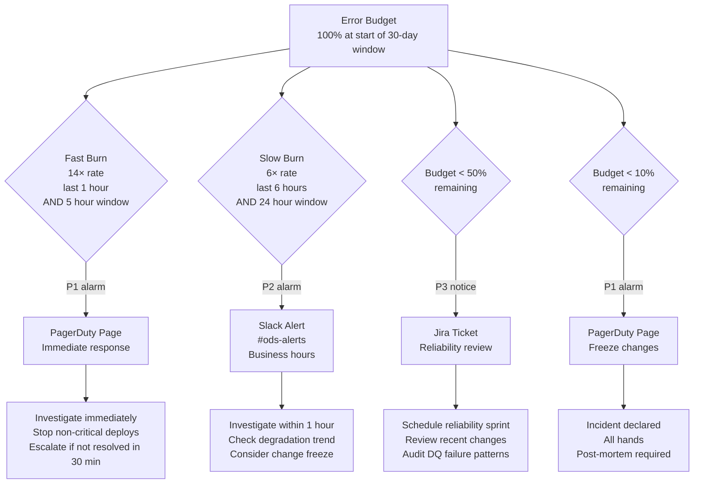

# ODS Platform — Observability Design
**Date:** 2026-04-15
**Status:** Draft
**Scope:** All four ingestion patterns — S3 batch (SFTP→S3→Glue→MSK), CDC (Debezium/MSK Connect→MSK), API (MWAA polling→Glue→MSK), Event (EventBridge/SNS/SQS→Lambda router→MSK)

---

## 1. Observability Philosophy

### 1.1 The Three Pillars

Observability for this platform rests on three mutually reinforcing pillars:

**Metrics** — numeric signals sampled over time. They answer "is the system healthy right now?" and "is it trending in the wrong direction?". Metrics are cheap to store, fast to query, and straightforward to alarm on. CloudWatch is the metrics store for this platform. Every pipeline stage emits metrics into the `ods/{env}` namespace.

**Logs** — structured records of discrete events. They answer "what happened, exactly, for this specific run?". Logs are more expensive than metrics but contain the context needed to diagnose a failure after it has been detected by an alarm. Airflow DAG task logs and Glue job logs are the two primary log sources. All logs must be structured JSON — see Section 6.

**Traces** — the correlation of a single unit of work (one file, one CDC batch) across multiple systems. A trace answers "where did this file spend its time, and where did it fail?". This platform does not use distributed tracing middleware (X-Ray, Jaeger). Instead, a `run_id` correlation key is threaded through every component — PostgreSQL rows, Kafka messages, log entries, and CloudWatch metric dimensions — so a trace can be reconstructed manually from existing stores. See Section 7.

The three pillars are complementary. An alarm fires on a metric (pillar 1). You open the dashboard to understand the scope (pillar 1). You query logs to diagnose the root cause (pillar 2). You trace back through the `run_id` to find the exact record that caused the failure (pillar 3).

### 1.2 What "Healthy" Looks Like vs What "Degrading" Looks Like

A healthy platform has these characteristics — this is the steady-state baseline for on-call engineers:

- Every file that lands on SFTP is processed to Kafka within 10 minutes (p95)
- The DLQ is empty — `ods-dlq-{env}` has no new objects in the last 24 hours
- MSK consumer lag on all `ods.*` topics is below 5,000 messages
- `pipeline.glue_job_log` shows a steady rhythm of `status=completed` rows, one per expected file per dataset
- No CloudWatch alarms are in ALARM state
- The publish pipeline emits `publish.success` for every `dag.triggered`
- MWAA scheduler is processing tasks — no queue depth spike

A degrading platform (before it fails) shows these early warning signs:

- End-to-end latency p95 rising past 8 minutes (approaching the 10-minute SLO)
- Consumer lag growing slowly but not recovering between DAG runs — indicates downstream consumer is slower than ingestion rate
- DQ soft warnings increasing — `dq.soft.warning` metric rising, not yet blocking, but indicating data quality degradation upstream
- MWAA worker utilisation sustained above 80% — tasks are queuing, latency will grow
- RDS connection pool approaching maximum — connections will start failing under burst
- Glue DPU consumption growing for a fixed file size — Glue job may be iterating inefficiently or input data has changed shape

The difference between degrading and failing is time. Degrading systems give you a window to act. This document is designed to surface degradation signals before they become alarm-firing failures.

### 1.3 Alerting on Symptoms vs Causes

**Alert on symptoms, investigate for causes.** An alarm on `ods-job-failure-{env}` tells you that something failed — that is the symptom. It does not tell you whether the cause was a schema incompatibility, a DQ hard failure, an S3 permission error, or a Glue worker crash. The runbook entry for that alarm lists the causes in order of likelihood and directs the on-call engineer to the right log query.

Do not create alarms for every individual cause metric. If `schema.incompatible` fires, `job.failed` also fires. Two alarms for one event create alert fatigue and confusion about which alarm to respond to. The `job.failed` alarm is the symptom alarm — it is always present. The `schema.incompatible` metric is a cause metric — it is queried during investigation, not paged on separately.

**Exceptions to this rule:** Some cause alarms are justified when the symptom is invisible. `ods-file-not-approved-{env}` is a cause alarm — the symptom (file not processed) would only be visible after a long polling window, by which time SLO burn has already started. Similarly, `ods-dlq-records-{env}` surfaces a cause (records failed schema/DQ validation at publish time) that would otherwise only be visible by inspecting S3 manually.

---

## 2. Metrics Architecture

### 2.1 Observability Data Flow

The diagram below shows how observability signals flow through the platform to operators.

```mermaid
flowchart LR
    subgraph Pipeline["Pipeline Components"]
        SFTP[SFTP Server]
        DAG1[MWAA DAG 1\nSFTP→S3]
        DAG2[MWAA DAG 2\nETL]
        DAGPUB[MWAA DAG 3\nPublish]
        GLUE1[Glue ETL Job]
        GLUE2[Glue Publish Job]
        MSK[MSK Topics]
        RDS[(PostgreSQL RDS)]
        EB[EventBridge]
    end

    subgraph Observability["Observability Layer"]
        CWM[CloudWatch Metrics\nods/{env}]
        CWL[CloudWatch Logs\nDAG + Glue logs]
        CWA[CloudWatch Alarms]
        CWD[CloudWatch Dashboards]
    end

    subgraph Response["Operator Response"]
        PD[PagerDuty\nP1 — immediate page]
        SLACK[Slack\n#ods-alerts]
        JIRA[Jira Ticket\nP3 — next-business-day]
    end

    DAG1 -->|structured JSON logs| CWL
    DAG2 -->|structured JSON logs| CWL
    DAGPUB -->|structured JSON logs| CWL
    GLUE1 -->|structured JSON logs| CWL
    GLUE2 -->|structured JSON logs| CWL

    DAG1 -->|emit_metric calls| CWM
    DAG2 -->|emit_metric calls| CWM
    DAGPUB -->|emit_metric calls| CWM
    GLUE1 -->|emit_metric calls| CWM
    GLUE2 -->|emit_metric calls| CWM
    MSK -->|BrokerBytesIn/Out\nConsumerLag| CWM
    RDS -->|DatabaseConnections| CWM
    EB -->|FailedInvocations| CWM

    RDS -->|glue_job_log\nfile_state rows| RDS

    CWM -->|threshold breach| CWA
    CWA -->|P1 alarm| PD
    CWA -->|P2 alarm| SLACK
    CWA -->|P3 alarm| JIRA
    CWM --> CWD
    CWL --> CWD
```

### 2.2 Metrics Catalogue — Ingestion Pipeline (SFTP → S3 Curated)

All metrics in namespace `ods/{env}`. Dimensions are `domain`, `dataset`, and `run_id` unless noted.

| Metric Name | Source | Dimensions | Unit | What It Means | Alarm Threshold |
|---|---|---|---|---|---|
| `file.not.approved` | MWAA DAG 1 | `domain`, `dataset` | Count | File landed on SFTP but not in catalogue | ≥ 1 → ALARM |
| `dag.triggered` | MWAA DAG 1 | `domain`, `dataset` | Count | DAG 1 triggered by SFTP sensor | Informational |
| `file.transferred` | MWAA DAG 1 | `domain`, `dataset` | Count | File copied from SFTP to S3 Raw successfully | Informational |
| `checksum.verified` | MWAA DAG 1 | `domain`, `dataset` | Count | MD5 checksum matched — file transfer was clean | Informational |
| `checksum.mismatch` | MWAA DAG 1 | `domain`, `dataset` | Count | MD5 mismatch between SFTP source and S3 Raw copy | ≥ 1 → ALARM |
| `glue.job.started` | MWAA DAG 2 | `domain`, `dataset`, `job_name` | Count | Glue ETL job submitted | Informational |
| `schema.evolved` | Glue ETL Job | `domain`, `dataset` | Count | Compatible schema change auto-registered | Informational |
| `schema.incompatible` | Glue ETL Job | `domain`, `dataset` | Count | Breaking schema change — file routed to DLQ | ≥ 1 → ALARM |
| `dq.hard.failure` | Glue ETL Job | `domain`, `dataset`, `rule_name` | Count | DQ hard-block rule failed — file stopped | ≥ 1 → ALARM |
| `dq.soft.warning` | Glue ETL Job | `domain`, `dataset`, `rule_name` | Count | DQ soft-warn rule tripped — pipeline continues | ≥ 5 in 1 hr → ALARM |
| `write.count.mismatch` | Glue ETL Job | `domain`, `dataset` | Count | Parquet row count ≠ source file row count | ≥ 1 → ALARM |
| `etl.success` | Glue ETL Job | `domain`, `dataset` | Count | ETL wrote Parquet to S3 Curated successfully | Informational |
| `pipeline.completed` | MWAA DAG 2 | `domain`, `dataset` | Count | Full ingestion pipeline completed for this file | Informational |
| `job.failed` | MWAA DAG 1/2 | `domain`, `dataset`, `dag_id` | Count | Any DAG task failed | ≥ 1 → ALARM |

### 2.3 Metrics Catalogue — Publish Pipeline (S3 Curated → MSK)

| Metric Name | Source | Dimensions | Unit | What It Means | Alarm Threshold |
|---|---|---|---|---|---|
| `dag.triggered` | Publish DAG | `domain`, `dataset` | Count | Publish DAG triggered by EventBridge | Informational |
| `glue.job.started` | Publish DAG | `domain`, `dataset`, `job_name` | Count | Glue Publish Job submitted | Informational |
| `schema.evolved` | Glue Publish Job | `domain`, `dataset` | Count | Compatible schema change at publish time | Informational |
| `schema.incompatible` | Glue Publish Job | `domain`, `dataset` | Count | Breaking schema at publish — records to DLQ | ≥ 1 → ALARM |
| `dq.hard.failure` | Glue Publish Job | `domain`, `dataset`, `rule_name` | Count | DQ hard block in publish job | ≥ 1 → ALARM |
| `dq.soft.warning` | Glue Publish Job | `domain`, `dataset`, `rule_name` | Count | DQ soft warn in publish job | ≥ 5 in 1 hr → ALARM |
| `publish.success` | Glue Publish Job | `domain`, `dataset` | Count | All records published to MSK topic | Informational |
| `publish.count.mismatch` | Glue Publish Job | `domain`, `dataset` | Count | Source row count ≠ Kafka offset delta | ≥ 1 → ALARM |
| `glue.job.completed` | Publish DAG | `domain`, `dataset` | Count | Glue Publish Job completed successfully | Informational |
| `job.failed` | Publish DAG | `domain`, `dataset`, `dag_id` | Count | Publish DAG task failed | ≥ 1 → ALARM |
| `catalog.registered` | Publish DAG | `domain`, `dataset` | Count | Glue Catalog crawler completed after publish | Informational |

### 2.4 New Metrics — Closing Observability Gaps

These metrics do not exist today and must be implemented to close the gaps identified in the architecture decisions document.

| Metric Name | Source | Dimensions | Unit | What It Means | Alarm Threshold | Implementation Note |
|---|---|---|---|---|---|---|
| `pipeline.e2e.latency` | Publish DAG | `domain`, `dataset` | Milliseconds | Wall-clock time from file landing on SFTP (DAG 1 start timestamp) to Kafka publish confirmed (Publish DAG end timestamp). Stored in `glue_job_log` on DAG 1 start; difference computed at Publish DAG completion. | p95 > 600,000 ms (10 min) → ALARM | Publish DAG reads DAG 1 `start_time` from `glue_job_log` using `run_id`. Uses CloudWatch Statistics: percentile. |
| `pipeline.file2curated.latency` | MWAA DAG 2 | `domain`, `dataset` | Milliseconds | Wall-clock time from file landing in S3 Raw to Parquet written to S3 Curated. | p95 > 900,000 ms (15 min) → ALARM | DAG 2 emits this at `etl.success` using EventBridge event timestamp vs S3 PutObject timestamp. |
| `msk.consumer.lag` | MSK / CloudWatch | `topic`, `consumer_group` | Count | Number of unprocessed messages in each consumer group's partition assignment. Surfaced natively by MSK as `SumOffsetLag`. | > 50,000 → P2 ALARM; > 200,000 → P1 ALARM | MSK publishes `SumOffsetLag` to CloudWatch automatically — create alarm on existing metric. |
| `dlq.record.count` | S3 / Lambda | `topic`, `env` | Count | New objects written to `ods-dlq-{env}` in the last period. A Lambda triggered by S3 ObjectCreated on the DLQ bucket emits this metric. | ≥ 1 → ALARM | Lightweight Lambda: on S3 trigger → `put_metric_data`. |
| `mwaa.queue.depth` | MWAA CloudWatch | `env` | Count | Number of tasks queued but not yet assigned to a worker. Native MWAA metric `QueuedTasks`. | > 20 → P2; > 50 → P1 | Already emitted by MWAA to CloudWatch — `QueuedTasks` in `AWS/MWAA` namespace. Create alarm. |
| `rds.connection.utilisation` | RDS CloudWatch | `db_instance`, `env` | Percent | `DatabaseConnections / max_connections * 100`. Computed via CloudWatch Math. | > 70% → P2; > 85% → P1 | Metric Math: `(DatabaseConnections / 100) * 100` using the configured `max_connections` parameter. |
| `eventbridge.failed.invocations` | EventBridge / CloudWatch | `rule_name`, `env` | Count | EventBridge rule failed to invoke its target (e.g. failed to trigger MWAA API). Native CloudWatch metric `FailedInvocations` in `AWS/Events` namespace. | ≥ 1 → ALARM | Already emitted by EventBridge — create alarm. |

### 2.5 Metrics Catalogue — CDC Pattern (Source DB → Debezium/MSK Connect → MSK)

CDC metrics are continuous-stream metrics rather than per-run metrics. They have no `run_id` dimension. The primary dimensions are `connector_name`, `source_db`, and `domain`.

**Collection method:** Debezium on MSK Connect exposes JMX metrics. These are scraped and pushed to CloudWatch via a JMX exporter Lambda or the MSK Connect custom plugin sidecar. AWS DMS (if chosen instead of Debezium) exposes an equivalent set of metrics natively in the `AWS/DMS` namespace. All CDC metrics are published into the existing `ods/{env}` namespace for consistency.

| Metric Name | Source | Dimensions | Unit | What It Means | Alarm Threshold |
|---|---|---|---|---|---|
| `cdc.connector.lsn.lag.bytes` | MSK Connect / Debezium JMX | `connector_name`, `source_db` | Bytes | Gap between the source DB WAL current LSN and the connector's last committed LSN. Grows when the connector is behind or paused. | > 10 MB = warning; > 50 MB = critical |
| `cdc.connector.lsn.lag.seconds` | Debezium JMX / DMS | `connector_name`, `source_db` | Seconds | Replication lag in seconds between the source DB and the connector's committed position. The primary latency indicator for CDC freshness. | > 30s = warning; > 300s (5 min) = critical |
| `cdc.connector.status` | MSK Connect API | `connector_name` | Enum (0=RUNNING, 1=PAUSED, 2=FAILED) | Current operational state of the connector. PAUSED means deliberately stopped; FAILED means the connector has errored and stopped replicating. | Not RUNNING (value ≠ 0) = P1 alarm |
| `cdc.replication.slot.lag.bytes` | PostgreSQL `pg_replication_slots` | `source_db`, `slot_name` | Bytes | Disk lag of the replication slot on the source DB. If the connector stops consuming, WAL accumulates on the source DB and can cause disk exhaustion. | > 1 GB = warning; > 5 GB = critical (disk risk on source DB) |
| `cdc.snapshot.progress.pct` | Debezium metrics | `connector_name`, `source_db` | Percent | During the initial snapshot phase: percentage of the table scan completed. Only relevant during connector provisioning or after a full snapshot restart. | Alert if value unchanged for > 30 min (stuck snapshot) |
| `cdc.events.published` | CDC connector | `connector_name`, `domain`, `dataset` | Count/min | Number of change events (INSERT/UPDATE/DELETE) published per minute to the MSK topic. Informational; used for baseline and anomaly detection. | Informational — sudden drop to 0 during expected write activity warrants investigation |
| `cdc.tombstones.published` | CDC connector | `connector_name`, `domain`, `dataset` | Count/min | Number of delete tombstone events published per minute. Used to track delete volume. | Informational; a sudden spike relative to baseline = warning |
| `cdc.schema.change.detected` | Debezium | `connector_name`, `source_db`, `table_name` | Count | Source DB DDL change detected — column added, renamed, or dropped. Requires schema governance review before the downstream consumer schema can be updated. | Any occurrence = P1 alarm — schema governance review mandatory |

### 2.6 Metrics Catalogue — API Pattern (External API → MWAA DAG → optional Glue → MSK)

API pattern metrics are emitted per DAG run, similar to the S3 batch pattern. Dimensions are `domain`, `dataset`, `dag_id`, and `run_id`.

| Metric Name | Source | Dimensions | Unit | What It Means | Alarm Threshold |
|---|---|---|---|---|---|
| `api.fetch.duration.ms` | MWAA DAG task | `domain`, `dataset`, `dag_id` | Milliseconds | End-to-end wall-clock duration of the API fetch phase for this run, from first request to last response page received. | p95 > 300,000 ms (5 min) = warning |
| `api.records.fetched` | MWAA DAG / Glue | `domain`, `dataset` | Count | Total records retrieved from the API during this run, across all pages. | Informational; 0 records returned = possible issue (empty response or API error silently swallowed) |
| `api.pagination.pages` | MWAA DAG | `domain`, `dataset` | Count | Number of pages fetched during this run. Sudden large increase indicates upstream data volume spike or pagination cursor regression. | Sudden increase of > 5× baseline = warning |
| `api.rate.limit.hit` | MWAA DAG | `domain`, `dataset` | Count | Number of times a rate-limit response (HTTP 429) was received during this run. Any rate-limit hit causes a back-off delay and may extend run duration. | ≥ 1 = warning |
| `api.cursor.drift.seconds` | MWAA DAG | `domain`, `dataset` | Seconds | Gap in seconds between the last successfully processed cursor timestamp and the current wall-clock time. Measures whether the API fetch is keeping pace with real time. | > 2× the configured poll interval = warning |
| `api.publish.count` | Glue / DAG | `domain`, `dataset` | Count | Records published to the MSK Kafka topic from this API run. Should match `api.records.fetched` minus any records blocked by DQ hard failures. | Informational; mismatch with `api.records.fetched` warrants investigation |

### 2.7 Metrics Catalogue — Event Pattern (Source App → EventBridge/SNS/SQS → Lambda/MSK Connect Router → MSK)

Event pattern metrics are emitted by the event router Lambda or MSK Connect router. Dimensions are `event_type`, `domain`, `dataset`, and `aggregate_id` (where cardinality permits).

| Metric Name | Source | Dimensions | Unit | What It Means | Alarm Threshold |
|---|---|---|---|---|---|
| `event.sequence.gap` | Event router Lambda / Kafka Streams | `event_type`, `domain`, `dataset` | Count | Number of sequence number gaps detected per aggregate in the current evaluation window. A gap means one or more events arrived out of order or were lost in transit. | Any gap (> 0) = warning |
| `event.arrival.rate` | Event router | `event_type`, `domain` | Count/min | Events received per minute per event type. Used for baseline and anomaly detection. | Significant deviation from the 7-day baseline (±3σ) = warning |
| `event.heartbeat.missing` | Event router | `event_type`, `domain` | Count | Count of expected heartbeat events that did not arrive within the configured window. A missing heartbeat indicates the source application has stopped emitting events or the routing infrastructure has failed silently. | Any miss (> 0) = P2 alarm |
| `event.duplicate.count` | Event router | `event_type`, `domain`, `dataset` | Count | Number of events with a duplicate `event_id` received in this evaluation window. Deduplication is applied, but the duplicate count is tracked for auditability. | Any duplicate (> 0) = warning |
| `event.publish.latency.ms` | Event router | `event_type`, `domain` | Milliseconds | Time from when the event was received by the router to when it was confirmed published to the MSK Kafka topic. | p95 > 1,000 ms = warning |
| `event.dlq.count` | Event router | `event_type`, `domain`, `dataset` | Count | Events that could not be routed to the Kafka topic and were sent to the Dead Letter Queue. Each DLQ event represents a record that did not reach Kafka. | Any (> 0) = P2 alarm |

### 2.8 Infrastructure Metrics Catalogue

These are AWS-native metrics that do not require instrumentation — they are consumed by the Infrastructure dashboard (Section 5.3).

| Metric Name | Source Namespace | Key Dimensions | Alarm Threshold |
|---|---|---|---|
| `CPUUtilization` | `AWS/MWAA` | `Environment` | > 80% sustained 5 min → P2 |
| `QueuedTasks` | `AWS/MWAA` | `Environment` | > 20 → P2 |
| `RunningTasks` | `AWS/MWAA` | `Environment` | Informational |
| `GlueVersion`, `ExecutorRunTime` | `Glue` / `glue_job_log` | `JobName` | p95 > 2× baseline → P2 |
| `DatabaseConnections` | `AWS/RDS` | `DBInstanceIdentifier` | > 70 (of 100 default) → P2 |
| `FreeStorageSpace` | `AWS/RDS` | `DBInstanceIdentifier` | < 5 GB → P2 |
| `BrokerBytesInPerSec` | `AWS/Kafka` | `Cluster`, `Broker` | Informational |
| `BrokerBytesOutPerSec` | `AWS/Kafka` | `Cluster`, `Broker` | Informational |
| `SumOffsetLag` | `AWS/Kafka` | `ConsumerGroup`, `Topic` | See Section 2.4 |
| `NumberOfObjects` | S3 `BucketSizeBytes` (DLQ) | `BucketName` | See Section 2.4 |
| `FailedInvocations` | `AWS/Events` | `RuleName` | See Section 2.4 |

---

## 3. Alarm Severity Tiers

### 3.1 Severity Definitions

| Tier | Name | Response Time SLA | Notification Channel | Who Responds | Definition |
|---|---|---|---|---|---|
| **P1** | Critical | 15 minutes to acknowledge; 1 hour to resolve or escalate | PagerDuty page + Slack `#ods-incidents` + SMS | On-call engineer; escalate to platform lead after 30 min | Production data pipeline is failing or SLO burn rate is critical (2-hour burn at 14×). Customer-facing data is stale or missing. |
| **P2** | High | 1 hour to acknowledge; 4 hours to resolve | Slack `#ods-alerts` + PagerDuty low-urgency | On-call engineer during business hours | Pipeline is degraded but not down. SLO burn rate is elevated (6-hour burn at 6×). Risk of breaching SLO within hours if unaddressed. |
| **P3** | Low | Next business day | Jira ticket auto-created | Platform team | Trend is worsening; no immediate SLO risk. Soft warnings accumulating, DQ signals need investigation, infrastructure headroom reducing. |

### 3.2 Alarm to Severity Mapping — Ingestion Pipeline

| Alarm Name | Metric Trigger | Severity | Rationale |
|---|---|---|---|
| `ods-job-failure-{env}` | `job.failed ≥ 1` | P1 | A Glue or DAG task has failed — pipeline is stopped for that dataset |
| `ods-checksum-mismatch-{env}` | `checksum.mismatch ≥ 1` | P1 | File was corrupted in transit — data integrity is at risk |
| `ods-dq-hard-failure-{env}` | `dq.hard.failure ≥ 1` | P1 | Data quality hard block — file will not be published; data is withheld |
| `ods-schema-failure-{env}` | `schema.incompatible ≥ 1` | P2 | Breaking schema change — file in DLQ; pipeline will resume for other files |
| `ods-file-not-approved-{env}` | `file.not.approved ≥ 1` | P2 | File arrived but is not in catalogue — likely an upstream change |
| `ods-write-count-mismatch-{env}` | `write.count.mismatch ≥ 1` | P1 | Source row count ≠ Parquet row count — data loss in ETL |
| `ods-dq-soft-warning-{env}` *(new)* | `dq.soft.warning ≥ 5 in 1hr` | P3 | DQ soft warns accumulating — trend needs investigation |
| `ods-e2e-latency-breach-{env}` *(new)* | `pipeline.e2e.latency p95 > 600,000 ms` | P2 | File-to-Kafka p95 is approaching or past SLO |
| `ods-file2curated-latency-breach-{env}` *(new)* | `pipeline.file2curated.latency p95 > 900,000 ms` | P2 | File-to-Curated p95 past SLO |
| `ods-eventbridge-failure-{env}` *(new)* | `eventbridge.failed.invocations ≥ 1` | P1 | EventBridge failed to trigger DAG — pipeline silently dead for that file |

### 3.3 Alarm to Severity Mapping — Publish Pipeline

| Alarm Name | Metric Trigger | Severity | Rationale |
|---|---|---|---|
| `ods-job-failure-{env}` | `job.failed ≥ 1` | P1 | Publish DAG task failed — records not reaching Kafka |
| `ods-dlq-records-{env}` | `dlq.record.count ≥ 1` | P1 | Records in DLQ — some data did not reach Kafka |
| `ods-schema-failure-{env}` | `schema.incompatible ≥ 1` | P2 | Breaking schema at publish — DLQ records, but pipeline continues |
| `ods-dq-hard-failure-{env}` | `dq.hard.failure ≥ 1` | P1 | DQ hard block at publish — records withheld from Kafka |
| `ods-count-mismatch-{env}` | `publish.count.mismatch ≥ 1` | P1 | Source count ≠ Kafka offset delta — records lost in publish |
| `ods-consumer-lag-high-{env}` *(new)* | `msk.consumer.lag > 50,000` | P2 | Consumer falling behind; data freshness degrading |
| `ods-consumer-lag-critical-{env}` *(new)* | `msk.consumer.lag > 200,000` | P1 | Consumer severely behind; SLO likely already breached |

### 3.4 Alarm to Severity Mapping — Infrastructure

| Alarm Name | Metric Trigger | Severity | Rationale |
|---|---|---|---|
| `ods-mwaa-queue-high-{env}` *(new)* | `mwaa.queue.depth > 20` | P2 | Tasks queuing — latency SLO at risk |
| `ods-mwaa-queue-critical-{env}` *(new)* | `mwaa.queue.depth > 50` | P1 | Severe task queue — pipeline throughput severely degraded |
| `ods-rds-connections-high-{env}` *(new)* | `rds.connection.utilisation > 70%` | P2 | Connection pool pressure — approaching exhaustion |
| `ods-rds-connections-critical-{env}` *(new)* | `rds.connection.utilisation > 85%` | P1 | Connection pool near exhaustion — new connections will fail |
| `ods-rds-storage-low-{env}` *(new)* | `FreeStorageSpace < 5 GB` | P2 | RDS storage below safe threshold |

### 3.5 Alarm to Severity Mapping — CDC Pattern

| Alarm Name | Metric Trigger | Severity | Rationale |
|---|---|---|---|
| `ods-cdc-connector-down-{env}` | `cdc.connector.status` != RUNNING (value ≠ 0) | P1 | Connector is PAUSED or FAILED — CDC replication has stopped; source changes are no longer reaching Kafka |
| `ods-cdc-lsn-lag-critical-{env}` | `cdc.connector.lsn.lag.seconds` > 300 | P1 | Replication lag exceeds 5 minutes — downstream consumers are receiving stale data; CDC freshness SLO is breached |
| `ods-cdc-replication-slot-bloat-{env}` | `cdc.replication.slot.lag.bytes` > 5 GB | P1 | WAL is accumulating on the source DB because the connector is not consuming. Risk of source DB disk exhaustion if not resolved immediately |
| `ods-cdc-schema-change-{env}` | `cdc.schema.change.detected` > 0 | P1 | A DDL change (column add/rename/drop) was detected on the source DB. Schema governance review is mandatory before continuing; downstream schema compatibility is unknown |

### 3.6 Alarm to Severity Mapping — API Pattern

| Alarm Name | Metric Trigger | Severity | Rationale |
|---|---|---|---|
| `ods-api-cursor-drift-{env}` | `api.cursor.drift.seconds` > 2× poll interval | P2 | The API fetch is falling behind real time; data freshness is degrading. If uncorrected, the cursor will drift further and a large backfill run may be required |

### 3.7 Alarm to Severity Mapping — Event Pattern

| Alarm Name | Metric Trigger | Severity | Rationale |
|---|---|---|---|
| `ods-event-sequence-gap-{env}` | `event.sequence.gap` > 0 | P2 | One or more events were received out of order or are missing from the sequence. Downstream consumers relying on ordering guarantees may produce incorrect aggregates |
| `ods-event-heartbeat-missing-{env}` | `event.heartbeat.missing` > 0 | P2 | Heartbeat event did not arrive within the expected window — the source application may have stopped emitting or the routing infrastructure has failed silently |
| `ods-event-connector-dlq-{env}` | `event.dlq.count` > 0 | P2 | Events could not be routed to Kafka and were sent to the DLQ. Each DLQ event is a record that has not reached the platform — data loss risk |

---

## 4. SLO Definitions

### 4.1 SLO Framework

Each SLO is defined in terms of good events and bad events. The SLO percentage is the ratio of good events to total events over the measurement window. The error budget is the allowable fraction of bad events before the SLO is breached.

For a 30-day window:
- 99.5% SLO → 0.5% error budget → 3.6 hours of downtime or bad events
- 99.0% SLO → 1.0% error budget → 7.2 hours

Error budgets are consumed by bad events. When the error budget falls below 50% remaining in a 30-day window, the team should halt non-critical changes and focus on reliability work.

### 4.2 SLO 1 — File-to-Kafka Latency (p95 < 10 minutes)

| Field | Value |
|---|---|
| **Name** | File-to-Kafka End-to-End Latency |
| **Definition** | The 95th percentile of wall-clock time from a file landing on SFTP to the corresponding Kafka publish completing, measured per file per dataset |
| **Good event** | A pipeline run where `pipeline.e2e.latency` ≤ 600,000 ms (10 minutes) |
| **Bad event** | A pipeline run where `pipeline.e2e.latency` > 600,000 ms, or where the pipeline failed entirely (no `publish.success` emitted for that `run_id`) |
| **Measurement method** | CloudWatch percentile statistic on `pipeline.e2e.latency` metric (namespace `ods/{env}`) over a rolling 7-day window. SLO compliance reviewed on a 30-day window. |
| **SLO target** | p95 < 10 minutes |
| **Error budget (30 days)** | 5% of pipeline runs may exceed 10 minutes. Over 30 days with ~100 pipeline runs/day = 3,000 runs → 150 bad runs allowed |
| **Measurement frequency** | Alarm evaluates every 5 minutes using a 60-minute rolling window |

### 4.3 SLO 2 — File-to-Curated Latency (p95 < 15 minutes)

| Field | Value |
|---|---|
| **Name** | File-to-Curated (ETL) Latency |
| **Definition** | The 95th percentile of wall-clock time from a file landing in S3 Raw (EventBridge event timestamp) to Parquet written to S3 Curated (`etl.success` timestamp) |
| **Good event** | A pipeline run where `pipeline.file2curated.latency` ≤ 900,000 ms (15 minutes) |
| **Bad event** | A pipeline run where `pipeline.file2curated.latency` > 900,000 ms, or where ETL failed (`etl.success` never emitted for that `run_id`) |
| **Measurement method** | CloudWatch percentile statistic on `pipeline.file2curated.latency` metric. SLO compliance reviewed on a 30-day window. |
| **SLO target** | p95 < 15 minutes |
| **Error budget (30 days)** | 5% of ETL runs may exceed 15 minutes |
| **Measurement frequency** | Alarm evaluates every 5 minutes using a 60-minute rolling window |

### 4.4 SLO 3 — Pipeline Success Rate (> 99.5%)

| Field | Value |
|---|---|
| **Name** | Pipeline Success Rate |
| **Definition** | The percentage of pipeline runs that complete successfully end-to-end (DAG triggered → `publish.success` emitted) without manual intervention |
| **Good event** | A pipeline run where `publish.success` is emitted for the same `run_id` as the triggering `dag.triggered` event, without any intervening `job.failed` that was not auto-retried to success |
| **Bad event** | A pipeline run where `job.failed` is emitted and the run does not recover automatically, or where the pipeline was triggered but no `publish.success` was emitted within 30 minutes |
| **Measurement method** | Sum of `publish.success` / Sum of `dag.triggered` over the 30-day window, per environment. Queried via CloudWatch Logs Insights (see Section 8.4). |
| **SLO target** | ≥ 99.5% |
| **Error budget (30 days)** | 0.5% of pipeline runs may fail. Over 30 days with ~100 runs/day = 3,000 runs → 15 bad runs allowed. Equates to approximately 3.6 hours of equivalent downtime. |
| **Measurement frequency** | Evaluated daily; reviewed weekly |

### 4.5 SLO Burn Rate Alarm Model

Burn rate alarms detect when the error budget is being consumed faster than normal. A burn rate of 1× means the error budget is consumed at exactly the rate that would exhaust it over the 30-day window. A burn rate of 14× means the budget will be gone in ~2 hours.



**Burn rate alarm thresholds for SLO 3 (Pipeline Success Rate 99.5%):**

| Alarm | Short Window | Long Window | Burn Rate | Severity | Meaning |
|---|---|---|---|---|---|
| `ods-slo-fast-burn-{env}` | 1 hour > 7× | 5 hours > 7× | 14× equivalent | P1 | Error budget exhausted in ~2 hours at current rate |
| `ods-slo-slow-burn-{env}` | 6 hours > 3× | 24 hours > 3× | 6× equivalent | P2 | Error budget exhausted in ~5 days at current rate |
| `ods-slo-budget-low-{env}` | Budget < 50% | 30-day window | N/A | P3 | Half the monthly error budget is gone |
| `ods-slo-budget-critical-{env}` | Budget < 10% | 30-day window | N/A | P1 | Budget nearly exhausted — freeze all changes |

The dual-window approach (short + long window must both breach) reduces false positives from brief spikes. Both windows must exceed the threshold before the alarm fires.

---

## 5. Dashboard Design

Three CloudWatch dashboards are defined. Each targets a different audience: platform health for any responder, pipeline drill-down for dataset-level investigation, and infrastructure for capacity and performance.

### 5.1 Dashboard 1 — Platform Health

**Purpose:** One-page overview of the platform. Checked first by the on-call engineer at the start of each shift and after any alarm fires. Should answer "is anything broken right now?" in under 30 seconds.

**URL pattern:** `CloudWatch → Dashboards → ods-platform-health-{env}`

**Widget layout:**

| Row | Widget | Metric / Source | Visualisation |
|---|---|---|---|
| 1 | **Pipeline Success Rate (30d)** | `publish.success` / `dag.triggered` ratio | Single value — big number, red if < 99.5% |
| 1 | **Error Budget Remaining** | SLO 3 error budget % | Gauge — green > 50%, amber 10–50%, red < 10% |
| 1 | **Active Alarm Count** | CloudWatch Alarms in ALARM state | Single value — red if > 0 |
| 2 | **Active DAG Runs** | MWAA `RunningTasks` | Single value time series (last 3 hours) |
| 2 | **MWAA Queue Depth** | `QueuedTasks` | Time series — alarm line at 20 |
| 2 | **DLQ Depth** | `dlq.record.count` | Time series — alarm line at 1 |
| 3 | **MSK Consumer Lag (all topics)** | `SumOffsetLag` per consumer group | Stacked bar or multi-line, last 24 hours |
| 3 | **E2E Latency p95 (last 24h)** | `pipeline.e2e.latency` p95 | Time series — alarm line at 600,000 ms |
| 4 | **Last Successful Run per Dataset** | `publish.success` grouped by `dataset` dimension | Table: dataset name, last success timestamp, minutes since last success. Red if > expected_frequency × 2 |
| 4 | **Job Failures (last 24h)** | `job.failed` sum by `dataset` | Bar chart |
| 5 | **DQ Failures — Hard (last 24h)** | `dq.hard.failure` sum by `dataset` | Bar chart |
| 5 | **DQ Warnings (last 24h)** | `dq.soft.warning` sum by `dataset` | Bar chart |

### 5.2 Dashboard 2 — Pipeline Drill-Down

**Purpose:** Per-dataset investigation. Used after a P1/P2 alarm fires and the on-call engineer needs to understand what happened for a specific dataset. Parameterised by `domain` and `dataset` CloudWatch dashboard variables.

**URL pattern:** `CloudWatch → Dashboards → ods-pipeline-drilldown-{env}`

**Widget layout:**

| Row | Widget | Metric / Source | Visualisation |
|---|---|---|---|
| 1 | **E2E Latency Histogram (7d)** | `pipeline.e2e.latency` for selected dataset | Percentile time series: p50, p90, p95, p99 |
| 1 | **File-to-Curated Latency (7d)** | `pipeline.file2curated.latency` | Percentile time series |
| 2 | **Record Counts by Business Date** | `glue_job_log.record_count` from RDS | Table: business_date, source_count, published_count, delta |
| 2 | **DQ Failure Rate (%) by Day** | `dq.hard.failure` / `dag.triggered` | Bar chart, last 30 days |
| 3 | **Schema Evolution Events (30d)** | `schema.evolved` and `schema.incompatible` | Annotated time series — dots at event times |
| 3 | **Glue Job Duration (7d)** | Glue `ExecutorRunTime` or `glue_job_log.duration_ms` | Box plot or p95 time series per job name |
| 4 | **DAG Run Status History** | MWAA task status + `glue_job_log` | Table: run_id, start_time, end_time, status, error_code |
| 4 | **DLQ Events (30d)** | `dlq.record.count` for this dataset | Time series with annotations |
| 5 | **CloudWatch Logs Insights** | Structured logs for this dataset | Embedded query widget: errors for this dataset in last 24h |

### 5.3 Dashboard 3 — Infrastructure

**Purpose:** Capacity and performance of the underlying infrastructure. Used by the platform team for weekly capacity reviews and by on-call during infrastructure P2 alarms.

**URL pattern:** `CloudWatch → Dashboards → ods-infrastructure-{env}`

**Widget layout:**

| Row | Widget | Metric / Source | Visualisation |
|---|---|---|---|
| 1 | **MWAA Worker CPU Utilisation** | `AWS/MWAA CPUUtilization` | Time series — alarm line at 80% |
| 1 | **MWAA Task Queue Depth** | `AWS/MWAA QueuedTasks` | Time series — alarm lines at 20 and 50 |
| 1 | **MWAA Healthy Workers** | `AWS/MWAA HealthyWorkers` | Single value |
| 2 | **Glue DPU Consumption (by job)** | `glue_job_log.duration_ms` × DPU count | Stacked bar chart, last 7 days — cost visibility |
| 2 | **Glue Job Duration p95 (by job)** | `glue_job_log.duration_ms` | Table: job_name, p50, p95, p99 over 7 days |
| 3 | **RDS Connections (current and max)** | `AWS/RDS DatabaseConnections` | Time series — alarm lines at 70 and 85 of max |
| 3 | **RDS CPU Utilisation** | `AWS/RDS CPUUtilization` | Time series |
| 3 | **RDS Free Storage** | `AWS/RDS FreeStorageSpace` | Time series — alarm line at 5 GB |
| 4 | **MSK Broker Bytes In/Out** | `AWS/Kafka BrokerBytesInPerSec` / `BrokerBytesOutPerSec` | Time series per broker |
| 4 | **MSK Consumer Lag by Consumer Group** | `AWS/Kafka SumOffsetLag` | Multi-line time series — alarm lines |
| 5 | **EventBridge Failed Invocations** | `AWS/Events FailedInvocations` | Time series — alarm line at 1 |
| 5 | **S3 DLQ Object Count** | S3 `NumberOfObjects` for `ods-dlq-{env}` | Time series |

---

## 6. Log Structure

### 6.1 Why Structured Logs Over Free-Text

Free-text logs like `"2026-04-15 10:23:11 INFO Glue job started for dataset policies"` are readable to a human but opaque to a machine. You cannot filter by `dataset=policies` in CloudWatch Logs Insights without a fragile regex. You cannot compute p95 duration across jobs without parsing the duration out of a sentence. You cannot join log events across services using a `run_id` without extracting it from text.

Structured JSON logs make every field a first-class query target. CloudWatch Logs Insights parses JSON natively — every key becomes a queryable field with no regex required. The cost of writing a structured log line is identical to writing a free-text line. The benefit is a permanent, schema-compliant event store that can be queried, aggregated, and alarmed upon without engineering effort per query.

### 6.2 Standard Log Event Schema

Every log event emitted by any Airflow DAG task or Glue job must conform to this schema. Fields are mandatory unless marked optional.

```json
{
  "timestamp": "2026-04-15T10:23:11.456Z",
  "run_id": "run_insurance_policies_20260415T102300_abc123",
  "job_name": "glue-etl-insurance-policies",
  "pipeline_type": "s3_batch",
  "domain": "insurance",
  "dataset": "policies",
  "business_date": "2026-04-14",
  "env": "prod",
  "event": "glue_job_started",
  "status": "in_progress",
  "duration_ms": null,
  "record_count": null,
  "source_path": "s3://ods-raw-prod/insurance/policies/2026-04-14/policies_20260414.parquet",
  "target_path": null,
  "error_code": null,
  "error_message": null,
  "dag_id": "ods_etl_insurance_policies",
  "task_id": "submit_glue_job",
  "glue_job_run_id": "jr_abc123def456",
  "schema_version": "3",
  "dq_rule_name": null,
  "kafka_topic": null,
  "kafka_offset": null,
  "log_level": "INFO"
}
```

**Field definitions:**

| Field | Type | Required | Description |
|---|---|---|---|
| `timestamp` | ISO 8601 UTC | Yes | Event timestamp — always UTC, millisecond precision |
| `run_id` | String | Yes | Correlation key threading this run across all systems. Format: `run_{domain}_{dataset}_{yyyyMMddTHHmmss}_{random6}` |
| `job_name` | String | Yes | Name of the Glue job or DAG task emitting this event |
| `pipeline_type` | Enum | Yes | `s3_batch` \| `cdc` \| `api` \| `event` |
| `domain` | String | Yes | Business domain (e.g. `insurance`, `claims`) |
| `dataset` | String | Yes | Dataset name (e.g. `policies`, `premiums`) |
| `business_date` | Date | Yes | The business date of the data being processed (not the processing date) |
| `env` | Enum | Yes | `dev` \| `staging` \| `prod` |
| `event` | String | Yes | The specific event type. See event vocabulary below. |
| `status` | Enum | Yes | `in_progress` \| `success` \| `failed` \| `warning` |
| `duration_ms` | Integer | No | Milliseconds elapsed since the start of this stage. Populated on completion or failure. |
| `record_count` | Integer | No | Number of records processed at this point in the pipeline |
| `source_path` | String | No | S3 path or SFTP path of the input |
| `target_path` | String | No | S3 path of the output (populated on success) |
| `error_code` | String | No | Machine-readable error code. See error code vocabulary in failure/recovery docs. |
| `error_message` | String | No | Human-readable error detail — must not contain PII |
| `dag_id` | String | No | Airflow DAG identifier |
| `task_id` | String | No | Airflow task identifier within the DAG |
| `glue_job_run_id` | String | No | AWS Glue job run ID — use for cross-referencing AWS console |
| `schema_version` | String | No | Schema Registry version at time of processing |
| `dq_rule_name` | String | No | Name of the DQ rule that fired (populated on DQ events only) |
| `kafka_topic` | String | No | Target Kafka topic (populated on publish events only) |
| `kafka_offset` | Integer | No | Last Kafka offset written (populated at `publish_completed`) |
| `log_level` | Enum | Yes | `DEBUG` \| `INFO` \| `WARN` \| `ERROR` |

**Event vocabulary** (value of the `event` field):

`dag_triggered` · `file_approved` · `file_not_approved` · `sftp_transfer_started` · `sftp_transfer_completed` · `checksum_verified` · `checksum_mismatch` · `s3_raw_landed` · `glue_job_started` · `schema_validated` · `schema_evolved` · `schema_incompatible` · `dq_check_started` · `dq_hard_failure` · `dq_soft_warning` · `dq_check_passed` · `etl_completed` · `s3_curated_written` · `publish_dag_triggered` · `glue_publish_started` · `records_published` · `publish_completed` · `count_reconciled` · `count_mismatch` · `dlq_record_written` · `catalog_registered` · `pipeline_completed` · `pipeline_failed`

### 6.3 CloudWatch Log Groups

| Component | Log Group | Retention |
|---|---|---|
| MWAA DAG logs (all) | `/ods/{env}/airflow/dag` | 90 days |
| Glue ETL job | `/ods/{env}/glue/etl` | 90 days |
| Glue Publish job | `/ods/{env}/glue/publish` | 90 days |
| DLQ Lambda | `/ods/{env}/lambda/dlq-metric-emitter` | 30 days |

All log groups use the same JSON schema. CloudWatch Logs Insights queries in Section 8 target these groups directly.

---

## 7. End-to-End Tracing

### 7.1 The run_id Correlation Key

The `run_id` is the single thread that connects a file's entire journey. It is assigned at DAG 1 trigger time and propagated to every downstream system:

- Written to `pipeline.glue_job_log` at every status transition
- Written to `pipeline.ingestion_file_state` as the processing key
- Included in every structured log event (JSON field `run_id`)
- Passed as a Glue job parameter (`--run_id`)
- Written as a Kafka message header (`X-Run-Id`) on every published record
- Written as a Kafka message header (`X-Run-Id`) to `ods.pipeline.audit`

Given a `run_id`, you can reconstruct the complete trace of a file's journey using the steps below.

### 7.2 Step-by-Step Trace Guide

**Step 1 — Find the run in PostgreSQL**

Query `pipeline.glue_job_log` to see all status transitions for the run:

```sql
SELECT
    job_name,
    status,
    started_at,
    completed_at,
    EXTRACT(EPOCH FROM (completed_at - started_at)) * 1000 AS duration_ms,
    record_count,
    error_code,
    error_message
FROM pipeline.glue_job_log
WHERE run_id = 'run_insurance_policies_20260415T102300_abc123'
ORDER BY started_at ASC;
```

This shows every stage of the pipeline in order: DAG 1 transfer → Glue ETL → Publish DAG → Glue Publish. Look for `status = 'failed'` rows to identify where the run stopped.

**Step 2 — Query CloudWatch Logs Insights for the run**

In CloudWatch Logs Insights, select log groups `/ods/{env}/airflow/dag` and `/ods/{env}/glue/etl` and `/ods/{env}/glue/publish`, then run:

```
fields timestamp, job_name, event, status, duration_ms, error_code, error_message
| filter run_id = "run_insurance_policies_20260415T102300_abc123"
| sort timestamp asc
```

This returns a chronological audit trail of every log event for the run across all components. The `event` field gives you the pipeline stage; `error_code` and `error_message` give the failure detail.

**Step 3 — Find the file state in PostgreSQL**

```sql
SELECT *
FROM pipeline.ingestion_file_state
WHERE run_id = 'run_insurance_policies_20260415T102300_abc123';
```

This shows the current state of the file: `pending` → `transferring` → `transferred` → `processing` → `completed` or `failed`.

**Step 4 — Find the Kafka records**

If the run reached `publish_completed`, the records will be on the Kafka topic. To find the offset range for this run, query the audit topic or use the `kafka_offset` field from the structured log:

```
fields timestamp, kafka_topic, kafka_offset, record_count
| filter run_id = "run_insurance_policies_20260415T102300_abc123"
| filter event = "publish_completed"
```

The Kafka offset range is `[kafka_offset - record_count + 1, kafka_offset]` on the topic partition.

Alternatively, query the `ods.pipeline.audit` Kafka topic directly using the Kafka consumer CLI:

```bash
kafka-console-consumer.sh \
  --bootstrap-server <msk-broker>:9092 \
  --topic ods.pipeline.audit \
  --from-beginning \
  --property print.key=true \
  | grep "run_insurance_policies_20260415T102300_abc123"
```

**Step 5 — Check the DLQ if records are missing**

If `publish.count.mismatch` fired or `dlq.record.count` incremented for this run:

```bash
aws s3 ls s3://ods-dlq-prod/ --recursive \
  | grep run_insurance_policies_20260415T102300_abc123
```

DLQ objects are partitioned by `date={date}/topic={topic}/run_id={run_id}/`. Each object is a Parquet file containing the failed records along with their `error_reason` column.

**Step 6 — Check reconciliation log**

```sql
SELECT *
FROM pipeline.reconciliation_log
WHERE run_id = 'run_insurance_policies_20260415T102300_abc123'
ORDER BY checked_at DESC;
```

This shows the count reconciliation result: source count, published count, delta, and whether the reconciliation passed or failed.

### 7.3 Tracing Summary Table

| What you need | Where to look | Query key |
|---|---|---|
| All stages and status transitions | `pipeline.glue_job_log` (PostgreSQL) | `run_id` |
| Current file state | `pipeline.ingestion_file_state` (PostgreSQL) | `run_id` |
| Reconciliation result | `pipeline.reconciliation_log` (PostgreSQL) | `run_id` |
| All log events in chronological order | CloudWatch Logs Insights | `run_id` field |
| Kafka offset range for this run | Structured log `publish_completed` event | `run_id` filter |
| DLQ records for this run | `s3://ods-dlq-{env}/.../{run_id}/` | S3 prefix |
| Audit trail | `ods.pipeline.audit` Kafka topic | Kafka header `X-Run-Id` |

### 7.4 Tracing a CDC Change Event Back to the Source DB

CDC Kafka messages carry two standard headers that identify their origin:

- `x-ods-source-type: cdc`
- `x-ods-source-ref: insurance.policies@0/4A218B0` — format is `{schema}.{table}@{partition}/{lsn_hex}`

**Step 1 — Identify the LSN from the Kafka message header**

The `x-ods-source-ref` header value encodes the source Kafka partition and the WAL LSN position at the time the change was captured. Extract the LSN hex value (e.g. `4A218B0`) and convert to decimal for PostgreSQL queries (`0x4A218B0 = 78,119,088`).

**Step 2 — Query Debezium connector logs by LSN in CloudWatch Logs Insights**

Log group: `/ods/{env}/connector/debezium` (or the MSK Connect log group for the connector).

```
fields @timestamp, connector_name, source_table, lsn, event_type, event_id
| filter pipeline_type = "cdc"
| filter lsn = "4A218B0"
| sort @timestamp asc
| limit 50
```

This returns the Debezium log entries at or near the LSN position, showing the exact change event that was captured and published.

**Step 3 — Correlate with the source DB using the LSN**

On the source PostgreSQL instance, the LSN can be used to inspect the WAL or confirm the transaction that produced the change:

```sql
-- Check pg_replication_slots to see current connector position
SELECT slot_name, active, restart_lsn, confirmed_flush_lsn,
       pg_size_pretty(pg_wal_lsn_diff(pg_current_wal_lsn(), confirmed_flush_lsn)) AS lag_size
FROM pg_replication_slots
WHERE slot_name = 'ods_debezium_slot';

-- Decode WAL around the target LSN (requires pg_logical_emit_message or pg_waldump access)
-- Use the LSN to narrow the time window, then query the source table directly:
SELECT *
FROM insurance.policies
WHERE xmin::text::bigint >= 78119088  -- approximate; use audit columns if available
ORDER BY updated_at DESC
LIMIT 100;
```

**Step 4 — Trace the event forward to Kafka**

With the LSN confirmed, find the corresponding Kafka message on the topic:

```bash
kafka-console-consumer.sh \
  --bootstrap-server <msk-broker>:9092 \
  --topic ods.insurance.policies.cdc \
  --from-beginning \
  --property print.headers=true \
  | grep "x-ods-source-ref:insurance.policies@0/4A218B0"
```

### 7.5 Tracing an Event Back to the Source Application

Event pattern Kafka messages carry two standard headers:

- `x-ods-source-type: event`
- `x-ods-source-ref: PolicyRenewed#evt-1004` — format is `{event_type}#{event_id}`

**Step 1 — Query `pipeline.lineage` by event_id**

```sql
SELECT
    event_id,
    event_type,
    aggregate_id,
    source_application,
    received_at,
    published_at,
    kafka_topic,
    kafka_offset,
    pipeline_status
FROM pipeline.lineage
WHERE event_id = 'evt-1004'
ORDER BY received_at DESC;
```

This returns the lineage record for the event, including the source application name, the time it was received by the router, and the Kafka offset it was published to.

**Step 2 — Check the source application's event log**

Using the `source_application` and `received_at` from Step 1, query the source application's own event log or audit table. The exact query depends on the source system. For a PolicyRenewed event:

```sql
-- On source application DB (example)
SELECT *
FROM policy_events
WHERE event_id = 'evt-1004'
   OR (event_type = 'PolicyRenewed' AND created_at BETWEEN '2026-04-15T10:00:00Z' AND '2026-04-15T11:00:00Z');
```

**Step 3 — Verify the event in CloudWatch Logs Insights**

Log group: `/ods/{env}/lambda/event-router`.

```
fields @timestamp, event_id, event_type, aggregate_id, source_application, publish_latency_ms, status
| filter event_id = "evt-1004"
| sort @timestamp asc
```

This shows the router's processing log for the event: when it was received, any deduplication or sequence check result, and when it was published to Kafka.

### 7.6 Tracing Summary — All Patterns

| Pattern | Kafka header key | header value format | Primary trace store | Trace query key |
|---|---|---|---|---|
| S3 batch | `X-Run-Id` | `run_insurance_policies_20260415T102300_abc123` | `pipeline.glue_job_log` | `run_id` |
| CDC | `x-ods-source-ref` | `insurance.policies@0/4A218B0` | Debezium logs / `pg_replication_slots` | LSN hex |
| API | `X-Run-Id` | `run_insurance_premiums_api_20260415T080000_xyz789` | `pipeline.glue_job_log` | `run_id` |
| Event | `x-ods-source-ref` | `PolicyRenewed#evt-1004` | `pipeline.lineage` | `event_id` |

---

## 8. CloudWatch Logs Insights Queries

All queries below target log groups `/ods/{env}/airflow/dag`, `/ods/{env}/glue/etl`, and `/ods/{env}/glue/publish` unless stated otherwise. Replace `{env}` with `dev`, `staging`, or `prod`.

### 8.1 All Errors for a Specific run_id

Use this as the first query when investigating any alarm. Gives a complete chronological error trail for a single pipeline run.

```
fields timestamp, job_name, event, error_code, error_message, domain, dataset
| filter run_id = "run_insurance_policies_20260415T102300_abc123"
| filter log_level in ["WARN", "ERROR"]
| sort timestamp asc
| limit 200
```

To see the full event trail (not just errors) for a run — useful for timeline reconstruction:

```
fields timestamp, job_name, event, status, duration_ms, record_count
| filter run_id = "run_insurance_policies_20260415T102300_abc123"
| sort timestamp asc
| limit 500
```

### 8.2 P95 Glue Job Duration by Dataset (Last 7 Days)

Use this during capacity reviews or when investigating latency SLO breaches. Shows which datasets are slowest.

```
fields job_name, domain, dataset, duration_ms
| filter event = "pipeline_completed" or event = "publish_completed"
| filter status = "success"
| filter timestamp > ago(7d)
| stats
    count() as run_count,
    pct(duration_ms, 50) as p50_ms,
    pct(duration_ms, 90) as p90_ms,
    pct(duration_ms, 95) as p95_ms,
    pct(duration_ms, 99) as p99_ms
  by dataset, job_name
| sort p95_ms desc
```

### 8.3 DQ Failure Rate by Dataset (Last 24 Hours)

Use this to understand which datasets are generating the most DQ failures and whether there is a trend.

```
fields domain, dataset, event, dq_rule_name
| filter timestamp > ago(24h)
| filter event in ["dq_hard_failure", "dq_soft_warning"]
| stats
    count() as total_dq_events,
    sum(event = "dq_hard_failure") as hard_failures,
    sum(event = "dq_soft_warning") as soft_warnings
  by dataset, dq_rule_name
| sort hard_failures desc
```

To see the DQ failure rate as a percentage of total runs per dataset:

```
fields dataset, event
| filter timestamp > ago(24h)
| filter event in ["dag_triggered", "dq_hard_failure"]
| stats
    sum(event = "dag_triggered") as total_runs,
    sum(event = "dq_hard_failure") as dq_failures
  by dataset
| fields total_runs, dq_failures,
         (dq_failures / total_runs * 100) as failure_rate_pct
| sort failure_rate_pct desc
```

### 8.4 Files That Took Longer Than 10 Minutes End-to-End

Use this to identify breaches of SLO 1 and to populate the SLO error budget calculation.

```
fields run_id, domain, dataset, duration_ms, business_date, source_path
| filter event = "pipeline_completed"
| filter status = "success"
| filter timestamp > ago(24h)
| filter duration_ms > 600000
| sort duration_ms desc
| limit 100
```

For the SLO compliance calculation over the last 30 days (good events vs total events):

```
fields run_id, dataset, duration_ms
| filter event = "pipeline_completed"
| filter timestamp > ago(30d)
| stats
    count() as total_runs,
    sum(duration_ms > 600000) as slow_runs,
    (1 - slow_runs / total_runs) * 100 as success_rate_pct
  by dataset
```

### 8.5 Pipeline Failures — Last 24 Hours

Use to assess blast radius after an alarm fires: how many runs failed, which datasets, what error codes.

```
fields run_id, domain, dataset, event, error_code, error_message, timestamp
| filter timestamp > ago(24h)
| filter event = "pipeline_failed"
| stats
    count() as failures,
    earliest(timestamp) as first_failure,
    latest(timestamp) as last_failure
  by dataset, error_code
| sort failures desc
```

### 8.6 Schema Evolution Events (Last 30 Days)

Use to audit schema changes and identify when a breaking change was introduced.

```
fields timestamp, run_id, domain, dataset, event, schema_version, error_code
| filter event in ["schema_evolved", "schema_incompatible"]
| filter timestamp > ago(30d)
| sort timestamp desc
| limit 200
```

### 8.7 Consumer-Side Audit: Verify a Specific run_id Reached Kafka

Log group: `/ods/{env}/glue/publish` only.

```
fields timestamp, run_id, kafka_topic, kafka_offset, record_count
| filter run_id = "run_insurance_policies_20260415T102300_abc123"
| filter event in ["publish_completed", "count_reconciled", "count_mismatch", "dlq_record_written"]
| sort timestamp asc
```

### 8.8 CDC Connector Lag Trend Over 24 Hours

Use this to understand whether CDC replication lag is growing, stable, or recovering. Useful after a `ods-cdc-lsn-lag-critical-{env}` alarm fires or as part of a daily health check.

Log group: `/ods/{env}/connector/debezium` (or the MSK Connect connector log group).

```
fields @timestamp, connector_name, source_db, lsn_lag_seconds, lsn_lag_bytes
| filter pipeline_type = "cdc"
| filter @timestamp > ago(24h)
| stats
    avg(lsn_lag_seconds) as avg_lag_s,
    max(lsn_lag_seconds) as max_lag_s,
    pct(lsn_lag_seconds, 95) as p95_lag_s,
    avg(lsn_lag_bytes) as avg_lag_bytes
  by bin(30m), connector_name
| sort bin(30m) asc
```

This bins lag readings into 30-minute windows to show the trend. A healthy connector shows a flat line near zero. A rising trend indicates the connector is falling behind.

### 8.9 All CDC Schema Change Events Today

Use immediately when a `ods-cdc-schema-change-{env}` alarm fires, or during a daily health check to confirm no unreviewed schema changes occurred.

Log group: `/ods/{env}/connector/debezium`.

```
fields @timestamp, connector_name, source_db, table_name, change_type, column_name, before_type, after_type
| filter pipeline_type = "cdc"
| filter event = "schema_change_detected"
| filter @timestamp > ago(24h)
| sort @timestamp desc
| limit 100
```

`change_type` values: `COLUMN_ADDED`, `COLUMN_DROPPED`, `COLUMN_RENAMED`, `TYPE_CHANGED`. Each row must be reviewed by the schema governance team before the downstream Kafka consumer schema is updated.

### 8.10 Event Sequence Gaps by Aggregate and Dataset

Use when a `ods-event-sequence-gap-{env}` alarm fires. Identifies which aggregates have gaps and the magnitude of the gap.

Log group: `/ods/{env}/lambda/event-router`.

```
fields @timestamp, event_type, aggregate_id, domain, dataset, expected_sequence, received_sequence, gap_size
| filter pipeline_type = "event"
| filter event = "sequence_gap_detected"
| filter @timestamp > ago(24h)
| stats
    count() as gap_occurrences,
    sum(gap_size) as total_missing_events,
    earliest(@timestamp) as first_gap,
    latest(@timestamp) as last_gap
  by aggregate_id, dataset, event_type
| sort total_missing_events desc
| limit 50
```

This groups sequence gaps by `aggregate_id` and `dataset`, showing which aggregates have the most missing events. Use `aggregate_id` as the key to query the source application's event log for the missing events (see Section 7.5).

---

## 9. Alerting Runbook Links

The table below maps each alarm to the runbook section in the failure and recovery documents. On-call engineers should navigate to the linked section immediately after acknowledging an alarm.

### 9.1 Ingestion Pipeline Alarms

| Alarm Name | Severity | Runbook Document | Runbook Section |
|---|---|---|---|
| `ods-job-failure-{env}` | P1 | `2026-04-14-ingestion-failure-and-recovery.md` | Determine which DAG task failed, then navigate to the relevant section |
| `ods-checksum-mismatch-{env}` | P1 | `2026-04-14-ingestion-failure-and-recovery.md` | Section 1.3 — Checksum Mismatch |
| `ods-dq-hard-failure-{env}` | P1 | `2026-04-14-ingestion-failure-and-recovery.md` | Section 1.5 — DQ Hard Failure |
| `ods-schema-failure-{env}` | P2 | `2026-04-14-ingestion-failure-and-recovery.md` | Section 1.4 — Schema Incompatibility |
| `ods-file-not-approved-{env}` | P2 | `2026-04-14-ingestion-failure-and-recovery.md` | Section 1.1 — File Not Approved |
| `ods-write-count-mismatch-{env}` | P1 | `2026-04-14-ingestion-failure-and-recovery.md` | Section 1.6 — Write Count Mismatch |
| `ods-dq-soft-warning-{env}` *(new)* | P3 | `2026-04-14-ingestion-failure-and-recovery.md` | Section 2 — DQ Soft Warnings |
| `ods-e2e-latency-breach-{env}` *(new)* | P2 | This document | Section 4.2 — SLO 1 |
| `ods-file2curated-latency-breach-{env}` *(new)* | P2 | This document | Section 4.3 — SLO 2 |
| `ods-eventbridge-failure-{env}` *(new)* | P1 | `2026-04-14-architecture-decisions.md` | Section 1.2 — EventBridge Trigger |

### 9.2 Publish Pipeline Alarms

| Alarm Name | Severity | Runbook Document | Runbook Section |
|---|---|---|---|
| `ods-job-failure-{env}` | P1 | `2026-04-14-s3-kafka-failure-and-recovery.md` | Determine which publish task failed, navigate to relevant section |
| `ods-dlq-records-{env}` | P1 | `2026-04-14-s3-kafka-failure-and-recovery.md` | Section — DLQ Records Present |
| `ods-schema-failure-{env}` | P2 | `2026-04-14-s3-kafka-failure-and-recovery.md` | Section — Schema Incompatibility at Publish |
| `ods-dq-hard-failure-{env}` | P1 | `2026-04-14-s3-kafka-failure-and-recovery.md` | Section — DQ Hard Failure at Publish |
| `ods-count-mismatch-{env}` | P1 | `2026-04-14-s3-kafka-failure-and-recovery.md` | Section — Count Mismatch at Publish |
| `ods-consumer-lag-high-{env}` *(new)* | P2 | `2026-04-14-s3-kafka-failure-and-recovery.md` | Section — Consumer Lag |
| `ods-consumer-lag-critical-{env}` *(new)* | P1 | `2026-04-14-s3-kafka-failure-and-recovery.md` | Section — Consumer Lag Critical |

### 9.3 Infrastructure Alarms

| Alarm Name | Severity | Runbook Document | Runbook Section |
|---|---|---|---|
| `ods-mwaa-queue-high-{env}` *(new)* | P2 | `2026-04-14-architecture-decisions.md` | Section 1.1 — MWAA Orchestration |
| `ods-mwaa-queue-critical-{env}` *(new)* | P1 | `2026-04-14-architecture-decisions.md` | Section 1.1 — MWAA Orchestration |
| `ods-rds-connections-high-{env}` *(new)* | P2 | `2026-04-14-architecture-decisions.md` | Section — PostgreSQL State Store |
| `ods-rds-connections-critical-{env}` *(new)* | P1 | `2026-04-14-architecture-decisions.md` | Section — PostgreSQL State Store |
| `ods-rds-storage-low-{env}` *(new)* | P2 | Ops runbook (TBD) | RDS Storage Expansion |
| `ods-slo-fast-burn-{env}` *(new)* | P1 | This document | Section 4.5 — SLO Burn Rate |
| `ods-slo-slow-burn-{env}` *(new)* | P2 | This document | Section 4.5 — SLO Burn Rate |
| `ods-slo-budget-critical-{env}` *(new)* | P1 | This document | Section 4.5 — SLO Burn Rate |

### 9.4 CDC Pattern Alarms

| Alarm Name | Severity | Runbook Document | Runbook Section |
|---|---|---|---|
| `ods-cdc-connector-down-{env}` | P1 | CDC runbook (TBD) | Connector Recovery — check MSK Connect console, restart connector, verify replication slot is still active |
| `ods-cdc-lsn-lag-critical-{env}` | P1 | CDC runbook (TBD) | LSN Lag Investigation — check connector logs (Section 8.8), check source DB load, check MSK Connect worker capacity |
| `ods-cdc-replication-slot-bloat-{env}` | P1 | CDC runbook (TBD) | Replication Slot Bloat — check connector status first; if connector is down, disk risk on source DB is immediate; alert DBA |
| `ods-cdc-schema-change-{env}` | P1 | CDC runbook (TBD) | Schema Change Detected — run Section 8.9 query; halt downstream consumer updates until governance review is complete |

### 9.5 API Pattern Alarms

| Alarm Name | Severity | Runbook Document | Runbook Section |
|---|---|---|---|
| `ods-api-cursor-drift-{env}` | P2 | API runbook (TBD) | Cursor Drift Investigation — check MWAA DAG run history for the affected dataset; look for rate-limit hits, fetch duration spikes, or failed runs that did not advance the cursor |

### 9.6 Event Pattern Alarms

| Alarm Name | Severity | Runbook Document | Runbook Section |
|---|---|---|---|
| `ods-event-sequence-gap-{env}` | P2 | Event runbook (TBD) | Sequence Gap Investigation — run Section 8.10 query to identify affected aggregates; check source application for missing events |
| `ods-event-heartbeat-missing-{env}` | P2 | Event runbook (TBD) | Heartbeat Missing — check source application status, check EventBridge/SQS/SNS for stalled delivery, check Lambda event router logs |
| `ods-event-connector-dlq-{env}` | P2 | Event runbook (TBD) | Event DLQ Records Present — inspect DLQ for failed events, determine cause (schema mismatch, routing error, MSK unavailability), replay after fix |

---

## 10. What Good Looks Like — Steady State Baseline

This section describes the platform in a healthy state. This is the on-call engineer's reference for "nothing is wrong". Any deviation from this picture warrants investigation even if no alarm has fired.

### 10.1 CloudWatch Alarms

All alarms are in **OK** state. No alarm has transitioned to ALARM state in the last 24 hours. The alarm history shows only ALARM → OK transitions from resolved past incidents, not new ALARM events.

In dev and staging environments, DQ soft warning alarms are expected to fire occasionally as test data is pushed through. In **prod**, any alarm firing is noteworthy and must be acknowledged.

### 10.2 Pipeline Metrics

The platform health dashboard shows:

- **Pipeline success rate (30d):** ≥ 99.5% — displayed as a green number
- **Error budget remaining:** ≥ 80% — gauge in green. If the budget is below 50% midway through the month, the rate of failures is elevated and must be investigated.
- **Active DAG runs:** Proportional to the number of files expected at this time of day. Overnight batch loads will show 10–50 active runs; midday should be near zero outside expected ingestion windows.
- **MWAA queue depth:** Below 5. Occasional spikes to 10–15 during burst file arrivals are normal and resolve within minutes. Sustained queue depth above 20 is not normal.
- **E2E latency p95:** Below 8 minutes (well within the 10-minute SLO). Individual spikes to 10–12 minutes are acceptable; p95 above 10 minutes means the SLO is being breached.

### 10.3 DLQ State

`ods-dlq-prod` contains **zero new objects written in the last 24 hours**. The DLQ bucket will contain objects from past incidents — their presence is expected and is not an alarm condition. What matters is the absence of _new_ objects, which is confirmed by the `dlq.record.count` metric showing zero.

If the DLQ contains new objects, a P1 alarm should have already fired. If the alarm did not fire but DLQ objects exist, the `dlq-metric-emitter` Lambda may have failed — investigate `/ods/prod/lambda/dlq-metric-emitter` log group.

### 10.4 MSK Consumer Lag

Each consumer group subscribed to `ods.*` topics shows **consumer lag below 1,000 messages**. Lag briefly spikes when a large batch publish runs (normal — the consumer catches up within seconds). Sustained lag above 5,000 messages indicates the consumer is not keeping pace with the publish rate.

In a healthy steady state:
- `SumOffsetLag` per consumer group: < 1,000
- Lag trend: flat or declining after each publish batch
- No consumer group is "stuck" (lag not decreasing despite new publishes)

### 10.5 PostgreSQL Job Log

`pipeline.glue_job_log` shows a steady rhythm of completed runs. For each expected dataset, there is a recent row with `status = 'completed'`. The query below should return one row per dataset with a `latest_completed_at` timestamp within the expected ingestion window:

```sql
SELECT
    domain,
    dataset,
    MAX(completed_at) AS latest_completed_at,
    COUNT(*) FILTER (WHERE status = 'completed' AND completed_at > NOW() - INTERVAL '24 hours') AS completions_24h,
    COUNT(*) FILTER (WHERE status = 'failed' AND started_at > NOW() - INTERVAL '24 hours') AS failures_24h
FROM pipeline.glue_job_log
GROUP BY domain, dataset
ORDER BY latest_completed_at DESC;
```

In a healthy state:
- `failures_24h` is 0 for all datasets
- `latest_completed_at` is within the expected ingestion window for each dataset (e.g. a daily file should have completed within the last 25 hours)
- No rows where `status = 'in_progress'` have a `started_at` older than 30 minutes (a run stuck in `in_progress` for longer than 30 minutes is a zombie — the Glue job likely failed without updating the state)

**Zombie run detection query:**

```sql
SELECT run_id, domain, dataset, job_name, started_at,
       EXTRACT(EPOCH FROM (NOW() - started_at)) / 60 AS minutes_in_progress
FROM pipeline.glue_job_log
WHERE status = 'in_progress'
  AND started_at < NOW() - INTERVAL '30 minutes'
ORDER BY started_at ASC;
```

If this query returns any rows in prod, the corresponding Glue job run should be checked in the AWS Glue console using the `glue_job_run_id` column value.

### 10.6 What Changed Recently — First Check After Any Alarm

Before diagnosing a failure, always check what changed in the 60 minutes before the alarm fired:

1. **Config changes:** Were any `ods-config-prod` S3 objects updated? (S3 versioning shows the change time)
2. **Schema changes:** Did `schema.evolved` or `schema.incompatible` fire shortly before `job.failed`?
3. **New datasets:** Was a new dataset registered in `pipeline.file_catalogue` recently?
4. **Glue job code deploys:** Was a Glue job script updated in S3 in the last hour?
5. **MWAA DAG deploys:** Was a DAG file updated in the MWAA S3 bucket?

Most production incidents are caused by one of these five change types. If the answer to any of these is "yes", treat it as the leading hypothesis for the root cause.

### 10.7 CDC Steady-State Baseline

A healthy CDC pipeline shows all of the following:

- **Connector status:** RUNNING — the `ods-cdc-connector-down-{env}` alarm is in OK state
- **LSN lag:** `cdc.connector.lsn.lag.seconds` below 5 seconds at rest; brief spikes up to 15–30 seconds during source DB write bursts are normal and resolve within seconds
- **Replication slot size:** `cdc.replication.slot.lag.bytes` trending near zero — the connector is consuming WAL faster than the source DB is producing it
- **Schema change events:** `cdc.schema.change.detected` has not fired today. Any occurrence is an exception requiring governance action; it should not be a regular background signal
- **Tombstone rate:** `cdc.tombstones.published` is consistent with the expected delete volume for each dataset. A sudden spike in tombstones against a dataset with low natural delete volume (e.g. an append-only ledger) warrants investigation
- **No snapshot in progress:** `cdc.snapshot.progress.pct` is absent or at 100% — no connector is mid-snapshot. A connector stuck in snapshot for more than 30 minutes is abnormal

In a healthy state, the CDC lag metric forms a flat line near zero in CloudWatch. The replication slot size on the source DB is negligible. The MSK topic for each CDC dataset is receiving a steady stream of change events proportional to expected write activity on the source.

### 10.8 Event Pattern Steady-State Baseline

A healthy event pattern pipeline shows all of the following:

- **Heartbeat events:** All configured heartbeat event types are arriving on schedule — `event.heartbeat.missing` is at zero. Heartbeat frequency is defined per source application; a typical interval is every 5 minutes
- **Sequence numbers:** `event.sequence.gap` is zero across all aggregate types. Sequence numbers are contiguous; no gaps have been detected in the current window
- **Arrival rate:** `event.arrival.rate` per event type is within ±20% of the 7-day rolling average. A deviation of more than 3σ from the baseline indicates either a source application incident or an upstream volume change that warrants investigation
- **Publish latency:** `event.publish.latency.ms` p95 is below 500 ms. The event router is processing and publishing events with minimal delay
- **DLQ:** `event.dlq.count` is zero. No events have been sent to the DLQ

Healthy event arrival looks like a steady, predictable cadence on the `event.arrival.rate` chart — the shape matches the day-of-week pattern from previous weeks. Irregular spiky patterns may indicate event buffering or batching at the source.

### 10.9 API Pattern Steady-State Baseline

A healthy API ingestion pipeline shows all of the following:

- **Run completions:** Each scheduled DAG run for each API dataset completes within the configured expected window. No `api.cursor.drift.seconds` alarm has fired
- **Cursor advancing:** The cursor timestamp advances with each successful run, remaining close to real time. `api.cursor.drift.seconds` is well below 1× the poll interval
- **Page count stable:** `api.pagination.pages` per run is stable relative to the 7-day average. Sudden page count increases indicate upstream data volume spikes or cursor regression; sudden drops to 1 page may indicate the API is returning empty or truncated results
- **No rate-limit hits:** `api.rate.limit.hit` is zero. Rate-limit hits extend run duration and are a leading indicator of poll frequency or concurrency misconfiguration
- **Record counts consistent:** `api.records.fetched` is consistent with the expected dataset cadence. A run returning zero records is not necessarily an error (the API may have no new data) but three consecutive zero-record runs for a high-frequency dataset warrants investigation
- **publish.count matches fetched.count:** `api.publish.count` equals `api.records.fetched` minus any DQ-blocked records. A mismatch without corresponding DQ failures indicates a data loss issue in the Glue transform or publish step

---

## Appendix A — New Alarm Implementation Checklist

The following alarms need to be created to close the observability gaps. Each item includes the CloudWatch resource type and any prerequisite infrastructure.

| Alarm | Prerequisite | CloudWatch Resource |
|---|---|---|
| `ods-e2e-latency-breach-{env}` | `pipeline.e2e.latency` metric emitted by Publish DAG | CloudWatch Metric Alarm, Percentile statistic |
| `ods-file2curated-latency-breach-{env}` | `pipeline.file2curated.latency` metric emitted by DAG 2 | CloudWatch Metric Alarm, Percentile statistic |
| `ods-consumer-lag-high-{env}` | MSK CloudWatch integration enabled | Alarm on `AWS/Kafka SumOffsetLag` |
| `ods-consumer-lag-critical-{env}` | MSK CloudWatch integration enabled | Alarm on `AWS/Kafka SumOffsetLag` |
| `ods-dlq-records-{env}` | DLQ Lambda deployed (`dlq-metric-emitter`) | Alarm on `ods/{env} dlq.record.count` |
| `ods-mwaa-queue-high-{env}` | None — native MWAA metric | Alarm on `AWS/MWAA QueuedTasks` |
| `ods-mwaa-queue-critical-{env}` | None — native MWAA metric | Alarm on `AWS/MWAA QueuedTasks` |
| `ods-rds-connections-high-{env}` | Metric Math expression for utilisation % | CloudWatch Metric Math Alarm |
| `ods-rds-connections-critical-{env}` | Metric Math expression for utilisation % | CloudWatch Metric Math Alarm |
| `ods-rds-storage-low-{env}` | None — native RDS metric | Alarm on `AWS/RDS FreeStorageSpace` |
| `ods-eventbridge-failure-{env}` | None — native EventBridge metric | Alarm on `AWS/Events FailedInvocations` |
| `ods-slo-fast-burn-{env}` | SLO metric (success rate) computed | CloudWatch Composite Alarm (dual window) |
| `ods-slo-slow-burn-{env}` | SLO metric (success rate) computed | CloudWatch Composite Alarm (dual window) |
| `ods-slo-budget-critical-{env}` | SLO error budget tracking | CloudWatch Metric Math Alarm |

---

## Appendix B — Glossary

| Term | Definition |
|---|---|
| **Error budget** | The allowable fraction of bad events under an SLO. A 99.5% SLO has a 0.5% error budget. |
| **Burn rate** | How fast the error budget is being consumed relative to the sustainable rate. 1× = sustainable; 14× = budget gone in 2 hours. |
| **Good event** | A pipeline run that satisfies the SLO condition (e.g. completed in under 10 minutes). |
| **Bad event** | A pipeline run that violates the SLO condition. |
| **run_id** | Unique identifier for a single pipeline execution, threaded across all systems as the tracing correlation key. |
| **DLQ** | Dead Letter Queue — S3 bucket (`ods-dlq-{env}`) where failed or rejected records are written for later investigation and reprocessing. |
| **Zombie run** | A pipeline run stuck in `in_progress` status with no recent log activity — the Glue job likely failed silently. |
| **Consumer lag** | The number of messages in a Kafka topic that have been published but not yet consumed by a given consumer group. |
| **p95** | The 95th percentile value — 95% of measurements fall at or below this value. |
