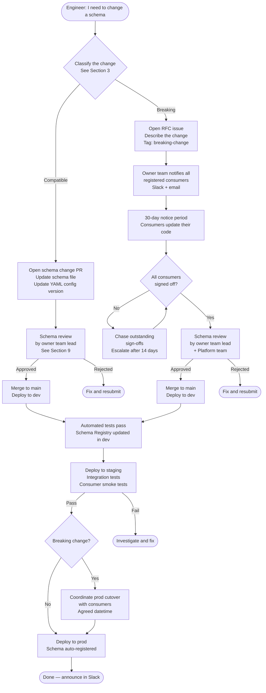
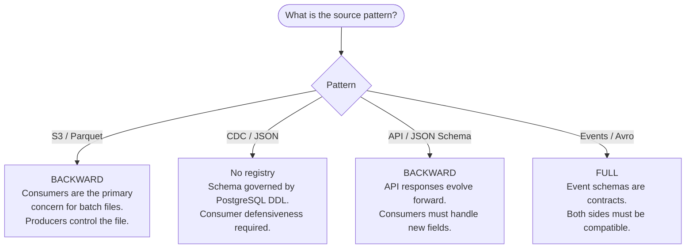

# ODS Platform — Schema Governance
**Date:** 2026-04-15  
**Status:** Draft  
**Scope:** All four ingestion patterns — S3 (batch Parquet), CDC (JSON / Debezium envelope), API (JSON Schema), Event (Avro)

---

## 1. Purpose

This document defines how schemas are owned, versioned, changed, reviewed, and retired on the ODS platform. It applies to every Kafka topic in the `ods.*` namespace and to every schema registered in the AWS Glue Schema Registry (`ods-schema-registry-{env}`).

Without explicit governance, schema changes are the most common cause of silent data loss and consumer outages in streaming platforms. The rules here are not bureaucracy for its own sake — each one maps to a specific failure mode.

---

## 2. Schema Ownership Model

### 2.1 One owner per topic

Every Kafka topic in the `ods.*` namespace must have exactly one named owner. The owner is a team, not an individual, with a named primary contact.

The owner is recorded in:
1. The governance registry table (see Section 12).
2. The dataset YAML config in `ods-config-{env}`:

```yaml
# ods-config-{env}/insurance/policies.yaml
dataset:
  domain: insurance
  name: policies
  target_topic: ods.insurance.policies
  owner:
    team: insurance-data-engineering
    contact: data-engineering@aviva.com
    slack: "#ods-insurance"
  ...
```

A topic without a recorded owner cannot be promoted to staging or prod. The platform CI check enforces this.

### 2.2 What ownership means

Owning a schema means the owner is accountable for:

| Responsibility | Detail |
|---|---|
| Schema correctness | All fields are correctly typed, named, and documented |
| PII classification | All personally identifiable fields are tagged before topic goes live |
| Change initiation | All schema changes (including compatible ones) originate from or are approved by the owner team |
| Consumer notification | Owner team is responsible for informing consumers before breaking changes take effect |
| Breaking change coordination | Owner team runs the consumer sign-off process (Section 8) |
| Deprecation notices | Owner team issues field and topic deprecation notices (Section 11) |

Ownership does not transfer automatically. If a team is disbanded or reorganised, schema ownership must be explicitly reassigned and the YAML config updated before any schema changes are permitted.

### 2.3 Consumer registration

Every team consuming a topic should register as a consumer in PostgreSQL. This is the basis for the consumer notification list used during breaking changes.

```sql
CREATE TABLE pipeline.schema_consumers (
    id             SERIAL PRIMARY KEY,
    topic          VARCHAR NOT NULL,            -- e.g. ods.insurance.policies
    consumer_team  VARCHAR NOT NULL,
    contact_email  VARCHAR NOT NULL,
    slack_channel  VARCHAR,
    registered_at  TIMESTAMP DEFAULT NOW(),
    active         BOOLEAN DEFAULT TRUE
);
```

Consumer registration is not enforced by the platform at runtime, but it is required for consumer sign-off during breaking changes (Section 8).

---

## 3. Change Classification

### 3.1 Definitions

**Compatible change** — a change that existing consumers can handle without any modification. The pipeline auto-registers a new schema version. No consumer sign-off required.

**Breaking change** — a change that will cause a correctly-written existing consumer to fail or silently mis-process data. Requires the full breaking change process (Section 8). Records published under an unresolved breaking schema are routed to the DLQ.

### 3.2 Change matrix — S3 / Parquet

Parquet stores schema in the file footer. The Glue job reads the file schema and validates it against the registry before publishing.

| Change type | Classification | Example |
|---|---|---|
| Add nullable column with default | Compatible | Add `renewal_date TIMESTAMP DEFAULT NULL` |
| Add non-nullable column with default | Compatible | Add `source_system VARCHAR DEFAULT 'legacy'` |
| Widen a numeric type | Compatible | `INT` → `BIGINT` for `policy_id` |
| Remove unused column | **Breaking** | Remove `legacy_ref` — consumers reading it get null or error |
| Add non-nullable column without default | **Breaking** | Add `regulatory_code VARCHAR NOT NULL` — old files have no value |
| Rename a column | **Breaking** | `pol_num` → `policy_number` — consumers referencing old name break |
| Narrow a numeric type | **Breaking** | `BIGINT` → `INT` — existing values may not fit |
| Change column type incompatibly | **Breaking** | `VARCHAR` → `INT` for `status_code` |
| Change a key field | **Breaking (hard rule)** | Rename or remove any field listed in `key_fields` — see Section 10 |
| Reorder columns | Compatible (Parquet) | Parquet is column-named, not positional — readers are unaffected |

### 3.3 Change matrix — CDC / JSON

CDC events use JSON format with the Debezium envelope (`before`, `after`, `op`, `source`, `ts_ms`). There is no schema registry for CDC topics. The authoritative schema is the PostgreSQL table DDL.

Consumer defensiveness is required: consumers must tolerate unknown fields and treat all fields as nullable unless explicitly guaranteed otherwise.

**Envelope changes (Debezium structure — immutable):**

| Change type | Classification | Notes |
|---|---|---|
| Debezium envelope field added | Compatible | Future Debezium versions may add envelope fields — consumers must ignore unknown |
| Debezium envelope field removed | **Breaking** | Consumers depending on that envelope field break |
| `op` value added | Compatible | Consumers must handle unknown op values gracefully |

**Payload changes (PostgreSQL table DDL — owner team controls):**

| Change type | Classification | Example |
|---|---|---|
| Add nullable column | Compatible | `ALTER TABLE policies ADD COLUMN notes TEXT` — appears in `after` / `before`; consumers handle via null-safe access |
| Add NOT NULL column without default | **Breaking** | Existing rows have no value — existing CDC consumers break |
| Remove column | **Breaking** | Consumers expecting the field receive no value |
| Rename a column | **Breaking** | Old field absent, new field present — consumers break |
| Change column type (compatible) | Compatible | `INT` → `BIGINT` — value can be read as either |
| Change column type (incompatible) | **Breaking** | `VARCHAR` → `INT` — existing string values fail |
| Change a key field | **Breaking (hard rule)** | See Section 10 |

> **Important:** Because CDC topics have no schema registry, breaking changes are not caught at the producer side. A DDL change to the source table immediately changes the message shape in all subsequent events. There is no schema validation gate. The source DBA and platform team must coordinate DDL changes for CDC-tracked tables.

### 3.4 Change matrix — API / JSON

API sources are serialised as JSON Schema. JSON Schema compatibility is less strict than Avro — consumers must be written defensively.

| Change type | Classification | Example |
|---|---|---|
| Add optional field | Compatible | Add `"quote_ref": {"type": "string"}` without `required` |
| Add required field | **Breaking** | Old payloads missing the field fail validation |
| Remove optional field | Compatible | Consumers already handle absent fields |
| Remove required field | **Breaking** | Consumers expecting the field receive no value |
| Relax type constraint | Compatible | `"minimum": 1` removed from an integer field |
| Tighten type constraint | **Breaking** | Add `"minimum": 1` — existing records with 0 fail validation |
| Change field type | **Breaking** | `"type": "string"` → `"type": "integer"` |
| Add enum value | Compatible | Consumers must handle unknown enum values gracefully |
| Remove enum value | **Breaking** | Old consumers may have logic branching on that value |
| Rename a field | **Breaking** | No JSON Schema aliasing mechanism |
| Change a key field | **Breaking (hard rule)** | See Section 10 |

### 3.5 Change matrix — Events / Avro

Event sources follow the same Avro matrix as CDC (Section 3.3) with one additional rule: event type fields (the discriminator that identifies the event class) are treated as key fields and are immutable.

---

## 4. Schema Change Request Process

### 4.1 Overview

Compatible changes follow a lightweight path. Breaking changes require consumer sign-off and have a mandatory notice period.



### 4.2 Compatible change — step by step

1. Engineer identifies the change and classifies it using the matrix in Section 3.
2. Engineer updates the schema file (Avro `.avsc`, JSON Schema `.json`, or reflected in YAML config for Parquet).
3. Engineer opens a pull request. PR description must state: the change, the classification, and the affected topic.
4. Owner team lead reviews the PR (Section 9 review criteria apply).
5. PR is merged. CI/CD pipeline deploys to dev: the Glue Schema Registry in `dev` auto-registers the new schema version.
6. Automated schema compatibility check runs against the registry to confirm the new version is accepted.
7. Deploy to staging. Existing consumers run smoke tests against staging.
8. Deploy to prod. Schema auto-registered. Change is live.
9. Engineer posts a brief change notice in the domain Slack channel.

Total elapsed time for a compatible change: typically 1–3 business days.

### 4.3 Breaking change — step by step

1. Engineer classifies the change as breaking.
2. Engineer opens an RFC issue on the platform repository with label `breaking-change`. The RFC must include:
   - The current schema and proposed schema (diff or side-by-side)
   - Why the change is necessary
   - Impact assessment — which consumers are affected and how
   - Proposed cutover date (minimum 30 calendar days from notice)
   - Migration path for consumers
3. Owner team sends notification to all registered consumers (see Section 8.1 for the notification template). Notification channels: email + Slack.
4. 30-day notice period begins. Consumers update their code to handle both the old and new schema.
5. Consumers sign off via the RFC issue (comment "sign-off: [team name]") as they complete testing.
6. Once all consumers have signed off (or the notice period has expired and escalation is resolved), schema review proceeds (Section 9). Review involves owner team lead and one platform team engineer.
7. PR is merged. Deploy to dev → staging following the same path as compatible changes.
8. Staging integration tests must include consumer smoke tests run by at least one registered consumer team.
9. Prod cutover is scheduled at a coordinated datetime agreed with all consumers. Not at a random deploy time.
10. Post-cutover: monitor DLQ and consumer lag for 24 hours.
11. Close RFC issue. Post cutover notice in Slack.

Total elapsed time for a breaking change: minimum 30 days, typically 6–10 weeks.

---

## 5. Compatibility Modes

### 5.1 Avro compatibility modes explained

AWS Glue Schema Registry enforces one of three compatibility modes per registry subject. The mode determines which schema changes are auto-accepted and which are rejected.

| Mode | What it means | Who is protected |
|---|---|---|
| **BACKWARD** | New schema can read data written by the previous schema version | Consumers (readers) |
| **FORWARD** | Previous schema can read data written by the new schema version | Producers (writers) |
| **FULL** | Both BACKWARD and FORWARD simultaneously | Both producers and consumers |
| **NONE** | No compatibility checks — any change accepted | Nobody — dangerous |

**BACKWARD** in practice: if a new schema adds a field with a default, an old consumer reading a new message gets the default. Old messages missing the field are still readable. New schema can always read old data.

**FORWARD** in practice: if a new schema removes a field, an old consumer reading a new message simply does not receive that field. New data can always be read by old code.

**FULL** requires every change to satisfy both constraints simultaneously. It is the most restrictive mode. Adding a field with a default satisfies FULL. Removing any field without a default does not.

### 5.2 Recommended modes per pattern



| Pattern | Format | Registry mode | Rationale |
|---|---|---|---|
| S3 / Parquet | Avro | BACKWARD | Parquet files are produced once. Consumers read them over time. New schema must always read old files. |
| CDC | JSON (Debezium envelope) | None | CDC topics have no schema registry. Schema is governed by PostgreSQL DDL. See §3.3. |
| API / JSON Schema | JSON Schema | BACKWARD | API responses add fields over time. Consumers must handle new fields gracefully without breaking. |
| Events / Avro | Avro | FULL | Events are immutable contracts. Both event producers and consumers must be able to operate across schema versions. |

### 5.3 Who sets the compatibility mode

The compatibility mode for a registry subject is set by the owner team at topic creation time and recorded in the dataset YAML config:

```yaml
dataset:
  domain: insurance
  name: policies
  schema:
    registry: ods-schema-registry-{env}
    subject: insurance-policies
    compatibility_mode: BACKWARD   # BACKWARD | FORWARD | FULL
    format: AVRO                   # AVRO | JSON
```

Changing a compatibility mode is treated as a breaking change and requires the full breaking change process. NONE is not a permitted value on this platform.

---

## 6. Schema Naming Conventions

### 6.1 Registry subject naming

Registry subjects in AWS Glue Schema Registry follow the pattern:

```
{domain}-{dataset}
```

Examples:
- `insurance-policies`
- `insurance-claims`
- `motor-vehicles`
- `finance-transactions`

The subject name is derived directly from the topic name (`ods.{domain}.{dataset}`) by replacing the `ods.` prefix and the `.` separator with a hyphen. This makes the mapping unambiguous.

For versioned topics (see Section 8.4), the version suffix is appended:
- `insurance-policies-v2`

### 6.2 Field naming rules

| Rule | Detail | Example |
|---|---|---|
| Case | `snake_case` only — no camelCase, no PascalCase | `policy_id`, not `policyId` or `PolicyId` |
| Separators | Underscore only — no hyphens, no dots | `renewal_date`, not `renewal-date` |
| Prefix / suffix | No Hungarian notation. No type suffixes. | `start_date`, not `dt_start` or `start_date_str` |
| Abbreviations | Avoid unless the abbreviation is universally understood in the domain | `id` is fine. `pol_nb_cd` is not. |
| Boolean fields | Prefix with `is_` or `has_` | `is_active`, `has_endorsement` |
| Timestamp fields | Suffix with `_at` for point-in-time, `_date` for calendar date only | `created_at`, `effective_date` |
| Arrays | Plural noun | `endorsements`, `drivers` |
| Enum fields | No suffix — the type declaration makes it an enum | `policy_status`, not `policy_status_enum` |

### 6.3 Required vs optional field conventions

| Convention | Rule |
|---|---|
| Key fields | Always required (non-nullable, no default) |
| Business identifier fields | Required unless the source system genuinely does not always provide them |
| Audit fields | `created_at` and `updated_at` are required on all schemas |
| PII fields | May be optional if the source does not always collect them, but must be tagged |
| All optional fields | Must have an explicit default value. `null` is an acceptable default for nullable fields. |
| No implicit defaults | A field cannot be optional without a stated default. This prevents consumer ambiguity. |

### 6.4 PII field tagging

All fields containing personally identifiable information must be tagged in the schema using a `pii` property in the field metadata:

**Avro example:**
```json
{
  "name": "email_address",
  "type": ["null", "string"],
  "default": null,
  "doc": "Customer email address",
  "pii": true,
  "pii_category": "contact"
}
```

**JSON Schema example:**
```json
"email_address": {
  "type": "string",
  "description": "Customer email address",
  "x-pii": true,
  "x-pii-category": "contact"
}
```

Permitted `pii_category` values: `contact`, `financial`, `health`, `identity`, `location`. The schema review checklist (Section 9.2) will reject schemas with untagged PII fields.

### 6.5 Required metadata fields

Every schema on the platform must include the following top-level metadata fields regardless of source pattern:

| Field | Type | Required | Description |
|---|---|---|---|
| `event_id` | UUID string | Yes | Unique ID for this message. Used for deduplication. |
| `created_at` | ISO 8601 timestamp string | Yes | When the source record was created or the event occurred |
| `ingested_at` | ISO 8601 timestamp string | Yes | When the ODS pipeline ingested the record |
| `source_system` | string | Yes | Originating system identifier (e.g. `legacy-policy-admin`) |
| `schema_version` | string | Yes | Schema version at time of publish (e.g. `3`) |

---

## 7. Schema Review Process

### 7.1 Who reviews

| Change type | Reviewers required |
|---|---|
| New topic / schema | Owner team lead + one platform team engineer |
| Compatible change | Owner team lead |
| Breaking change | Owner team lead + one platform team engineer |
| Emergency change | Owner team lead + on-call platform engineer (see Section 11) |

The platform team engineer reviewer role rotates weekly. The current reviewer is posted in `#ods-platform`.

### 7.2 Review checklist

Every schema submitted for review must pass all of the following criteria before the PR is approved:

**Naming and structure**
- [ ] All field names follow `snake_case` convention (Section 6.2)
- [ ] Boolean fields prefixed with `is_` or `has_`
- [ ] Timestamp fields use correct suffix (`_at` vs `_date`)
- [ ] No abbreviations that are not universally understood in the domain
- [ ] Required metadata fields present (`event_id`, `created_at`, `ingested_at`, `source_system`, `schema_version`)

**PII**
- [ ] All PII fields identified and tagged with `pii: true` and `pii_category`
- [ ] No new PII fields added without data protection review sign-off
- [ ] No PII fields in key fields (key fields generate deterministic hashes — PII in keys creates irreversible exposure)

**Key fields**
- [ ] Key fields listed in `key_fields` in YAML config match fields in schema
- [ ] If this is a change, key fields are unchanged (Section 10)
- [ ] Key fields are non-nullable with no default

**Optional fields and defaults**
- [ ] All optional fields have an explicit default value
- [ ] Avro `null` union types have `null` as the first type and `"default": null`

**Compatibility**
- [ ] Compatibility mode for this subject is appropriate for the source pattern (Section 5.2)
- [ ] The proposed change is compatible with the declared compatibility mode
- [ ] Schema has been validated against the Glue Schema Registry in dev before PR is raised

**Documentation**
- [ ] All fields have a `doc` (Avro) or `description` (JSON Schema) string
- [ ] Owner team and contact recorded in YAML config (Section 2.1)
- [ ] Consumer registration table is up to date (Section 2.3)

### 7.3 Review SLA

| Change type | Review SLA |
|---|---|
| Compatible change | 2 business days |
| New topic | 3 business days |
| Breaking change | 5 business days (review starts after consumer sign-off period) |
| Emergency change | 4 hours (Section 11) |

If the SLA is not met, the requester escalates to the platform tech lead.

---

## 8. Key Field Immutability Rule

### 8.1 The rule

Key fields — the fields listed in `key_fields` in the dataset YAML config — are immutable after a topic goes live in any environment. They must never be renamed, retyped, removed, or semantically redefined.

This is a **hard rule** with no exceptions via the normal change process. The platform enforces it via a CI check that rejects any schema change PR that modifies a key field on a topic that has been deployed to staging or prod.

### 8.2 Why this rule exists

Key fields are used to generate deterministic Kafka message keys via a SHA-256 hash:

```
message_key = SHA256(key_field_1 + "|" + key_field_2 + ...)
```

This hash is the identity of a record in the Kafka topic. It determines:

1. **Partition assignment** — all messages for the same logical entity land on the same partition, in order.
2. **Consumer deduplication** — consumers use the key to detect and discard duplicate messages.
3. **Compaction** — if log compaction is enabled, the key determines which record is the "latest" for a given entity.

If a key field changes:
- The hash changes. The same logical record now has a different key in the new schema.
- Old messages (old key) and new messages (new key) for the same entity are on different partitions and appear to consumers as two different entities.
- Log compaction may retain both the old-key and new-key record, leaving a ghost record for the old key.
- Consumers using the key for deduplication will accept duplicates silently.

There is no safe way to change a key field without a full topic migration.

### 8.3 What counts as a key field change

| Action | Counts as key field change |
|---|---|
| Rename the field | Yes |
| Change the field type | Yes |
| Make the field nullable | Yes |
| Change the semantic meaning without renaming | Yes — treat as rename |
| Remove the field from the schema | Yes |
| Remove the field from `key_fields` in YAML (but keep in schema) | Yes — this changes which fields contribute to the hash |
| Add an additional field to `key_fields` | Yes |

### 8.4 Process if a key field change is unavoidable

In rare cases (e.g. a merger or major source system replacement), a key field change may genuinely be necessary. The process is:

1. Raise a platform RFC issue with label `key-field-change`. This requires approval from the platform tech lead, the data architecture lead, and all registered consumers.
2. The new topic is created with a versioned name: `ods.{domain}.{dataset}.v2` with a new subject in the registry: `{domain}-{dataset}-v2`.
3. Both topics run in parallel. The producer publishes to both during the transition window.
4. All consumers migrate to the v2 topic. Consumer sign-off required per consumer (Section 8's consumer sign-off process).
5. Once all consumers are on v2, the v1 topic enters the deprecation process (Section 11).
6. v1 topic is retired after the sunset period.

The original topic (`ods.{domain}.{dataset}`) is never modified. It is deprecated and retired.

---

## 9. Breaking Change Coordination

### 9.1 Consumer notification template

When a breaking change is approved at the RFC stage, the owner team sends the following notification to all registered consumers:

```
Subject: [ODS Breaking Change Notice] ods.{domain}.{dataset} — {brief description}

Topic:          ods.{domain}.{dataset}
Owner team:     {team name}
Change type:    Breaking
Description:    {one paragraph describing the change and why it is necessary}
Current schema: {link to current schema in registry or repository}
New schema:     {link to proposed schema in PR}
Impact:         {which fields are affected, how consumer code will break}
Migration path: {what consumers need to change in their code}
Cutover date:   {proposed date — minimum 30 calendar days from this notice}
Sign-off:       Comment "sign-off: {your team name}" on RFC issue #{issue number}
                when your team has tested against the new schema in staging.
Questions:      {owner team Slack channel}
```

### 9.2 Notice periods

| Change type | Minimum notice period |
|---|---|
| Breaking change (normal) | 30 calendar days |
| Key field change (versioned topic migration) | 90 calendar days |
| Topic deprecation | 60 calendar days (Section 11) |
| Emergency breaking change | 0 — retrospective notice within 24 hours (Section 11) |

### 9.3 Consumer sign-off

Each registered consumer team must explicitly sign off before a breaking change is deployed to prod. Sign-off is recorded as a comment on the RFC issue.

Sign-off means the consumer team has:
1. Updated their consumer code to handle the new schema.
2. Tested against the new schema in staging.
3. Confirmed they are ready for the prod cutover.

If a consumer team does not respond within 21 days of the initial notice, the owner team escalates to the platform tech lead, who escalates to the data architecture lead. Non-responsive teams that have not signed off after 30 days may be overridden by explicit approval from the data architecture lead — this override is recorded in the RFC issue and is a last resort.

### 9.4 Versioned topic strategy

If a breaking change is so significant that it is impractical for all consumers to migrate simultaneously, a versioned topic strategy is used:

1. New topic created: `ods.{domain}.{dataset}.v2`
2. Producer publishes to both `ods.{domain}.{dataset}` and `ods.{domain}.{dataset}.v2` during the transition window.
3. Consumers migrate to v2 at their own pace within the agreed sunset window.
4. `ods.{domain}.{dataset}` is deprecated (Section 11) after all consumers have migrated.

The dual-publish window must not exceed 90 days. After 90 days, the v1 topic enters the sunset process regardless of consumer migration status.

---

## 10. Deprecation and Sunset

### 10.1 Field deprecation

When a field is no longer needed but the topic remains live:

1. The field is marked deprecated in the schema metadata. It is **not removed** at this stage.

**Avro:**
```json
{
  "name": "legacy_ref",
  "type": ["null", "string"],
  "default": null,
  "doc": "Legacy system reference. DEPRECATED: will be removed 2026-09-01. Use policy_id instead.",
  "deprecated": true,
  "deprecated_on": "2026-04-15",
  "sunset_date": "2026-09-01"
}
```

**JSON Schema:**
```json
"legacy_ref": {
  "type": "string",
  "description": "Legacy system reference. DEPRECATED: will be removed 2026-09-01. Use policy_id instead.",
  "x-deprecated": true,
  "x-deprecated-on": "2026-04-15",
  "x-sunset-date": "2026-09-01"
}
```

2. Owner team notifies consumers with 60 days notice.
3. After the sunset date, the field is removed via the breaking change process (Section 4.3).

Fields that are deprecated must still receive valid values during the deprecation window. A deprecated field must not be populated with `null` before the sunset date unless it was already nullable.

### 10.2 Topic deprecation and retirement

When an entire topic is to be retired:

1. Owner team opens a deprecation RFC issue with label `topic-deprecation`.
2. Owner team notifies all registered consumers (60-day minimum notice).
3. Topic is marked deprecated in the governance registry table (Section 12). The YAML config is updated:

```yaml
dataset:
  domain: insurance
  name: policies
  deprecated: true
  deprecated_on: "2026-04-15"
  sunset_date: "2026-06-15"
  deprecation_notice: "Topic retired. Consumers should migrate to ods.insurance.policies.v2."
```

4. During the deprecation window, the producer continues publishing normally.
5. After all consumers have migrated and the sunset date has passed:
   - Producer stops publishing to the topic.
   - Topic remains readable for 14 days post-sunset (consumers can drain any lag).
   - Tombstone messages (null value, entity key) are published for all known key values to signal consumers using log compaction.
   - Topic is deleted from MSK.
   - Registry subject is deactivated (not deleted — schema history is preserved for audit).
   - PostgreSQL `schema_consumers` records are marked inactive.
   - Entry in governance registry table is marked `retired`.

### 10.3 Tombstone strategy

For topics with log compaction enabled, tombstone messages are published before deletion to allow compaction-aware consumers to clean up their local state.

Tombstones are published in a dedicated Airflow DAG (`ods-tombstone-{dataset}`) that:
1. Reads all distinct key values from the topic (via a consumer scan or from the source system).
2. Publishes a null-value message for each key.
3. Waits for consumer lag to reach zero.
4. Proceeds with topic deletion.

---

## 11. Emergency Schema Changes

### 11.1 Definition

An emergency schema change is one required to resolve an active production incident where data is not flowing correctly due to a schema issue and the business impact justifies bypassing the normal process.

Examples:
- A field type is wrong and causing all records to be routed to the DLQ.
- A required field is missing from the schema and causing Glue jobs to fail.
- A PII field was accidentally left untagged in prod and must be corrected immediately.

Non-examples (these are urgent but not emergencies):
- A consumer wants a new field quickly.
- A compatible change that could wait 2 days is inconvenient to wait for.

### 11.2 Fast-track process

```
1. Engineer identifies the incident and confirms a schema change is the fix.
2. Engineer pages the on-call platform engineer via PagerDuty.
3. Owner team lead is notified (phone or Slack — on-call engineer does this if owner lead is unavailable).
4. PR is raised with label emergency-schema-change. Description must include:
   - Incident ticket reference
   - Root cause
   - Proposed change
   - Risk assessment (could the fix cause a different breakage?)
5. On-call platform engineer reviews and approves the PR. One reviewer is sufficient.
6. Change is deployed directly to prod (bypassing the normal dev → staging → prod promotion).
7. Within 24 hours of resolution:
   - Retrospective note posted on the incident ticket.
   - Change is back-applied to dev and staging environments.
   - Consumer notification sent retrospectively (Section 9.1 template with "emergency" noted).
   - RFC issue raised if the change was breaking, for post-hoc tracking.
```

### 11.3 What can be skipped in an emergency

| Step | Can skip? |
|---|---|
| Owner team lead notification | No — must be notified, even if they cannot review |
| Consumer notification | Yes — retrospective notice within 24 hours is acceptable |
| 30-day notice period | Yes |
| Consumer sign-off | Yes — but consumers must be notified immediately after deploy |
| Staging validation | Yes — but change must be back-applied to staging within 24 hours |
| Schema review checklist | Partial — PII check and key field immutability check must still pass |
| Platform tech lead notification | No — must be notified for any prod schema change outside normal process |

### 11.4 What must never be skipped

Regardless of how severe the incident is, the following are never skipped:

1. **Key field immutability check** — changing a key field in an emergency is not permitted. If a key field is genuinely the root cause, the emergency fix must find an alternative path.
2. **PII check** — no schema change may add an untagged PII field to prod, even in an emergency.
3. **Owner team lead notification** — the owner team must be aware of every schema change in prod.
4. **Audit trail** — every emergency change must be recorded in the incident ticket and the RFC issue (post-hoc if necessary).

---

## 12. Schema Registry Governance Table

This table is the authoritative list of all topics and their governance state. It is maintained in PostgreSQL and mirrored in the platform wiki.

```sql
CREATE TABLE pipeline.schema_governance (
    id                  SERIAL PRIMARY KEY,
    topic               VARCHAR NOT NULL UNIQUE,   -- e.g. ods.insurance.policies
    registry_subject    VARCHAR NOT NULL,           -- e.g. insurance-policies
    owner_team          VARCHAR NOT NULL,
    owner_contact       VARCHAR NOT NULL,
    source_pattern      VARCHAR NOT NULL,           -- s3 | cdc | api | event
    format              VARCHAR NOT NULL,           -- AVRO | JSON | PARQUET
    compatibility_mode  VARCHAR NOT NULL,           -- BACKWARD | FORWARD | FULL
    current_version     INTEGER,
    pii_classification  VARCHAR NOT NULL,           -- none | low | medium | high
    pii_fields          TEXT,                       -- comma-separated field names, or null
    status              VARCHAR NOT NULL,           -- active | deprecated | retired
    deprecated_on       DATE,
    sunset_date         DATE,
    created_at          TIMESTAMP DEFAULT NOW(),
    updated_at          TIMESTAMP DEFAULT NOW()
);
```

### Current topic registry (placeholder values)

| Topic | Registry subject | Owner team | Pattern | Format | Compatibility | Version | PII class | Status |
|---|---|---|---|---|---|---|---|---|
| `ods.insurance.policies` | `insurance-policies` | insurance-data-eng | s3 | PARQUET | BACKWARD | 1 | high | active |
| `ods.insurance.claims` | `insurance-claims` | insurance-data-eng | s3 | PARQUET | BACKWARD | 1 | high | active |
| `ods.motor.vehicles` | `motor-vehicles` | motor-data-eng | s3 | PARQUET | BACKWARD | 1 | low | active |
| `ods.motor.drivers` | `motor-drivers` | motor-data-eng | cdc | AVRO | FULL | — | high | planned |
| `ods.finance.transactions` | `finance-transactions` | finance-data-eng | api | JSON | BACKWARD | — | medium | planned |
| `ods.finance.premiums` | `finance-premiums` | finance-data-eng | s3 | PARQUET | BACKWARD | — | medium | planned |
| `ods.customer.profiles` | `customer-profiles` | customer-data-eng | cdc | AVRO | FULL | — | high | planned |
| `ods.customer.interactions` | `customer-interactions` | customer-data-eng | event | AVRO | FULL | — | medium | planned |
| `ods.pipeline.audit` | `pipeline-audit` | platform-team | event | AVRO | BACKWARD | 1 | none | active |
| `ods.pipeline.reconciliation` | `pipeline-reconciliation` | platform-team | event | AVRO | BACKWARD | 1 | none | active |

**PII classification definitions:**

| Class | Meaning |
|---|---|
| `none` | No PII fields |
| `low` | Indirect identifiers only (e.g. vehicle registration) |
| `medium` | Identifiers that combined with other data could identify an individual |
| `high` | Direct PII present (name, email, date of birth, financial account numbers) |

---

## 13. Open Items

| Item | Status | Owner |
|---|---|---|
| CI schema compatibility check implementation | Not started | Platform team |
| Consumer registration tooling (self-service form) | Not started | Platform team |
| Schema lint rules automated in pre-commit | Not started | Platform team |
| PII tagging review by data protection officer | Pending | Data protection |
| Governance table population for planned topics | Pending | Domain teams |
| CDC and Event schema templates (Avro base) | Not started | Platform team |
| Tombstone DAG implementation | Not started | Platform team |

---

## 14. Out of Scope

- Consumer-side schema handling and deserialization code
- Data masking or tokenisation of PII fields (a separate data protection concern)
- Schema migration tooling for existing PostgreSQL RDS tables
- Upstream source system schema governance (each source system is responsible for its own internal schema)
- Kafka Connect connector schema configuration details
