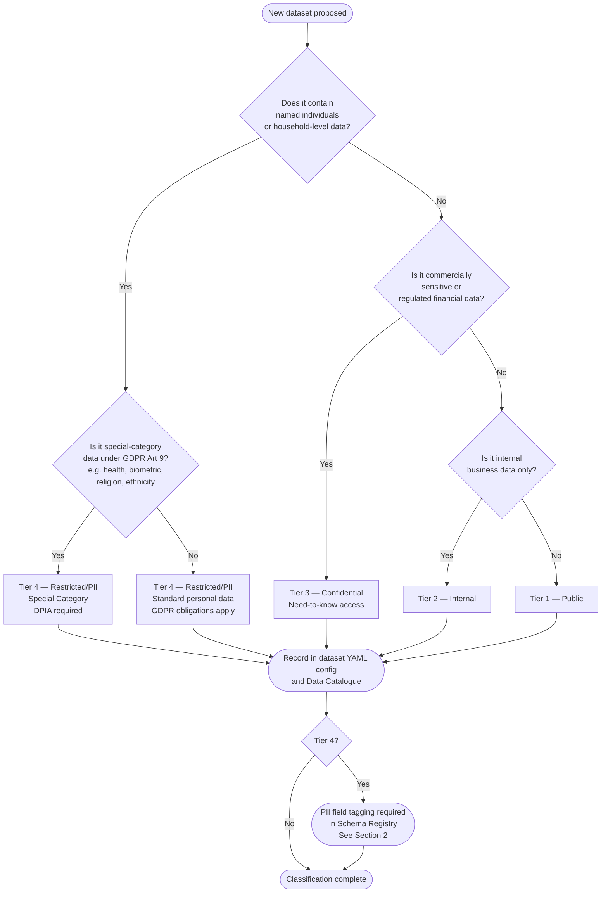
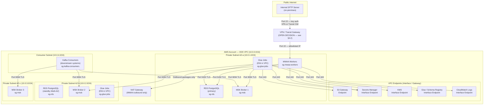

# ODS Platform — Security & Data Privacy Design
**Date:** 2026-04-15  
**Status:** Draft — pending review by Security, Data Governance, and Platform Engineering  
**Scope:** All four ingestion patterns (S3 batch, CDC, API, Event) and all shared platform components

---

## Contents

1. [Data Classification Framework](#1-data-classification-framework)
2. [PII Handling Across Pipeline Layers](#2-pii-handling-across-pipeline-layers)
3. [GDPR Right to Erasure Problem](#3-gdpr-right-to-erasure-problem)
4. [Network Topology](#4-network-topology)
5. [IAM Roles — Least Privilege](#5-iam-roles--least-privilege)
6. [Secrets Management](#6-secrets-management)
7. [Encryption — At Rest and In Transit](#7-encryption--at-rest-and-in-transit)
8. [Access Control Per Data Layer](#8-access-control-per-data-layer)
9. [Audit Trail for Data Access](#9-audit-trail-for-data-access)
10. [Open Decisions](#10-open-decisions)

---

## 1. Data Classification Framework

### 1.1 Classification Tiers

All datasets on the ODS platform must be assigned one of four classification tiers before they are promoted to `staging` or `prod`. Classification is mandatory — an unclassified dataset must be treated as **Restricted** until reviewed.

| Tier | Label | Description | Examples |
|---|---|---|---|
| 1 | **Public** | No confidentiality requirement. Suitable for open publication. | Reference data, postcode lists, published market rates |
| 2 | **Internal** | Business-sensitive but no personal data. Access by all Aviva staff. | Aggregated product metrics, anonymised summary statistics |
| 3 | **Confidential** | Commercially sensitive or regulated financial data. Need-to-know access. | Pricing models, reinsurance treaty terms, claims reserve figures |
| 4 | **Restricted / PII** | Contains personal data as defined under UK GDPR Article 4(1), or special-category data under Article 9. GDPR obligations apply in full. | Customer policies, claims history, health underwriting data, contact details |

**Default rule:** If a dataset has not been classified, treat it as **Restricted / PII**. Do not relax controls on the assumption a dataset is low-tier.

### 1.2 Classification Decision Flow



### 1.3 Who Classifies Datasets

| Role | Responsibility |
|---|---|
| **Data Owner** (domain team) | Initiates classification by completing the dataset registration. Makes the initial tier proposal. |
| **Data Protection Officer (DPO) / Privacy team** | Reviews all Tier 4 proposals. Signs off special-category data. Determines if a DPIA is required. |
| **Platform Engineering** | Enforces classification at the technical layer — ensures YAML config contains `data_classification` before deploying to staging/prod. Blocks deployment if field is absent. |
| **Security** | Reviews Tier 3 and 4 datasets for additional access controls before go-live. |

### 1.4 Where Classification is Stored

Classification is stored in the dataset YAML config file in `ods-config-{env}`. The `data_classification` field is **mandatory**. A new field `pii_fields` must list field names where personal data resides for Tier 4 datasets.

**Updated YAML config structure:**

```yaml
# ods-config-{env}/insurance/policies.yaml
dataset:
  domain: insurance
  name: policies
  source_path: s3://ods-curated-{env}/insurance/policies/
  target_topic: ods.insurance.policies
  schema_id: ods-schema-registry-{env}/insurance-policies
  key_fields:
    - policy_id

  # --- Security & classification fields (mandatory) ---
  data_classification: restricted_pii   # public | internal | confidential | restricted_pii
  pii_fields:                           # required if data_classification = restricted_pii
    - full_name
    - date_of_birth
    - address_line_1
    - address_line_2
    - postcode
    - email
    - phone_number
    - national_insurance_number
  gdpr_erasure_strategy: crypto_shredding  # crypto_shredding | pseudonymise_at_ingest | none
  retention_raw_days: 90                   # how long raw CSV is retained in ods-raw-{env}
  retention_curated_days: 365              # how long curated Parquet is retained in ods-curated-{env}
  # ---

  dq_rules_ref: s3://ods-config-{env}/dq-rules/policies.dqdl
  catalog:
    database: ods_insurance
    table: policies
    crawler: ods-policies-crawler
```

### 1.5 Example Dataset Classification Table

| Domain | Dataset | Tier | PII fields present | GDPR erasure strategy | Notes |
|---|---|---|---|---|---|
| `insurance` | `policies` | Restricted/PII | name, DOB, address, NI number | Crypto-shredding | Core personal data |
| `insurance` | `claims` | Restricted/PII | name, address, bank account | Crypto-shredding | May include health data — check for Art 9 |
| `insurance` | `underwriting_health` | Restricted/PII (Special Category) | health conditions, diagnoses | Crypto-shredding | Art 9 special category — DPIA required |
| `finance` | `reinsurance_treaties` | Confidential | None | None | Commercially sensitive |
| `finance` | `claims_reserves` | Confidential | None | None | Regulatory financial data |
| `product` | `premium_rates` | Confidential | None | None | Pricing model data |
| `reference` | `postcode_lookup` | Public | None | None | No restrictions |
| `reference` | `product_codes` | Internal | None | None | Internal reference only |

---

## 2. PII Handling Across Pipeline Layers

### 2.1 Which Layers May Contain PII

Every layer of the pipeline must be assessed independently. PII does not stop at the source — it flows through every transformation and storage layer until explicitly stripped or encrypted.

| Layer | Contains PII? | Risk | Controls required |
|---|---|---|---|
| SFTP source | Yes | Plaintext PII on source server outside AWS | SFTP access via VPN/PrivateLink only. Credentials in Secrets Manager. Audit SFTP access logs. |
| `ods-raw-{env}` (raw CSV) | Yes | Plaintext PII at rest | SSE-KMS with dataset-specific KMS key. S3 bucket policy: deny all except Glue ETL execution role and designated engineers. Retention capped by `retention_raw_days` in YAML config. |
| `ods-curated-{env}` (Parquet) | Yes | PII in columnar format — more queryable than CSV | SSE-KMS. S3 bucket policy: deny all except Glue Publish execution role. Parquet is efficiently queryable — access must be strictly controlled. |
| MSK Kafka topics (`ods.{domain}.{dataset}`) | Conditional | If crypto-shredding strategy: encrypted PII field values in topic. If pseudonymisation: no PII. | MSK encryption at rest and in transit. Topic-level ACLs (see Section 8). If crypto-shredding, PII fields are ciphertext — consumer must hold the decryption key. |
| `ods-dlq-{env}` (DLQ) | Yes — high risk | DLQ may hold failed records that contain PII, including malformed records that bypassed DQ | SSE-KMS. Strict access: DLQ must not be readable by anyone outside Security and Platform Engineering. DLQ retention policy enforced. |
| `ods-audit-sink-{env}` | Conditional | Audit events include `source_ref` (S3 path) and `record_count` but not record content — low PII risk | SSE-KMS. Access limited to compliance and platform teams. Audit schema must be reviewed to ensure record content is never included. |
| `pipeline.glue_job_log` (PostgreSQL) | Conditional | `source_path` and `error_detail` fields may contain PII if error messages include raw values | RDS encryption. Read-only role for engineers. `error_detail` column must be reviewed — Glue job error messages must not include raw PII field values. |
| `ods-quarantine-{env}` | Yes | Quarantined files may contain PII | Same controls as `ods-raw-{env}`. Quarantine retention policy: 30 days maximum. |
| CloudWatch Logs (`/ods/{env}/glue`, `/ods/{env}/airflow`) | Risk | Glue job logs must not emit PII values — accidental logging of row content would expose PII in CloudWatch | Code review gate: Glue job code must not log record field values. Structured logging only. Log group KMS encryption. |

### 2.2 Field-Level PII Tagging in Schema Registry

AWS Glue Schema Registry supports custom metadata tags on schema fields. All Tier 4 datasets must have PII fields tagged in the schema definition.

**Example Avro schema with PII tags:**

```json
{
  "type": "record",
  "name": "Policy",
  "namespace": "com.aviva.ods.insurance",
  "fields": [
    {
      "name": "policy_id",
      "type": "string",
      "doc": "Primary key — not PII"
    },
    {
      "name": "full_name",
      "type": "string",
      "doc": "PII:personal_data — UK GDPR Art 4(1)"
    },
    {
      "name": "date_of_birth",
      "type": "string",
      "doc": "PII:personal_data — UK GDPR Art 4(1)"
    },
    {
      "name": "national_insurance_number",
      "type": "string",
      "doc": "PII:personal_data — UK GDPR Art 4(1); government identifier"
    },
    {
      "name": "health_condition",
      "type": ["null", "string"],
      "default": null,
      "doc": "PII:special_category — UK GDPR Art 9; health data"
    },
    {
      "name": "premium_amount",
      "type": "double",
      "doc": "Not PII"
    }
  ]
}
```

PII tag convention:
- `PII:personal_data` — standard personal data (Art 4(1))
- `PII:special_category` — special-category data (Art 9)
- `PII:pseudonym` — a pseudonymised value; the original PII has been replaced (apply after pseudonymisation at ingest)

These tags serve as machine-readable signals for downstream tooling — consumers can inspect the schema to determine whether a field requires special handling before processing.

---

## 3. GDPR Right to Erasure Problem

### 3.1 The Problem

UK GDPR Article 17 grants data subjects the right to request erasure of their personal data. When a request is received, Aviva must be able to demonstrate that all stored copies of the subject's personal data have been deleted or rendered unrecoverable.

The ODS platform creates a fundamental conflict with this right: **Kafka topics are append-only and immutable by design.** Records published to `ods.{domain}.{dataset}` cannot be selectively deleted. Kafka's compaction feature can remove records with a given message key, but:

1. Kafka compaction is eventually-consistent and non-deterministic in timing — it does not guarantee immediate deletion.
2. Compaction removes the latest version of a key, but not necessarily all historical versions in all log segments.
3. MSK (AWS-managed Kafka) compaction behaviour is governed by broker configuration not easily controlled per-record.
4. Compacted records may still exist in consumer offsets, DLQ copies, and audit sinks.

This problem extends beyond Kafka. The ODS platform stores PII in at least five locations: `ods-raw-{env}`, `ods-curated-{env}`, MSK topics, `ods-dlq-{env}`, and `ods-audit-sink-{env}`. A complete erasure response must address all five.

This is not a theoretical risk — it is a pre-go-live blocker for any Tier 4 dataset.

### 3.2 Strategy A — Crypto-Shredding

**How it works:**

1. At ingest, each data subject (identified by a unique entity key such as `policy_holder_id`) is assigned a unique AES-256 encryption key stored in AWS KMS.
2. All PII fields for that subject are encrypted using their per-entity key before the record is written to Kafka, S3 Curated, or any downstream layer.
3. The non-PII fields (including the entity key identifier) are stored in plaintext and remain fully queryable.
4. When an erasure request is received, Aviva deletes the KMS key for that entity. The encrypted PII fields are now computationally unrecoverable — the data is effectively erased without physically deleting the Kafka record.

**Architecture for this platform:**

```
Entity Key Registry:
  Table: privacy.entity_keys
  Columns: entity_id VARCHAR, kms_key_id VARCHAR, created_at TIMESTAMP, deleted_at TIMESTAMP

On ingest (Glue job):
  1. Look up KMS key for entity_id (or create one via KMS GenerateDataKey)
  2. Encrypt PII fields with data key (envelope encryption)
  3. Store encrypted ciphertext in Kafka record field value
  4. Publish record to Kafka

On erasure request:
  1. Mark entity_keys.deleted_at = NOW()
  2. Schedule KMS key deletion (minimum 7-day waiting period per AWS)
  3. After key deletion, existing Kafka records with encrypted PII are unreadable
```

**Trade-offs of crypto-shredding:**

| Advantage | Disadvantage |
|---|---|
| No Kafka record deletion required — operational safety | Per-entity KMS key adds per-record latency at ingest (KMS GenerateDataKey call) |
| Historical records remain structurally intact for lineage and audit | Downstream consumers must decrypt PII fields before use — adds complexity |
| Works across all layers simultaneously (Kafka, S3, DLQ all contain only ciphertext) | KMS key management at scale: 10 million customers = 10 million KMS keys. AWS KMS has per-account limits and costs. |
| Erasure is cryptographically verifiable | AWS KMS minimum deletion waiting period is 7 days — cannot satisfy an immediate erasure demand |
| Does not require Kafka topic modifications | Entity key registry (PostgreSQL table) is itself a sensitive asset and must be protected |

### 3.3 Strategy B — Pseudonymisation at Ingest

**How it works:**

1. The Glue ETL job (DAG 2, ingestion pipeline) replaces PII field values with a deterministic pseudonym (e.g. HMAC-SHA256 of the field value keyed with a platform secret) before writing to `ods-curated-{env}`.
2. The pseudonymised record is what gets published to Kafka — the Kafka topic never contains real PII.
3. The mapping from real value to pseudonym is stored in a secure re-identification table (PostgreSQL, strict access). For erasure, the re-identification mapping row is deleted.
4. The raw PII source data in `ods-raw-{env}` is subject to the retention policy (`retention_raw_days`) and must also be deleted on erasure.

**Trade-offs of pseudonymisation at ingest:**

| Advantage | Disadvantage |
|---|---|
| Kafka topics are never exposed to real PII — simplest downstream compliance posture | Pseudonymised data has limited analytical value — cannot cross-reference with external PII sources without re-identification |
| Erasure of raw layer satisfies GDPR without touching Kafka | Re-identification table is highly sensitive — its compromise is worse than a direct data breach |
| No per-record decryption overhead for consumers | Deterministic pseudonyms are reversible if the HMAC key is exposed — this is pseudonymisation, not anonymisation |
| Simpler KMS architecture | If re-identification is ever needed for legitimate purposes (e.g. customer service), access governance for the re-identification table is complex |

### 3.4 Recommendation for This Platform

**Recommended strategy: Crypto-shredding (Strategy A)** for Tier 4 datasets where Kafka consumers need to process identifiable PII (e.g. claims processing, policy administration systems).

**Rationale:**

- The ODS platform is a data distribution layer — downstream systems (policy admin, claims) may legitimately need to receive and process PII. Pseudonymisation would require every downstream consumer to hold re-identification capability, which multiplies the re-identification risk across many systems rather than centralising it.
- Crypto-shredding keeps the distribution architecture intact while placing the erasure capability in a single, auditable location: the KMS key registry.
- AWS KMS envelope encryption means the per-entity key overhead is manageable: the Glue job calls `GenerateDataKey` once per entity per job run, uses the data key locally to encrypt all PII fields for that entity, and caches the data key in memory for the duration of the job. Only the encrypted data key is stored — not the plaintext key.

**Risk mitigations for crypto-shredding on this platform:**

1. The `privacy.entity_keys` PostgreSQL table must have a separate, tightly controlled IAM role — not accessible via the standard pipeline service account.
2. KMS key deletion must trigger an automated alert and a 24-hour review window before the deletion waiting period begins.
3. A quarterly audit of entity keys must verify that deleted keys correspond to confirmed erasure requests and that no active pipeline depends on a deleted key.
4. The 7-day KMS minimum deletion wait must be disclosed to the DPO — GDPR Article 12(3) allows up to one month to respond to erasure requests; 7 days is within this window.

**Exception:** Datasets where downstream consumers have no legitimate need for identifiable PII (e.g. `postcode_lookup`, aggregate statistics) should use **pseudonymisation at ingest** — it is simpler and eliminates Kafka PII exposure entirely.

---

## 4. Network Topology

### 4.1 Required VPC Design

All ODS platform components must run within a single dedicated AWS VPC (`ods-vpc`) per environment. No component should be publicly accessible.

| Component | Subnet | Justification |
|---|---|---|
| AWS MSK (Kafka brokers) | Private subnet (multi-AZ, no internet route) | Brokers must not be internet-accessible. Consumer access via VPC only. |
| PostgreSQL RDS | Private subnet (multi-AZ, no internet route) | Database must never be internet-reachable. |
| AWS Glue jobs | Private subnet (Glue VPC connector) | Glue jobs run in AWS-managed infrastructure but connect into the ODS VPC via Glue network connection. |
| MWAA workers | Private subnet | MWAA requires a private subnet with NAT Gateway for outbound internet access (package downloads, Airflow). |
| AWS Glue Schema Registry | AWS-managed (VPC endpoint recommended) | Access via `com.amazonaws.{region}.glue` VPC interface endpoint to avoid public internet. |
| AWS Secrets Manager | AWS-managed (VPC endpoint required) | Glue jobs and MWAA must resolve Secrets Manager via `com.amazonaws.{region}.secretsmanager` VPC endpoint — no NAT for secrets retrieval. |
| S3 buckets | AWS-managed (VPC Gateway endpoint required) | All S3 access must route through `com.amazonaws.{region}.s3` VPC Gateway endpoint — not via NAT. |
| KMS | AWS-managed (VPC endpoint required) | `com.amazonaws.{region}.kms` VPC interface endpoint — required for SSE-KMS operations in Glue. |
| EventBridge | AWS-managed | EventBridge rules fire from within AWS; no VPC config required. CloudTrail must log all EventBridge API calls. |
| CloudWatch | AWS-managed (VPC endpoint recommended) | `com.amazonaws.{region}.logs` and `com.amazonaws.{region}.monitoring` VPC endpoints. |
| Internal SFTP server | On-premises / separate network | **Open decision** — see Section 4.2 and Section 10. |

### 4.2 SFTP Connectivity

Connectivity from MWAA to the internal SFTP server is an open decision. Three options:

| Option | Description | Trade-offs |
|---|---|---|
| **VPN (Site-to-Site)** | IPsec VPN between Aviva on-premises and the ODS VPC | Simple, well-understood. Adds VPN Gateway cost. Suitable if SFTP is the only cross-boundary connection. |
| **AWS Transit Gateway** | Hub-and-spoke network connecting ODS VPC to on-premises via Direct Connect or VPN | Preferred if multiple VPCs or multiple on-premises sites need connectivity. Higher operational complexity. |
| **AWS PrivateLink** | SFTP server exposed as a VPC Endpoint Service | Only viable if SFTP server runs behind an NLB and is on AWS. Not applicable for on-premises SFTP. |

**Interim control (until decision is made):** SFTP host must be allowlisted by IP in the MWAA security group. SFTP must use key-based authentication (not password). MWAA workers must not have unrestricted outbound internet access.

### 4.3 Security Group Rules

| Security Group | Inbound | Outbound |
|---|---|---|
| `sg-mwaa-workers` | None from internet | Port 443 to VPC endpoints (Secrets Manager, S3, Glue, KMS, CloudWatch). Port 22 to SFTP server IP only. Port 5432 to `sg-rds`. |
| `sg-glue-jobs` | None | Port 443 to VPC endpoints (S3, Secrets Manager, Glue Schema Registry, KMS, MSK). Port 9094 (TLS) to `sg-msk`. Port 5432 to `sg-rds`. |
| `sg-msk` | Port 9094 (TLS) from `sg-glue-jobs` and `sg-kafka-consumers` only | None (brokers do not initiate outbound connections) |
| `sg-rds` | Port 5432 from `sg-mwaa-workers` and `sg-glue-jobs` only | None |
| `sg-kafka-consumers` | None | Port 9094 to `sg-msk` |

### 4.4 VPC Architecture Diagram



---

## 5. IAM Roles — Least Privilege

### 5.1 Principles

1. One IAM role per component. Roles are not shared across components.
2. S3 permissions are resource-specific — wildcards on `arn:aws:s3:::*` are forbidden.
3. No `*` actions. Each action is explicitly listed.
4. Production roles are separate from non-production roles.
5. All roles have a trust policy scoped to the specific AWS service — no `"Principal": "*"`.
6. `iam:PassRole` is permitted only to the specific target role ARN.

### 5.2 IAM Role Table

| Role | Trusted by | Purpose |
|---|---|---|
| `ods-mwaa-execution-role-{env}` | `airflow.amazonaws.com` | DAG execution: trigger Glue jobs, read config, write CloudWatch, read/update PostgreSQL state via JDBC |
| `ods-glue-ingestion-role-{env}` | `glue.amazonaws.com` | S3→Curated ETL: read `ods-raw-{env}`, write `ods-curated-{env}`, write `ods-dlq-{env}`, write PostgreSQL, write CloudWatch, read Schema Registry, read Secrets Manager |
| `ods-glue-publish-role-{env}` | `glue.amazonaws.com` | Curated→Kafka: read `ods-curated-{env}`, write MSK (produce), read Schema Registry, write `ods-dlq-{env}`, write PostgreSQL, read Secrets Manager, use KMS (for PII encryption) |
| `ods-eventbridge-target-role-{env}` | `events.amazonaws.com` | Invoke MWAA — specifically `airflow:CreateCliToken` for the ODS MWAA environment only |
| `ods-kafka-connect-role-{env}` | `ec2.amazonaws.com` or MSK Connect service | S3 Sink Connector: write to `ods-audit-sink-{env}` only, read MSK (`ods.pipeline.audit` topic only) |

### 5.3 MWAA Execution Role

```json
{
  "Version": "2012-10-17",
  "Statement": [
    {
      "Sid": "ReadConfig",
      "Effect": "Allow",
      "Action": ["s3:GetObject", "s3:GetObjectVersion"],
      "Resource": "arn:aws:s3:::ods-config-{env}/*"
    },
    {
      "Sid": "TriggerGlueJobs",
      "Effect": "Allow",
      "Action": ["glue:StartJobRun", "glue:GetJobRun", "glue:BatchStopJobRun"],
      "Resource": "arn:aws:glue:{region}:{account}:job/ods-*"
    },
    {
      "Sid": "WriteCloudWatch",
      "Effect": "Allow",
      "Action": ["cloudwatch:PutMetricData", "logs:CreateLogStream", "logs:PutLogEvents"],
      "Resource": [
        "arn:aws:logs:{region}:{account}:log-group:/ods/{env}/airflow:*",
        "*"
      ],
      "Condition": {
        "StringEquals": {"cloudwatch:namespace": "ods/{env}"}
      }
    },
    {
      "Sid": "ReadSecretsForSFTP",
      "Effect": "Allow",
      "Action": ["secretsmanager:GetSecretValue"],
      "Resource": "arn:aws:secretsmanager:{region}:{account}:secret:ods/{env}/sftp/*"
    },
    {
      "Sid": "ReadSecretsForRDS",
      "Effect": "Allow",
      "Action": ["secretsmanager:GetSecretValue"],
      "Resource": "arn:aws:secretsmanager:{region}:{account}:secret:ods/{env}/rds/*"
    },
    {
      "Sid": "Deny",
      "Effect": "Deny",
      "Action": [
        "s3:DeleteObject", "s3:PutBucketPolicy",
        "iam:*", "kms:DeleteAlias", "kms:ScheduleKeyDeletion"
      ],
      "Resource": "*"
    }
  ]
}
```

**What this role must NOT have:** write access to `ods-raw-{env}` or `ods-curated-{env}`. MWAA reads config only — data writes are performed exclusively by Glue.

### 5.4 Glue Publish Execution Role

```json
{
  "Version": "2012-10-17",
  "Statement": [
    {
      "Sid": "ReadCurated",
      "Effect": "Allow",
      "Action": ["s3:GetObject", "s3:ListBucket"],
      "Resource": [
        "arn:aws:s3:::ods-curated-{env}",
        "arn:aws:s3:::ods-curated-{env}/*"
      ]
    },
    {
      "Sid": "WriteDLQ",
      "Effect": "Allow",
      "Action": ["s3:PutObject"],
      "Resource": "arn:aws:s3:::ods-dlq-{env}/*"
    },
    {
      "Sid": "ReadConfig",
      "Effect": "Allow",
      "Action": ["s3:GetObject", "s3:GetObjectVersion"],
      "Resource": "arn:aws:s3:::ods-config-{env}/*"
    },
    {
      "Sid": "SchemaRegistry",
      "Effect": "Allow",
      "Action": [
        "glue:GetRegistry", "glue:GetSchema", "glue:GetSchemaVersion",
        "glue:RegisterSchemaVersion", "glue:QuerySchemaVersionValidity"
      ],
      "Resource": "arn:aws:glue:{region}:{account}:registry/ods-schema-registry-{env}"
    },
    {
      "Sid": "MSKProduce",
      "Effect": "Allow",
      "Action": ["kafka-cluster:Connect", "kafka-cluster:WriteData", "kafka-cluster:DescribeTopic"],
      "Resource": [
        "arn:aws:kafka:{region}:{account}:cluster/ods-msk-{env}/*",
        "arn:aws:kafka:{region}:{account}:topic/ods-msk-{env}/*/ods.*"
      ]
    },
    {
      "Sid": "KMSForPII",
      "Effect": "Allow",
      "Action": ["kms:GenerateDataKey", "kms:Decrypt", "kms:DescribeKey"],
      "Resource": "arn:aws:kms:{region}:{account}:key/*",
      "Condition": {
        "StringLike": {"kms:RequestAlias": "alias/ods-pii-{env}-*"}
      }
    },
    {
      "Sid": "ReadSecretsForMSK",
      "Effect": "Allow",
      "Action": ["secretsmanager:GetSecretValue"],
      "Resource": "arn:aws:secretsmanager:{region}:{account}:secret:ods/{env}/msk/*"
    },
    {
      "Sid": "WriteCloudWatch",
      "Effect": "Allow",
      "Action": ["cloudwatch:PutMetricData", "logs:CreateLogStream", "logs:PutLogEvents"],
      "Resource": "*",
      "Condition": {
        "StringEquals": {"cloudwatch:namespace": "ods/{env}"}
      }
    },
    {
      "Sid": "DenyDangerousActions",
      "Effect": "Deny",
      "Action": [
        "s3:DeleteObject", "s3:PutBucketPolicy", "s3:DeleteBucket",
        "s3:PutObject",
        "iam:*", "kms:ScheduleKeyDeletion", "kms:DeleteAlias"
      ],
      "Resource": "*"
    }
  ]
}
```

Note the explicit `Deny` on `s3:PutObject` in the last statement. The Glue Publish role reads from `ods-curated-{env}` but must never write back to it.

### 5.5 EventBridge Target Role

```json
{
  "Version": "2012-10-17",
  "Statement": [
    {
      "Sid": "InvokeMWAA",
      "Effect": "Allow",
      "Action": ["airflow:CreateCliToken"],
      "Resource": "arn:aws:airflow:{region}:{account}:environment/ods-mwaa-{env}"
    }
  ]
}
```

This role has exactly one permission. It cannot read data, access S3, or invoke any other service.

### 5.6 Kafka Connect Role

```json
{
  "Version": "2012-10-17",
  "Statement": [
    {
      "Sid": "WriteAuditSink",
      "Effect": "Allow",
      "Action": ["s3:PutObject"],
      "Resource": "arn:aws:s3:::ods-audit-sink-{env}/*"
    },
    {
      "Sid": "MSKConsume",
      "Effect": "Allow",
      "Action": [
        "kafka-cluster:Connect", "kafka-cluster:ReadData",
        "kafka-cluster:DescribeGroup", "kafka-cluster:AlterGroup",
        "kafka-cluster:DescribeTopic"
      ],
      "Resource": [
        "arn:aws:kafka:{region}:{account}:cluster/ods-msk-{env}/*",
        "arn:aws:kafka:{region}:{account}:topic/ods-msk-{env}/*/ods.pipeline.audit",
        "arn:aws:kafka:{region}:{account}:group/ods-msk-{env}/*/kafka-connect-audit-sink"
      ]
    }
  ]
}
```

**What this role must NOT have:** read or write access to any topic other than `ods.pipeline.audit`.

---

## 6. Secrets Management

### 6.1 Mandatory Rule

**No credentials may be stored in plaintext.** The following are explicitly prohibited:
- SFTP username/password in an MWAA Connection object stored in the Airflow metadata database
- RDS connection string with password in a Glue environment variable
- MSK credentials in source code or YAML config files
- Credentials in MWAA environment variable store

All credentials must be stored in AWS Secrets Manager and retrieved at runtime.

### 6.2 Secret Inventory

| Secret path | Content | Rotated by | Rotation schedule |
|---|---|---|---|
| `ods/{env}/sftp/{host}/credentials` | SFTP private key (PEM) + username | Manual (coordinated with SFTP server admin) | 90 days |
| `ods/{env}/rds/ods-postgres` | PostgreSQL host, port, database, username, password | Secrets Manager automatic rotation (Lambda) | 30 days |
| `ods/{env}/msk/sasl-credentials` | MSK SASL/SCRAM username and password | Manual (until MSK IAM auth is confirmed) | 90 days |
| `ods/{env}/pii/entity-key-hmac` | HMAC key used for pseudonymisation (if strategy B is adopted) | Manual with dual-control approval | 180 days |

**Preferred long-term:** MSK IAM authentication eliminates the need for SASL credentials entirely — the Glue execution role acts as the Kafka identity. This must be evaluated when the MSK cluster is configured.

### 6.3 How Glue Jobs Retrieve Secrets at Runtime

Glue jobs retrieve secrets using the boto3 Secrets Manager client. The secret is fetched once at job startup and held in memory for the duration of the job run. It is never written to disk, printed to logs, or passed as a command-line argument.

```python
import boto3
import json

def get_secret(secret_name: str, region: str) -> dict:
    client = boto3.client("secretsmanager", region_name=region)
    response = client.get_secret_value(SecretId=secret_name)
    return json.loads(response["SecretString"])

# In Glue job entrypoint:
rds_creds = get_secret("ods/prod/rds/ods-postgres", "eu-west-1")
jdbc_url = (
    f"jdbc:postgresql://{rds_creds['host']}:{rds_creds['port']}"
    f"/{rds_creds['database']}"
)
```

The Glue job IAM role (`ods-glue-publish-role-{env}`) has `secretsmanager:GetSecretValue` restricted to the specific secret ARN patterns shown in Section 5.4. A Glue publish job cannot read SFTP credentials, and a Glue ingestion job cannot read MSK credentials, even if it calls the same `get_secret` function — the IAM deny will block it.

### 6.4 MWAA Connection Configuration

MWAA `SFTPOperator` connections must use the Secrets Manager backend, not the Airflow metadata database. This is configured via the MWAA environment variable:

```
AIRFLOW__SECRETS__BACKEND = airflow.providers.amazon.aws.secrets.secrets_manager.SecretsManagerBackend
AIRFLOW__SECRETS__BACKEND_KWARGS = {"connections_prefix": "ods/{env}/sftp", "variables_prefix": "ods/{env}/airflow-vars"}
```

With this configuration, `conn_id = "sftp_aviva_internal"` in a DAG causes Airflow to look up `ods/{env}/sftp/sftp_aviva_internal` in Secrets Manager — never touching the Airflow database.

**Risk if this is not implemented:** The current architecture decision log (Section 5.2 of `2026-04-14-architecture-decisions.md`) flags that SFTP credentials may be stored as plaintext in the MWAA Connection store. This is a **high severity** risk — plaintext credentials in the Airflow metadata database are accessible to anyone with MWAA UI access and to the RDS PostgreSQL instance that backs it.

### 6.5 Secret Rotation

All Secrets Manager secrets must have rotation enabled. For RDS PostgreSQL, Secrets Manager provides a native rotation Lambda (`SecretsManagerRDSPostgreSQLRotationSingleUser`) that rotates the password and updates both the secret and the RDS instance atomically. No pipeline downtime is required during rotation — the new secret is staged before the old one expires.

For SFTP key rotation: the new key pair must be generated and the public key uploaded to the SFTP server before the old private key is deleted from Secrets Manager. Rotation requires coordination with the SFTP server administrator and a maintenance window. Document this process in a runbook.

---

## 7. Encryption — At Rest and In Transit

### 7.1 KMS Key Strategy

One KMS key per purpose, per environment. Do not reuse keys across data sensitivity tiers.

| KMS Key alias | Protects | Key administrator | Auto-rotation |
|---|---|---|---|
| `alias/ods-s3-raw-{env}` | `ods-raw-{env}` bucket (raw CSV, may contain PII) | Security team | Annual (AWS KMS default) |
| `alias/ods-s3-curated-{env}` | `ods-curated-{env}` bucket (Parquet, may contain PII) | Security team | Annual |
| `alias/ods-s3-dlq-{env}` | `ods-dlq-{env}` bucket | Security team | Annual |
| `alias/ods-s3-audit-{env}` | `ods-audit-sink-{env}` and `ods-quarantine-{env}` | Security team | Annual |
| `alias/ods-s3-config-{env}` | `ods-config-{env}` bucket | Platform Engineering | Annual |
| `alias/ods-rds-{env}` | RDS PostgreSQL instance | Security team | Annual |
| `alias/ods-msk-{env}` | MSK cluster at-rest encryption | Security team | Annual |
| `alias/ods-pii-{env}-{entity_type}` | Per-entity PII encryption (crypto-shredding) | Privacy team (dual-control) | Manual — deletion is the erasure mechanism |
| `alias/ods-logs-{env}` | CloudWatch Log Group encryption | Platform Engineering | Annual |

**Key ownership rule:** Key policy must explicitly deny `kms:ScheduleKeyDeletion` and `kms:DeleteAlias` to all IAM roles except the Security team's break-glass role. This prevents accidental erasure of KMS keys by pipeline service accounts.

### 7.2 Encryption At Rest

| Component | Mechanism | KMS Key |
|---|---|---|
| `ods-raw-{env}` | SSE-KMS | `alias/ods-s3-raw-{env}` |
| `ods-curated-{env}` | SSE-KMS | `alias/ods-s3-curated-{env}` |
| `ods-dlq-{env}` | SSE-KMS | `alias/ods-s3-dlq-{env}` |
| `ods-audit-sink-{env}` | SSE-KMS | `alias/ods-s3-audit-{env}` |
| `ods-quarantine-{env}` | SSE-KMS | `alias/ods-s3-audit-{env}` |
| `ods-config-{env}` | SSE-KMS | `alias/ods-s3-config-{env}` |
| RDS PostgreSQL (`ods_{env}`) | RDS encryption (KMS) | `alias/ods-rds-{env}` |
| MSK cluster | MSK at-rest encryption (KMS) | `alias/ods-msk-{env}` |
| CloudWatch Log Groups | KMS encrypted log group | `alias/ods-logs-{env}` |
| Secrets Manager secrets | Secrets Manager default KMS | AWS-managed (per-account) |

**S3 bucket policy enforcement — deny unencrypted PutObject:**

```json
{
  "Sid": "DenyUnencryptedPut",
  "Effect": "Deny",
  "Principal": "*",
  "Action": "s3:PutObject",
  "Resource": "arn:aws:s3:::ods-raw-{env}/*",
  "Condition": {
    "StringNotEquals": {
      "s3:x-amz-server-side-encryption": "aws:kms"
    }
  }
}
```

Apply this statement to all ODS S3 buckets. This denies any `PutObject` call that does not specify SSE-KMS — preventing accidental unencrypted writes even if the bucket default is not applied.

### 7.3 Encryption In Transit

| Connection | Protocol | Notes |
|---|---|---|
| Glue → MSK | TLS 1.2+ (port 9094) | `security.protocol=SSL` in Kafka producer config. Broker certificate must be validated — do not set `ssl.endpoint.identification.algorithm=` to empty string. |
| Glue → RDS PostgreSQL | TLS via JDBC | `jdbc:postgresql://host:5432/db?ssl=true&sslmode=verify-full&sslrootcert=/path/to/rds-ca.pem` |
| Glue → Secrets Manager | HTTPS via VPC endpoint | Enforced by VPC endpoint policy. |
| Glue → S3 | HTTPS via VPC Gateway endpoint | S3 bucket policy must deny `aws:SecureTransport = false`. |
| MWAA → RDS PostgreSQL | TLS via psycopg2 | `sslmode=verify-full` in connection string. |
| MWAA → Secrets Manager | HTTPS via VPC endpoint | |
| MWAA → SFTP | SSH (sftp protocol over SSH) | Key-based auth only. Password auth must be disabled on the SFTP server. |
| Kafka consumers → MSK | TLS 1.2+ (port 9094) | All consumers must use the TLS listener. Plaintext listener (port 9092) must be disabled on the MSK cluster. |
| Kafka Connect → MSK | TLS 1.2+ (port 9094) | Same as above. |

**S3 bucket policy enforcement — deny non-TLS access:**

```json
{
  "Sid": "DenyNonTLS",
  "Effect": "Deny",
  "Principal": "*",
  "Action": "s3:*",
  "Resource": [
    "arn:aws:s3:::ods-raw-{env}",
    "arn:aws:s3:::ods-raw-{env}/*"
  ],
  "Condition": {
    "Bool": {"aws:SecureTransport": "false"}
  }
}
```

Apply to all ODS S3 buckets.

---

## 8. Access Control Per Data Layer

### 8.1 S3 Bucket Access Matrix

| Bucket | Reader | Writer | Deny (explicit) |
|---|---|---|---|
| `ods-raw-{env}` | `ods-glue-ingestion-role-{env}` | SFTP→S3 operator (MWAA execution role — write only), MWAA execution role (list only for DAG state check) | All other roles. Engineers read via named IAM user with MFA, audited via CloudTrail. |
| `ods-curated-{env}` | `ods-glue-publish-role-{env}`, Glue Crawler execution role | `ods-glue-ingestion-role-{env}` | All consumers. Consumers read from Kafka topics, not from S3 Curated directly. |
| `ods-dlq-{env}` | Security team (break-glass role), Platform Engineering (read-only) | `ods-glue-ingestion-role-{env}`, `ods-glue-publish-role-{env}` | All other roles. |
| `ods-config-{env}` | `ods-mwaa-execution-role-{env}`, `ods-glue-ingestion-role-{env}`, `ods-glue-publish-role-{env}` | Platform Engineering (deployment role only) | Engineers must not modify config directly in prod — config changes go via CI/CD pipeline. |
| `ods-audit-sink-{env}` | `ods-kafka-connect-role-{env}` (write), Compliance team (read) | `ods-kafka-connect-role-{env}` | All other roles. |
| `ods-quarantine-{env}` | Security team only | Glue Ingestion role (write on SFTP quarantine failures) | All engineers. |

### 8.2 MSK Topic-Level ACLs

MSK supports IAM-based access control or ACL-based access control. ACLs are recommended for topic-level granularity.

| Principal | Topic pattern | Permission | Notes |
|---|---|---|---|
| `ods-glue-publish-role-{env}` | `ods.*` | `WRITE` | Publish role can produce to all ODS topics |
| `ods-glue-publish-role-{env}` | `ods.*` | `DESCRIBE` | Required to check offsets for reconciliation |
| `ods-kafka-connect-role-{env}` | `ods.pipeline.audit` | `READ` | Sink connector consumes audit topic only |
| `downstream-system-role-{domain}` | `ods.{domain}.*` | `READ` | Domain consumers read only their domain topics |
| `ods-mwaa-execution-role-{env}` | None | None | MWAA does not produce to or consume from Kafka directly |

**Deny rule:** No consumer group should have `WRITE` permission to any `ods.*` topic. Only the Glue publish role produces to domain topics.

**Audit topic protection:** The `ods.pipeline.audit` topic must have `WRITE` restricted to the Glue publish role and the Glue ingestion role. No consumer should be able to produce to the audit topic.

**Reconciliation topic:** `ods.pipeline.reconciliation` — same `WRITE` restriction. Producers: Glue publish role only.

### 8.3 PostgreSQL RDS Roles

```sql
-- Pipeline service account (used by Glue jobs and MWAA)
CREATE ROLE ods_pipeline_svc LOGIN PASSWORD '...' -- password from Secrets Manager
  NOSUPERUSER NOCREATEDB NOCREATEROLE;
GRANT CONNECT ON DATABASE ods_{env} TO ods_pipeline_svc;
GRANT USAGE ON SCHEMA pipeline TO ods_pipeline_svc;
GRANT SELECT, INSERT, UPDATE ON pipeline.file_state TO ods_pipeline_svc;
GRANT SELECT, INSERT ON pipeline.glue_job_log TO ods_pipeline_svc;  -- INSERT only; no UPDATE/DELETE
GRANT SELECT, INSERT, UPDATE ON pipeline.ingestion_file_state TO ods_pipeline_svc;
-- No DELETE on any table.

-- Privacy service account (used for crypto-shredding key management only)
CREATE ROLE ods_privacy_svc LOGIN PASSWORD '...'
  NOSUPERUSER NOCREATEDB NOCREATEROLE;
GRANT USAGE ON SCHEMA privacy TO ods_privacy_svc;
GRANT SELECT, INSERT, UPDATE ON privacy.entity_keys TO ods_privacy_svc;
-- This role has NO access to the pipeline schema.

-- Engineer read-only role (for operational queries; not for application use)
CREATE ROLE ods_engineer_ro NOLOGIN;
GRANT CONNECT ON DATABASE ods_{env} TO ods_engineer_ro;
GRANT USAGE ON SCHEMA pipeline TO ods_engineer_ro;
GRANT SELECT ON ALL TABLES IN SCHEMA pipeline TO ods_engineer_ro;
-- No access to privacy schema.

-- Individual engineer access via named role
CREATE ROLE eng_jsmith LOGIN;
GRANT ods_engineer_ro TO eng_jsmith;
```

**Key controls:**
- `ods_pipeline_svc` has no `DELETE` on any table — the job log and file state are never deleted by the pipeline.
- `ods_engineer_ro` has no access to `privacy.entity_keys` — the crypto-shredding key registry is isolated.
- Individual engineer accounts must use MFA via IAM when connecting via AWS SSO / RDS IAM authentication. Shared credentials are prohibited.

### 8.4 Glue Data Catalog Resource Policy

The Glue Data Catalog (`ods_{domain}` databases) must be protected with a resource policy that restricts access to authorised IAM roles only.

```json
{
  "Version": "2012-10-17",
  "Statement": [
    {
      "Sid": "AllowPipelineRoles",
      "Effect": "Allow",
      "Principal": {
        "AWS": [
          "arn:aws:iam::{account}:role/ods-glue-publish-role-{env}",
          "arn:aws:iam::{account}:role/ods-glue-ingestion-role-{env}"
        ]
      },
      "Action": [
        "glue:GetDatabase", "glue:GetTable", "glue:GetTables",
        "glue:CreateTable", "glue:UpdateTable",
        "glue:GetPartition", "glue:CreatePartition", "glue:UpdatePartition",
        "glue:BatchCreatePartition"
      ],
      "Resource": [
        "arn:aws:glue:{region}:{account}:catalog",
        "arn:aws:glue:{region}:{account}:database/ods_*",
        "arn:aws:glue:{region}:{account}:table/ods_*/*"
      ]
    },
    {
      "Sid": "DenyExternalAccess",
      "Effect": "Deny",
      "Principal": "*",
      "Action": "glue:*",
      "Resource": "arn:aws:glue:{region}:{account}:database/ods_*",
      "Condition": {
        "StringNotLike": {
          "aws:PrincipalArn": [
            "arn:aws:iam::{account}:role/ods-glue-*",
            "arn:aws:iam::{account}:role/ods-mwaa-*",
            "arn:aws:iam::{account}:role/data-engineers-*"
          ]
        }
      }
    }
  ]
}
```

---

## 9. Audit Trail for Data Access

### 9.1 Audit Coverage Matrix

| Layer | Mechanism | What is logged | Retention | Storage |
|---|---|---|---|---|
| S3 (all ODS buckets) | S3 Server Access Logging | Every GET, PUT, DELETE — requester identity, bucket, key, status code, bytes transferred | 365 days | `ods-audit-sink-{env}/s3-access-logs/{bucket}/` |
| MSK (Kafka brokers) | MSK broker logs to CloudWatch + S3 | Producer/consumer connections, authentication events, topic operations | 90 days (CloudWatch), 365 days (S3) | CloudWatch: `/ods/{env}/msk-broker-logs`, S3: `ods-audit-sink-{env}/msk-broker-logs/` |
| RDS PostgreSQL | RDS audit logging (pgaudit extension) | All DDL, all DML on `pipeline` and `privacy` schemas, all connection events | 90 days | CloudWatch: `/ods/{env}/rds-audit` |
| IAM / API actions | AWS CloudTrail | All API calls in the ODS account — role assumptions, KMS key operations, Secrets Manager reads, S3 API calls, Glue job starts | 365 days | S3: `ods-audit-sink-{env}/cloudtrail/` |
| Glue job execution | CloudWatch Logs | Job start/end, schema validation events, DQ results, publish counts | 90 days | CloudWatch: `/ods/{env}/glue` |
| MWAA DAG execution | MWAA logs to CloudWatch | Task start/end, task retries, DAG trigger events | 90 days | CloudWatch: `/ods/{env}/airflow` |
| Pipeline audit events | Kafka `ods.pipeline.audit` → S3 via Kafka Connect | Per-pipeline-run structured event (see Section 7 of `2026-04-14-s3-kafka-design.md`) | 365 days | `ods-audit-sink-{env}/pipeline-audit/` |
| KMS key operations | CloudTrail (KMS events) | `GenerateDataKey`, `Decrypt`, `ScheduleKeyDeletion` — requester, key ID, timestamp | 365 days | Included in CloudTrail above |

### 9.2 Audit Log Access Control

Audit logs must be readable only by authorised roles. Logs in `ods-audit-sink-{env}` must not be modifiable or deletable by pipeline service accounts.

```json
{
  "Sid": "AuditSinkWriteOnly",
  "Effect": "Allow",
  "Principal": {
    "AWS": [
      "arn:aws:iam::{account}:role/ods-kafka-connect-role-{env}",
      "arn:aws:iam::{account}:service-role/S3ServerAccessLogsDelivery"
    ]
  },
  "Action": ["s3:PutObject"],
  "Resource": "arn:aws:s3:::ods-audit-sink-{env}/*"
},
{
  "Sid": "AuditSinkReadOnlyForCompliance",
  "Effect": "Allow",
  "Principal": {
    "AWS": "arn:aws:iam::{account}:role/ods-compliance-reader-role"
  },
  "Action": ["s3:GetObject", "s3:ListBucket"],
  "Resource": [
    "arn:aws:s3:::ods-audit-sink-{env}",
    "arn:aws:s3:::ods-audit-sink-{env}/*"
  ]
},
{
  "Sid": "DenyDeleteForEveryone",
  "Effect": "Deny",
  "Principal": "*",
  "Action": ["s3:DeleteObject", "s3:DeleteBucket"],
  "Resource": [
    "arn:aws:s3:::ods-audit-sink-{env}",
    "arn:aws:s3:::ods-audit-sink-{env}/*"
  ]
}
```

MFA Delete must be enabled on `ods-audit-sink-{env}`. This means no object can be deleted without MFA, even by the bucket owner. This is an important tamper-evidence control.

### 9.3 pgaudit Configuration

Enable pgaudit on the RDS PostgreSQL instance for comprehensive query-level audit logging:

```sql
-- RDS parameter group settings:
-- shared_preload_libraries = 'pgaudit'
-- pgaudit.log = 'write, ddl, role, connection'
-- pgaudit.log_relation = on
-- pgaudit.log_catalog = off  -- reduce noise from catalog queries

-- Per-schema audit override (maximise coverage on sensitive schemas):
ALTER SYSTEM SET pgaudit.log = 'all';  -- for privacy schema only
```

pgaudit logs are streamed to CloudWatch Logs group `/ods/{env}/rds-audit`. An alert must fire if pgaudit log delivery stops — silent audit failure is a compliance gap.

### 9.4 CloudTrail Configuration

A dedicated CloudTrail trail must log all management and data events for the ODS account:

- **Management events:** All API calls (IAM, KMS, Glue, MSK, EventBridge, MWAA, Secrets Manager).
- **Data events (S3):** `GetObject`, `PutObject`, `DeleteObject` on all `ods-*` buckets.
- **Data events (KMS):** All KMS key operations — critical for crypto-shredding audit.
- **Log file validation:** Enabled — CloudTrail will generate and verify log file digests to detect tampering.
- **CloudTrail log encryption:** SSE-KMS with a dedicated key `alias/ods-cloudtrail-{env}`.

---

## 10. Open Decisions

The following security decisions are unresolved. Each represents a **risk that must be addressed before production go-live** unless otherwise noted.

| # | Decision | Risk if unresolved | Recommended resolution | Priority |
|---|---|---|---|---|
| 1 | **SFTP connectivity model** — VPN vs Transit Gateway vs PrivateLink | MWAA workers may require unrestricted outbound internet access as a workaround — significantly expands attack surface | Evaluate Transit Gateway if other on-premises connectivity is planned. Use Site-to-Site VPN as minimum viable option. | **Blocker** |
| 2 | **MSK authentication mode** — SASL/SCRAM vs IAM auth | SASL/SCRAM requires storing MSK credentials in Secrets Manager and rotating them; IAM auth is zero-credential | Prefer MSK IAM authentication. Confirm MSK cluster version and Kafka client library support. If not feasible, use SASL/SCRAM with Secrets Manager rotation. | **Blocker** |
| 3 | **GDPR erasure strategy per dataset** — crypto-shredding vs pseudonymisation | Without a decided strategy, no Tier 4 dataset can go to production — GDPR compliance cannot be asserted | Adopt crypto-shredding as default for consumer-facing datasets. Pseudonymisation for internal analytics datasets. Document decision per dataset in YAML config. | **Blocker** |
| 4 | **KMS key ownership** — which team owns each key | If key ownership is unclear, key rotation will be skipped and key deletion (for erasure) will be ungoverned | Security team owns all PII-related keys. Platform Engineering owns config/infra keys. Dual-control for PII entity keys. Formalise in a RACI. | **High** |
| 5 | **VPC topology and subnet CIDR allocation** | Without defined subnets, security group rules cannot be finalised and network peering cannot be planned | Complete VPC design using the architecture in Section 4. Assign CIDRs and document in infrastructure-as-code. | **High** |
| 6 | **Data classification for existing datasets** | Datasets already flowing through the pipeline may be Tier 4 without controls applied | Run a data classification exercise on all planned datasets before staging deployment. Block unclassified datasets at the CI/CD config validation stage. | **High** |
| 7 | **CloudWatch Log Group encryption** | Glue and Airflow logs may contain PII (via error messages) and are currently unencrypted | Enable KMS encryption on `/ods/{env}/glue` and `/ods/{env}/airflow` immediately. Add a code review gate to prevent PII values appearing in log output. | **High** |
| 8 | **MFA Delete on S3 audit bucket** | Audit logs can be deleted by the bucket owner without MFA — tamper-evidence is weak | Enable MFA Delete on `ods-audit-sink-{env}` and `ods-cloudtrail-{env}` buckets. Requires root account action. | **High** |
| 9 | **`glue_job_log` retention policy** — archive after N days | Table grows indefinitely. Old rows may contain `error_detail` with PII values in exception messages. | Define a 90-day active retention policy. Archive to `ods-audit-sink-{env}/job-log-archive/` via a nightly Glue job. Drop rows from PostgreSQL after archival. | **Medium** |
| 10 | **Glue job log PII leakage via `error_detail`** | If a Glue job catches an exception that includes a raw field value (e.g. in a type-casting error), that PII value will be written to `pipeline.glue_job_log.error_detail` | Code review: exception messages in Glue jobs must never include raw field values. Use field names and positions only. Add to code review checklist. | **Medium** |
| 11 | **DLQ access control** — DLQ contains raw PII rows | DLQ files in `ods-dlq-{env}` contain the exact failing records — if those records contain PII, the DLQ is a high-risk PII store with no current access control defined | Apply strict bucket policy (see Section 8.1). Add DLQ to the erasure workflow — on a crypto-shredding erasure request, verify the DLQ does not contain rows for the target entity. | **Medium** |
| 12 | **Quarantine bucket access control** | `ods-quarantine-{env}` is currently undocumented in terms of access control and retention | Apply the same controls as `ods-raw-{env}`. Define a 30-day quarantine retention policy. | **Medium** |
| 13 | **SFTP server audit logging** | MWAA accesses the SFTP server to download files. If the SFTP server does not have access logging, there is no audit trail for what was downloaded and when | Require the SFTP server administrator to enable and retain access logs. Include SFTP access log review in the incident response process. | **Medium** |
| 14 | **Consumer authentication to MSK** | Downstream consumer IAM roles and ACL grants have not been defined | Define one IAM role per consuming system per domain. Grant `READ` on domain-specific topic patterns only. Document in a consumer onboarding guide. | **Medium** |
| 15 | **DPIA requirement for special-category data** | If any dataset contains Art 9 special-category data (health, biometric, etc.) and no DPIA has been completed, processing that data is unlawful under UK GDPR Article 35 | Conduct dataset classification exercise immediately. If any dataset is Art 9, halt ingestion until DPIA is complete and approved by DPO. | **Blocker** |

---

## Appendix A — Security Controls Summary

| Control | Status |
|---|---|
| All S3 buckets encrypted with SSE-KMS | **To implement** — bucket creation must enforce this |
| All S3 buckets deny non-TLS access | **To implement** — add bucket policy to all buckets |
| All S3 buckets deny unencrypted PutObject | **To implement** — add bucket policy to all buckets |
| MSK encryption at rest and in transit | **To implement** — MSK cluster config |
| RDS encryption at rest | **To implement** — RDS instance config |
| Glue→MSK TLS (port 9094 only) | **To implement** — Glue job Kafka config |
| Glue→RDS TLS (JDBC sslmode=verify-full) | **To implement** — Glue connection config |
| Secrets Manager for all credentials | **To implement** — SFTP credentials gap is flagged as high risk |
| IAM least-privilege roles (per component) | **To implement** — not yet defined |
| MSK topic-level ACLs | **To implement** — not yet defined |
| PostgreSQL named service accounts with limited grants | **To implement** — not yet defined |
| GDPR erasure strategy per Tier 4 dataset | **Decision required** — see Section 3 |
| Data classification in YAML config | **To implement** — field not yet in config schema |
| PII field tagging in Schema Registry | **To implement** — schemas not yet tagged |
| CloudTrail with log validation + KMS encryption | **To implement** |
| S3 server access logging to audit sink | **To implement** |
| pgaudit enabled on RDS | **To implement** |
| MFA Delete on audit bucket | **Decision required** + root account action |
| VPC with private subnets and VPC endpoints | **To implement** — topology not yet defined |
| Security group rules (per component) | **To implement** — see Section 4.3 |

---

## Document History

| Date | Change |
|---|---|
| 2026-04-15 | Initial version — covers all four ingestion patterns and all shared platform components |
