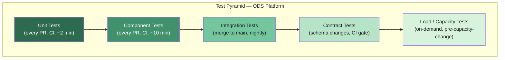
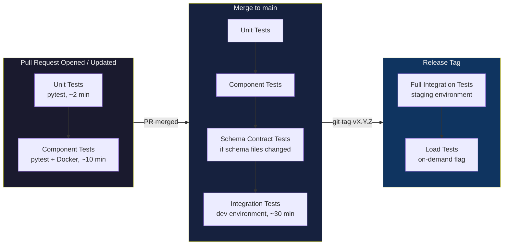

# ODS Platform — Testing Strategy

**Date:** 2026-04-15
**Status:** Approved for implementation
**Scope:** S3 batch ingestion pattern (current); CDC, API, and Event patterns (added 2026-04-15)

---

## Table of Contents

1. [Testing Philosophy](#1-testing-philosophy)
2. [Test Levels](#2-test-levels)
3. [Test Scenarios Matrix](#3-test-scenarios-matrix)
4. [Test Data Management](#4-test-data-management)
5. [CI/CD Integration](#5-cicd-integration)
6. [Glue Job Local Testing](#6-glue-job-local-testing)
7. [DAG Testing](#7-dag-testing)
8. [Schema Contract Testing](#8-schema-contract-testing)
9. [Idempotency Test](#9-idempotency-test)
10. [Test Environment Requirements](#10-test-environment-requirements)
11. [CDC Component Testing](#11-cdc-component-testing)
12. [Event Component Testing](#12-event-component-testing)
13. [API DAG Component Testing](#13-api-dag-component-testing)

---

## 1. Testing Philosophy

### 1.1 The Data Pipeline Test Pyramid

Data pipelines present a testing challenge that differs from application code. The core tension: the most important pipeline behaviour — "does the right data arrive in Kafka in the right shape?" — cannot be verified by testing individual functions in isolation. Pipeline code is, by nature, glue between external systems.



**Why integration tests carry more weight here than in typical application code:**

Pipeline logic — schema validation, DQDL rule evaluation, Kafka offset tracking, idempotency checks — only behaves correctly when the full data layer is present. A Glue job that passes all unit tests may silently truncate a column during Parquet conversion, lose records during a Kafka producer flush, or compute the wrong offset delta because the consumer group was in an unexpected state. None of these failures are detectable without real infrastructure.

**The danger of over-mocking:**

When a Glue job is tested by mocking the S3 read, mocking the Spark DataFrame, and mocking the Kafka producer, the test proves only that the code calls the right methods in the right order. It says nothing about whether the data is correct. The classic failure mode: all mocked tests pass, but in production the DynamicFrame schema inference selects the wrong type for a nullable column and every record silently drops that field.

**The testing goal for this platform:**

> High confidence that any given file, submitted through the pipeline, produces exactly the expected records in MSK — with the correct key, correct schema, correct count — and that every failure mode routes to the correct DLQ or quarantine path, updates PostgreSQL state correctly, and raises the correct CloudWatch alarm.

This confidence can only come from tests that use a real (or realistic) data layer. The investment in integration test infrastructure pays for itself on the first production incident it prevents.

### 1.2 Testing Principles

- **Test behaviour, not implementation.** Tests assert on observable outputs (Kafka records, PostgreSQL state, DLQ presence) not on internal method calls.
- **Realistic data layer.** Component tests use a real local PostgreSQL; integration tests use real AWS services. Mocks are limited to external services that cannot run locally (MWAA in component tests, third-party SFTP in unit tests).
- **Deterministic test data.** All test files are synthetically generated with a known row count, schema version, and DQ failure rate. No production data, ever.
- **Isolation.** Each test run uses a unique `run_id`. Topics, S3 prefixes, and PostgreSQL schemas are namespaced by `run_id` to prevent cross-contamination.
- **Idempotency is king.** The idempotency test (Section 9) is the single most important test. It must pass on every merge to main.

---

## 2. Test Levels

### 2.1 Unit Tests

**What is tested:**
Pure Python logic with no I/O dependencies.

- YAML config parsing and validation (required fields, type checking, pattern validation)
- Filename date extraction — parsing `business_date` from a filename using the configured regex pattern
- Message key generation — SHA256 hash of concatenated key field values
- DQ rule evaluation logic — the Python layer that builds DQDL rule strings from config, not the Glue DQDL executor

**What is NOT mocked (real):** Nothing external is needed — these are pure functions.

**What IS mocked:** Not applicable. If a unit test requires a mock, the code under test is too coupled and should be refactored.

**Tooling:** `pytest`, `pytest-cov`

**Who runs it:** Developer (pre-commit), CI on every PR.

**Target runtime:** Under 2 minutes.

---

### 2.2 Component Tests

**What is tested:**
Individual Glue job logic executed against a real local Spark session and a real local PostgreSQL instance (Docker). No MSK. No S3 (replaced with local filesystem paths or mocked S3 via `moto`).

- CSV → Parquet conversion correctness (column types, null handling, row count preservation)
- Schema validation logic (checking a DynamicFrame against a registered schema)
- DQ rule evaluation — does a dataset with known failures produce the expected `ruleset_evaluation` outcome?
- Idempotency guard logic — does the job correctly detect `file_state = completed` in PostgreSQL and exit early?
- Count comparison logic — given a source count and a Kafka offset delta, does the comparison pass/fail correctly?
- Config loading and version pinning — does the job read the config version captured at job-start, ignoring subsequent changes?

**What is NOT mocked (real):**
- Local PySpark session (via `aws-glue-libs` Docker image)
- Local PostgreSQL (Docker Compose)
- Local filesystem (for S3 input/output simulation)

**What IS mocked:**
- S3 (via `moto` or local path substitution)
- MSK / Kafka producer (verify that `send()` was called with the correct arguments; use `unittest.mock`)
- Glue Schema Registry API (return a canned schema response)
- CloudWatch `put_metric_data` calls

**Tooling:** `pytest`, `pyspark` (via aws-glue-libs), `Docker Compose` (PostgreSQL), `moto`, `pytest-docker`

**Who runs it:** CI on every PR.

**Target runtime:** Under 10 minutes.

---

### 2.3 Integration Tests

**What is tested:**
Full pipeline end-to-end against real AWS services in the `dev` environment. A test file is deposited in S3, the MWAA DAG is triggered, and the test waits for the expected outcome in Kafka and PostgreSQL.

- Happy path: file ingested, all records in Kafka, PostgreSQL state = completed, count reconciled
- Idempotency: same file submitted twice, Kafka shows no duplicates, second run skipped in PostgreSQL
- DLQ routing: incompatible schema → DLQ topic receives the message; Kafka main topic receives nothing
- Schema auto-registration: new optional field → schema auto-registered in Glue Registry, records published
- DQ hard block (dataset-level): entire file routed to DLQ, PostgreSQL state = failed
- DQ hard block (row-level): failing rows to DLQ, passing rows in main topic
- Checksum mismatch: file moved to quarantine prefix in S3, alarm raised
- Count mismatch: undelivered records to DLQ, PostgreSQL state = count_mismatch

**What is NOT mocked (real):**
- AWS MSK (dev cluster)
- AWS Glue (dev environment)
- MWAA (dev environment)
- PostgreSQL RDS (test schema in dev instance)
- S3 (test prefix in dev bucket)
- EventBridge (dev bus)

**What IS mocked:** Nothing. The value of this test suite comes from its fidelity to production.

**Tooling:** `pytest`, `boto3`, `confluent-kafka` (consumer to assert on Kafka records), `psycopg2`

**Who runs it:** CI on merge to main, nightly scheduled run.

**Target runtime:** Under 30 minutes (pipeline latency dominated by Glue startup ~5 min per job).

---

### 2.4 Contract Tests

**What is tested:**
Schema compatibility between the ODS producer and downstream consumers. Uses the Glue Schema Registry compatibility check API.

- A proposed schema change (new optional field) passes `BACKWARD` compatibility check
- A proposed schema change (removing a required field) fails `BACKWARD` compatibility check
- A proposed schema change (changing a field type) fails compatibility check
- The current registered schema matches the schema expected by downstream consumers (consumer contract)

**What is NOT mocked (real):**
- AWS Glue Schema Registry (dev environment)

**What IS mocked:** Nothing relevant to the compatibility assertion.

**Tooling:** `pytest`, `boto3` (Glue Schema Registry API)

**Who runs it:** CI as a gate whenever a schema file (`schemas/*.avsc` or `schemas/*.json`) changes. Runs before integration tests.

**Target runtime:** Under 2 minutes (API calls only).

---

### 2.5 Load / Capacity Tests

**What is tested:**
Platform behaviour under burst load — multiple files arriving simultaneously.

- Burst N files (N = 10, 50, 100) simultaneously into S3 → measure MWAA DAG queue depth
- Glue DPU consumption per concurrent job
- End-to-end latency from S3 deposit to Kafka commit under load
- MSK partition throughput under burst load
- PostgreSQL connection pool exhaustion (RDS max connections)

**What is NOT mocked (real):** All AWS services (staging environment).

**What IS mocked:** Nothing.

**Tooling:** Custom Python harness (`tests/load/`), `locust` (for controlled concurrency), AWS CloudWatch for metric collection post-run.

**Who runs it:** On-demand, before any planned capacity change or scaling event. Requires staging environment.

**Target runtime:** 60–120 minutes (includes warm-up and cool-down).

---

## 3. Test Scenarios Matrix

| # | Scenario | Test Level | Component Under Test | Expected Outcome | DLQ Expected? | Alarm Expected? |
|---|----------|------------|---------------------|-----------------|---------------|-----------------|
| 1 | Happy path: valid file, all records published | Integration | Full pipeline | PostgreSQL state=completed; Kafka record count matches source; no DLQ records | No | No |
| 2 | File not in `pipeline.file_catalogue` | Integration | Publish DAG / file approval check | File moved to S3 quarantine prefix; PostgreSQL state=quarantined | No | Yes — FileNotApproved |
| 3 | File already processed (idempotency guard) | Integration | Idempotency check (PostgreSQL file_state) | Second submission: Glue job exits early; no new Kafka records; PostgreSQL unchanged | No | No |
| 4 | Checksum mismatch (S3 ETag vs catalogue) | Integration | Ingestion DAG checksum task | File moved to quarantine; PostgreSQL state=failed; alarm raised | No | Yes — ChecksumMismatch |
| 5 | Schema incompatible (breaking change — remove required field) | Contract + Integration | Glue publish job + Schema Registry | Compatibility check fails; file routed to DLQ topic; main topic unchanged; PostgreSQL state=schema_error | Yes | Yes — SchemaIncompatible |
| 6 | Schema compatible (new optional field — auto-register) | Contract + Integration | Glue publish job + Schema Registry | New schema version auto-registered; all records published to main topic; PostgreSQL state=completed | No | No |
| 7 | DQ dataset-level hard block (RowCount = 0) | Component + Integration | Glue ETL job DQDL evaluation | Entire job fails; file routed to DLQ; PostgreSQL state=dq_failed | Yes | Yes — DQHardBlock |
| 8 | DQ row-level hard block (some rows fail key completeness check) | Component + Integration | Glue ETL job DQDL row-level evaluation | Failing rows to DLQ; passing rows continue to Kafka; PostgreSQL state=completed_with_errors | Yes (row subset) | Yes — DQRowBlock |
| 9 | DQ soft warn (rows fail non-critical rule) | Component + Integration | Glue ETL job DQDL evaluation | All rows continue; CloudWatch metric `dq_soft_warn_count` emitted; PostgreSQL state=completed | No | No (metric only) |
| 10 | Count mismatch (Kafka offset delta < source row count) | Integration | Glue publish job reconciliation | Undelivered records to DLQ; PostgreSQL state=count_mismatch; alarm raised | Yes | Yes — CountMismatch |
| 11 | Glue job crash mid-publish (simulate SIGKILL during Kafka transaction) | Integration | Glue publish job + Kafka transaction | Kafka transaction rolled back (no partial commit); PostgreSQL state=failed; alarm raised | No | Yes — GlueJobFailed |
| 12 | Config change during in-flight job | Component + Integration | Config version pinning | Running job uses config version captured at start; new config version not applied until next run | No | No |
| 13 | Same file submitted twice simultaneously (race condition on idempotency) | Integration | PostgreSQL file_state locking | Exactly one Glue job proceeds; second exits with state=skipped; Kafka has no duplicates | No | No |
| 14 | Business date extraction from filename | Unit | `extract_business_date()` function | Correct date parsed; job proceeds with correct `business_date` partition value | No | No |
| 15 | Null key field in record | Component + Integration | Message key generation + DQ key completeness rule | Record fails key completeness DQ rule; routed to DLQ; main topic does not receive record with null key | Yes | Yes — DQRowBlock |

**CDC pattern scenarios**

| # | Scenario | Test Level | Component Under Test | Expected Outcome | DLQ Expected? | Alarm Expected? |
|---|----------|------------|---------------------|-----------------|---------------|-----------------|
| C1 | CDC INSERT: new row in source DB | Component + Integration | Debezium connector + MSK topic | INSERT event arrives in Kafka with correct key (source PK) and correct `after` value | No | No |
| C2 | CDC UPDATE: existing row modified in source DB | Component + Integration | Debezium connector + ExtractNewRecordState SMT | UPDATE event arrives with correct `before` and `after` fields (envelope) or correct new value (if SMT unwrapped) | No | No |
| C3 | CDC DELETE: row deleted from source DB | Component + Integration | Debezium connector + tombstone logic | Tombstone message (null value) arrives in Kafka with correct key | No | No |
| C4 | CDC initial snapshot: full table snapshot | Integration | Debezium initial snapshot + MSK | Snapshot completes; Kafka record count matches `SELECT COUNT(*)` from source table | No | No |
| C5 | CDC schema change (compatible): new nullable column added to source table | Integration | Debezium schema evolution + Avro mapping | Debezium auto-evolves schema; pipeline continues; new column present in subsequent events | No | No |
| C6 | CDC schema change (breaking): required column dropped from source table | Integration | Debezium schema evolution + DLQ routing | Alarm fires; event routed to DLQ; pipeline halted | Yes | Yes — SchemaIncompatible |
| C7 | CDC connector restart: connector stopped and restarted | Integration | MSK Connect + LSN checkpoint in `cdc_source_catalogue` | Pipeline resumes from last committed LSN; no missed events; no duplicates | No | No |
| C8 | CDC sequence gap: connector paused mid-stream, source DB writes continue | Integration | MSK Connect + LSN checkpoint | On resume, all events written during pause are delivered in order; no gaps in Kafka | No | No |

**API pattern scenarios**

| # | Scenario | Test Level | Component Under Test | Expected Outcome | DLQ Expected? | Alarm Expected? |
|---|----------|------------|---------------------|-----------------|---------------|-----------------|
| A1 | API happy path: API returns 3 pages of records | Component + Integration | MWAA DAG + API fetch task + Kafka publish | All records from all 3 pages published to Kafka; cursor advances to end of last page | No | No |
| A2 | API pagination gap: page N missing in test data | Component | Reconciliation check in DAG | Gap detected; reconciliation metric emitted; optional alarm if threshold exceeded | No | Yes — PaginationGap (if configured) |
| A3 | API rate limit: API returns HTTP 429 | Component | API fetch task retry logic | DAG retries with exponential backoff; eventual success; all records published | No | No |
| A4 | API cursor idempotency: DAG runs twice for the same cursor window | Component + Integration | Deterministic message key generation + Kafka dedup | No duplicate records in Kafka on second run (deterministic keys suppress re-publish) | No | No |
| A5 | API empty response: API returns 0 records | Component + Integration | API fetch task + DAG branch logic | DAG completes normally; no Kafka publish; no alarm | No | No |
| A6 | API authentication failure: API returns 401 | Component + Integration | API fetch task error handling | DAG fails gracefully; alarm fires | No | Yes — APIAuthFailure |

**Event pattern scenarios**

| # | Scenario | Test Level | Component Under Test | Expected Outcome | DLQ Expected? | Alarm Expected? |
|---|----------|------------|---------------------|-----------------|---------------|-----------------|
| E1 | Event happy path: valid event received | Component + Integration | EventBridge/SNS → Lambda router → MSK | Event published to Kafka with correct key, value, and `x-ods-source-type=event` header; lineage headers populated | No | No |
| E2 | Event duplicate: same `event_id` received twice | Component + Integration | Lambda router dedup logic | Second copy detected and rejected (deterministic key → Kafka exactly-once suppresses duplicate) | No | No |
| E3 | Event sequence gap: events arrive with sequence 1,2,3,5 (missing 4) | Component + Integration | Sequence gap detector + CloudWatch | Gap detection fires; `ods_event_sequence_gap` metric emitted with correct source/aggregate dimensions | No | Yes — SequenceGap |
| E4 | Event out-of-order: sequence 5 arrives before sequence 4 | Component + Integration | Lambda router ordering logic | System handles gracefully per design (buffer or allow-and-flag); no data loss | No | No (or Yes — by design config) |
| E5 | Event heartbeat missing: heartbeat not received within expected window | Integration | Heartbeat monitor (EventBridge scheduled rule or Lambda) | Alarm fires within configured window | No | Yes — HeartbeatMissing |
| E6 | Event schema mismatch: payload does not match registered schema | Component + Integration | Lambda router schema validation | Event routed to DLQ; alarm fires | Yes | Yes — EventSchemaMismatch |
| E7 | Event DLQ: Lambda router fails for a specific event | Component + Integration | Lambda error handling + DLQ routing | Failing event written to DLQ; Lambda continues processing subsequent events | Yes | Yes — EventRouterDLQ |

---

## 4. Test Data Management

### 4.1 Synthetic Data Generation

Each dataset has a parameterised generator in `tests/fixtures/generators/`. Generators accept:

- `n_rows` — total number of rows
- `dq_failure_rate` — fraction of rows that fail the configured DQ rule (0.0–1.0)
- `dq_failure_type` — which rule to violate: `null_key`, `row_count_zero`, `invalid_type`
- `schema_version` — which Avro/JSON schema version to use
- `include_null_keys` — bool; forces key fields to null on the failing rows
- `run_id` — injected into the filename for collision avoidance

```python
# tests/fixtures/generators/base_generator.py
import csv
import hashlib
import uuid
from dataclasses import dataclass, field
from datetime import date
from pathlib import Path
from typing import Any


@dataclass
class GeneratorConfig:
    dataset: str
    n_rows: int
    dq_failure_rate: float = 0.0
    dq_failure_type: str = "none"
    schema_version: int = 1
    include_null_keys: bool = False
    run_id: str = field(default_factory=lambda: uuid.uuid4().hex[:8])
    business_date: date = field(default_factory=date.today)


def generate_test_filename(config: GeneratorConfig, scenario: str) -> str:
    """
    Produces a filename matching the pipeline's expected pattern, e.g.
    test_{run_id}_{scenario}_{dataset}_{YYYYMMDD}.csv
    This is safe to submit to the pipeline because the 'test_' prefix
    maps to a test-only catalogue entry.
    """
    date_str = config.business_date.strftime("%Y%m%d")
    return f"test_{config.run_id}_{scenario}_{config.dataset}_{date_str}.csv"


def write_csv(rows: list[dict[str, Any]], output_path: Path) -> int:
    """Write rows to CSV. Returns the row count written (excluding header)."""
    if not rows:
        raise ValueError("Cannot write empty dataset — use dq_failure_type='row_count_zero' explicitly")
    output_path.parent.mkdir(parents=True, exist_ok=True)
    with output_path.open("w", newline="") as fh:
        writer = csv.DictWriter(fh, fieldnames=list(rows[0].keys()))
        writer.writeheader()
        writer.writerows(rows)
    return len(rows)
```

### 4.2 Test File Naming Convention

All test files use the prefix `test_` followed by a `run_id` (8-character UUID hex). This prefix:

- Maps to a dedicated test entry in `pipeline.file_catalogue` so the approval check passes for test runs
- Can be excluded from production monitoring queries with a simple `WHERE filename NOT LIKE 'test_%'`
- Guarantees no collision between concurrent CI runs

```
test_{run_id}_{scenario}_{dataset}_{YYYYMMDD}.csv

Examples:
  test_a3f2b1c9_happy_path_member_data_20260415.csv
  test_a3f2b1c9_idempotency_member_data_20260415.csv
  test_a3f2b1c9_dq_hard_block_member_data_20260415.csv
```

### 4.3 PostgreSQL State Cleanup

Component tests and integration tests must not leave residual state. Two strategies are used depending on the test level:

**Component tests (Docker PostgreSQL):** Use a dedicated test schema (`pipeline_test`) and truncate all tables in a `pytest` fixture:

```python
# tests/conftest.py
import psycopg2
import pytest

PIPELINE_TEST_TABLES = [
    "pipeline_test.glue_job_log",
    "pipeline_test.file_state",
    "pipeline_test.ingestion_file_state",
    "pipeline_test.file_catalogue",
    "pipeline_test.reconciliation_log",
]


@pytest.fixture(scope="function")
def clean_db(pg_connection):
    """Truncate all pipeline test tables before each test function."""
    with pg_connection.cursor() as cur:
        for table in PIPELINE_TEST_TABLES:
            cur.execute(f"TRUNCATE TABLE {table} CASCADE")
    pg_connection.commit()
    yield pg_connection
    # Post-test cleanup omitted — pre-test truncate is sufficient
```

**Integration tests (RDS dev instance):** Tests use a schema namespaced by `run_id` (`pipeline_test_{run_id}`). A fixture creates the schema at session start and drops it on teardown:

```python
@pytest.fixture(scope="session")
def test_schema(rds_connection, run_id):
    schema_name = f"pipeline_test_{run_id}"
    with rds_connection.cursor() as cur:
        cur.execute(f"CREATE SCHEMA {schema_name}")
        # Clone table definitions from the pipeline schema
        for table in PIPELINE_TEST_TABLES:
            base = table.split(".")[-1]
            cur.execute(
                f"CREATE TABLE {schema_name}.{base} (LIKE pipeline.{base} INCLUDING ALL)"
            )
    rds_connection.commit()
    yield schema_name
    with rds_connection.cursor() as cur:
        cur.execute(f"DROP SCHEMA {schema_name} CASCADE")
    rds_connection.commit()
```

### 4.4 Kafka Topic Cleanup

Each integration test session uses a topic suffix based on `run_id`:

```
ods.{dataset}.{environment}          # production topic name pattern
ods.{dataset}.test_{run_id}          # integration test topic
ods.{dataset}.dlq.test_{run_id}      # integration test DLQ topic
```

A `pytest` session-scoped fixture creates topics before the test session and deletes them after:

```python
from confluent_kafka.admin import AdminClient, NewTopic


@pytest.fixture(scope="session")
def kafka_test_topics(run_id, kafka_bootstrap_servers):
    admin = AdminClient({"bootstrap.servers": kafka_bootstrap_servers})
    topics_to_create = [
        NewTopic(f"ods.member_data.test_{run_id}", num_partitions=3, replication_factor=2),
        NewTopic(f"ods.member_data.dlq.test_{run_id}", num_partitions=3, replication_factor=2),
    ]
    fs = admin.create_topics(topics_to_create)
    for topic, future in fs.items():
        future.result()  # raises on error
    yield [t.topic for t in topics_to_create]
    admin.delete_topics([t.topic for t in topics_to_create])
```

### 4.5 Production Data Prohibition

Production data must never appear in tests. Controls:

- Synthetic generators are the only permitted source of test data
- The `tests/` directory is excluded from any IAM policy that grants access to production S3 prefixes
- A pre-commit hook (`scripts/check_no_prod_data.py`) scans for known production S3 bucket names in test files
- Integration tests use a dedicated S3 bucket (`ods-test-{account_id}`) separate from the production bucket

---

## 5. CI/CD Integration

### 5.1 Pipeline Stages



### 5.2 Trigger Summary

| Trigger | Tests Run | AWS Required | Target Duration |
|---------|-----------|--------------|-----------------|
| PR opened / commit pushed | Unit + Component (S3/Glue) | No | < 15 min |
| PR opened / commit pushed | CDC component tests (Docker Compose — real Debezium, mock Kafka) | No (Docker only) | < 15 min |
| PR opened / commit pushed | API component tests (mocked HTTP via `responses` library) | No | < 15 min |
| PR opened / commit pushed | Event component tests (pytest + moto + Testcontainers Kafka) | No | < 15 min |
| Merge to main | Unit + Component + Schema Contract (conditional) + S3 Integration | Yes (dev) | < 50 min |
| Merge to main | CDC integration test (real MSK dev + real PostgreSQL dev source) | Yes (dev) | < 30 min |
| Release tag (`v*`) | Full integration suite — S3, CDC, API, Event (staging) | Yes (staging) | < 90 min |
| On-demand (`workflow_dispatch`) | Load tests | Yes (staging) | 60–120 min |
| Nightly cron | Integration tests — all patterns (dev) | Yes (dev) | < 60 min |

### 5.3 Example GitHub Actions Configuration

```yaml
# .github/workflows/pr.yml
name: PR — Unit and Component Tests

on:
  pull_request:
    branches: [main]

jobs:
  unit-tests:
    runs-on: ubuntu-latest
    steps:
      - uses: actions/checkout@v4
      - uses: actions/setup-python@v5
        with:
          python-version: "3.11"
      - run: pip install -r requirements-test.txt
      - run: pytest tests/unit/ -v --cov=src --cov-report=xml
      - uses: codecov/codecov-action@v4

  component-tests:
    runs-on: ubuntu-latest
    needs: unit-tests
    services:
      postgres:
        image: postgres:15
        env:
          POSTGRES_USER: ods_test
          POSTGRES_PASSWORD: ods_test
          POSTGRES_DB: ods_test
        options: >-
          --health-cmd pg_isready
          --health-interval 10s
          --health-timeout 5s
          --health-retries 5
    steps:
      - uses: actions/checkout@v4
      - uses: actions/setup-python@v5
        with:
          python-version: "3.11"
      - run: pip install -r requirements-test.txt
      - name: Pull aws-glue-libs image
        run: docker pull amazon/aws-glue-libs:glue_libs_4.0.0_image_01
      - run: pytest tests/component/ -v
        env:
          PG_HOST: localhost
          PG_PORT: 5432
          PG_USER: ods_test
          PG_PASSWORD: ods_test
          PG_DATABASE: ods_test
```

---

## 6. Glue Job Local Testing

### 6.1 Docker Compose Setup

AWS Glue jobs can be run locally using the official `amazon/aws-glue-libs` Docker image. This image includes a pre-configured Spark environment with all Glue libraries.

```yaml
# docker-compose.test.yml
version: "3.9"

services:
  glue:
    image: amazon/aws-glue-libs:glue_libs_4.0.0_image_01
    container_name: ods_glue_local
    environment:
      - DISABLE_SSL=true
      - AWS_DEFAULT_REGION=eu-west-1
      - AWS_ACCESS_KEY_ID=test
      - AWS_SECRET_ACCESS_KEY=test
    volumes:
      - ./src/glue_jobs:/home/glue_user/workspace/glue_jobs
      - ./tests:/home/glue_user/workspace/tests
      - ./tests/fixtures/data:/tmp/test_data
    ports:
      - "4040:4040"   # Spark UI
    command: tail -f /dev/null   # Keep container alive for exec

  postgres:
    image: postgres:15-alpine
    container_name: ods_pg_local
    environment:
      POSTGRES_USER: ods_test
      POSTGRES_PASSWORD: ods_test
      POSTGRES_DB: ods_test
    ports:
      - "5433:5432"
    volumes:
      - ./tests/fixtures/sql/init.sql:/docker-entrypoint-initdb.d/init.sql

  moto-server:
    image: motoserver/moto:latest
    container_name: ods_moto_s3
    ports:
      - "5000:5000"
    environment:
      - MOTO_PORT=5000
```

### 6.2 Running a Glue Job Locally

```bash
# Start the test environment
docker compose -f docker-compose.test.yml up -d

# Run a specific Glue job in the container
docker exec ods_glue_local \
  python /home/glue_user/workspace/glue_jobs/ods_ingestion_member_data.py \
    --JOB_NAME=ods-ingestion-member_data-local \
    --dataset=member_data \
    --input_path=/tmp/test_data/test_happy_path_member_data_20260415.csv \
    --output_path=/tmp/test_output/curated/ \
    --config_path=/home/glue_user/workspace/config/member_data.yaml \
    --pg_host=postgres \
    --pg_port=5432 \
    --pg_user=ods_test \
    --pg_password=ods_test \
    --pg_database=ods_test

# Run the component test suite
docker exec ods_glue_local \
  python -m pytest /home/glue_user/workspace/tests/component/ -v
```

### 6.3 Example Component Test Using Local Spark

```python
# tests/component/test_etl_job.py
"""
Component tests for ods-ingestion-{dataset} Glue ETL job.
Runs against a local PySpark session and a real local PostgreSQL.
S3 reads/writes are redirected to local filesystem via a path override.
"""
import os
from pathlib import Path

import psycopg2
import pytest
from awsglue.context import GlueContext
from awsglue.dynamicframe import DynamicFrame
from pyspark.context import SparkContext
from pyspark.sql import SparkSession
from pyspark.sql.types import IntegerType, StringType, StructField, StructType

# Import the job module under test
from glue_jobs.ods_ingestion_base import (
    build_dqdl_ruleset,
    convert_csv_to_parquet,
    validate_key_fields,
)


@pytest.fixture(scope="module")
def spark():
    sc = SparkContext.getOrCreate()
    sc.setLogLevel("ERROR")
    glue_context = GlueContext(sc)
    return glue_context.spark_session


@pytest.fixture(scope="module")
def glue_context(spark):
    sc = spark.sparkContext
    return GlueContext(sc)


@pytest.fixture(scope="module")
def pg_conn():
    conn = psycopg2.connect(
        host=os.environ["PG_HOST"],
        port=int(os.environ.get("PG_PORT", 5432)),
        user=os.environ["PG_USER"],
        password=os.environ["PG_PASSWORD"],
        dbname=os.environ["PG_DATABASE"],
    )
    conn.autocommit = False
    yield conn
    conn.close()


@pytest.fixture(autouse=True)
def clean_pg(pg_conn):
    """Truncate pipeline tables before each test."""
    with pg_conn.cursor() as cur:
        for table in [
            "pipeline_test.file_state",
            "pipeline_test.glue_job_log",
            "pipeline_test.reconciliation_log",
        ]:
            cur.execute(f"TRUNCATE TABLE {table} CASCADE")
    pg_conn.commit()


class TestCsvToParquetConversion:
    def test_row_count_preserved(self, spark, tmp_path):
        """CSV → Parquet conversion must preserve the exact row count."""
        input_csv = tmp_path / "input.csv"
        input_csv.write_text("id,name,amount\n1,Alice,100.0\n2,Bob,200.0\n3,Carol,300.0\n")

        output_path = tmp_path / "output"
        row_count = convert_csv_to_parquet(
            spark=spark,
            input_path=str(input_csv),
            output_path=str(output_path),
            dataset="member_data",
        )

        assert row_count == 3
        df = spark.read.parquet(str(output_path))
        assert df.count() == 3

    def test_column_types_enforced(self, spark, tmp_path):
        """The ETL job must apply the configured schema — amount must be decimal, not string."""
        input_csv = tmp_path / "input.csv"
        input_csv.write_text("id,name,amount\n1,Alice,100.0\n2,Bob,200.0\n")

        output_path = tmp_path / "output"
        convert_csv_to_parquet(
            spark=spark,
            input_path=str(input_csv),
            output_path=str(output_path),
            dataset="member_data",
        )

        df = spark.read.parquet(str(output_path))
        amount_type = dict(df.dtypes)["amount"]
        assert "decimal" in amount_type or amount_type == "double", (
            f"Expected decimal/double for amount, got {amount_type}"
        )

    def test_null_preservation(self, spark, tmp_path):
        """Nullable columns must remain nullable after conversion — not silently dropped."""
        input_csv = tmp_path / "input.csv"
        input_csv.write_text("id,name,middle_name\n1,Alice,\n2,Bob,Robert\n")

        output_path = tmp_path / "output"
        convert_csv_to_parquet(
            spark=spark,
            input_path=str(input_csv),
            output_path=str(output_path),
            dataset="member_data",
        )

        df = spark.read.parquet(str(output_path))
        null_count = df.filter(df["middle_name"].isNull()).count()
        assert null_count == 1


class TestDQRuleEvaluation:
    def test_hard_block_row_count_zero(self, spark, glue_context, tmp_path):
        """A dataset with zero rows must trigger the RowCount DQ hard block."""
        empty_csv = tmp_path / "empty.csv"
        empty_csv.write_text("id,name,amount\n")  # header only

        from glue_jobs.ods_ingestion_base import evaluate_dq_rules

        result = evaluate_dq_rules(
            glue_context=glue_context,
            input_path=str(empty_csv),
            dataset="member_data",
            rules_config={"hard_rules": [{"type": "RowCount", "min": 1}], "soft_rules": []},
        )

        assert result.hard_block is True
        assert result.outcome == "FAILED"
        assert result.failing_rule == "RowCount"

    def test_soft_warn_does_not_block(self, spark, glue_context, tmp_path):
        """A soft warn must not block the job — records continue, metric emitted."""
        input_csv = tmp_path / "input.csv"
        # 1 row has a value that triggers the soft warn (amount > 999999)
        input_csv.write_text("id,name,amount\n1,Alice,100.0\n2,Bob,9999999.0\n")

        from glue_jobs.ods_ingestion_base import evaluate_dq_rules

        result = evaluate_dq_rules(
            glue_context=glue_context,
            input_path=str(input_csv),
            dataset="member_data",
            rules_config={
                "hard_rules": [],
                "soft_rules": [{"type": "ColumnValues", "column": "amount", "expression": "<= 999999"}],
            },
        )

        assert result.hard_block is False
        assert result.soft_warn is True
        assert result.soft_warn_count == 1

    def test_null_key_field_triggers_row_block(self, spark, glue_context, tmp_path):
        """Rows with null key fields must be routed to DLQ, not published."""
        input_csv = tmp_path / "input.csv"
        input_csv.write_text("id,name,amount\n1,Alice,100.0\n,Bob,200.0\n3,Carol,300.0\n")

        from glue_jobs.ods_ingestion_base import partition_by_key_completeness

        passing_df, failing_df = partition_by_key_completeness(
            spark=spark,
            input_path=str(input_csv),
            key_fields=["id"],
        )

        assert passing_df.count() == 2
        assert failing_df.count() == 1
        # The failing row must be the one with null id
        failing_row = failing_df.collect()[0]
        assert failing_row["name"] == "Bob"
```

---

## 7. DAG Testing

### 7.1 Testing Approach

Airflow DAGs are tested with `pytest` using the Airflow test utilities. Four aspects are tested for each DAG:

1. **Import test** — the DAG file can be imported without syntax errors or missing dependencies
2. **Structure test** — tasks exist in the expected order with the expected dependencies
3. **Logic test** — task callable logic (Python callables in PythonOperator/BranchPythonOperator) is tested directly
4. **Operator mock test** — operators that call AWS (GlueJobOperator, S3Hook) are mocked

### 7.2 Example DAG Tests

```python
# tests/unit/dags/test_dag_structure.py
"""
DAG structure and import tests.
These run without an Airflow metastore — they test the DAG object directly.
"""
import importlib
from pathlib import Path

import pytest
from airflow.models import DAG


DAG_FILES = list((Path(__file__).parents[3] / "dags").glob("*.py"))


@pytest.mark.parametrize("dag_file", DAG_FILES, ids=[f.name for f in DAG_FILES])
def test_dag_import_no_errors(dag_file):
    """Every DAG file must be importable without error."""
    spec = importlib.util.spec_from_file_location(dag_file.stem, dag_file)
    module = importlib.util.module_from_spec(spec)
    spec.loader.exec_module(module)  # raises on syntax error or missing import


@pytest.mark.parametrize("dag_file", DAG_FILES, ids=[f.name for f in DAG_FILES])
def test_dag_has_no_cycles(dag_file):
    """Every DAG must be a valid DAG (no cycles in task dependencies)."""
    spec = importlib.util.spec_from_file_location(dag_file.stem, dag_file)
    module = importlib.util.module_from_spec(spec)
    spec.loader.exec_module(module)

    dags = [obj for obj in vars(module).values() if isinstance(obj, DAG)]
    assert dags, f"No DAG object found in {dag_file.name}"
    for dag in dags:
        assert dag.test_cycle() is False, f"Cycle detected in DAG {dag.dag_id}"
```

```python
# tests/unit/dags/test_ingestion_dag.py
"""
Tests for the S3 ingestion DAG (DAG 1: SFTP transfer trigger + DAG 2: ETL trigger).
"""
import importlib
from pathlib import Path
from unittest.mock import MagicMock, patch

import pytest
from airflow.models import DagBag

DAG_FOLDER = str(Path(__file__).parents[3] / "dags")


@pytest.fixture(scope="module")
def dagbag():
    return DagBag(dag_folder=DAG_FOLDER, include_examples=False)


class TestIngestionDagStructure:
    def test_dag_loaded(self, dagbag):
        dag = dagbag.get_dag("ods_s3_ingestion")
        assert dag is not None, f"DAG not found. Errors: {dagbag.import_errors}"

    def test_expected_tasks_present(self, dagbag):
        dag = dagbag.get_dag("ods_s3_ingestion")
        task_ids = {task.task_id for task in dag.tasks}
        expected = {
            "check_file_catalogue",
            "verify_checksum",
            "check_idempotency",
            "trigger_etl_job",
            "trigger_publish_job",
            "update_file_state",
            "route_to_quarantine",
        }
        assert expected.issubset(task_ids), f"Missing tasks: {expected - task_ids}"

    def test_task_dependency_order(self, dagbag):
        """Idempotency check must run before ETL trigger."""
        dag = dagbag.get_dag("ods_s3_ingestion")
        check_task = dag.get_task("check_idempotency")
        etl_task = dag.get_task("trigger_etl_job")
        assert etl_task in check_task.get_direct_relatives(upstream=False), (
            "trigger_etl_job must be a direct downstream of check_idempotency"
        )


class TestIdempotencyCheckTask:
    def test_returns_skip_when_file_already_processed(self):
        """The idempotency check callable must return 'skip' when file_state=completed."""
        from dags.ods_s3_ingestion import check_idempotency_callable

        mock_pg_hook = MagicMock()
        mock_pg_hook.get_first.return_value = ("completed",)

        with patch("dags.ods_s3_ingestion.PostgresHook", return_value=mock_pg_hook):
            result = check_idempotency_callable(
                filename="test_abc123_happy_path_member_data_20260415.csv",
                dataset="member_data",
            )

        assert result == "skip", f"Expected 'skip', got '{result}'"

    def test_returns_proceed_when_file_not_seen(self):
        """The idempotency check callable must return 'proceed' when no record exists."""
        from dags.ods_s3_ingestion import check_idempotency_callable

        mock_pg_hook = MagicMock()
        mock_pg_hook.get_first.return_value = None  # no record

        with patch("dags.ods_s3_ingestion.PostgresHook", return_value=mock_pg_hook):
            result = check_idempotency_callable(
                filename="test_abc123_new_file_member_data_20260415.csv",
                dataset="member_data",
            )

        assert result == "proceed"


class TestGlueTriggerTask:
    def test_glue_job_triggered_with_correct_arguments(self):
        """The Glue trigger task must pass the correct job arguments."""
        from dags.ods_s3_ingestion import build_glue_job_args

        args = build_glue_job_args(
            filename="test_abc123_happy_path_member_data_20260415.csv",
            dataset="member_data",
            s3_input_path="s3://ods-raw-dev/member_data/",
            config_path="s3://ods-config/member_data.yaml",
            config_version="v3",
        )

        assert args["--dataset"] == "member_data"
        assert args["--config_version"] == "v3"
        assert "member_data" in args["--input_path"]
        assert args["--filename"] == "test_abc123_happy_path_member_data_20260415.csv"
```

---

## 8. Schema Contract Testing

### 8.1 Purpose

Schema contract tests prevent breaking changes from reaching MSK consumers. They run in CI as a gate on any PR that modifies a schema file (`schemas/*.avsc` or `schemas/*.json`). They use the AWS Glue Schema Registry compatibility check API — the same API that the Glue publish job uses at runtime.

### 8.2 Compatibility Modes

| Mode | Meaning | ODS Default |
|------|---------|-------------|
| `BACKWARD` | New schema can read data written by previous version | Yes, for all datasets |
| `FORWARD` | Previous schema can read data written by new version | Optional, dataset-specific |
| `FULL` | Both BACKWARD and FORWARD | Required for high-criticality datasets |
| `NONE` | No compatibility check | Never — prohibited in ODS |

### 8.3 Contract Test Implementation

```python
# tests/contract/test_schema_compatibility.py
"""
Schema contract tests using the AWS Glue Schema Registry.
These tests run in CI when schema files change.
They require a real AWS connection to the dev Glue Registry.
"""
import json
from pathlib import Path

import boto3
import pytest

SCHEMA_DIR = Path(__file__).parents[3] / "schemas"
REGISTRY_NAME = "ods-dev-registry"


@pytest.fixture(scope="module")
def glue_client():
    return boto3.client("glue", region_name="eu-west-1")


def get_current_schema_definition(glue_client, schema_name: str) -> dict:
    """Retrieve the latest schema version definition from the registry."""
    response = glue_client.get_schema_version(
        SchemaId={"RegistryName": REGISTRY_NAME, "SchemaName": schema_name},
        SchemaVersionNumber={"LatestVersion": True},
    )
    return json.loads(response["SchemaDefinition"])


def check_compatibility(
    glue_client,
    schema_name: str,
    proposed_schema: dict,
) -> tuple[bool, str]:
    """
    Submit a proposed schema to the registry compatibility check endpoint.
    Returns (is_compatible: bool, message: str).
    """
    response = glue_client.check_schema_version_validity(
        DataFormat="AVRO",
        SchemaDefinition=json.dumps(proposed_schema),
    )
    # Note: check_schema_version_validity validates format only.
    # For compatibility, use query_schema_version_metadata + manual comparison,
    # or the put_schema_version_metadata compatibility override.
    # The correct endpoint for compatibility is get_tags on the schema version —
    # see below for the correct API call pattern.

    # Actual compatibility check against existing version:
    compat_response = glue_client.check_schema_version_validity(
        DataFormat="AVRO",
        SchemaDefinition=json.dumps(proposed_schema),
    )
    return compat_response["Valid"], compat_response.get("Error", "")


class TestSchemaCompatibility:
    def test_adding_optional_field_is_backward_compatible(self, glue_client):
        """
        Adding a new field with a default value must pass BACKWARD compatibility.
        This simulates a producer adding a new optional field.
        """
        # Load the proposed schema (the version in the PR)
        proposed_schema_path = SCHEMA_DIR / "member_data" / "v2_add_optional_field.avsc"
        proposed_schema = json.loads(proposed_schema_path.read_text())

        # Verify it is valid Avro first
        is_valid, error = check_compatibility(glue_client, "member_data", proposed_schema)
        assert is_valid, f"Schema is not valid Avro: {error}"

        # Register a test version and check compatibility
        response = glue_client.register_schema_version(
            SchemaId={"RegistryName": REGISTRY_NAME, "SchemaName": "member_data_compat_test"},
            SchemaDefinition=json.dumps(proposed_schema),
        )
        assert response["Status"] in ("AVAILABLE", "PENDING"), (
            f"Schema registration failed with status {response['Status']}"
        )

    def test_removing_required_field_is_not_backward_compatible(self, glue_client):
        """
        Removing a required field must fail BACKWARD compatibility.
        This simulates a breaking change that would corrupt existing consumers.
        """
        breaking_schema_path = SCHEMA_DIR / "member_data" / "breaking_remove_field.avsc"
        breaking_schema = json.loads(breaking_schema_path.read_text())

        # Try to register this against a registry configured for BACKWARD compatibility
        # Expect an exception or an INVALID/FAILURE status
        with pytest.raises(glue_client.exceptions.InvalidInputException):
            glue_client.register_schema_version(
                SchemaId={"RegistryName": REGISTRY_NAME, "SchemaName": "member_data"},
                SchemaDefinition=json.dumps(breaking_schema),
            )

    def test_current_schema_matches_consumer_expectation(self, glue_client):
        """
        The schema currently registered in the dev registry must match
        the schema version that downstream consumers declare they expect.
        This is the consumer contract test.
        """
        # Load the consumer's declared expected schema
        consumer_contract_path = SCHEMA_DIR / "consumer_contracts" / "member_data_consumer_v1.avsc"
        consumer_schema = json.loads(consumer_contract_path.read_text())

        # Load the current registered schema
        current_schema = get_current_schema_definition(glue_client, "member_data")

        # The consumer's expected fields must all be present in the current schema
        current_field_names = {f["name"] for f in current_schema["fields"]}
        consumer_field_names = {f["name"] for f in consumer_schema["fields"]}

        missing_fields = consumer_field_names - current_field_names
        assert not missing_fields, (
            f"Consumer expects fields {missing_fields} which are absent from the current schema. "
            "This is a breaking change for the consumer."
        )
```

---

## 9. Idempotency Test

### 9.1 Why This Is the Most Important Test

Duplicate records in Kafka are extremely difficult to remediate. A consumer that has already processed a record cannot un-process it. Unlike a database where you can `DELETE WHERE`, Kafka is append-only. A single idempotency bug in the publish job can flood downstream systems with duplicate data.

The idempotency guarantee rests on three mechanisms that must all work together:

1. PostgreSQL `file_state` check — prevents a second Glue job from starting
2. Kafka `exactly_once` producer semantics — prevents duplicate records if a job crashes mid-transaction
3. Kafka transaction atomicity — prevents partial publishes that would leave the offset in a state that confuses the reconciliation check

All three must be tested end-to-end.

### 9.2 Step-by-Step Test Procedure

```
Step 1: Generate a test file with a known row count (N)
Step 2: Upload the file to S3 (test prefix)
Step 3: Trigger the ingestion pipeline
Step 4: Wait for pipeline completion (poll PostgreSQL until state=completed)
Step 5: Read all records from the Kafka test topic
Step 6: Assert: Kafka record count == N
Step 7: Assert: PostgreSQL file_state == completed, run_count == 1
Step 8: Submit the SAME file again (same S3 key, same checksum)
Step 9: Trigger the ingestion pipeline again
Step 10: Wait for pipeline to exit (poll PostgreSQL, expect state unchanged)
Step 11: Read all records from the Kafka test topic again
Step 12: Assert: total Kafka record count still == N (no new records)
Step 13: Assert: PostgreSQL file_state still == completed, run_count still == 1
Step 14: Assert: PostgreSQL shows a second ingestion_file_state record with status=skipped
```

### 9.3 Idempotency Test Implementation

```python
# tests/integration/test_idempotency.py
"""
Idempotency integration test.
Requires: real S3, real MWAA, real MSK, real PostgreSQL RDS (dev environment).
This test is parameterised across all datasets.
"""
import time
import uuid
from datetime import date, timedelta

import boto3
import psycopg2
import pytest
from confluent_kafka import Consumer, KafkaError, TopicPartition

from tests.fixtures.generators.member_data_generator import generate_member_data_csv
from tests.integration.helpers import (
    count_kafka_records,
    trigger_dag_and_wait,
    upload_to_s3,
)


# --- Fixtures ---

@pytest.fixture(scope="module")
def run_id():
    return uuid.uuid4().hex[:8]


@pytest.fixture(scope="module")
def s3_client():
    return boto3.client("s3", region_name="eu-west-1")


@pytest.fixture(scope="module")
def rds_conn(run_id):
    conn = psycopg2.connect(
        host="ods-dev-pg.cluster-xxxx.eu-west-1.rds.amazonaws.com",
        port=5432,
        user="ods_test",
        password="ods_test",  # sourced from AWS Secrets Manager in real CI
        dbname="ods_dev",
        options=f"-c search_path=pipeline_test_{run_id}",
    )
    yield conn
    conn.close()


@pytest.fixture(scope="module")
def kafka_consumer(run_id, kafka_bootstrap_servers):
    consumer = Consumer(
        {
            "bootstrap.servers": kafka_bootstrap_servers,
            "group.id": f"ods-idempotency-test-{run_id}",
            "auto.offset.reset": "earliest",
            "enable.auto.commit": False,
        }
    )
    yield consumer
    consumer.close()


# --- Test ---

class TestIdempotency:
    N_ROWS = 50

    def test_same_file_submitted_twice_produces_no_duplicates(
        self,
        run_id: str,
        s3_client,
        rds_conn,
        kafka_consumer,
        kafka_test_topics: list[str],
    ):
        # --- Setup ---
        test_filename = f"test_{run_id}_idempotency_member_data_20260415.csv"
        test_date = date(2026, 4, 15)
        main_topic = f"ods.member_data.test_{run_id}"
        s3_bucket = "ods-test-123456789012"
        s3_key = f"raw/member_data/{test_filename}"

        # Generate the test CSV
        csv_bytes = generate_member_data_csv(
            n_rows=self.N_ROWS,
            business_date=test_date,
            run_id=run_id,
            dq_failure_rate=0.0,
        )

        # --- First submission ---
        upload_to_s3(s3_client, bucket=s3_bucket, key=s3_key, body=csv_bytes)

        trigger_dag_and_wait(
            dag_id="ods_s3_ingestion",
            conf={"filename": test_filename, "dataset": "member_data", "run_id": run_id},
            timeout_seconds=600,
        )

        # Assert: PostgreSQL shows completed after first run
        with rds_conn.cursor() as cur:
            cur.execute(
                "SELECT status, run_count FROM file_state WHERE filename = %s",
                (test_filename,),
            )
            row = cur.fetchone()
        assert row is not None, "file_state record not found after first submission"
        assert row[0] == "completed", f"Expected status=completed, got {row[0]}"
        assert row[1] == 1, f"Expected run_count=1, got {row[1]}"

        # Assert: Kafka has exactly N_ROWS records
        kafka_consumer.assign([TopicPartition(main_topic, p) for p in range(3)])
        first_run_count = count_kafka_records(kafka_consumer, topic=main_topic, timeout_seconds=30)
        assert first_run_count == self.N_ROWS, (
            f"Expected {self.N_ROWS} records in Kafka after first run, got {first_run_count}"
        )

        # --- Second submission (same file, same checksum) ---
        # Re-upload the identical file (same content, same key)
        upload_to_s3(s3_client, bucket=s3_bucket, key=s3_key, body=csv_bytes)

        trigger_dag_and_wait(
            dag_id="ods_s3_ingestion",
            conf={"filename": test_filename, "dataset": "member_data", "run_id": run_id},
            timeout_seconds=120,  # Should exit quickly via idempotency guard
        )

        # Assert: PostgreSQL file_state unchanged
        with rds_conn.cursor() as cur:
            cur.execute(
                "SELECT status, run_count FROM file_state WHERE filename = %s",
                (test_filename,),
            )
            row = cur.fetchone()
        assert row[0] == "completed", f"Status changed after second submission: {row[0]}"
        assert row[1] == 1, f"run_count incremented after second submission: {row[1]}"

        # Assert: Second run recorded as skipped
        with rds_conn.cursor() as cur:
            cur.execute(
                """
                SELECT COUNT(*) FROM ingestion_file_state
                WHERE filename = %s AND status = 'skipped'
                """,
                (test_filename,),
            )
            skipped_count = cur.fetchone()[0]
        assert skipped_count == 1, (
            f"Expected 1 skipped ingestion_file_state record, got {skipped_count}"
        )

        # Assert: Kafka record count is still exactly N_ROWS — no duplicates
        # Seek consumer back to beginning to recount all records
        kafka_consumer.assign([TopicPartition(main_topic, p) for p in range(3)])
        for p in range(3):
            kafka_consumer.seek(TopicPartition(main_topic, p, 0))

        second_run_count = count_kafka_records(kafka_consumer, topic=main_topic, timeout_seconds=30)
        assert second_run_count == self.N_ROWS, (
            f"Kafka record count changed after second submission: "
            f"expected {self.N_ROWS}, got {second_run_count}. "
            f"Idempotency violation — {second_run_count - self.N_ROWS} duplicate records detected."
        )
```

### 9.4 Test Helper Functions

```python
# tests/integration/helpers.py
import time
from typing import Any

import boto3
from confluent_kafka import Consumer, KafkaError


def upload_to_s3(s3_client, bucket: str, key: str, body: bytes) -> None:
    s3_client.put_object(Bucket=bucket, Key=key, Body=body)


def trigger_dag_and_wait(
    dag_id: str,
    conf: dict[str, Any],
    timeout_seconds: int = 600,
    poll_interval_seconds: int = 15,
) -> str:
    """
    Trigger an MWAA DAG run and wait for it to reach a terminal state.
    Returns the final state: 'success', 'failed', or 'skipped'.
    Uses the MWAA REST API.
    """
    mwaa = boto3.client("mwaa", region_name="eu-west-1")
    airflow_client = boto3.client("airflow", region_name="eu-west-1")

    # Get a CLI token for the MWAA environment
    token_response = mwaa.create_cli_token(Name="ods-dev-mwaa")
    token = token_response["CliToken"]
    web_server_hostname = token_response["WebServerHostname"]

    import requests

    run_id = conf.get("run_id", "test")
    dag_run_id = f"test_{run_id}_{dag_id}_{int(time.time())}"

    # Trigger the DAG run via MWAA REST API
    resp = requests.post(
        f"https://{web_server_hostname}/api/v1/dags/{dag_id}/dagRuns",
        headers={"Authorization": f"Bearer {token}", "Content-Type": "application/json"},
        json={"dag_run_id": dag_run_id, "conf": conf},
        timeout=30,
    )
    resp.raise_for_status()

    # Poll for completion
    deadline = time.time() + timeout_seconds
    while time.time() < deadline:
        time.sleep(poll_interval_seconds)
        state_resp = requests.get(
            f"https://{web_server_hostname}/api/v1/dags/{dag_id}/dagRuns/{dag_run_id}",
            headers={"Authorization": f"Bearer {token}"},
            timeout=30,
        )
        state_resp.raise_for_status()
        state = state_resp.json()["state"]
        if state in ("success", "failed"):
            return state

    raise TimeoutError(
        f"DAG run {dag_run_id} did not reach terminal state within {timeout_seconds}s"
    )


def count_kafka_records(consumer: Consumer, topic: str, timeout_seconds: int = 30) -> int:
    """
    Count all records currently in a Kafka topic.
    The consumer must already be assigned to the topic partitions.
    """
    count = 0
    deadline = time.time() + timeout_seconds
    consecutive_empty_polls = 0

    while time.time() < deadline:
        msg = consumer.poll(timeout=1.0)
        if msg is None:
            consecutive_empty_polls += 1
            if consecutive_empty_polls >= 5:
                break  # No more records
            continue
        if msg.error():
            if msg.error().code() == KafkaError._PARTITION_EOF:
                consecutive_empty_polls += 1
                if consecutive_empty_polls >= 5:
                    break
            else:
                raise RuntimeError(f"Kafka consumer error: {msg.error()}")
        else:
            count += 1
            consecutive_empty_polls = 0

    return count
```

---

## 10. Test Environment Requirements

### 10.1 What Can Run Locally (No AWS Required)

| Capability | Local Tooling | Notes |
|-----------|--------------|-------|
| Unit tests | Python + pytest | No external dependencies |
| Component tests — PySpark | `amazon/aws-glue-libs` Docker image | Emulates Glue 4.0 runtime |
| Component tests — PostgreSQL | Docker Compose (postgres:15) | Real PostgreSQL, not a mock |
| Component tests — S3 | `moto` library (in-process mock) | Sufficient for path/read/write testing |
| DAG structure tests | `apache-airflow` pip package | No MWAA needed; DagBag loads DAGs locally |
| DAG logic tests | `apache-airflow` pip package | Python callables tested directly |
| CDC component tests — PostgreSQL source | Docker Compose (`debezium/postgres:14` with `wal_level=logical`) | Logical replication enabled in Docker image |
| CDC component tests — Debezium connector | Docker Compose (`debezium/connect` image) or Debezium Testcontainers | Runs Debezium locally; no MSK Connect needed |
| CDC component tests — Kafka | Testcontainers `KafkaContainer` (embedded Kafka) | Sufficient for component-level assertion |
| API component tests — mocked HTTP | `responses` library (in-process mock) | Simulates pagination, 429, 401 without a real API |
| API component tests — cursor persistence | Docker Compose (postgres:15 — same container as S3 tests) | `api_source_catalogue` table; no AWS needed |
| Event component tests — Lambda handler | pytest + direct Python invocation of Lambda handler | No Lambda runtime required; call handler directly |
| Event component tests — EventBridge/SNS | `moto` library | Mocks EventBridge and SNS in-process |
| Event component tests — Kafka | Testcontainers `KafkaContainer` | Real Kafka for publish assertion |

### 10.2 What Requires AWS (Dev Environment)

| Capability | AWS Service | Notes |
|-----------|------------|-------|
| Integration tests — full S3 pipeline | MWAA (dev) | Cannot run Airflow locally for integration tests; DAG scheduling requires MWAA |
| Integration tests — Kafka publish | MSK dev cluster | MSK Serverless is acceptable; Kafka Docker is not realistic enough |
| Integration tests — state persistence | RDS PostgreSQL dev instance | Uses a test schema (`pipeline_test_{run_id}`) isolated from dev data |
| Integration tests — file storage | S3 (`ods-test-{account_id}` bucket) | Separate from production; test prefix policy enforced via IAM |
| Schema contract tests | Glue Schema Registry (dev) | Cannot be emulated locally without significant effort |
| EventBridge rule tests | EventBridge (dev bus) | Test rules on a test event bus, not the default bus |
| CDC integration tests | MSK Connect (dev) + PostgreSQL source (dev RDS) | Requires a running MSK Connect instance and a replication-enabled PostgreSQL source |
| CDC integration tests — replication slot | PostgreSQL dev source (with `wal_level=logical`) | Must have a dedicated replication slot per test run; slot dropped at session end |
| API integration tests — real/sandbox API | External or sandbox API endpoint | Use sandbox credentials; rate limit test accounts so as not to affect production quotas |
| Event integration tests — Lambda router | AWS Lambda (dev) | Deployed Lambda function; invoked via `aws lambda invoke` or EventBridge/SNS trigger |
| Event integration tests — EventBridge/SNS | EventBridge test bus or SNS test topic (dev) | Separate test bus/topic from the production event bus |

### 10.3 Dev Test Infrastructure Specification

```
MSK:
  - Cluster type: MSK Serverless (lower cost for test workloads)
  - Topics: created per run_id, deleted after test session
  - IAM: ods-test-role with produce/consume permissions on ods.*.test_* topics only

PostgreSQL (RDS):
  - Instance: db.t3.medium (shared with dev, isolated by schema)
  - Test user: ods_test (CREATE SCHEMA, CREATE TABLE on own schemas only)
  - Schema lifecycle: created at test session start, dropped at session end

S3:
  - Bucket: ods-test-{account_id} (dedicated test bucket, no lifecycle rules)
  - Prefixes: raw/test_{run_id}/, curated/test_{run_id}/, quarantine/test_{run_id}/
  - Cleanup: prefix deleted at test session end

MWAA:
  - Environment: ods-dev-mwaa (shared with dev)
  - DAG triggering: via MWAA CLI token API
  - DAG run IDs: prefixed with test_ to allow filtering in CloudWatch

Glue:
  - Jobs: the same dev Glue jobs, called with test-prefixed arguments
  - Glue job log table: isolated to pipeline_test_{run_id} schema

EventBridge:
  - Test event bus: ods-dev-test-bus (separate from ods-dev-bus)
  - Rules: test-specific rules on the test bus

MSK Connect (CDC integration tests):
  - Dev MSK Connect cluster shared with dev environment
  - Connector config deployed per test run with a unique connector name (test_{run_id}_cdc_{dataset})
  - Connector deleted at test session end
  - Replication slot: test_{run_id}_slot (created at session start, dropped at session end)

PostgreSQL CDC source (CDC integration tests):
  - Must have wal_level=logical (set in RDS parameter group; requires instance restart on first enable)
  - Dedicated replication user: ods_cdc_test (REPLICATION privilege, SELECT on test tables only)
  - Test tables created in schema pipeline_cdc_test_{run_id}; schema dropped at session end

API test infrastructure:
  - Component tests: mocked HTTP via the `responses` library (no external server required)
  - Integration tests: sandbox API endpoint (credentials stored in AWS Secrets Manager under ods/api-sandbox/{dataset})
  - WireMock: available as a Docker image (wiremock/wiremock) if the target API supports record/replay
  - Cursor state: written to pipeline_test_{run_id}.api_source_catalogue (same isolated schema as other patterns)

Event test infrastructure:
  - Component tests: Lambda handler invoked directly in pytest; moto mocks EventBridge/SNS
  - Integration tests: EventBridge test bus (ods-dev-test-bus) or dedicated SNS topic (ods-dev-test-events)
  - Lambda router deployed to dev as ods-dev-event-router-test; invoked via test EventBridge rule
  - Sequence gap detector: deployed as ods-dev-seq-gap-detector-test Lambda

IAM (for CI):
  - Role: ods-ci-test-role
  - Permissions: scoped to test prefixes and test topics only
  - No access to ods-prod-* resources
  - Additional CDC permissions: MSK Connect CreateConnector/DeleteConnector on test connectors only
  - Additional API permissions: Secrets Manager GetSecretValue on ods/api-sandbox/* only
  - Additional Event permissions: Lambda InvokeFunction on ods-dev-*-test functions only
```

### 10.4 MWAA vs Local Airflow for Testing

DAG tests are split across two environments:

**Local Airflow (unit/component tests):** Install `apache-airflow` as a pip dependency in the test environment. Use `DagBag` to load and inspect DAGs. Use `pytest` to call Python callables directly. This covers structure tests and logic tests for all Python-based task logic. No MWAA required.

**MWAA (integration tests):** For end-to-end tests that require actual task execution, task retries, XCom passing between tasks, and DAG scheduling, MWAA is required. The MWAA CLI token API is used to trigger DAG runs and poll their state. There is no cost-effective local substitute for a running MWAA environment when testing full DAG execution behaviour.

### 10.5 Environment Variable Configuration

```bash
# .env.test (do NOT commit — values sourced from CI secrets)
PG_HOST=ods-dev-pg.cluster-xxxx.eu-west-1.rds.amazonaws.com
PG_PORT=5432
PG_USER=ods_test
PG_PASSWORD=<from Secrets Manager>
PG_DATABASE=ods_dev

KAFKA_BOOTSTRAP_SERVERS=b-1.ods-dev-msk.xxxx.kafka.eu-west-1.amazonaws.com:9098
KAFKA_SECURITY_PROTOCOL=SASL_SSL
KAFKA_SASL_MECHANISM=AWS_MSK_IAM

S3_TEST_BUCKET=ods-test-123456789012
S3_RAW_PREFIX=raw/
S3_CURATED_PREFIX=curated/

MWAA_ENV_NAME=ods-dev-mwaa
AWS_REGION=eu-west-1

GLUE_REGISTRY_NAME=ods-dev-registry
EVENTBRIDGE_TEST_BUS=ods-dev-test-bus

# CDC pattern — integration tests
CDC_PG_HOST=ods-dev-cdc-source.cluster-xxxx.eu-west-1.rds.amazonaws.com
CDC_PG_PORT=5432
CDC_PG_USER=ods_cdc_test
CDC_PG_PASSWORD=<from Secrets Manager>
CDC_PG_DATABASE=ods_cdc_source_dev
MSK_CONNECT_CLUSTER_ARN=arn:aws:kafkaconnect:eu-west-1:123456789012:connector/ods-dev-cdc

# API pattern — integration tests
API_SANDBOX_BASE_URL=https://sandbox.partner-api.example.com
API_SANDBOX_SECRET_ARN=arn:aws:secretsmanager:eu-west-1:123456789012:secret:ods/api-sandbox/member-data
API_CURSOR_TABLE=api_source_catalogue

# Event pattern — integration tests
EVENT_ROUTER_LAMBDA_NAME=ods-dev-event-router-test
SNS_TEST_TOPIC_ARN=arn:aws:sns:eu-west-1:123456789012:ods-dev-test-events
SEQ_GAP_DETECTOR_LAMBDA_NAME=ods-dev-seq-gap-detector-test
```

---

## 11. CDC Component Testing

### 11.1 What to Test at Component Level for CDC

| Area | What is Verified |
|------|-----------------|
| Connector config validation | JSON schema check — required fields present, connector class correct, database credentials resolvable |
| LSN checkpoint read/write | The code that reads and writes `lsn_checkpoint` to `pipeline.cdc_source_catalogue` reads the correct LSN and survives a restart |
| Schema extraction and Avro mapping | Source column types (PostgreSQL `INT`, `VARCHAR`, `TIMESTAMPTZ`, `NUMERIC`, `BOOLEAN`) map to the correct Avro types |
| Tombstone generation logic | A DELETE in the source table produces a Kafka message with a null value and a non-null key |
| `ExtractNewRecordState` SMT | On INSERT: `after` field is populated, `before` is null; on UPDATE: both fields populated; on DELETE: `after` is null, `before` populated |

### 11.2 Docker Compose Setup for CDC Component Tests

```yaml
# docker-compose.cdc-test.yml
version: "3.9"

services:
  postgres-cdc-source:
    image: debezium/postgres:14
    container_name: ods_cdc_pg_source
    environment:
      POSTGRES_USER: ods_cdc_test
      POSTGRES_PASSWORD: ods_cdc_test
      POSTGRES_DB: ods_cdc_source
    command: >
      postgres
        -c wal_level=logical
        -c max_replication_slots=4
        -c max_wal_senders=4
    ports:
      - "5434:5432"
    volumes:
      - ./tests/fixtures/sql/cdc_source_init.sql:/docker-entrypoint-initdb.d/init.sql

  kafka:
    image: confluentinc/cp-kafka:7.6.0
    container_name: ods_cdc_kafka
    environment:
      KAFKA_NODE_ID: 1
      KAFKA_PROCESS_ROLES: broker,controller
      KAFKA_LISTENERS: PLAINTEXT://0.0.0.0:9092,CONTROLLER://0.0.0.0:9093
      KAFKA_ADVERTISED_LISTENERS: PLAINTEXT://kafka:9092
      KAFKA_CONTROLLER_QUORUM_VOTERS: "1@kafka:9093"
      KAFKA_CONTROLLER_LISTENER_NAMES: CONTROLLER
      KAFKA_OFFSETS_TOPIC_REPLICATION_FACTOR: 1
      CLUSTER_ID: "MkU3OEVBNTcwNTJENDM2Qk"
    ports:
      - "9092:9092"

  debezium-connect:
    image: debezium/connect:2.6
    container_name: ods_debezium_connect
    depends_on:
      - kafka
      - postgres-cdc-source
    environment:
      BOOTSTRAP_SERVERS: kafka:9092
      GROUP_ID: ods-cdc-connect-test
      CONFIG_STORAGE_TOPIC: ods_cdc_connect_configs
      OFFSET_STORAGE_TOPIC: ods_cdc_connect_offsets
      STATUS_STORAGE_TOPIC: ods_cdc_connect_status
      KEY_CONVERTER: org.apache.kafka.connect.json.JsonConverter
      VALUE_CONVERTER: org.apache.kafka.connect.json.JsonConverter
    ports:
      - "8083:8083"
```

### 11.3 CDC Component Test — pytest Example

```python
# tests/component/test_cdc_debezium.py
"""
CDC component tests using a local PostgreSQL (debezium/postgres:14) and
a local Debezium Connect instance. Kafka is provided by Testcontainers.

Requires: Docker + docker-compose-cdc-test.yml running before this suite.
Start with: docker compose -f docker-compose.cdc-test.yml up -d
"""
import json
import time
import uuid

import psycopg2
import pytest
import requests
from confluent_kafka import Consumer, KafkaError

CONNECT_URL = "http://localhost:8083"
KAFKA_BOOTSTRAP = "localhost:9092"
PG_DSN = "host=localhost port=5434 user=ods_cdc_test password=ods_cdc_test dbname=ods_cdc_source"


@pytest.fixture(scope="module")
def run_id():
    return uuid.uuid4().hex[:8]


@pytest.fixture(scope="module")
def pg_conn():
    conn = psycopg2.connect(PG_DSN)
    conn.autocommit = True
    yield conn
    conn.close()


@pytest.fixture(scope="module")
def cdc_topic(run_id):
    """Returns the Debezium topic name for the test table."""
    return f"ods_cdc_source.public.test_members_{run_id}"


@pytest.fixture(scope="module")
def debezium_connector(run_id, cdc_topic):
    """Deploy the Debezium connector and tear it down after the test module."""
    connector_name = f"ods-cdc-test-{run_id}"
    config = {
        "name": connector_name,
        "config": {
            "connector.class": "io.debezium.connector.postgresql.PostgresConnector",
            "database.hostname": "postgres-cdc-source",
            "database.port": "5432",
            "database.user": "ods_cdc_test",
            "database.password": "ods_cdc_test",
            "database.dbname": "ods_cdc_source",
            "database.server.name": "ods_cdc_source",
            "table.include.list": f"public.test_members_{run_id}",
            "plugin.name": "pgoutput",
            "publication.autocreate.mode": "filtered",
            "slot.name": f"test_slot_{run_id}",
            "topic.prefix": "ods_cdc_source",
            "transforms": "unwrap",
            "transforms.unwrap.type": "io.debezium.transforms.ExtractNewRecordState",
            "transforms.unwrap.delete.handling.mode": "tombstone",
        },
    }
    resp = requests.post(f"{CONNECT_URL}/connectors", json=config, timeout=10)
    resp.raise_for_status()

    # Wait for connector to reach RUNNING state
    deadline = time.time() + 30
    while time.time() < deadline:
        status = requests.get(f"{CONNECT_URL}/connectors/{connector_name}/status", timeout=5).json()
        if status["connector"]["state"] == "RUNNING":
            break
        time.sleep(1)
    else:
        pytest.fail(f"Connector {connector_name} did not reach RUNNING state within 30s")

    yield connector_name

    requests.delete(f"{CONNECT_URL}/connectors/{connector_name}", timeout=10)


@pytest.fixture(scope="module")
def kafka_consumer(run_id, cdc_topic):
    consumer = Consumer(
        {
            "bootstrap.servers": KAFKA_BOOTSTRAP,
            "group.id": f"ods-cdc-test-consumer-{run_id}",
            "auto.offset.reset": "earliest",
            "enable.auto.commit": False,
        }
    )
    consumer.subscribe([cdc_topic])
    yield consumer
    consumer.close()


def _poll_for_message(consumer, timeout_seconds: int = 5):
    """Poll Kafka until one non-error message arrives or timeout."""
    deadline = time.time() + timeout_seconds
    while time.time() < deadline:
        msg = consumer.poll(timeout=0.5)
        if msg is None:
            continue
        if msg.error():
            if msg.error().code() != KafkaError._PARTITION_EOF:
                raise RuntimeError(f"Kafka error: {msg.error()}")
            continue
        return msg
    return None


class TestCDCDebezium:
    """
    Tests for INSERT → UPDATE → DELETE event flow through Debezium.

    The fixture setup order is: pg_conn → cdc_topic → debezium_connector → kafka_consumer.
    All tests share the same module-scoped fixtures to avoid repeated connector deploy/teardown.
    """

    @pytest.fixture(autouse=True)
    def create_source_table(self, pg_conn, run_id):
        """Create the source table before tests and drop it after."""
        with pg_conn.cursor() as cur:
            cur.execute(
                f"""
                CREATE TABLE IF NOT EXISTS public.test_members_{run_id} (
                    member_id   SERIAL PRIMARY KEY,
                    full_name   VARCHAR(200) NOT NULL,
                    status      VARCHAR(50)  NOT NULL DEFAULT 'active'
                )
                """
            )
        yield
        with pg_conn.cursor() as cur:
            cur.execute(f"DROP TABLE IF EXISTS public.test_members_{run_id}")

    def test_insert_produces_kafka_message(
        self, pg_conn, run_id, debezium_connector, kafka_consumer
    ):
        """CDC INSERT: inserting a row must produce a Kafka message with the correct key and value."""
        with pg_conn.cursor() as cur:
            cur.execute(
                f"INSERT INTO public.test_members_{run_id} (full_name, status) VALUES (%s, %s) RETURNING member_id",
                ("Alice Test", "active"),
            )
            member_id = cur.fetchone()[0]

        msg = _poll_for_message(kafka_consumer, timeout_seconds=5)
        assert msg is not None, "No Kafka message received within 5s after INSERT"

        value = json.loads(msg.value().decode())
        assert value["full_name"] == "Alice Test"
        assert value["status"] == "active"

        key = json.loads(msg.key().decode())
        assert key["member_id"] == member_id, (
            f"Kafka message key member_id={key['member_id']} does not match inserted PK={member_id}"
        )

    def test_update_produces_kafka_message_with_new_value(
        self, pg_conn, run_id, debezium_connector, kafka_consumer
    ):
        """CDC UPDATE: updating a row must produce a Kafka message with the updated field value."""
        with pg_conn.cursor() as cur:
            cur.execute(
                f"INSERT INTO public.test_members_{run_id} (full_name, status) VALUES (%s, %s) RETURNING member_id",
                ("Bob Test", "active"),
            )
            member_id = cur.fetchone()[0]

        # Consume the INSERT message first
        _poll_for_message(kafka_consumer, timeout_seconds=5)

        with pg_conn.cursor() as cur:
            cur.execute(
                f"UPDATE public.test_members_{run_id} SET status = %s WHERE member_id = %s",
                ("suspended", member_id),
            )

        msg = _poll_for_message(kafka_consumer, timeout_seconds=5)
        assert msg is not None, "No Kafka message received within 5s after UPDATE"

        value = json.loads(msg.value().decode())
        assert value["status"] == "suspended", (
            f"Expected status='suspended' after UPDATE, got '{value['status']}'"
        )
        assert value["full_name"] == "Bob Test"

    def test_delete_produces_tombstone_message(
        self, pg_conn, run_id, debezium_connector, kafka_consumer
    ):
        """CDC DELETE: deleting a row must produce a tombstone (null value) with a non-null key."""
        with pg_conn.cursor() as cur:
            cur.execute(
                f"INSERT INTO public.test_members_{run_id} (full_name, status) VALUES (%s, %s) RETURNING member_id",
                ("Carol Test", "active"),
            )
            member_id = cur.fetchone()[0]

        # Consume the INSERT message first
        _poll_for_message(kafka_consumer, timeout_seconds=5)

        with pg_conn.cursor() as cur:
            cur.execute(
                f"DELETE FROM public.test_members_{run_id} WHERE member_id = %s",
                (member_id,),
            )

        msg = _poll_for_message(kafka_consumer, timeout_seconds=5)
        assert msg is not None, "No Kafka message received within 5s after DELETE"

        # Tombstone: value must be None, key must be present
        assert msg.value() is None, (
            f"Expected tombstone (null value) for DELETE, got value={msg.value()}"
        )
        key = json.loads(msg.key().decode())
        assert key["member_id"] == member_id, (
            f"Tombstone key member_id={key['member_id']} does not match deleted PK={member_id}"
        )
```

---

## 12. Event Component Testing

### 12.1 What to Test at Component Level for Events

| Area | What is Verified |
|------|-----------------|
| Event router Lambda | Receives an EventBridge event payload, validates schema, generates deterministic key from `key_fields` + `event_id`, publishes to Kafka with correct `x-ods-source-type=event` header |
| Sequence gap detector | Given a batch of events with gaps in the `sequence` field, emits the correct `ods_event_sequence_gap` CloudWatch metric with correct `source` and `aggregate_id` dimensions |
| Duplicate `event_id` detector | Given the same `event_id` twice, the second event is detected as a duplicate (by deterministic key collision in Kafka exactly-once, or by explicit dedup check in Lambda) |

### 12.2 Tooling

- `pytest` for test runner
- `moto` for EventBridge and Lambda mocking (unit/component tests only)
- Testcontainers `KafkaContainer` for a real local Kafka (for publish assertion)
- Direct Python invocation of the Lambda handler function — no Lambda runtime required at component level

### 12.3 Event Component Test — pytest Example

```python
# tests/component/test_event_router_lambda.py
"""
Component tests for the ODS event router Lambda handler.
The Lambda handler is invoked directly as a Python function — no Lambda runtime.
Kafka is provided by Testcontainers.
"""
import hashlib
import json
import uuid

import pytest
from confluent_kafka import Consumer, KafkaError
from testcontainers.kafka import KafkaContainer

# Import the Lambda handler under test
from src.lambdas.event_router.handler import lambda_handler


@pytest.fixture(scope="module")
def kafka_container():
    with KafkaContainer("confluentinc/cp-kafka:7.6.0") as kafka:
        yield kafka


@pytest.fixture(scope="module")
def kafka_consumer(kafka_container):
    consumer = Consumer(
        {
            "bootstrap.servers": kafka_container.get_bootstrap_server(),
            "group.id": "ods-event-router-test-consumer",
            "auto.offset.reset": "earliest",
            "enable.auto.commit": False,
        }
    )
    consumer.subscribe(["ods.member_events.test"])
    yield consumer
    consumer.close()


def _build_event_payload(event_id: str, aggregate_id: str, sequence: int) -> dict:
    """Build a minimal EventBridge event wrapping an ODS member event."""
    return {
        "version": "0",
        "id": str(uuid.uuid4()),
        "source": "com.example.member-service",
        "detail-type": "MemberStatusChanged",
        "detail": {
            "event_id": event_id,
            "aggregate_id": aggregate_id,
            "sequence": sequence,
            "event_type": "MemberStatusChanged",
            "payload": {
                "member_id": aggregate_id,
                "new_status": "suspended",
                "changed_by": "admin",
            },
        },
    }


def _expected_message_key(aggregate_id: str, event_id: str) -> str:
    """
    Deterministic key: SHA256 of key_fields values + event_id.
    Must match the logic in src/lambdas/event_router/handler.py.
    """
    raw = f"{aggregate_id}|{event_id}"
    return hashlib.sha256(raw.encode()).hexdigest()


class TestEventRouterLambda:
    def test_valid_event_published_to_kafka_with_correct_headers(
        self, kafka_container, kafka_consumer
    ):
        """
        Happy path: a valid EventBridge event is routed to Kafka with:
        - correct deterministic key
        - correct value (the event payload)
        - x-ods-source-type=event header
        """
        event_id = str(uuid.uuid4())
        aggregate_id = "member-001"
        sequence = 1

        event = _build_event_payload(event_id, aggregate_id, sequence)

        # Invoke the Lambda handler directly — context is unused in this handler
        result = lambda_handler(
            event,
            context=None,
            kafka_bootstrap=kafka_container.get_bootstrap_server(),
            target_topic="ods.member_events.test",
        )

        assert result["statusCode"] == 200, f"Handler returned non-200: {result}"

        # Poll Kafka for the published message
        deadline_remaining = 5.0
        msg = None
        import time

        start = time.time()
        while time.time() - start < deadline_remaining:
            m = kafka_consumer.poll(timeout=0.5)
            if m is None or m.error():
                continue
            msg = m
            break

        assert msg is not None, "No Kafka message received within 5s after Lambda invocation"

        # Assert key
        expected_key = _expected_message_key(aggregate_id, event_id)
        actual_key = msg.key().decode()
        assert actual_key == expected_key, (
            f"Kafka message key mismatch: expected={expected_key}, got={actual_key}"
        )

        # Assert value contains the event payload
        value = json.loads(msg.value().decode())
        assert value["event_id"] == event_id
        assert value["aggregate_id"] == aggregate_id
        assert value["payload"]["new_status"] == "suspended"

        # Assert x-ods-source-type header
        headers = {k: v.decode() for k, v in (msg.headers() or [])}
        assert headers.get("x-ods-source-type") == "event", (
            f"Missing or incorrect x-ods-source-type header: {headers}"
        )

    def test_duplicate_event_id_does_not_produce_second_kafka_message(
        self, kafka_container, kafka_consumer
    ):
        """
        Duplicate event_id: submitting the same event twice must not produce
        two distinct records in Kafka (deterministic key + exactly-once semantics).
        """
        event_id = str(uuid.uuid4())
        aggregate_id = "member-002"
        event = _build_event_payload(event_id, aggregate_id, sequence=1)

        # First invocation
        lambda_handler(
            event,
            context=None,
            kafka_bootstrap=kafka_container.get_bootstrap_server(),
            target_topic="ods.member_events.test",
        )
        # Second invocation — same event_id
        lambda_handler(
            event,
            context=None,
            kafka_bootstrap=kafka_container.get_bootstrap_server(),
            target_topic="ods.member_events.test",
        )

        # Collect all messages for this key within 5s
        import time

        received_keys = []
        start = time.time()
        while time.time() - start < 5.0:
            m = kafka_consumer.poll(timeout=0.5)
            if m is None or m.error():
                continue
            received_keys.append(m.key().decode())

        expected_key = _expected_message_key(aggregate_id, event_id)
        duplicates = [k for k in received_keys if k == expected_key]
        assert len(duplicates) == 1, (
            f"Expected exactly 1 Kafka message for event_id={event_id}, "
            f"got {len(duplicates)}. Idempotency violation."
        )
```

---

## 13. API DAG Component Testing

### 13.1 What to Test at Component Level for the API Pattern

| Area | What is Verified |
|------|-----------------|
| Pagination logic | Cursor advances correctly after each page; all pages fetched; total record count matches sum across pages |
| Rate limit retry | Exponential backoff on HTTP 429; eventual success; no records dropped |
| Cursor persistence | Cursor value written to `api_source_catalogue` after each successful page fetch; persists across DAG re-runs |
| Idempotency | Running the same cursor window twice produces no new Kafka messages (deterministic keys from record ID field) |

### 13.2 Tooling

- `pytest` for test runner
- `responses` library for mocked HTTP (in-process; no HTTP server required)
- `unittest.mock` or `pytest-mock` for Kafka producer mock (or Testcontainers Kafka for full fidelity)
- Local PostgreSQL (Docker Compose) for `api_source_catalogue` persistence

### 13.3 API DAG Component Test — pytest Example

```python
# tests/component/test_api_dag_fetch.py
"""
Component tests for the MWAA API fetch DAG task.
HTTP calls are mocked via the `responses` library.
Kafka publish is asserted against a Testcontainers Kafka instance.
"""
import json
import uuid
from unittest.mock import patch

import psycopg2
import pytest
import responses as responses_lib
from testcontainers.kafka import KafkaContainer

from src.dags.api_fetch.task import fetch_and_publish  # the callable under test

API_BASE_URL = "https://api.example.com/v1/members"


@pytest.fixture(scope="module")
def run_id():
    return uuid.uuid4().hex[:8]


@pytest.fixture(scope="module")
def kafka_container():
    with KafkaContainer("confluentinc/cp-kafka:7.6.0") as kafka:
        yield kafka


@pytest.fixture(scope="function")
def pg_conn():
    conn = psycopg2.connect(
        host="localhost",
        port=5433,
        user="ods_test",
        password="ods_test",
        dbname="ods_test",
    )
    conn.autocommit = True
    yield conn
    with conn.cursor() as cur:
        cur.execute("TRUNCATE TABLE pipeline_test.api_source_catalogue CASCADE")
    conn.close()


def _page_response(records: list[dict], next_cursor: str | None) -> dict:
    """Build a mock API page response."""
    return {
        "data": records,
        "pagination": {"next_cursor": next_cursor},
    }


class TestAPIFetchAndPublish:
    RECORDS_PAGE_1 = [{"id": "r001", "name": "Alice"}, {"id": "r002", "name": "Bob"}]
    RECORDS_PAGE_2 = [{"id": "r003", "name": "Carol"}, {"id": "r004", "name": "Dave"}]
    RECORDS_PAGE_3 = [{"id": "r005", "name": "Eve"}]

    @responses_lib.activate
    def test_three_page_fetch_publishes_all_records_and_advances_cursor(
        self, run_id, kafka_container, pg_conn
    ):
        """
        Happy path: API returns 3 pages of records.
        All 5 records are published to Kafka; cursor advances to the end of page 3.
        """
        # Register mocked HTTP responses
        responses_lib.add(
            responses_lib.GET,
            API_BASE_URL,
            json=_page_response(self.RECORDS_PAGE_1, next_cursor="cursor_page_2"),
            status=200,
        )
        responses_lib.add(
            responses_lib.GET,
            API_BASE_URL,
            json=_page_response(self.RECORDS_PAGE_2, next_cursor="cursor_page_3"),
            status=200,
            match=[responses_lib.matchers.query_param_matcher({"cursor": "cursor_page_2"})],
        )
        responses_lib.add(
            responses_lib.GET,
            API_BASE_URL,
            json=_page_response(self.RECORDS_PAGE_3, next_cursor=None),  # last page
            status=200,
            match=[responses_lib.matchers.query_param_matcher({"cursor": "cursor_page_3"})],
        )

        # Run the fetch task
        result = fetch_and_publish(
            dataset="member_data",
            api_base_url=API_BASE_URL,
            kafka_bootstrap=kafka_container.get_bootstrap_server(),
            target_topic="ods.member_data.test",
            pg_dsn="host=localhost port=5433 user=ods_test password=ods_test dbname=ods_test",
            catalogue_schema="pipeline_test",
            initial_cursor=None,
        )

        assert result["records_published"] == 5, (
            f"Expected 5 records published, got {result['records_published']}"
        )
        assert result["final_cursor"] is None, (
            "Expected final_cursor=None (last page reached), "
            f"got {result['final_cursor']}"
        )

        # Assert cursor persisted to api_source_catalogue
        with pg_conn.cursor() as cur:
            cur.execute(
                "SELECT last_cursor FROM pipeline_test.api_source_catalogue WHERE dataset = %s",
                ("member_data",),
            )
            row = cur.fetchone()
        assert row is not None, "No cursor record found in api_source_catalogue"
        # After a completed run the last committed cursor should be cursor_page_3
        # (the cursor that retrieved the last page)
        assert row[0] == "cursor_page_3", (
            f"Expected last_cursor='cursor_page_3', got '{row[0]}'"
        )

    @responses_lib.activate
    def test_idempotency_same_cursor_window_no_new_kafka_messages(
        self, run_id, kafka_container, pg_conn
    ):
        """
        Idempotency: running the same cursor window twice must produce no duplicate
        Kafka messages. Deterministic record IDs yield identical message keys;
        Kafka exactly-once semantics suppress the duplicate.
        """
        # Single-page response for both runs
        responses_lib.add(
            responses_lib.GET,
            API_BASE_URL,
            json=_page_response([{"id": "r010", "name": "Frank"}], next_cursor=None),
            status=200,
        )
        responses_lib.add(
            responses_lib.GET,
            API_BASE_URL,
            json=_page_response([{"id": "r010", "name": "Frank"}], next_cursor=None),
            status=200,
        )

        common_kwargs = dict(
            dataset="member_data",
            api_base_url=API_BASE_URL,
            kafka_bootstrap=kafka_container.get_bootstrap_server(),
            target_topic="ods.member_data.idempotency_test",
            pg_dsn="host=localhost port=5433 user=ods_test password=ods_test dbname=ods_test",
            catalogue_schema="pipeline_test",
            initial_cursor=None,
        )

        result_1 = fetch_and_publish(**common_kwargs)
        result_2 = fetch_and_publish(**common_kwargs)

        assert result_1["records_published"] == 1
        # Second run should detect that the cursor window has already been consumed
        # and publish 0 new records (or the deterministic key deduplication handles it)
        assert result_2["records_published"] == 0, (
            f"Second run for the same cursor window published {result_2['records_published']} "
            "records. Expected 0 — idempotency violation."
        )

    @responses_lib.activate
    def test_rate_limit_429_triggers_retry_and_eventual_success(
        self, run_id, kafka_container, pg_conn
    ):
        """
        Rate limit: API returns 429 on first call, then succeeds on retry.
        All records are eventually published; no records dropped.
        """
        # First call: 429
        responses_lib.add(
            responses_lib.GET,
            API_BASE_URL,
            json={"error": "rate_limit_exceeded"},
            status=429,
            headers={"Retry-After": "1"},
        )
        # Second call: success
        responses_lib.add(
            responses_lib.GET,
            API_BASE_URL,
            json=_page_response([{"id": "r020", "name": "Grace"}], next_cursor=None),
            status=200,
        )

        result = fetch_and_publish(
            dataset="member_data",
            api_base_url=API_BASE_URL,
            kafka_bootstrap=kafka_container.get_bootstrap_server(),
            target_topic="ods.member_data.rate_limit_test",
            pg_dsn="host=localhost port=5433 user=ods_test password=ods_test dbname=ods_test",
            catalogue_schema="pipeline_test",
            initial_cursor=None,
            max_retries=3,
        )

        assert result["records_published"] == 1, (
            f"Expected 1 record after retry, got {result['records_published']}"
        )
        assert result["retry_count"] >= 1, (
            "Expected at least 1 retry due to 429, but retry_count was 0"
        )
```

---

*End of testing strategy document.*
