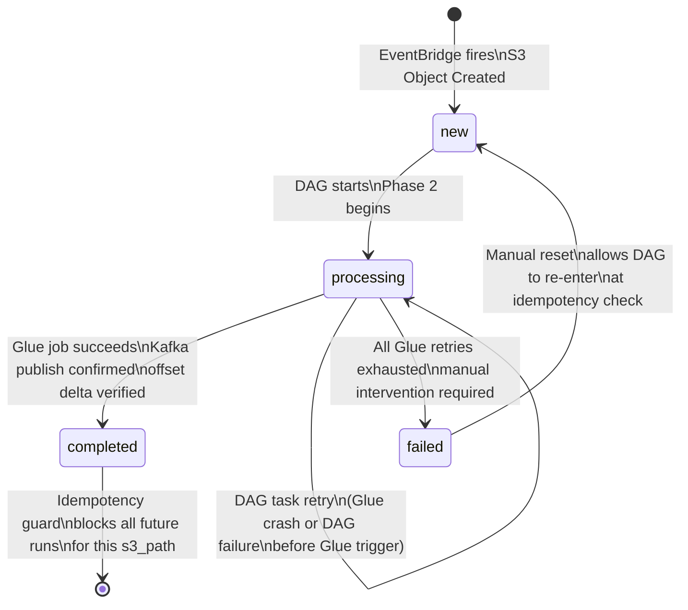
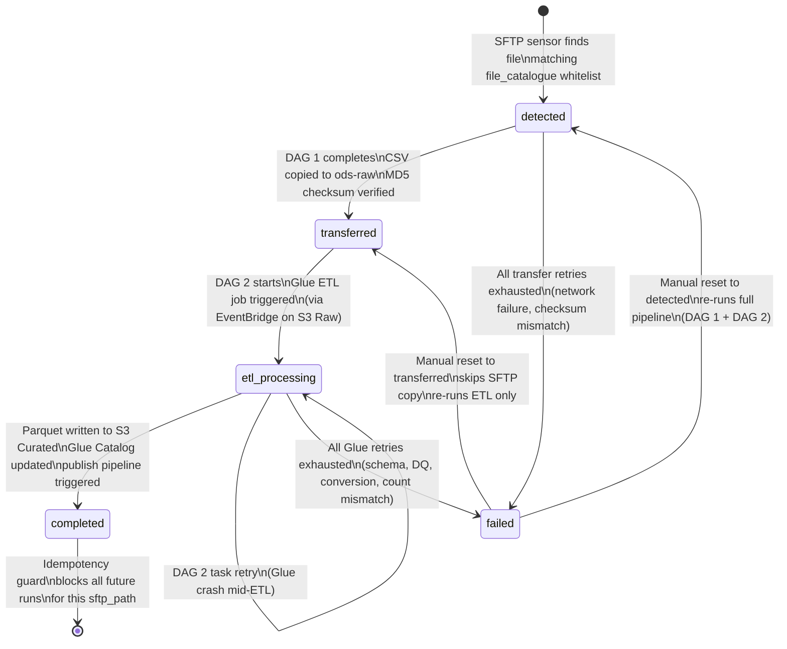

# ODS Platform — File State Machine Reference

**Date:** 2026-04-16
**Status:** Approved
**Scope:** `pipeline.file_state` (publish pipeline) and `pipeline.ingestion_file_state` (ingestion pipeline)

---

## Purpose

The ODS platform uses two separate PostgreSQL state tables as the primary idempotency mechanism. Every pipeline run checks and updates these tables to ensure a file is never processed twice — and that a file that has been fully processed is never silently reprocessed.

Getting the state wrong during a recovery operation corrupts the pipeline:

- Setting the wrong state can **unblock a file that should be blocked** (causing double-publish to Kafka) or **block a file that should be processed** (causing silent data loss).
- Updating the wrong table during an incident (ingestion vs publish) has no effect and leaves the actual stuck file unchanged while creating the illusion of action.

This document is the single reference for both state machines. Read it before touching either table in any environment.

---

## Critical Disambiguation

These are **two separate tables**. Do not update the wrong one during an incident.

| Pipeline | Table | Primary key | Keyed on |
|---|---|---|---|
| Publish pipeline (S3 → Kafka) | `pipeline.file_state` | `s3_path` | S3 Curated file path |
| Ingestion pipeline (SFTP → S3 → Glue ETL) | `pipeline.ingestion_file_state` | `sftp_path` | SFTP source file path |

To check which table to query: if the incident involves a file that should have been published to a Kafka topic, use `pipeline.file_state`. If the incident involves a file that should have been copied from SFTP or converted to Parquet, use `pipeline.ingestion_file_state`.

---

## State Machine 1 — Publish Pipeline (`pipeline.file_state`)

### Schema

```sql
CREATE TABLE pipeline.file_state (
    id           SERIAL PRIMARY KEY,
    s3_path      VARCHAR NOT NULL UNIQUE,  -- keyed on S3 Curated file path
    run_id       UUID NOT NULL,
    status       VARCHAR NOT NULL,         -- new | processing | completed | failed
    record_count INTEGER,
    error_reason VARCHAR,
    created_at   TIMESTAMP DEFAULT NOW(),
    updated_at   TIMESTAMP DEFAULT NOW()
);
```

### State definitions

| State | Meaning | Idempotency behaviour |
|---|---|---|
| `new` | File registered when EventBridge fires on S3 Object Created; pipeline may proceed | DAG proceeds to Phase 2 (config load, Glue trigger) |
| `processing` | DAG has started and set state before triggering the Glue job | DAG task retry is allowed and proceeds normally; a **second concurrent DAG run** for the same file is blocked |
| `completed` | Kafka publish confirmed and offset delta verified; state set in Phase 4 | All future DAG runs for this S3 path exit immediately — file will not be reprocessed unless manually reset |
| `failed` | Glue job exhausted all retries; pipeline cannot proceed automatically | DAG retry is allowed (the guard only blocks `completed`); manual intervention is required to investigate and reset |

### State diagram



### State transition notes

- The `processing` → `processing` self-transition represents DAG task retries (Airflow retry on Glue job crash or pre-Glue DAG failure). The idempotency guard sees `processing` and allows the retry to continue. A second **concurrent** DAG run triggered by a duplicate EventBridge event is also blocked at `processing` — it does not proceed.
- The `completed` state is permanent until manually reset. Re-placing the same Parquet file in S3 Curated will trigger EventBridge again, but the DAG will exit immediately at the idempotency check.
- Kafka transactions ensure that any mid-publish Glue crash leaves no partial data in the Kafka topic. The state remains `processing` after a crash — not `failed` — until all retries are exhausted.

---

## State Machine 2 — Ingestion Pipeline (`pipeline.ingestion_file_state`)

### Schema

```sql
CREATE TABLE pipeline.ingestion_file_state (
    id           SERIAL PRIMARY KEY,
    sftp_path    VARCHAR NOT NULL UNIQUE,  -- keyed on SFTP source file path
    run_id       UUID NOT NULL,
    status       VARCHAR NOT NULL,         -- detected | transferred | etl_processing | completed | failed
    record_count INTEGER,
    error_reason VARCHAR,
    created_at   TIMESTAMP DEFAULT NOW(),
    updated_at   TIMESTAMP DEFAULT NOW()
);
```

### State definitions

| State | Meaning | Idempotency behaviour |
|---|---|---|
| `detected` | SFTP sensor found a file matching the `file_catalogue` whitelist; entry created | DAG 1 (SFTP → S3 copy) proceeds |
| `transferred` | DAG 1 completed; CSV copied to `ods-raw-{env}` and MD5 checksum verified | DAG 2 (Glue ETL) may proceed; DAG 1 will not re-run for this path |
| `etl_processing` | DAG 2 has started; Glue ETL job triggered | DAG 2 task retry is allowed; a second concurrent DAG 2 run is blocked |
| `completed` | Parquet written to S3 Curated; Glue Data Catalog updated; publish pipeline triggered | All future processing for this SFTP path is blocked — file will not be re-ingested unless manually reset |
| `failed` | Any stage failed after all retries (transfer, checksum, schema, DQ, ETL) | Manual intervention required; DAG retry is allowed after reset |

### State diagram



### State transition notes

- The `detected` → `failed` path covers SFTP transfer failures and checksum mismatches. The original file remains on the SFTP server untouched.
- The `etl_processing` → `etl_processing` self-transition covers Glue job crashes mid-ETL. A partial Parquet may have landed in S3 Curated before the crash; this can trigger the publish pipeline prematurely. Because Kafka message keys are deterministic, a full re-publish after recovery safely overwrites any partially published records.
- The `completed` state sets off the handoff to the publish pipeline automatically — no explicit trigger is needed. A Parquet file landing in S3 Curated fires EventBridge, which triggers the publish pipeline's DAG.

---

## Recovery Reset Reference

Use this table to determine the correct reset state for each recovery scenario. Applying the wrong reset is a data integrity risk.

| Failure scenario | Pipeline | Table | Reset `status` to | Why | Source |
|---|---|---|---|---|---|
| Re-run ETL only — SFTP copy already succeeded, CSV is in S3 Raw | Ingestion | `pipeline.ingestion_file_state` | `transferred` | Skips DAG 1 (SFTP copy); DAG 2 re-runs Glue ETL from S3 Raw | `ingestion-failure-and-recovery.md §1.8` |
| Full reprocess from SFTP — CSV must be re-copied | Ingestion | `pipeline.ingestion_file_state` | `detected` | DAG 1 re-runs SFTP copy, then EventBridge fires DAG 2 automatically | `ingestion-failure-and-recovery.md §3.2` |
| Force reprocess a file already marked `completed` (ingestion) | Ingestion | `pipeline.ingestion_file_state` | `new` | Removes the completed guard; next SFTP sensor poll picks up the file and re-runs the full pipeline | `ingestion-failure-and-recovery.md §3.3` |
| Force reprocess a file already marked `completed` (publish) | Publish | `pipeline.file_state` | `new` | Removes the completed guard; next EventBridge trigger processes normally | `s3-kafka-failure-and-recovery.md §3.3` |
| Retry a failed Glue publish job | Publish | `pipeline.file_state` | `new` | Allows the DAG to re-enter at the idempotency check and proceed to Phase 2 | `s3-kafka-failure-and-recovery.md §2.4` |
| File stuck at `processing` after all retries exhausted | Publish | `pipeline.file_state` | `failed` then `new` | Must set `failed` first to break the processing lock and document the failure; then set `new` to allow retry. Setting `new` directly from `processing` skips the failure record. | `s3-kafka-failure-and-recovery.md §2.4` (gap — see note P2-2 below) |

### Note P2-2 — gap in source documentation

The source failure-and-recovery doc (`s3-kafka-failure-and-recovery.md §2.4`) describes a Glue job crash where state remains `processing` after all retries. The doc does not explicitly define the two-step reset procedure (`processing` → `failed` → `new`). The procedure above is derived from the intent: setting `new` directly from `processing` would suppress the failure record in `glue_job_log` context and bypass any alerting that checks for `failed` states. Always set `failed` first, then `new`. This gap should be addressed in a future revision of the failure-and-recovery doc.

---

## Key SQL Patterns

All queries below are parameterised for copy-paste use. Replace `{env}` with `dev`, `staging`, or `prod` as appropriate. These queries operate on the PostgreSQL database `ods_{env}`.

### Check current state for a specific file

**Publish pipeline:**

```sql
-- Check current publish state for a specific S3 file
SELECT
    s3_path,
    run_id,
    status,
    record_count,
    error_reason,
    created_at,
    updated_at
FROM pipeline.file_state
WHERE s3_path = 's3://ods-curated-prod/insurance/policies/date=2026-04-14/file.parquet';
```

**Ingestion pipeline:**

```sql
-- Check current ingestion state for a specific SFTP file
SELECT
    sftp_path,
    run_id,
    status,
    record_count,
    error_reason,
    created_at,
    updated_at
FROM pipeline.ingestion_file_state
WHERE sftp_path = '/outbound/insurance/policies/policies_2026-04-14.csv';
```

---

### Reset to a specific state

**Publish pipeline — reset to `new` (most common recovery reset):**

```sql
-- Reset a publish pipeline file for reprocessing
-- Use after root cause is resolved (schema updated, data fixed, etc.)
UPDATE pipeline.file_state
SET
    status       = 'new',
    error_reason = NULL,
    updated_at   = NOW()
WHERE s3_path = 's3://ods-curated-prod/insurance/policies/date=2026-04-14/file.parquet';
```

**Publish pipeline — force reprocess a completed file (use with caution in production):**

```sql
-- Force reprocess a completed publish file
-- WARNING: re-publishing overwrites existing Kafka records (last-write-wins by key).
-- Consumers must support idempotent updates before this is run in production.
UPDATE pipeline.file_state
SET
    status       = 'new',
    error_reason = 'manual_resubmit',
    updated_at   = NOW()
WHERE s3_path = 's3://ods-curated-prod/insurance/policies/date=2026-04-14/file.parquet';
```

**Ingestion pipeline — reset to `transferred` (re-run ETL only, skip SFTP copy):**

```sql
-- Reset an ingestion file to transferred
-- Use when CSV is confirmed in S3 Raw and only the Glue ETL needs to be re-run
UPDATE pipeline.ingestion_file_state
SET
    status       = 'transferred',
    error_reason = NULL,
    updated_at   = NOW()
WHERE sftp_path = '/outbound/insurance/policies/policies_2026-04-14.csv';
```

**Ingestion pipeline — reset to `detected` (full reprocess from SFTP copy):**

```sql
-- Reset an ingestion file to detected
-- Use when the CSV must be re-copied from SFTP (e.g. checksum mismatch, corrupt S3 copy)
-- File must still be present on the SFTP server
UPDATE pipeline.ingestion_file_state
SET
    status       = 'detected',
    error_reason = NULL,
    updated_at   = NOW()
WHERE sftp_path = '/outbound/insurance/policies/policies_2026-04-14.csv';
```

---

### Find all files stuck at `processing` older than 2 hours

A file stuck at `processing` for more than 2 hours indicates that all DAG retries have been exhausted without the state being updated to `failed`. This is an operational signal that requires investigation — it means the pipeline failed silently without setting a terminal state.

```sql
-- Publish pipeline: files stuck at processing for more than 2 hours
SELECT
    s3_path,
    run_id,
    status,
    error_reason,
    updated_at,
    NOW() - updated_at AS stuck_duration
FROM pipeline.file_state
WHERE status     = 'processing'
  AND updated_at < NOW() - INTERVAL '2 hours'
ORDER BY updated_at ASC;
```

```sql
-- Ingestion pipeline: files stuck at etl_processing for more than 2 hours
SELECT
    sftp_path,
    run_id,
    status,
    error_reason,
    updated_at,
    NOW() - updated_at AS stuck_duration
FROM pipeline.ingestion_file_state
WHERE status     = 'etl_processing'
  AND updated_at < NOW() - INTERVAL '2 hours'
ORDER BY updated_at ASC;
```

---

### Find all files in `failed` state from today

Use at the start of any incident investigation to establish the full scope of failures before attempting recovery.

```sql
-- Publish pipeline: all files failed today
SELECT
    s3_path,
    run_id,
    status,
    error_reason,
    created_at,
    updated_at
FROM pipeline.file_state
WHERE status     = 'failed'
  AND updated_at >= CURRENT_DATE
ORDER BY updated_at DESC;
```

```sql
-- Ingestion pipeline: all files failed today
SELECT
    sftp_path,
    run_id,
    status,
    error_reason,
    created_at,
    updated_at
FROM pipeline.ingestion_file_state
WHERE status     = 'failed'
  AND updated_at >= CURRENT_DATE
ORDER BY updated_at DESC;
```

---

## Related Documents

| Document | Relevance |
|---|---|
| `2026-04-14-s3-kafka-design.md` | Defines `pipeline.file_state` schema; describes all four pipeline phases |
| `2026-04-14-ingestion-design.md` | Defines `pipeline.ingestion_file_state` schema; describes ingestion phases |
| `2026-04-14-s3-kafka-failure-and-recovery.md` | Publish pipeline failure scenarios and resubmission procedures |
| `2026-04-14-ingestion-failure-and-recovery.md` | Ingestion pipeline failure scenarios and resubmission procedures |
| `2026-04-15-data-retention.md` | Retention policy for both state tables |
