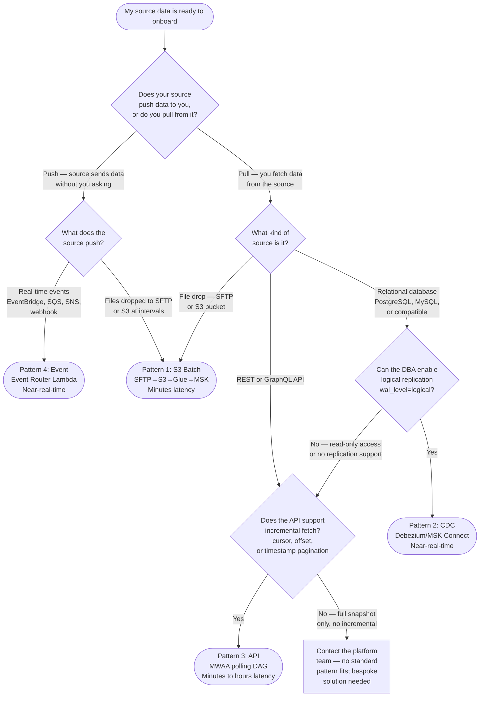

# ODS Platform — Ingestion Pattern Catalogue
**Date:** 2026-04-16
**Status:** Draft
**Scope:** All four ingestion patterns — reference for teams onboarding a new dataset

---

## 1. What is an ingestion pattern?

The ODS platform publishes data to Kafka (MSK) topics via a shared publish pipeline: once data lands in the S3 Curated Zone, a Glue job reads the Parquet files, validates the schema against the Glue Schema Registry, runs data quality checks, and publishes records to the appropriate `ods.{domain}.{dataset}` topic. This publish pipeline — including schema governance, the audit topic (`ods.pipeline.audit`), the S3 Dead Letter Queue, idempotency tracking, and CloudWatch observability — is the same regardless of where the data came from. It is defined in `2026-04-14-s3-kafka-design.md` and applies to every pattern on the platform.

What differs between patterns is the path data takes to reach S3 Curated. Each ingestion pattern is an answer to the question: "given where my source data lives and how it moves, how does it get into the curated zone?" Choosing a pattern is entirely about your source. Once data lands in S3 Curated, the platform takes over and the rest is identical.

---

## 2. Pattern at a glance — comparison table

| | Pattern 1: S3 Batch | Pattern 2: CDC | Pattern 3: API | Pattern 4: Event |
|---|---|---|---|---|
| **Source type** | Files on SFTP server | Relational database | REST/GraphQL API | Event stream (webhooks, queues) |
| **Example source** | Actuarial CSV exports from internal SFTP | PostgreSQL policy system | Partner API with cursor pagination | External webhook, SQS, EventBridge bus |
| **Delivery model** | Scheduled batch; files dropped at fixed intervals | Continuous; captures inserts, updates, deletes | Polled; cursor-based incremental fetch | Push; events arrive in real-time |
| **Typical latency** | Minutes (batch interval + 5-min SFTP poll) | Near-real-time (seconds per change) | Minutes to hours (poll interval) | Near-real-time (seconds per event) |
| **Format in** | CSV | PostgreSQL WAL (binary) | JSON (REST response) | JSON or Avro (source-defined) |
| **Format out (Kafka)** | Avro | **JSON** (Debezium envelope) | JSON Schema | Avro |
| **Schema registry** | Glue Schema Registry | **None** (governed by PostgreSQL DDL) | Glue Schema Registry | Glue Schema Registry |
| **Schema compatibility mode** | `BACKWARD` | N/A | `BACKWARD` | `FULL` |
| **Idempotency mechanism** | File path + state table (`ingestion_file_state`) | LSN position | API cursor + state table (`api_source_catalogue`) | Event ID + state table (`event_source_catalogue`) |
| **GDPR erasure** | Crypto-shredding | Tombstone message | Crypto-shredding | Tombstone message |
| **Implementation status** | ✅ Designed and being built | 🔵 In design (Phase 6) | 🔵 In design (Phase 9) | 🔵 In design (Phase 10) |
| **Design document** | `2026-04-14-s3-kafka-design.md` + `2026-04-14-ingestion-design.md` | TBD | TBD | TBD |

---

## 3. Pattern details

### Pattern 1: S3 Batch

**When to use this pattern:**
- Your source system writes files (CSV, delimited text) to an SFTP server at a predictable interval — daily, hourly, or on a schedule you control
- You need a permanent raw archive of every file received, enabling full replay without coordinating with the upstream team
- Your dataset is batch-oriented and does not require latency below a few minutes

**When NOT to use this pattern:**
- Your source is a relational database where you need to capture individual row changes (use Pattern 2 instead)
- Your source is an API that does not write files (use Pattern 3 instead)

**How data flows:**

```
SFTP Server
    │
    │  MWAA DAG 1 (SFTPToS3Operator)
    │  polls every 5 minutes
    ▼
ods-raw-{env}   ← permanent archive of every CSV file
    │
    │  EventBridge: S3 Raw Object Created → triggers DAG 2
    ▼
MWAA DAG 2 → Glue ETL Job
    │  schema validation (Glue Schema Registry)
    │  data quality checks (DQDL)
    │  CSV → Parquet conversion
    ▼
ods-curated-{env}
    │
    │  EventBridge: S3 Curated Object Created → triggers Publish DAG
    ▼
MWAA Publish DAG → Glue Publish Job
    │  schema validation + DQ
    │  deterministic message keys (SHA256 of key_fields)
    │  Kafka transactions, acks=all
    ▼
MSK: ods.{domain}.{dataset}
```

**Key components unique to this pattern:**
- MWAA SFTP Sensor (`SFTPToS3Operator`) — polls for new files, transfers to S3 Raw
- `pipeline.ingestion_file_state` — per-file processing state table
- `pipeline.file_catalogue` — approved file whitelist; unapproved files are quarantined
- `ods-raw-{env}` — permanent archive bucket
- `ods-quarantine-{env}` — destination for unapproved or corrupt files
- Two Glue jobs per dataset: `ods-ingestion-{dataset}` (ETL) and `ods-s3-publish-{dataset}` (publish)
- Two EventBridge rules: `ods-raw-file-rule-{env}` (triggers DAG 2) and `ods-curated-file-rule-{env}` (triggers Publish DAG)

**Known constraints and trade-offs:**
- Latency is bounded below by the SFTP poll interval (default 5 minutes) plus Glue startup time (~3 minutes cold start) — the minimum realistic end-to-end latency is 8–10 minutes
- MWAA workers are on the critical path for both DAGs; worker saturation queues files and degrades latency
- SFTP network connectivity from MWAA is an unresolved infrastructure dependency (decision D1) — Phase 3 cannot start until this is resolved
- No backpressure: if many files arrive simultaneously, EventBridge fires once per file and all DAG runs queue simultaneously

**Onboarding guide:** `2026-04-15-dataset-onboarding.md` §3 — SFTP/S3 batch dataset onboarding

**Status:** Designed and under active development (Phase 3). The first dataset (`insurance/policies`) is the platform reference implementation.

---

### Pattern 2: CDC

**When to use this pattern:**
- Your source is a relational database (PostgreSQL or compatible) and you need to capture individual row changes — inserts, updates, and deletes — as they happen
- You need near-real-time latency (seconds, not minutes) and your downstream consumers need to process changes in the order they occurred
- Your source database DBA team can enable logical replication (`wal_level=logical`) and create a replication slot and publication

**When NOT to use this pattern:**
- Your source is a file drop or bulk export (use Pattern 1 instead) — CDC from a database that only provides daily dumps is not viable
- Your source database cannot support a persistent replication slot (risk of WAL accumulation if the connector pauses)

**How data flows:**

```
Source PostgreSQL DB
    │  WAL (Write-Ahead Log) with wal_level=logical
    │
    ▼
Debezium Connector (MSK Connect)
    │  reads replication slot
    │  captures INSERT / UPDATE / DELETE as JSON change events (Debezium envelope)
    │  tracks LSN position for idempotency
    ▼
MSK: ods.{domain}.{dataset}.cdc
    │  JSON format — Debezium envelope (before / after / op / source / ts_ms)
    │  No schema registry — schema governed by PostgreSQL DDL
    │  cleanup.policy=compact,delete
    ▼
(Shared publish pipeline not applicable — CDC publishes directly to MSK)
```

> Note: CDC is the only pattern where data does not pass through S3 Curated before reaching MSK, and the only pattern where JSON is used instead of Avro. The connector publishes directly. The shared governance components (audit topic, DLQ) still apply. Schema Registry does not apply to CDC topics. See `2026-04-16-cdc-technology-evaluation.md` for format rationale.

**Key components unique to this pattern:**
- MSK Connect cluster with Debezium PostgreSQL connector plugin
- Source DB replication slot and publication (DBA team action)
- `pipeline.cdc_source_catalogue` — connector state and configuration registry
- Connector configuration JSON in `ods-config-{env}/{domain}/{dataset}-cdc-connector.json`
- CDC-specific CloudWatch metrics scraped from Debezium JMX: `cdc.connector.lsn.lag.seconds`, `cdc.connector.status`, `cdc.replication.slot.lag.bytes`
- Initial snapshot required before live CDC stream begins

**Known constraints and trade-offs:**
- The source database DBA must maintain the replication slot. If the Debezium connector pauses for an extended period, WAL accumulates on the source DB and can cause disk exhaustion — this is a P1 risk
- Schema changes to source tables are detected automatically (`cdc.schema.change.detected` alarm fires) but require manual schema governance review before downstream consumers can be updated; the pipeline must not be assumed safe until that review is complete
- Tombstone messages represent deletes — consumers must be built to handle null-value messages. `FULL` compatibility mode means both producers and consumers must remain compatible across schema versions simultaneously
- CDC connector technology evaluated — see [2026-04-16-cdc-technology-evaluation.md](2026-04-16-cdc-technology-evaluation.md). Recommendation is MSK Connect + Debezium. Decision D-CDC open; this gates Phase 6.

**Onboarding guide:** TBD — design not yet started. See `2026-04-15-dataset-onboarding.md` §4 (placeholder) when available.

**Status:** In design (Phase 6). Depends on Phase 4 (observability) and Phase 5 (security hardening) being substantially complete, and D-CDC (CDC technology choice) being resolved. No detailed design document exists yet.

---

### Pattern 3: API

**When to use this pattern:**
- Your source exposes a REST or GraphQL API that supports incremental fetching — cursor-based, offset-based, or timestamp-based pagination
- Your source does not write files and does not expose database replication
- You can tolerate polling latency (minutes to hours depending on poll interval); you do not need sub-minute freshness

**When NOT to use this pattern:**
- Your source pushes events to you in real time (use Pattern 4 instead)
- Your source is a database you can connect to directly (use Pattern 2 instead — polling an API in front of a database is less reliable and more expensive than CDC)

**How data flows:**

```
Partner REST API / Internal GraphQL endpoint
    │
    ▼
MWAA API Ingest DAG (ods_api_ingest.py)
    │  cursor-based pagination (cursor persisted in api_source_catalogue)
    │  rate-limit retry with exponential backoff on HTTP 429
    │  idempotency: cursor-based — does not re-fetch already-fetched window
    ▼
(Optional) Glue transform job
    │  JSON → Parquet conversion (if volume warrants Glue; small volumes may stay in DAG)
    ▼
ods-curated-{env}
    │
    │  EventBridge: S3 Curated Object Created → triggers Publish DAG
    ▼
MWAA Publish DAG → Glue Publish Job → MSK: ods.{domain}.{dataset}
```

**Key components unique to this pattern:**
- MWAA API Ingest DAG (`ods_api_ingest.py`) — parameterised per dataset; handles pagination, rate limiting, and cursor persistence
- `pipeline.api_source_catalogue` — per-dataset cursor state, last successful fetch window, API configuration
- API dataset YAML config (template in `2026-04-15-dataset-onboarding.md` §8.2)
- API-specific CloudWatch metrics: `api.fetch.duration.ms`, `api.records.fetched`, `api.pagination.pages`, `api.rate.limit.hit`, `api.cursor.drift.seconds`

**Known constraints and trade-offs:**
- Latency is fundamentally bounded by the poll interval — a dataset polled every 30 minutes has at minimum 30-minute latency; use Pattern 4 if the source can push events instead
- API rate limits are a hard ceiling on throughput; a large backfill after an outage will hit the rate limit and slow recovery
- Cursor regression — if the cursor state is lost or reset, the DAG may re-fetch an overlapping window and produce duplicate records (idempotency layer at the consumer level mitigates this but does not prevent it)

**Onboarding guide:** TBD — design not yet started.

**Status:** In design (Phase 9). Depends on Phase 6 (CDC pattern) being complete. No detailed design document exists yet.

---

### Pattern 4: Event

**When to use this pattern:**
- Your source application pushes events to a message bus — EventBridge, SQS, SNS, or a webhook endpoint — in real time
- Events are discrete, immutable facts about something that happened (e.g. `PolicyRenewed`, `ClaimSubmitted`) with a unique `event_id`
- The source application can provide per-aggregate sequence numbers and optionally heartbeat events to signal liveness

**When NOT to use this pattern:**
- Your source does not push events; you must poll it (use Pattern 3 instead)
- Your source is a relational database — use Pattern 2 rather than adding an event-emitting layer in front of it unless that layer already exists and is the authoritative source of truth

**How data flows:**

```
Source Application
    │  emits events to EventBridge rule, SNS topic, or SQS queue
    ▼
Event Router Lambda (ods_event_router.py)
    │  schema validation against Glue Schema Registry
    │  deduplication via event_id + event_source_catalogue
    │  deterministic Kafka message key from key_fields
    │  sequence gap detection (emits event.sequence.gap metric)
    │  lineage headers: x-ods-source-type: event, x-ods-source-ref: {event_type}#{event_id}
    ▼
MSK: ods.{domain}.{dataset}
    │  FULL schema compatibility mode
    │  cleanup.policy=compact,delete (tombstone for deletes)
    │
pipeline.lineage ← written by Lambda after confirmed publish
```

**Key components unique to this pattern:**
- Event Router Lambda (`lambda/ods_event_router.py`) — replaces the MWAA DAG + Glue job combination used by Patterns 1 and 3; events are processed in real time as they arrive
- EventBridge rule or SNS subscription for the source event type
- `pipeline.event_source_catalogue` — per-source-application event routing configuration
- Heartbeat monitoring — each configured event type has an expected heartbeat interval; `event.heartbeat.missing` alarm fires if the source goes silent
- Sequence gap detector — tracks per-aggregate sequence numbers; `event.sequence.gap` alarm fires on gaps
- Event-specific CloudWatch metrics: `event.sequence.gap`, `event.arrival.rate`, `event.heartbeat.missing`, `event.duplicate.count`, `event.publish.latency.ms`, `event.dlq.count`

**Known constraints and trade-offs:**
- The source application team must confirm three capabilities before onboarding begins: unique `event_id` per event, per-aggregate sequence numbers, and heartbeat event support. Missing any of these makes idempotency and gap detection unreliable
- `FULL` schema compatibility mode means neither producers nor consumers can make incompatible schema changes independently; coordinate schema changes across both teams
- Unlike Patterns 1 and 3, there is no S3 Curated intermediate store — events go directly to Kafka via Lambda, so there is no raw archive. Replay requires re-emitting from the source application or consuming from the Kafka topic within its retention window

**Onboarding guide:** TBD — design not yet started.

**Status:** In design (Phase 10). Depends on Phase 6 (CDC pattern) being complete, and the source application team confirming event_id uniqueness, sequence numbers, and heartbeat support. No detailed design document exists yet.

---

## 4. How to choose a pattern — decision tree



**Notes on the decision tree:**
- If your database exposes an API layer but you have direct DB access, prefer Pattern 2. CDC is more reliable, lower latency, and captures deletes natively. An API poll in front of a database adds a layer of complexity with no benefit.
- If your source pushes files to SFTP but also exposes an API, use Pattern 1. File-based transfer is simpler to operate and gives you a permanent raw archive.
- If you are unsure whether your source qualifies for Pattern 4, ask the source application team: "Do your events have unique IDs, and can you emit a heartbeat event every few minutes?" If the answer to either question is no, Pattern 4 requires additional source-side work before onboarding can begin.

---

## 5. Shared components — all patterns

Every pattern inherits the following platform components. You do not configure or deploy these per dataset; they are shared infrastructure.

| Component | What it does | Where defined |
|---|---|---|
| S3 Curated Zone (`ods-curated-{env}`) | Handoff point between ingestion and the publish pipeline. Patterns 1 and 3 write Parquet here; the Publish DAG reads from here. Patterns 2 and 4 bypass this and publish to MSK directly via connector or Lambda. | `2026-04-14-s3-kafka-design.md` |
| Publish pipeline | MWAA DAG + Glue job that reads Parquet from S3 Curated, validates schema, runs DQ checks, generates deterministic message keys, and writes to MSK with Kafka transactions. Shared by Patterns 1 and 3. | `2026-04-14-s3-kafka-design.md` |
| Glue Schema Registry (`ods-schema-registry-{env}`) | Validates and versions all schemas before any record reaches Kafka. Compatible changes auto-register; breaking changes route records to the DLQ and raise an alarm. Compatibility mode is set per pattern (see Section 2). | `2026-04-15-schema-governance.md` |
| `ods.pipeline.audit` Kafka topic | Immutable audit trail for all pipeline events — success, failure, and DLQ writes. Sinked to `ods-audit-sink-{env}` via Kafka Connect for long-term Athena queryability. | `2026-04-14-architecture-decisions.md §1.9` |
| S3 DLQ (`ods-dlq-{env}`) | Dead-letter storage for records that fail schema validation, DQ hard-block rules, or count reconciliation. Partitioned by failure type, date, topic, and run_id to enable Athena investigation. Replay is a manual engineer action — fix root cause first. | `2026-04-14-architecture-decisions.md §1.7` |
| PostgreSQL state store (`ods_{env}`) | Idempotency tracking, file and event processing state, job execution audit log, and reconciliation log. Table names vary by pattern: `file_state` and `ingestion_file_state` (Pattern 1), `api_source_catalogue` (Pattern 3), `event_source_catalogue` (Pattern 4). CDC (Pattern 2) uses LSN position in the connector state rather than a PostgreSQL table. | `2026-04-14-architecture-decisions.md §1.5–1.6` |
| CloudWatch observability | Metrics in namespace `ods/{env}`, structured JSON logs, CloudWatch alarms, and three dashboards (Platform Health, Pipeline Drill-Down, Infrastructure). Alarm names and metric names differ per pattern — see Section 3 details above. | `2026-04-15-observability.md` |
| `pipeline.glue_job_log` | INSERT-only job execution audit table. Records every status transition for every Glue job run. Queryable by `run_id`, `dataset`, `business_date`, or `status`. Primary trace store for Patterns 1 and 3. | `2026-04-14-architecture-decisions.md §1.11` |
| `pipeline.schema_governance` | Authoritative registry of all topics, owners, compatibility modes, PII classification, and deprecation status. Every topic on the platform must have an entry before going to staging or prod. | `2026-04-15-schema-governance.md §12` |

---

## 6. Open items

The following items are outstanding and affect one or more patterns. Teams should not begin detailed design for Patterns 2–4 until the relevant decisions are resolved.

| Item | Affects | Decision | Status |
|---|---|---|---|
| SFTP → MWAA network connectivity | Pattern 1 (Phase 3 start) | D1 | Unresolved — infrastructure team |
| CDC connector technology | Pattern 2 (Phase 6 start) | D-CDC | Evaluation complete. Recommendation: MSK Connect + Debezium. See [cdc-technology-evaluation.md](2026-04-16-cdc-technology-evaluation.md). Decision open. |
| GDPR erasure strategy per dataset | All patterns (Phase 5) | D3 | Not yet made — DPO |
| Data classification exercise | All patterns (Phase 5) | D4 | Not started — Data Governance |
| CDC, API, and Event detailed design documents | Patterns 2, 3, 4 | — | Not started; planned post-Phase 4 |
| Dataset onboarding guide sections for Patterns 2–4 | Patterns 2, 3, 4 | — | `2026-04-15-dataset-onboarding.md` §4–9 are placeholders |
