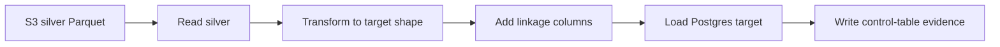
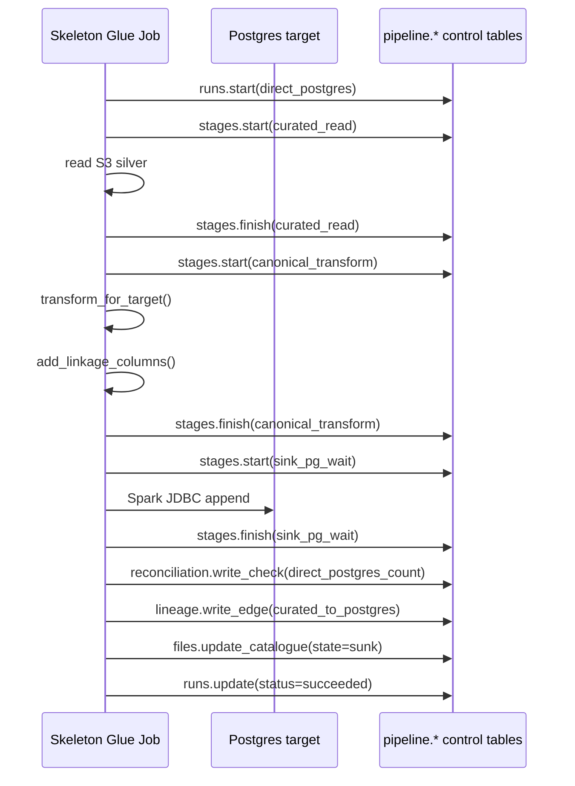

# Silver to Postgres Control-Table Skeleton

This example is for developers who need to understand the minimum control-table writes around a direct Postgres load.

It starts from **silver/curated S3**. It does not show raw file ingestion.

Code: [direct_postgres_control_table_skeleton.py](direct_postgres_control_table_skeleton.py)

## Process Flow



## Control-Table Flow



## What The Code Demonstrates

| Function | Purpose |
|---|---|
| `read_silver` | Reads silver/curated Parquet from S3. |
| `transform_for_target` | Applies a small target-shape projection. Empty expressions mean identity transform. |
| `add_linkage_columns` | Ensures target rows carry `_ods_file_id`, `_ods_run_id`, business date, domain, and dataset. |
| `write_postgres` | Appends rows to the target table using Spark JDBC. |
| `mark_success` | Writes reconciliation, lineage, file state, and terminal run state. |

## Minimum Inputs

```text
--domain insurance
--dataset country_codes
--business_date 2026-05-21
--file_id <original-file-id-from-file_catalogue>
--s3_silver_path s3://ods-curated/insurance/country_codes/date=20260521/
--postgres_target_table ods.insurance_country_code
```

For a non-canonical transform, pass one `--select_expr` per target column:

```text
--select_expr "RskID AS risk_id"
--select_expr "PolNo AS policy_id"
--select_expr "cast(ExposureAmt as double) AS exposure_amount"
--select_expr "to_date(AsOfDt, 'yyyyMMdd') AS as_of_date"
```

## Linkage Rule

```text
_ods_file_id = original source file id from pipeline.file_catalogue
_ods_run_id  = this direct_postgres load run id
```

Those two fields let a target row join back to the control tables.
